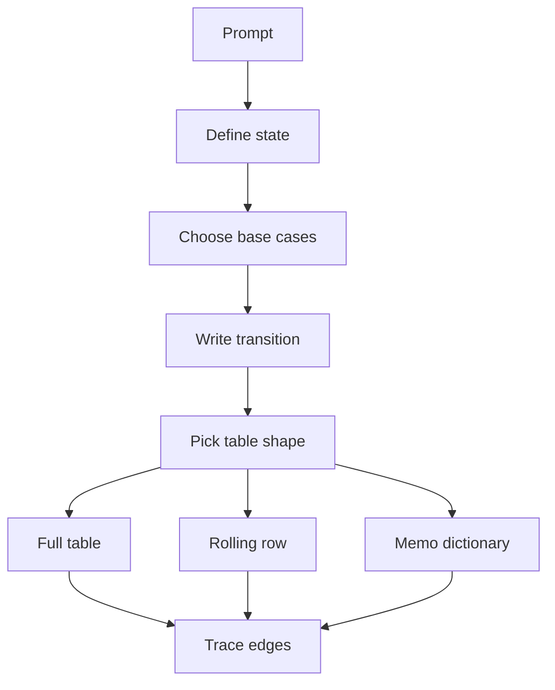

This workbook treats dynamic programming as a sequence of state definitions, not as a second theory course. Each worked problem states the state, the transition, and the C# representation that keeps the code small enough to write correctly under interview pressure.

## C# mechanics for DP

For dense tables, `int[,]` is compact and convenient with `dp[i, j]`, but jagged arrays such as `int[][]` often run faster in .NET hot loops because each row is a normal one-dimensional array. Use `int[,]` when clarity of a rectangular table matters, and use jagged arrays or one-dimensional rolling arrays when the loop is performance-sensitive. Rolling arrays are the default optimization when a transition reads only the previous row, previous column, or previous two scalar states.

| DP need | C# representation | Interview note |
|---|---|---|
| Dense rectangular table | `var dp = new int[m, n];` | One object and clear indices, but `GetLength` and multidimensional access add overhead |
| Fast row-major grid | `var dp = new int[m][];` | More allocations, often faster row indexing |
| Rolling row | `var dp = new int[n + 1];` | Best when row `i` only needs row `i - 1` |
| Sparse memo | `Dictionary<(int i, int j), int>` | `ValueTuple` keys use structural equality and hashing |
| Negative infinity | `const int NegInf = int.MinValue / 4;` | Avoid adding to `int.MinValue`, which can overflow |



> [!KEY]
> A DP solution is not ready until you can say what one cell means in plain English. The code follows from that sentence.

In C#, the table shape should be chosen after the dependency shape is known. If a state reads only two previous scalar states, an array is unnecessary. If it reads the previous row and the current row's left neighbor, one rolling row is enough. If it reads arbitrary future-looking intervals, keep the full table. For top-down solutions, prefer an array memo when dimensions are small and dense; prefer `Dictionary<(int,int), int>` when many states are impossible or when one dimension is not naturally bounded. This choice is part of the complexity answer, not just syntax.

Before optimizing space, prove the uncompressed transition. Interviewers are comfortable with a full table first because it exposes dependencies clearly. After that, you can say which dimensions are no longer needed. If a recurrence reads `dp[i - 1][j]`, `dp[i][j - 1]`, and `dp[i - 1][j - 1]`, one row plus a diagonal scalar is safe. If it reads `dp[i + 1][j - 1]` or arbitrary splits, compression is usually not worth attempting in a timed round. Clarity beats a fragile space trick.

Also state whether the output size is part of the memory. Most DP methods return one number or boolean, so the DP table is auxiliary space. If a reconstruction path or all combinations are returned, that output can dominate and should be excluded or reported separately.

## Full worked problems

The selected problems move from one-dimensional decisions to strings, grids, intervals, and graph-shaped memoization. Read each section as a state-design drill: the first sentence names the state, the code then shows how to store it compactly. Several examples use one-dimensional arrays even when the conceptual recurrence is two-dimensional; this is deliberate, because rolling-state explanations are common follow-up questions.

### House Robber II

The circular street means the first and last houses cannot both be robbed. Split it into two ordinary linear robberies: exclude the last house, or exclude the first house.

```csharp
public int Rob(int[] nums) {
    if (nums.Length == 1) return nums[0];
    return Math.Max(RobRange(0, nums.Length - 2),
                    RobRange(1, nums.Length - 1));

    int RobRange(int lo, int hi) {
        int prev2 = 0, prev1 = 0;
        for (int i = lo; i <= hi; i++) {
            int current = Math.Max(prev1, prev2 + nums[i]);
            prev2 = prev1;
            prev1 = current;
        }
        return prev1;
    }
}
```

Complexity: `O(n)` time for two scans and `O(1)` space.

### Maximum Product Subarray

A negative number can turn the smallest product into the largest product. Track both the maximum and minimum product ending at the current index.

```csharp
public int MaxProduct(int[] nums) {
    int best = nums[0];
    int maxEnding = nums[0], minEnding = nums[0];
    for (int i = 1; i < nums.Length; i++) {
        int a = maxEnding * nums[i];
        int b = minEnding * nums[i];
        maxEnding = Math.Max(nums[i], Math.Max(a, b));
        minEnding = Math.Min(nums[i], Math.Min(a, b));
        best = Math.Max(best, maxEnding);
    }
    return best;
}
```

Complexity: `O(n)` time and `O(1)` space.

### Decode Ways

Let `dp[i]` be the ways to decode the first `i` characters. Each step can use a valid one-digit code or a valid two-digit code from the previous two positions.

```csharp
public int NumDecodings(string s) {
    int prev2 = 1;
    int prev1 = s[0] == '0' ? 0 : 1;
    for (int i = 2; i <= s.Length; i++) {
        int current = 0;
        if (s[i - 1] != '0') current += prev1;
        int value = (s[i - 2] - '0') * 10 + (s[i - 1] - '0');
        if (value >= 10 && value <= 26) current += prev2;
        prev2 = prev1;
        prev1 = current;
    }
    return prev1;
}
```

Complexity: `O(n)` time and `O(1)` space.

### Word Break

`dp[i]` means the prefix `s[0..i)` can be segmented. The inner loop tries the last word ending at `i`; a `HashSet<string>` makes dictionary lookup cheap, but `Substring` still allocates.

```csharp
public bool WordBreak(string s, IList<string> wordDict) {
    var words = new HashSet<string>(wordDict);
    var dp = new bool[s.Length + 1];
    dp[0] = true;

    for (int end = 1; end <= s.Length; end++) {
        for (int start = 0; start < end; start++) {
            if (dp[start] && words.Contains(s.Substring(start, end - start))) {
                dp[end] = true;
                break;
            }
        }
    }
    return dp[s.Length];
}
```

Complexity: `O(n^2 * L)` time because substrings have length cost, and `O(n + D)` space.

### Longest Increasing Subsequence

The `O(n^2)` DP is easiest to explain, but the interview version often expects the `tails` array: `tails[len]` is the smallest possible tail for an increasing subsequence of length `len + 1`.

```csharp
public int LengthOfLIS(int[] nums) {
    var tails = new List<int>();
    foreach (int x in nums) {
        int lo = 0, hi = tails.Count;
        while (lo < hi) {
            int mid = lo + (hi - lo) / 2;
            if (tails[mid] < x) lo = mid + 1;
            else hi = mid;
        }
        if (lo == tails.Count) tails.Add(x);
        else tails[lo] = x;
    }
    return tails.Count;
}
```

Complexity: `O(n log n)` time and `O(n)` space.

### Coin Change

`dp[amount]` stores the fewest coins needed for that amount. The sentinel `amount + 1` is safe because no optimal answer can use more than `amount` positive coins.

```csharp
public int CoinChange(int[] coins, int amount) {
    var dp = new int[amount + 1];
    Array.Fill(dp, amount + 1);
    dp[0] = 0;

    for (int value = 1; value <= amount; value++) {
        foreach (int coin in coins) {
            if (coin <= value)
                dp[value] = Math.Min(dp[value], dp[value - coin] + 1);
        }
    }
    return dp[amount] > amount ? -1 : dp[amount];
}
```

Complexity: `O(amount * coins.Length)` time and `O(amount)` space.

### Partition Equal Subset Sum

The problem becomes subset sum for `total / 2`. Iterate capacities downward so each number is used at most once.

```csharp
public bool CanPartition(int[] nums) {
    int total = 0;
    foreach (int x in nums) total += x;
    if ((total & 1) == 1) return false;

    int target = total / 2;
    var dp = new bool[target + 1];
    dp[0] = true;
    foreach (int num in nums) {
        for (int sum = target; sum >= num; sum--)
            dp[sum] = dp[sum] || dp[sum - num];
    }
    return dp[target];
}
```

Complexity: `O(n * target)` time and `O(target)` space.

### Maximal Square

`dp[j]` is the previous row's value until it is overwritten. The extra `prev` variable carries the old diagonal `dp[i - 1][j - 1]`.

```csharp
public int MaximalSquare(char[][] matrix) {
    int rows = matrix.Length, cols = matrix[0].Length, best = 0;
    var dp = new int[cols + 1];

    for (int r = 0; r < rows; r++) {
        int diagonal = 0;
        for (int c = 1; c <= cols; c++) {
            int up = dp[c];
            dp[c] = matrix[r][c - 1] == '1'
                ? 1 + Math.Min(diagonal, Math.Min(dp[c], dp[c - 1]))
                : 0;
            best = Math.Max(best, dp[c]);
            diagonal = up;
        }
    }
    return best * best;
}
```

Complexity: `O(m * n)` time and `O(n)` space.

### Longest Common Subsequence

`dp[j]` represents the previous row until updated, and `left` is available as `dp[j - 1]`. The diagonal value must be saved before overwriting.

```csharp
public int LongestCommonSubsequence(string text1, string text2) {
    int m = text1.Length, n = text2.Length;
    var dp = new int[n + 1];

    for (int i = 1; i <= m; i++) {
        int diagonal = 0;
        for (int j = 1; j <= n; j++) {
            int up = dp[j];
            if (text1[i - 1] == text2[j - 1])
                dp[j] = diagonal + 1;
            else
                dp[j] = Math.Max(dp[j], dp[j - 1]);
            diagonal = up;
        }
    }
    return dp[n];
}
```

Complexity: `O(m * n)` time and `O(n)` space, with the shorter string as columns when optimizing.

### Edit Distance

The state is the minimum edits to transform two prefixes. Insert reads left, delete reads up, and replace reads the diagonal.

```csharp
public int MinDistance(string word1, string word2) {
    int m = word1.Length, n = word2.Length;
    var dp = new int[n + 1];
    for (int j = 0; j <= n; j++) dp[j] = j;

    for (int i = 1; i <= m; i++) {
        int diagonal = dp[0];
        dp[0] = i;
        for (int j = 1; j <= n; j++) {
            int up = dp[j];
            dp[j] = word1[i - 1] == word2[j - 1]
                ? diagonal
                : 1 + Math.Min(diagonal, Math.Min(dp[j], dp[j - 1]));
            diagonal = up;
        }
    }
    return dp[n];
}
```

Complexity: `O(m * n)` time and `O(n)` space.

### Burst Balloons

The recurrence is easier if you choose the last balloon popped inside an interval. Sentinels with value `1` make edge multiplication uniform.

```csharp
public int MaxCoins(int[] nums) {
    int n = nums.Length;
    var values = new int[n + 2];
    values[0] = values[n + 1] = 1;
    for (int i = 0; i < n; i++) values[i + 1] = nums[i];

    var dp = new int[n + 2, n + 2];
    for (int len = 2; len < n + 2; len++) {
        for (int left = 0; left + len < n + 2; left++) {
            int right = left + len;
            for (int last = left + 1; last < right; last++) {
                int coins = dp[left, last] + values[left] * values[last] * values[right]
                          + dp[last, right];
                dp[left, right] = Math.Max(dp[left, right], coins);
            }
        }
    }
    return dp[0, n + 1];
}
```

Complexity: `O(n^3)` time and `O(n^2)` space.

### Longest Increasing Path in a Matrix

This is top-down DP on a directed acyclic graph created by strict increasing edges. Memoize the best path starting at each cell.

```csharp
private static readonly int[] Dr = { -1, 1, 0, 0 };
private static readonly int[] Dc = { 0, 0, -1, 1 };
private int[][] _matrix = Array.Empty<int[]>();
private int[,] _memo = new int[0, 0];

public int LongestIncreasingPath(int[][] matrix) {
    _matrix = matrix;
    _memo = new int[matrix.Length, matrix[0].Length];
    int best = 0;
    for (int r = 0; r < matrix.Length; r++)
        for (int c = 0; c < matrix[0].Length; c++)
            best = Math.Max(best, Dfs(r, c));
    return best;
}

private int Dfs(int r, int c) {
    if (_memo[r, c] != 0) return _memo[r, c];
    int best = 1;
    for (int k = 0; k < 4; k++) {
        int nr = r + Dr[k], nc = c + Dc[k];
        if (nr >= 0 && nr < _matrix.Length && nc >= 0 && nc < _matrix[0].Length && _matrix[nr][nc] > _matrix[r][c])
            best = Math.Max(best, 1 + Dfs(nr, nc));
    }
    return _memo[r, c] = best;
}
```

Complexity: `O(m * n)` time and `O(m * n)` space for memo plus recursion stack.

> [!WARNING]
> In one-dimensional knapsack, loop direction changes the problem. Descending capacity means each item is used once; ascending capacity permits unlimited reuse.

## Reference table for the remaining problems

The remaining prompts are still valuable, but they are variants of the state patterns above. Use the cue column to identify the state quickly. When practicing, cover the technique column and force yourself to say the state and loop direction before looking at the answer. That habit catches most DP mistakes earlier than running code does.

| Problem | Identifying cue | Technique | Time | Space |
|---|---|---|---|---|
| Climbing Stairs | One or two steps | Fibonacci rolling variables | `O(n)` | `O(1)` |
| Min Cost Climbing Stairs | Pay when standing on a step | Rolling minimum of previous two positions | `O(n)` | `O(1)` |
| Fibonacci Forms | Show memo and tabulation | Compare top-down, bottom-up, rolling | `O(n)` | `O(n)` or `O(1)` |
| House Robber | Take or skip adjacent houses | Two scalar rolling maximums | `O(n)` | `O(1)` |
| Maximum Subarray | Best contiguous sum | Kadane restart or extend | `O(n)` | `O(1)` |
| Coin Change II | Count combinations | Outer loop over coins, inner amount ascending | `O(n * amount)` | `O(amount)` |
| Stock With Cooldown | Holding, free, cooldown states | Three-state machine DP | `O(n)` | `O(1)` |
| Unique Paths | Move right or down | Rolling row of path counts | `O(mn)` | `O(n)` |
| Unique Paths II | Obstacles zero cells | Same rolling row with blocked resets | `O(mn)` | `O(n)` |
| Minimum Path Sum | Grid cost minimization | `grid[r][c] + min(up,left)` | `O(mn)` | `O(n)` |
| Longest Palindromic Subsequence | Interval inside a string | Fill by increasing length | `O(n^2)` | `O(n^2)` |
| Target Sum | Assign plus or minus | Convert to subset count | `O(n * target)` | `O(target)` |
| 0/1 Knapsack | Capacity and each item once | Descending capacity update | `O(nW)` | `O(W)` |
| Distinct Subsequences | Count ways one string forms another | Reverse 1-D update over target | `O(mn)` | `O(n)` |
| Interleaving String | Merge two strings preserving order | 1-D boolean over prefixes | `O(mn)` | `O(n)` |
| Regular Expression Matching | `.` and `*` full match | 2-D pattern DP with zero or many | `O(mn)` | `O(mn)` |
| Wildcard Matching | `?` and `*` full match | Star consumes empty or one more char | `O(mn)` | `O(mn)` |

## Cheat sheet

- State definition first: `dp[i]` or `dp[i,j]` must have a precise sentence.
- Base cases should make the transition work without special cases in the loop.
- Prefer rolling variables for linear recurrence and take-or-skip problems.
- In string DP, pad with an empty prefix row or column to simplify boundaries.
- For grid DP, one-dimensional rows usually read and write left to right.
- Use descending capacity for 0/1 knapsack and ascending capacity for unbounded knapsack.
- Avoid `int.MinValue` as a value you later add to; use a safer negative sentinel.
- Top-down memoization is ideal when many theoretical states are unreachable.

## Common mistakes

| Mistake | Fix |
|---|---|
| Coding before defining the state | Say what one cell means, then write the transition |
| Initializing impossible states to `0` in max problems | Use a safe negative sentinel and guard additions |
| Updating 0/1 knapsack left to right | Update capacity from high to low |
| Losing the diagonal in rolling string DP | Save it in a `diagonal` or `prev` variable before overwriting |
| Using `Substring` in a hot loop without counting the cost | Include substring length in complexity or use spans where suitable |
| Assuming recursion is free | Count stack depth and consider bottom-up if depth can be large |

> [!TIP]
> When a DP feels too hard, write the recursive relation first with memoization. Once it is correct, translate only the states that have a clean evaluation order to bottom-up.

## Summary

Dynamic programming succeeds or fails on state design. In C#, the implementation decision is usually between scalar rolling state, a one-dimensional row, a rectangular table, or a tuple-keyed memo dictionary. Most bugs come from wrong loop direction, missing base cases, or overwriting a value that is still needed as the diagonal. The full problems cover the common interview families: linear choices, parsing, knapsack, grid state, two-string state, interval DP, and DFS memoization. When reviewing a solution, check four things in order: the state sentence, the base case, the loop order, and whether a value is overwritten too early. If all four are sound, the implementation is usually a straightforward translation rather than a memorized trick. Keep a separate eye on numeric ranges, because counts of ways and path sums can exceed `int` even when the final platform tests look small. If the recurrence counts combinations, ask whether order matters before choosing the outer loop; that single question distinguishes several coin and subset variants. That habit prevents using a correct recurrence with the wrong iteration order or counting permutations when combinations were requested. It also makes code reviews much faster during timed practice.

## Top Interview Questions

### Q1. How do you spot that a problem wants dynamic programming?

Look for overlapping subproblems plus a choice whose best answer can be composed from smaller answers. Prompts often say count the ways, minimum cost, maximum profit, can this prefix be formed, or choose items under a capacity. Repetition is the clue: a brute-force recursion reaches the same suffix, prefix, index and sum, or pair of string positions many times. The interview answer should name the state immediately, such as `dp[i]` for a prefix, `dp[i,j]` for two prefixes, or `memo[r,c]` for a grid cell. If each state is computed once and every transition reads smaller states, DP is appropriate.

### Q2. How do you choose between top-down memoization and bottom-up tabulation?

Use top-down when the recursive definition is clearer or many states are unreachable. A `Dictionary<(int,int), int>` or an array memo lets you code the recurrence almost directly, and it is often the fastest path to correctness in an interview. Use bottom-up when the evaluation order is simple, when recursion depth may overflow, or when space reduction matters. Bottom-up tables also make dependencies visible for rolling arrays. A senior answer mentions trade-offs: memoization has call-stack overhead and hash or sentinel concerns, while tabulation may fill states that the input never needed.

### Q3. How do you reduce a two-dimensional DP to one dimension safely?

First identify exactly which neighboring cells are read. If row `i` only reads row `i - 1` and the current row's left value, a single array can work. The main danger is overwriting a value before it has been used. For LCS and edit distance, the old diagonal is needed, so store it in a scalar before assigning `dp[j]`. For knapsack, loop direction encodes whether the current item can be reused. Descending capacity preserves the previous row for 0/1 choices; ascending capacity allows the current row to feed itself for unbounded choices.

### Q4. Why is loop direction so important in knapsack problems?

The one-dimensional array represents both the previous row and the current row. In 0/1 knapsack, each item may be used once, so `dp[w - weight]` must come from the previous item set. Iterating `w` downward prevents the current item from being seen twice. In unbounded knapsack, reuse is allowed, so iterating upward intentionally lets `dp[w - coin]` include the same coin already used in the current pass. This is why Partition Equal Subset Sum scans down, while Coin Change ways scans up inside each coin. The loop order is part of the recurrence, not an implementation detail.

### Q5. What sentinel values are safe in DP tables?

A sentinel must not collide with a valid answer and must not overflow when used in a transition. For minimum coin count, `amount + 1` is safe because a valid solution never needs more than `amount` positive coins. For maximum profit or score with impossible states, avoid `int.MinValue` if you later add to it, because `int.MinValue + negative` or unchecked arithmetic can wrap. Prefer `int.MinValue / 4`, a named `NegInf`, or guard the addition. In C#, integer overflow is unchecked by default outside a `checked` context, so silent wrap can turn an impossible state into a huge positive score.

### Q6. How do you explain the `tails` array in Longest Increasing Subsequence?

`tails[len]` is not necessarily an actual final answer; it is the smallest possible tail value among increasing subsequences of length `len + 1` seen so far. Smaller tails are better because they leave more room for future values. For each number, binary search the first tail greater than or equal to it and replace that tail. Replacing does not lose an optimal answer because a subsequence of the same length with a smaller tail dominates one with a larger tail. The array length is the LIS length. Use lower bound for strictly increasing; use upper bound for non-decreasing variants.

### Q7. Why do many string DP tables include an extra row and column?

The extra row and column represent empty prefixes. That makes base cases explicit and removes boundary checks from the transition. In LCS, `dp[0][j]` and `dp[i][0]` are zero because an empty string shares no characters. In edit distance, `dp[0][j] = j` insertions and `dp[i][0] = i` deletions. In Decode Ways, `dp[0] = 1` means the empty prefix has one valid decomposition, allowing a valid two-character code to add `dp[i - 2]`. Padding often looks abstract, but it prevents off-by-one bugs and keeps loops uniform.

### Q8. How do you handle DP on grids without using too much memory?

Ask which directions the transition reads. If the path moves only from top and left, one row is enough: `dp[c]` is the value from above before assignment, and `dp[c - 1]` is the value from the left after assignment. Obstacles or minimum path sums fit this pattern. If the transition also needs the previous diagonal, as in Maximal Square, save the old `dp[c]` in a scalar before overwriting. If the grid has arbitrary increasing moves, a rolling row will not work; use DFS with memoization per cell because dependencies are graph-shaped rather than row-shaped.

### Q9. What makes interval DP different from ordinary prefix DP?

Interval DP states describe a range, such as `dp[left,right]`, rather than a prefix. The transition usually chooses a split point or the last operation inside that range. Burst Balloons is the standard example: choosing the first balloon is hard because neighbors change, but choosing the last balloon inside an open interval leaves fixed boundary values. Fill intervals by increasing length so smaller subintervals are ready before larger ones. Complexity is commonly `O(n^3)` because there are `O(n^2)` intervals and `O(n)` split choices. The key interview move is reframing the operation order.