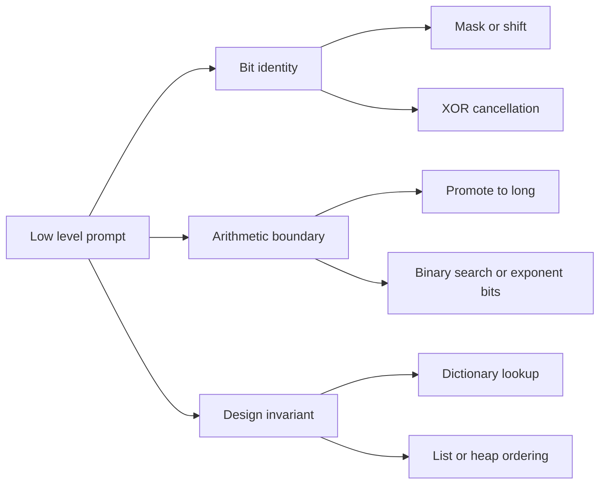

This workbook collects the problems where C# details can change the answer: unsigned shifts, overflow, random number boundaries, and data-structure wiring. The focus is on compact implementations plus the one invariant that makes each bit trick, math routine, or design operation safe.

## C# mechanics for bits, math and design

Use `uint` when a problem is explicitly about a 32-bit unsigned value or a logical right shift. Right shift on `int` is arithmetic and preserves the sign bit; right shift on `uint` fills with zero. `System.Numerics.BitOperations.PopCount` is the production shortcut for set-bit counting, while interview code often shows `n &= n - 1` to prove the idea. For arithmetic, promote before multiplying: `(long)a * b`, `Math.BigMul(a, b)`, or `checked` when overflow should fail loudly.

| Concern | C# tool | Interview note |
|---|---|---|
| Logical bit shifts | Cast to `uint` | Avoid sign extension from `int >> k` |
| Set-bit count | `BitOperations.PopCount((uint)x)` | Built-in is fine if the interviewer allows it |
| Large products | `(long)a * b` or `Math.BigMul(a, b)` | Cast before the multiply, not after |
| Overflow detection | `checked { ... }` | Default integer arithmetic is unchecked in many contexts |
| O(1) recency design | `Dictionary<K, LinkedListNode<T>>` plus `LinkedList<T>` | Map finds the node, list moves it in constant time |



> [!KEY]
> In this page, the bug is often not the algorithm. It is a signed shift, an overflowing multiply, or an O(n) removal hidden inside an intended O(1) design.

For bit manipulation, write down the width. A trick that is correct for 32 bits may need a different mask or loop count for 64 bits, and sign extension can change the answer when negative integers are present. For math, write down the largest intermediate value, not only the largest final value. Products, prefix sums, and LCM calculations often overflow before the final answer is checked. For design prompts, write down the promised complexity beside every operation and reject any container that cannot meet it without an extra pointer, index, or heap.

Keep randomness explanations mathematical. A randomized structure is not correct because it calls `Random`; it is correct because every eligible outcome maps to the same number of random choices, or because a replacement probability preserves a uniform invariant. Likewise, a probabilistic structure such as a Bloom filter must name what kind of error it permits. False positives may be acceptable; false negatives are not. These statements are often more important than the amount of code written.

For class designs, initialize every field so an empty object already satisfies its invariant. An empty LRU cache has an empty map and list. An empty TimeMap has no key lists but can return an empty string. An empty randomized set must not allow `GetRandom` unless the problem guarantees at least one element. Calling out those assumptions earns credit before edge cases are tested.

## Full worked problems

The full problems are grouped by the kind of invariant they exercise. The bit examples show cancellation, bit counting, and carry propagation. The math examples show exponent bits, sieve bounds, Euclid's decreasing remainder, and weighted intervals. The design examples combine containers so one structure supplies lookup while another supplies order, randomness, or time travel.

### Number of 1 Bits

Brian Kernighan's trick clears the lowest set bit each iteration. In production C#, `BitOperations.PopCount(n)` is clearer, but this loop proves why the work is proportional to set bits.

```csharp
public int HammingWeight(uint n) {
    int count = 0;
    while (n != 0) {
        n &= n - 1; // clears the lowest set bit
        count++;
    }
    return count;
}
```

Complexity: `O(k)` for `k` set bits, which is `O(1)` for a 32-bit integer, and `O(1)` space.

### Counting Bits

The recurrence removes the least significant bit by shifting right. `dp[i >> 1]` is already known because it is smaller than `i`.

```csharp
public int[] CountBits(int n) {
    var dp = new int[n + 1];
    for (int i = 1; i <= n; i++)
        dp[i] = dp[i >> 1] + (i & 1);
    return dp;
}
```

Complexity: `O(n)` time and `O(n)` output space.

### Single Number II

XOR cancels pairs, not triples. Count each bit position modulo three, then reconstruct the unique integer, including its sign bit.

```csharp
public int SingleNumber(int[] nums) {
    int result = 0;
    for (int bit = 0; bit < 32; bit++) {
        int count = 0;
        foreach (int x in nums)
            count += (x >> bit) & 1;
        result |= (count % 3) << bit;
    }
    return result;
}
```

Complexity: `O(32n)`, reported as `O(n)`, and `O(1)` space.

### Sum of Two Integers

XOR adds without carry; AND shifted left computes the carry. Casting to `uint` avoids sign-extension surprises while the carry propagates.

```csharp
public int GetSum(int a, int b) {
    uint x = (uint)a, y = (uint)b;
    while (y != 0) {
        uint carry = (x & y) << 1;
        x ^= y;
        y = carry;
    }
    return (int)x;
}
```

Complexity: at most 32 iterations, so `O(1)` time and `O(1)` space.

### Pow x n

Binary exponentiation reads the exponent bits. Convert `n` to `long` before negating so `int.MinValue` is handled safely.

```csharp
public double MyPow(double x, int n) {
    long exp = n;
    if (exp < 0) {
        x = 1.0 / x;
        exp = -exp;
    }

    double result = 1.0;
    while (exp > 0) {
        if ((exp & 1) == 1) result *= x;
        x *= x;
        exp >>= 1;
    }
    return result;
}
```

Complexity: `O(log |n|)` time and `O(1)` space.

### Count Primes

The sieve marks composite numbers starting at `p * p`; smaller multiples already have a smaller prime factor. Cast the multiplication to `long` in the loop guard.

```csharp
public int CountPrimes(int n) {
    if (n <= 2) return 0;
    var composite = new bool[n];
    for (int p = 2; (long)p * p < n; p++) {
        if (composite[p]) continue;
        for (int multiple = p * p; multiple < n; multiple += p)
            composite[multiple] = true;
    }

    int count = 0;
    for (int i = 2; i < n; i++)
        if (!composite[i]) count++;
    return count;
}
```

Complexity: `O(n log log n)` time and `O(n)` space.

### GCD and LCM

Euclid's algorithm repeatedly replaces `(a, b)` with `(b, a % b)`. Compute LCM as `a / gcd * b` to reduce overflow risk.

```csharp
public long Gcd(long a, long b) {
    a = Math.Abs(a);
    b = Math.Abs(b);
    while (b != 0)
        (a, b) = (b, a % b);
    return a;
}

public long Lcm(long a, long b) {
    if (a == 0 || b == 0) return 0;
    return checked(a / Gcd(a, b) * b);
}
```

Complexity: `O(log min(a,b))` time and `O(1)` space.

### Random Pick with Weight

Build prefix sums and choose a target from `1` through `total`. Lower bound finds the first prefix that reaches the target. Use `long` prefix sums and .NET 6+'s `Random.NextInt64` when the total weight may exceed `int.MaxValue`.

```csharp
public class WeightedRandomPicker {
    private readonly long[] _prefix;
    private readonly long _total;
    private readonly Random _random = new Random();

    public WeightedRandomPicker(int[] w) {
        _prefix = new long[w.Length];
        long sum = 0;
        for (int i = 0; i < w.Length; i++) {
            sum += w[i];
            _prefix[i] = sum;
        }
        _total = sum;
    }

    public int PickIndex() {
        long target = _random.NextInt64(1, _total + 1);
        int lo = 0, hi = _prefix.Length;
        while (lo < hi) {
            int mid = lo + (hi - lo) / 2;
            if (_prefix[mid] < target) lo = mid + 1;
            else hi = mid;
        }
        return lo;
    }
}
```

Complexity: `O(n)` construction, `O(log n)` per pick, and `O(n)` space.

### Insert Delete GetRandom O one

The list gives random indexing; `List<T>` appends are amortized O(1) because capacity grows geometrically. The dictionary maps value to index. Removal swaps the target with the last element so `RemoveAt` stays O(1).

```csharp
public class RandomizedSet {
    private readonly Dictionary<int, int> _index = new();
    private readonly List<int> _values = new();
    private readonly Random _random = new Random();

    public bool Insert(int val) {
        if (_index.ContainsKey(val)) return false;
        _index[val] = _values.Count;
        _values.Add(val);
        return true;
    }

    public bool Remove(int val) {
        if (!_index.TryGetValue(val, out int i)) return false;
        int last = _values[^1];
        _values[i] = last;
        _index[last] = i;
        _values.RemoveAt(_values.Count - 1);
        _index.Remove(val);
        return true;
    }

    public int GetRandom() => _values[_random.Next(_values.Count)];
}
```

Complexity: `O(1)` amortized for all operations and `O(n)` space.

### LRU Cache

A dictionary finds the node by key; a linked list orders nodes by recency. Holding `LinkedListNode<T>` is the difference between O(1) removal and a linear search.

```csharp
public class LRUCache {
    private readonly int _capacity;
    private readonly Dictionary<int, LinkedListNode<(int Key, int Value)>> _map = new();
    private readonly LinkedList<(int Key, int Value)> _recent = new();

    public LRUCache(int capacity) { _capacity = capacity; }

    public int Get(int key) {
        if (!_map.TryGetValue(key, out var node)) return -1;
        _recent.Remove(node);
        _recent.AddFirst(node);
        return node.Value.Value;
    }

    public void Put(int key, int value) {
        if (_map.TryGetValue(key, out var node)) {
            node.Value = (key, value);
            _recent.Remove(node);
            _recent.AddFirst(node);
            return;
        }
        var fresh = new LinkedListNode<(int, int)>((key, value));
        _recent.AddFirst(fresh);
        _map[key] = fresh;
        if (_map.Count > _capacity) {
            var last = _recent.Last!;
            _recent.RemoveLast();
            _map.Remove(last.Value.Key);
        }
    }
}
```

Complexity: `O(1)` for `Get` and `Put`, with `O(capacity)` space.

### Time Based Key Value Store

Each key owns an append-only sorted list of timestamped values; the standard prompt guarantees `Set` calls for a key arrive in increasing timestamp order. `Get` is a binary search for the greatest timestamp not exceeding the query time.

```csharp
public class TimeMap {
    private readonly Dictionary<string, List<(int Time, string Value)>> _data = new();

    public void Set(string key, string value, int timestamp) {
        if (!_data.TryGetValue(key, out var list)) {
            list = new List<(int, string)>();
            _data[key] = list;
        }
        list.Add((timestamp, value));
    }

    public string Get(string key, int timestamp) {
        if (!_data.TryGetValue(key, out var list)) return "";
        int lo = 0, hi = list.Count - 1, answer = -1;
        while (lo <= hi) {
            int mid = lo + (hi - lo) / 2;
            if (list[mid].Time <= timestamp) { answer = mid; lo = mid + 1; }
            else hi = mid - 1;
        }
        return answer < 0 ? "" : list[answer].Value;
    }
}
```

Complexity: `O(1)` set, `O(log n)` get for one key, and `O(n)` total space.

### Reservoir Sampling

When the target appears for the `k`th time, replace the saved index with probability `1 / k`. That keeps every matching index equally likely without storing all matches.

```csharp
public class ReservoirSampler {
    private readonly int[] _nums;
    private readonly Random _random = new Random();

    public ReservoirSampler(int[] nums) { _nums = nums; }

    public int Pick(int target) {
        int chosen = -1, seen = 0;
        for (int i = 0; i < _nums.Length; i++) {
            if (_nums[i] != target) continue;
            seen++;
            if (_random.Next(seen) == 0) chosen = i;
        }
        return chosen;
    }
}
```

Complexity: `O(n)` per pick and `O(1)` extra space.

> [!WARNING]
> Random APIs have exclusive upper bounds. `Random.Next(1, total + 1)` samples 1 through total; `Random.Next(total)` samples 0 through total minus one.

## Reference table for the remaining problems

These prompts are valuable but narrower. Keep the cue and technique handy so the full treatments can stay focused on reusable mechanics. None of them should be ignored; they are compact drills for edge cases that interviewers like to add as follow-ups after the main solution works. Treat the design rows as field-selection exercises. For each operation, ask which field makes it cheap and which invariant keeps that field synchronized with the others. If you cannot answer both, the advertised complexity is probably accidental.

| Problem | Identifying cue | Technique | Time | Space |
|---|---|---|---|---|
| Reverse Bits | Mirror 32-bit pattern | Shift result left, append low bit | `O(1)` | `O(1)` |
| Power of Two | Exactly one set bit | `n > 0 && (n & (n - 1)) == 0` | `O(1)` | `O(1)` |
| Missing Number | Range `0..n` one absent | XOR indices and values | `O(n)` | `O(1)` |
| Single Number | Pairs cancel | XOR all values | `O(n)` | `O(1)` |
| Subsets via Bitmask | All masks represent choices | Enumerate `0..(1<<n)-1` | `O(n * 2^n)` | Output |
| Bitwise AND Range | Common prefix survives | Shift both ends until equal | `O(log n)` | `O(1)` |
| Happy Number | Repeated digit-square sum | Cycle detection with set or fast pointer | `O(log n)` | `O(log n)` |
| Reverse Integer | Digits may overflow | Build in `long` or precheck bounds | `O(log n)` | `O(1)` |
| Excel Column Title | One-indexed base 26 | Decrement before modulo | `O(log n)` | `O(log n)` |
| Trailing Zeroes | Count factors of 5 | Sum `n/5 + n/25 + ...` | `O(log n)` | `O(1)` |
| Ugly Number II | Merge multiples of 2, 3, 5 | Three pointers in sorted DP array | `O(n)` | `O(n)` |
| Design HashMap | No built-in map | Bucket array with linked chains | Average `O(1)` | `O(n + buckets)` |
| Min Stack | `GetMin` in O(1) | Parallel stack of running minimums | `O(1)` | `O(n)` |
| LFU Cache | Frequency plus recency | Key map and frequency buckets | `O(1)` | `O(capacity)` |
| Hit Counter | Last 300 seconds | Circular arrays of timestamps and counts | `O(1)` | `O(1)` |
| Tree Codec | Serialize nulls too | Preorder with sentinel tokens | `O(n)` | `O(n)` |
| Underground System | Average route times | Active trip map and route aggregate map | `O(1)` | `O(P + R)` |
| Top K Stream | Frequencies updated online | Count map and size-k heap on query | `O(d log k)` query | `O(d)` |
| Token Bucket | Rate limiting | Refill by elapsed time under lock | `O(1)` | `O(1)` |
| Bounded Blocking Queue | Producers block when full | Two `SemaphoreSlim`s and a queue | `O(1)` | `O(capacity)` |
| Producer Consumer | Pipeline with backpressure | `BlockingCollection<T>` | `O(n)` | `O(bound)` |
| Bloom Filter | Probabilistic membership | Bit array plus k hashes | `O(k)` | `O(m)` |
| External Merge Sort | File exceeds memory | Sort chunks, k-way heap merge | `O(n log k)` merge | `O(k)` |
| Consistent Hashing | Minimize remapping | Sorted ring with virtual nodes | `O(log N)` with navigable ring | `O(N)` |

## Cheat sheet

- Cast to `uint` for logical right shifts on 32-bit values.
- `x & (x - 1)` clears the lowest set bit; `x & -x` isolates it.
- XOR cancels equal pairs and is order independent.
- Cast before multiplication, or use `Math.BigMul` and `checked` for overflow-sensitive code.
- Binary exponentiation and range AND both work by consuming bits, not by looping through values.
- Prefix sums plus lower bound convert weighted probability into binary search.
- O(1) random set requires both a list and a value-to-index dictionary.
- O(1) LRU requires a dictionary to linked-list nodes, not just keys to values.

## Common mistakes

| Mistake | Fix |
|---|---|
| Using `int >>` when a logical shift is required | Cast to `uint` or use unsigned input |
| Negating `int.MinValue` in `Pow` | Convert exponent to `long` first |
| Computing `a * b` before casting to `long` | Write `(long)a * b` or `Math.BigMul(a, b)` |
| Forgetting `p * p` can overflow in a sieve | Use `(long)p * p` in the guard |
| Removing from the middle of `List<T>` in O(1) design | Swap with the last item or use a linked-list node |
| Storing LRU keys in a linked list without nodes | Store `LinkedListNode<T>` in the dictionary |
| Assuming random picks are uniform without proof | Show the prefix interval sizes or reservoir probability |

> [!TIP]
> For design prompts, write the invariant beside each field. If a field does not support an operation's promised complexity, it probably does not belong.

## Summary

Bit problems reward knowing the identity and the signedness rule. Math problems reward guarding the boundary cases: zero, negative exponents, `int.MinValue`, and products that exceed 32 bits. Design problems are mostly about pairing containers so one supplies lookup and the other supplies order or indexing. When you can state the invariant for each field, the implementation becomes small enough to verify aloud. Always finish by naming the boundary assumption: value width, random range, capacity, or thread-safety requirement.

## Top Interview Questions

### Q1. When should you use `uint` instead of `int` in bit problems?

Use `uint` when the problem defines an unsigned 32-bit value, when you need logical right shift behavior, or when the sign bit is just another bit rather than a numeric sign. In C#, `int >> k` is arithmetic: it fills new high bits with the sign bit. `uint >> k` is logical and fills with zero. That distinction affects Reverse Bits, Hamming Weight, and sum-with-carry simulations. You can still return an `int` by casting at the end if the platform signature requires it. The senior move is to say whether you are treating the value as a number or as a fixed-width bit pattern.

### Q2. Why does `x & (x - 1)` clear the lowest set bit?

Subtracting one flips the lowest set bit of `x` to zero and turns all lower zero bits into ones. Bits above that position are unchanged. ANDing the original value with `x - 1` therefore keeps all higher bits, clears that lowest set bit, and clears the lower positions because they were zero in the original. Repeating the operation counts set bits in exactly as many iterations as there are ones. It also gives the power-of-two test: a positive power of two has one set bit, so clearing the lowest set bit leaves zero.

### Q3. How do you prevent overflow in C# math interview code?

Promote before the operation that can overflow. `(long)a * b` performs a 64-bit multiplication; `(long)(a * b)` multiplies as `int` first and preserves the wrong overflowed result. For two `int` values, `Math.BigMul(a, b)` is another explicit choice. Use `checked` when overflow should throw rather than wrap, especially in helper methods like LCM. Also avoid sentinels that overflow when added. The important C# detail is that unchecked integer overflow is common by default, so code can silently wrap unless you promote, guard, or use a checked context.

### Q4. How do you explain binary exponentiation?

Write the exponent in binary. Each bit says whether the current power of `x` contributes to the result. Start with `result = 1` and `base = x`. While the exponent is positive, multiply `result` by `base` when the low bit is one, square `base`, and shift the exponent right. This processes one bit per loop, so the time is `O(log |n|)`. For negative exponents, invert `x` and negate the exponent. In C#, convert `n` to `long` before negating, because `-int.MinValue` overflows an `int`.

### Q5. Why does the sieve start crossing out at `p * p`?

Every composite smaller than `p * p` that is divisible by `p` has the form `p * k` where `k < p`. That number was already crossed out when processing the smaller factor `k` or one of its prime factors. Starting at `2p` repeats work. The sieve's efficiency comes from crossing each composite mainly through its smallest prime factor, and the total crossing cost is `O(n log log n)`. In C#, the guard `(long)p * p < n` avoids overflow when `p` approaches the square root boundary.

### Q6. How do you prove Random Pick with Weight is correct?

Imagine laying the weights as adjacent intervals on the number line from `1` to `total`. Index `i` owns exactly `w[i]` integers: after the previous prefix and up to its prefix sum. Choosing a uniformly random target in that range and returning the first prefix sum at least that target means index `i` is returned for exactly `w[i]` out of `total` equally likely targets. Therefore its probability is `w[i] / total`. The lower-bound binary search is just an efficient way to find which interval contains the sampled target.

### Q7. Why do `Insert`, `Remove`, and `GetRandom` need both a list and a dictionary?

Uniform random selection needs array-like indexing, so a `List<int>` is the natural store. Membership and removal by value need a dictionary from value to its index. The only hard operation is removing from the middle of the list without shifting elements. Swap the element to remove with the last element, update the moved value's index in the dictionary, then remove the last slot. That keeps removal amortized O(1) while preserving random indexing over the dense list. Without the dictionary, removal is O(n); without the list, random selection is not O(1).

### Q8. How does an LRU cache achieve O(1) operations?

It combines two structures with complementary strengths. A dictionary maps each key to the linked-list node holding that key and value, so lookup is O(1). The linked list orders entries by recency, with the most recent at the front and the least recent at the back. On `Get` or updating `Put`, remove the node and add it to the front. On capacity overflow, remove the tail node and delete its key from the dictionary. The critical detail is storing `LinkedListNode<T>` in the dictionary; if you store only values, finding the node to move becomes O(n).

### Q9. What should you discuss for a thread-safe design such as a token bucket or blocking queue?

State the invariant and the synchronization boundary. A token bucket protects token count and last-refill time with a lock, recomputes tokens from elapsed time, caps them at capacity, then consumes one token if available. A bounded blocking queue usually uses one semaphore for available space, one semaphore for available items, and a lock around the actual queue mutation. Mention what blocks, what wakes up, and whether cancellation or timeouts are required. The algorithmic operations are O(1), but the production answer must also address races, fairness expectations, and what happens under high contention.