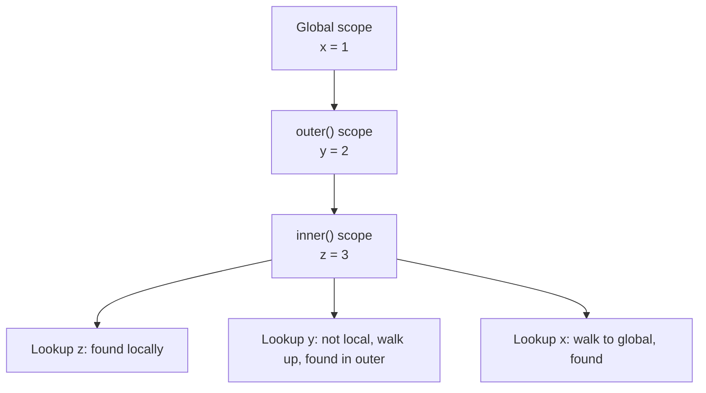

Scope, closures and `this` are the three ideas that separate "can write JavaScript" from "understands JavaScript". A backend engineer who has internalised static scoping in C# or Java will find lexical scope familiar, but `this` and closures have sharp edges that show up constantly in interviews and in real bugs.

## Lexical scope and the scope chain

JavaScript uses **lexical (static) scoping** — where a variable resolves is determined by where it is *written* in the source, not by who calls the function. Every function captures a reference to the scope it was defined in, and lookups walk outward through that chain until they hit the global scope.



Each function, block (`{}` for `let`/`const`), and module creates a new lexical environment. Lookup is O(depth of nesting), which is why deeply nested closures can be a little slower — never a real interview concern, but worth knowing.

> [!KEY]
> Scope is decided at **write time**, not call time. A function always sees the variables of the scope where it was *defined*, even if it is invoked from somewhere else entirely.

## var vs let vs const, and the temporal dead zone

`var` is function-scoped and hoisted with an initial value of `undefined`. `let` and `const` are block-scoped and hoisted too, but they sit in the **temporal dead zone (TDZ)** — a region where the binding exists but touching it throws a `ReferenceError`.

| Feature | `var` | `let` | `const` |
|---|---|---|---|
| Scope | Function | Block | Block |
| Hoisted | Yes, initialised to `undefined` | Yes, but in TDZ | Yes, but in TDZ |
| Re-declarable | Yes | No | No |
| Re-assignable | Yes | Yes | No (binding is frozen, not the value) |
| Attaches to `window`/global object | Yes (in scripts) | No | No |

```javascript
console.log(a); // undefined — hoisted and initialised
var a = 1;

console.log(b); // ReferenceError — in the TDZ
let b = 2;
```

`const` freezes the **binding**, not the object it points to — `const arr = []; arr.push(1);` is legal because you never reassigned `arr` itself.

> [!TIP]
> Saying "the TDZ exists to catch bugs, not to be a JavaScript quirk" is the senior framing — it turns a footgun (`var`) into a guardrail (`let`/`const`).

## Hoisting, precisely

Hoisting is the compilation-phase step where declarations are registered in their scope before any code runs. What differs by keyword is the **initial value**:

- `function foo() {}` declarations are hoisted **with their full body** — callable before the line they appear on.
- `var x` is hoisted and initialised to `undefined`.
- `let`/`const`/`class` are hoisted but left uninitialised (TDZ) until their declaration line executes.
- Function *expressions* (`var f = function () {}`) only hoist the `var` part — `f` is `undefined` until the assignment runs.

## Closures

A closure is a function bundled with a reference to its **lexical environment**, which lets it keep reading and writing variables from an outer scope even after that outer function has returned. This is not a copy — it is a live reference.

### The classic loop counter example

```javascript
// var: one shared binding across all iterations
for (var i = 0; i < 3; i++) {
  setTimeout(() => console.log(i), 0); // 3, 3, 3
}

// let: a fresh binding per iteration
for (let i = 0; i < 3; i++) {
  setTimeout(() => console.log(i), 0); // 0, 1, 2
}
```

With `var`, all three callbacks close over the **same** `i`, which is `3` by the time the timers fire. `let` creates a new binding scoped to each loop iteration, so each closure captures its own snapshot.

> [!WARNING]
> This is one of the most common live-coding traps. If you are asked to "fix" the `var` version without changing `var`, the classic answer is an IIFE that captures the current value as a parameter: `(function (j) { setTimeout(() => console.log(j), 0); })(i);`

### Practical uses of closures

| Pattern | What the closure captures | Typical use |
|---|---|---|
| Memoise | A cache object | Avoid recomputing expensive pure functions |
| Once | A "has run" flag | Guarantee an init function runs exactly once |
| Private state | Variables not exposed on the returned object | Encapsulation without classes |
| Module pattern | Internal state + a small public API | Pre-ES-modules way to hide implementation |

```javascript
function memoise(fn) {
  const cache = new Map();
  return (...args) => {
    const key = JSON.stringify(args);
    if (!cache.has(key)) cache.set(key, fn(...args));
    return cache.get(key);
  };
}

function once(fn) {
  let called = false, result;
  return (...args) => {
    if (!called) { result = fn(...args); called = true; }
    return result;
  };
}

function createCounter() {
  let count = 0; // private — no way to reach this from outside
  return { increment: () => ++count, value: () => count };
}
```

## this binding rules, in priority order

Unlike lexical scope, `this` is determined **at call time**, based on how a function is invoked. When several rules could apply, JavaScript resolves them in a fixed priority order:

| Priority | Rule | Example | `this` is |
|---|---|---|---|
| 1 (highest) | `new` binding | `new Foo()` | The newly created object |
| 2 | Explicit binding | `fn.call(obj)`, `fn.apply(obj)`, `fn.bind(obj)()` | `obj` |
| 3 | Implicit (method) call | `obj.fn()` | `obj` |
| 4 (lowest) | Default binding | `fn()` standalone | `undefined` (strict mode) or global object |
| — | Arrow functions | `() => {}` | Whatever `this` was in the enclosing lexical scope — arrows never get their own `this` |

Arrow functions do not participate in the priority table at all — they are transparent to `this`, capturing it lexically like any other variable, which is why they cannot be used as constructors or rebound with `bind`.

> [!KEY]
> Ask "how was this function *called*?", not "where was it *defined*?" — that single question resolves 90% of `this` questions, except for arrow functions, where the opposite is true.

### Losing this in a callback

```javascript
class Timer {
  constructor() { this.seconds = 0; }
  tick() { this.seconds++; }
}

const t = new Timer();
setTimeout(t.tick, 1000); // this is undefined inside tick — method was detached from t
```

Passing `t.tick` hands over a bare function reference — the connection to `t` is lost, so the default binding rule applies. Three standard fixes:

```javascript
setTimeout(t.tick.bind(t), 1000);          // 1. bind explicitly
setTimeout(() => t.tick(), 1000);          // 2. wrap in an arrow — closes over t lexically
class Timer {                              // 3. class field arrow — bound once, per instance
  seconds = 0;
  tick = () => { this.seconds++; };
}
```

## IIFEs

An Immediately Invoked Function Expression runs as soon as it is defined, creating a private scope without polluting the enclosing one. Before ES modules and `let`/`const`, this was the primary tool for encapsulation.

```javascript
const Counter = (function () {
  let count = 0; // private, unreachable from outside
  return { increment: () => ++count };
})();
```

IIFEs are less common now that ES modules give every file its own scope by default, but they still appear in bundler output and in "fix the loop" interview questions.

## Cheat sheet

- Scope is resolved at **definition time** (lexical); `this` is resolved at **call time**.
- `var` is function-scoped and hoisted to `undefined`; `let`/`const` are block-scoped and sit in the TDZ until their line runs.
- A closure is a live reference to an outer scope, not a snapshot — except when a loop variable is `let`, which gives each iteration its own binding.
- Priority for `this`: `new` > explicit bind/call/apply > method call > default > (arrows always inherit lexically, ignoring this table entirely).
- Detaching a method (`const f = obj.method`) loses `this` — fix with `bind`, an arrow wrapper, or a class field arrow.
- `const` freezes the binding, not the contents of an object or array.
- Memoise, once, and the module pattern are all just closures over private state.

## Common mistakes

| Mistake | Fix |
|---|---|
| Using `var` in a loop that schedules async callbacks | Use `let`, or wrap the body in an IIFE that captures the value |
| Assuming arrow functions have their own `this` | They inherit `this` lexically — never use one as an object method needing dynamic `this` |
| Passing `obj.method` as a callback and expecting `this` to work | Bind it, wrap it in an arrow, or use a class field arrow |
| Thinking `const` makes objects immutable | It only prevents reassigning the variable; use `Object.freeze` for real immutability |
| Believing hoisting means "the whole line moves up" | Only the declaration is hoisted; the assignment stays where it is written |

## Summary

Lexical scope means a function always resolves variables against where it was written, forming a chain that is searched outward on every lookup. Closures are simply the mechanism that keeps that chain alive after the outer function returns, which is what makes memoisation, private state and the module pattern possible. `this`, in contrast, is decided by the call site and follows a strict priority order — `new`, explicit binding, method call, then default — with arrow functions opting out entirely by inheriting `this` lexically. Most real-world `this` bugs are simply a method losing its receiver when detached, fixed with `bind`, an arrow wrapper, or a class field arrow.

## Top Interview Questions

### Q1. What is the difference between scope and context (this) in JavaScript?

Scope is about **variable visibility** and is resolved lexically — at the place a function is written, based on nested blocks and functions. Context (`this`) is about **which object a function is executing against**, and is resolved dynamically at the call site. A function's scope never changes no matter how it is invoked, but its `this` can change on every single call depending on whether it was called as `obj.fn()`, `fn.call(other)`, `new fn()`, or standalone. Confusing the two is common: candidates often expect `this` to follow lexical rules like a normal variable, which is only true for arrow functions.

### Q2. Explain the temporal dead zone. Why does it exist?

The TDZ is the span between entering a scope and the line where a `let`/`const`/`class` binding is declared. During that span, the binding exists (it has been hoisted) but accessing it throws a `ReferenceError` instead of silently returning `undefined`. It exists to catch a real class of bugs: with `var`, reading a variable before its declaration silently gives `undefined`, which can mask logic errors for a long time. The TDZ turns that silent failure into an immediate, loud one, which is a deliberate language improvement, not an accident.

### Q3. Why does the classic `var` loop print the same value for every callback?

`var` is function-scoped, so a `for (var i ...)` loop has exactly **one** binding for `i` shared by every iteration and every closure created inside it. By the time the asynchronous callbacks (e.g. `setTimeout`) actually run, the loop has already finished and `i` holds its final value. `let` fixes this because the specification creates a **new lexical binding of `i` per iteration**, so each closure captures a distinct variable frozen at that iteration's value. This is one of the most frequently asked "predict the output" questions in front-end interviews.

### Q4. How would you implement `once(fn)` using a closure?

```javascript
function once(fn) {
  let called = false;
  let result;
  return (...args) => {
    if (!called) {
      result = fn(...args);
      called = true;
    }
    return result;
  };
}
```

The important part is that `called` and `result` live in the lexical environment created by that specific call to `once`, not on the returned function object or in global state. The wrapper checks the private flag on every invocation. On the first call it runs `fn`, caches the return value, flips the flag, and returns that value; later calls skip `fn` and return the cached result, so side effects happen at most once. Each call to `once(fn)` creates a fresh environment, so two wrapped functions do not share the same `called` flag. In production, decide explicitly whether a thrown first attempt should count as called and preserve `this` if the wrapper may be used around methods.

### Q5. What are the four rules for determining this, and which one wins if several apply?

In priority order: (1) `new Foo()` — `this` is the newly created object; (2) explicit binding via `call`, `apply`, or `bind` — `this` is the object passed in; (3) implicit binding, where the function is called as a method, `obj.fn()` — `this` is `obj`; (4) default binding for a bare function call — `this` is `undefined` in strict mode, or the global object otherwise. Higher-priority rules always win: `new boundFn()` actually still uses `new`'s binding (bound `this` is ignored when the function was created with `bind` and then called with `new`), and an explicit `.call()` beats a plain method call if you extract the function first.

### Q6. Why doesn't `bind` work on an arrow function?

Arrow functions have no `this` of their own — they never had a `this` binding to begin with, so there is nothing for `bind` to override. Internally, an arrow function looks up `this` the same way it looks up any other free variable: by walking the lexical scope chain to the nearest enclosing function that does have its own `this`. Calling `.bind()` on an arrow function is not an error, but it silently has no effect on `this` (it would still work for pre-filling arguments via partial application).

### Q7. A method passed as a callback loses `this`. Walk through why, and fix it three ways.

```javascript
class Button {
  constructor(label) { this.label = label; }
  onClick() { console.log(this.label); }
}
const b = new Button("Save");
element.addEventListener("click", b.onClick); // this is undefined/element, not b
```

Passing `b.onClick` extracts the function reference and hands it to `addEventListener`, which will call it as a plain function (or with `this` set to the DOM element) — the link to `b` is gone. Fixes: `element.addEventListener("click", b.onClick.bind(b))`; wrap it, `element.addEventListener("click", () => b.onClick())`; or declare `onClick` as a class field arrow (`onClick = () => { ... }`), which captures `this` once per instance at construction time and needs no rebinding at every call site.

### Q8. What is the module pattern and why was it useful before ES modules?

The module pattern uses an IIFE that returns an object, exposing only the properties you choose while keeping everything else in the closure's private scope. Before native ES modules (`import`/`export`), this was the standard way to avoid polluting the global namespace with every internal helper and variable a file needed — only the returned API surface was visible to the rest of the application. It is functionally the same idea as a private field in a class, implemented purely through closures rather than language-level access modifiers.

### Q9. Is a closure a memory leak risk? When?

A closure keeps its entire captured scope alive for as long as the closure itself is reachable, even if only one variable from that scope is actually used. This becomes a real leak when a long-lived closure (say, an event listener attached once and never removed) captures a large object — that object cannot be garbage collected because the closure still references its enclosing scope. The fix is the same as any leak: remove listeners you no longer need, and avoid capturing large objects in closures meant to live for the whole page lifetime; capture only the specific fields you need instead of the whole enclosing object.

### Q10. What does `Object.freeze` add on top of `const` that candidates often miss?

`const` only prevents **reassigning the variable binding** — `const obj = {}` still allows `obj.x = 1`. `Object.freeze(obj)` prevents adding, removing, or reassigning **top-level properties** on that specific object, and is also shallow — a frozen object with a nested object property still allows mutation of that nested object unless it is frozen separately. Interviewers use this to check whether you conflate "the variable can't change" with "the value can't change" — two different guarantees that only align for primitives.

### Q11. How would you explain hoisting to someone who thinks it means the whole declaration line moves to the top?

Hoisting registers the **name** of a declaration in its scope during compilation, but only `var` and function declarations get an initial value at that point (`undefined` and the full function body, respectively). `let`/`const` are hoisted as names only, without a usable value, which is the temporal dead zone. So `var x = 5;` behaves as if `var x;` were hoisted and `x = 5;` stayed exactly where it was written — the assignment does not move. This distinction matters in practice: code that reads a `var` before its assignment gets `undefined` silently, while the equivalent with `let` throws immediately.
