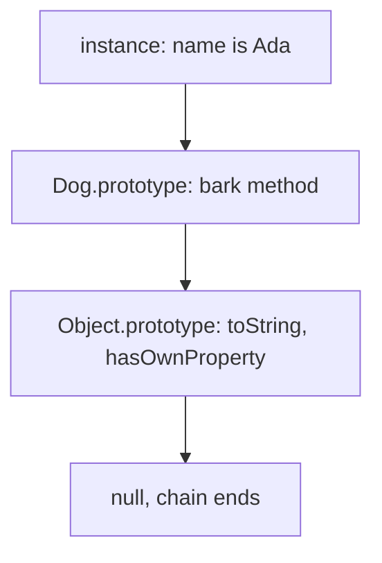

JavaScript's object model is not classical inheritance underneath — it is **prototypal**, where objects delegate to other objects. ES6 `class` syntax hides this well enough that many engineers use classes daily without knowing what they compile down to, which is exactly the gap senior interviewers probe.

## The prototype chain and property lookup

Every object has an internal link to another object (its prototype). When you read a property, the engine checks the object itself first, then walks up the chain of prototypes until it finds the property or hits `null`.



```javascript
const animal = { eats: true };
const dog = Object.create(animal);
dog.barks = true;

dog.eats;  // true — not on dog, found on animal via the chain
dog.hasOwnProperty("eats"); // false — it's inherited, not own
```

> [!KEY]
> Inheritance in JavaScript is **delegation at read time**, not copying at creation time. If you mutate `animal.eats` later, every object delegating to it sees the change immediately.

## `__proto__` vs `prototype`

These two are constantly confused and are a favourite "explain the difference" question.

| | `prototype` | `__proto__` (aka `[[Prototype]]`) |
|---|---|---|
| Exists on | Functions (used as constructors) | Every object |
| Purpose | The object that becomes the prototype of instances created with `new` | The actual link used during property lookup |
| Access | `Dog.prototype` | `dog.__proto__` or `Object.getPrototypeOf(dog)` |
| Should you use it directly? | Yes, to add shared methods | Prefer `Object.getPrototypeOf`/`Object.create`; `__proto__` is a legacy accessor |

`new Dog()` sets the new object's internal `[[Prototype]]` to `Dog.prototype` — that single assignment is the entire link between a constructor and its instances.

## Constructor functions and `Object.create`

Before classes, shared behaviour was built with a plain function and its `.prototype` object:

```javascript
function Dog(name) {
  this.name = name;
}
Dog.prototype.bark = function () {
  return `${this.name} says woof`;
};

const rex = new Dog("Rex");
rex.bark(); // found via the prototype chain, not copied onto rex
```

`Object.create(proto)` builds the same relationship without a constructor at all — useful when you want an object that delegates to another object directly, with no `new` and no function involved.

## ES6 classes: syntactic sugar, precisely

`class` does not introduce a new inheritance model — it compiles to the same constructor-function-plus-prototype pattern, with a few real semantic differences layered on top.

```javascript
class Dog {
  constructor(name) { this.name = name; }
  bark() { return `${this.name} says woof`; }
  static create(name) { return new Dog(name); }
}
```

is roughly equivalent to:

```javascript
function Dog(name) { this.name = name; }
Dog.prototype.bark = function () { return `${this.name} says woof`; };
Dog.create = function (name) { return new Dog(name); };
```

The real differences: class bodies always run in **strict mode**; class methods are **non-enumerable** on the prototype (`for...in` won't see them, unlike a manually attached function); and a class **cannot be called without `new`** — doing so throws `TypeError`, whereas a constructor function called without `new` silently runs with `this` as the global object (or `undefined` in strict mode).

> [!TIP]
> Saying "classes are sugar over prototypes, but not zero-cost sugar — they add real guardrails like the `new`-only restriction and strict mode" is a strong senior-level distinction.

### `super` and static members

```javascript
class Puppy extends Dog {
  constructor(name, months) {
    super(name);           // must run before `this` is usable
    this.months = months;
  }
  bark() {
    return `${super.bark()} (puppy voice)`;
  }
}
```

`extends` sets `Puppy.prototype`'s internal prototype to `Dog.prototype` (instance chain) **and** sets `Puppy`'s own prototype to `Dog` (so static members are inherited too). `super(...)` calls the parent constructor; `super.method()` calls the parent's version of an overridden method. `static` members live on the constructor function itself, not on `prototype`, so instances never see them — only `Dog.create()`, never `rex.create()`.

## instanceof and how it walks the chain

`a instanceof B` checks whether `B.prototype` appears **anywhere** in `a`'s prototype chain — it is a chain walk, not a type tag lookup.

```javascript
rex instanceof Dog;    // true — Dog.prototype is in rex's chain
rex instanceof Object; // true — Object.prototype is further up the same chain
```

This is why `instanceof` breaks across iframes/realms (each has its own `Object`/`Array` constructors with different `.prototype` objects) and why it is fooled if you manually reassign `Dog.prototype` after instances already exist — the check re-walks the chain live, using whatever `Dog.prototype` currently points to.

## Prototypal vs classical inheritance

| | Classical (Java/C#) | Prototypal (JavaScript) |
|---|---|---|
| Unit of reuse | Class (a blueprint, not itself an object) | An object, delegating to another object |
| Instance creation | Instantiate a class | Create an object linked to a prototype (`new`, `Object.create`) |
| Change behaviour at runtime | No — recompile | Yes — mutate the prototype object directly, all delegators see it |
| Multiple inheritance | Usually restricted (interfaces instead) | Achieved informally via mixins |
| What `class` syntax adds | N/A | A familiar syntax over the same prototype mechanism |

## Monkey patching and mixins

**Monkey patching** means modifying an existing object or prototype after the fact — including built-ins.

```javascript
// Dangerous: mutates a built-in prototype every array in the program shares
Array.prototype.last = function () { return this[this.length - 1]; };
```

> [!DANGER]
> Patching built-in prototypes is a classic anti-pattern: it affects every object of that type program-wide, collides with future spec additions or other libraries doing the same thing, and can break `for...in` loops if the added property is enumerable. Prefer a standalone utility function.

**Mixins** copy or compose behaviour across objects to work around JavaScript having only single prototype inheritance:

```javascript
const Serializable = (Base) => class extends Base {
  serialize() { return JSON.stringify(this); }
};
class Model {}
class User extends Serializable(Model) {}
```

This mixin pattern chains multiple small pieces of behaviour into one prototype chain without needing true multiple inheritance.

## Shadowing, hasOwnProperty vs in

Setting a property directly on an instance **shadows** the same-named property further up the chain — it does not modify the prototype.

```javascript
dog.eats = false;       // shadows animal.eats; animal.eats is still true
delete dog.eats;        // removes the shadow; dog.eats resolves to true again
```

| Check | `"eats" in dog` | `dog.hasOwnProperty("eats")` |
|---|---|---|
| Own property | true | true |
| Inherited property | true | false |
| Property absent entirely | false | false |

`in` walks the whole chain; `hasOwnProperty` checks only the object itself. Interviewers use this to check whether you understand that `for...in` (which also walks the chain, including inherited enumerable properties) is why libraries often guard with `if (obj.hasOwnProperty(key))` inside such loops.

## Cheat sheet

- Lookup walks the chain until found or `null`; delegation happens at **read time**, not creation time.
- `prototype` lives on constructor functions; `__proto__`/`[[Prototype]]` is the actual link every object has.
- `class` is sugar over constructor functions + `.prototype`, plus real extras: strict mode, non-enumerable methods, no calling without `new`.
- `super(...)` calls the parent constructor and must run before `this` is used in a subclass.
- `instanceof` walks the chain checking for `Constructor.prototype` — it can be fooled by reassigning `prototype` or crossing realms.
- Shadowing sets an *own* property that hides (not deletes) an inherited one of the same name.
- `hasOwnProperty` = own only; `in` = own + inherited.
- Monkey-patch your own objects, not shared built-in prototypes.

## Common mistakes

| Mistake | Fix |
|---|---|
| Patching `Array.prototype` or `Object.prototype` | Write a standalone function instead |
| Forgetting `super()` before using `this` in a subclass constructor | Call `super(...)` as the first statement |
| Assuming class methods appear in `for...in` | They are non-enumerable by design; use `Object.getOwnPropertyNames` if you need them |
| Confusing `prototype` and `__proto__` in an explanation | `prototype` is on functions; `__proto__` is the live link on every object |
| Using `instanceof` across iframes/workers and expecting it to work | Each realm has its own constructors; compare structurally instead |

## Summary

JavaScript objects share behaviour by delegating to a prototype, walked at property-read time, not by copying a class blueprint at creation time. `class` syntax gives this a familiar, safer shape — strict mode, non-enumerable methods, a mandatory `new` — but `extends`, `super`, and `static` all still resolve through the exact same prototype chain and constructor-function machinery underneath. Knowing the difference between `prototype` and `__proto__`, how `instanceof` walks the chain, and why shadowing does not mutate the parent are the details that separate "uses classes" from "understands the object model".

## Top Interview Questions

### Q1. Explain the prototype chain and how property lookup works.

Every object carries an internal reference (`[[Prototype]]`, exposed as `__proto__`) to another object. When you access `obj.prop`, the engine first checks whether `prop` is an **own** property of `obj`; if not, it checks `obj`'s prototype, then that object's prototype, and so on until it reaches `Object.prototype`, whose own prototype is `null`, ending the search. If nothing is found, the result is `undefined`. This is why adding a method to `Dog.prototype` instantly makes it available on every existing and future `Dog` instance — they all delegate to the same prototype object at lookup time.

### Q2. What is the difference between `prototype` and `__proto__`?

`prototype` is a property that exists only on **functions** used as constructors; it is the object that will become the `[[Prototype]]` of any instance created with `new Fn()`. `__proto__` (the legacy accessor for `[[Prototype]]`) exists on **every object**, including functions themselves, and is the actual reference walked during property lookup. So `rex.__proto__ === Dog.prototype` is true after `const rex = new Dog()`, but `rex.prototype` is `undefined` — instances don't have a `.prototype` of their own. The modern, standard way to read or set this link is `Object.getPrototypeOf`/`Object.setPrototypeOf`, not the `__proto__` accessor.

### Q3. Are ES6 classes just syntactic sugar? What is not sugar?

Mostly yes — `class` compiles to the same constructor-function-and-prototype mechanism that existed before ES6. But three things are real, non-sugar semantic differences: class bodies execute in strict mode unconditionally; methods defined in a class body are non-enumerable on the prototype (won't show up in `for...in`, unlike manually attached functions); and calling a class without `new` throws a `TypeError` immediately, whereas calling an old-style constructor function without `new` silently runs with the wrong `this`. So it is "sugar" in that the underlying model is unchanged, but the syntax adds guardrails that plain prototype code did not enforce.

### Q4. How does `instanceof` actually work, and how can it give a misleading answer?

`a instanceof B` walks `a`'s prototype chain looking for `B.prototype` anywhere in it, returning true the moment it is found. It can mislead in two situations: if you reassign `B.prototype` to a brand-new object *after* some instances were already created, those old instances still point to the original prototype object and will now report `instanceof B` as false; and across execution contexts (iframes, workers, or separate realms), each has its own global `Array`/`Object` constructors with distinct `.prototype` objects, so an array from one iframe fails `instanceof Array` in another even though it is structurally an array. `Array.isArray()` exists specifically to sidestep the second problem.

### Q5. What is the difference between `hasOwnProperty` and the `in` operator?

`obj.hasOwnProperty(key)` checks only the object's **own** properties, ignoring anything found further up the prototype chain. `key in obj` checks the **entire chain**, own and inherited. `for...in` loops iterate over all enumerable properties including inherited ones, which is why library code commonly guards the loop body with `if (Object.prototype.hasOwnProperty.call(obj, key))` — calling it off `Object.prototype` directly avoids breaking if the object itself has shadowed or deleted its own `hasOwnProperty`.

### Q6. What happens when you set `dog.eats = false` if `eats` is inherited from a prototype?

This creates a new **own** property `eats` directly on `dog` that shadows the inherited one — it does not modify the prototype object at all. After the assignment, `dog.eats` resolves to `false` because lookup finds the own property first and stops there, but any other object still delegating to the same prototype is unaffected and still sees the original inherited value. Deleting the own property (`delete dog.eats`) removes the shadow and lookup falls through to the inherited value again, which can surprise engineers who expect `delete` to have removed the property entirely.

### Q7. Why is monkey-patching `Array.prototype` considered dangerous in production code?

It mutates a single shared object that every array in the entire program — including ones created by third-party libraries — delegates to, so the change is effectively global and cannot be scoped to one module. It risks silent collisions if a future JavaScript version or another library adds a method with the same name but different behaviour (this actually happened historically with `Array.prototype.flatten` proposals). It can also break code that iterates with `for...in` if the added property is enumerable, since that loop will now yield the patched method name alongside actual array indices. The safe alternative is a standalone helper function or, if genuinely needed, a `Symbol`-keyed property to avoid name collisions.

### Q8. How would you implement mixins in JavaScript, and why are they needed?

JavaScript classes only support single inheritance — `extends` accepts exactly one parent — so mixins compose additional behaviour without a second parent class. A common pattern is a function that takes a base class and returns a new class extending it with extra methods: `const Serializable = Base => class extends Base { serialize() { ... } };`, then `class User extends Serializable(Model) {}`. Each mixin adds one link to the prototype chain, so you can stack several (`Serializable(Timestamped(Model))`) to compose behaviour. This trades the rigidity of single inheritance for flexible composition, at the cost of a slightly deeper, less obvious prototype chain to debug.

### Q9. In a subclass constructor, why must `super()` be called before using `this`?

In a derived class, the JavaScript engine does not create `this` at the start of the constructor — the base class constructor is responsible for creating it, so `this` is left uninitialised until `super()` runs and returns. Accessing `this` before that call throws a `ReferenceError`. This is different from plain constructor functions (no `class`/`extends`), where `this` is always created and bound before the function body runs. The rule enforces that a subclass cannot use inherited state or methods before the part of the object it is extending actually exists.

### Q10. Where do static members live, and how does `Puppy extends Dog` propagate them?

`static` members are attached directly to the constructor function itself, not to `.prototype`, so instances never see them (`rex.create` is `undefined`, but `Dog.create` works). `class Puppy extends Dog` sets up two separate links: `Puppy.prototype`'s internal prototype becomes `Dog.prototype` (so instances inherit instance methods), and `Puppy` itself gets its internal prototype set to `Dog` (so static methods are inherited too — `Puppy.create()` works via the same chain-walking mechanism, just one level up from instances).

### Q11. A junior engineer asks why they should use `class` instead of manually wiring up `.prototype`. What do you tell them?

Both produce the same underlying object shape, so there is no runtime capability class syntax adds that prototypes lack — but `class` gets you real guardrails for free: strict mode is forced on, so common silent mistakes (assigning to an undeclared variable, `this` defaulting to the global object) throw instead of failing silently; methods are non-enumerable, avoiding accidental leakage into `for...in`/`JSON.stringify` loops; and calling the class without `new` throws immediately rather than corrupting global state. The readability win also matters in a team setting — `extends`/`super` communicate intent far more clearly than manually reassigning `.prototype` and chaining constructor calls.
