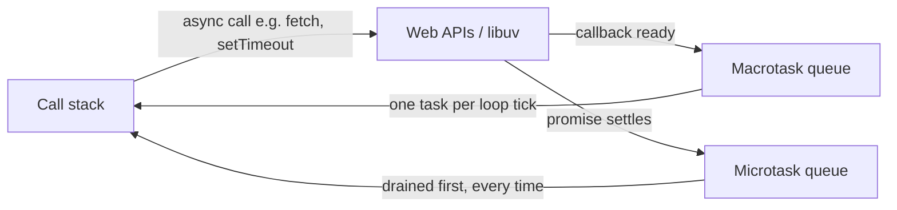
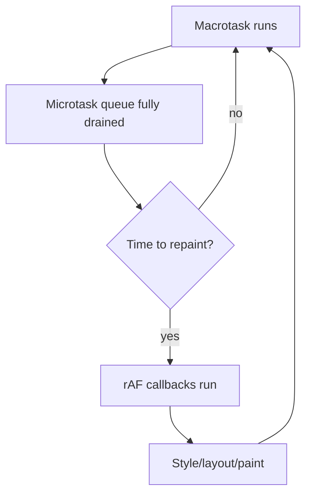

The event loop is the mechanism that lets a single-threaded language handle timers, network requests, and user input without blocking. It is also the single most reliable way an interviewer separates candidates who have memorised "JavaScript is async" from those who can actually predict output order.

## The single-threaded model

JavaScript itself executes on **one call stack** — one thing at a time, run to completion. Anything that looks concurrent (timers, network calls, file reads) is handled by the **host environment** (the browser's Web APIs, or Node's libuv), which runs that work outside the JS thread and hands a callback back to JavaScript only when the stack is empty.



> [!KEY]
> The call stack, the Web APIs, and the queues are three separate things. JavaScript code only ever runs on the call stack — queues just decide **what runs next** once the stack is empty.

## Queues: microtasks vs macrotasks (tasks)

| | Macrotask (task) queue | Microtask queue |
|---|---|---|
| Examples | `setTimeout`, `setInterval`, I/O callbacks, UI events | `Promise.then/catch/finally`, `queueMicrotask`, `MutationObserver` |
| When drained | **One** task per loop tick | **Entire queue**, fully drained, before the next task |
| Priority vs the other | Lower | Higher — always runs first |
| Can starve the other? | No | Yes — recursively queuing microtasks blocks tasks and rendering indefinitely |

The rule that decides almost every "predict the output" question: **after each single macrotask finishes, drain the entire microtask queue before picking the next macrotask** — even if that means running hundreds of `.then()` callbacks in a row.

## Worked example

```javascript
console.log("1: sync start");

setTimeout(() => console.log("2: timeout"), 0);

Promise.resolve().then(() => console.log("3: microtask A"));

Promise.resolve().then(() => {
  console.log("4: microtask B");
  Promise.resolve().then(() => console.log("5: microtask C, queued from inside B"));
});

console.log("6: sync end");

// Output: 1, 6, 3, 4, 5, 2
```

Walkthrough: synchronous code runs first end-to-end (`1`, then `6` — the `setTimeout` and `.then()` calls only *register* callbacks, they don't run yet). The call stack is now empty, so the microtask queue drains completely: `3`, then `4`, and because `4` itself queues a new microtask (`5`), that runs too — **still before** the macrotask. Only once the microtask queue is fully empty does the loop pick up the one macrotask, `2`.

> [!TIP]
> Say the rule explicitly: "synchronous code first, then drain microtasks fully, then one macrotask, repeat." Interviewers are listening for that sentence, not just the correct number sequence.

## Microtask starvation

Because the microtask queue must be **fully** drained before the next macrotask, a microtask that queues another microtask (as in step 5 above) can, if done recursively without limit, starve the loop entirely — timers never fire, the browser never repaints, input events never handled.

```javascript
// Starves the event loop: rendering and setTimeout never get a turn
function loopForever() {
  Promise.resolve().then(loopForever);
}
```

> [!DANGER]
> This is a real production bug pattern, not just a trivia question — a recursive `.then()` chain with no macrotask boundary can freeze a tab. Break the cycle with `setTimeout(fn, 0)` or `requestAnimationFrame` periodically to yield back to the loop.

## Where requestAnimationFrame fits

`requestAnimationFrame` (rAF) schedules a callback to run **before the next repaint**, not on either queue above — it has its own phase, timed to the display's refresh rate (typically ~60Hz, so ~16.6ms).



Use rAF for anything visual (animations, reading layout/measuring the DOM) — it is throttled when the tab is backgrounded (saving battery/CPU), unlike `setTimeout`, which keeps firing (albeit clamped) even when hidden.

## Node.js phases and process.nextTick

Node's event loop (via libuv) is more structured than the browser's — it cycles through named **phases**, each with its own FIFO queue:

| Phase | Handles |
|---|---|
| Timers | `setTimeout`, `setInterval` callbacks whose delay has elapsed |
| Pending callbacks | Certain system-level callbacks deferred from the previous loop iteration |
| Poll | Fetch new I/O events; executes I/O callbacks (most work happens here) |
| Check | `setImmediate` callbacks |
| Close callbacks | `socket.on("close", ...)` and similar cleanup |

`process.nextTick()` is **not** a phase and is not even a microtask in the Promise sense — it has its own queue that is drained **before** the Promise microtask queue, and before moving to the next phase. This makes it the highest-priority callback mechanism in Node.

| | `process.nextTick` | Promise microtask | `setImmediate` |
|---|---|---|---|
| Priority | Highest — drained first, even before promise microtasks | After `nextTick` queue, still same "tick" | Runs in the check phase, after poll |
| Node only? | Yes | No (also in browsers) | Yes |
| Starvation risk | Yes — recursive `nextTick` blocks I/O entirely | Yes, same as browsers | Lower — bounded by phase structure |

> [!WARNING]
> `setTimeout(fn, 0)` vs `setImmediate(fn)` at the top level of a Node script has **unspecified order** — it depends on process startup timing. Inside an I/O callback, `setImmediate` is guaranteed to run before any `setTimeout`, because the poll phase runs before the check phase in that same iteration.

## Blocking the loop, and how to avoid it

Any synchronous work on the call stack blocks **everything** — timers, rendering, input — until it finishes, because there is only one thread.

| Symptom | Cause | Fix |
|---|---|---|
| UI freezes during a big computation | Long synchronous loop on the main thread | Chunk the work with `setTimeout`/`requestIdleCallback` between batches, or move it to a Web Worker |
| Animations stutter | Heavy work between rAF calls | Move non-visual work off the critical rendering path |
| Server stops responding under load | A CPU-heavy synchronous handler (e.g. `JSON.parse` on a huge payload, synchronous regex backtracking) | Offload to a `worker_threads` pool; use streaming parsers |
| Input feels laggy | Long synchronous event handlers | Debounce/throttle, or split work with `requestIdleCallback` |

```javascript
// Blocks the thread entirely until done
function processAllSync(items) {
  return items.map(expensiveTransform);
}

// Yields back to the loop between chunks
async function processInChunks(items, chunkSize = 1000) {
  const results = [];
  for (let i = 0; i < items.length; i += chunkSize) {
    results.push(...items.slice(i, i + chunkSize).map(expensiveTransform));
    await new Promise((resolve) => setTimeout(resolve, 0)); // yield
  }
  return results;
}
```

Web Workers run on a genuinely separate OS thread with no shared memory (communication via `postMessage`, structured-cloned), so they are the correct fix when chunking still isn't enough — they don't just yield, they actually parallelise.

## Cheat sheet

- One call stack, one thread. Async work happens in Web APIs/libuv, not in JS itself.
- Order: run all sync code → fully drain microtasks → run **one** macrotask → repeat.
- Microtasks: Promise callbacks, `queueMicrotask`. Macrotasks: `setTimeout`, `setInterval`, I/O, UI events.
- A microtask that queues another microtask still runs before the next macrotask — this is how starvation happens.
- `requestAnimationFrame` runs before repaint, its own phase, not a task or microtask.
- Node: `process.nextTick` > Promise microtasks > next phase (timers, poll, check/`setImmediate`, close).
- `setTimeout(fn, 0)` never means "now" — it means "after the current stack and all microtasks, and after the delay has actually elapsed".
- Fix blocking work with chunking (`setTimeout`/`requestIdleCallback`) for UI responsiveness, or Web Workers/`worker_threads` for true parallelism.

## Common mistakes

| Mistake | Fix |
|---|---|
| Assuming `setTimeout(fn, 0)` runs immediately | It runs after the stack clears and microtasks drain, at minimum |
| Thinking Promises run on a separate thread | They run on the same single thread, just deferred to the microtask queue |
| Recursive `.then()` chains with no yield | Insert a macrotask boundary (`setTimeout`) periodically |
| Expecting `setTimeout` vs `setImmediate` order to be deterministic outside an I/O callback | Only guaranteed inside I/O callbacks; unspecified at the top level |
| Doing heavy synchronous work in an event handler | Chunk it or move it to a Web Worker |
| Forgetting `process.nextTick` beats even Promise microtasks in Node | Use it sparingly — it can starve I/O if called recursively |

## Summary

JavaScript runs on one thread with one call stack, and everything that looks concurrent is actually the host environment scheduling callbacks back onto that stack through queues. The ordering rule that governs almost every interview question is: finish the synchronous code, drain the microtask queue completely (Promises, `queueMicrotask`), then run exactly one macrotask (`setTimeout`, I/O, UI events), and repeat. `requestAnimationFrame` sits outside both queues, tied to the repaint cycle, and Node adds its own phase structure plus a `process.nextTick` queue that runs even before Promise microtasks. Blocking the stack with heavy synchronous work freezes everything else running on it — the fix is to chunk the work or move it to a real separate thread with a Web Worker.

## Top Interview Questions

### Q1. Explain the event loop in your own words.

JavaScript executes on a single call stack, one frame at a time. When code calls an asynchronous API — `setTimeout`, `fetch`, a DOM event listener — the actual waiting happens outside JavaScript, in the browser's Web APIs (or libuv in Node). When that work completes, its callback is placed on a queue rather than run immediately. The event loop is the process that, whenever the call stack is empty, pulls the next callback off a queue and pushes it onto the stack to run. This is what allows a single-threaded language to handle timers, network calls and user input without blocking on any of them.

### Q2. What is the difference between a microtask and a macrotask (task), and which runs first?

Macrotasks (also just called "tasks") include `setTimeout`, `setInterval`, I/O completions and UI events; microtasks include Promise callbacks and `queueMicrotask`. After every single macrotask finishes, the event loop drains the **entire** microtask queue — including any new microtasks queued while draining — before it is allowed to run the next macrotask. So microtasks always run first, and they run to exhaustion, not just one at a time. This is why a chain of `.then()` calls all resolve before a `setTimeout(fn, 0)` registered earlier ever fires.

### Q3. Predict the output: sync logs, a `setTimeout(fn, 0)`, and two chained `.then()` calls, one of which queues another microtask.

```javascript
console.log("A");
setTimeout(() => console.log("B"), 0);
Promise.resolve().then(() => console.log("C"));
Promise.resolve().then(() => {
  console.log("D");
  Promise.resolve().then(() => console.log("E"));
});
console.log("F");
```

Output: `A, F, C, D, E, B`. Synchronous code runs top to bottom first (`A`, `F`); the two `.then()` registrations don't execute yet. Once the stack is empty, the microtask queue drains fully: `C`, then `D`, and because `D` enqueues a new microtask, `E` also runs — all before the macrotask. Only after the microtask queue is completely empty does `B` (the macrotask) run.

### Q4. What is microtask starvation and how would you cause and fix it?

Microtask starvation happens when microtasks keep re-queuing more microtasks faster than the queue can empty, so the event loop never reaches the next macrotask — timers stop firing and the UI stops rendering, because both require the microtask queue to be empty first. A minimal repro is a function that calls itself via `Promise.resolve().then(loopForever)` with no exit condition. The fix is to periodically insert a macrotask boundary — `setTimeout(fn, 0)` — to yield control back to the loop so timers and rendering get a turn, rather than chaining microtasks indefinitely.

### Q5. Where does `requestAnimationFrame` fit relative to the task and microtask queues?

`requestAnimationFrame` callbacks run in their own phase, scheduled to fire right before the browser's next repaint (typically synced to ~60Hz/16.6ms), which is neither the macrotask queue nor the microtask queue. The ordering per loop iteration is: run a macrotask, drain all microtasks, then, if it is time to repaint, run rAF callbacks, then style/layout/paint. This makes rAF the right place for anything that reads layout or drives visual animation, since it is guaranteed to run at a point synchronized with the rendering pipeline, and it is automatically throttled or paused when the tab is backgrounded.

### Q6. How does Node's event loop differ from the browser's model?

Node structures its loop into distinct **phases** run in a fixed order each iteration — timers, pending callbacks, poll (most I/O), check (`setImmediate`), and close callbacks — each with its own queue, whereas browsers conceptually have just the one task queue plus the microtask queue. Node also has `process.nextTick`, which is not a phase and not even a Promise microtask — it has its own queue drained before Promise microtasks, and before the loop is allowed to move to the next phase, making it the highest-priority scheduling mechanism available in Node.

### Q7. What is the difference between `process.nextTick` and a Promise `.then()` callback in Node?

Both are "microtask-like" in that they run before the next macrotask/phase, but they use separate queues with `process.nextTick`'s queue draining first, completely, before the Promise microtask queue even starts. In practice this means `process.nextTick(fn)` called alongside `Promise.resolve().then(fn2)` always runs `fn` before `fn2`. It also means recursive `process.nextTick` calls can starve not just macrotasks but Promise microtasks too, which is considered a worse anti-pattern than recursive Promise chaining, and is explicitly warned against in Node's own documentation.

### Q8. Why is `setTimeout(fn, 0)` not the same as "run immediately"?

Even with a zero-millisecond delay, `setTimeout` still queues its callback as a macrotask, which only runs after the current synchronous code finishes **and** the entire microtask queue is drained — so any Promise chains registered before it will always execute first. Browsers also enforce a minimum clamp (historically 4ms after several nested timeouts) on top of that, and the callback still has to wait its turn behind whatever is currently on the call stack. The practical use of `setTimeout(fn, 0)` is exactly this property: it lets you defer work until after the current execution context and any pending microtasks have finished, which is the standard trick for yielding back to the browser.

### Q9. Your app's UI freezes for a few hundred milliseconds during a large data transform. Diagnose and fix it.

The freeze indicates a long synchronous block of code holding the single JS thread, so the browser cannot process input, run timers, or repaint until it finishes — profiling would show one long task on the main thread with no yield points. The fix depends on whether the work needs the DOM: if it's pure computation (parsing, transforming, sorting a large dataset) with no DOM access required, move it to a Web Worker so it runs on a genuinely separate thread and post the result back via `postMessage`. If it must touch the DOM or is not worth the worker overhead, break it into chunks processed across multiple macrotask/rAF turns (`requestIdleCallback` or chunked `setTimeout`), so the browser can interleave rendering and input handling between chunks.

### Q10. Is a Promise's executor function itself synchronous or asynchronous?

The executor function passed to `new Promise((resolve, reject) => { ... })` runs **synchronously**, immediately, the moment the Promise is constructed — only the `.then`/`.catch`/`.finally` callbacks attached to it are deferred to the microtask queue, and only once the promise settles. This trips people up in timing questions: `console.log` calls inside the executor appear in the synchronous log order, not deferred, while anything chained with `.then()` after the promise resolves appears in the microtask phase. It is a common source of subtly wrong "predict the output" answers when candidates assume everything about a Promise is deferred.

### Q11. In production, how would you keep a Node server responsive while doing CPU-intensive work like image processing or large JSON parsing?

Since Node is also single-threaded for JS execution, a CPU-bound synchronous operation blocks the event loop exactly like in the browser, preventing the server from handling any other request until it completes — this is a common cause of latency spikes and timeouts under load. The standard fix is to offload the work to `worker_threads` (a pool, to avoid the overhead of spinning up a worker per request) and communicate results back via message passing, or delegate to a separate process/service for genuinely heavy workloads (e.g., a dedicated image-processing microservice). For moderately expensive but not extreme work, breaking it into smaller asynchronous chunks with `setImmediate` between them can keep the loop responsive without the complexity of a worker pool.
