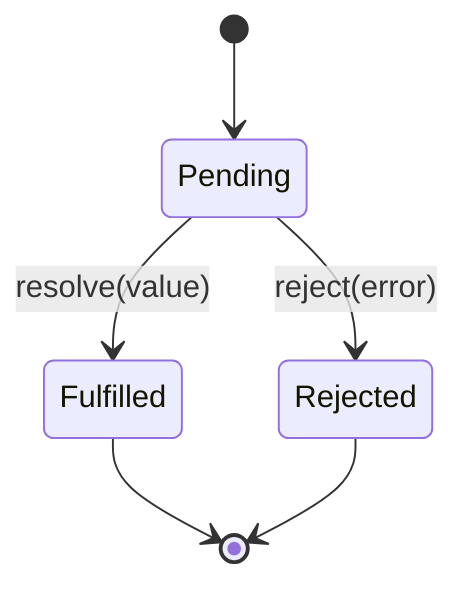

Promises are the standard abstraction for a value that will exist later, and `async`/`await` is how most modern code consumes them. Interviewers use this topic to check two things at once: do you understand the underlying contract, and do you write async code that is actually correct under failure and concurrency, not just in the happy path.

## Promise states and the then/catch/finally contract

A Promise is always in exactly one of three states, and a transition out of **pending** is permanent — a settled promise never changes state again.



| Method | Runs when | Receives | Returns |
|---|---|---|---|
| `.then(onFulfilled, onRejected)` | Fulfilled (first arg) or rejected (second arg) | The value or the reason | A new promise |
| `.catch(onRejected)` | Rejected — sugar for `.then(undefined, onRejected)` | The reason | A new promise |
| `.finally(onSettled)` | Either — no argument passed | Nothing | A new promise, forwarding the original result unless it throws |

> [!KEY]
> Every `.then()`/`.catch()`/`.finally()` call returns a **new promise**, never the same one. This is what makes chaining possible, and it's why forgetting to `return` inside a `.then()` silently breaks the chain.

## Chaining and flattening

```javascript
fetchUser(id)
  .then((user) => fetchOrders(user.id))   // returned promise is auto-flattened
  .then((orders) => orders.filter((o) => o.active))
  .then((active) => console.log(active))
  .catch((err) => console.error("pipeline failed:", err));
```

Returning a promise from inside a `.then()` **flattens** automatically — you never end up with a promise of a promise. Returning a plain value wraps it in an already-fulfilled promise for the next link. This flattening is exactly what makes chains readable instead of nesting ever deeper ("callback hell" with promises instead of callbacks — the classic mistake of forgetting to flatten).

## Error propagation and the unhandled rejection trap

A rejection skips every `.then()` until it finds a `.catch()` (or a second `.then()` argument) — exactly like a `throw` skipping frames until a `catch` block.

```javascript
Promise.resolve()
  .then(() => { throw new Error("boom"); })
  .then(() => console.log("skipped"))       // never runs
  .catch((err) => console.log("caught:", err.message)); // catches it
```

> [!DANGER]
> A rejected promise with **no** `.catch()` anywhere in its chain triggers an `unhandledrejection` event (browser) or crashes the process by default in modern Node. This is a common production incident: a fire-and-forget async call (`doWork()` with no `await` and no `.catch()`) silently swallows or crashes on its own errors depending on the runtime.

```javascript
// Fire-and-forget without a catch — a real bug, not just style
someAsyncCleanup(); // if this rejects, it's an unhandled rejection

// Fixed
someAsyncCleanup().catch((err) => logger.warn("cleanup failed", err));
```

## Promise.all vs allSettled vs race vs any

| Method | Resolves when | Rejects when | Result shape | Typical use |
|---|---|---|---|---|
| `Promise.all` | All fulfil | **Any** one rejects (immediately) | Array of values, same order | All-or-nothing parallel fetch |
| `Promise.allSettled` | All settle (fulfilled or rejected) | Never | Array of `{status, value or reason}` | Best-effort — you want every result even if some fail |
| `Promise.race` | First to settle, fulfilled or rejected | First to settle, if it's a rejection | The winner's value/reason | Timeout pattern, first response wins |
| `Promise.any` | First to **fulfil** | Only if **all** reject (`AggregateError`) | The first fulfilled value | First success, ignore failed sources |

```javascript
// Timeout pattern using race
const withTimeout = (promise, ms) =>
  Promise.race([
    promise,
    new Promise((_, reject) => setTimeout(() => reject(new Error("timeout")), ms)),
  ]);
```

> [!TIP]
> "Use `all` when partial failure means the whole operation failed; use `allSettled` when you want a report card of successes and failures" is the sentence that shows you understand the trade-off, not just the API names.

## async/await as syntax over promises

`async function` always returns a promise — returning a plain value wraps it, and a `throw` inside becomes a rejection. `await` pauses the function (not the thread) until the awaited promise settles, unwrapping the value or re-throwing the rejection.

```javascript
async function getActiveOrders(id) {
  const user = await fetchUser(id);      // pause here until settled
  const orders = await fetchOrders(user.id);
  return orders.filter((o) => o.active); // wrapped in a fulfilled promise automatically
}
```

This compiles conceptually to the same `.then()` chain from the previous section — `await` is a pause point, not a different concurrency model.

## Sequential vs parallel awaits — the accidental serialisation bug

Awaiting independent operations one after another serialises them even though nothing requires it:

```javascript
// Accidentally sequential: ~300ms if each call takes ~150ms
const user = await fetchUser(id);
const settings = await fetchSettings(id); // doesn't start until fetchUser resolves

// Correct: fire both immediately, then await both — ~150ms total
const [user2, settings2] = await Promise.all([fetchUser(id), fetchSettings(id)]);
```

> [!WARNING]
> This is one of the most common real-world async bugs and a favourite interview scenario question. The fix is always the same: **start** independent promises before awaiting any of them, then await together with `Promise.all`.

## Error handling with try/catch

```javascript
async function loadDashboard(id) {
  try {
    const data = await fetchUser(id);
    return data;
  } catch (err) {
    logger.error("dashboard load failed", err);
    throw err; // or return a fallback
  } finally {
    hideSpinner();
  }
}
```

`try/catch` around `await` catches rejections exactly like it catches thrown exceptions — this uniformity (sync throws and async rejections handled the same way) is the main ergonomic win of `async`/`await` over raw `.then()`/`.catch()` chains.

## Async iteration

`for await...of` consumes an **async iterable** — an object yielding promises (or values) one at a time, awaiting each before moving on. Common with paginated APIs and Node streams.

```javascript
async function* paginate(fetchPage) {
  let page = 0, hasMore = true;
  while (hasMore) {
    const { items, hasMore: more } = await fetchPage(page++);
    yield items;
    hasMore = more;
  }
}

for await (const items of paginate(fetchPage)) {
  console.log(items.length, "items in this page");
}
```

## Cancellation with AbortController

Promises have no built-in cancellation — once created, they run to completion. `AbortController` is the standard pattern layered on top: pass its `signal` to something that supports it (like `fetch`), and call `.abort()` to have it reject early.

```javascript
const controller = new AbortController();
const timeoutId = setTimeout(() => controller.abort(), 5000);

try {
  const res = await fetch("/api/data", { signal: controller.signal });
  clearTimeout(timeoutId);
  return await res.json();
} catch (err) {
  if (err.name === "AbortError") console.log("request timed out");
  throw err;
}
```

Aborting does not stop work already running synchronously inside the callback — it only rejects the promise and signals cooperating APIs (like `fetch`) to stop. Your own long-running async functions must check `signal.aborted` periodically to actually cooperate.

## Converting callbacks to promises

Node's `util.promisify` wraps the classic `(err, result) => {}` callback convention; for anything else, wrap manually.

```javascript
function readFilePromise(path) {
  return new Promise((resolve, reject) => {
    fs.readFile(path, "utf8", (err, data) => {
      if (err) reject(err);
      else resolve(data);
    });
  });
}
```

## Cheat sheet

- A promise is pending, then fulfilled or rejected — once — permanently.
- `.then`/`.catch`/`.finally` each return a **new** promise; returning a promise inside `.then()` auto-flattens.
- An unhandled rejection is a real bug, not a warning — always attach a `.catch()` to fire-and-forget async calls.
- `all` = all-or-nothing; `allSettled` = every result, success or failure; `race` = first to settle; `any` = first success.
- `async function` always returns a promise; `await` pauses the function, not the thread.
- Independent `await`s in sequence serialise unnecessarily — start them together, then `Promise.all`.
- `try/catch` around `await` handles rejections exactly like synchronous throws.
- Promises can't cancel themselves — use `AbortController` and cooperating APIs.

## Common mistakes

| Mistake | Fix |
|---|---|
| `await`ing independent calls one after another | Start both, then `await Promise.all([...])` |
| Fire-and-forget async call with no `.catch()` | Attach `.catch()` or wrap in `try/catch` if awaited |
| Forgetting to `return` a promise inside `.then()` | Chain breaks silently — always `return` |
| Using `Promise.all` when partial failure is acceptable | Use `Promise.allSettled` instead |
| Assuming `await` blocks the thread | It only pauses the current async function; the thread keeps running other work |
| Expecting `AbortController` to stop already-executing sync code | It only rejects the promise and signals cooperating APIs |

## Summary

A promise is a one-way state machine — pending to fulfilled or rejected, never back — and `.then`/`.catch`/`.finally` build new promises on top of it, which is what makes chaining and flattening possible. `async`/`await` is ergonomic sugar over exactly this mechanism: `await` pauses a function until a promise settles and lets you handle rejections with ordinary `try/catch`, but it does not change the underlying concurrency model, which is why independent `await`s in sequence quietly serialise work that should run in parallel. `Promise.all`, `allSettled`, `race`, and `any` each encode a different tolerance for partial failure, and real production code needs an explicit cancellation strategy (`AbortController`) since promises have none built in.

## Top Interview Questions

### Q1. What are the three states of a Promise, and can it transition back to pending?

A promise is **pending**, **fulfilled** (resolved with a value), or **rejected** (settled with a reason). Once it leaves pending, it is permanently settled — a promise can never go from fulfilled back to pending, or from rejected to fulfilled; calling `resolve` or `reject` again after the first call is simply ignored. This immutability is what makes promises safe to hand to multiple consumers: every `.then()` attached, even after the promise has already settled, sees the same final value or reason, it never changes underneath them.

### Q2. Why does returning a promise from inside a `.then()` not create a "promise of a promise"?

The Promise specification defines `.then()` to automatically **flatten** any thenable returned from its callback — instead of resolving with the inner promise itself, the outer promise waits for the inner one to settle and adopts its eventual value or rejection reason. This is what allows chains like `fetchUser(id).then(user => fetchOrders(user.id)).then(orders => ...)` to read as a flat sequence of steps rather than nested callbacks. If you forget to `return` the inner promise, the next `.then()` in the chain runs immediately with `undefined` instead of waiting — a subtle and common chaining bug.

### Q3. What is an unhandled promise rejection, and why is it a production concern, not just a lint warning?

It occurs when a promise rejects and no `.catch()` (or second `.then()` argument) exists anywhere in its chain by the time the microtask queue is checked. In browsers this fires an `unhandledrejection` event on `window`, usually just logged; in modern Node, by default, an unhandled rejection **crashes the process**. This matters most for fire-and-forget calls — `doBackgroundWork()` without `await` or `.catch()` — where a failure inside that function silently disappears in a browser or takes down a server in Node, making it a real incident-causing bug pattern, not a style nit.

### Q4. Compare `Promise.all`, `allSettled`, `race`, and `any`. When would you pick each?

`Promise.all` resolves with all values only if every promise fulfils, and rejects immediately on the first rejection — use it when partial failure means the whole operation is meaningless (e.g., you need both a user and their permissions before rendering). `Promise.allSettled` always resolves, giving a status/value or status/reason for each input — use it for best-effort work where you want to know what succeeded and what failed without aborting the rest (e.g., sending analytics to five endpoints). `Promise.race` settles as soon as the first promise settles, fulfilled or rejected — the standard building block for timeouts. `Promise.any` resolves with the first **fulfilled** value and only rejects (with an `AggregateError`) if all inputs reject — useful for querying multiple redundant sources and taking whichever responds successfully first.

### Q5. Is `async`/`await` a different concurrency model from Promises, or just syntax?

It is syntax, not a new model — an `async function` always returns a promise, and `await` is a pause point that suspends the function until the awaited promise settles, unwrapping its value or re-throwing its rejection. Under the hood this desugars to the same `.then()` chaining and microtask scheduling that plain promises use; nothing about the actual concurrency changes. The main thing `async`/`await` buys you is readability and being able to use ordinary `try/catch` for error handling, both synchronous throws and asynchronous rejections, instead of chaining `.catch()`.

### Q6. Walk through why this code is slower than necessary, and fix it.

```javascript
async function loadProfile(id) {
  const user = await fetchUser(id);
  const posts = await fetchPosts(id);
  return { user, posts };
}
```

`fetchPosts(id)` does not depend on the result of `fetchUser(id)`, but writing them as sequential `await`s means `fetchPosts` doesn't even *start* until `fetchUser` has fully resolved — if each takes 200ms, the function takes 400ms total for no reason. The fix is to start both operations immediately and await them together: `const [user, posts] = await Promise.all([fetchUser(id), fetchPosts(id)]);`, which runs both concurrently and finishes in roughly 200ms. This "accidental serialisation" is one of the most common async performance bugs in real codebases, often introduced when someone converts a `.then()` chain to `await` line by line without reconsidering dependencies.

### Q7. How do you handle errors when using `await`, and how does it differ from `.catch()` chaining?

Wrap the `await` in an ordinary `try/catch` block — a rejected promise causes `await` to throw synchronously from the caller's perspective, so the same `catch` block that handles thrown exceptions also handles async rejections, which is the main ergonomic advantage over `.then()`/`.catch()` chains. A `finally` block runs regardless of success or failure, useful for cleanup like hiding a loading spinner. One subtlety: if you `await` multiple calls inside one `try` block, a single `catch` handles a failure from *any* of them, which can be too coarse — wrap independent operations in their own `try/catch` (or use `allSettled`) if you need to know specifically which one failed.

### Q8. What does `for await...of` do, and when would you reach for it?

It iterates over an **async iterable** — an object whose iterator returns promises — awaiting each one in turn before the loop body runs, unlike a plain `for...of` which would just give you unresolved promise objects. It's the natural fit for paginated APIs (an async generator that fetches and yields one page at a time) and for consuming Node streams or any data source that arrives incrementally over time rather than all at once. It backpressures naturally: the loop won't request the next value until the current one has been awaited and processed, unlike firing off `Promise.all` on every page upfront.

### Q9. Promises have no built-in cancellation. How do you implement a cancellable fetch with a timeout?

Use `AbortController`: create one, pass its `.signal` to `fetch`, and call `controller.abort()` either on a `setTimeout` (for a timeout) or in response to a user action (like navigating away). Aborting causes the `fetch` promise to reject with an `AbortError`, which you distinguish from other failures in your `catch` block by checking `err.name`. It's important to note this only cancels APIs that explicitly support the `AbortSignal` contract — your own async functions doing CPU work won't stop just because a signal fired; they need to check `signal.aborted` periodically themselves and bail out cooperatively.

### Q10. How would you convert a legacy Node callback-style function into one that returns a Promise?

For functions following Node's `(err, result) => {}` convention, `util.promisify` does this automatically: `const readFileAsync = util.promisify(fs.readFile);`. For anything else, wrap it manually: return `new Promise((resolve, reject) => { legacyFn(args, (err, result) => err ? reject(err) : resolve(result)); })`. The key detail to get right is making sure every code path inside the callback calls exactly one of `resolve`/`reject` — calling neither leaves the promise pending forever (a silent hang), and calling both is simply ignored after the first, which can mask a bug where you intended only one to fire.

### Q11. Two async operations, and you only care about whichever comes back successfully first, ignoring failures unless everything fails. Which combinator, and what does the failure case look like?

`Promise.any` is built for exactly this — it resolves as soon as the first promise fulfils, so if you're racing two redundant data sources (a primary and a fallback API) and only need one successful response, it gives you that response without waiting on or caring about the slower one. If **every** promise passed to it rejects, `Promise.any` itself rejects with an `AggregateError`, whose `.errors` property is an array containing every individual rejection reason — this is different from `Promise.race`, which would reject immediately on the *first* settled promise even if that one happened to be a rejection and a later one would have succeeded.
