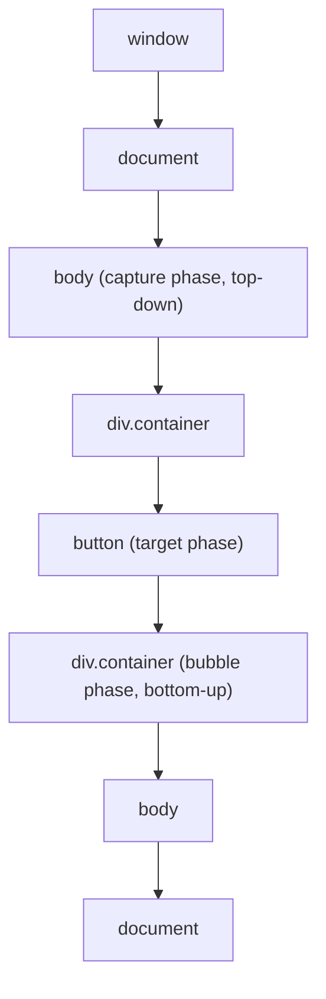
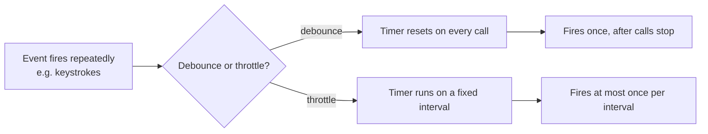

DOM events and their rate-limiting cousins, debounce and throttle, are the bread-and-butter performance topic of front-end interviews. A backend engineer already understands rate limiting conceptually — this section maps that intuition onto the browser's event model and the two implementations you are expected to be able to write from memory.

## Event propagation: capture, target, bubble

A DOM event does not just fire at the element it happened on — it travels through the tree in three phases.



| Phase | Direction | Triggered by default? |
|---|---|---|
| Capture | Root down to the target | Only if listener registered with `{ capture: true }` |
| Target | At the element the event actually occurred on | Always |
| Bubble | Target back up to the root | Yes, for most events (a few, like `focus`/`blur`, don't bubble) |

```javascript
el.addEventListener("click", handler, { capture: true }); // fires during capture
el.addEventListener("click", handler);                     // fires during bubble (default)
```

> [!KEY]
> Almost all real code listens on the bubble phase (the default). Capture is mainly for intercepting an event **before** a child gets a chance to handle or stop it — a common use is a top-level "close all open menus" handler.

## stopPropagation vs preventDefault vs stopImmediatePropagation

These three are frequently confused, and interviewers like to ask for all three in one breath.

| Method | Stops the event from | Stops the default browser action? | Stops sibling listeners on the same element? |
|---|---|---|---|
| `preventDefault()` | Nothing — propagation continues | Yes (e.g., form submit, link navigation, checkbox toggle) | No |
| `stopPropagation()` | Continuing to bubble/capture past the current element | No | No |
| `stopImmediatePropagation()` | Continuing to propagate, **and** any other listeners on the same element | No | Yes |

```javascript
link.addEventListener("click", (e) => {
  e.preventDefault();  // stop navigation, event still bubbles
  console.log("intercepted");
});
```

> [!WARNING]
> `stopPropagation()` does not stop the default action, and `preventDefault()` does not stop propagation — they are independent axes. Confusing them is the classic mistake that leaves a form submitting when the candidate only meant to stop it from bubbling.

## Event delegation

Instead of attaching a listener to every item in a list, attach **one** listener to a stable ancestor and inspect `event.target` to work out which child fired it. This relies on bubbling.

```javascript
// One listener handles clicks on any current or future <li>, no per-item binding
list.addEventListener("click", (e) => {
  const item = e.target.closest("li");
  if (!item) return;
  console.log("clicked:", item.dataset.id);
});
```

This matters most for **dynamic lists**: items added later automatically work with no re-binding, memory usage stays flat regardless of list size (one listener instead of thousands), and removing items never leaves orphaned listeners behind.

> [!TIP]
> "I'd delegate to the list container and use `closest()` to find the item, rather than binding a listener per row" is the answer that signals you've actually built a virtualised or infinitely-scrolling list before.

## Passive listeners and custom events

`{ passive: true }` tells the browser the listener will **never** call `preventDefault()`, letting it start scrolling immediately instead of waiting to see if you cancel it — a meaningful scroll-jank fix for `touchstart`/`wheel` listeners.

```javascript
window.addEventListener("scroll", onScroll, { passive: true });
```

Custom events let components communicate without direct references, dispatched and bubbled like native ones:

```javascript
el.dispatchEvent(new CustomEvent("item-selected", { detail: { id: 42 }, bubbles: true }));
document.addEventListener("item-selected", (e) => console.log(e.detail.id));
```

## Debounce vs throttle

Both limit how often a function runs in response to a high-frequency event, but they solve different problems.

| | Debounce | Throttle |
|---|---|---|
| Guarantees | Runs once, **after** input goes quiet for `wait` ms | Runs at most once per `wait` ms, **during** continuous input |
| Mental model | "Wait until they stop typing" | "Sample at a fixed rate" |
| Rapid repeated calls | Each call resets the timer — only the last one (eventually) fires | First (or last, depending on edge) call in each window fires; the rest are dropped |
| Typical use | Search-as-you-type, autosave, form validation | Scroll position tracking, resize handlers, mouse-move drag |



### Leading vs trailing edge

Both patterns can fire at the **start** of the burst (leading), the **end** (trailing), or both.

| Edge | Debounce behaviour | Throttle behaviour |
|---|---|---|
| Trailing (default) | Fires once, `wait` ms after the last call | Fires at the end of each window if a call happened during it |
| Leading | Fires immediately on the first call, then ignores the rest until quiet | Fires immediately on the first call of each window |

## Implementing debounce from scratch

```typescript
function debounce<T extends (...args: unknown[]) => void>(
  fn: T,
  wait: number,
  { leading = false }: { leading?: boolean } = {}
): (...args: Parameters<T>) => void {
  let timer: ReturnType<typeof setTimeout> | null = null;

  return (...args: Parameters<T>) => {
    const callNow = leading && timer === null;
    if (timer) clearTimeout(timer); // reset the clock on every call

    timer = setTimeout(() => {
      timer = null;
      if (!leading) fn(...args); // trailing: fire after the gap
    }, wait);

    if (callNow) fn(...args); // leading: fire immediately, once
  };
}
```

## Implementing throttle from scratch

```typescript
function throttle<T extends (...args: unknown[]) => void>(
  fn: T,
  wait: number
): (...args: Parameters<T>) => void {
  let lastRun = 0;
  let timer: ReturnType<typeof setTimeout> | null = null;

  return (...args: Parameters<T>) => {
    const now = Date.now();
    const remaining = wait - (now - lastRun);

    if (remaining <= 0) {
      // window has elapsed — run immediately (leading edge)
      lastRun = now;
      fn(...args);
    } else if (!timer) {
      // schedule one trailing call so the last event in the window isn't dropped
      timer = setTimeout(() => {
        lastRun = Date.now();
        timer = null;
        fn(...args);
      }, remaining);
    }
  };
}
```

> [!DANGER]
> A throttle with **only** a leading edge silently drops the final event in a burst — if a user stops scrolling mid-window, the last position update never fires. Combining leading + trailing (as above) is what real libraries like Lodash do by default, and is worth mentioning even if you implement the simpler leading-only version first.

## requestAnimationFrame throttling

For anything visual (scroll-linked animation, drag), throttling to the display's refresh rate rather than a fixed millisecond value avoids doing more work than the screen can actually show:

```javascript
let ticking = false;
window.addEventListener("scroll", () => {
  if (ticking) return;
  ticking = true;
  requestAnimationFrame(() => {
    updateParallax(window.scrollY);
    ticking = false;
  });
});
```

## Real use cases

| Scenario | Technique | Why |
|---|---|---|
| Search-as-you-type | Debounce, ~300ms trailing | Avoid a network call per keystroke; wait until the user pauses |
| Scroll position tracking | Throttle or rAF | Needs regular updates, not just the final value |
| Window resize (recalculate layout) | Debounce, ~150–250ms trailing | Layout recalculation is expensive; only needed once resizing stops |
| Autosave a document | Debounce, ~1–2s trailing | Don't hit the server on every keystroke, but do eventually persist |
| Button double-click / form double-submit | Throttle (or disable after first click) | First click should count immediately; extras must be ignored |

## Memory leaks from unremoved listeners

An event listener holds a reference to its callback, and that callback's closure keeps everything it captured alive — if the element is removed from the DOM but the listener (and whatever it references) is never cleaned up, the whole chain can outlive its usefulness.

```javascript
function attach() {
  const bigData = new Array(1_000_000).fill("x");
  const handler = () => console.log(bigData.length); // closure keeps bigData alive
  window.addEventListener("resize", handler);
  return () => window.removeEventListener("resize", handler); // must be called to release it
}
```

In frameworks, this is exactly why `useEffect` cleanup functions and Angular's `ngOnDestroy` exist — they are the designated place to call `removeEventListener` so a component that unmounts doesn't leave a dangling listener attached to `window` or `document`.

## Cheat sheet

- Events travel capture (down) → target → bubble (up); most listeners use the default bubble phase.
- `preventDefault` stops the default action; `stopPropagation` stops further travel; `stopImmediatePropagation` stops further travel and later listeners on the same element, but does not cancel the default action.
- Delegate listeners to a stable ancestor for dynamic lists — one listener, `event.target.closest(...)` to identify the child.
- `{ passive: true }` on scroll/touch listeners avoids blocking the browser's compositor thread.
- Debounce = wait for quiet, then fire once. Throttle = fire at most once per fixed window.
- Leading edge = fire immediately, then suppress. Trailing edge = fire after the gap/window ends.
- A throttle with no trailing edge drops the final event of a burst — usually a bug, not a feature.
- Always pair `addEventListener` with `removeEventListener` in cleanup to avoid leaks.

## Common mistakes

| Mistake | Fix |
|---|---|
| Binding a listener per list item instead of delegating | Attach one listener to the container, use `event.target.closest()` |
| Confusing `stopPropagation` with `preventDefault` | They are independent — stopping one does not stop the other |
| Using debounce for a progress/scroll indicator | Use throttle or rAF — you need updates during the action, not just after |
| Leading-only throttle silently dropping the last event | Add a trailing-edge call after the window elapses |
| Forgetting to `removeEventListener` on unmount/cleanup | Return/register a cleanup function that removes the exact same reference |
| Attaching a non-passive listener on `touchstart`/`wheel` | Mark it `{ passive: true }` unless you truly need `preventDefault()` |

## Summary

Events propagate through capture, target and bubble phases, and understanding that lets you delegate a single listener to a container instead of binding one per element — essential for dynamic and virtualised lists. `preventDefault`, `stopPropagation`, and `stopImmediatePropagation` are three independent controls, not one, and mixing them up is a common live-coding slip. Debounce and throttle both rate-limit a high-frequency event but for different goals — debounce waits for silence, throttle guarantees a steady sampling rate — and being able to implement both from scratch, including the leading/trailing edge behaviour, is one of the most common practical JavaScript exercises asked in interviews.

## Top Interview Questions

### Q1. Explain the three phases of DOM event propagation.

An event starts at `window`, travels **down** through ancestors to the target element — the capture phase — then fires **at** the target itself, then travels back **up** through the same ancestors to `window` — the bubble phase. By default, `addEventListener` registers a bubble-phase listener; passing `{ capture: true }` registers it for the capture phase instead. Most application code listens on bubble because it composes naturally with event delegation, but capture is useful when you need to intercept an event before a descendant's own handler can act on or stop it, such as a global "dismiss all open dropdowns" listener on `document`.

### Q2. What is the difference between `stopPropagation()`, `preventDefault()`, and `stopImmediatePropagation()`?

`preventDefault()` cancels the browser's default action for that event (link navigation, form submission, checkbox toggling) but does nothing to propagation — the event still bubbles and other listeners still see it. `stopPropagation()` prevents the event from continuing to travel to ancestor (or descendant, during capture) elements, but does not cancel the default action and does not stop other listeners already registered on the *same* element. `stopImmediatePropagation()` does everything `stopPropagation()` does, plus it prevents any remaining listeners on that same element from running at all, even ones registered after it in the same phase. These are three independent controls, and the common interview trap is assuming stopping one implies stopping another.

### Q3. Why is event delegation important for a list that grows and shrinks dynamically?

If you bind a listener to every list item individually, every newly added item needs its own listener bound at creation time, and every removed item should have its listener cleaned up or it risks leaking — both easy to get wrong and expensive at scale (thousands of listeners for a long list). Delegation attaches a single listener to a stable ancestor (the list container) and relies on bubbling: when any descendant is clicked, the event bubbles up to the container, where `event.target.closest("li")` (or similar) identifies which item was actually interacted with. This means new items work immediately with zero extra binding code, memory usage is flat regardless of list size, and there is nothing to clean up when items are removed.

### Q4. What does `{ passive: true }` do, and why does it matter for scroll performance?

It tells the browser that the listener will never call `preventDefault()`, so the browser's compositor thread doesn't need to wait for the (potentially slow) JavaScript handler to finish before it starts scrolling — normally it must wait, in case the handler cancels the scroll. On `touchstart`/`touchmove`/`wheel` listeners in particular, a non-passive listener can introduce visible scroll jank because every frame of scrolling is gated on JS execution. Marking a listener passive when it genuinely never prevents default is a straightforward, low-risk performance win, and many browsers now warn in devtools when a scroll-blocking listener isn't marked passive.

### Q5. Implement `debounce` from scratch. What does the leading option change?

```typescript
function debounce(fn, wait, { leading = false } = {}) {
  let timer = null;
  return (...args) => {
    const callNow = leading && timer === null;
    if (timer) clearTimeout(timer);
    timer = setTimeout(() => {
      timer = null;
      if (!leading) fn(...args);
    }, wait);
    if (callNow) fn(...args);
  };
}
```

Every call clears any pending timer and starts a new one, so the wrapped function only actually runs once the calls stop arriving for `wait` milliseconds — the trailing edge, which is the default. With `leading: true`, the very first call in a burst fires immediately (useful for "respond instantly, then ignore repeats until quiet"), and the trailing call is suppressed so it doesn't also fire a second time at the end of the same burst.

### Q6. Implement `throttle` from scratch, and explain what happens to events that arrive between windows.

```typescript
function throttle(fn, wait) {
  let lastRun = 0, timer = null;
  return (...args) => {
    const now = Date.now();
    const remaining = wait - (now - lastRun);
    if (remaining <= 0) {
      lastRun = now;
      fn(...args);
    } else if (!timer) {
      timer = setTimeout(() => { lastRun = Date.now(); timer = null; fn(...args); }, remaining);
    }
  };
}
```

Calls that land after a full `wait` window has elapsed since the last run fire immediately, resetting the window (leading edge). Calls that arrive mid-window are dropped, *except* the implementation schedules one pending trailing call so that the most recent set of arguments still fires once the window ends — without that trailing timer, a burst that stops mid-window would silently lose its final event, which is a common bug in naive throttle implementations.

### Q7. When would you choose throttle over debounce for a scroll handler, and vice versa for a search box?

A scroll handler that updates a progress bar or triggers a parallax effect needs to run periodically **while** scrolling is happening — the user should see continuous feedback, not just one update after they stop, so throttle (or `requestAnimationFrame`-based throttling) is correct; debounce would make the UI feel unresponsive, only updating once scrolling ends. A search-as-you-type box, by contrast, should not fire a network request on every keystroke — the goal is to wait until the user has paused typing and then fire exactly once, which is precisely debounce's contract; throttle would still send requests mid-typing, wasting calls on intermediate, incomplete queries.

### Q8. A component adds a `resize` listener in its constructor/mount but the page's memory grows over time as components are created and destroyed. What's happening and how do you fix it?

The listener was attached to a long-lived target (`window`) but never removed when the component was destroyed, so the listener — and the entire closure it captured, including any large data structures referenced inside the handler — stays reachable and cannot be garbage collected even though the component itself is gone from the DOM. The fix is to store a reference to the exact handler function used in `addEventListener` and call `removeEventListener` with that same reference during the component's teardown/cleanup lifecycle (`useEffect` cleanup in React, `ngOnDestroy` in Angular, `disconnectedCallback` for a web component). This is a very common real leak, especially when several instances of the same component are mounted and unmounted repeatedly over a session.

### Q9. What is the difference between a synthetic event system (like React's) and native DOM events, at a conceptual level?

Frameworks that use a synthetic event system attach a small number of listeners near the root of the document (historically one per event type) rather than one per element, and use their own internal event object that wraps the native one — this is essentially event delegation baked into the framework itself, for the same performance reasons you'd delegate manually. The synthetic event normalizes cross-browser differences and integrates with the framework's own scheduling (batching state updates triggered from within an event handler), whereas raw DOM events fire and are handled immediately, synchronously, with no batching unless you introduce it yourself.

### Q10. How would you implement a custom event so two unrelated components can communicate without a direct reference to each other?

Use the `CustomEvent` constructor to create an event carrying arbitrary data in its `detail` property, dispatch it from one element with `element.dispatchEvent(new CustomEvent("name", { detail: payload, bubbles: true }))`, and listen for it anywhere in the ancestor chain (or on `document` if bubbling is enabled) with a normal `addEventListener("name", handler)`. This decouples the emitter from the listener entirely — neither needs a reference to the other, only a shared event name and payload shape — which is useful for cross-component communication in vanilla JS or web components, though in a framework with its own state management, a shared store or context is usually preferred for anything beyond simple, one-off signals.

### Q11. In production, a search input is issuing a network request per keystroke and overwhelming the backend. Walk through your fix, including a subtlety with out-of-order responses.

The immediate fix is debouncing the input handler (roughly 250–400ms trailing) so a request only fires once the user pauses typing, cutting request volume dramatically for fast typists. The subtlety debouncing alone doesn't solve is response ordering: if a user types, pauses, types more, and two requests do end up in flight (e.g., due to slow network rather than fast typing), a slower response for an *earlier* query can arrive after a faster response for a *later* one and overwrite the UI with stale results. The robust fix is to track a request ID or use `AbortController` to cancel the previous in-flight request when a new one starts, so only the response matching the latest query is ever applied to the UI.
