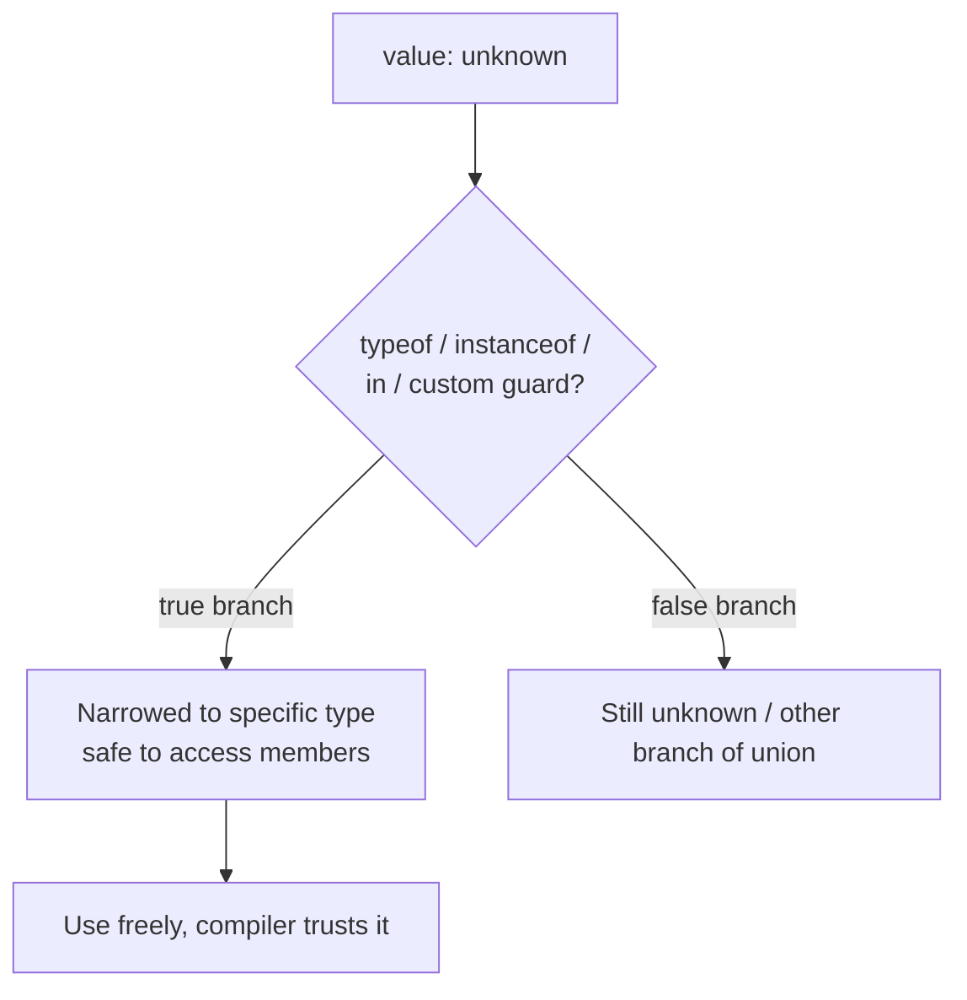

TypeScript's type system is structural, not nominal, which is the single biggest mental adjustment for engineers coming from C# or Java. Interviewers use this topic to check whether you can reason about types as compile-time contracts that get erased at runtime, and whether you write types that actually catch bugs rather than just satisfying the compiler.

## Structural typing vs nominal typing

TypeScript compares types by **shape** — if two types have compatible members, they are compatible, regardless of name or declared hierarchy. C#/Java use **nominal** typing — compatibility requires an explicit declared relationship (implements/extends).

```typescript
interface Point { x: number; y: number; }
class Vector { constructor(public x: number, public y: number) {} }

function log(p: Point) { console.log(p.x, p.y); }
log(new Vector(1, 2)); // fine — Vector's shape satisfies Point, no relationship declared
```

> [!KEY]
> "Does it have the right shape?" replaces "does it declare the right interface?" — this is why TypeScript can type plain object literals and JSON responses without wrapping them in classes.

## type vs interface

Both describe object shapes, and for plain objects they are close to interchangeable — but the differences matter in specific situations interviewers probe.

| | `interface` | `type` |
|---|---|---|
| Object shapes | Yes | Yes |
| Unions / intersections | No | Yes — `type A = B \| C` |
| Declaration merging (reopen and add members) | Yes — same name merges automatically | No — duplicate name is an error |
| Extending | `extends` (multiple) | `&` intersection |
| Primitives, tuples, mapped/conditional types | No | Yes |
| Typical convention | Public API shapes, class contracts | Unions, utility/derived types, function types |

> [!TIP]
> "I default to `interface` for object shapes that might need to be extended or merged, and `type` for everything else — unions, tuples, mapped types" is a defensible, common team convention to state out loud.

## Union and intersection types

```typescript
type Id = string | number;          // union: A OR B
type Timestamped = { createdAt: Date };
type Audited = Timestamped & { updatedBy: string }; // intersection: A AND B — has both sets of members
```

A union restricts you to operations valid on **every** member until you narrow; an intersection combines all members' requirements into one type.

## Literal types and discriminated unions

A literal type narrows a primitive to one specific value (`"idle"` as a type, not just `string`). Combined into a union with a common tag field, this gives you a **discriminated union** — the backbone of modeling state machines and API responses in TypeScript.

```typescript
type RequestState =
  | { status: "idle" }
  | { status: "loading" }
  | { status: "success"; data: string[] }
  | { status: "error"; message: string };

function render(state: RequestState) {
  switch (state.status) {
    case "idle": return "Waiting to start";
    case "loading": return "Loading…";
    case "success": return `Got ${state.data.length} items`;
    case "error": return `Failed: ${state.message}`;
    default:
      const _exhaustive: never = state; // compile error if a case is missing
      return _exhaustive;
  }
}
```

Checking `state.status` narrows `state` inside each `case` to exactly the matching branch of the union, so `state.data` is only accessible where `status` is `"success"`. The `default` branch assigning to a `never`-typed variable is the **exhaustiveness check** — if someone adds a new state to the union and forgets a case, this line fails to compile instead of silently returning `undefined` at runtime.

Exhaustiveness checking via `never` converts "forgot to handle a case" from a runtime bug into a compile-time error. This is the single most useful pattern for modeling state in TypeScript.

## Type narrowing



| Technique | Example | Narrows based on |
|---|---|---|
| `typeof` | `if (typeof x === "string")` | Primitive type |
| `instanceof` | `if (err instanceof ValidationError)` | Class/prototype chain |
| `in` | `if ("bark" in animal)` | Presence of a property |
| Custom type guard | `function isDog(a: Animal): a is Dog` | Any custom runtime check |
| Assertion function | `function assertIsString(x: unknown): asserts x is string` | Throws if false, narrows afterward |
| Discriminated union | `switch (state.status)` | A shared literal tag field |

```typescript
function isDog(animal: Dog | Cat): animal is Dog {
  return (animal as Dog).bark !== undefined;
}

function assertIsString(x: unknown): asserts x is string {
  if (typeof x !== "string") throw new TypeError("expected string");
}

function process(x: unknown) {
  assertIsString(x);
  console.log(x.toUpperCase()); // x is string here, no cast needed
}
```

Custom type guards and assertion functions both let you teach the compiler about runtime checks it can't infer on its own — the difference is a type guard returns a boolean and narrows in the `if` branch, while an assertion function narrows everything **after** the call by throwing on failure.

## Optional and readonly

```typescript
interface User {
  readonly id: string;   // cannot be reassigned after creation
  name: string;
  nickname?: string;     // may be undefined; equivalent to `nickname: string | undefined`
}
```

`readonly` is compile-time only — it does not freeze the object at runtime the way `Object.freeze` does. `?` on a property is shorthand for a union with `undefined`, which is why `strictNullChecks` forces you to check before use.

## unknown vs any vs never

| | `any` | `unknown` | `never` |
|---|---|---|---|
| Meaning | "Turn off type checking" | "Some value, type not yet known" | "This can never happen" / no value at all |
| Can assign to it | Anything | Anything | Nothing (except `never` itself) |
| Can read/call members without a check | Yes — unsafely | No — must narrow first | N/A — unreachable code |
| Typical source | Legacy code, escape hatch | `catch` clause variables, JSON parse results, external input | Exhaustiveness checks, functions that always throw, impossible union branches |
| Safety | Unsafe — defeats the type system | Safe — forces narrowing before use | Used to *prove* safety (unreachable code) |

```typescript
function parseJson(text: string): unknown {
  return JSON.parse(text); // caller must narrow before using the result
}

function fail(message: string): never {
  throw new Error(message); // never returns normally
}
```

> [!WARNING]
> `any` is not "I don't know the type" — it is "stop type-checking this value entirely," including everything derived from it. `unknown` is almost always the correct choice when you genuinely don't know a type yet, because it forces a narrowing check before any operation.

## Strict mode flags that matter

`"strict": true` in `tsconfig.json` enables a bundle of checks; the ones that catch the most real bugs:

| Flag | What it catches |
|---|---|
| `strictNullChecks` | Using a possibly `null`/`undefined` value without a check |
| `noImplicitAny` | A parameter or variable that silently fell back to `any` because it couldn't be inferred |
| `strictFunctionTypes` | Unsound assignment of function types with incompatible parameter variance |
| `strictPropertyInitialization` | A class property declared but never assigned in the constructor |
| `noUncheckedIndexedAccess` | `arr[i]` typed as possibly `undefined` instead of assuming it's always in bounds |

> [!DANGER]
> A codebase without `strictNullChecks` treats `null` and `undefined` as assignable to everything, which silently defeats most of the value of using TypeScript at all. It is the single highest-value flag to turn on.

## Type inference and when to annotate

TypeScript infers types from initializers, return statements, and control flow, so most local variables need no annotation at all:

```typescript
let count = 0;               // inferred: number
const users = [];            // inferred: any[] — annotate this one!
const users2: User[] = [];   // annotate empty collections and public function signatures
```

Annotate: function parameters (never inferred), public function/method return types (documents the contract and catches accidental widening), and empty array/object literals. Skip annotating: local variables with an obvious initializer, and most `const` values — let inference do the work.

## Declaration merging

Interfaces with the same name in the same scope **merge** their members automatically — a feature `type` deliberately does not have.

```typescript
interface Window { myGlobal: string; } // augments the existing lib.dom.d.ts Window interface
```

This is how libraries let consumers extend built-in or third-party types (e.g., adding a custom property to `Express.Request`) without modifying the original declaration file.

## Enums vs union of literals

```typescript
enum Status { Idle, Loading, Success, Error }         // emits real runtime JS object
type StatusLiteral = "idle" | "loading" | "success" | "error"; // erased entirely, zero runtime cost
```

| | `enum` | Union of string literals |
|---|---|---|
| Runtime footprint | Real JS object emitted | None — fully erased at compile time |
| Interop with plain strings/JSON | Awkward — needs mapping | Trivial — it *is* a string |
| Reverse mapping (numeric enums) | Yes | No |
| Common recommendation | Avoid unless you need the runtime object | Preferred default for most APIs |

## Cheat sheet

- TypeScript is structural — shape compatibility, not declared inheritance, decides assignability.
- `interface` merges and extends; `type` handles unions, intersections, and everything non-object-shaped.
- Discriminated unions + a `never`-typed exhaustiveness check turn "missed a case" into a compile error.
- `unknown` is the safe "I don't know yet"; `any` disables checking; `never` means "cannot happen".
- Type guards (`is`) narrow inside a branch; assertion functions (`asserts`) narrow everything after the call.
- Turn on `strictNullChecks` and `noImplicitAny` first — they catch the most real bugs per line changed.
- Annotate function signatures and empty collections; let inference handle the rest.
- Prefer string literal unions over `enum` unless you specifically need the emitted runtime object.

## Common mistakes

| Mistake | Fix |
|---|---|
| Using `any` to silence a type error instead of understanding it | Use `unknown` and narrow, or fix the actual type |
| Forgetting the exhaustiveness check on a discriminated union | Assign the `default` case to a `never`-typed variable |
| Assuming `readonly` freezes an object at runtime | It's compile-time only; use `Object.freeze` for real immutability |
| Reaching for `enum` by default | Prefer a union of string literals unless you need the runtime object |
| Not enabling `strictNullChecks` | Turn it on — it is the single highest-value strict flag |
| Annotating every local variable redundantly | Let inference handle obvious cases; annotate signatures instead |

## Summary

TypeScript's structural type system checks shape, not declared identity, which is what lets it type plain objects and JSON without wrapper classes. Discriminated unions combined with a `never`-typed exhaustiveness check are the most powerful pattern in the language for modeling state safely, converting a forgotten case into a compile error instead of a runtime surprise. `unknown`, `any`, and `never` occupy three very different roles — "safe unknown", "unsafe escape hatch", and "cannot happen" — and confusing `any` for `unknown` quietly turns off the type checker exactly where you need it most. Enabling `strictNullChecks` and `noImplicitAny` catches the majority of real bugs TypeScript is capable of catching; everything else is refinement on top of that foundation.

## Top Interview Questions

### Q1. What is structural typing, and how is it different from the nominal typing in C# or Java?

Structural typing determines type compatibility by comparing the **shape** of two types — their members and member types — regardless of how or whether they were declared to be related. Nominal typing, used in C#/Java, requires an explicit declared relationship: a class is only assignable to an interface type if it explicitly `implements` that interface, even if its members match exactly. In TypeScript, a `Vector` class with `x`/`y` number properties is assignable anywhere a `{ x: number; y: number }` shape is expected, with no `implements` clause needed — this is why TypeScript can seamlessly type object literals, JSON responses, and function return values without wrapping everything in classes.

### Q2. When would you choose `interface` over `type`, and vice versa?

`interface` is the better default for object shapes that represent public contracts, especially ones you expect consumers to extend or that a library might need to augment later, because interfaces with the same name automatically merge — a deliberate feature `type` does not have. `type` is required for anything that isn't a plain object shape: unions (`"a" | "b"`), intersections, tuples, mapped types, and conditional types. In practice, a common convention is `interface` for object/class shapes and `type` for everything else, though for simple object shapes with no need for merging, the choice is largely stylistic and teams should pick one convention and stay consistent.

### Q3. Explain discriminated unions and how exhaustiveness checking works with `never`.

A discriminated union is a union of object types sharing a common literal-typed field (the "discriminant" or "tag"), like `status` in `{ status: "success"; data: T } | { status: "error"; message: string }`. Switching or branching on that tag field narrows the type inside each branch, so TypeScript only lets you access `data` where `status` is `"success"`. Exhaustiveness checking adds a `default`/final `else` branch that assigns the remaining value to a variable explicitly typed `never`; if every case has been handled, the compiler has narrowed the type down to nothing left (`never`) and the assignment is valid, but if a case was missed, the remaining type isn't `never`, and the assignment fails to compile — converting a runtime "unhandled case" bug into a build failure.

### Q4. What's the difference between `unknown` and `any`? Why is defaulting to `any` risky?

`any` disables type checking entirely for that value and everything derived from it — you can call any method, access any property, and pass it anywhere, all without a compile error, even if the operation is actually unsafe at runtime. `unknown` also represents "a value of some unknown type", but it is safe: you cannot call methods or access properties on it until you've narrowed it with a type guard, `typeof`, `instanceof`, or a similar check. Defaulting to `any` is risky because it doesn't just weaken checking for that one value — it silently propagates: anything computed from an `any` value also becomes `any`, quietly disabling type safety across a growing portion of the codebase from a single starting point.

### Q5. How do type guards and assertion functions differ, and when would you use each?

A type guard is a function returning a boolean with a special return type, `x is SomeType`, and it narrows the checked variable's type **only within the branch where the guard returned true** — e.g., inside the `if` block after `if (isDog(animal))`. An assertion function has a return type of `asserts x is SomeType` (or just `asserts x`) and, rather than returning a boolean to branch on, it throws if the condition fails — TypeScript then narrows the type for **all code after the call**, without needing an `if`. Use a type guard when you need to branch (different logic for true/false); use an assertion function when failing the check should simply stop execution, like validating a function's input at the top before proceeding.

### Q6. What does `strictNullChecks` actually change, and why is it considered the highest-value strict flag?

Without it, `null` and `undefined` are assignable to every type, so a value typed `string` might actually be `null` at runtime with no compile-time warning — this defeats a large part of what makes TypeScript useful, since "might be null" is one of the most common sources of runtime crashes in any language. With `strictNullChecks` on, `null`/`undefined` are only assignable where explicitly allowed (`string | null`, or an optional `?` property), forcing you to narrow (`if (value) {...}`) before using a possibly-absent value. Teams that adopt TypeScript without this flag get much weaker guarantees than they think they do — it is usually described as the single highest-value flag to enable, because it directly targets the most common class of production bug.

### Q7. A junior developer used `enum` for a status field. What would you suggest instead, and why?

For most cases, a union of string literals (`type Status = "idle" | "loading" | "success" | "error"`) is preferable to a TypeScript `enum`. `enum` emits a real JavaScript object at runtime with reverse-mapping logic for numeric enums, adding bundle size and an extra layer of indirection when interoperating with plain strings from JSON or an API, whereas a literal union is completely erased at compile time and *is* just a string — trivial to serialize, log, and compare. The main case for keeping a real `enum` is when you specifically need the runtime object itself (iterating over all values, or reverse lookup by numeric value), which is uncommon in typical application code.

### Q8. Why doesn't `readonly` prevent mutation the way `Object.freeze` does?

`readonly` is a compile-time-only annotation — the TypeScript compiler will reject code that tries to reassign a `readonly` property, but this check disappears entirely once the code is compiled to plain JavaScript, since types are erased at compile time. `Object.freeze()`, by contrast, is a runtime operation that actually prevents property reassignment (in non-strict mode, silently; in strict mode, by throwing) regardless of what any type checker says. This means code that bypasses the type checker — a type assertion (`as`), untyped JavaScript calling into your module, or JSON deserialization — can still mutate a `readonly`-declared property at runtime; if you need a real runtime guarantee, you need `Object.freeze` (or a deep-freeze utility) in addition to the type-level `readonly`.

### Q9. What is declaration merging, and give a real use case.

Declaration merging is TypeScript's rule that multiple `interface` declarations with the same name, in the same scope, are combined into a single interface with the union of all their members — this only applies to `interface`, not `type`, which errors on duplicate names. A common real use case is augmenting a third-party or built-in type: adding a custom property to Express's `Request` interface (`declare global { namespace Express { interface Request { user?: User; } } }`) so `req.user` type-checks throughout your app, without needing to fork or modify Express's own type declaration files. Library authors also use this deliberately to let consumers extend a base interface with plugin-specific fields.

### Q10. How would you decide when to add an explicit type annotation versus letting TypeScript infer it?

Always annotate function parameters, since they are never inferred from usage and default to `any` under a non-strict config (or an error under `noImplicitAny`); annotate public function and method return types too, both as documentation and to catch an accidental change in what a function returns. Also annotate empty array or object literals (`const items: User[] = []`), since TypeScript can only infer `any[]` from `[]` with nothing to go on. For everything else — local variables with an obvious initializer, most `const` declarations — let inference do the work; over-annotating these adds noise without adding safety, since the compiler already derives the precise type from the right-hand side.

### Q11. You're reviewing a PR that casts an API response with `as any` to work around a type error before accessing a nested property. What do you push back with, and what's the safer alternative?

Casting to `any` doesn't just suppress that one error — it removes type checking from every subsequent operation on that value and anything derived from it, so a genuine bug two lines later (a typo'd property name, a wrong assumption about nesting) would compile silently instead of being caught. The safer alternative is to type the response as `unknown` (or the actual expected shape if you can define one) and use a runtime validation library (like Zod) or a manual type guard to check the shape before accessing nested properties — this gives you both compile-time and runtime safety, since API responses are external input and can genuinely be malformed regardless of what the type system assumes.
