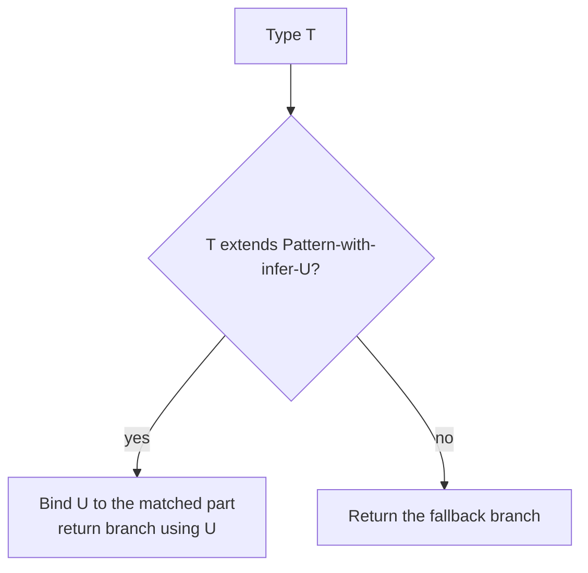

Generics let you write a function or class once and have TypeScript compute the specific types for every call site, instead of choosing between duplicated code or falling back to `any`. This is where TypeScript interviews shift from "do you know the syntax" to "can you design a type-safe API" — the utility types are the vocabulary, generics are the grammar.

## Generic functions, classes and constraints

A generic parameter (`<T>`) is a placeholder filled in per call site, inferred from the arguments unless you specify it explicitly.

```typescript
function first<T>(items: T[]): T | undefined {
  return items[0]; // T is inferred from whatever array is passed
}

first([1, 2, 3]);       // T = number
first(["a", "b"]);      // T = string
```

`extends` constrains what `T` is allowed to be, so you can safely use members that only exist on a subset of all types:

```typescript
function getLength<T extends { length: number }>(item: T): number {
  return item.length; // safe — every T is guaranteed to have .length
}

class Box<T> {
  constructor(private value: T) {}
  get(): T { return this.value; }
  map<U>(fn: (value: T) => U): Box<U> { return new Box(fn(this.value)); }
}
```

> [!KEY]
> A constraint (`T extends Shape`) narrows what a generic *can* be, without pinning it to one concrete type — you get both safety (you can use `Shape`'s members) and flexibility (any subtype still works).

## Default type parameters

```typescript
interface ApiResponse<T = unknown> {
  data: T;
  error?: string;
}

function createStore<State = Record<string, never>>(initial: State) {
  // ...
}
```

A default kicks in only when the caller doesn't supply or can't infer the type argument — useful so a generic type is still usable "as-is" without forcing every consumer to specify it.

## Conditional types and infer

A conditional type (`T extends U ? X : Y`) branches at the type level, based on whether one type is assignable to another. `infer` captures a type from inside that check to reuse on the right-hand side.

```typescript
type ElementType<T> = T extends (infer U)[] ? U : T;
type A = ElementType<string[]>; // string
type B = ElementType<number>;   // number — falls through, T itself

// This is how the built-in ReturnType<T> is actually implemented
type MyReturnType<T> = T extends (...args: unknown[]) => infer R ? R : never;
```

`infer` is how the compiler "reaches into" a generic shape — a function signature, an array, a Promise — and pulls out one of its type parameters without you having to know it up front.



## Mapped types

A mapped type builds a new object type by iterating over the keys of an existing one, optionally transforming each key or value.

```typescript
type Optional<T> = { [K in keyof T]?: T[K] };        // this is basically Partial<T>
type ReadonlyDeep<T> = { readonly [K in keyof T]: T[K] };
type Nullable<T> = { [K in keyof T]: T[K] | null };
```

Combined with **key remapping** (`as`), you can rename keys while mapping:

```typescript
type Getters<T> = { [K in keyof T as `get${Capitalize<string & K>}`]: () => T[K] };
// Getters<{ name: string }>  →  { getName: () => string }
```

## Template literal types

Template literal types build string literal unions at the type level, the same way template strings build runtime strings.

```typescript
type Direction = "top" | "bottom" | "left" | "right";
type Margin = `margin-${Direction}`;
// "margin-top" | "margin-bottom" | "margin-left" | "margin-right"

type EventName<T extends string> = `on${Capitalize<T>}`;
type ClickEvent = EventName<"click">; // "onClick"
```

This is how libraries type things like CSS-in-JS property names or event handler prop names (`onClick`, `onFocus`, ...) generically from a base set of strings, instead of hand-writing every combination.

## Built-in utility types

| Utility | What it does | One-line example |
|---|---|---|
| `Partial<T>` | All properties optional | `Partial<User>` → every field is `?` |
| `Required<T>` | All properties required, strips `?` | `Required<{ a?: string }>` → `{ a: string }` |
| `Readonly<T>` | All properties `readonly` | `Readonly<User>` → can't reassign any field |
| `Pick<T, K>` | Subset of keys `K` | `Pick<User, "id" \| "name">` |
| `Omit<T, K>` | All keys except `K` | `Omit<User, "password">` |
| `Record<K, V>` | Object type with keys `K`, values `V` | `Record<string, number>` |
| `Exclude<T, U>` | Remove members of a union assignable to `U` | `Exclude<"a" \| "b" \| "c", "b">` → `"a" \| "c"` |
| `Extract<T, U>` | Keep only members assignable to `U` | `Extract<string \| number \| boolean, string \| number>` → `string \| number` |
| `NonNullable<T>` | Removes `null`/`undefined` from a union | `NonNullable<string \| null>` → `string` |
| `ReturnType<T>` | Return type of a function type | `ReturnType<() => number>` → `number` |
| `Parameters<T>` | Tuple of a function's parameter types | `Parameters<(a: string, b: number) => void>` → `[string, number]` |
| `Awaited<T>` | Unwraps nested Promises | `Awaited<Promise<Promise<string>>>` → `string` |

> [!TIP]
> Knowing that `Pick`/`Omit`/`Partial`/`Required` are all implemented as small mapped types over `keyof T` — not compiler magic — is the detail that shows you could write your own if the built-in one didn't exist.

## Writing your own utility type

Most utility types are a one- or two-line mapped or conditional type. Being able to derive one live is a common "show, don't just recall" interview exercise.

```typescript
// A hand-rolled version of Pick<T, K>
type MyPick<T, K extends keyof T> = { [P in K]: T[P] };

// A hand-rolled version of DeepPartial (not built in) — recurses into nested objects
type DeepPartial<T> = T extends object
  ? { [K in keyof T]?: DeepPartial<T[K]> }
  : T;
```

`K extends keyof T` is the constraint that stops a caller from picking a key that doesn't exist on `T` — without it, `MyPick<User, "nonexistent">` would compile with no error.

## Variance in practice

Variance describes whether a generic type preserves (**covariant**), reverses (**contravariant**), or ignores (**invariant**) subtyping when substituted into a larger type. TypeScript is structurally typed, so this shows up more subtly than in nominally-typed languages, but it still matters for function parameters.

```typescript
class Animal {}
class Dog extends Animal {}

type Handler<T> = (value: T) => void;

let handleAnimal: Handler<Animal> = (a) => {};
let handleDog: Handler<Dog> = handleAnimal; // OK — a function that handles any Animal can handle a Dog
// let handleAnimal2: Handler<Animal> = (d: Dog) => {}; // unsound in theory, but allowed without strictFunctionTypes
```

Return types are **covariant** (a function returning `Dog` can stand in for one expected to return `Animal`); parameter types are, in principle, **contravariant** (a handler that accepts anything more general can substitute for one that accepts something more specific) — but TypeScript only strictly enforces this for standalone function types under `strictFunctionTypes`, not for method shorthand syntax, as a pragmatic trade-off for compatibility with common JS patterns.

## When generics become unreadable, and what to do instead

| Symptom | What's happening | Alternative |
|---|---|---|
| Three or more type parameters, several inferred from each other | The signature is trying to encode too much logic in types | Split into smaller functions, or accept a single options object type |
| Deeply nested conditional types with multiple `infer`s | You're pattern-matching complex shapes at the type level | Add named intermediate types with clear names, one step at a time |
| Callers need to explicitly specify type arguments to get inference to work | Inference is fighting the design | Reorder parameters so the type-bearing argument comes first, or restructure |
| A type error message is longer than the code that caused it | The abstraction is too clever for its value | Prefer a concrete, less generic type and accept some duplication |

> [!WARNING]
> Generics are a tool for **removing duplication without losing type safety** — once a generic type needs its own comment explaining what it does, that is a signal to simplify, not to add more type parameters.

> [!DANGER]
> Over-engineering generics is a real interview red flag in system/API design rounds: reaching for `<T, K extends keyof T, V = T[K]>` when a concrete type or two overloaded signatures would be clearer reads as complexity for its own sake, not senior judgment.

## Cheat sheet

- Generics are placeholders filled in per call site, usually inferred from arguments — you rarely need to specify them explicitly.
- `T extends Shape` constrains what a generic can be while keeping it flexible across subtypes.
- Conditional types (`T extends U ? X : Y`) plus `infer` let you extract a type from inside another type's shape.
- Mapped types (`{ [K in keyof T]: ... }`) are how `Partial`, `Pick`, `Readonly` and friends are actually implemented.
- Template literal types build string-literal unions at compile time, the same shape as template strings at runtime.
- `Awaited<T>` unwraps nested Promises; `ReturnType`/`Parameters` extract a function's signature pieces.
- Function return types are covariant; parameter types are contravariant in principle, loosely enforced without `strictFunctionTypes`.
- If a generic needs a comment to explain what it does, simplify it rather than add another type parameter.

## Common mistakes

| Mistake | Fix |
|---|---|
| Adding a type parameter with no constraint when only certain types make sense | Add `extends` so misuse is a compile error, not a runtime bug |
| Forcing callers to explicitly specify type arguments | Reorder parameters or restructure so inference can do the work |
| Reaching for a 3+ type-parameter generic for a simple case | Prefer a concrete type, an options object, or overloads |
| Forgetting `K extends keyof T` on a hand-rolled `Pick`-like type | Without it, invalid keys silently compile |
| Assuming TypeScript enforces parameter contravariance everywhere | It's only strict for standalone function types under `strictFunctionTypes`, not method shorthand |
| Nesting conditional types with multiple `infer`s inline | Break into named intermediate types for readability |

## Summary

Generics let a single function or class definition serve every concrete type safely, with TypeScript inferring the specific type per call rather than you writing duplicate overloads or falling back to `any`. Conditional types with `infer` and mapped types are the two mechanisms behind essentially every built-in utility type — `Partial`, `Pick`, `ReturnType`, and the rest are not compiler magic, they are small, readable type-level functions you could write yourself. The skill that separates "knows generics" from "uses them well" is restraint: constrain with `extends` where it adds safety, and the moment a generic needs its own explanatory comment or forces callers to specify type arguments manually, that is the signal to simplify rather than add another type parameter.

## Top Interview Questions

### Q1. What problem do generics solve that overloads or `any` don't?

Overloads require you to enumerate every concrete signature by hand, which doesn't scale and still duplicates logic across each overload's implementation; `any` compiles for every input but throws away type safety entirely, so a caller passing the wrong type gets no compile-time warning and the return type is also `any`, losing information downstream. A generic function is written once with a placeholder type (`T`), and TypeScript both enforces that the same `T` is used consistently throughout the function and infers the concrete type at each call site, giving you full type safety and full flexibility simultaneously — for example, `function first<T>(items: T[]): T | undefined` correctly returns `string | undefined` for a `string[]` and `number | undefined` for a `number[]`, with zero duplicated code.

### Q2. What does `T extends U` mean in a generic constraint, versus in a conditional type?

In a generic parameter declaration (`function f<T extends Shape>(x: T)`), `extends` is a **constraint** — it restricts what concrete types can be substituted for `T` to only those assignable to `Shape`, which lets the function body safely use `Shape`'s members on any value of type `T`. In a conditional type (`T extends U ? X : Y`), `extends` is a **type-level condition** — it checks whether `T` is assignable to `U` and branches to type `X` or type `Y` accordingly, similar to a ternary operator but evaluated on types rather than values. Both uses share the same keyword but serve genuinely different purposes, and conflating them is a common early-learner mistake.

### Q3. Explain how `infer` works with an example, and name a built-in utility type implemented with it.

`infer` can only appear inside the "true" branch check of a conditional type, and it introduces a new type variable that TypeScript binds to whatever part of the input type matched that position in the pattern. For example, `type Unwrap<T> = T extends Promise<infer U> ? U : T` checks if `T` is a `Promise` of something, and if so, binds `U` to that "something" and returns it; otherwise it falls through to `T` itself. The built-in `ReturnType<T>` is implemented exactly this way: `type ReturnType<T extends (...args: any[]) => any> = T extends (...args: any[]) => infer R ? R : any` — matching the function signature shape and inferring `R` as its return type.

### Q4. Walk through what `Pick<User, "id" | "name">` and `Omit<User, "password">` actually compute.

`Pick<T, K>` is defined as `{ [P in K]: T[P] }` where `K extends keyof T` — it iterates over the specific keys named in `K` (here `"id" | "name"`) and copies each one's type from `T`, discarding every other key, so the result is a new object type containing only `id` and `name`. `Omit<T, K>` is built from `Pick` and `Exclude`: `Pick<T, Exclude<keyof T, K>>` — it first computes every key of `T` *except* those in `K` (using `Exclude` on the union of keys), then `Pick`s exactly those, effectively producing "everything but the omitted keys". Both are small, readable compositions of `keyof`, mapped types, and (for `Omit`) `Exclude` — not special compiler intrinsics.

### Q5. What is the difference between `Exclude<T, U>` and `Extract<T, U>`?

Both operate on a union type `T` and filter it based on assignability to `U`, but in opposite directions. `Exclude<T, U>` keeps only the members of `T` that are **not** assignable to `U` — `Exclude<"a" | "b" | "c", "b">` yields `"a" | "c"`. `Extract<T, U>` keeps only the members of `T` that **are** assignable to `U` — `Extract<string | number | boolean, string | number>` yields `string | number`, dropping `boolean`. A useful mnemonic: `Exclude` removes matches, `Extract` keeps only matches — they are complementary halves of a single filtering operation over a union.

### Q6. What does `Awaited<T>` do, and why was it needed as a built-in rather than just using `ReturnType`?

`Awaited<T>` recursively unwraps a (possibly nested) `Promise` type down to its ultimately resolved value — `Awaited<Promise<Promise<string>>>` resolves to `string`, matching how `await` on a promise-of-a-promise flattens completely at runtime, not just one level. It was added as a dedicated utility because writing this manually requires a recursive conditional type (`T extends Promise<infer U> ? Awaited<U> : T`), and because `async` function return types and `Promise.all`/`allSettled` results all need this exact unwrapping logic consistently applied across the standard library's own type definitions — having one canonical utility avoids every codebase reinventing a slightly different, possibly buggy version.

### Q7. Design a generic `groupBy<T, K>` function's type signature. What constraint do you need on `K`?

```typescript
function groupBy<T, K extends string | number | symbol>(
  items: T[],
  keyFn: (item: T) => K
): Record<K, T[]> {
  const result = {} as Record<K, T[]>;
  for (const item of items) {
    const key = keyFn(item);
    (result[key] ??= []).push(item);
  }
  return result;
}
```

`K` needs to be constrained to `string | number | symbol` because those are the only types TypeScript allows as object/`Record` keys — without the constraint, a caller's `keyFn` could return something like a `boolean` or an object, which cannot legally index a `Record`. `T` is inferred from the `items` array, and `K` is inferred from `keyFn`'s return type, so a typical call site (`groupBy(users, u => u.department)`) needs zero explicit type arguments.

### Q8. What is variance, and where does it actually show up in TypeScript's type checking?

Variance describes how subtyping of a compound type relates to subtyping of its component types. Function **return types are covariant** — if `Dog extends Animal`, a `() => Dog` is assignable to `() => Animal`, because anywhere you expect an `Animal` back, receiving a more specific `Dog` is fine. Function **parameter types are contravariant** in principle — a function accepting `Animal` can safely substitute for one expected to accept only `Dog`, since it can handle at least as much. TypeScript only strictly enforces parameter contravariance for standalone function type declarations under the `strictFunctionTypes` compiler flag; method shorthand syntax on interfaces/classes is deliberately checked more loosely (bivariantly) for pragmatic compatibility with common patterns like array method callbacks, which is a frequent point of confusion in interviews.

### Q9. A teammate wrote a function with four type parameters, two of which are only used to infer the other two. How do you evaluate this in review?

The core question is whether each type parameter is pulling its weight — a type parameter that exists purely so another one can be inferred from it is a sign the function is encoding relationships that might be clearer as a single input object type or split into two simpler functions. I would check three things in review: can any type argument only be supplied explicitly (a sign inference is fighting the design, since ideally most or all should be inferred from arguments); does the resulting error message, when misused, point at something a caller could reasonably fix; and would splitting this into two functions with two type parameters each be equally reusable with a much shorter type signature. If the complexity earns its keep (genuinely prevents unsafe calls that would otherwise need casts), I'd keep it but suggest adding a code comment showing an example call; if not, I'd push for simplification.

### Q10. How would you write your own `DeepReadonly<T>` utility type, and why isn't one built in?

```typescript
type DeepReadonly<T> = T extends (infer U)[]
  ? ReadonlyArray<DeepReadonly<U>>
  : T extends object
  ? { readonly [K in keyof T]: DeepReadonly<T[K]> }
  : T;
```

This recurses: arrays become `ReadonlyArray` of a deeply-readonly element type, plain objects get every property marked `readonly` and recursively processed, and primitives pass through unchanged as the base case. TypeScript's built-in `Readonly<T>` is intentionally **shallow** — only top-level properties are marked `readonly`, nested objects remain fully mutable — because a correct, general deep version needs to handle arrays, tuples, functions, and recursive/circular types correctly, which is genuinely tricky to get right for every shape, so the standard library leaves it to userland libraries (or hand-rolled versions like this) rather than shipping one canonical, opinionated implementation.

### Q11. When would you deliberately avoid generics in favor of a simpler, more concrete type, even if it means some duplication?

When the abstraction's complexity cost — a longer, harder-to-read signature, worse error messages when misused, or callers needing to fight inference by specifying type arguments explicitly — exceeds the actual duplication it saves, which is common when a "generic" version only ever has one or two real call sites in the codebase. A concrete example: writing a generic `<T extends Record<string, unknown>>` parser for two unrelated API response shapes that happen to share superficial structure is often worse than two small, clearly-named, concrete functions, because the generic version's error messages when a shape doesn't match are far less actionable than a concrete type mismatch. The senior judgment call is recognizing that generics are a tool for genuine, recurring structural reuse — not a default to reach for whenever two things look similar.
