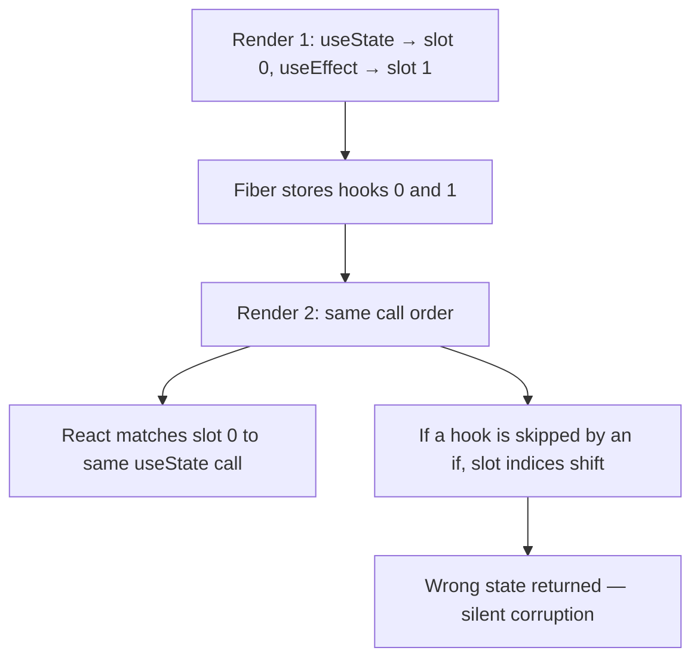

Hooks let function components hold state and side effects without classes, but they work through a fragile mechanism — call order — that trips up almost every candidate at some point. Knowing *why* the rules exist, not just what they are, is what separates "used hooks" from "understands hooks".

## Why the rules of hooks exist

React does not know hook names — it stores state in a **linked list per component instance**, indexed purely by **call order**. On every render, React walks that list and hands out the next slot to the next hook call. If a hook is called conditionally, the slot index shifts and React hands `useState` the wrong stored value.



> [!KEY]
> Hooks are **not magic** — they are entries in an ordered array keyed by call position. Never call a hook inside a condition, loop, or after an early return. Call them in the same order on every render.

The two rules of hooks, and *why* each exists:

| Rule | Reason |
|---|---|
| Only call hooks at the top level | Preserves call order across renders so React's slot indexing stays valid |
| Only call hooks from React functions (components or custom hooks) | Ties hook state to a fiber; plain functions have no fiber to attach state to |

## useState: functional updates and batching

`useState` returns a snapshot value that is fixed for the lifetime of that render — it is **not** live like an instance variable. Reading `state` inside a closure after calling `setState` still gives the old value until the next render.

```typescript
const [count, setCount] = useState(0);

// Bug: both calls close over the same stale `count`
function handleClickTwice() {
  setCount(count + 1); // schedules count -> 1
  setCount(count + 1); // schedules count -> 1 again, not 2
}

// Fix: functional update reads the latest pending state
function handleClickTwiceFixed() {
  setCount(c => c + 1);
  setCount(c => c + 1); // -> 2
}
```

React **batches** state updates that happen inside event handlers and (since React 18) inside promises, timeouts, and native event listeners too — all `setState` calls in one tick are merged into a single re-render. This is why `console.log(count)` right after `setCount` still shows the old value.

> [!TIP]
> Say it like this in an interview: *"State updates are asynchronous and batched, so I always use the functional updater form when the next state depends on the previous one."*

## useEffect: dependency arrays, cleanup, and the infinite-loop trap

`useEffect` runs **after** the browser paints, synchronizing a component with something outside React — a subscription, a fetch, a timer, direct DOM work.

```typescript
useEffect(() => {
  const id = setInterval(() => setTick(t => t + 1), 1000);
  return () => clearInterval(id); // cleanup: runs before the next effect and on unmount
}, []); // empty array = run once on mount
```

| Dependency array | When the effect runs |
|---|---|
| Omitted | After **every** render |
| `[]` | Once, after the first render |
| `[a, b]` | After the first render, and again whenever `a` or `b` changes by `Object.is` |

> [!DANGER]
> The classic infinite loop: an effect calls `setState`, and that state is also a dependency of the same effect, with no condition guarding it. Each render triggers the effect, which triggers a state update, which triggers a render — forever. The fix is either to remove the redundant dependency, derive the value instead of storing it, or add a guard that only sets state when the value actually changes.

In React 18 development builds under `<StrictMode>`, React intentionally runs an effect's setup, cleanup, then setup again on mount to expose missing or asymmetric cleanup. Production does not double-run effects for this reason, but effect setup and cleanup should still be written as repeatable synchronization with an external system, not as a one-time lifecycle assumption.

**Why an object or array dependency re-runs every render:** React compares dependencies with `Object.is` (reference equality), not deep equality. A literal `{}` or `[]` created inline in the render body is a *new reference* every render, so the effect fires every time even though the "content" looks the same.

```typescript
// Re-runs every render — new object reference each time
useEffect(() => { doSomething(config); }, [{ id: userId }]);

// Fix: depend on primitives, or memoise the object
useEffect(() => { doSomething({ id: userId }); }, [userId]);
```

**Effects that should not be effects:** if you can compute a value from props/state during render, do that instead of syncing it in an effect — it removes a render, a possible flash of stale UI, and a source of bugs.

```typescript
// Unnecessary effect
const [fullName, setFullName] = useState("");
useEffect(() => setFullName(`${first} ${last}`), [first, last]);

// Just compute it
const fullName = `${first} ${last}`;
```

## useRef: mutable values and DOM access

`useRef` returns a mutable `{ current }` box that **persists across renders without causing a re-render** when it changes. Two distinct uses:

```typescript
const inputRef = useRef<HTMLInputElement>(null); // DOM access
const renderCount = useRef(0); // instance variable that survives renders
renderCount.current += 1; // mutating this does NOT re-render
```

> [!WARNING]
> Reading or writing `ref.current` during render (not inside an effect or event handler) is an anti-pattern — refs are for values React does not need to track for rendering.

## useMemo and useCallback: when they help and when they are pointless

Both **memoise** a computation or function reference across renders, recomputing only when dependencies change. They exist to preserve **referential equality**, not to make code "faster" in the general case — they add their own comparison cost.

```typescript
const sorted = useMemo(() => expensiveSort(items), [items]);
const handleClick = useCallback(() => onSelect(id), [id, onSelect]);
```

| Use it when | Skip it when |
|---|---|
| The computation is genuinely expensive (sorting, filtering large lists) | The computation is a cheap arithmetic op or string concat |
| The value/function is passed to a memoised child (`React.memo`) or another hook's dependency array | The component has no memoised children and nothing downstream cares about identity |
| Referential stability prevents an effect from re-running | You're memoising to "be safe" with no measured problem |

> [!TIP]
> `useMemo`/`useCallback` on a component with no memoised children is pure overhead — it still runs the comparison every render and holds extra memory. Profile before reaching for them.

## useReducer for complex state

When state updates are numerous, interdependent, or the next state depends on the action rather than a single value, `useReducer` centralises the logic and makes transitions testable in isolation.

```typescript
type State = { status: "idle" | "loading" | "error"; data?: unknown };
type Action = { type: "fetch" } | { type: "success"; payload: unknown } | { type: "error" };

function reducer(state: State, action: Action): State {
  switch (action.type) {
    case "fetch": return { status: "loading" };
    case "success": return { status: "idle", data: action.payload };
    case "error": return { status: "error" };
  }
}

const [state, dispatch] = useReducer(reducer, { status: "idle" });
```

## useContext, useLayoutEffect, and custom hooks

`useContext` reads the nearest `Provider` value above in the tree, avoiding prop drilling — but **every** consumer re-renders whenever the provided value changes, regardless of which field it reads.

`useLayoutEffect` runs **synchronously after DOM mutations but before the browser paints** — use it only when you must measure or mutate the DOM before the user sees a flash (e.g., positioning a tooltip). Everything else should use `useEffect`, which is non-blocking.

**Custom hooks** are just functions that call other hooks, letting you extract and share stateful logic:

```typescript
function useOnlineStatus() {
  const [online, setOnline] = useState(navigator.onLine);
  useEffect(() => {
    const set = () => setOnline(navigator.onLine);
    window.addEventListener("online", set);
    window.addEventListener("offline", set);
    return () => {
      window.removeEventListener("online", set);
      window.removeEventListener("offline", set);
    };
  }, []);
  return online;
}
```

## Common hooks at a glance

| Hook | Purpose | Common pitfall |
|---|---|---|
| `useState` | Local reactive state, triggers re-render | Stale closures; use functional updates |
| `useEffect` | Sync with an external system after paint | Missing/wrong dependencies, effect loops |
| `useLayoutEffect` | Sync DOM measurement before paint | Overused; blocks painting if slow |
| `useRef` | Mutable value or DOM handle, no re-render | Mutating during render instead of in effects/handlers |
| `useMemo` | Cache an expensive computed value | Used for trivial computations, adds overhead |
| `useCallback` | Cache a function reference | Used without a memoised consumer, no benefit |
| `useReducer` | Complex/interdependent state transitions | Overkill for one or two independent booleans |
| `useContext` | Read shared value, avoid prop drilling | Every consumer re-renders on any value change |
| `useId` | Stable unique id for accessibility attributes | Used as a list `key` (it is not guaranteed unique per list) |

## Cheat sheet

- Hooks are ordered slots on the fiber — never call conditionally, in loops, or after an early return.
- `setState` is async and batched; use the functional updater when next state depends on previous state.
- Effects run after paint; `useLayoutEffect` runs before paint and blocks it — use sparingly.
- React 18 StrictMode double-runs effect setup/cleanup on mount in development to reveal missing cleanup.
- Object/array/function literals in a dependency array are new references every render — memoise or depend on primitives.
- If you can derive it during render, don't put it in state + an effect.
- `useMemo`/`useCallback` are for referential stability, not general speed — measure before adding them.
- `useReducer` when transitions are complex or action-driven; `useState` otherwise.
- Context re-renders every consumer on any value change — split contexts to limit blast radius.
- Custom hooks are just functions that compose other hooks — no special API.

## Common mistakes

| Mistake | Fix |
|---|---|
| Calling a hook inside `if` or after a `return` | Move the condition inside the hook body |
| Missing dependency causing stale values in a closure | Add the dependency, or use the functional updater / a ref |
| Treating React 18 StrictMode double effects as production behavior | Keep cleanup symmetrical; the double run is a development check |
| Object literal in a dependency array | Depend on primitive fields, or memoise the object |
| Using `useEffect` to derive state from props | Compute the value directly in render |
| Wrapping every function in `useCallback` "just in case" | Only memoise when passed to a memoised child or another hook's deps |
| Mutating a ref during render | Read/write refs only in effects or event handlers |

## Summary

Hooks are a small, consistent primitive — ordered state slots per component instance — and every rule and gotcha follows directly from that mechanism. Master `useState`'s async batching, `useEffect`'s dependency semantics and cleanup, and know when `useMemo`/`useCallback`/`useReducer` genuinely help versus when they are just overhead. Custom hooks are the payoff: once the primitives are solid, extracting and reusing stateful logic becomes trivial.

## Top Interview Questions

### Q1. Why can't hooks be called conditionally?

React stores each component's hooks as an ordered list attached to its fiber, indexed purely by the order they were called in, not by name. On re-render, React walks the list and matches the nth hook call to the nth stored entry. If a hook call is skipped by a condition, every subsequent hook shifts by one slot and receives the wrong stored state or effect — silently, with no error in some cases. The rule "call hooks unconditionally at the top level" exists purely to keep that ordering stable across renders. If you need conditional behavior, put the condition *inside* the hook (e.g., an early return inside the effect callback), not around the hook call itself.

### Q2. What is a stale closure, and how do you avoid it?

A stale closure happens when a function (an event handler, effect callback, or timeout) captures a variable's value at the time it was created, and that value later becomes outdated because a new render created a fresh variable, but the old closure still references the old one. It's common with `setTimeout`/`setInterval` inside `useEffect` with an empty dependency array — the callback always sees the state from the first render. Fixes: use the functional updater form (`setState(prev => ...)`) to always get the latest value, add the changing value to the dependency array so a fresh closure is created, or store the latest value in a `ref` that the closure reads from.

### Q3. Why does an inline object or array in a dependency array cause an effect to run every render?

`useEffect` compares each dependency to its previous value using `Object.is`, which for objects and arrays is reference equality, not structural equality. `{ id: 1 }` created fresh in the render body is a new object every time, even if its contents are identical to the last render's object, so the comparison always reports "changed" and the effect re-runs. The fix is to depend on the primitive fields that actually matter (`[user.id]` instead of `[user]`), or to memoise the object with `useMemo` so its reference stays stable when its contents don't change.

### Q4. When should you use useReducer instead of useState?

`useReducer` is worth it when: state has multiple sub-values that update together, the next state depends on the *type of action* rather than a simple new value, or the update logic is complex enough to want unit tests independent of any component. It centralises "what can happen to this state" in one pure function, which is easier to reason about and test than several `setState` calls scattered across handlers. For one or two independent flags or a single primitive value, `useState` is simpler and `useReducer` is over-engineering — the decision should follow the shape of the state, not a rule of thumb like "more than N fields".

### Q5. What actually happens if you omit the dependency array from useEffect entirely?

The effect runs after **every** render, including the very first one, with no comparison at all — equivalent to `componentDidMount` + `componentDidUpdate` combined for every prop/state change. This is rarely what you want because it typically means re-subscribing, re-fetching, or re-running side effects far more often than necessary, and if the effect itself sets state, it can easily degrade into an effect on every render without technically infinite-looping (each render triggers the effect, which if it sets unrelated state, triggers another render). It's usually a sign the dependency array was forgotten rather than a deliberate choice; the two intentional forms are `[]` (once) and `[specific, deps]` (on those changes).

### Q6. How would you debug an infinite re-render loop caused by useEffect?

First check whether the effect calls `setState` and whether that state is also a dependency of the same effect with nothing guarding the update — that's the textbook cause. I'd add a `console.log` inside the effect to confirm it's firing repeatedly, then inspect each dependency: is any of them an object/array/function created fresh every render (making `Object.is` always report a change)? I'd also check if the effect's setter is being called unconditionally rather than only when the value actually differs (`if (newValue !== state) setState(newValue)`). Finally, React DevTools' profiler or the "why did you render" style logging can show which prop/state change is retriggering it. The fix is almost always to either narrow the dependency, memoise a reference, or move the computation out of an effect entirely.

### Q7. What's the difference between useEffect and useLayoutEffect, and when would you pick the latter?

`useEffect` runs asynchronously after the browser has painted the screen, so its work doesn't block the user from seeing the new frame. `useLayoutEffect` runs synchronously after DOM mutations but *before* the browser paints, blocking the paint until it finishes. You need `useLayoutEffect` when you must read a layout value (like an element's measured size or position) and synchronously adjust the DOM before the user sees a flash of the wrong layout — e.g., positioning a tooltip based on its own measured width. For everything else — data fetching, subscriptions, logging, analytics — `useEffect` is correct and keeps the UI responsive, since `useLayoutEffect` overuse can visibly slow down rendering.

### Q8. Why does useMemo or useCallback sometimes make performance worse?

Both hooks have their own cost: they store the previous dependencies and value, and every render still runs a comparison across the dependency array. If the wrapped computation is cheap (a string template, a simple arithmetic op) or the callback isn't passed anywhere that benefits from stable identity (no `React.memo` child, not a dependency of another hook), the memoisation overhead and extra memory retained can exceed the cost of just recomputing the value. The senior answer is to profile first — use the value/function's actual cost and consumer to decide, rather than wrapping everything defensively, which also adds noise that makes the code harder to read.

### Q9. How would you fix a scenario where a Context provider causes the entire app to re-render on every keystroke in a search box?

Every consumer of a context re-renders whenever the provided value changes by reference, regardless of which piece of that value it actually uses. If the search box's state lives in the same context as unrelated global state (e.g., theme, auth), typing a character creates a new context value object and re-renders every consumer in the tree. Fixes: split the context so the frequently changing search state has its own provider, isolated from rarely-changing state; memoise the context value object with `useMemo` so it's only a new reference when its actual contents change; or move the fast-changing state fully local to the search component and out of context altogether, only lifting the debounced/committed value up when needed.

### Q10. What's the difference between derived state and stored state, and why does it matter for hooks?

Derived state is a value that can be computed directly from existing props/state during render (e.g., `fullName` from `firstName` and `lastName`); stored state is data that genuinely can't be recomputed and must be held independently (e.g., a value typed into an uncontrolled field, or data fetched from a network). The mistake is storing something derivable in `useState` and syncing it via `useEffect` — this adds an extra render (state starts stale until the effect runs), an extra source of bugs if the effect's dependencies are wrong, and unnecessary complexity. Preferring computation over synchronization is one of the most common "smells" reviewers look for in hook-heavy code, and it's explicitly called out in the intro to hooks documentation as an anti-pattern.

### Q11. How do you correctly implement a debounce with hooks?

Combine a `ref` to hold the timeout id (so it survives renders without causing one), an effect to clean up on unmount or before the next debounce fires, and either a custom hook wrapping the value or a stable callback via `useCallback`/`useRef`:

```typescript
function useDebouncedValue<T>(value: T, delayMs: number): T {
  const [debounced, setDebounced] = useState(value);
  useEffect(() => {
    const id = setTimeout(() => setDebounced(value), delayMs);
    return () => clearTimeout(id); // cancel the pending update if value changes again
  }, [value, delayMs]);
  return debounced;
}
```

The cleanup function is essential: without it, every keystroke schedules a new timeout without cancelling the previous one, firing multiple stale updates instead of only the final settled value.

### Q12. Can you share stateful logic between two components without a custom hook? Why is a custom hook usually better?

Technically yes — via a higher-order component, render props, or lifting the state to a shared parent and passing it down — but custom hooks are almost always preferable because they compose naturally without adding wrapper components to the tree (no "wrapper hell"), they keep the logic's shape (inputs/outputs) explicit as a function signature, and multiple custom hooks can be combined freely inside one component. A custom hook is just a function starting with `use` that calls other hooks; it doesn't create any new React concept, it shares *logic*, not state — each component calling the hook gets its own independent state instance, which is the correct mental model to state explicitly when asked.
