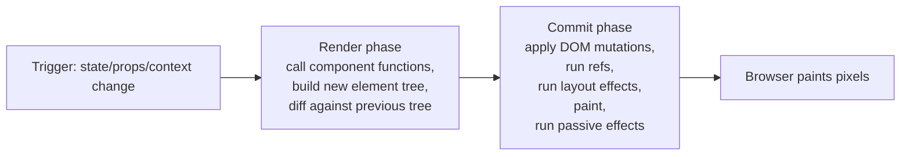

"Re-render" is one of the most misused words in front-end interviews. Candidates conflate it with "the DOM updated" or "the screen changed", and interviewers use that confusion to test whether you actually understand React's render → reconcile → commit pipeline.

## What triggers a render

A component re-renders when React decides its output *might* have changed. There are exactly four triggers:

| Trigger | Example |
|---|---|
| State changes | `setCount(c => c + 1)` |
| Props change (from a parent that itself re-rendered) | Parent passes a new `label` prop |
| Context value changes | A `Provider`'s value prop gets a new reference |
| Parent re-renders | By default, a child re-renders whenever its parent does, **even with unchanged props** |

> [!KEY]
> A re-render is React calling your component function again to get a new tree description. It says nothing about whether the DOM actually changes — that decision happens later, in reconciliation.

## Render phase vs commit phase

React splits work into two phases:



- **Render phase** is pure computation — calling component functions, building the new virtual tree, diffing. It can be paused, thrown away, or restarted by React (this is what makes concurrent features possible) and must have no side effects.
- **Commit phase** is where React actually mutates the real DOM, attaches refs, and runs `useLayoutEffect` synchronously, followed by paint, followed by `useEffect` asynchronously. This phase is **not interruptible**.

> [!WARNING]
> Because the render phase can be thrown away and re-run, it must be pure — no mutating variables outside the function, no direct DOM writes, no side effects. That is the deeper reason side effects belong in `useEffect`, not in the component body.

## The virtual DOM and diffing heuristics

The virtual DOM is a lightweight in-memory tree of plain JavaScript objects describing what the UI *should* look like. Diffing it against the previous tree is cheaper than touching the real DOM for every change, but the real win is that it lets React batch and minimise real DOM writes, which are the actually expensive operation (layout, style recalculation, paint).

React's diffing algorithm is `O(n)` instead of the theoretical `O(n³)` tree-diff, because it applies two heuristics:

1. **Different element types produce different trees.** If a `<div>` becomes a `<span>` at the same position, React tears down the entire old subtree (including its state) and builds a new one from scratch — it does not try to patch attributes across the type change.
2. **Same type is reused and patched in place.** If a `<div className="a">` becomes `<div className="b">`, React keeps the same DOM node and just updates the `className` attribute.

**Keys for lists** are how React tells siblings apart when a list is reordered, filtered, or has items inserted/removed. Without a stable key, React defaults to matching by index, which silently reuses the wrong DOM node's state when items shift.

```typescript
// Bad: index as key breaks when items are reordered/removed — item state gets reattached to the wrong row
items.map((item, i) => <Row key={i} data={item} />);

// Good: a stable identity that survives reordering
items.map((item) => <Row key={item.id} data={item} />);
```

| Scenario | With correct keys | With index-as-key |
|---|---|---|
| Reorder a list | React moves the existing DOM nodes | React patches every node's props in place — state (e.g., an open input) lands on the wrong row |
| Insert at the front | One new node created | Every existing node's props are re-diffed as if changed |
| Delete from the middle | One node removed | Every node after it shifts index and gets re-diffed |

## Re-rendering is not repainting

Calling the component function again (a render) does **not** necessarily touch the DOM at all. If reconciliation determines the output is identical to before, React skips the DOM mutation entirely — no layout, no paint. "Render" is JS-only work; "commit"/"paint" is the browser-visible work. This distinction is why `console.log` inside a component body firing a lot is not automatically a performance problem — it only matters if it's doing expensive work or the commit actually changes the DOM.

> [!TIP]
> A senior answer: *"Re-rendering means React calls the component function again and diffs the result — it's cheap unless the render itself is expensive. The DOM only actually changes during commit, and only for the nodes that differ."*

## React Fiber: interruptible rendering

Before React 16, reconciliation was a single sluice of synchronous recursive calls down the tree — once started, it couldn't be paused, so a big tree could block the main thread and freeze user input (typing, scrolling) for the duration.

**Fiber** is a rewrite of the reconciler as a linked-list-like data structure of units of work, where each fiber node corresponds to a component instance and can be processed one at a time. This lets React:

- **Pause** work, hand control back to the browser to handle a higher-priority event (a keystroke), and resume later.
- **Assign priority** to different updates — a text input keystroke is more urgent than a background data refresh.
- **Abandon** an in-progress render entirely if a newer update supersedes it.

This is purely a render-phase capability — it exists precisely because render must be pure and side-effect free; interruptible work that mutated the DOM as it went would be impossible to safely abandon or restart.

## Batching in React 18

React 18 introduced **automatic batching**: multiple `setState` calls are merged into a single re-render regardless of where they happen — inside promises, `setTimeout`, native event handlers, or anywhere else — not just inside React's own synthetic event handlers as before React 18.

```typescript
// React 18: both setState calls batch into ONE re-render, even inside a timeout
setTimeout(() => {
  setCount(c => c + 1);
  setFlag(f => !f);
}, 1000);
```

If you truly need a synchronous, unbatched update (rare — usually reading DOM state immediately after a change), `flushSync` opts out explicitly.

## StrictMode double-invocation

In development only, `<StrictMode>` intentionally calls component bodies, state updater functions, and certain lifecycle/effect functions **twice**, then discards one set of results. This is not a bug — it is designed to surface impure render logic and effects that aren't properly cleaned up, by making the symptom of impurity visible immediately instead of shipping it to production, where it might only manifest as a subtle bug under future concurrent rendering.

> [!DANGER]
> If double-invocation reveals a bug (a counter that increments twice, a subscription that fires twice), the bug was always there — StrictMode did not introduce it. The fix is to make the render function pure and the effect's cleanup correctly symmetrical, not to remove StrictMode.

## React 18 concurrent features: useTransition and useDeferredValue

In React 18, both let you tell React "this update is lower priority than user input", solving the problem of an expensive re-render (e.g., filtering 10,000 rows) freezing the UI while the user types.

```typescript
const [isPending, startTransition] = useTransition();
function handleChange(value: string) {
  setQuery(value); // urgent — keep the input responsive
  startTransition(() => {
    setFilteredResults(expensiveFilter(value)); // low priority — can be interrupted
  });
}
```

`useDeferredValue` achieves a similar effect without a separate state setter — it returns a lagging copy of a value that updates only once the browser has spare capacity:

```typescript
const deferredQuery = useDeferredValue(query); // renders with the old query while a new render is prepared
```

| Tool | Use when |
|---|---|
| `useTransition` | You control the state update that's expensive and can wrap it explicitly |
| `useDeferredValue` | The expensive part is downstream (e.g., a value passed to a slow child) and you can't wrap the setter itself |

## Cheat sheet

- Four render triggers: state, props, context, or "parent re-rendered".
- Render phase = pure computation (interruptible); commit phase = DOM mutation + layout effects + paint (not interruptible).
- Re-render ≠ repaint — React skips DOM writes when the diffed output is unchanged.
- Diffing is `O(n)` via two heuristics: different type → unmount/remount subtree; same type → patch in place.
- Always use a stable, unique `key` for list items — never array index if the list can reorder or be filtered.
- Fiber makes rendering interruptible/prioritisable — this only works because render must stay pure.
- React 18 batches `setState` everywhere (timeouts, promises, native handlers), not just synthetic events.
- StrictMode double-invokes in dev to surface impure renders/effects — the bug it reveals was already there.
- `useTransition`/`useDeferredValue` mark updates as low priority so typing/scrolling stays responsive.

## Common mistakes

| Mistake | Fix |
|---|---|
| Assuming a re-render always touches the DOM | Reconciliation skips unchanged output — no DOM write, no paint |
| Using array index as `key` in a reorderable list | Use a stable id from the data |
| Treating StrictMode's double calls as a bug to silence | Fix the underlying impurity; don't disable StrictMode |
| Doing expensive work in the component body without memoisation and expecting Fiber to "handle it" | Fiber prioritises scheduling, it does not make expensive computations free |
| Wrapping the urgent input state itself in `startTransition` | Only wrap the expensive derived update; keep the input's own state update urgent |
| Believing pre-React-18 batching covered async callbacks | Only synthetic event handlers batched before 18; timeouts/promises did not |

## Summary

Rendering in React is a two-phase pipeline: a pure, interruptible render phase that computes what the UI *should* look like, and a commit phase that actually mutates the DOM and paints. Reconciliation's type-and-key heuristics keep diffing linear instead of cubic, Fiber makes that render phase schedulable and prioritisable, and React 18's batching and concurrent APIs (`useTransition`, `useDeferredValue`) exist specifically to keep high-priority user input responsive while expensive derived work happens in the background.

## Top Interview Questions

### Q1. What actually causes a React component to re-render?

Exactly four things: its own state changes, its props change (because its parent re-rendered and passed new values), a context value it subscribes to changes, or its parent re-renders at all — by default a child component re-renders whenever its parent does, regardless of whether the props it received actually changed. That last one surprises people: passing the exact same prop values doesn't prevent a re-render unless the child is wrapped in `React.memo`, which adds a shallow prop comparison before deciding whether to re-render. It's worth stating explicitly that "re-render" means React calls the component function again — it does not by itself imply any DOM mutation.

### Q2. What is the difference between the render phase and the commit phase?

The render phase is where React calls component functions to build a new element tree and diffs it against the previous tree — this work is pure, side-effect free, and can be paused, aborted, or restarted by React's scheduler, which is exactly what makes concurrent rendering possible. The commit phase is where React actually applies the computed DOM mutations, attaches refs, runs `useLayoutEffect` synchronously before the browser paints, and then — after paint — runs `useEffect`. Commit is not interruptible; once it starts, it runs to completion. The practical implication: side effects and DOM reads/writes must live in effects (commit-adjacent), never directly in the component body (render), because render can be thrown away or run multiple times.

### Q3. How does React's diffing algorithm achieve O(n) instead of the theoretical O(n³) for tree diffing?

General tree-diffing algorithms are `O(n³)` because they consider arbitrary node moves anywhere in the tree. React makes it linear with two heuristics: first, elements of different types produce fundamentally different trees, so React doesn't try to diff their children — it unmounts the old subtree and mounts a new one; second, elements of the same type are assumed to represent the same conceptual thing and are patched in place rather than replaced, comparing children only within the same list. For lists, React additionally relies on a `key` prop to match children across renders instead of comparing every possible pairing, which is what makes list diffing linear rather than requiring an expensive optimal-matching computation.

### Q4. Why is using array index as a key considered an anti-pattern?

React uses `key` to decide whether a child element is "the same" logical item across renders, so it can reuse the underlying DOM node and component state instead of unmounting and remounting. If the key is the array index and the list is reordered, filtered, or has an item inserted/removed from the middle, the same index now points to a *different* logical item, but React thinks nothing changed at that position and reuses the stale DOM node and its component state — for example, an input's typed text or a component's internal `useState` can end up attached to the wrong row after a reorder. The fix is a key derived from stable data identity, like a database id, that follows the item wherever it moves in the list. Index keys are acceptable only for lists that are static and never reordered or filtered.

### Q5. Explain what React Fiber is and why it was introduced.

Fiber is the reconciliation engine React rewrote in version 16, restructuring the render process from recursive synchronous function calls into a linked-list-like structure of units of work — one fiber node per component instance — that can be processed incrementally. Before Fiber, once reconciliation started on a large tree it ran to completion synchronously, which could block the main thread long enough to make typing or scrolling feel janky. Fiber lets React pause a render, yield back to the browser to handle a higher-priority task like user input, and resume or even discard the paused work if a newer update makes it stale. This incremental, interruptible model is the foundation React 18 concurrent features (`useTransition`, `useDeferredValue`, Suspense for data) are built on.

### Q6. What changed about batching in React 18 compared to React 17?

Before React 18, batching multiple `setState` calls into a single re-render only happened inside React's own synthetic event handlers — click handlers, change handlers, and similar. Any `setState` calls inside a `setTimeout`, a native DOM event listener attached outside React, or a resolved promise would each trigger a separate, immediate re-render. React 18 introduced *automatic batching*, which extends this to all of those contexts, so multiple state updates anywhere in one tick of the event loop are collapsed into a single re-render. This is generally a performance win with no code changes required, but it can surprise code that relied on reading DOM state synchronously right after a `setState` call in one of those previously-unbatched contexts — for the rare case that truly needs synchronous behaviour, React exposes `flushSync`.

### Q7. A component re-renders on every keystroke of an unrelated sibling input. Walk through how you'd diagnose and fix it.

I'd first confirm the re-render is actually happening with the React DevTools profiler (highlighting re-renders) rather than guessing. The likely cause is that both inputs' state lives in a shared parent, so every keystroke updates the parent's state and re-renders all its children by default, including the sibling that shows no visible change. I'd check whether the sibling is doing expensive work in its render body (if not, an unnecessary re-render might be harmless and not worth fixing) and whether its props are actually unchanged; if so, wrapping it in `React.memo` prevents it from re-rendering when its props are referentially/shallowly equal. If the sibling still re-renders because it's *also* reading the same context or receiving a new inline object/function prop each time, I'd stabilise those references with `useMemo`/`useCallback` or restructure state so each input's typing state is genuinely local and doesn't force a shared parent re-render at all.

### Q8. What problem do useTransition and useDeferredValue solve, and how do they differ?

Both address the same problem: an expensive UI update (like filtering or rendering a large list) competing with urgent user input (typing, clicking) for the main thread, causing input lag if done synchronously in one render. `useTransition` gives you a `startTransition` function to explicitly wrap the state update that's allowed to be deprioritised, plus an `isPending` flag to show a loading indicator while that low-priority work is in flight — you use it when you own the setter for the expensive state. `useDeferredValue` instead takes an already-computed value and returns a version that lags behind, letting React render with the stale value first and swap in the new one when it has spare capacity — you use it when the expensive part happens downstream (e.g., inside a child component or a slow computation derived from a prop) and you can't wrap the original setter directly. Both rely on Fiber's interruptible rendering to actually deprioritise work rather than just visually suggesting it.

### Q9. Does calling a component function again always mean the DOM gets updated?

No, and this is one of the most common misconceptions. Calling the component function (a "render") produces a new element tree, which React then diffs against the previous committed tree during reconciliation. If the diff determines the resulting DOM structure and attributes are identical to what's already there, React skips the commit phase for that subtree entirely — no DOM mutation, no layout recalculation, no paint. So a component can "re-render" — meaning its function body executes — many times without a single pixel changing on screen. This is exactly why unnecessary re-renders aren't automatically a performance problem: they only cost something if the render function itself does expensive work, or if reconciliation actually finds a difference to commit.

### Q10. Why does React need render-phase purity, and what happens if you break it (e.g., mutate a module-level variable during render)?

Purity is required because the render phase can be paused, thrown away, or run more than once for the same commit — under Fiber's concurrent scheduling, and deliberately in development under StrictMode. If a component mutates external state (a module-level variable, a ref read during render, or an API call with side effects) directly in its function body, that mutation can happen multiple times, at unpredictable moments, or be "undone" if React discards an in-progress render and restarts it — leading to double-counted values, out-of-order side effects, or effects that ran even though their triggering render was abandoned. The fix is always to move any side effect into `useEffect` (or an event handler), whose setup runs only after a render has actually been committed and whose cleanup/setup sequence is governed by the dependency array, with React 18 StrictMode intentionally double-checking mount effects in development.

### Q11. Why does StrictMode call some functions twice in development, and should you turn it off if that breaks your app?

StrictMode intentionally double-invokes component render functions, state updater functions, and (since React 18) the mount/effect/cleanup/effect sequence for effects, purely in development builds, specifically to make impure code visibly broken *now* rather than shipping a subtle bug that only manifests later under real concurrent rendering, when React might genuinely render a component twice for a single commit or remount an effect due to a future feature. If double-invocation surfaces a problem — a value that increments by two instead of one, a subscription that leaks because cleanup didn't properly unsubscribe — that bug already existed; StrictMode did not create it, it exposed it. The correct response is to fix the underlying impurity (move side effects out of render, make effect cleanup symmetrical with its setup), not to remove StrictMode, since removing it just hides the bug until it appears in production under different, harder-to-reproduce conditions.
