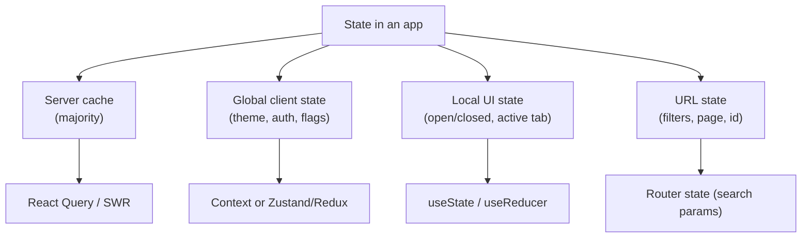

"Where should this state live" is one of the highest-signal front-end architecture questions, because the wrong answer causes cascading complexity — over-centralised state, stale caches, or unnecessary re-renders. Most of the answer comes from correctly classifying *what kind* of state you're dealing with before picking a tool.

## A taxonomy of state

| Kind | Example | Lifetime |
|---|---|---|
| **Server cache** | A list of orders fetched from an API | Owned by the server; the client holds a stale copy that needs invalidation |
| **Global client state** | Current theme, logged-in user, feature flags | Client-only, shared across many unrelated components |
| **Local UI state** | Is this dropdown open, which tab is active | Owned by one component/subtree, disposable |
| **URL state** | Current page number, filters, selected item id | Should be shareable/bookmarkable/back-button-able |
| **Form state** | Values, validation errors, dirty/touched flags | Transient, usually local, sometimes needs persistence on navigation |

> [!KEY]
> **Most state in a typical app is server cache, not global client state** — and the two need fundamentally different tools. Server cache needs fetching, caching, invalidation and background refresh; a Redux store gives you none of that for free.



## Comparing the tools

| Tool | Best for | Weakness |
|---|---|---|
| `useState` / `useReducer` | Local component state, simple to moderately complex | Doesn't scale across distant components without lifting/prop-drilling |
| Context | Low-frequency global values (theme, auth, locale) | Re-renders every consumer on any value change; no built-in caching or selectors |
| Redux (with Redux Toolkit) | Large apps with complex, cross-cutting client state and a need for strict traceability (time-travel debugging, middleware) | Boilerplate-heavy historically (much reduced by Toolkit); overkill for simple apps |
| Zustand / Jotai | Global client state with less ceremony than Redux, selector-based re-renders | Less tooling/ecosystem maturity than Redux; team familiarity varies |
| React Query / SWR | Server cache — fetching, caching, revalidation, retries | Not meant for pure client state (UI flags, form values) |

> [!TIP]
> A strong interview answer names the *axis*, not just the tool: "is this state server-owned or client-owned, and how many unrelated components need it?" — then picks a tool from that, rather than defaulting to Redux because it's familiar.

## When Redux is genuinely warranted

Redux earns its complexity when an app has: **many distant components** reading and writing the same client state, a need for **predictable, traceable transitions** (time-travel debugging, action logging, replaying user sessions for bug reports), complex **cross-cutting logic** best expressed as middleware (undo/redo, optimistic update rollback, analytics on every action), or a large team that benefits from one enforced, consistent pattern for state changes.

> [!WARNING]
> Reaching for Redux to hold data that's actually server cache is the most common Redux misuse — you end up hand-rolling loading/error/stale flags and manual refetch logic that React Query/SWR give you for free, correctly, with far less code.

## Normalising state shape

Nested or duplicated data (an array of posts each embedding its full author object) causes update bugs — changing a user's name in one place doesn't update it everywhere that user is embedded. **Normalising** stores entities by id in flat lookup tables, referencing by id elsewhere.

```typescript
// Denormalised — author duplicated, hard to update consistently
type State = { posts: { id: string; author: { id: string; name: string } }[] };

// Normalised — single source of truth per entity
type State = {
  posts: { id: string; authorId: string }[];
  usersById: Record<string, { id: string; name: string }>;
};
```

## Optimistic updates and rollback

An optimistic update applies the expected result to local state **immediately**, before the server confirms it, so the UI feels instant — then rolls back if the request fails.

```typescript
async function toggleLike(postId: string) {
  const previous = queryClient.getQueryData(["post", postId]);
  queryClient.setQueryData(["post", postId], (old) => ({ ...old, liked: true })); // optimistic
  try {
    await api.likePost(postId);
  } catch {
    queryClient.setQueryData(["post", postId], previous); // rollback on failure
  }
}
```

> [!DANGER]
> Optimistic updates without a rollback path are a classic trap — a failed request silently leaves the UI showing a state that never actually happened on the server. Always keep the previous value to restore, and surface an error to the user when the rollback fires.

## Cache invalidation, derived vs stored state

Server-cache libraries (React Query, SWR) key cached data by a **query key** (e.g., `["post", id]`) and let you explicitly invalidate or refetch that key after a mutation — this is dramatically simpler than manually tracking staleness in a hand-rolled store.

```typescript
const mutation = useMutation({
  mutationFn: updatePost,
  onSuccess: () => queryClient.invalidateQueries({ queryKey: ["post", postId] }),
});
```

**Derived state** should never be stored redundantly — if a value can be computed from existing state (a filtered list, a total from line items), compute it at read time (optionally memoised), don't duplicate it in another `useState`/store field that can drift out of sync.

| Derived (compute, don't store) | Genuinely independent state |
|---|---|
| Cart total from line items | The line items themselves |
| Filtered/sorted list from raw data + filter | The filter criteria and the raw data |
| "Is form valid" from field errors | The field values and validation rules |

## Syncing state to the URL, and persisting state

Anything the user should be able to **bookmark, share, or navigate back to** — filters, pagination, a selected tab, a search query — belongs in the URL (search params or route segments), not only in component state, so a page reload or shared link reproduces the same view.

```typescript
const [searchParams, setSearchParams] = useSearchParams();
const page = Number(searchParams.get("page") ?? "1");
function goToPage(n: number) {
  setSearchParams(prev => { prev.set("page", String(n)); return prev; });
}
```

For state that should survive a reload but not necessarily be shareable (draft form input, a collapsed sidebar preference), persist to `localStorage`/`sessionStorage`, synced via an effect or a small wrapper hook.

## Avoiding a global store by default

The default should be **local state**, lifted only as far as necessary — to the nearest common ancestor of the components that need it — not straight to a global store. Global state adds indirection, makes data flow harder to trace, and increases the risk of unrelated re-renders. Reach for global state only when multiple, non-nested parts of the tree genuinely need to read or write the same client-owned value.

> [!NOTE]
> "Lift state up" is the default habit interviewers want to hear before "put it in Redux/Context". Global stores solve a real problem (sharing state across a wide, non-nested tree) but are frequently reached for prematurely.

## Cheat sheet

- Classify state first: server cache, global client, local UI, URL, or form — each wants a different tool.
- Most app state is server cache — use React Query/SWR for fetching, caching and invalidation, not a hand-rolled store.
- Redux earns its cost with many distant consumers, complex cross-cutting logic, or a need for traceable/replayable transitions.
- Normalise entities by id to avoid duplicated, drift-prone nested data.
- Optimistic updates need a stored "previous value" and a rollback path — never fire-and-forget.
- Never store what you can derive — compute filtered/aggregated values at read time.
- URL-worthy state (filters, page, selected id) belongs in search params, not only component state.
- Default to local state, lifted only as far as necessary — global store is the exception, not the default.

## Common mistakes

| Mistake | Fix |
|---|---|
| Storing fetched API data in Redux/Context by hand | Use React Query/SWR for anything server-owned |
| Duplicating a derived value in its own state field | Compute it from source state, memoise if expensive |
| Optimistic update with no rollback on failure | Keep the previous value and restore it on error |
| Reaching for a global store for state one subtree needs | Lift state only to the nearest common ancestor |
| Filters/pagination stored only in component state | Sync to the URL so the view is bookmarkable and back-button-safe |
| Deeply nested duplicated entities (denormalised state) | Normalise by id into flat lookup tables |

## Summary

Good state management starts with classification, not tool choice: server cache, global client state, local UI state, URL state and form state each have different lifecycles and different correct tools. Most bloat and bugs come from treating server cache as client state (missing invalidation), storing derived values redundantly, or reaching for a global store before local state and lifting have been tried. Redux, Zustand, and Context all solve the same narrow problem — sharing client-owned state across a wide tree — and should be chosen based on team scale and tooling needs, not habit.

## Top Interview Questions

### Q1. Why is it useful to classify state into server cache, global client state, local UI state, URL state and form state before picking a tool?

Because each category has a fundamentally different lifecycle and correct handling: server cache is owned by the backend and needs fetching, caching, background revalidation and invalidation on mutation; global client state is genuinely client-owned and shared widely (theme, auth); local UI state is disposable and scoped to one subtree; URL state must be shareable and survive reloads; form state is transient and usually local. Picking a single tool for all of them — most commonly, putting fetched API data into Redux by hand — means re-implementing caching, staleness tracking and refetch logic that a purpose-built tool like React Query already solves correctly. Classifying first turns "what state library should I use" into a much easier, narrower question for each slice of state.

### Q2. When is Redux (or a similar global store) actually justified, versus Context or local state?

Redux earns its overhead when many components across distant, non-nested parts of the tree need to read and write the same client-owned state, when the team needs traceable and replayable state transitions (time-travel debugging, session replay for bug reports), when cross-cutting logic is best expressed as middleware (undo/redo, optimistic rollback, logging every action for analytics), or when a large team benefits from one enforced pattern for how state changes happen. Context is sufficient for state that changes infrequently and doesn't need selectors (theme, locale). Local `useState`/`useReducer`, lifted only as far as necessary, should be the default. The common misuse is choosing Redux out of habit for state that's actually server cache, or for state only one subtree needs.

### Q3. What problem do React Query and SWR solve that a hand-rolled Redux slice doesn't solve for free?

They solve the specific problems of *server-owned* data: deduplicating identical in-flight requests, caching by a query key with configurable staleness, automatically refetching on window focus or reconnect, retrying failed requests with backoff, and providing built-in loading/error/success states without manually dispatching three actions per request. A hand-rolled Redux slice for the same data requires writing all of that yourself — reducers for pending/fulfilled/rejected, manual invalidation logic, manual deduplication — and it's easy to get subtly wrong (stale data silently shown, no retry, duplicate requests on rapid re-renders). The distinction to state clearly: Redux/Zustand/Context are general client-state containers; React Query/SWR are specialised server-cache managers, and using the right one for each avoids reinventing a worse version of the other.

### Q4. What does it mean to "normalise" client state, and why does it matter?

Normalising means storing each entity once, keyed by its id in a flat lookup structure, and referencing it by id everywhere else, instead of embedding full copies of related objects inside arrays (e.g., every post embedding a full copy of its author object). The problem with the denormalised shape is that updating one entity (a user changes their display name) requires finding and updating every embedded copy, and it's easy to update some but miss others, leaving inconsistent data visible in different parts of the UI simultaneously. Normalising trades a bit of read-time complexity (joining ids back to entities, sometimes with a memoised selector) for write-time correctness — a single update to `usersById[id]` is reflected everywhere that id is referenced. Libraries like Redux Toolkit's `createEntityAdapter` and the internal cache of React Query both use this pattern.

### Q5. How do you implement an optimistic update correctly, including the failure path?

Before firing the mutation, capture the current value so it can be restored, then immediately apply the expected new value to local/cached state so the UI feels instant, then send the actual request; if it succeeds, optionally reconcile with the server's authoritative response, and if it fails, restore the captured previous value and surface an error to the user. The critical part people skip is capturing the previous value and the rollback — without it, a failed request leaves the UI showing a state (a "liked" post, a submitted comment) that never actually happened on the server, and the user has no idea their action silently failed. With React Query this maps directly to `onMutate` (capture + apply optimistic value), `onError` (rollback using the captured value), and `onSettled` (refetch to reconcile with the server's truth).

### Q6. Why should filters and pagination live in the URL rather than only in component state?

Because state that only exists in memory disappears on page reload, can't be shared via a link, and doesn't participate in browser back/forward navigation — a user who filters a table, navigates to a detail page, and hits "back" expects to see the same filtered, same-page view they left, not a reset one. Storing that state as URL search params (or route segments) makes the URL the single source of truth for "what view is the user looking at", which the browser's history and reload naturally preserve for free. The implementation is usually a thin wrapper around the router's search-params API that reads/writes a typed representation of the filter/page state, keeping component code from needing to know it's backed by the URL.

### Q7. What's the difference between derived state and stored state, and what bug does storing derived state cause?

Derived state is any value that can be computed purely from other existing state — a cart total from line items, a filtered list from raw data plus a filter string, a boolean "is the form valid" from the current field errors. Stored state is state that can't be recomputed because it's the actual source of truth — the line items themselves, the raw data, the field values. The bug from storing something derivable in its own state slot is that the two copies can drift out of sync: a line item is deleted but the separately-stored `total` isn't updated because whatever code path was responsible for syncing it wasn't triggered on that particular change, leaving a total that's silently wrong. The fix is to compute derived values at read time — directly in render, or with `useMemo`/a selector if the computation is expensive — never to duplicate them in independent state.

### Q8. A team's Redux store has grown to include cached API responses, form drafts, UI toggle state, and the current route's filters, all mixed together. What would you recommend, and why?

I'd recommend splitting by the taxonomy: move cached API responses out to React Query/SWR, which handles their staleness, invalidation and refetching far better than manually dispatched actions; move the current route's filters into the URL as search params so they're shareable and survive reloads; keep transient form drafts local to the form component (or a small local-only store) unless the draft genuinely needs to survive navigation away and back, in which case a scoped persistence layer, not the global store, is appropriate; and leave only genuinely cross-cutting, client-owned state (auth, theme, feature flags, app-wide UI toggles) in the global store. This reduces the store to what actually needs global, traceable client state, shrinks unnecessary re-render surface area, and removes an entire class of "cache went stale and nobody invalidated it" bugs that come from treating server data as regular client state.

### Q9. What's a practical example of "cache invalidation" in a front-end app, and how do libraries like React Query make it explicit?

After a mutation — say, updating a user's profile — any previously fetched data that depended on that user's info (their profile page, a list showing their name, a header avatar) is now stale and needs to either refetch or be updated in place. React Query makes this explicit via query keys: each fetched resource is cached under a key like `["user", userId]`, and after a mutation succeeds you call `queryClient.invalidateQueries({ queryKey: ["user", userId] })`, which marks matching cached entries stale and triggers a refetch for any currently-mounted component subscribed to that key. This is dramatically more reliable than manually tracking, in a hand-rolled store, every place a piece of data is cached and remembering to update or clear each one after every mutation that could affect it — a common source of "stale data shown after an update" bugs in DIY state management.

### Q10. Why is "lift state up only as far as necessary" a better default than reaching for global state?

Because state placed at the lowest common ancestor that actually needs it limits both the re-render surface (only that subtree re-renders when it changes) and the cognitive surface (a reader only needs to look at that subtree to understand how the state changes), whereas global state is visible and mutable from anywhere in the app, making data flow harder to trace as the app grows and increasing the chance of accidental cross-feature coupling. Global state is the right tool when the *actual* requirement is that multiple, non-nested parts of the tree need the same client-owned value — but that should be a deliberate decision based on a real, current need, not a default reached for pre-emptively "in case it's needed later". The practical heuristic: start local, lift when a second consumer genuinely appears, and only promote to a global store when lifting would require passing the state through several unrelated intermediate components (prop drilling) that don't themselves use it.
