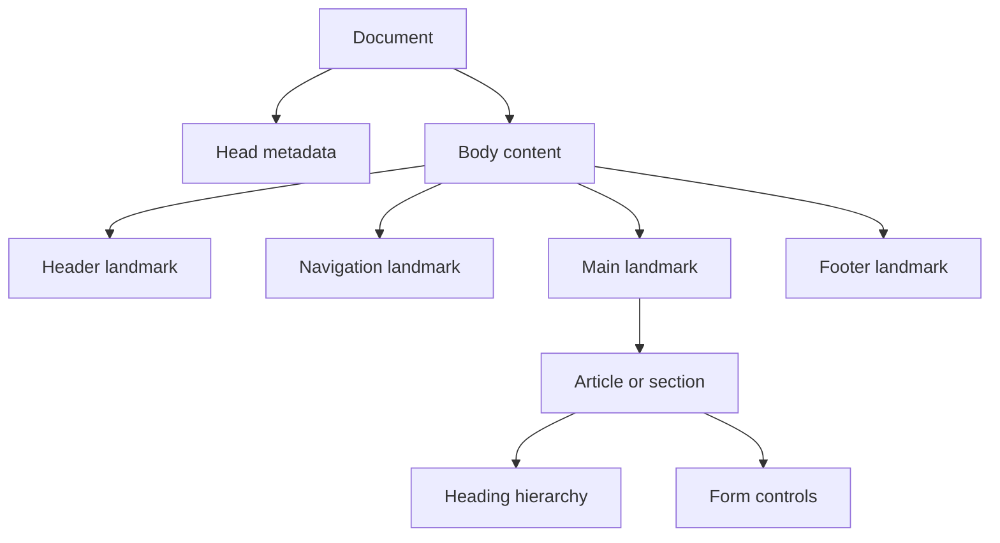

HTML and CSS are the authoring layer of the web platform. Interviewers use them to check whether you can build pages that are meaningful, accessible, responsive and maintainable before any framework code runs.

## Semantic structure

Semantic HTML means choosing elements for their meaning, not their default appearance. A `button` announces itself as a button, receives keyboard focus, fires on Enter and Space, and participates in form submission rules. A clickable `div` has none of that unless you rebuild it with roles, keyboard handlers and focus behaviour.



| Element | Use it for | Interview note |
|---|---|---|
| `header` | Introductory page or section content | Can appear inside an article too |
| `nav` | Major navigation links | Give it an accessible name when several navs exist |
| `main` | The primary page content | Use one per page |
| `section` | Thematic grouping with a heading | If no heading makes sense, a generic container may be better |
| `article` | Self-contained content | Posts, comments, product cards that stand alone |
| `aside` | Tangential content | Related links, filters, side notes |
| `button` | An action | Prefer over links when it changes state rather than navigates |

> [!KEY]
> Semantic markup is an accessibility primitive. It gives assistive technology, browser features, automated tests and future maintainers the same page map.

A senior answer also separates structure from styling. You can make a `button` look like a link, but you should not make a `span` behave like a button unless native HTML cannot express the control.

## Forms and inputs

Forms test whether you understand the contract between browser, user and server. The browser already knows how to associate labels, validate common input types, submit fields by `name`, disable controls and restore values after navigation. Use that platform behaviour before writing custom JavaScript.

```html
<form action="/signup" method="post" novalidate>
  <fieldset>
    <legend>Create account</legend>

    <label for="email">Email</label>
    <input id="email" name="email" type="email" autocomplete="email" required aria-describedby="email-help" />
    <small id="email-help">Use the address you check most often.</small>

    <label for="plan">Plan</label>
    <select id="plan" name="plan" required>
      <option value="">Choose a plan</option>
      <option value="team">Team</option>
    </select>

    <button type="submit">Create account</button>
  </fieldset>
</form>
```

| Form concern | Good practice | Why it matters |
|---|---|---|
| Labels | `label for` matches the control `id` | Screen readers announce purpose, clicking label focuses input |
| Field name | Every submitted control has `name` | Server receives predictable key value pairs |
| Input type | Use `email`, `date`, `number`, `password` | Better keyboards, validation and autofill |
| Grouping | Use `fieldset` and `legend` for related controls | Radio and checkbox groups need a shared question |
| Help and errors | Connect text with `aria-describedby` | Users hear the message while focused on the field |

`placeholder` is a hint, not a label. It disappears during typing, often has poor contrast, and is not a stable accessible name. Validation messages should be visible text, not only colour or an icon.

## Box model and layout

Every element is a box with content, padding, border and margin. The default `content-box` model means `width` applies only to the content area, so padding and borders make the rendered box larger. Most application stylesheets set `box-sizing: border-box` globally because declared dimensions then include padding and border.

```css
*,
*::before,
*::after {
  box-sizing: border-box;
}

.card {
  width: min(100%, 32rem);
  padding: 1rem;
  border: 1px solid var(--border-color);
  margin-block: 1.5rem;
}
```

| Layout problem | Prefer | Reason |
|---|---|---|
| Navbar, toolbar, chips | Flexbox | One axis, content-driven spacing |
| Dashboard shell, gallery, form grid | Grid | Rows and columns need coordinated control |
| Responsive card columns | Grid with `minmax` | Intrinsic layout can avoid many breakpoints |
| Vertical spacing between blocks | Margin or gap | Keeps spacing outside the component content |
| Internal component padding | Padding | Background and click target include the spacing |

```css
.toolbar {
  display: flex;
  align-items: center;
  justify-content: space-between;
  gap: 0.75rem;
}

.cards {
  display: grid;
  grid-template-columns: repeat(auto-fit, minmax(16rem, 1fr));
  gap: 1rem;
}
```

> [!TIP]
> Flexbox answers alignment questions along one main axis. Grid answers placement questions across rows and columns. Saying that distinction out loud prevents most layout over-engineering.

## Cascade, specificity and scale

CSS is powerful because it cascades, and painful when a codebase forgets that it cascades. For normal author styles, the conflict order is importance, cascade layer and origin, specificity, then source order. `!important` wins locally but usually creates a larger global problem.

| Selector shape | Specificity weight | Use carefully because |
|---|---:|---|
| `button` | Low | Easy to override, good for base styles |
| `.button` or `[data-state=open]` | Medium | Main building block for component styles |
| `#checkout` | High | Hard to override and rarely needed for styling |
| Inline style | Very high | Often framework generated or dynamic |
| `!important` | Overrides normal cascade | Should be a last resort or utility contract |

Scalable CSS starts with predictable boundaries. BEM makes relationships visible in class names, utility-first CSS makes decisions explicit at the call site, CSS Modules scope generated class names per component, and CSS-in-JS colocates styles with runtime state. None is universally best; the senior point is choosing one convention and preventing specificity wars.

| Approach | Strength | Weakness |
|---|---|---|
| BEM | Plain CSS, readable contracts | Verbose names, manual discipline |
| Utility-first | Small, consistent design tokens | Markup can become dense |
| CSS Modules | Local class names without runtime cost | Shared themes still need tokens |
| CSS-in-JS | Runtime theming and state-based styles | Bundle/runtime cost and SSR complexity |

CSS custom properties are now the default token mechanism for colour, spacing and themes because they cascade and can change at runtime.

```css
:root {
  --space-3: 0.75rem;
  --brand-color: #2563eb;
}

.button {
  padding: var(--space-3);
  background: var(--brand-color);
}
```

## Positioning and stacking

Positioning decides whether an element remains in normal flow. `relative` keeps the element's space and can offset it; it also creates a containing block for absolutely positioned descendants. `absolute` removes the element from flow and positions it against the nearest positioned ancestor. `fixed` pins to the viewport in typical cases. `sticky` participates in flow until a scroll threshold is reached.

| Value | Flow participation | Typical use | Trap |
|---|---|---|---|
| `static` | Normal flow | Default layout | Offsets do nothing |
| `relative` | Keeps original space | Containing block for badges | Offset does not move neighbours |
| `absolute` | Removed from flow | Menus, badges, overlays | Needs the right ancestor |
| `fixed` | Removed from document flow | Global banner, help button | Mobile viewport behaviour can surprise |
| `sticky` | Starts in flow | Sticky table header or side nav | Fails if parent overflow clips it |

Stacking contexts explain most `z-index` bugs. A new context can be created by positioned elements with `z-index`, `opacity` below one, `transform`, `filter`, `isolation: isolate` and several newer properties. Children cannot escape their parent's stacking context, no matter how large their own `z-index` is.

> [!WARNING]
> If `z-index: 9999` does not work, the element is probably trapped inside a lower parent stacking context or is not positioned. Raising the number is rarely the real fix.

## Responsive and accessible interfaces

Responsive design is not just breakpoints. Start with fluid layouts, relative units, content-aware sizing and sensible constraints, then add media queries for real layout changes. `rem` is predictable for typography and spacing, `%` follows the containing block, `fr` divides grid space, and viewport units should be used carefully on mobile because browser chrome changes visible height.

The `em` versus `rem` distinction is asked constantly and gets answered badly. `rem` resolves against the **root** font size once, so it is stable no matter how deeply an element is nested. `em` is font-relative: for `font-size` it resolves against the **parent's computed font size**, while for most other properties, such as padding or gap, it resolves against the element's own computed font size. Because font size inherits, nesting three elements each set to `font-size: 0.9em` yields `0.729` of the root, not `0.9`. That compounding is a bug when sizing type and a feature when sizing something that should scale *with* its own text, such as the padding on a button.

| Unit | Resolves against | Compounds when nested | Reach for it when |
|---|---|---|---|
| `px` | Nothing, an absolute CSS pixel | No | Hairline borders, values that must not scale |
| `rem` | Root font size | No | Type scale, spacing scale, breakpoints |
| `em` | Parent font size for `font-size`; own computed font size for most other properties | Yes for inherited font sizing | Padding and gaps that should track the element's own font size |
| `%` | The containing block's matching dimension | Depends on ancestry | Fluid widths inside a known container |
| `fr` | Free space in a grid container | No | Dividing grid tracks |
| `vh` / `vw` | Viewport size | No | Full-bleed sections, with `dvh` for mobile chrome |

> [!WARNING]
> Setting `html { font-size: 62.5% }` to make `1rem` equal `10px` is a common trick that breaks user accessibility settings less than it used to, but hard-coding `px` font sizes still overrides the reader's browser preference entirely. Size type in `rem` so a user who has set a larger default actually gets one.

```css
.page {
  width: min(100% - 2rem, 72rem);
  margin-inline: auto;
}

@media (min-width: 48rem) {
  .profile {
    display: grid;
    grid-template-columns: 16rem 1fr;
    gap: 2rem;
  }
}
```

Accessibility is part of the authoring layer, not a post-processing step. Use landmarks, a logical heading hierarchy, meaningful image `alt`, visible focus states, keyboard-operable controls and enough colour contrast. WCAG AA contrast targets are 4.5:1 for normal text and 3:1 for large text. ARIA helps only when native HTML cannot represent the widget; every ARIA role brings keyboard expectations you must implement.

| Accessibility concern | Good default | Common failure |
|---|---|---|
| Landmarks | `header`, `nav`, `main`, `footer` | Generic containers everywhere |
| Keyboard | Tab reaches controls, Enter or Space activates | `onClick` on non-focusable elements |
| Focus | Style `:focus-visible` clearly | Removing outlines globally |
| ARIA | Use for state like `aria-expanded` | Adding roles without keyboard behaviour |
| Contrast | Test normal and disabled states | Colour-only error indication |

## Design system implications

HTML and CSS choices scale through the design system. A team that provides accessible primitives for buttons, links, fields, dialogs and menus prevents every product squad from rediscovering focus, labels and keyboard rules independently. A design system should expose semantic defaults and styling escape hatches, not blank generic containers that rely on every caller to remember accessibility details.

| Primitive | Built-in contract | Customisation boundary |
|---|---|---|
| Button | Native button element, type handling, disabled state | Visual variant, size, loading state |
| Text field | Label association, error text, described-by wiring | Masking, prefix or suffix, validation copy |
| Modal dialog | Focus trap, Escape close, return focus | Width, content layout, action buttons |
| Tabs | Roving keyboard focus and selected state | Visual tab style and panel spacing |
| Toast | Live region announcement and timeout rules | Severity colour and action label |

A senior implementation usually separates tokens, primitives and compositions. Tokens define values such as colours, spacing, radii and typography. Primitives enforce platform behaviour. Compositions arrange primitives into product-specific patterns. This separation keeps CSS from becoming a pile of one-off values and keeps accessibility from depending on individual feature teams.

Responsive design also belongs in this layer. Prefer components that adapt to the space they receive instead of relying only on page-level breakpoints. Grid `minmax`, flex wrapping and container-aware layout decisions make components survive sidebars, localization, zoom and embedded contexts. If text grows by 30 percent in another language, the layout should reflow rather than clip.

The interview phrase to use is: make the easy path the correct path. If the design system's default `Button` is semantic, keyboard-safe, tokenized and themeable, teams move faster and ship fewer accessibility bugs. If the default primitive is a styled generic container, every screen becomes a separate risk review.

In code review, look for failures that tools do not always catch. Does the component still work at 200 percent zoom? Does the source order match the visual order? Does the visible label match the accessible name so speech input users can activate it? Does a custom menu close on Escape and return focus to the trigger? Does a responsive card still work when the title wraps to three lines? These checks are small, but they reveal whether the HTML and CSS are resilient or only correct for the happy screenshot.

CSS architecture should also make deletion safe. If a class name is global and overloaded, removing a rule can break unrelated pages. If tokens, primitives and component scopes are clear, a team can change the button radius, theme colour or card layout without a search-and-hope exercise. That maintainability story is often what separates a senior CSS answer from a syntax answer.

One final senior signal is knowing when not to customise. Native select boxes, date inputs and form validation messages can be hard to theme perfectly, but replacing them casually creates accessibility, mobile and localization work. Custom controls are justified when the product need is real and the team is ready to own the full platform contract.
## Cheat sheet

- HTML defines meaning first and layout hooks second.
- Use one `main`, meaningful landmarks and a heading hierarchy that does not skip levels for visual size.
- Prefer native controls over custom widgets because keyboard and accessibility behaviour come for free.
- Every form control needs a label and useful error text tied with `aria-describedby` when needed.
- Set `box-sizing: border-box` so dimensions match how humans reason about boxes.
- Flexbox is one-dimensional; Grid is two-dimensional.
- Avoid specificity wars by using classes, component boundaries, tokens and documented conventions.
- Stacking contexts trap children; high `z-index` cannot escape a lower context.
- Build fluid layouts first, then add breakpoints only when the design genuinely changes.
- ARIA is a supplement to semantic HTML, not a replacement for it.

## Common mistakes

| Mistake | Fix |
|---|---|
| Building buttons and links from generic elements | Use `button` for actions and `a` for navigation |
| Relying on placeholder text as the only label | Add visible labels and keep hints separate |
| Solving all layouts with absolute positioning | Use Flexbox or Grid for layout, positioning for overlays |
| Using IDs and `!important` for routine styling | Use class-based rules, layers or component scoping |
| Removing focus outlines globally | Style `:focus-visible` to match the design system |
| Creating custom controls without keyboard support | Use native controls or implement the full role and keyboard contract |

## Summary

HTML and CSS are the platform contract beneath every frontend framework. Strong answers start with semantic structure, accessible forms and native controls, then move to the box model, Flexbox, Grid, cascade and responsive design. At senior level the interviewer is listening for trade-offs: native before custom, Grid before breakpoint sprawl, tokens before one-off values, and ARIA only where native semantics are not enough.

## Top Interview Questions

### Q1. Why is semantic HTML important beyond SEO?

Semantic HTML gives the browser and assistive technology a meaningful document tree. A `nav` landmark lets screen-reader users jump to navigation; a `main` landmark identifies the primary content; a real `button` already supports focus, Enter and Space activation, disabled state and form behaviour. It also improves testing and maintainability because selectors can target roles and labels instead of brittle class names. The senior framing is that semantics are not decoration. They are a contract between the author, browser, accessibility tree, automation and future developers. SEO is one benefit, but accessibility and correct native interaction are the bigger engineering reasons.

### Q2. When should you use a button versus a link?

Use a link when the primary result is navigation to another URL or location. Use a button when the primary result is an action on the current page or application state, such as opening a dialog, submitting a form, saving a record or toggling a panel. This distinction matters because browsers and assistive technologies expose different expectations. Links can open in new tabs, show visited state and announce destinations. Buttons are activated with Enter and Space and participate in forms. Styling can make either look like the other, but the element should match the behaviour. A clickable generic container is the weakest option because you must rebuild focus, keyboard and role behaviour manually.

### Q3. What makes an HTML form accessible?

An accessible form uses native controls, visible labels, grouped related fields and clear errors. Each input should have a `label` connected with `for` and `id`, or a wrapping label. Radio groups and checkbox groups need `fieldset` and `legend` so the question is announced with each option. Help text and errors should be real text connected through `aria-describedby`, not only colour or icons. The correct input type improves mobile keyboards and validation. A good answer also mentions focus management: after failed submit, move focus to a summary or first invalid field, and keep keyboard order logical. Placeholder text should never be the only label.

### Q4. Explain the CSS box model and why `border-box` is common.

The CSS box model has content in the centre, padding around content, border around padding and margin outside the border. With the default `content-box`, a declared width applies only to the content area, so padding and border make the rendered element wider than the declared width. With `border-box`, the declared width includes content, padding and border, which matches how most engineers and designers reason about component dimensions. Margin remains outside either model. Teams commonly apply `box-sizing: border-box` to all elements and pseudo-elements in a reset. It reduces surprises in responsive layouts, especially when percentage widths and padding appear together.

### Q5. How do you choose between Flexbox and Grid?

Choose Flexbox when the layout is primarily one-dimensional: a row or a column. Toolbars, nav items, button groups, chips and simple card internals are typical Flexbox cases because content size and alignment along a main axis matter most. Choose Grid when rows and columns both matter: page shells, dashboards, galleries and forms with label and input columns. Grid can define tracks, gaps and placement across two dimensions without extra wrappers. The practical senior answer is not that one is newer or better. It is that Flexbox aligns content along an axis, while Grid creates a two-dimensional placement system. Many real components use both.

### Q6. What is CSS specificity and how do you keep it manageable?

Specificity is the tie-breaker the cascade uses when multiple normal author rules target the same property. Element selectors are low, class and attribute selectors are higher, ID selectors are higher still, and inline styles beat normal stylesheet rules. `!important` overrides normal priority but should be rare because it makes future overrides harder. To keep CSS manageable, prefer class-based selectors, keep nesting shallow, avoid IDs for styling, use design tokens for shared values and choose a scoping strategy such as BEM, CSS Modules, utility classes or CSS-in-JS. The goal is predictable overrides, not clever selectors. If a change requires escalating to `!important`, the style architecture is usually leaking.

### Q7. Why does `z-index` sometimes appear not to work?

`z-index` only participates for positioned or otherwise stacking-context-forming elements, and it is scoped by stacking contexts. A parent can create a new stacking context through properties such as `position` with `z-index`, `opacity` below one, `transform`, `filter` or `isolation`. Children inside that context are ordered relative to each other, but cannot rise above elements in a higher sibling context outside the parent. That is why setting `z-index: 9999` on a modal child may still leave it behind a header if the modal is nested under a lower stacking context. The fix is usually moving the overlay to a higher layer, removing the accidental context, or creating a deliberate app-level portal layer.

### Q8. What is your practical accessibility checklist before shipping a component?

I first use native HTML whenever possible, then test with only the keyboard. Tab should reach every interactive element in a logical order, Enter or Space should activate controls, Escape should close dismissible overlays and focus should return to the trigger. I check visible focus styles, labels, field errors, image `alt`, heading order and colour contrast. For dynamic updates such as form errors or toast messages, I use an appropriate live region. I avoid ARIA unless native HTML cannot express the pattern, and when I add roles like dialog, menu or tab, I implement the expected keyboard behaviour. Automated tools help, but keyboard testing catches many real issues quickly.


