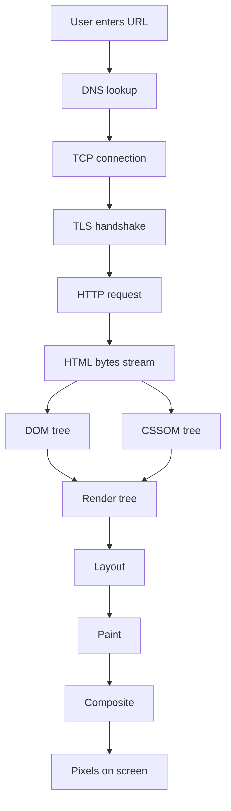

Browser performance is the runtime side of frontend engineering. The useful interview answer connects the network path, render pipeline, JavaScript cost and user-visible metrics instead of naming optimisations at random.

## From URL to pixels

When a user navigates, the browser resolves the host, opens a connection, negotiates TLS, sends an HTTP request, receives HTML and starts parsing before the full response arrives. The parser builds the DOM, the CSS parser builds the CSSOM, visible DOM nodes and computed styles form the render tree, layout computes geometry, paint fills layers, and composite blends those layers to the screen.



| Phase | Typical bottleneck | Practical fix |
|---|---|---|
| DNS and connection | Cold lookup and handshake round trips | Reuse connections, preconnect to critical origins |
| TTFB | Slow origin or uncached HTML | CDN, server caching, faster backend path |
| HTML parsing | Parser blocked by synchronous scripts | `defer` application scripts |
| CSSOM | Large render-blocking stylesheet | Critical CSS, remove unused CSS, split noncritical styles |
| LCP resource | Hero image discovered late | Preload critical image or font |
| Main thread | Large JS parse and execution | Code split, tree shake, move compute off thread |

> [!KEY]
> The browser can parse HTML incrementally, but it cannot paint styled content until the render-blocking CSS needed for that content is available.

Good answers use numbers carefully. A TTFB under about 800 ms is usually needed for a good Largest Contentful Paint. A task over 50 ms is a long task that can block input and paint.

## Critical rendering path

The critical rendering path is the minimum work from first HTML byte to first useful paint. CSS in the document head is render-blocking because the browser needs the CSSOM before it can build the render tree. A normal script without attributes blocks the HTML parser while it downloads and executes, because it might call `document.write` or read layout-affecting state.

```html
<link rel="preload" href="/assets/hero.webp" as="image" />
<link rel="stylesheet" href="/assets/app.css" />
<script src="/assets/app.js" defer></script>
<script src="/assets/analytics.js" async></script>
```

| Script mode | Downloads while parsing | Executes | Preserves order | Best use |
|---|---|---|---|---|
| No attribute | No, parser waits | Immediately when reached | Yes | Rare legacy cases |
| `defer` | Yes | After parse, before `DOMContentLoaded` | Yes | Application bundles |
| `async` | Yes | As soon as ready | No | Independent analytics or ads |
| `type="module"` | Yes | Deferred by default | Import graph order | Modern module bundles |

`preload` means this resource is needed for the current page and should be fetched now at high priority. `prefetch` means this resource might be needed for a future navigation and should be fetched at low priority. `preconnect` opens the DNS, TCP and TLS path early for a critical origin. Misusing these hints can hurt performance by stealing bandwidth from resources that actually block rendering.

> [!WARNING]
> `async` is not a faster `defer`. It executes whenever it arrives, so dependent scripts can run in the wrong order and block parsing at an unpredictable point.

## Layout, paint and composite

After the initial render, updates do not all cost the same. Layout, also called reflow, recalculates geometry. Paint fills pixels into layers. Composite moves and blends already-painted layers, often on the GPU. Performance work is about avoiding expensive stages in high-frequency paths such as scroll, resize and animation.

| Property change | Pipeline cost | Better for animation |
|---|---|---|
| `width`, `height`, `margin`, `top`, `left` | Layout, paint and composite | No |
| `font-size`, `display`, DOM insertion | Layout, paint and composite | No |
| `color`, `background-color`, `box-shadow` | Paint and composite | Sometimes |
| `transform`, `opacity` | Composite only when layer exists | Yes |
| `filter` | Often composite, can be expensive | Use sparingly |

Layout thrashing happens when code alternates layout reads and writes. A read such as `getBoundingClientRect`, `offsetHeight` or `scrollTop` can force pending style changes to flush immediately.

```typescript
const heights = items.map((item) => item.getBoundingClientRect().height);

items.forEach((item, index) => {
  item.style.transform = `translateY(${heights[index] * 0.1}px)`;
});
```

The pattern is to batch reads first, batch writes after, and schedule visual writes with `requestAnimationFrame` when they need to align with the next frame. `will-change: transform` can pre-promote an animating element, but it consumes memory and should not be applied globally.

## Core Web Vitals

Core Web Vitals measure user experience from real users at percentile thresholds, not just lab runs on a developer laptop. INP replaced FID in 2024, so senior answers should use INP for responsiveness.

| Metric | Measures | Good | Needs work | Poor |
|---|---|---:|---:|---:|
| LCP | Time until the largest visible content element paints | 2.5 s or less | 4 s or less | Over 4 s |
| INP | Interaction delay through next paint across the session | 200 ms or less | 500 ms or less | Over 500 ms |
| CLS | Unexpected layout shift score | 0.1 or less | 0.25 or less | Over 0.25 |

LCP is usually gated by TTFB, resource discovery, resource load time or element render delay. Fix it by improving server response, preloading the actual LCP resource, serving right-sized WebP or AVIF images, avoiding lazy loading above the fold and reducing render-blocking CSS or JS.

INP is caused by long main-thread tasks, heavy event handlers, expensive synchronous rendering and layout thrash. Break work into chunks, use a Web Worker for CPU-heavy operations, debounce noisy input and avoid reading layout inside handlers.

CLS comes from missing image dimensions, late ads or embeds, injected banners above existing content and web fonts that swap with different metrics. Reserve space, set `width` and `height` on media, avoid inserting content above the viewport, and tune font loading.

> [!TIP]
> Optimise the biggest component of the metric first. If LCP is 4.2 seconds and TTFB is 3.4 seconds, image compression cannot make the page good by itself.

## Bundle and loading strategy

JavaScript has three costs: transfer, parse and execution. Compression helps transfer but does not make a 2 MB bundle cheap to parse on a mid-tier phone. A useful rule of thumb is to keep critical-path compressed JavaScript near 200 KB when possible and to treat each new dependency as permanent page weight until proven otherwise.

| Technique | Fixes | Interview caveat |
|---|---|---|
| Route-level splitting | Users download only current route code | Avoid splitting into too many tiny chunks |
| Component lazy loading | Heavy optional UI waits until needed | Add good loading and error states |
| Tree shaking | Removes unused ESM exports | Fails with side effects and broad imports |
| Dependency replacement | Removes large packages | Measure before and after with analyzer |
| Brotli compression | Reduces transfer bytes | Parse and execute cost remains |
| Web Worker | Moves compute off main thread | Serialization and worker startup have cost |

Loading hints should reflect priority. Preload the current page's LCP image, critical font or current route chunk. Prefetch only likely next routes on idle connections. Defer the main bundle. Lazy load below-fold images with dimensions reserved. Keep third-party scripts on a strict budget because they execute on the same main thread as product code.

## Browser caching and storage layers

Caching is layered. The browser HTTP cache obeys response headers, the memory cache can satisfy same-page reuse, a service worker can intercept requests with programmable strategies, and a CDN can serve shared cached responses before the request reaches origin. The safest asset strategy is content hashing.

| Header or layer | Meaning | Use for |
|---|---|---|
| `Cache-Control: max-age=31536000, immutable` | Reuse without revalidation until URL changes | Hashed JS, CSS and images |
| `Cache-Control: no-cache` | Store but revalidate before reuse | HTML document that points to latest hashes |
| `Cache-Control: no-store` | Do not store at all | Sensitive or one-time responses |
| `ETag` | Server validates whether cached bytes are fresh | Dynamic or origin-served assets |
| Service worker | Programmable request interception | Offline and stale-while-revalidate patterns |

```text
HTML document: no-cache, revalidates on navigation
app.8d31f2.js: max-age=31536000, immutable
hero.91ab20.webp: max-age=31536000, immutable
API profile data: short max-age or stale-while-revalidate only if staleness is safe
```

Service workers are powerful and risky. They survive deployments, so version cache names, clean old caches and have a rollback plan. For measurement, combine lab tools such as Lighthouse and DevTools Performance with real-user monitoring from the Web Vitals library or your analytics pipeline. Lab tools explain why; field data proves whether users improved.

## Measurement workflow

Performance work should follow a measurement loop: reproduce, isolate the metric, make one targeted change and verify with the same tool. Lab data is controlled and explains causes; field data is noisy but proves user impact. A strong interview answer uses both rather than arguing that one replaces the other.

| Tool or signal | Best for | Limitation |
|---|---|---|
| DevTools Network | Discovery order, priority, transfer and TTFB | One machine and one connection profile |
| DevTools Performance | Long tasks, layout, paint and script stacks | Needs careful recording and interpretation |
| Lighthouse | Repeatable lab audit and opportunities | Simulated environment, not all users |
| PageSpeed Insights | Field Web Vitals plus lab hints | URL-level view may hide route-specific issues |
| Web Vitals RUM | Real users by route, device and network | Requires instrumentation and enough traffic |
| Bundle analyzer | JavaScript ownership by dependency | Does not show runtime execution cost alone |

For LCP, break the number into four parts: time to first byte, resource load delay, resource load time and element render delay. For INP, record the slow interaction and find the long task that blocks the next paint. For CLS, use the layout shift track or field attribution to identify the moving element and the element that caused movement.

Set budgets before regressions happen. Examples include maximum critical JavaScript, maximum image bytes for the hero, maximum third-party script count, and p75 field thresholds for LCP, INP and CLS. Budgets should fail pull requests or release checks only when the team trusts the measurement; otherwise they become ignored noise.

Finally, segment results. A page may look healthy on desktop broadband and fail on mid-tier Android over 4G. Field data by device class, route and geography tells you whether the optimisation helped the users who were actually slow. That is the difference between performance theatre and production performance engineering.

When a performance fix lands, verify that it did not move cost from one metric to another. Aggressively preloading many resources can improve one LCP trace while delaying CSS or JavaScript needed for interaction. Splitting a bundle can reduce initial bytes but create a waterfall of chunks on navigation. Moving work to a Worker can improve INP but add serialization overhead for large objects. The senior habit is to watch the whole page lifecycle: loading, responsiveness, stability and repeat navigation. A good performance budget therefore includes user-centric metrics and engineering limits such as critical bytes, long task count and third-party script weight.
## Cheat sheet

- URL to pixels is DNS, connection, TLS, request, TTFB, HTML parsing, DOM, CSSOM, render tree, layout, paint and composite.
- CSS blocks rendering because the CSSOM is needed before the render tree can be built.
- Use `defer` for application scripts and `async` only for independent scripts.
- `preload` current critical resources, `prefetch` likely future resources and `preconnect` critical origins.
- Layout properties are expensive; `transform` and `opacity` are the usual animation properties.
- LCP good is 2.5 seconds or less, INP good is 200 ms or less, CLS good is 0.1 or less.
- Break long tasks over 50 ms and move heavy compute to Web Workers when needed.
- Cache hashed static assets for a year and revalidate HTML.
- Measure with both lab tooling and real-user Web Vitals before claiming success.

## Common mistakes

| Mistake | Fix |
|---|---|
| Optimising images before checking TTFB | Break LCP into server, discovery, load and render phases |
| Marking the main bundle `async` | Use `defer` so execution waits for parsing and preserves order |
| Animating `top`, `left`, `width` or `height` | Animate `transform` and `opacity` where possible |
| Lazy loading the above-fold hero image | Preload it and lazy load only below-fold media |
| Shipping one large app bundle | Split by route and lazy load heavy optional features |
| Caching HTML for a year with immutable assets | Revalidate HTML and cache only hashed assets immutably |

## Summary

Runtime performance is a chain, and the slowest link decides the user experience. The browser needs network bytes, a DOM, a CSSOM, a render tree and main-thread time before it can paint and respond. Senior debugging starts with measurement, maps the symptom to LCP, INP or CLS, fixes the dominant phase, and verifies the result in real-user data rather than relying on a single lab score.

## Top Interview Questions

### Q1. What happens from typing a URL to seeing pixels?

The browser checks caches, resolves DNS if needed, opens or reuses a TCP connection, negotiates TLS, sends an HTTP request and waits for the first byte. As HTML arrives, parsing starts incrementally and builds the DOM. Stylesheets build the CSSOM; scripts can block parsing unless deferred or async. The DOM and CSSOM combine into a render tree containing visible nodes and computed styles. Layout calculates positions and sizes, paint fills pixels into layers, and composite blends those layers to the screen. The answer should also mention that CSS blocks rendering, normal scripts block parsing, and JavaScript may still need to run before an application is interactive.

### Q2. Why does CSS block rendering?

The browser cannot correctly build the render tree until it knows which CSS rules apply to the visible DOM. A heading might be hidden, a font size might change its geometry, or an element might be positioned differently. Because the render tree depends on computed styles, stylesheets referenced for the current render block painting until they are downloaded and parsed. HTML parsing can continue in many cases, but the first styled paint waits. The mitigation is not to remove CSS, but to make critical CSS small and early, split noncritical CSS, remove unused rules and avoid large blocking stylesheets for above-the-fold content. Inline critical CSS can help when used carefully.

### Q3. Compare `defer`, `async` and a normal script tag.

A normal external script blocks the HTML parser while the file downloads and executes. `defer` downloads in parallel with HTML parsing, then executes after parsing completes and before `DOMContentLoaded`, preserving document order. That makes it the default for application bundles that depend on the DOM or on each other. `async` also downloads in parallel, but executes as soon as it is ready and does not preserve order, so it is appropriate only for independent scripts such as analytics. `type="module"` behaves like deferred execution by default. The key interview trap is saying both `async` and `defer` are simply non-blocking; their execution timing and ordering differ.

### Q4. What is layout thrashing and how do you fix it?

Layout thrashing happens when code repeatedly alternates layout reads and layout writes. For example, inside a loop it reads `getBoundingClientRect`, writes a new style, then reads another element. The browser has pending style changes, so each read may force a synchronous layout flush to return accurate geometry. That turns one layout calculation into many and causes scroll or animation jank. Fix it by batching all reads first, then batching all writes, scheduling visual writes with `requestAnimationFrame`, and avoiding layout-dependent work in high-frequency handlers. If the update is visual movement, prefer compositor-friendly properties such as `transform` and `opacity`.

### Q5. How would you investigate an LCP of 4.2 seconds?

First identify the LCP element in PageSpeed Insights or DevTools Performance. Then split the delay into TTFB, resource load delay, resource load time and element render delay. If TTFB is high, fix server, CDN or backend caching before touching frontend assets. If the LCP image starts loading late, preload it and ensure it is in the initial HTML rather than hidden behind JavaScript. If transfer is high, serve the right dimensions and modern formats. If render delay is high, remove render-blocking CSS or synchronous scripts and reduce main-thread work. After each change, remeasure in lab and field data because LCP is a real-user percentile metric.

### Q6. What causes poor INP and what are the fixes?

INP measures the delay from a user interaction until the next paint, across interactions throughout the session. Poor INP usually means the main thread is busy: a long task is running, an event handler performs heavy work, rendering is expensive, or layout is forced synchronously. Fixes include breaking long work into chunks, yielding back to the browser, moving CPU-heavy work to a Web Worker, debouncing or throttling noisy handlers, reducing component render cost and eliminating layout thrash inside interactions. A good investigation records a Performance trace around the slow interaction, finds the long task responsible and fixes that specific task instead of guessing.

### Q7. Why does CLS happen and how do you prevent it?

CLS is caused by unexpected movement of visible content. Common sources are images or iframes without dimensions, ads or embeds that load after content, banners inserted above existing nodes, and fonts that swap with different metrics. Prevention is mostly reserving space before content loads: set `width` and `height` or aspect ratio on media, allocate a minimum size for ad slots, avoid injecting content above the current viewport and choose font loading settings that minimise metric changes. User-triggered movement is not counted the same way as unexpected load-time movement, but it still should feel deliberate. The senior answer ties the metric to visual stability, not just a score.

### Q8. How do HTTP caching headers work for modern frontend assets?

For content-hashed assets such as `app.8d31f2.js`, use a long `max-age` with `immutable` because any content change creates a new URL and a safe cache miss. For the HTML document, use `no-cache`, which allows storage but requires revalidation so the browser can discover the newest asset hashes. Use `no-store` only for responses that must not be stored at all, such as sensitive one-time data. `ETag` or `Last-Modified` lets the server answer `304 Not Modified` when cached bytes are still valid. This pattern gives fast repeat visits without trapping users on old bundles after deployment.


