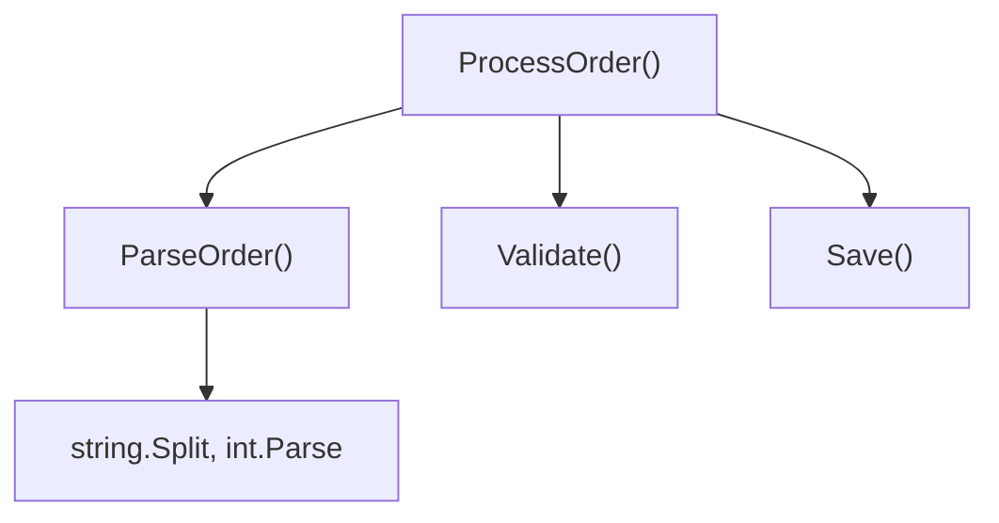

"Clean code" questions test judgement, not trivia. Interviewers want to see that you can name things well, keep functions small and honest, and know *when* a principle like DRY should bend rather than be obeyed blindly.

## Naming that removes the need for comments

A good name answers "what" and "why" so a comment doesn't have to. If you feel the urge to write `// check if user is eligible`, rename the boolean to `isUserEligible` and delete the comment — the code now says the same thing and cannot go stale.

```csharp
// Before — needs a comment to be understood
if (u.s == 2 && u.a > 18) { /* eligible adult, active status */ }

// After — the comment is redundant, so it's gone
if (user.IsActive && user.Age >= AdultAge) { }
```

Rules that hold up in review: use intention-revealing names (`elapsedTimeMs`, not `t`), avoid disinformation (don't call a `List` a `userMap`), and make names searchable — `7` is unfindable, `MaxRetryCount` is not. Booleans should read as a yes/no question (`isValid`, `hasPermission`); avoid negatives (`isNotDisabled`).

> [!KEY]
> A comment that explains *what* the code does is a sign the code should be renamed instead. A comment that explains *why* (a business rule, a workaround for a bug) earns its place.

## Function size and a single level of abstraction

Small functions are easier to name, test and reuse — if you struggle to name a function, it is probably doing more than one thing. The related discipline is **single level of abstraction**: a function should either orchestrate calls to other functions, or do low-level work, not mix both in one body.

```csharp
// Mixed levels — orchestration and raw parsing tangled together
public Order ProcessOrder(string raw) {
    var parts = raw.Split(',');           // low-level parsing
    var order = new Order(parts[0], int.Parse(parts[1]));
    Validate(order);                       // high-level step
    Save(order);                           // high-level step
    return order;
}

// Single level — the caller reads like a table of contents
public Order ProcessOrder(string raw) {
    var order = ParseOrder(raw);
    Validate(order);
    Save(order);
    return order;
}
```



A function reading top-to-bottom at one abstraction level is scannable in seconds; a function mixing "call a service" with "manually build a JSON string" forces the reader to context-switch line by line.

## Guard clauses over nested conditionals

Nested `if` blocks force the reader to hold multiple conditions in their head before reaching the actual logic. Guard clauses (early returns) handle the exceptional or invalid cases first and let the happy path sit at the lowest indentation level.

```csharp
// Before — the real logic is buried three levels deep
public decimal CalculateDiscount(Order order) {
    if (order != null) {
        if (order.Customer != null) {
            if (order.Customer.IsPremium) {
                return order.Total * 0.9m;
            } else {
                return order.Total;
            }
        }
    }
    return 0;
}

// After — guard clauses handle edge cases, happy path is flat
public decimal CalculateDiscount(Order order) {
    if (order == null) return 0;
    if (order.Customer == null) return order.Total;
    if (!order.Customer.IsPremium) return order.Total;

    return order.Total * 0.9m;
}
```

> [!TIP]
> In a live coding round, refactoring your own nested `if` into guard clauses *while narrating why* is a reliable way to demonstrate seniority without being asked.

## Magic numbers and primitive obsession

A magic number (`if (status == 2)`) forces the reader to memorise what `2` means and breaks the moment the mapping changes. Name it as a constant or, better, an enum. **Primitive obsession** is the next level of the same smell: using raw `string`/`int`/`decimal` for concepts that have their own rules — an email address, a money amount, a percentage — instead of a small type that can validate and behave correctly.

| Smell | Example | Fix |
|---|---|---|
| Magic number | `if (retries > 3)` | `if (retries > MaxRetryCount)` |
| Magic string | `if (role == "admin")` | `if (role == UserRole.Admin)` (enum) |
| Primitive obsession (money) | `decimal price` passed around raw | `Money` value type with currency + amount |
| Primitive obsession (email) | `string email` with no validation | `EmailAddress` value type validating on construction |

```csharp
public readonly record struct Money(decimal Amount, string Currency) {
    public static Money operator +(Money a, Money b) {
        if (a.Currency != b.Currency) throw new InvalidOperationException("Currency mismatch");
        return new Money(a.Amount + b.Amount, a.Currency);
    }
}
```

Wrapping a primitive in a type moves validation to one place and catches illegal states at the boundary — for example, `Money` can reject adding USD to GBP in one operator instead of letting that rule be reimplemented inconsistently at every call site.

## Comments that earn their place

Good comments explain **intent, trade-offs and non-obvious constraints** the code cannot say for itself: why a workaround exists, a link to the ticket describing a hack, or a warning about a subtle ordering requirement. Bad comments restate the code, act as changelog noise, or lie once the code around them changes.

| Comment | Verdict |
|---|---|
| `// increment i by 1` above `i++` | Noise — delete |
| `// workaround for vendor bug INC-4821, remove after SDK 3.2` | Earns its place |
| `// TODO: this is O(n^2), fine while list < 100 items` | Earns its place |
| `// list of users` above `List<User> users` | Noise — rename instead |

> [!WARNING]
> A comment that duplicates the code is a liability, not a neutral. It will drift from the code the first time someone edits the logic without updating the words above it.

## DRY, KISS, YAGNI and the boy scout rule

**DRY** ("don't repeat yourself") targets duplicated *knowledge*, not duplicated *text*. Two functions that happen to look similar today but represent different business rules should stay separate — merging them creates a false abstraction that has to grow ugly parameters (`isSpecialCase`, `mode`) the moment the rules diverge. The rule of thumb: **duplication is cheaper than the wrong abstraction**. Tolerate a little copy-paste until the same change has to be made in the same way three times (the "rule of three") — only then extract a shared function, and only if the duplication really is the same concept, not a coincidence.

**KISS** ("keep it simple") pushes back on cleverness: prefer the boring solution a teammate can debug at 2 a.m. over a generic framework nobody asked for. **YAGNI** ("you aren't gonna need it") says don't build the configurable plugin system for a feature that has one implementation — add the abstraction when the second real use case shows up, not in anticipation of it. The **boy scout rule** — leave the code a little better than you found it — is how these apply day to day: you don't need a dedicated refactoring sprint if every PR nudges the file it touches slightly cleaner.

> [!DANGER]
> Premature abstraction to satisfy DRY is one of the most common seniority anti-patterns: a shared `Handle(object request, string type)` method that branches internally on `type` is usually worse than two small, duplicated, honest methods.

## Cyclomatic complexity and code smells

Cyclomatic complexity counts the number of independent paths through a function (roughly: 1 + number of decision points — `if`, `for`, `while`, `case`, `&&`, `||`). It correlates directly with how many test cases you need for full branch coverage and how hard the function is to hold in your head.

| Cyclomatic complexity | Risk | Guidance |
|---|---|---|
| 1–5 | Low | Simple, easy to test |
| 6–10 | Moderate | Fine, but watch it grow |
| 11–20 | High | Refactor candidate |
| 20+ | Very high | Split before adding more logic |

| Code smell | Symptom | Refactoring |
|---|---|---|
| Long method | Function does many unrelated things | Extract method |
| Large class | Class has too many responsibilities | Extract class (Single Responsibility) |
| Feature envy | Method uses another class's data more than its own | Move method to that class |
| Shotgun surgery | One change requires edits across many files | Consolidate the responsibility into one place |
| Data clumps | Same group of parameters passed everywhere | Introduce a parameter object |
| Primitive obsession | Raw types stand in for domain concepts | Introduce a value type |
| Long parameter list | Function takes 5+ arguments | Parameter object or builder |

**"What is clean code to you?"** — answer with a definition plus one concrete signal: *"Code that a teammate who has never seen it can read once and modify safely. Concretely: names that don't need comments, functions that do one thing at one level of abstraction, and no surprises — a function called `GetUser` never deletes anything."*

## Cheat sheet

- Name things so comments become unnecessary; keep comments for *why*, not *what*.
- One function, one level of abstraction — orchestration or detail, not both.
- Guard clauses flatten nesting and put the happy path at the lowest indent.
- Wrap primitives (money, email, percentage) in small types instead of passing raw values around.
- DRY targets duplicated **knowledge**; duplication of **coincidentally similar code** is cheaper than a bad abstraction.
- Apply the rule of three: extract shared logic on the third repetition, not the first.
- KISS: prefer boring and debuggable. YAGNI: build the abstraction when the second use case is real.
- Boy scout rule: every PR leaves its file slightly cleaner.
- Cyclomatic complexity above ~10 is a refactor signal, not just a metric to game.
- Know the code smells table cold — it is asked directly in reviews and interviews.

## Common mistakes

| Mistake | Fix |
|---|---|
| Merging two similar-looking functions into one with a `mode` flag | Keep them separate until the duplication is proven to be the same concept |
| Treating every comment as bad | Keep comments that explain intent, trade-offs or workarounds |
| Writing a generic, configurable solution for a single current use case | Apply YAGNI — build it when the second use case arrives |
| Measuring cleanliness only by line count | Also check cyclomatic complexity and responsibility count |
| Deeply nested validation logic | Refactor to guard clauses |
| Passing the same 4–5 parameters through many functions | Introduce a parameter object |

## Summary

Clean code is a set of habits that reduce the reader's cognitive load: names that remove the need for comments, functions that stay at one level of abstraction, guard clauses instead of nesting, and small types instead of raw primitives. DRY, KISS and YAGNI are trade-off tools, not laws — the senior skill is knowing when disciplined duplication beats a clever, wrong abstraction. Use cyclomatic complexity and the standard code smells (long method, feature envy, shotgun surgery, data clumps) as objective triggers for when to refactor, and treat every change as a chance to leave the file a little cleaner than you found it.

## Top Interview Questions

### Q1. What does "clean code" mean to you?

Clean code is code a teammate who has never seen it can read once and safely modify. Concretely, that means: names precise enough that comments explaining "what" become unnecessary; functions that do one thing at one level of abstraction; no hidden side effects (a method called `GetUser` never mutates state); and low cyclomatic complexity so the number of test cases stays manageable. I'd rather have simple, slightly duplicated code than a clever abstraction that requires a mode flag to handle two cases. Clean code optimises for the next reader's time, not the original author's cleverness.

### Q2. Isn't DRY always the right thing to do? When would you *not* deduplicate?

DRY targets duplicated **knowledge** — the same business rule expressed twice — not duplicated **text** that happens to look similar today. If two functions currently look alike but represent different concepts (say, discount calculation for two different customer tiers with unrelated rules), merging them creates a shared function that needs an `if (tier == "gold")` branch the moment the rules diverge, and a second, and a third. That shared function becomes harder to read than the two originals combined. My rule of thumb is the "rule of three": tolerate duplication until the same change needs to be made identically a third time, and only then extract a shared abstraction — and only if it really is the same concept.

### Q3. How do you decide how small a function should be?

Size in lines is a weak proxy; the real test is whether the function does **one thing at one level of abstraction** and whether you can name it precisely without using "and". If naming it requires "AndThen" or "Or", split it. A practical heuristic: if you have to scroll to see the whole function, or if it mixes orchestration ("validate, then save, then notify") with low-level detail (manual string parsing), extract the low-level part into its own well-named function. Cyclomatic complexity is a useful backstop — above roughly 10 branches, a function usually needs to be split regardless of line count.

### Q4. What is primitive obsession and why is it a problem?

Primitive obsession is using raw built-in types (`string`, `int`, `decimal`) for concepts that have their own validation rules and behaviour — an email address, a currency amount, a percentage. The problem is that validation and invariants end up scattered across every call site instead of living in one place, so it is easy to construct an invalid value (a negative percentage, a mismatched currency addition) that compiles fine and fails at runtime. The fix is a small value type — `EmailAddress`, `Money`, `Percentage` — that validates on construction and makes illegal states either impossible or a compile error, for example refusing to add `Money` in different currencies via the type system rather than a runtime check.

### Q5. Give an example of a comment that should exist and one that shouldn't.

A comment that should exist explains something the code cannot say for itself: `// workaround for vendor SDK bug INC-4821, remove after upgrading to 3.2` tells the reader *why* odd-looking code exists and when it is safe to delete. A comment that shouldn't exist restates the code: `// increment counter` above `counter++`. The test I apply is "does this comment answer a question the code itself can't answer, like a business reason, a link to context, or a warning about ordering?" If yes, keep it; if it's just narrating syntax, delete it and, if needed, rename instead.

### Q6. How would you refactor a deeply nested conditional?

I'd convert it to guard clauses: handle the invalid, exceptional or early-exit cases first with early returns, so the function's indentation drops back to the happy path. For example, `if (order != null) { if (order.Customer != null) { if (order.Customer.IsPremium) { ... } } }` becomes three guard clauses (`if (order == null) return 0;`, and so on) followed by the actual discount calculation at the top level of indentation. This reduces both the visual nesting and the cyclomatic complexity the reader has to track simultaneously, and it usually reveals missing edge case handling that was hidden inside the nesting.

### Q7. What's the difference between KISS and YAGNI, and how do they interact?

KISS ("keep it simple") is about *how* you implement something you're already building — prefer the straightforward, debuggable approach over a clever, generic one. YAGNI ("you aren't gonna need it") is about *whether* to build something at all — don't add configurability, plugin points or abstraction layers for requirements that don't exist yet. They reinforce each other: a YAGNI violation (building a generic rules engine for one rule) usually also violates KISS, because the generic version is harder to understand than the simple version would have been. In practice I build the simplest thing that satisfies today's requirement and add the abstraction only when a second real, concrete use case shows up.

### Q8. What's the boy scout rule, and how do you apply it without turning every PR into a giant refactor?

The boy scout rule is "leave the code a little better than you found it" — every time you touch a file, make one small improvement beyond your immediate task: rename a confusing variable, extract a guard clause, delete a stale comment. The discipline is scoping it: I only clean up code I'm already touching for a real reason, and I keep the cleanup small enough to stay in the same PR without derailing review — a rename or an extracted method, not a full rewrite of a file I happened to open. If a file needs a genuinely large refactor, I raise it as its own separate, reviewable piece of work rather than smuggling it into an unrelated change, because a large mixed diff is much harder to review safely.

### Q9. How do code smells like feature envy and shotgun surgery show up in review, and what do you do about them?

Feature envy shows up as a method that reaches into another class's data more than its own — for example, an `Invoice.CalculateTax()` method that mostly reads fields off a `Customer` object. The fix is usually to move the method (or the calculation) onto the class whose data it uses. Shotgun surgery shows up as a single conceptual change (say, adding a new payment type) requiring edits across many unrelated files — a sign the responsibility for "payment type" is scattered instead of centralised. The fix is to consolidate that responsibility, often via a strategy pattern or a single factory, so future changes touch one place. Both smells are best caught by asking, in review, "if this changes again, how many files move?"

### Q10. Can you give a concrete before/after refactor for a magic number?

Sure. `if (retryCount > 3) { throw new Exception(); }` forces the reader to guess whether `3` is arbitrary, configurable, or load-bearing, and it will be copy-pasted with the number silently drifting between call sites. The fix: `const int MaxRetryCount = 3;` at the top of the class (or a config value if it should be tunable), then `if (retryCount > MaxRetryCount)`. The follow-up question I'd expect: "when would you make it configuration instead of a constant?" — when different environments or customers legitimately need different limits, otherwise a named constant is simpler and avoids an extra moving part.

### Q11. How do you measure or reason about cyclomatic complexity without a static analysis tool in front of you?

Start from 1 for the function's single entry point, then add 1 for every `if`, `else if`, `case`, `for`, `while`, `catch`, and every `&&`/`||` in a condition (each is a decision point). A function with three sequential `if` statements and no nesting has complexity 4; the same three `if`s nested inside each other still count as 4 by this formula, but nesting also makes the function harder to read even at equal complexity, which is why I treat cyclomatic complexity and nesting depth as two separate signals. Above roughly 10, I start looking for an extract-method opportunity; above 20, I treat it as a near-mandatory refactor before adding new logic, because the number of test cases needed for full branch coverage grows with it.

### Q12. A teammate says "we're duplicating this validation logic in three places, let's extract it" — when do you agree and when do you push back?

I agree if the three places represent the **same business rule** — for example, "an email must be non-empty and contain an @" is the same concept everywhere. I push back if the three places only *look* similar today but represent different rules that happen to coincide — for example, three different forms that each validate "required field" but will likely diverge in future (one becomes optional for admins, another needs a different format). In that case I'd ask what happens the first time one of the three needs to change independently: if the answer is "the shared function grows an `if` branch for that one caller", that is the wrong-abstraction smell, and I'd rather keep the duplication until the rules actually converge or diverge for good.
