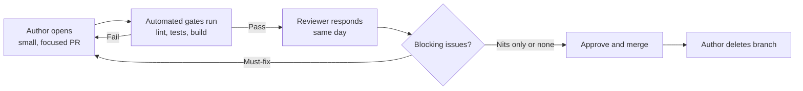

Code review is one of the few engineering practices interviewers can probe without a whiteboard — they just ask you to describe how you review, or hand you a diff and watch what you flag. It reveals judgement about risk, communication style, and whether you understand what review is actually *for*.

## What a review is for, and what it isn't

Review exists for four things: catching **correctness** issues before production, sanity-checking **design** decisions while they're still cheap to change, protecting long-term **maintainability**, and spreading **knowledge** so more than one person understands each part of the system. It is explicitly **not** for enforcing formatting, brace placement, or import ordering — that is what linters and formatters are for. A team that argues about tabs vs spaces in review has a tooling gap, not a review culture problem.

| Review should catch | Review should not need to catch |
|---|---|
| Logic errors, missed edge cases, race conditions | Indentation, brace style |
| Wrong abstraction, leaky interface, missing test | Import ordering, trailing whitespace |
| Security issue (injection, missing auth check) | Line length |
| Unclear naming that will confuse the next reader | Semicolons, quote style |

> [!KEY]
> If a comment could be produced by a linter, it shouldn't be produced by a human. Automate style; spend human attention on correctness, design and risk.

## The reviewer checklist

A useful mental checklist, roughly in priority order:

| Category | Questions to ask |
|---|---|
| Correctness | Does it do what the PR description claims? Are edge cases (null, empty, concurrent) handled? |
| Tests | Do tests exist for the new behaviour and the edge cases? Would a test have caught the bug this PR fixes? |
| Design | Is this the right abstraction? Does it fit existing patterns, or silently introduce a new one? |
| Security | Is user input validated? Are secrets, tokens or PII logged? Is authorization checked, not just authentication? |
| Performance | Any N+1 queries, unbounded loops over external data, or missing pagination? |
| Observability | Will this fail loudly (logs, metrics, alerts) or silently in production? |
| Readability | Would a new team member understand this without asking the author? |

> [!TIP]
> Reviewing test *names* first is a fast way to understand what a PR believes it does — if the tests only cover the happy path, that's the first comment to leave.

## Giving feedback that lands

The same comment can land as helpful or as an attack depending on phrasing. Ask questions instead of issuing commands where the author might have context you don't ("what happens here if the list is empty?" beats "this is broken"). Separate **must-fix** from **nit** explicitly — prefixing nits (`nit: rename this for clarity`) tells the author it's not blocking, which speeds up merges and reduces defensiveness. Explain the **why**, not just the what: "extract this into a method — it's duplicated in three places and each will need the same bug fix" teaches a principle the author can reuse next time. And praise good work explicitly; a review that is 100% criticism trains people to dread opening review comments, even when the average PR is fine.

```text
❌ "This is wrong."
✅ "This throws if `items` is empty — should we guard, or is that
   guaranteed upstream? If guaranteed, worth a comment saying so."

❌ "Rename this."
✅ "nit: `d` → `daysSinceLastLogin` would save the next reader a lookup."
```

## Review size and turnaround time

Review quality drops sharply as diff size grows — past roughly 400 lines of changed code, reviewers skim rather than read, and defect detection rate falls even though reviewers *feel* just as thorough. Small, focused PRs (under ~250 lines) get reviewed faster, more carefully, and produce fewer round trips.

| PR size (lines changed) | Typical review depth | Typical turnaround |
|---|---|---|
| < 50 | Thorough, line-by-line | Minutes to hours |
| 50–250 | Thorough with focus | Same day |
| 250–800 | Skimmed, structural comments only | 1–2 days, multiple rounds |
| 800+ | Effectively rubber-stamped | Days, low defect detection |

Turnaround time matters as much as depth: a PR sitting unreviewed for two days blocks the author from starting their next task cleanly and encourages risky "stack another PR on top of the unreviewed one" workarounds. A reasonable team norm is a same-day first response — even a partial "looked at half, comments so far, will finish by EOD" — rather than silence.



## Disagreeing productively

Disagreements are healthy when they're about the work, not the person. State your concern as a trade-off, not a verdict: "this couples the two services more tightly — is that intentional given the plan to split them next quarter?" invites a discussion; "this is bad design" invites defensiveness. If you and the author can't converge after one or two exchanges, **timebox it** — pull in a third opinion (tech lead, another senior engineer) rather than let a single PR turn into a week-long thread. For genuinely blocking disagreements, the author's team lead or the more senior engineer present makes the call, and the discussion is documented in the PR so the reasoning survives past the conversation.

> [!WARNING]
> Escalating too fast reads as unable to collaborate; never escalating reads as unable to hold a position. The signal interviewers look for is knowing which one a given disagreement calls for.

## Reviewing as a senior, and receiving feedback well

A senior reviewer spends their limited attention on **design and risk** — is this the right approach, does it introduce a security or data-integrity risk, will it be maintainable in a year — and explicitly does not spend it on typos or style the linter would catch. Senior reviewers also review the **PR description and tests** before the diff: if the description doesn't explain why, or no test demonstrates the fix, that's the first comment, before a single line of implementation is read.

Receiving feedback well is equally a skill that gets evaluated: respond to every comment (even if just "done" or "good catch"), don't take must-fix comments personally, and when you disagree, explain your reasoning rather than silently reverting or silently ignoring it. Marking a thread "resolved" without addressing it erodes trust fast.

## Automated gates that remove review toil

Push everything mechanical out of human review and into CI: formatters (auto-fix on save or pre-commit), linters (style and common bug patterns), static analysis (security, complexity thresholds), and required tests with coverage checks on the diff. A team with strong automated gates gets shorter, more focused human review threads because the conversation starts from "is this the right design" instead of "you forgot a semicolon".

| Gate | Removes from human review |
|---|---|
| Formatter (Prettier, `dotnet format`) | All whitespace and brace-style debate |
| Linter (ESLint, Roslyn analyzers) | Common bug patterns, unused variables, style |
| Static analysis / SAST | Known security anti-patterns |
| Required tests + coverage diff | "Did you test this?" as a manual question |
| Build + type check | "Does this even compile?" |

## Cheat sheet

- Review is for correctness, design, maintainability and knowledge sharing — not style. Automate style.
- Check tests and the PR description before the implementation diff.
- Separate must-fix from nit explicitly; explain *why*, not just *what*.
- Keep PRs under ~250 lines where possible — defect detection collapses on huge diffs.
- Respond same-day even if the review isn't finished; silence blocks teammates.
- Disagree about the work, not the person; timebox and escalate if two rounds don't converge.
- As a senior reviewer, spend attention on design and risk, not typos.
- Receiving feedback well (respond to every comment, explain disagreement) is reviewed too.
- Push formatting, linting and security scanning into CI so humans review judgement, not syntax.
- A healthy cycle is small PR → automated gate → same-day human review → merge → delete branch.

## Common mistakes

| Mistake | Fix |
|---|---|
| Leaving only style comments, missing a logic bug | Run the checklist: correctness and tests before style |
| Opening a 1,500-line PR "to save review round trips" | Split into reviewable, independently mergeable chunks |
| Commenting "this is wrong" with no explanation | State the concern, ask a question, explain the why |
| Letting a PR sit unreviewed for days | Commit to a same-day first response norm |
| Treating every comment as blocking | Explicitly mark nits so authors can triage |
| Silently resolving a comment thread without addressing it | Reply with the resolution or reasoning before resolving |
| Escalating a single-comment disagreement immediately | Try one or two more exchanges before pulling in a third party |

## Summary

Code review's job is to catch correctness and design problems while spreading knowledge across the team — style belongs to automated tooling, not human attention. Feedback that separates must-fix from nit, explains its reasoning, and asks questions instead of issuing verdicts gets adopted faster and preserves trust. Small PRs, same-day turnaround, and strong automated gates are what keep a review cycle healthy instead of becoming the bottleneck teams complain about; disagreements are normal and healthy as long as they're timeboxed and resolved by escalation, not attrition.

## Top Interview Questions

### Q1. What is code review actually for, and what should it explicitly not be used for?

Code review exists to catch correctness issues before production, sanity-check design decisions while they're cheap to change, protect long-term maintainability, and spread knowledge of the codebase across more than one person. It should not be used to enforce formatting, brace style, or import ordering — those are mechanical rules a linter or formatter enforces consistently and without the social friction of a human comment. If a team's reviews are dominated by style nitpicks, that's a sign of a tooling gap: the fix is a formatter and linter in CI, freeing human reviewers to spend their limited attention on logic, design and risk instead.

### Q2. How do you decide what's a "must-fix" versus a "nit" in a review?

A must-fix is anything that would cause incorrect behaviour, a security gap, a maintainability trap for the next person, or a missing test for genuinely risky logic — these block merge. A nit is a stylistic preference or minor improvement that doesn't affect correctness — a better variable name, a slightly cleaner structure — and shouldn't block merge on its own. I make the distinction explicit in the comment itself, prefixing nits with "nit:" so the author can triage quickly and doesn't have to guess whether ignoring it will fail the review. This also speeds up merges: an author can address must-fixes and defer nits to a follow-up without another review round.

### Q3. Why does PR size matter so much for review quality?

Defect detection rate drops sharply as diff size grows. Past roughly 400 lines of changed code, reviewers physically cannot hold the whole change in working memory, so they shift from reading line-by-line to skimming for structure — meaning the PR effectively gets a lighter review while feeling, to both author and reviewer, like it received a thorough one. Small PRs (under ~250 lines) get read properly, reviewed faster, and produce fewer surprise round trips later. The practical fix is to design work to be shippable in small, independently reviewable increments — for example, landing a new interface and its tests first, then wiring up the caller in a second PR — rather than one large PR "to save review overhead".

### Q4. A teammate left you five comments that all read as commands with no explanation. How do you feel about that as feedback, and how would you give feedback differently?

That style tends to feel adversarial even when the underlying concerns are valid, because it gives no room for the author to have context the reviewer is missing, and it doesn't teach anything reusable. I'd rather phrase the same concerns as questions or explanations: "what happens here if the list is empty?" invites a two-way conversation, and "extract this — it's duplicated three times, so a bug fix here would need three matching edits" explains the principle so the author applies it next time unprompted. If I received comments like that, I'd respond to each on its merits rather than getting defensive, but I'd also raise privately with the reviewer that phrasing as questions tends to get faster, less defensive fixes.

### Q5. How do you handle a disagreement with a reviewer that isn't resolving after a couple of comment exchanges?

First I make sure the disagreement is stated as a trade-off, not a verdict — "this couples the two services more tightly, is that intentional?" rather than "this is wrong" — because miscommunication often looks like disagreement. If after one or two genuine exchanges we still don't converge, I timebox it and pull in a third person: a tech lead or another senior engineer, and ask them to look at the specific point of disagreement, not the whole PR. I document the outcome and reasoning in the PR thread so the decision isn't lost. The failure mode to avoid is letting a single comment thread run for days without anyone deciding to escalate — that blocks the author far more than a quick, honest escalation would.

### Q6. What does reviewing "as a senior" look like differently from reviewing as a junior engineer?

A senior reviewer spends the majority of their attention on design and risk — is this the right abstraction, does it introduce a security or data-integrity risk, will this be maintainable when the team doubles — and deliberately skips typos and style the linter already catches. They also review the PR description and the tests before the implementation: if the description doesn't explain *why* the change is needed, or there's no test that would have caught the bug being fixed, that's the first comment, before reading a single line of the diff. A junior reviewer more often reviews line-by-line for correctness of the immediate change without stepping back to ask whether the change is the right one at all.

### Q7. What would you do if you found a PR that "works" but you think uses the wrong design, and the deadline is tomorrow?

I'd separate the two concerns explicitly in the review: flag any correctness or security must-fixes as blocking regardless of deadline, but treat the design concern as a documented trade-off rather than a blocker if the deadline is real and the design issue is contained (doesn't lock in a bad public interface or create a data migration problem). I'd approve with a comment explaining the concern and file a follow-up ticket to revisit after the deadline, rather than silently accepting a design I disagree with or blocking a real deadline over a non-critical structural preference. The one case I would still block on is a design mistake that becomes expensive or impossible to fix later — for example, a public API shape or a schema change — because "we'll fix it later" rarely happens for those.

### Q8. How do you give feedback on a PR without discouraging a junior engineer who put a lot of effort in?

I lead with what's good and specific about it — not generic praise, but "the extraction of the retry logic into its own class is a nice touch, that'll be easy to reuse" — before getting into must-fixes, so the review doesn't read as pure criticism. I frame corrections as teaching, explaining the underlying principle ("guard clauses here would flatten this nesting and make the edge cases easier to spot") rather than just stating the fix, so the lesson transfers to their next PR. I also make sure to distinguish clearly between must-fix and nit so a junior engineer doesn't leave the review thinking every comment is a failure — most PRs, junior or senior, have a mix of both.

### Q9. What automated checks would you put in CI to reduce the burden on human reviewers?

At minimum: a formatter that runs on save or pre-commit so style never reaches review, a linter for common bug patterns and unused code, a build and type-check gate so "does this compile" is never a human question, and required tests with a coverage diff so "did you test the new code" is answered automatically rather than asked in every review. For anything handling user input or auth, I'd add static analysis / SAST scanning for known vulnerability patterns. The goal is that every comment a human leaves is about something a machine genuinely can't judge — design fit, business correctness, risk — which both speeds up review and keeps human attention where it's valuable.

### Q10. How would you handle reviewing a PR from someone more senior than you, if you spot what looks like a real bug?

I'd raise it exactly as I would with any other author, framed as a question rather than a correction, since it's entirely possible they have context I don't: "this loop looks like it could double-charge the customer if the webhook retries — is idempotency handled upstream, or should we guard here?" Seniority doesn't change whether a bug is a bug; it only changes the odds that I'm the one missing context, so phrasing it as a genuine question rather than a confident verdict keeps the conversation productive either way. If they push back and I still believe it's a real issue, I'd ask for a specific test case that proves it's handled, rather than dropping the concern or escalating immediately.

### Q11. What's a healthy review cycle look like end-to-end, and where do things typically go wrong?

A healthy cycle: the author opens a small, focused PR with a clear description and tests; automated gates (lint, build, tests) run and must pass before human review starts; a reviewer responds the same day, separating must-fix from nit; the author addresses must-fixes and either applies or discusses nits; the PR is approved and merged promptly; the branch is deleted. Things typically go wrong at three points: PRs are too large so review quality collapses into rubber-stamping, turnaround time stretches to days so authors stack risky work on top of unreviewed branches, or feedback is delivered as unexplained commands, which slows convergence because the author has to guess at the underlying concern instead of understanding and fixing it directly.

### Q12. How do you review a PR that touches a part of the codebase you don't know well?

I say so explicitly rather than rubber-stamping it — "I don't know this module well, so I focused on the tests, the PR description, and whether the change matches the stated intent; someone more familiar with the retry logic should also take a look." I still add value by checking things that don't require deep context: are there tests for the new behaviour, does the description match the diff, are there any obviously risky patterns (unbounded loops, missing null checks, secrets in logs). This is more honest and useful than either blocking merge indefinitely until I "fully understand" unfamiliar code, or approving without genuinely evaluating anything.
