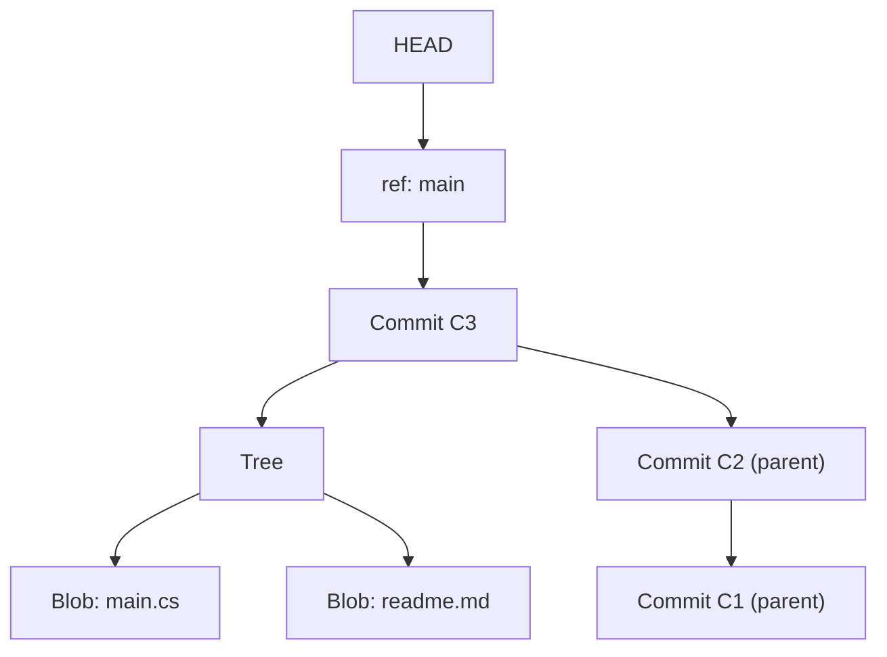
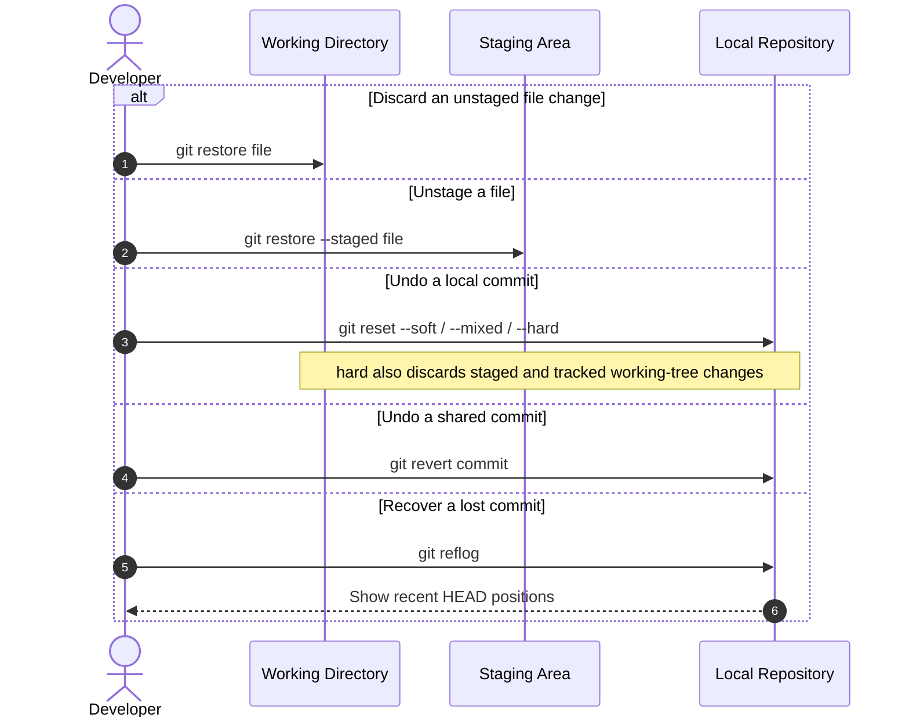
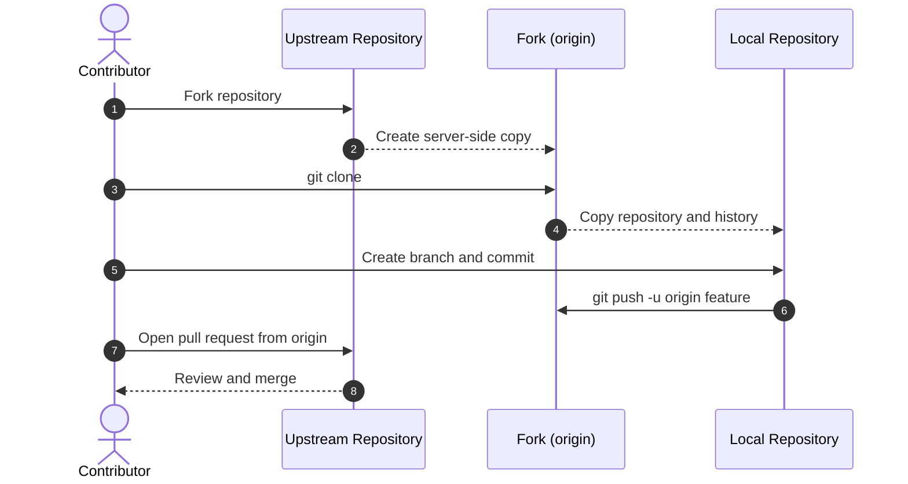
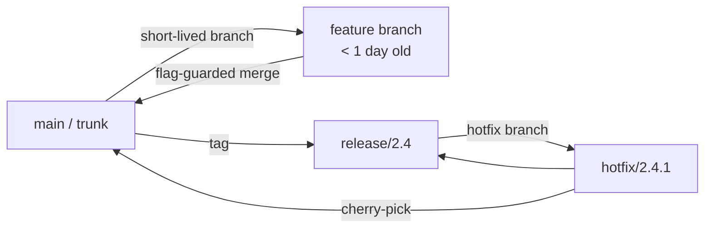

Git questions in interviews rarely test command memorisation — they test whether you understand the underlying object model well enough to reason about a strange state, and whether you can justify a branching strategy for a specific team rather than reciting one you've memorised.

## Centralized vs distributed version control

Git is a **distributed version control system (DVCS)**: every clone is a complete copy of the repository's history, not just a checkout of the current state, which is what makes branching, committing, and browsing history all work offline.

| | Centralized (CVCS) | Distributed (DVCS) |
|---|---|---|
| Repository copies | One central copy; clients check out a working copy | Every clone has the full history |
| Server dependency | Most operations need the server | Only push/fetch/pull need the server |
| Examples | SVN, CVS, Perforce | Git, Mercurial, Bazaar |

> [!TIP]
> This is why `git commit` never touches the network and `git log` works on a plane: the entire history already lives on disk. Only `push`, `fetch`, and `pull` need a remote at all.

## The object model

Everything in Git is one of four object types, and every command you run is really just moving a pointer or creating one of these objects.

| Object | Contains | Analogy |
|---|---|---|
| Blob | Raw file contents (no filename) | A file's bytes |
| Tree | A directory listing — names + modes pointing to blobs/trees | A folder |
| Commit | A tree pointer, parent commit(s), author, message, timestamp | A snapshot + metadata |
| Ref | A named pointer to a commit (branch, tag, `HEAD`) | A label |



A **branch** is nothing but a mutable pointer to a commit — creating one is instant because it writes 41 bytes, not a copy of the repository. `HEAD` usually points at a branch (which points at a commit); in **detached HEAD** state it points straight at a commit, which is why commits made there can be lost once you check out something else — they aren't reachable from any branch.

> [!KEY]
> A commit is immutable and content-addressed by the SHA-1/SHA-256 hash of its tree + parent + metadata. "Rewriting history" never edits a commit — it creates a new commit and moves a ref to point at it. The old commit still exists until garbage collected.

## Working directory to remote: the file lifecycle

A file moves through four places before it's shared with anyone else: the working directory (what you're editing), the staging area/index (what you've told Git to include in the next commit), the local repository (committed snapshots), and a remote (a repository hosted elsewhere).

{height=200px}

> **Tracked-file flow:** Unmodified → Modified → Staged → Committed → Pushed
>
> **New-file flow:** Untracked → Staged → Committed → Pushed
>
> **Collaboration workflow:** Fork → Clone → Sync → Branch → Code → Add → Commit → Push → Pull Request → Review → Merge → Delete Branch → Deploy

A handful of terms describe pieces of that workflow worth being precise about: a **tag** is a named, immutable reference to a commit (used for releases, unlike a moving branch); a **conflict** is a change Git can't integrate automatically; and a **stash** is temporary storage for uncommitted changes so you can switch context without committing half-finished work.

## Core commands and setup

```bash
winget install --id Git.Git -e --source winget
git --version
git config --global user.name "Your Name"
git config --global user.email "your.email@example.com"
```

The everyday loop is a small set of commands, each with a variant worth knowing:

- `git init` : Initialize a repository
- `git clone <url>` : Clone a remote repository (`--depth 1` for only the latest commit, when full history isn't needed)
- `git status` : Show the working tree status
- `git add <path>` : Stage a file or directory (`git add .` stages everything in the current directory)
- `git commit -m "message"` : Commit staged changes (`git commit -am "message"` stages and commits tracked files in one step)
- `git log` : Display commit history
- `git diff` : Inspect unstaged changes (`--staged` for staged changes; `git diff <a> <b>` to compare two commits, branches, or tags)

A `.gitignore` file specifies untracked files and directories Git should ignore, such as `node_modules/`, `dist/`, `.env`, and `.DS_Store` — keeping build output and secrets out of the repository by default rather than by discipline.

## Branching

A branch provides an independent line of development for a feature or fix without affecting the main codebase — creating one, as the object model above shows, is just writing a new 41-byte pointer.

{height=100px}

- `git branch` : List all branches
- `git branch <branch>` : Create a new branch
- `git checkout <branch>` / `git switch <branch>` : Switch to a branch
- `git checkout -b <branch>` : Create and switch to a new branch in one step
- `git branch -d <branch>` : Delete a merged branch (`-D` to force-delete an unmerged one)
- `git push origin --delete <branch>` : Delete a remote branch

Naming conventions matter more for scanability than correctness: short, descriptive, lowercase, hyphenated names such as `feature/login-page`, `bugfix/null-check`, `hotfix/payment-crash`, or `release/2.4` make `git branch` and CI dashboards readable at a glance, alongside the long-lived `main`/`master` and (in GitFlow) `develop`.

## Merge vs rebase

Both integrate changes from one branch into another; they differ in what they do to history.

{height=220px}

| | Merge | Rebase |
|---|---|---|
| History shape | Preserves both branches' commits, adds a merge commit | Replays commits onto a new base — linear history |
| Commit hashes | Unchanged | Every replayed commit gets a **new hash** |
| Safe on shared branches | Yes | No — rewrites history other people may have based work on |
| Conflict resolution | Once, at the merge point | Potentially once per replayed commit |
| Best for | Integrating a finished feature into `main` | Updating your own unshared feature branch with the latest `main` |

**The rule that resolves the debate in an interview**: never rebase a branch other people have pulled from; always feel free to rebase a branch only you have. Merging `main` into your feature branch is always safe; rebasing your feature branch onto `main` is safe only before you've shared it.

```csharp
// Not code — but the commands map directly to the rule above:
// git switch feature && git merge main      -> safe always
// git switch feature && git rebase main     -> safe only if 'feature' is still yours alone
```

## Fast-forward vs three-way merge

If the target branch has had no new commits since the feature branch diverged, Git can **fast-forward** — just move the branch pointer forward, no new commit created. If both branches have diverged, Git creates a **three-way merge commit** with two parents, using the common ancestor to compute the diff on each side.

> [!TIP]
> `git merge --no-ff` forces a merge commit even when a fast-forward is possible. Teams do this deliberately so every feature leaves a single identifiable merge commit in history, which makes `git log --first-parent` a clean, one-line-per-feature view.

## Cherry-pick, interactive rebase and squashing

`git cherry-pick <hash>` replays one specific commit onto the current branch — useful for porting a single hotfix to a release branch without merging all of `main`. `git rebase -i HEAD~n` opens an editable list of the last n commits, letting you reorder, reword, squash (combine into the previous commit) or drop them entirely — the standard way to clean up a messy feature branch (five "wip" commits) into one or two meaningful commits before opening a PR.

```bash
git rebase -i HEAD~5
# pick   a1b2c3 add validation
# squash d4e5f6 fix typo
# squash g7h8i9 wip
# reword j1k2l3 add tests
```

## Reset, revert and restore

These three are commonly confused because they all "undo" something, but they act on different targets.

| Command | Moves | Rewrites shared history | Typical use |
|---|---|---|---|
| `git reset --soft <c>` | Branch pointer only, keeps changes staged | Yes | Redo the last commit's message/contents |
| `git reset --mixed <c>` | Branch pointer + unstages | Yes | Undo a commit but keep the edits to redo staging |
| `git reset --hard <c>` | Branch pointer + working tree + staging | Yes | Discard commits and all local changes entirely |
| `git revert <c>` | Nothing — adds a new inverse commit | No | Undo a commit that's already been pushed/shared |
| `git restore <file>` | Working tree file only | No | Discard local edits to a file |
| `git restore --staged <file>` | Unstages a file | No | Undo `git add` without touching file contents |

> [!DANGER]
> `git reset --hard` silently discards uncommitted work with no prompt. Always `git stash` or create a backup branch (`git branch backup-before-reset`) before running it on anything you're not certain about.

- `git rm <file>` : Remove a file from the working directory and stage the removal
- `git rm --cached <file>` : Stop tracking a file and stage its removal, without deleting the working copy — the fix for a file that was committed by mistake and now needs to be `.gitignore`d

## Reflog, stash and conflict resolution

`git reflog` is the local, per-repository log of everywhere `HEAD` has pointed — every commit, reset, rebase and checkout. It is the practical undo button: even after `reset --hard` or a botched rebase, the "lost" commits are still in the object database and reachable via `git reflog` until garbage collected (default ~90 days).



`git stash push -u -m "message"` shelves uncommitted changes (including untracked files, with `-u`) so you can switch context without committing half-finished work; `git stash list` shows everything shelved, and `git stash pop` restores and removes the most recent one.

Conflicts appear as markers (`<<<<<<<`, `=======`, `>>>>>>>`) in the file; resolve by editing to the correct final content, `git add` the file, then `git commit` (merge) or `git rebase --continue` (rebase). `git merge --abort` / `git rebase --abort` bail out cleanly if it gets too messy.

## Bisect for finding a regression

`git bisect` binary-searches commit history for the exact commit that introduced a bug: mark a known-good and known-bad commit, and Git checks out the midpoint repeatedly while you run a test and report `git bisect good`/`bad`, converging in `O(log n)` steps instead of a linear search through history.

```bash
git bisect start
git bisect bad HEAD              # current commit is broken
git bisect good v1.4.0           # this old tag was fine
# Git checks out a midpoint commit each round — test, then:
git bisect good   # or
git bisect bad
# repeat until Git names the first bad commit
git bisect reset
```

## Remotes, forks and pull requests

Git and GitHub are frequently conflated but solve different problems: Git is the version control tool that runs locally and tracks history; GitHub is a hosting platform built around Git, adding a web interface, pull requests, and collaboration features Git itself has no concept of.

A **remote** is a named reference to a repository hosted elsewhere — `origin` by convention names the remote you cloned from, and `upstream` conventionally names the original repository behind a **fork** (a personal, server-side copy you can push to freely without needing write access to the original).

- `git remote add origin <url>` : Add a remote repository
- `git remote -v` : List configured remotes
- `git fetch` : Download remote changes without merging them
- `git pull` : Fetch and merge (or `--rebase` to fetch and rebase instead)
- `git push` : Upload local commits (`git push -u origin <branch>` sets the upstream for future plain pushes)



## Branching strategies

| Strategy | Shape | Team size fit | Release cadence | Key enabler |
|---|---|---|---|---|
| Trunk-based | Everyone commits to `main` (or very short-lived branches, <1 day) | Any size, common at high-maturity orgs | Continuous / multiple times a day | Feature flags to hide unfinished work |
| GitHub flow | Short-lived feature branches, PR into `main`, deploy on merge | Small–medium teams, web products | Continuous to daily | Strong CI, PR review discipline |
| GitFlow | `main`, `develop`, `feature/*`, `release/*`, `hotfix/*` | Larger teams, multiple supported versions | Scheduled (weekly/monthly/quarterly) | Release branches for stabilisation |

**Trunk-based** minimises merge conflicts and long-lived divergence but requires feature flags and strong CI discipline — without them, `main` breaks constantly. **GitHub flow** is the pragmatic middle ground most SaaS teams actually use: branch, PR, review, merge, deploy. **GitFlow** fits teams that ship discrete, numbered releases and must maintain multiple versions in production (e.g. shipped desktop software, enterprise on-prem installs) — the ceremony (`develop`, `release/*`) earns its cost only when there's a real need to stabilise a release separately from ongoing development.



## Feature flags, release branches and commit hygiene

Feature flags are what make trunk-based development safe: incomplete work merges to `main` behind a flag that's off in production, decoupling **merge** from **release**. This eliminates long-lived feature branches (the biggest source of painful merge conflicts) without requiring code to be "done" before it lands. Release branches (`release/2.4`) exist to stabilise a specific version — only bug fixes land there, cherry-picked back to `main` — while `main` keeps moving forward; a **hotfix** branches off the release tag, fixes the one issue, and merges both into the release and back into `main`.

**Conventional commits** prefix each message with a type, giving history a machine-readable structure — changelogs and semantic version bumps can be generated automatically from commit types, and `git log --grep="^fix:"` becomes a real query instead of a guess.

| Type | Meaning |
|---|---|
| `feat` | A new feature |
| `fix` | A bug fix |
| `docs` | Documentation-only changes |
| `style` | Formatting, missing semicolons — no logic change |
| `refactor` | Code changes that neither fix a bug nor add a feature |
| `perf` | Performance improvements |
| `chore` | Tooling, build config, dependency bumps |

## Common Git error messages

Beyond strategic mistakes, a handful of literal error messages come up often enough to recognise instantly rather than needing to look up:

| Error | Why it occurs | Fix |
|---|---|---|
| `Your local changes would be overwritten by merge` | Uncommitted changes conflict with incoming changes | `git stash`, then `git pull`, then `git stash pop` |
| `failed to push some refs to 'origin'` | The remote branch has commits you don't have locally | `git pull --rebase origin <branch>`, resolve conflicts, push again |
| `refusing to merge unrelated histories` | The repositories don't share a common commit | Verify the remotes; if intentional, add `--allow-unrelated-histories` |
| `CONFLICT (content): Merge conflict` | Both branches changed the same lines | Resolve the markers, `git add <file>`, then `git commit` |

## Cheat sheet

- A commit is immutable and content-addressed; "rewriting history" always creates new commits and moves a ref.
- Never rebase a branch someone else has already pulled — merge is always safe, rebase only on unshared branches.
- Fast-forward = just moves the pointer; three-way merge = new commit with two parents.
- `reset` moves your branch (rewrites history); `revert` adds an inverse commit (safe on shared history); `restore` only touches the working tree/index.
- `git reflog` is the real undo button — "lost" commits usually still exist until garbage collected.
- `git bisect` finds a regression in `O(log n)` steps instead of scanning history linearly.
- Trunk-based needs feature flags; GitFlow needs a real reason (multiple supported releases) to justify its ceremony.
- Feature flags decouple deploy (merge to main) from release (turning behaviour on).
- Conventional commits make changelogs and version bumps generatable, not hand-written.
- Always branch/backup before a destructive `reset --hard` or `rebase`.
- Every clone is a full copy of history — only `push`, `fetch`, and `pull` need the network; everything else is local and offline.
- Never commit secrets (passwords, API keys, tokens) — a `.gitignore`'d `.env` file and a pre-commit secret scanner both help.

## Common mistakes

| Mistake | Fix |
|---|---|
| Rebasing a branch teammates have already pulled | Merge instead, or coordinate a force-push window explicitly |
| Using `reset --hard` without a backup branch or stash | `git branch backup` or `git stash` first |
| Confusing `revert` with `reset` on a pushed commit | Use `revert` for shared history — it doesn't rewrite anything |
| Long-lived feature branches accumulating painful conflicts | Merge to trunk behind a feature flag frequently |
| Force-pushing to `main` | Protect `main`; force-push only your own feature branches |
| Panic after a bad rebase, assuming commits are gone | Check `git reflog` before assuming data loss |
| Adopting GitFlow for a small continuously-deployed SaaS team | Use GitHub flow or trunk-based; GitFlow's ceremony isn't free |
| Committing a secret, then deleting it in the next commit | The secret is still in history; rotate the credential and scrub history (`git filter-repo`/BFG) |

## Summary

Git's model is four object types and mutable refs pointing at immutable commits — once that clicks, merge, rebase, reset and reflog all become predictable rather than magic. Because every clone holds the full history, almost everything (committing, branching, diffing, stashing) works offline, and only `fetch`/`pull`/`push` touch a remote — the distinction that separates Git itself from a hosting platform like GitHub built around it. The practical rule for merge vs rebase is about whether history is shared; the practical rule for branching strategy is about release cadence and how many versions you must support simultaneously. Feature flags are what let high-performing teams commit straight to trunk without breaking production, and `reflog` means very few Git mistakes are actually unrecoverable.

## Top Interview Questions

### Q1. What are the four core object types in Git, and how do they relate to each other?

Blobs store raw file contents with no filename; trees are directory listings mapping names to blobs or other trees; commits point to a single tree (the project snapshot) plus one or more parent commits, along with author and message metadata; and refs (branches, tags, `HEAD`) are named pointers to a commit. A commit is a snapshot of the entire tree, not a diff — Git computes diffs on demand by comparing trees. Understanding this explains why creating a branch is instant (it's 41 bytes, a pointer) and why commits are immutable and content-addressed by the hash of their contents plus parent.

### Q2. When would you use merge versus rebase, and why is rebase dangerous on shared branches?

Rebase replays your commits onto a new base, giving every replayed commit a new hash — if anyone else has already pulled the old commits, rebasing creates a divergent history that causes confusing conflicts and potentially lost work when they next pull. The rule: rebase freely on a branch only you have (typically your own feature branch, to pick up the latest `main` before opening a PR, giving clean linear history), and merge when integrating into anything shared, because merge preserves existing commits and hashes and is always safe regardless of who else has the branch. If I'm ever unsure whether a branch is "mine alone", I merge — it's the safe default.

### Q3. What is the difference between a fast-forward merge and a three-way merge?

A fast-forward happens when the target branch (say `main`) has had no new commits since the feature branch diverged from it — Git can simply move `main`'s pointer forward to the feature branch's tip, with no new commit created and no conflict possible. A three-way merge happens when both branches have new commits since diverging — Git finds the common ancestor, computes what changed on each side relative to it, and creates a new merge commit with two parents. Teams sometimes force `git merge --no-ff` even when a fast-forward is possible, so every merged feature leaves one identifiable merge commit, making `git log --first-parent` a readable one-line-per-feature history.

### Q4. Explain the difference between reset, revert and restore.

`reset` moves the current branch pointer to a different commit and, depending on the flag, also changes the index and working tree — `--soft` keeps changes staged, `--mixed` unstages them, `--hard` discards them entirely. It rewrites history, so it's safe only on commits nobody else has pulled. `revert` doesn't move anything or rewrite history — it creates a brand-new commit whose changes are the exact inverse of the target commit, making it the correct tool for undoing something already pushed to a shared branch. `restore` operates only on the working tree and staging area, not on commits or branch pointers at all — it discards uncommitted local edits to a file or unstages a file.

### Q5. How would you recover from an accidental `git reset --hard` that discarded a commit you needed?

First, don't panic — `reset --hard` moves the branch pointer and discards working-tree changes, but the commit object itself typically still exists in the local object database until garbage collected. I'd run `git reflog`, which lists every position `HEAD` has been at, including the commit that existed before the reset. I'd find the entry just before the reset (e.g. `HEAD@{1}`) and run `git reset --hard HEAD@{1}` or `git branch recovered-work HEAD@{1}` to get a safe pointer to it before doing anything else. This only fails if the commit was never actually made (only staged or working-tree changes existed) or reflog entries have already expired, which is why taking a backup branch before risky operations is the better habit going forward.

### Q6. What's the difference between trunk-based development, GitHub flow and GitFlow, and how would you choose?

Trunk-based development has everyone committing directly to `main` or to extremely short-lived branches (under a day), relying on feature flags to hide unfinished work — it minimises merge conflicts and suits continuous deployment but demands strong CI and flag discipline. GitHub flow uses short-lived feature branches merged via PR straight into `main`, which is deployed continuously or on every merge — the pragmatic default for most web/SaaS teams. GitFlow adds `develop`, `release/*` and `hotfix/*` branches around `main`, suited to teams shipping discrete numbered releases that must be stabilised separately from ongoing development and where multiple versions need simultaneous support (e.g. on-prem enterprise software). I'd choose based on release cadence and how many production versions must be supported at once, not by default habit.

### Q7. What are feature flags, and why are they described as "the enabler of trunk-based development"?

Feature flags are runtime conditionals that let you ship code to production while keeping its behaviour hidden or disabled until you explicitly turn it on. They decouple **merge** (code lands on trunk) from **release** (the behaviour becomes visible to users), which is exactly what trunk-based development needs: developers can commit incomplete work directly to `main` daily without breaking production, because the flag keeps it dormant, avoiding the long-lived feature branches that would otherwise accumulate painful merge conflicts. The trade-off is flag lifecycle management — flags left in code after a feature is fully rolled out become dead conditionals and technical debt, so a team needs a discipline for removing them once a rollout is complete and stable.

### Q8. How does `git bisect` work, and when would you reach for it?

`git bisect` performs a binary search over commit history to find the exact commit that introduced a regression. You mark a known-good commit and a known-bad commit (often `HEAD`); Git checks out the midpoint, you run your test suite or reproduction steps and report `git bisect good` or `git bisect bad`, and Git narrows the range by half each round, converging in `O(log n)` steps rather than a linear scan. I'd reach for it when a bug is confirmed to exist now but not at some earlier known-good point, and the cause isn't obvious from recent commits — it's especially effective when combined with a scripted test (`git bisect run ./test.sh`) so the whole search runs unattended.

### Q9. Your team wants to move from long-lived feature branches to trunk-based development. What has to be true first?

Three things need to be in place before it's safe: fast, reliable CI that runs on every commit to trunk so breakages are caught within minutes, not days; feature flags so incomplete work can merge without being visible to users; and a team culture of small, frequent commits rather than big-bang merges, since trunk-based only reduces pain if branches genuinely stay short-lived (under a day, ideally). Without CI, trunk breaks constantly and blocks everyone; without flags, developers are forced back into long branches to hide unfinished work, defeating the point. I'd introduce these incrementally — CI and flags first, on a pilot team — rather than mandate the workflow change before the prerequisites exist.

### Q10. What's the difference between cherry-picking a commit and rebasing a whole branch?

Cherry-pick applies one specific, existing commit onto the current branch, creating a new commit with the same changes but a new hash and new parent — it's used when you want just one fix, not an entire branch's history, ported somewhere else, like porting a single hotfix from `main` onto a release branch. Rebasing replays an entire sequence of commits from one base onto another, changing all of their hashes in the process — used to bring a whole feature branch up to date with the latest trunk, or to clean up a branch's history before merging. The key difference is scope: cherry-pick moves one commit; rebase moves an entire range and changes how that whole branch relates to its new base.

### Q11. How would you use interactive rebase to clean up a feature branch before opening a PR?

I'd run `git rebase -i HEAD~n` where n covers all my commits on the branch, which opens an editable list where each commit can be `pick`ed as-is, `reword`ed, `squash`ed into the previous commit, or `drop`ped entirely. In practice, I squash a string of "wip" and "fix typo" commits into the meaningful commit they belong to, reword messages to follow the team's convention (e.g. conventional commits), and drop any commit that turned out to be a dead end. This is safe here specifically because the branch is mine alone and hasn't been shared — I'd never do this on a branch a teammate has already pulled, for the same reason rebase is unsafe on shared history generally.

### Q12. What are conventional commits, and what do they actually enable beyond a nicer-looking log?

Conventional commits prefix each message with a type (`feat:`, `fix:`, `docs:`, `refactor:`, `chore:`, `perf:`) and optional scope, giving commit history a machine-parseable structure rather than free text. This enables automatic changelog generation (group commits by type since the last release), automatic semantic version bumps (a `feat:` commit implies a minor bump, a commit marked `BREAKING CHANGE` implies a major bump, `fix:` implies a patch), and precise history queries like `git log --grep="^fix:"` to find only bug fixes. The main cost is discipline — it only pays off if the team enforces it consistently, usually via a commit-lint hook in CI, since a few inconsistent commits break the automation that depends on the convention.

### Q13. What's the difference between `git fetch` and `git pull`, and why would you ever prefer fetch?

`git fetch` downloads new commits and refs from a remote into your local copy of that remote's branches (e.g. `origin/main`) without touching your current working branch at all — it's purely informational, safe to run at any time, with nothing to resolve. `git pull` is `fetch` immediately followed by a merge (or, with `--rebase`, a rebase) of the fetched changes into your current branch, which means it can immediately create a merge commit or a conflict you now have to deal with. I'd prefer `fetch` when I just want to see what's changed upstream before deciding how to integrate it — for example, reviewing `git log main..origin/main` first, or fetching a teammate's branch to look at it without merging anything into my own work yet.

### Q14. What is `git stash` for, and how is it different from just committing work-in-progress changes to a branch?

`git stash` shelves your uncommitted changes (both staged and, with `-u`, untracked files) into a separate, hidden storage area and restores a clean working directory, without creating a commit on any branch — `git stash pop` brings the changes back later. This is useful for quickly switching context, such as needing to check out `main` to investigate an urgent bug while you have unfinished, not-yet-commit-worthy changes on a feature branch. A work-in-progress commit is a valid alternative, but it pollutes the branch's history with a "wip" commit that has to be squashed or amended later, and it only works if you're already on a branch you're willing to commit to — stash works regardless of what's checked out and is meant to be genuinely temporary, not a substitute for committing real progress.
