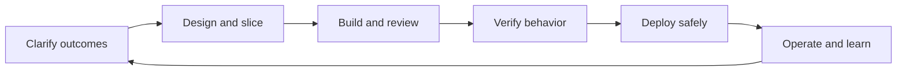

Software delivery is not a ceremony checklist; it is a feedback system for turning uncertain ideas into working, maintainable software. Interviews look for whether you can choose the right process, make uncertainty visible, and influence scope without hiding behind process jargon.

## Delivery Models and Trade-offs

The software development life cycle is the path from problem discovery to maintenance. The phases are familiar: requirements, design, implementation, verification, release, operation, and learning from production. The model you choose changes how much feedback you get before money, time, or trust has already been spent.



| Model | Best fit | Strength | Failure mode |
|---|---|---|---|
| Waterfall | Regulated or fixed contract work with stable requirements | Clear phase gates and traceability | Late feedback reveals the wrong product |
| V-model | Safety critical systems with formal verification | Tests are planned against requirements early | Heavy process can slow ordinary product learning |
| Iterative | Uncertain product areas needing regular feedback | Learning each cycle changes the next cycle | Iterations become mini waterfalls if feedback is ignored |
| Scrum | Product teams with a backlog and sprint cadence | Predictable planning and inspect and adapt loops | Ceremony theatre without real scope control |
| Kanban | Support, platform, operations, interrupt driven work | Flow is visible and WIP is controlled | Becomes an unprioritized ticket conveyor |
| Hybrid | Large organizations coordinating multiple teams | Gives shared milestones and language | Adds overhead without improving decisions |

> [!KEY]
> A senior answer does not claim one model is best. It names the uncertainty, risk, regulation, team size, and feedback latency, then chooses the lightest process that manages those forces.

## Scrum Kanban and Flow

Scrum works when the team can plan a short horizon, protect focus for a sprint, and produce a potentially shippable increment. The useful pieces are sprint planning, a visible sprint backlog, a daily blocker check, a review with stakeholders, and a retrospective with one or two concrete process changes. The failure mode is pretending a sprint is a contract: mid-sprint scope grows, unfinished work is carried forward, and velocity becomes a pressure tool.

Kanban starts from the work as it actually flows. It visualizes states, limits work in progress, measures cycle time, and improves the bottleneck. It fits operations and platform teams because urgent work arrives continuously. Its failure mode is weak priority discipline: if everything can enter the board, the board becomes a queue of aging promises.

| Concept | Meaning | Interview signal |
|---|---|---|
| WIP limit | Maximum items allowed in a state | Prevents starting work faster than finishing work |
| Cycle time | Start of active work to done | Shows delivery predictability for the team |
| Lead time | Request arrival to delivery | Shows customer wait time |
| Throughput | Items finished per time period | Supports forecasting without arguing about points |
| Blocked time | Time waiting for people, environments, or decisions | Reveals systemic friction, not individual laziness |

> [!WARNING]
> Agile ceremonies go wrong when they become status reporting upward instead of decision making by the team. A daily standup that never removes blockers is not agile; it is a meeting tax.

## Backlog Readiness and Done

Backlog refinement is where ambiguity is turned into negotiable, small, testable work. A good refinement conversation clarifies the outcome, slices the story vertically, identifies dependencies, and records acceptance criteria. It should reduce risk before sprint planning, not become a second planning meeting where the team commits early.

Definition of Ready means the team can start without guessing. Definition of Done means the work is actually releasable, supportable, and safe to operate. Both are agreements, not bureaucracy. They protect the team from sprinting on fog and protect stakeholders from being shown code that is technically merged but not genuinely usable.

```text
Story template
Role: support agent
Need: filter refund requests by payment method
Value: resolve high risk cases faster
Acceptance: filters combine with existing status filters
Ready: dependency on payments API confirmed
Done: tests pass, telemetry added, rollout flag removed or scheduled
```

| Agreement | Typical contents | What it prevents |
|---|---|---|
| Definition of Ready | Clear outcome, acceptance criteria, dependencies, size, design questions answered | Mid-sprint discovery and hidden blockers |
| Definition of Done | Reviewed code, tests, docs, observability, rollout and support notes | Half-done work counted as shipped |
| Acceptance criteria | User visible behavior and edge cases | Debates after implementation about what was intended |
| Backlog refinement | Splitting, sequencing, risk removal, estimation | Sprint planning becoming a discovery workshop |

## Estimation and Forecasting

Estimates are wrong because software work contains discovery. Requirements change, dependencies surprise you, integration exposes missing assumptions, and humans are bad at single point predictions. The right response is not to give up on forecasting; it is to estimate in ranges, shrink uncertainty with spikes, slice work smaller, and continuously recalibrate using completed work.

Story points are relative size, not hours. They work only inside one stable team with reference stories. T-shirt sizing is useful for early portfolio conversations. Cycle time and throughput are often better for mature teams because they use observed flow instead of debated complexity.

| Technique | Use it when | Watch out for |
|---|---|---|
| Story points | Sprint teams need relative sizing | Do not compare velocity across teams |
| T-shirt sizes | Epics are too vague for points | Convert to smaller stories before commitment |
| Planning poker | Team knowledge is distributed | Anchoring happens if someone speaks first |
| Spikes | Unknown technology or integration risk dominates | Timebox and produce a decision, not production code |
| Cycle time forecast | Work items are similar and flow is stable | Large un-sliced items destroy predictability |

> [!TIP]
> When asked for a date, answer with confidence and assumptions: "with current scope and no new dependency delays, this is probably two to three sprints; after the API spike we can narrow that range."
## Design Decisions and Delivery Artefacts

Design docs, RFCs, and architecture decision records are delivery artefacts because they make decisions reviewable before code becomes expensive to change. A lightweight RFC is enough for cross-team impact, new public contracts, data migrations, or work larger than a few days. It should state the problem, constraints, options, trade-offs, rollout plan, and how the decision will be revisited.

ADRs are smaller and more durable. They capture one decision, its context, the options considered, and consequences. The goal is not consensus forever; it is consent to proceed with risks visible.

```yaml
adr:
  title: Use event driven reconciliation for invoice status
  status: accepted
  context: polling creates load and stale status during close of month
  options:
    - scheduled polling
    - webhook callbacks
    - event stream
  decision: event stream with idempotent consumers
  consequences:
    - higher operational complexity
    - replay supports recovery and audit
  revisit: after first quarter of production metrics
```

A strong technical decision explains what is gained, what is sacrificed, whether the decision is reversible, and what measurement would prove it wrong. That is more persuasive than declaring that one tool or pattern is simply better.

## Scope Influence and Release Safety

Senior engineers influence scope by making trade-offs explicit. They do not silently absorb scope creep, and they do not respond to every new ask with a flat no. They identify the minimum valuable slice, split risky work from routine work, propose feature flags where release timing matters, and translate technical risk into product language.

Feature flags are a delivery practice when they decouple deployment from release. They let the team merge and deploy code while controlling who sees it, then ramp exposure through rings such as internal users, a small percentage, and general availability. The debt is real: every long-lived flag is another branch in the code and needs a sunset date.

Release safety belongs in the delivery conversation, not only in operations. A small PR, green automated checks, a rollout flag, a bake period, and a tested rollback plan reduce the fear that often creates heavyweight process.

| Scope lever | What it sounds like | Why it works |
|---|---|---|
| Slice vertically | Ship search by status before advanced filters | Produces user value without a layer-only deliverable |
| Timebox discovery | Spend two days proving the API path | Converts unknown risk into known work |
| Trade scope for date | Keep launch date by moving reports to next release | Makes the constraint explicit |
| Flag the release | Deploy now, enable for one customer cohort later | Separates engineering completion from market timing |
| Record the decision | Create an ADR or backlog item for accepted debt | Prevents invisible promises and forgotten risk |

Flow metrics are strongest when they lead to system changes. If lead time is long but cycle time is short, work is waiting before anyone starts; improve intake and priority decisions. If cycle time is long and WIP is high, the team is starting too much; lower WIP, finish aging items, and remove blockers. If throughput is unstable, look for interrupt work, unclear stories, or dependency queues rather than accusing engineers of inconsistency.

Agile also fails when the ceremony becomes detached from product choices. A sprint review without real stakeholders is a demo to ourselves. A retrospective without follow-up is group therapy. A planning session that accepts every request is not planning; it is wishful scheduling. The senior move is to use each ceremony to force one decision: what are we starting, what are we stopping, what risk are we reducing, and what evidence changes the plan.

## Cheat sheet

- SDLC phases are not controversial; the feedback timing between them is what matters.
- Waterfall still fits stable, regulated, contract-heavy work; agile fits discovery and changing product needs.
- Scrum gives cadence and commitment; Kanban gives flow visibility and WIP control.
- Definition of Ready protects sprint focus; Definition of Done protects releasability.
- Estimates should be ranges with assumptions, not fake precision.
- Story points are team-local; cycle time and throughput are better cross-team flow measures.
- Good backlog refinement slices vertically and removes blockers before planning.
- RFCs and ADRs make trade-offs reviewable and decisions recoverable.
- Feature flags are a scope and release safety tool, but stale flags are debt.
- Senior engineers influence scope by offering options, consequences, and measurable trade-offs.

## Common mistakes

| Mistake | Fix |
|---|---|
| Treating sprint commitment as a promise that cannot change | Re-plan when new scope or production interrupts arrive |
| Comparing velocity across teams | Use velocity only within one stable team, and use throughput for broader forecasting |
| Calling a story done when code is merged but not observable or releasable | Put tests, telemetry, docs, and rollout notes in Definition of Done |
| Running retrospectives with no owner or due date for actions | Pick one or two improvements and review them at the next retro |
| Using feature flags without removal dates | Add sunset criteria to the ticket and remove stale branches after rollout |
| Writing RFCs after the decision has already been made | Write before expensive implementation begins |

## Summary

Delivery process is useful only when it shortens feedback loops and makes uncertainty visible. Scrum, Kanban, estimates, definitions, design docs, and release practices are tools for controlling risk, not rituals to perform. A senior engineer uses those tools to keep work small, decisions explicit, and scope negotiable while preserving trust with product and operations.

## Top Interview Questions

### Q1. What are the main SDLC phases, and why do teams still care about them in agile environments?

The common phases are requirements, design, implementation, testing, deployment, and maintenance or operation. Agile teams still care because those activities do not disappear; they become smaller, more iterative, and more connected by feedback. A sprint may contain all phases for a thin slice of value, while a regulated project may require explicit signoff between phases. The interview point is that SDLC is not the opposite of agile. SDLC describes the work that must happen, while agile changes how quickly the team learns whether that work is correct. Good teams keep enough structure to manage risk without delaying feedback until the end.

### Q2. When would you choose Scrum over Kanban?

Choose Scrum when the team has a product backlog, can plan a short horizon, and benefits from a regular cadence for commitment, review, and retrospective. It works well for feature teams that need stakeholder feedback every sprint. Choose Kanban when work arrives continuously or unpredictably, such as support, platform operations, security triage, or maintenance queues. Kanban focuses on visualizing flow, limiting WIP, and reducing cycle time rather than protecting a sprint backlog. The trade-off is that Scrum can become ceremony-heavy, while Kanban can become a ticket conveyor unless prioritization and WIP limits are enforced.

### Q3. What is the difference between Definition of Ready and Definition of Done?

Definition of Ready says a work item is clear enough to start: the outcome is understood, acceptance criteria exist, dependencies are known, and the team can size it with reasonable confidence. It prevents sprint planning from becoming discovery and protects the team from hidden blockers. Definition of Done says the work is genuinely releasable: code reviewed, tests passing, telemetry added, documentation updated if needed, and rollout or support notes handled. Ready is a start gate; Done is an end gate. Both should be lightweight agreements that improve flow, not paperwork that blocks sensible exceptions.

### Q4. Why are estimates often wrong, and how do you handle that honestly?

Estimates are wrong because software work includes discovery: requirements shift, integration reveals unknowns, dependencies slip, and early designs are based on incomplete information. The honest response is to avoid fake precision. Give ranges, state assumptions, and narrow the range as risks are retired. Use spikes for unknown technology, reference stories for relative sizing, and vertical slices to reduce batch size. For a senior answer, separate commitment from forecast: commit to the next safe learning step, forecast the likely delivery window, and update stakeholders when evidence changes rather than waiting until the deadline is already missed.

### Q5. Are story points a measure of productivity?

No. Story points are a team-local estimate of relative effort, complexity, and uncertainty. They can help one stable team forecast how much work it may finish in a sprint, but they are not comparable across teams because each team calibrates differently. Treating points as productivity creates gaming: teams inflate estimates or split work artificially to look faster. If leadership wants delivery health, use flow metrics such as lead time, cycle time, throughput, change failure rate, and blocked time. Points are useful for planning conversations, not for ranking people or teams.

### Q6. How do you run backlog refinement well?

A good refinement session turns fuzzy demand into small, valuable, testable work. Start with the outcome and the user or operational value, then identify dependencies, edge cases, and acceptance criteria. Slice vertically so each story can produce a working increment through the stack rather than a layer-only task. Estimate only after the team understands the shape of the work; if uncertainty dominates, create a timeboxed spike. The goal is not to refine the whole backlog forever. It is to keep enough ready work ahead of the team that sprint planning can focus on selection and sequencing.

### Q7. What belongs in an RFC or design document?

An RFC should include the problem statement, goals and non-goals, constraints, options considered, the proposed design, trade-offs, risks, rollout plan, and observability or success criteria. For cross-team work, it should also identify affected APIs, data contracts, owners, and migration steps. The best RFCs are short enough to review but specific enough to expose the hard decisions before implementation. The review goal is not unanimous agreement on every detail; it is informed consent to proceed, with objections and risks documented. If implementation later diverges materially, revise the RFC or capture an ADR.

### Q8. What is an ADR, and when would you write one?

An architecture decision record captures one significant decision, the context that led to it, the options considered, the chosen option, and the consequences. Write one when a decision will be expensive to reverse, affects multiple teams, changes a public contract, introduces deliberate technical debt, or chooses one trade-off over another in a way future engineers will question. ADRs are intentionally small and durable. They prevent repeated debates months later because the reasoning is visible. A good ADR also states whether the decision is reversible and what signal would trigger revisiting it.

### Q9. Scope grows mid-sprint before an important release. What do you do?

First make the constraint visible: new scope means the team must trade date, quality, or existing scope. Then work with the product owner or decision maker to re-prioritize the combined list. Identify the minimum valuable slice for the release, move lower-value items out, and timebox any discovery needed for risky additions. Do not quietly add the work on top and hope the team absorbs it; that usually creates hidden overtime, defects, and missed commitments. A senior engineer frames options clearly: keep date and reduce scope, keep scope and move date, or add capacity only if ramp-up and coordination costs make that realistic.

### Q10. How do feature flags help delivery, and what is the downside?

Feature flags decouple deployment from release. The team can merge and deploy code safely while keeping behavior disabled, then enable it for internal users, a small percentage, or specific customers. That reduces long-lived branches and gives a fast rollback path for the feature itself: turn the flag off instead of redeploying. The downside is flag debt. Every flag creates conditional behavior that must be tested and understood. If a flag stays at full rollout for weeks, it becomes dead branching logic. Mature teams give flags owners, sunset dates, and cleanup criteria as part of the work.