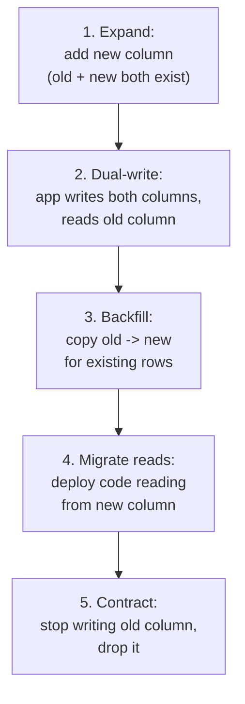
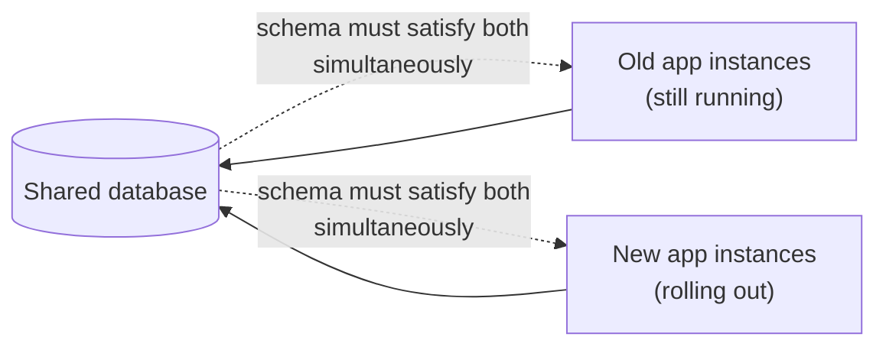

Schema and API evolution questions probe whether you can change a live system's data shape without a maintenance window — the expand-contract pattern is the single idea that answers most of them, so understanding it deeply is worth more than memorising a dozen individual migration recipes.

## The expand-contract pattern

Expand-contract (also called parallel change) splits a schema change into safe, independently-deployable steps so that at every point in time, both the old and new code can run against the database simultaneously. Renaming a column is the canonical example — you can never just rename it, because that's an instantaneous breaking change no rolling deploy can survive.



Walking through a rename of `user.name` to `user.full_name`:

1. **Expand** — add `full_name` as a new nullable column; old code is untouched and still works.
2. **Dual-write** — deploy code that writes to *both* `name` and `full_name` on every insert/update, but still reads from `name`. This version can run alongside the old version during rollout.
3. **Backfill** — copy existing rows' `name` into `full_name` in bounded, throttled batches for rows written before dual-write went live.
4. **Migrate reads** — deploy code that reads `full_name` instead of `name`. Verify correctness in production.
5. **Contract** — once nothing reads or writes `name`, stop writing it, then drop the column in a later, separate deploy.

> [!KEY]
> Every step in expand-contract is individually backward *and* forward compatible — that's what makes it safe under a rolling deploy where old and new instances run side by side for minutes to hours.

## Adding and dropping columns safely

Adding a column is safe only if it doesn't force existing rows into an invalid state. A `NOT NULL` column with no default breaks every existing row instantly on most databases.

| Change | Safe approach |
|---|---|
| Add column | Nullable, or `NOT NULL DEFAULT <value>` — never `NOT NULL` with no default against an existing table |
| Add column that must be required eventually | Add nullable → backfill → add `NOT NULL` constraint as a separate later migration once backfill is confirmed complete |
| Drop column | Stop all reads/writes first (a full deploy cycle), then drop in a separate migration — never in the same deploy that removes the last reader |
| Rename column | Never directly — always expand-contract (add new, dual-write, backfill, migrate reads, drop old) |
| Change column type | Add new column of new type → backfill with conversion → migrate reads/writes → drop old (same shape as a rename) |

```sql
-- Step 1 (expand): safe even on a huge table, no default computation needed
ALTER TABLE users ADD COLUMN full_name VARCHAR(255) NULL;

-- Step 3 (backfill): bounded by primary key, not one giant UPDATE
WITH batch AS (
  SELECT id
  FROM users
  WHERE full_name IS NULL
  ORDER BY id
  LIMIT 1000
)
UPDATE users u
SET full_name = u.name
FROM batch
WHERE u.id = batch.id;
-- Repeat until 0 rows are updated, with a short pause between batches.
```

> [!WARNING]
> A single `UPDATE users SET full_name = name` with no batching on a large table can hold a long-running transaction, bloat the write-ahead log, and block other writers for the duration. Always backfill in bounded batches with a brief pause between them.

## Adding an index without locking

On most databases, a plain `CREATE INDEX` takes a lock that blocks writes for the duration of the build — fine for a small table, unacceptable for one taking live traffic. PostgreSQL's `CREATE INDEX CONCURRENTLY` and MySQL's online DDL (`ALGORITHM=INPLACE`) build the index without holding that exclusive lock, at the cost of taking longer and, in Postgres's case, not running inside a transaction block.

| Approach | Blocks writes | Notes |
|---|---|---|
| `CREATE INDEX` | Yes | Fine for small tables or planned maintenance windows |
| `CREATE INDEX CONCURRENTLY` (Postgres) | No | Slower; can fail and leave an invalid index needing cleanup |
| Online DDL / `pt-online-schema-change` (MySQL) | No | Uses a shadow table + triggers or binlog replay |
| Managed online schema tools (`gh-ost`, Vitess) | No | Purpose-built for large-scale zero-downtime MySQL changes |

## Migrations during a rolling deploy

The crucial constraint of a rolling deploy is that **old and new application code run against the same database schema simultaneously** for the duration of the rollout — every migration has to satisfy both versions at once, not just the version being deployed. This is exactly why expand-contract exists: any single-step change that only one of the two versions can tolerate will cause errors for whichever version is still running the old code.



> [!DANGER]
> "Deploy the code and the migration together" is the classic mistake. If the migration drops a column the old, still-running instances still read, they crash mid-rollout — sometimes only on the specific pods that haven't yet been replaced, making it look like a flaky, intermittent bug.

## Event schema evolution and compatibility modes

Event-driven systems (Kafka, event buses) can't just "deploy a migration" — old events already published and sitting in a topic can't be rewritten, and consumers may be reading events published hours or days ago. Schema registries define compatibility modes that are enforced automatically when a new schema version is registered:

| Mode | Guarantees | What's allowed |
|---|---|---|
| Backward | New schema can read data written with the old schema | Remove a field, add an optional field |
| Forward | Old schema can read data written with the new schema | Add a field, remove an optional field |
| Full | Both backward and forward | Only additive optional fields |
| None | No compatibility check | Anything (unsafe for shared topics) |

`Full` compatibility is the safest default for a topic with many independent consumers you can't coordinate a synchronized deploy with — it constrains changes to additive, optional fields only, which matches the expand-contract philosophy applied to messages instead of tables.

## NoSQL schema-on-read and data backfill

Document stores (MongoDB, DynamoDB) don't enforce a schema at write time, so "evolution" happens at the application layer instead of via `ALTER TABLE`. The common pattern is a **version field** on each document (`{"schemaVersion": 2, ...}`) so the reading code can branch on it and apply the right deserialisation/migration logic per document, since old and new-shaped documents coexist in the same collection until every document is rewritten.

```csharp
// Tolerant reader for a document store with mixed schema versions
public UserDto Deserialize(BsonDocument doc) {
    var version = doc.GetValue("schemaVersion", 1).AsInt32;
    return version switch {
        1 => new UserDto { FullName = doc["name"].AsString },       // old shape
        2 => new UserDto { FullName = doc["fullName"].AsString },   // new shape
        _ => throw new NotSupportedException($"Unknown schema version {version}")
    };
}
```

Backfilling either a relational or document store at scale needs **throttling**: batch size limits, a delay between batches, and monitoring of replication lag and CPU/IO load, backing off automatically if the database shows strain. A background job iterating by primary key range (not `OFFSET`, which gets slower as it scans further in) is the standard safe pattern.

## Rollback of a migration

Every migration should have a tested rollback path *before* it ships, not improvised after a failure. Expand-contract makes rollback natural: rolling back to the previous app version after only the "expand" or "dual-write" step is safe, because the old column is untouched. Rollback becomes hard or impossible only after the **contract** step — once you've dropped a column, there's no code-level revert, only a restore from backup, which is precisely why the drop is deliberately the last, separate, low-risk step.

## Change type reference table

| Change type | Safe procedure |
|---|---|
| Add nullable/defaulted column | Single migration, safe immediately |
| Add required column | Add nullable → backfill → add constraint (3 migrations) |
| Rename column | Expand-contract: add, dual-write, backfill, migrate reads, drop |
| Change column type | Same as rename: new column, convert + backfill, migrate reads, drop old |
| Drop column | Confirm zero reads/writes for a full deploy cycle, then drop separately |
| Add index on large table | Online/concurrent index build, never a blocking `CREATE INDEX` |
| Add required field to an event | Treat as backward-incompatible; version the event type instead |
| Add field to a NoSQL document | Safe; use a schema version field and a tolerant reader |

## Cheat sheet

- Expand-contract: add → dual-write → backfill → migrate reads → drop. Never collapse steps.
- A rolling deploy means old and new code hit the same schema at once — every migration must satisfy both.
- Never add a `NOT NULL` column with no default against a populated table.
- Backfill in bounded, throttled batches — never one unbounded `UPDATE`.
- Build indexes online/concurrently on any table taking live traffic.
- Dropping is always the last, separate step, only after confirming zero remaining readers/writers.
- Event schemas need registry-enforced compatibility modes (backward/forward/full) because old messages can't be rewritten.
- NoSQL "schema-on-read" evolution needs an explicit version field and a tolerant, version-aware reader.
- Rollback is trivial before the contract step, and effectively impossible (backup-only) after a drop.
- Deploying code and a destructive migration in the same release is the most common cause of mid-rollout crashes.

## Common mistakes

| Mistake | Fix |
|---|---|
| Renaming a column directly in one migration | Use expand-contract across multiple deploys |
| Adding `NOT NULL` with no default to a live table | Add nullable, backfill, then add the constraint separately |
| One giant unthrottled `UPDATE` to backfill millions of rows | Batch with `LIMIT`, pause between batches, monitor lag |
| Blocking `CREATE INDEX` on a busy table | Use `CREATE INDEX CONCURRENTLY` or an online DDL tool |
| Dropping a column in the same deploy that stops using it | Wait a full deploy cycle to confirm no old instances still read it |
| Shipping an event schema change with no compatibility mode set | Enforce backward/forward/full compatibility in the schema registry |
| Assuming NoSQL needs no migration discipline because it's schemaless | Version documents explicitly and write tolerant readers |

## Summary

Expand-contract is the pattern that makes schema and API changes safe under continuous deployment: split any change into additive, backward-and-forward-compatible steps, and never collapse them, because a rolling deploy always has old and new code running against the same data simultaneously. Column adds, drops, renames and type changes all reduce to the same five-step shape; indexes need online build tooling on live tables; and event or NoSQL schemas need the equivalent discipline — compatibility modes and version fields — because messages and documents already written can't be rewritten after the fact. Throttled backfills and a tested rollback plan before the "contract" step are what turn this from a risky migration into a routine one.

## Top Interview Questions

### Q1. Walk me through how you would rename a column on a table in a system with zero downtime.

I'd use expand-contract across several separate deploys, never one. First, add the new column (e.g. `full_name`) as nullable — this is a no-op for existing code. Second, deploy application code that writes to both the old and new columns on every insert/update, while still reading from the old one, so this version is safe to run alongside the previous version during rollout. Third, backfill the new column for existing rows in throttled batches, since dual-write only covers rows touched after it went live. Fourth, deploy code that reads from the new column instead, and verify correctness in production. Only after confirming nothing reads or writes the old column anymore would I, in a final separate deploy, drop it. Each step individually is safe for both old and new code to coexist against, which is the whole point given a rolling deploy never has a single instant cutover.

### Q2. Why can't you just add a `NOT NULL` column with no default to a table that already has data?

Because every existing row violates the new constraint the instant it's applied — the database either rejects the migration outright or, on some engines, has to compute and write a value for every existing row as part of the DDL, which can lock the table for a long time on a large dataset. The safe approach is to add the column as nullable (or with a `DEFAULT`), backfill existing rows in batches if a real per-row value is needed rather than a static default, confirm the backfill is complete and application code is writing the field on all new writes, and only then add the `NOT NULL` constraint in a separate, later migration. This turns one risky operation into three safe ones, each independently verifiable before proceeding to the next.

### Q3. What's the crucial constraint that migrations must satisfy during a rolling deployment, and what goes wrong if you ignore it?

The constraint is that old and new versions of the application run against the *same* database schema simultaneously for the duration of the rollout — a migration can't just satisfy the version being deployed, it has to satisfy both versions at once. If you ignore this — for example, deploying code that reads a new column in the same release that drops the old one — the instances still running old code (which haven't been replaced yet) start failing the moment the old column disappears, often manifesting as intermittent errors that only affect some requests, since only some pods have rolled over at any given moment. This is precisely why expand-contract exists: every individual step must be tolerated by both the previous and next version of the application.

### Q4. How do you build an index on a table with continuous live traffic without causing an outage?

A plain `CREATE INDEX` typically takes a lock that blocks writes for the full duration of the index build, which is unacceptable on a table under continuous load. Instead, I'd use the database's online index-building mechanism — `CREATE INDEX CONCURRENTLY` on PostgreSQL, or online DDL / a tool like `gh-ost` or `pt-online-schema-change` on MySQL — which builds the index in the background without holding an exclusive lock, at the cost of taking longer and, for Postgres specifically, requiring extra cleanup if it fails partway (it can leave behind an invalid index that needs to be dropped and retried). For very large tables at scale, purpose-built tools like `gh-ost` use a shadow-table-and-replay approach to make the whole operation close to transparent to live traffic.

### Q5. How would you safely backfill a new column across a table with hundreds of millions of rows?

I would never run a single unbounded `UPDATE` — on a table that size it would hold a long transaction, generate a huge amount of write-ahead log / binlog, and likely cause replication lag or lock contention that affects live traffic. Instead I'd write a background job that processes rows in bounded batches (say 1,000–10,000 rows per batch), iterating by primary key range rather than `OFFSET` (which gets progressively slower as it scans further into the table), with a short pause between batches. I'd also monitor database load and replication lag while it runs and have the job back off or pause automatically if those metrics degrade, rather than running it at full speed unconditionally. This trades total wall-clock time for safety, which is almost always the right trade for a backfill against a live production database.

### Q6. What are backward, forward and full compatibility modes for an event schema, and why do event schemas need this more than a typical API?

Backward compatibility means a consumer using the new schema can still correctly read events published under the old schema. Forward compatibility means a consumer still running the old schema can read events published under the new schema, typically by ignoring unrecognised new fields. Full compatibility requires both simultaneously, which in practice restricts changes to adding optional fields only. Event schemas need this more rigorously than a typical synchronous API because events already published to a topic can't be edited or unpublished — a consumer might process a message minutes, days, or (on replay) years after it was written, so you can't assume "everyone will have redeployed by the time this event is read" the way you sometimes can with an API. A schema registry enforces the chosen mode automatically, rejecting a new schema version that would violate it.

### Q7. How does schema evolution work in a NoSQL document store that doesn't enforce a schema at write time?

Because the database itself won't stop you from writing documents with different shapes into the same collection, the discipline has to move into the application layer. The standard approach is to include an explicit version field on every document (e.g. `schemaVersion: 2`), incremented whenever the document shape changes meaningfully, and to write a "tolerant reader" in the application that branches on that version to correctly deserialise both old- and new-shaped documents — since old documents won't be rewritten just because the application changed. Optionally, a background job can lazily rewrite documents to the latest shape on read/write, or a batch job can backfill them over time, but the reader always has to tolerate documents that haven't been migrated yet, potentially indefinitely for rarely-touched historical data.

### Q8. Your team dropped a column and now production is throwing errors. What happened and how do you recover?

Almost certainly, some code path — either an old, not-yet-replaced application instance, a background job, a reporting query, or a downstream service — was still reading or writing that column when it was dropped, meaning the expand-contract discipline was skipped or a step was collapsed. Immediate recovery depends on how far gone it is: if this was caught quickly and the database supports it, restoring the column from a recent backup or a database-level undo (some cloud databases keep point-in-time recovery) can restore it, though any writes made after the drop to related data may need reconciling. The real fix going forward is process, not code: never drop a column in the same deploy that stops using it, always confirm via logging/telemetry that nothing reads or writes it for a full deploy cycle first, and treat "drop" as a separate, deliberately delayed and reversible-only-by-backup step.

### Q9. When would you choose `Full` compatibility mode for an event schema over `Backward` or `Forward` alone, and what does it cost you?

I'd choose `Full` compatibility for any topic with many independent consumers I can't coordinate a synchronized deployment with — for example, a domain event published across team boundaries where I don't control every consumer's release schedule. `Full` guarantees that consumers on either the old or new schema version can read data written under either version, which is the safest possible position when you can't guarantee everyone upgrades in lockstep. The cost is that it restricts every future change to purely additive, optional fields — you effectively give up the ability to ever remove or rename a field on that event type without introducing a new event type entirely, which is a real constraint on the event's long-term design and needs to be understood upfront, not discovered after the fact.

### Q10. How do you change a column's data type (say, from `int` to `bigint`, or `string` to a structured type) with no downtime?

I'd treat it the same shape as a rename, because a type change has the same "can't be done atomically without breaking one side" problem. Add a new column of the target type, deploy code that writes to both the old and new columns (converting as needed on write), backfill existing rows by converting the old value into the new column in throttled batches, deploy code that reads from the new column and verify correctness, and only then drop the old column in a separate final step. For something like `int` to `bigint` specifically, some databases can do a type change online without this whole dance if the table is small or the type change is provably widening and non-locking — but for large, actively-written tables, the expand-contract version is the safe default rather than assuming the database's online DDL will handle it transparently.

### Q11. What would you check before considering a schema migration "done" and safe to roll back on?

Before calling it done, I'd confirm: the migration ran successfully with no errors and the expected row/column state exists; application-level metrics (error rates, latency) are stable post-deploy, not just the migration tool reporting success; and, critically, that a rollback path is still available — meaning I haven't yet executed an irreversible step like a column drop. I'd keep the "old" data path (old column, or dual-write) in place for at least one full deploy cycle and ideally a business cycle (to catch weekly/monthly batch jobs) before considering the change complete enough to remove the old path. Only after that observation window, with telemetry confirming the new path is exclusively in use, would I execute the final, hard-to-reverse cleanup step.

### Q12. Why is "deploy the code and the migration in the same release" considered risky, and what should you do instead?

It's risky because it assumes an atomic, instantaneous cutover from old code to new code, which doesn't exist in a rolling deploy — for some window, old instances are still serving traffic against a database that the same release has already altered for the new code's benefit. If the migration is anything other than purely additive (a rename, a drop, a type change, a new required constraint), the old instances start failing against the new schema during that window. The fix is to decouple schema changes from code changes into separate, ordered deploys: ship additive schema changes ahead of the code that depends on them, and ship removals only after confirming, via a full deploy cycle and telemetry, that no running code depends on the old shape anymore. This is exactly the discipline expand-contract formalises.
