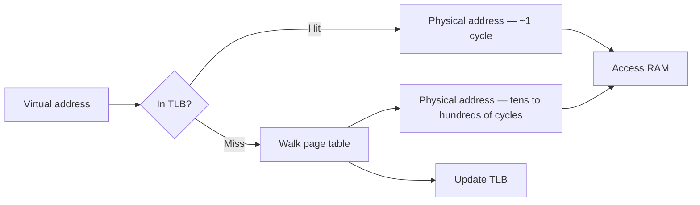

Almost every "why is this slow" or "why did this crash" question at the systems level comes back to memory: how it's addressed, how it's cached, and what happens when you run out of it. This is one of the few topics where a concrete, numeric answer beats a hand-wavy one.

## Why virtual memory exists

Every process sees its own private, contiguous **virtual address space**, translated by hardware into physical RAM addresses. This buys three things: isolation (one process can't read or corrupt another's memory), simplicity (every process can assume it owns address `0` upward, regardless of what's physically free), and the ability to run programs larger than physical RAM by paging parts to disk.

> [!KEY]
> Virtual memory is an indirection layer. The CPU never lets a normal instruction touch a physical address directly — it always goes through translation, which is what makes isolation and overcommit possible.

## Pages, page tables, and the TLB

Physical and virtual memory are divided into fixed-size **pages** (commonly 4KB). A **page table** maps virtual page numbers to physical frame numbers, maintained per-process by the OS and consulted by the CPU's memory management unit (MMU) on every memory access.

Walking a multi-level page table on every access would be far too slow, so the CPU caches recent translations in the **TLB (translation lookaside buffer)** — a small, extremely fast hardware cache. A TLB hit resolves a virtual address in about a cycle; a TLB miss requires a full page-table walk, costing tens to hundreds of cycles.



> [!WARNING]
> Frequent context switches between processes can flush or partially invalidate TLB entries, which is one reason process-level context switches cost more than thread-level ones.

## Page faults: minor vs major

A **page fault** occurs when the CPU tries to access a virtual page that isn't currently mapped to a physical frame. There are two very different kinds.

| Type | What happened | Cost | Handling |
|---|---|---|---|
| Minor (soft) fault | Page exists in memory but isn't yet mapped into this process (e.g. shared library, copy-on-write page) | Microseconds | OS just updates the page table, no disk IO |
| Major (hard) fault | Page must be read from disk (swapped out, or first touch of a memory-mapped file) | Milliseconds | OS issues a disk read, blocks the thread until it completes |

When major faults happen faster than the disk can service them — usually because the working set of active pages exceeds available RAM — the system spends more time paging data in and out than doing useful work. This is **thrashing**, and it's diagnosed by watching disk IO spike alongside CPU utilisation dropping, not rising, because threads are blocked waiting on page-ins rather than running.

## Demand paging, swap, and memory-mapped files

**Demand paging** means pages are loaded lazily, only when first accessed, rather than the whole program being loaded up front — this is why large programs start quickly. **Swap** (or a page file on Windows) is disk space the OS uses to evict rarely used pages from RAM, making room for active ones; this is a safety valve, not free extra RAM — swapped pages are orders of magnitude slower to access than RAM.

**Memory-mapped files** (`mmap`, `MemoryMappedFile` in .NET) let a process treat a file on disk as if it were part of its address space: pages are faulted in from the file on first access, and the OS's normal page cache handles reads/writes transparently. This is how databases and large-file processing tools avoid manually managing buffers — the OS's paging machinery does it for you.

## The memory hierarchy

Every level trades capacity for latency. Concrete numbers make this real in an interview.

| Level | Typical latency | Typical size |
|---|---|---|
| CPU register | < 1 ns | Bytes |
| L1 cache | ~1 ns | 32-64 KB per core |
| L2 cache | ~3-10 ns | 256KB-1MB per core |
| L3 cache | ~10-20 ns | A few MB, shared |
| RAM (DRAM) | ~50-100 ns | GBs |
| SSD | ~10-100 µs | 100s of GBs-TBs |
| HDD | ~1-10 ms | TBs |
| Network round trip (same region) | ~0.5-2 ms | — |

> [!TIP]
> Say the shape of these numbers, not the exact figures: each level is roughly **10-100x** slower than the one above it. RAM vs SSD is already a ~1000x gap; RAM vs a network call is a ~10,000-20,000x gap. This is why locality and avoiding unnecessary remote or disk round trips matter so much on the hottest paths.

## Cache lines and locality of reference

The CPU doesn't fetch single bytes from RAM — it fetches a whole **cache line** at a time (commonly 64 bytes). Code that accesses memory sequentially benefits from every byte the CPU already pulled in; code that jumps around wastes most of each fetched line and causes far more cache misses.

**Worked example — row-major vs column-major traversal.** A 2-D array in C# is stored row-major: `arr[i, j]` and `arr[i, j+1]` are adjacent in memory.

```csharp
int n = 4096;
var arr = new int[n, n];

// Row-major traversal — sequential in memory, cache-friendly
for (int i = 0; i < n; i++)
    for (int j = 0; j < n; j++)
        sum += arr[i, j];

// Column-major traversal — same result, jumps n*4 bytes each step
for (int j = 0; j < n; j++)
    for (int i = 0; i < n; i++)
        sum += arr[i, j];
```

Both loops do exactly `n²` additions — identical Big-O. But the second version jumps `n * sizeof(int)` bytes between consecutive accesses, so almost every access misses the cache and pulls in a whole new 64-byte line for a single 4-byte int it needs. In practice this traversal order difference alone can produce a **5-10x** wall-clock slowdown on a large enough array — a concrete, measurable example of why Big-O doesn't tell the whole story.

## False sharing

Even when two threads touch *different* variables, if those variables happen to sit on the **same cache line**, every write from one core invalidates the line for the other core's cache, forcing a re-fetch — an expensive, invisible form of contention with no logical data race involved.

```csharp
// Two counters likely share a 64-byte cache line — false sharing under concurrent increments
struct Counters { public long CounterA; public long CounterB; }

// Padding pushes each counter onto its own cache line, eliminating false sharing
struct PaddedCounters {
    public long CounterA;
    private long _pad1, _pad2, _pad3, _pad4, _pad5, _pad6, _pad7;
    public long CounterB;
}
```

## Stack vs heap

| Property | Stack | Heap |
|---|---|---|
| Allocation cost | Near-free (pointer bump) | Slower (allocator bookkeeping, possible GC) |
| Lifetime | Bound to the enclosing scope/call frame | Until garbage-collected / explicitly freed |
| Size limit | Fixed per thread (often ~1MB), can overflow | Limited by available (virtual) memory |
| Typical contents | Value types, local variables, return addresses | Reference types, objects that outlive their creating scope |
| Locality | Excellent — contiguous, sequential | Variable — fragmentation hurts locality over time |

## Fragmentation, leaks, and bloat

**Fragmentation** is free memory split into many small, non-contiguous gaps, so even though total free memory is enough, no single gap is large enough for a new allocation — common in long-running processes with mixed allocation sizes. A **memory leak** is memory that's still reachable (so the GC won't collect it) but never actually used again, typically from an unintentionally retained reference (a static event handler, a growing cache with no eviction). **Memory bloat** is different: memory that's genuinely in use, just more than expected — inefficient data structures, oversized buffers, or duplicated data — the GC is doing its job correctly, but the design uses too much memory per unit of work.

## OOM behaviour: containers vs a host

On a bare host, running out of memory typically triggers OS-level swapping first, and only escalates to killing a process (e.g. Linux's OOM killer) once swap is also exhausted, which can degrade the whole machine's responsiveness gradually. In a **container**, there is usually no swap, and a hard memory limit (cgroup limit) is enforced directly — the instant the container's resident memory exceeds its limit, the container runtime kills the process immediately (`OOMKilled`), with no gradual degradation and no grace period. This is why a .NET service can run fine locally (host, with swap available as a buffer) and get killed repeatedly in Kubernetes (hard cgroup limit, no swap) — the fix is to set the GC's memory limit (`DOTNET_GCHeapHardLimit` or container-aware GC, on by default in modern .NET) below the container limit, not above it.

> [!DANGER]
> Setting a container memory limit without leaving headroom for the .NET GC's own overhead (and other process memory like thread stacks) is a common cause of unpredictable `OOMKilled` restarts, even when heap usage looks "fine" in application metrics.

## Cheat sheet

- Virtual memory = every process gets its own address space; the MMU translates virtual to physical on every access.
- TLB caches recent translations — a TLB miss means a full, slow page-table walk.
- Minor fault = re-map an already-resident page (cheap). Major fault = read from disk (expensive, ms-scale).
- Thrashing = spending more time paging than computing; working set exceeds available RAM.
- Memory hierarchy: register < L1 < L2 < L3 < RAM < SSD < disk < network — each step is roughly 10-100x slower.
- Cache lines (~64 bytes) reward sequential access; jumping around wastes most of every fetch.
- Row-major vs column-major traversal is the classic locality example — same Big-O, very different wall-clock time.
- False sharing: unrelated variables on the same cache line cause invisible cross-core contention.
- Leak = unused but still reachable memory. Bloat = memory genuinely used, just more than it should be.
- Containers enforce hard memory limits with no swap — set the runtime's memory limit below the container limit.

## Common mistakes

| Mistake | Fix |
|---|---|
| Assuming Big-O captures real-world speed | Locality of reference can swing wall-clock time by 5-10x at equal complexity |
| Traversing a 2-D array in the "wrong" order for its storage layout | Iterate in the storage order (row-major for C#/C, column-major for Fortran) |
| Padding structs unnecessarily "just in case" | Only pad when profiling shows false sharing on a genuinely hot, concurrently written field |
| Treating swap as free extra RAM | It's a safety valve; heavy swapping is a symptom of thrashing, not a solution |
| Setting a container memory limit with no headroom for GC/runtime overhead | Leave 20-30% headroom, or configure a GC heap limit below the container limit |
| Calling every unused-but-reachable object a "leak" | Distinguish a true leak (unintentional retention) from bloat (inefficient but intentional usage) |

## Summary

Virtual memory gives every process an isolated, contiguous address space, translated to physical RAM by the MMU and cached by the TLB; page faults are the mechanism that makes this lazy, with minor faults being cheap remaps and major faults being expensive disk reads that cause thrashing when overused. The memory hierarchy — registers through network calls — spans roughly five orders of magnitude in latency, and locality of reference (cache-line-friendly access patterns) can matter as much as algorithmic complexity, as the row-major vs column-major example shows. In production, know the difference between a real leak and simple bloat, and remember that containers enforce hard memory limits with no swap safety net, so headroom has to be planned deliberately rather than discovered via `OOMKilled` restarts.

## Top Interview Questions

### Q1. Why does every process get its own virtual address space instead of using physical addresses directly?

Virtual addressing gives isolation — one process cannot accidentally or maliciously read or overwrite another process's memory, because its addresses are meaningless outside its own page table mappings. It also simplifies programming: every process can assume it owns a large, contiguous address space starting near zero, regardless of what physical memory happens to be free or fragmented at that moment. Finally, it enables features that would otherwise be impossible, like running a program larger than physical RAM (via demand paging), copy-on-write forking, and memory-mapped files, all because there's an indirection layer between the addresses code uses and the physical RAM that backs them.

### Q2. What is a TLB, and why does a TLB miss matter for performance?

The TLB (translation lookaside buffer) is a small, very fast hardware cache inside the CPU that stores recent virtual-to-physical address translations, avoiding the need to walk the full, multi-level page table on every single memory access. A TLB hit resolves an address in about a cycle; a TLB miss requires walking the page table hierarchy in memory, costing tens to hundreds of cycles — a significant slowdown when it happens on every access in a hot loop. This is one reason frequent process-level context switches are expensive: switching to a different process's address space can invalidate TLB entries, so the next several memory accesses pay the full page-table-walk cost until the TLB "warms up" again for the new process.

### Q3. What's the difference between a minor and a major page fault?

A minor (or soft) page fault happens when the accessed page isn't currently mapped into the process's page table, but the underlying physical memory is already resident somewhere — for example, a shared library page already loaded for another process, or a copy-on-write page. The OS just updates the page table, and this costs microseconds. A major (or hard) page fault happens when the data genuinely isn't in RAM and must be read from disk — either a swapped-out page or the first touch of a memory-mapped file — which blocks the thread for the disk's latency, typically milliseconds. The practical difference is about three to four orders of magnitude in cost, so a workload with many major faults is fundamentally IO-bound even if it looks like pure computation in the code.

### Q4. What is thrashing, and how would you diagnose it in production?

Thrashing is when a system spends more time paging data in and out of RAM than doing actual useful work, because the combined working set of active processes exceeds available physical memory, forcing constant major page faults. You diagnose it by looking for the specific combination of high disk IO (or high page-fault rate in tools like `vmstat`/Performance Monitor) alongside *low* CPU utilisation — counterintuitively, CPU usage drops during thrashing because threads spend their time blocked waiting on page-ins rather than running. The fix is either to reduce the working set (fewer concurrent processes, smaller caches, better locality) or add physical RAM; adding more threads or "optimising code" without addressing the memory pressure won't help, since the bottleneck is disk, not CPU.

### Q5. Why can two loops with identical Big-O complexity have very different real-world performance?

Big-O counts operations, not memory access cost, and memory access cost varies enormously depending on locality of reference. The classic example is traversing a large 2-D array: iterating in the array's storage order (row-major in C#) accesses memory sequentially, so the CPU's cache-line prefetching keeps almost every access a cache hit. Iterating in the opposite order does the exact same number of arithmetic operations, but jumps a full row's width in memory on every step, missing the cache almost every time and forcing a slow RAM fetch per element. Both loops are `O(n²)`, but the cache-unfriendly version can be 5-10x slower in wall-clock time — a concrete demonstration that Big-O describes growth rate, not absolute speed.

### Q6. What is false sharing and how would you detect and fix it?

False sharing happens when two threads modify logically unrelated variables that happen to be laid out on the same CPU cache line (typically 64 bytes); every write from one core invalidates that cache line for every other core caching it, forcing a re-fetch even though there's no actual data race. It shows up as unexplained contention and poor scaling in concurrent counters or per-thread statistics structures, visible via a profiler showing high cache-miss rates on writes that shouldn't logically conflict. The fix is padding — inserting unused fields between the hot fields so each one lands on its own cache line — or restructuring data so each thread's frequently written state is naturally isolated, such as per-thread accumulator arrays that are only combined at the end.

### Q7. What's the difference between a memory leak and memory bloat, and why does the distinction matter?

A memory leak is memory that is still reachable from a GC root — so the garbage collector correctly refuses to free it — but will never actually be used again, usually because of an unintentional retained reference: a static event handler that's never unsubscribed, or a cache that grows without any eviction policy. Memory bloat is different: the memory genuinely is in active use, the GC is working correctly, but the design simply consumes more memory per unit of work than it should — oversized buffers, inefficient data structures, or unnecessary duplication. The distinction matters for the fix: a leak requires finding and breaking the unintended reference chain (a heap snapshot diff is the standard tool), while bloat requires redesigning the data structures or algorithm, not chasing a "leak" that isn't there.

### Q8. A .NET service runs fine locally but keeps getting killed with OOMKilled in Kubernetes. What's going on?

On a local host there's usually swap space acting as a buffer, so memory pressure degrades gradually — the OS starts swapping before anything is forcibly killed. A Kubernetes pod typically has no swap and a hard cgroup memory limit; the instant resident memory (including the .NET heap, thread stacks, and native allocations, not just "managed heap used") crosses that limit, the container runtime kills the process immediately with no warning. I'd check whether the container-aware GC is configured with headroom below the pod's memory limit (modern .NET is container-aware by default, but the limit still needs margin for stack space and native overhead), reduce the pod's actual working set, or raise the limit — and I'd look at whether Gen 2/LOH growth or an unbounded cache is the underlying driver rather than treating the symptom.

### Q9. How do memory-mapped files work, and why would you use one instead of reading a file normally?

A memory-mapped file maps a region of a file directly into a process's virtual address space; pages are lazily faulted in from disk on first access rather than the whole file being read up front, and the OS's existing page-cache machinery handles caching, eviction, and (for writable mappings) eventually flushing dirty pages back to disk. This avoids an explicit read-into-buffer step and lets you treat a multi-gigabyte file as if it were a giant in-memory array, with the OS managing what's actually resident based on real access patterns — useful for large log processing, databases, or any workload that only touches a fraction of a huge file at a time. The trade-off is less explicit control over exactly when IO happens, and page faults on first touch can introduce latency spikes that a pre-buffered sequential read wouldn't have.

### Q10. Why is stack allocation faster than heap allocation, and when does that difference actually matter?

Stack allocation is essentially a pointer bump: the thread's stack pointer moves down by the size needed, and deallocation on return is just moving it back — no bookkeeping, no fragmentation concerns, and excellent cache locality since a call frame is contiguous. Heap allocation requires the allocator to find a suitably sized free block (or ask the OS for more memory), track that allocation for later collection or freeing, and in a managed runtime potentially trigger a GC pass — all real, measurable overhead compared to a pointer bump. This difference matters most in tight, hot loops doing many small, short-lived allocations — value types and `Span<T>`/`stackalloc` in C# exist specifically to keep such data on the stack — but for typical request-scoped objects with normal lifetimes, the difference is rarely worth manually engineering around, since the GC is well-tuned for that common case.
