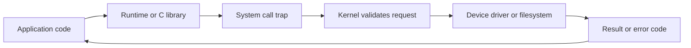

Operating systems questions are usually practical: what happens when an application asks the kernel for work, why an apparently simple file or socket call blocks, and how containers are built from ordinary kernel primitives. The key is connecting those primitives to production symptoms such as stuck syscalls, descriptor leaks and container limits.

## Kernel Boundary and System Calls

Applications run in user mode, where direct hardware access is forbidden. The kernel runs in privileged mode and owns CPU scheduling, device drivers, filesystems, networking, memory mappings, and permission checks. A system call is the controlled transition from user code into the kernel to request work such as `open`, `read`, `write`, `send`, `recv`, `fork`, `mmap`, or `epoll_wait`.


The image shows an application layer in user mode crossing the system call boundary into kernel mode, where CPU, memory, and I/O devices are mediated by the kernel.

| Operation | User mode view | Kernel work |
|---|---|---|
| Open a file | Receive an integer descriptor or handle | Resolve path, check permissions, create open file table entry |
| Read from socket | Receive bytes or a would block result | Copy or map buffers, check readiness, maybe sleep caller |
| Start process | Child appears with its own resources | Create process table entry, address space, descriptors, credentials |
| Map memory | Region appears in address space | Install mapping and defer page loading until touched |



> [!KEY]
> The kernel boundary is a protection boundary. A syscall is not just a function call; it changes privilege, validates arguments, may block, and returns errors your application must handle.

## Process Resources and Memory Image

A running process is more than code and CPU state. It has credentials, environment variables, a current working directory, signal handlers, open file descriptors, mapped memory regions, and limits. The process memory image is where code, literals, static data, heap, and stack live; the kernel records and protects the mappings, while descriptors and sockets are kernel-managed resources referenced by small integers.


This image depicts the memory layout of a process rather than a thread diagram: executable instructions, read-only literals, static data, dynamic heap, and stack. It is useful context for where user code lives while descriptors and device access remain mediated by the kernel.

| Resource | Owned by | Production symptom when exhausted or misused |
|---|---|---|
| File descriptors | Kernel per process tables | `too many open files`, failed accepts, log writes fail |
| Address mappings | Kernel memory manager | `mmap` failures, high resident memory, container kills |
| Credentials | Kernel security model | permission denied, unexpected privilege escalation risk |
| Signal dispositions | Process state with kernel delivery | app ignores graceful shutdown or dies abruptly |
| Current directory | Process metadata | relative paths work locally and fail as a service |

## Filesystems Inodes and Descriptors

A Unix directory maps names to inode numbers. The inode stores metadata such as owner, permissions, timestamps, link count, and pointers or extents to data blocks. Opening a file creates an open file description in the kernel and returns a file descriptor in the process. Descriptors are not just regular files; sockets, pipes, terminals, and many devices are descriptor-backed too.

The page cache is the kernel's RAM cache for file data. A `read` may return from cache without touching disk. A `write` may dirty cache pages and return before data is durable. `fsync` requests durability, but it is expensive because the kernel and storage device must flush buffered state.

| Concept | What to say in an interview | Common gotcha |
|---|---|---|
| Inode | Metadata record behind one or more names | Deleting a name does not free data while a descriptor remains open |
| File descriptor | Per-process integer referring to an open resource | Leaking sockets consumes the same limit as leaking files |
| Page cache | Kernel cache of file contents | Free memory may look low because Linux uses RAM for cache |
| Hard link | Another directory entry for the same inode | The data remains until link count and open references are gone |
| `fsync` | Force dirty data and metadata to storage | Correct for durability, harmful if called casually per tiny write |

> [!TIP]
> When disk usage looks wrong after deleting a large log, check for a still-open descriptor. The filename is gone, but the inode cannot be reclaimed until the process closes it.

## I/O Models and Zero Copy

Blocking I/O parks the calling thread until data is ready or the operation completes. Non-blocking I/O returns immediately with a would-block indication, leaving the application to try later. I/O multiplexing lets one thread wait for readiness across many descriptors. `select` and `poll` scan sets of descriptors; `epoll` registers interest once and returns ready events, which scales better for many mostly idle connections. By default `epoll` is level-triggered (it keeps reporting a descriptor while it remains ready); edge-triggered mode reports only readiness transitions, so handlers must drain reads/writes until `EAGAIN` or risk missing work. Completion-based async I/O reports when the operation has completed, letting a small number of worker threads handle many in-flight operations.


The image contrasts not concurrent, concurrent but not parallel, parallel without concurrency, and concurrent parallel execution. For I/O design, the point is that concurrency is often about handling many waits, while parallelism is about using multiple cores for actual CPU work.

Zero-copy reduces transfers between kernel and user memory. A classic path is `sendfile`, where the kernel sends bytes from the page cache to a socket without copying them into an application buffer first. It matters for static file servers, proxies, streaming, and log shipping because memory copies and cache pollution become visible at high throughput.

```bash
strace -f -e trace=openat,read,write,sendfile,epoll_wait -p 4242
lsof -p 4242 | head
cat /proc/4242/limits
```
## Interrupts Signals and IPC

Interrupts are how hardware or timers get the CPU's attention. A network card interrupt may indicate packets arrived; a timer interrupt lets the scheduler regain control; a page fault trap tells the kernel user code touched an address that needs attention. Handling an interrupt or trap has overhead, and a full context switch can add cache disruption on top. The practical interview answer is not to quote one universal cost but to explain why too many wakeups, syscalls, runnable threads, or tiny I/O operations amplify latency.

Signals are asynchronous notifications delivered to a process. `SIGTERM` requests graceful shutdown, `SIGINT` is the interactive interrupt, `SIGHUP` often means reload, and `SIGKILL` cannot be caught. A production service should stop accepting new work on `SIGTERM`, drain in-flight work, flush telemetry, and exit before the orchestrator escalates.

| IPC mechanism | Best for | Trade-off |
|---|---|---|
| Anonymous pipe | Parent and child streaming | Simple and one-directional by default |
| Named pipe | Local service communication | File-like but machine-local |
| Shared memory | Large same-host data exchange | Fastest data path, needs synchronization |
| Unix or TCP socket | Local or networked client server | Flexible, has protocol and copying overhead |
| Message queue | Buffered producer consumer | Decouples timing, adds queue management |
| Signal | Tiny asynchronous notification | No rich payload and tricky handler rules |

> [!WARNING]
> Signals are not a replacement for normal application protocols. Use them for lifecycle and notifications, not for sending business data.

## Containers on Kernel Primitives

Containers are not tiny virtual machines. They are processes using kernel isolation and accounting features. Namespaces change what a process can see: PID namespace for process trees, mount namespace for filesystems, network namespace for interfaces and routes, IPC namespace for shared memory resources, UTS namespace for hostnames, and user namespace for identity mapping. Cgroups limit and account for resources such as CPU, memory, process count, and I/O.

A container with a one CPU quota does not get more compute because the app creates fifty worker threads. A container with a hard memory limit can be killed when resident memory crosses the cgroup limit, even if the runtime hoped to recover later. PID 1 inside a container has special responsibilities too: if it starts child processes and never reaps them, zombies accumulate.

| Primitive | What it provides | Interview example |
|---|---|---|
| PID namespace | Isolated process numbering | App sees itself as PID 1 |
| Network namespace | Separate interfaces and port space | Two containers can both bind port 8080 |
| Mount namespace | Separate filesystem view | Container root differs from host root |
| Cgroup CPU quota | CPU time ceiling | Throttling causes p99 latency spikes |
| Cgroup memory limit | Hard memory ceiling | Exceeding limit can trigger OOM kill |
| Seccomp capabilities | Syscall and privilege restriction | Container can be blocked from mounting filesystems |

Readiness and completion are different ideas. Readiness APIs tell you an operation can make progress without blocking right now; completion APIs tell you the operation has already finished. That distinction explains why event loops must handle partial reads and writes, and why a socket may be writable while the peer or downstream system is still slow. Production systems need backpressure so readiness does not become an invitation to buffer unlimited work in user space.

The page cache also changes how to interpret metrics. A fast second read does not prove the disk is fast; it may prove the file is hot in memory. A successful `write` does not prove durability; it may prove the kernel accepted dirty pages. Databases, write ahead logs, and queues care about when bytes are durable, which is why they treat flush policies as correctness choices, not mere performance tuning.

## Cheat sheet

- User mode is restricted; kernel mode is privileged and mediates hardware, files, network, and memory mappings.
- System calls cross a protection boundary, validate inputs, may block, and return explicit errors.
- A process owns descriptors, credentials, environment, signal handlers, mappings, and limits.
- Inodes store file metadata; directory entries map human names to inodes.
- File descriptors cover files, sockets, pipes, terminals, and devices.
- The page cache makes file I/O fast but means writes are not durable until flushed.
- Blocking I/O ties up a thread; readiness APIs such as `epoll` let one thread manage many descriptors.
- Zero-copy avoids moving bytes through user space when the kernel can connect file cache and socket paths.
- Signals are lifecycle notifications; `SIGTERM` should be graceful and `SIGKILL` is final.
- Containers combine namespaces for isolation with cgroups for enforced resource limits.

## Common mistakes

| Mistake | Fix |
|---|---|
| Treating a syscall like an ordinary cheap function call | Batch small operations and handle blocking and errors explicitly |
| Assuming deleted files free disk immediately | Check for open descriptors with `lsof` when space is still held |
| Raising file descriptor limits without fixing leaks | Inspect socket and file lifecycle, then set realistic limits |
| Using `SIGKILL` as the first shutdown mechanism | Send `SIGTERM`, allow draining, then escalate only after a grace period |
| Believing containers virtualize a whole kernel | Remember they are isolated processes sharing the host kernel |
| Adding threads to fix CPU throttling | Right-size cgroup quota and reduce runnable work instead |

## Summary

The operating system boundary explains many production failures that application logs only hint at. System calls move work into the kernel, descriptors connect processes to files and sockets, the page cache hides and batches storage cost, and I/O models decide whether threads wait or events do. Containers reuse the same primitives with namespaces for isolation and cgroups for limits, so senior engineers debug them by reasoning about ordinary kernel behavior first.

## Top Interview Questions

### Q1. What is the difference between user mode and kernel mode?

User mode is where ordinary application code runs with restricted privileges. It cannot directly program devices, alter page tables, or access arbitrary memory. Kernel mode is privileged execution used by the OS kernel and drivers to manage CPU scheduling, memory mappings, filesystems, devices, and networking. Applications request kernel work through system calls such as `read`, `write`, `open`, and `send`. The distinction matters because it protects the system: a bad pointer in user code can crash the process, while a kernel bug can crash the machine. It also matters for performance because crossing the boundary has overhead and may block.

### Q2. What happens when a process opens a file?

The application calls a library function that issues an `open` style system call. The kernel resolves the path through directories, checks permissions against the process credentials, locates the inode or creates it if requested, creates an open file description with flags and current offset, then places a descriptor in the process descriptor table. The process receives a small integer, not the file data itself. Later `read`, `write`, `fsync`, or `close` calls use that descriptor. This model explains why descriptors can leak, why deleting a file does not free space while it remains open, and why sockets and pipes also consume descriptor limits.

### Q3. What is an inode, and why is it useful to understand?

An inode is the filesystem metadata record behind a Unix file. It stores ownership, permissions, timestamps, link count, size, and references to the data blocks or extents. A directory maps a human-readable name to an inode number; the name is not the file's identity. This matters operationally. A hard link creates another name for the same inode. Removing one name only decrements the link count. If a process still has the file open, the data remains allocated until that descriptor closes. Understanding inodes helps diagnose disk space that remains used after log deletion and explains why permissions live on the file object rather than only on the path.

### Q4. Compare blocking, non-blocking, multiplexed, and async I/O.

Blocking I/O keeps the caller thread asleep until the operation can make progress or completes. Non-blocking I/O returns immediately if it would block, usually with an error code such as would block, so the application must retry later. Multiplexing lets one thread wait for readiness on many descriptors using APIs such as `select`, `poll`, or `epoll`; it is common for high-concurrency network servers. Async completion models let the app submit work and receive a completion notification later. The key trade-off is simplicity versus scalability. Blocking code is easiest, but evented and async models avoid one parked thread per idle connection.

### Q5. Why does `epoll` scale better than `select` for many sockets?

`select` requires the caller to pass descriptor sets into the kernel each time and the kernel effectively scans to find what is ready. It also has historical descriptor count limits on many systems. `poll` removes some limits but still scans a list. `epoll` registers interest in descriptors once, then returns events for descriptors that are ready, avoiding a full rescan of thousands of idle sockets on every wait. It can run in the default level-triggered mode, or edge-triggered mode where readiness transitions are reported once and the app must drain the descriptor until `EAGAIN`. That makes it a better fit for servers with many mostly idle keep-alive connections, but you still need backpressure, timeouts, and careful handling of partial reads and writes.

### Q6. What is zero-copy I/O, and when does it matter?

Zero-copy means data moves between kernel-managed resources without being copied through user-space buffers. A common example is serving a file over a socket with `sendfile`: the file data already in the page cache can be sent to the network stack without first copying it into an application byte array. This reduces CPU cycles, memory bandwidth, and cache pollution. It matters when payloads are large or throughput is high, such as static file servers, reverse proxies, media streaming, and log shipping. It is less important for small business requests where database latency, serialization, or network round trips dominate.

### Q7. What should a service do when it receives `SIGTERM`?

It should treat `SIGTERM` as a graceful shutdown request. First stop accepting new work, for example by failing readiness checks or closing listeners. Then allow in-flight requests or jobs to drain within the allowed grace period, cancel background loops, flush logs and telemetry, close connections cleanly, and exit with a successful or meaningful status. It should not ignore the signal, because orchestrators eventually escalate to `SIGKILL`, which cannot be caught and prevents cleanup. The operational reason is simple: graceful termination protects users from dropped work and protects the platform from slow, unreliable deploys and restarts.

### Q8. How do pipes, shared memory, sockets, and message queues differ as IPC mechanisms?

Pipes are simple byte streams, often between related processes, and are great for shell-style producer to consumer flow. Shared memory maps the same memory into multiple processes, making it the fastest for large local data, but it requires explicit synchronization to avoid races. Sockets provide a bidirectional endpoint that can be local or networked, which makes them the general client-server choice. Message queues buffer discrete messages so producers and consumers do not need to run at the same time. The senior answer chooses based on data volume, locality, failure isolation, ordering needs, and whether backpressure should be built into the mechanism.

### Q9. How do containers use namespaces and cgroups?

Namespaces limit what a process can see. A PID namespace gives a separate process tree, a network namespace gives separate interfaces and port space, a mount namespace gives a separate filesystem view, and user namespaces can map identities. Cgroups limit and account for resources such as CPU, memory, process count, and I/O. Together they make a container look isolated while it still shares the host kernel. This is why a container is not a full VM: kernel behavior, syscalls, and many limits are still host kernel behavior. Production debugging should check cgroup throttling, memory limits, and namespace views instead of assuming hardware changed.

### Q10. A Linux service reports `too many open files`. What do you check?

First identify whether the process hit its per-process descriptor limit or the host hit a global limit. Check the process limits, count open descriptors, and inspect what they are: sockets, regular files, pipes, or deleted files. If most entries are sockets, look for connection leaks, missing timeouts, or excessive outbound fan-out. If they are files, check whether streams are closed and whether log rotation keeps descriptors open. Raising the limit may be necessary for a high-throughput service, but it is not the first fix. A larger limit only delays failure if the application is leaking descriptors.