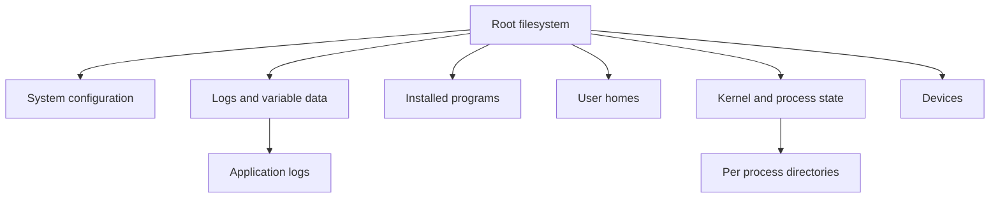

Linux interview questions are rarely about memorizing every flag. They test whether you can SSH into a misbehaving machine, gather evidence safely, and use small composable tools to understand processes, files, networks, storage, and services.

## Filesystem and Permissions

Start with the shape of the system. Linux has a single tree rooted at `/`; mounted disks, pseudo filesystems, and application directories all appear somewhere in that tree. `/etc` holds system configuration, `/var` holds changing runtime data such as logs and spool files, `/usr` holds most installed userland programs, `/opt` often holds vendor software, `/proc` exposes process and kernel state, and `/dev` exposes device files.



| Path | What to inspect | Typical reason |
|---|---|---|
| `/etc` | service config, environment files, system defaults | App starts with wrong settings |
| `/var/log` | logs from system and services | Incident timeline and errors |
| `/proc` | live process and kernel pseudo files | Runtime truth without app instrumentation |
| `/dev` | device files | Disk, terminal, or container device issues |
| `/home` | user-owned files | Manual scripts, keys, or local state |
| `/opt` | third-party app installs | Vendor service layout |

Permissions have three classes: owner, group, and others. Each can have read, write, and execute bits. On directories, execute means traverse. `chmod` changes mode, `chown` changes owner, and `chgrp` changes group.

| Mode | Meaning | Common use |
|---|---|---|
| `600` | owner read and write only | private keys and secrets |
| `644` | owner write, everyone read | regular config or source files |
| `750` | owner full, group read and execute | private service directories |
| `755` | owner full, everyone read and execute | binaries, scripts, directories |
| setuid | run executable with owner privileges | rare, must be audited carefully |
| `umask` | default permissions mask for new files | prevents files being created too open |

> [!WARNING]
> `chmod 777` is usually not a fix. It hides ownership and deployment mistakes by making a file writable by everyone.

## Processes Services and Job Control

A process has a PID, parent PID, user, command line, open descriptors, environment, memory, and scheduling state. `ps` gives a snapshot; `top` and `htop` update continuously. Job control is shell-local: `Ctrl+Z` stops a foreground job, `bg` resumes it in the background, `fg` brings it back, and `jobs` lists jobs for the current shell.

```bash
ps -eo pid,ppid,user,stat,pcpu,pmem,comm --sort=-pcpu | head
ps aux | grep '[j]ava'
top
htop
jobs
fg %1
bg %1
```

Services are usually managed by systemd. `systemctl status` shows state, recent logs, and the unit file path. `journalctl` reads logs in the systemd journal. Prefer restarting through systemd so dependencies, limits, environment, and restart policies are respected.

```bash
systemctl status payment-api
systemctl cat payment-api
journalctl -u payment-api --since "30 minutes ago"
systemctl restart payment-api
```

> [!TIP]
> Try graceful action before force. `kill PID` sends `SIGTERM`; `kill -9 PID` sends `SIGKILL` and skips cleanup.
## Pipes Text Tools and Redirection

The command line is powerful because every simple tool reads text, writes text, and composes with pipes. `grep` filters lines, `sed` edits streams, `awk` processes fields, `cut` extracts columns, `sort` orders lines, `uniq` collapses adjacent duplicates, `xargs` builds command arguments, and `find` walks directory trees.

```bash
grep "ERROR" app.log | awk '{print $1, $2, $5}' | sort | uniq -c | sort -nr | head
find /var/log/myapp -name "*.log" -mtime +7 -print
find . -name "*.tmp" -print0 | xargs -0 rm -f
sed 's/old-host/new-host/g' config.sample > config.generated
cut -d',' -f2 users.csv | sort | uniq -c
```

Redirection controls where output goes. `>` overwrites stdout, `>>` appends stdout, `2>` redirects stderr, and `2>&1` merges stderr into stdout. In production, be careful with overwrites and prefer preview commands before destructive operations.

| Tool | Best at | Example question it answers |
|---|---|---|
| `grep` | finding matching lines | Which requests failed with this error code |
| `sed` | simple substitution or deletion | Can I rewrite a config template quickly |
| `awk` | field calculations and summaries | Which IPs produced most 500s |
| `find` | file discovery by name, age, size, owner | What filled the log directory |
| `xargs` | applying commands to many paths | Can I run one safe action per match |

## Packages Schedules and Automation

Package managers install software and track files. Debian and Ubuntu use `apt`; RHEL family systems use `dnf` or older `yum`; SUSE uses `zypper`; Arch uses `pacman`. In interviews, the important skill is knowing that installing tools on a production host may be restricted. Prefer approved images or break-glass procedures rather than casually changing a live server.

```bash
apt list --installed | grep nginx
sudo apt update
sudo apt install tcpdump
sudo dnf install sysstat
rpm -qa | grep openssl
dpkg -l | grep openssl
```

Cron schedules commands by time; systemd timers are the modern alternative with better logging, dependencies, and missed-run handling. Cron has a minimal environment, so use full paths, explicit working directories, and log output.

```bash
crontab -l
crontab -e
systemctl list-timers
systemctl status backup.timer
```

```bash
minute hour day-of-month month day-of-week command
15 2 * * * /usr/bin/find /var/log/myapp -name "*.log" -mtime +14 -delete >> /var/log/myapp/cleanup.log 2>&1
```

> [!NOTE]
> A command that works interactively can fail in cron because `PATH`, environment variables, shell startup files, and the working directory differ.

## Production Triage Playbook

When you are SSHed into a box that is misbehaving, avoid random restarts. Build a quick timeline, identify whether the bottleneck is CPU, memory, disk, network, configuration, or dependency, and change one thing only after gathering enough evidence.

```bash
hostnamectl
uptime
date
who
systemctl --failed
journalctl -p warning --since "15 minutes ago"
top
ps -eo pid,stat,pcpu,pmem,comm --sort=-pcpu | head
free -m
df -h
du -xh /var/log | sort -h | tail
ss -tulpen
lsof -p 4242 | head
curl -fsS http://127.0.0.1:8080/health
dig internal.service.local
```

| Symptom | First commands | What you are testing |
|---|---|---|
| High CPU | `top`, `ps`, `pidstat` | Hot process or many runnable tasks |
| Memory pressure | `free -m`, `ps`, `/proc/PID/status` | RSS growth, swap, OOM risk |
| Disk full | `df -h`, `du -xh`, `lsof +L1` | Full filesystem or deleted open files |
| Port not listening | `ss -tulpen`, `systemctl status` | Service bind failure or crash |
| HTTP failing | `curl -v`, `journalctl`, `dig` | Local app, DNS, TLS, or upstream issue |
| Slow I/O | `iostat -xz 1`, `vmstat 1` | Disk saturation or system wait time |
## Network Storage and Kernel Clues

Network debugging starts local, then moves outward. Check that the process is listening, the local health endpoint responds, DNS resolves, and connections leave the host. `ss` is the modern socket tool; `netstat` appears in older environments. `tcpdump` captures packets when application logs are not enough, but use filters to avoid drowning in data.

```bash
ss -tanp | head
ss -tulpen | grep 8080
netstat -tulnp | grep 8080
curl -v http://127.0.0.1:8080/health
dig internal.service.local
tcpdump -i eth0 host 10.0.0.5 and port 443
```

`strace` shows system calls and is invaluable when a process hangs on files, DNS, sockets, or permissions. `/proc` gives live kernel-backed facts: command line, environment, limits, mounts, file descriptors, and memory status.

```bash
strace -f -p 4242 -e trace=network,openat,read,write
ls -l /proc/4242/fd | head
cat /proc/4242/limits
cat /proc/4242/status
cat /proc/meminfo | head
vmstat 1
iostat -xz 1
```

Resource limits deserve their own mention because "too many open files" is one of the most common production failures and almost nobody diagnoses it first. Every process inherits soft and hard limits from its parent; the soft limit is what actually bites and can be raised up to the hard limit without privileges. `ulimit -n` shows the open-file-descriptor limit for your shell, but the number that matters is the one the *service* was started with, which is why you read `/proc/<pid>/limits` rather than trusting your own shell. Under systemd, `ulimit` in a shell profile is irrelevant — the limit comes from `LimitNOFILE` in the unit file.

```bash
ulimit -n                       # soft limit for this shell
ulimit -Hn                      # hard ceiling this shell may raise itself to
grep 'Max open files' /proc/4242/limits   # what the running service actually has
ls /proc/4242/fd | wc -l        # how many it is currently using
systemctl show api --property=LimitNOFILE
```

> [!DANGER]
> A server that starts fine and then begins refusing connections under load, with `EMFILE` or "too many open files" in the log, is almost always leaking file descriptors — usually unclosed sockets or HTTP client instances. Raising the limit hides the leak for a few hours; counting descriptors over time with `ls /proc/<pid>/fd | wc -l` proves it.

> [!KEY]
> The production order is observe, narrow, then act. Restarting first destroys evidence and can turn a diagnosable issue into a recurring mystery.

A useful triage habit is to keep commands read-only until the evidence points to one subsystem. For CPU, look at per-process usage and load average. For memory, compare free memory, swap activity, and the resident set size of the suspect process. For disk, separate capacity with `df` from directory usage with `du`, then check device latency with `iostat`. For network, prove the path in layers: name resolution, local listener, TCP connection, TLS if present, then application response.

When you do need to act, prefer reversible actions. Lower a log level, restart one unhealthy unit through systemd, disable one scheduled job, or move traffic away before editing files by hand. Record what you changed and keep the commands you ran, because the next useful question in an incident review is usually not "who caused this" but "what signal did we miss and what would have made the next response safer".

The interview value is in the order, not just the command names. If `curl` to localhost fails, do not debug DNS first. If the process is not listening, do not capture packets. If disk is full, do not chase CPU. State your hypothesis before each command: "I am checking whether the service is alive", "I am checking whether the kernel has a listener", or "I am checking whether storage wait explains latency". That narration shows disciplined operations instead of command dumping safely.

## Cheat sheet

- `/etc` is configuration, `/var` is changing data and logs, `/proc` is live process and kernel state.
- `chmod` changes permissions; `chown` changes ownership; `umask` changes default permissions for new files.
- Execute permission on a directory means traversal, not running the directory.
- Use `ps` for a snapshot and `top` or `htop` for a live view.
- Prefer `systemctl` and `journalctl` for systemd services.
- Compose `grep`, `sed`, `awk`, `cut`, `sort`, `uniq`, `xargs`, and `find` instead of writing one-off programs.
- Use `ss` first for sockets; know `netstat` for older hosts.
- Use `curl` for HTTP behavior and `dig` for DNS behavior.
- Use `lsof` for open files, ports, and deleted files still consuming disk.
- Use `iostat`, `vmstat`, and `/proc` when the issue is below the application layer.
- Use `strace` when a process is stuck and logs do not explain which syscall is blocking.
- Never make destructive changes before checking the target path and current evidence.

## Common mistakes

| Mistake | Fix |
|---|---|
| Restarting the service before collecting evidence | Capture status, logs, resource usage, sockets, and recent changes first |
| Using `kill -9` by default | Send `SIGTERM`, inspect logs, and use `SIGKILL` only after grace expires |
| Confusing ownership with permissions | Use `chown` for wrong owner and `chmod` for wrong mode |
| Forgetting cron has a minimal environment | Use absolute paths, explicit variables, and redirected logs |
| Running recursive commands from the wrong directory | Print the target with `pwd` and dry-run with `find ... -print` first |
| Installing debugging tools casually on production | Follow approved procedures or use prebuilt operational images |
| Reading only average CPU or memory | Check per-process, disk wait, run queue, and kernel counters too |

## Summary

Linux command-line skill is operational reasoning with sharp tools. You need enough filesystem, permission, process, service, networking, storage, and text-processing knowledge to form and test hypotheses quickly. In a production incident, the strongest signal is a calm sequence: observe the host, inspect the service, test local dependencies, then make the smallest safe change.

## Top Interview Questions

### Q1. What directory locations do you check first on a Linux server during an incident?

I start with the service manager and logs, which usually means `systemctl status service` and `journalctl -u service` on systemd systems, then application logs under `/var/log` if the service writes there. I check `/etc` or the unit file for configuration and environment assumptions. I use `/proc/PID` for live process facts such as limits, file descriptors, memory, and command line. If disk is involved, I inspect mount points with `df -h` and large directories with `du`. The point is not to memorize every directory; it is to know where configuration, runtime state, and kernel truth usually live.

### Q2. Explain `chmod 755`, `chmod 644`, setuid, and `umask`.

`755` means owner can read, write, and execute, while group and others can read and execute. It is common for directories and executable scripts. `644` means owner can read and write, while group and others can read; it is common for regular files. The setuid bit makes an executable run with the file owner's effective privileges, which is powerful and should be rare and audited. `umask` subtracts permissions from newly created files or directories. For example, a restrictive umask prevents newly created files from being world-readable by default, which matters for logs, secrets, and generated config.

### Q3. How do you find what process is using a port?

I would use `ss -tulpen` or `ss -tanp` and filter for the port, because `ss` is modern and fast. On older machines I might use `netstat -tulnp`. If I need more context, `lsof -i :8080` can show the process and descriptor. Once I have the PID, I inspect `ps -fp PID`, `systemctl status` if it is a service, and `/proc/PID/cmdline` to confirm it is the process I think it is. I avoid killing it immediately because the listener may be correct and the real issue may be configuration, firewalling, or a reverse proxy pointing to the wrong place.

### Q4. What is your first-response workflow when an application is slow on a Linux host?

I start broad, then narrow. Check `uptime` for load, `top` or `htop` for CPU and memory, `ps` for the hottest processes, `free -m` for memory pressure, `df -h` for full filesystems, and `journalctl` for recent warnings. Then I test the local endpoint with `curl`, inspect sockets with `ss`, and check DNS with `dig` if the app calls dependencies. If storage looks suspicious, I use `iostat -xz 1` and `vmstat 1`. If the process appears stuck with no useful logs, I use `strace` briefly. The order prevents guessing and preserves evidence.

### Q5. How do `grep`, `sed`, and `awk` differ?

`grep` is for selecting lines that match a pattern. It answers questions like which log lines contain an error ID. `sed` is a stream editor, useful for simple substitutions, deleting lines, or transforming text as it passes through. `awk` is field-aware and better for extracting columns, grouping, counting, and simple calculations. A practical log pipeline might use `grep` to select failed requests, `awk` to extract status code or path, `sort` and `uniq -c` to count them, then `sort -nr` to rank. The interview signal is that you compose small tools rather than exporting logs and writing a custom parser for every question.

### Q6. Why might a cron job fail when the same command works manually?

Cron runs with a minimal environment, often a different shell setup, and a different working directory. It may not have the same `PATH`, language runtime variables, credentials, or sourced profile files as your interactive shell. A command like `python script.py` may work manually because your shell found the right virtual environment, while cron cannot find `python` or runs from the wrong directory. The fix is to use absolute paths, set required environment variables explicitly, change to the intended working directory inside the command or script, and redirect stdout and stderr to a log you can inspect.

### Q7. What do you check when disk is full but deleting a log did not free space?

I check whether a running process still has the deleted file open. On Unix, removing the directory entry does not reclaim the data blocks until the link count is zero and no open descriptor references the inode. `lsof +L1` is useful because it shows deleted files still held open. If a service is holding a huge deleted log, the safe fix is often to restart or signal it to reopen logs, depending on the service. I also inspect `df -h` to identify the full filesystem and `du -xh` to find large directories, remembering that `du` will not show blocks held only by deleted open files.

### Q8. When would you use `strace` in production?

I use `strace` when a process is stuck, slow, or failing and application logs do not show which operating system call is involved. It can reveal repeated `openat` failures due to missing files, DNS or socket connection attempts, permission errors, reads blocking on a descriptor, or excessive small writes. I would attach narrowly to a PID, use filters such as network or file syscalls, and run it briefly because tracing adds overhead and can produce sensitive output. It is an evidence tool, not a permanent monitor. If tracing explains the blocked syscall, I can fix the configuration, dependency, or file lifecycle instead of guessing.

### Q9. How do you debug a service that cannot reach another service?

First check whether the local service is healthy and has the expected configuration. Then test name resolution with `dig`, connectivity and HTTP behavior with `curl -v`, and socket state with `ss`. If the target is supposed to be local, confirm it is listening on the right interface and port. If DNS resolves but connections fail, check routing, firewall rules, security groups, or service mesh sidecars depending on the environment. For hard cases, capture a focused packet trace with `tcpdump` using host and port filters. The key is separating DNS, TCP connection, TLS, HTTP status, and application-level errors.

### Q10. What is the difference between `top`, `ps`, `iostat`, and `vmstat`?

`ps` is a process snapshot, useful for sorting processes by CPU, memory, user, or state at one moment. `top` is a live view that refreshes, helping you see whether CPU or memory pressure is sustained. `iostat` focuses on block device utilization, queueing, and latency, which helps diagnose disk saturation. `vmstat` summarizes system-wide CPU, memory, swap, I/O, and run queue trends each interval. Together they tell different layers of the story. A host can have low application CPU but high I/O wait, or plenty of memory but a long run queue; one command alone can mislead.