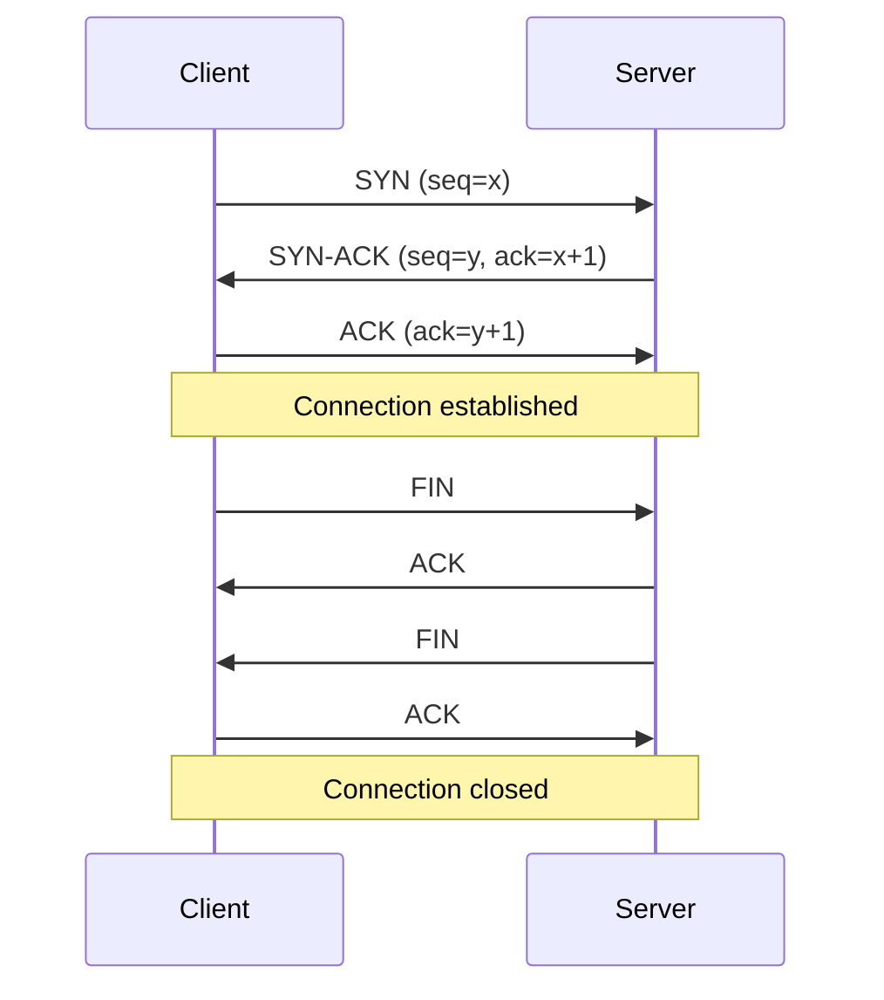

Almost every backend interview eventually touches the network layer — sockets that won't close, port exhaustion in production, or "why is TCP slower than UDP here". You don't need to reimplement a network stack, but you do need to reason precisely about what each layer guarantees.

## Network building blocks

A computer network connects two or more devices so they can exchange data and share resources, and the internet is simply the largest instance of one — a global mesh of LANs (local networks), MANs (city-scale networks), and WANs (wide-area links) stitched together by ISPs.


How devices are wired together (**topology**) and how responsibility is split between them (**architecture**) both shape what a network can do. A star or mesh topology trades cabling and configuration cost for fault tolerance; a **client-server** architecture centralises data and control, which is how most production systems are built, while a **peer-to-peer** architecture spreads both across every node instead.


For a quick side-by-side comparison rather than the full pros-and-cons breakdown above, cost, scalability and reliability trade off differently across the same seven shapes:


Delivery itself comes in four shapes worth naming precisely: **unicast** (one sender, one receiver), **broadcast** (one sender, every host on the segment), **multicast** (one sender, a specific subscribed group), and **anycast** (one address routed to whichever member of a group is topologically nearest — how DNS root servers and many CDNs answer from the closest edge location without the client ever knowing multiple servers exist).

Three numbers describe how well any of this performs, and it's worth keeping them straight: **latency** is the time delay for a message to arrive (ms), **bandwidth** is a link's maximum theoretical capacity (bps), and **throughput** is what is actually achieved once contention, retransmits, and protocol overhead are accounted for. Throughput is always at or below bandwidth, and a high-bandwidth, high-latency link can still deliver worse real throughput than a low-bandwidth, low-latency one for small, frequent messages.


The same relationship shows up plotted over time: traffic climbs toward the link's bandwidth ceiling, but the achieved throughput settles below it once contention and overhead are accounted for.


## The layer model

Networking is organised in layers, each solving one problem and trusting the layer below to have solved its own.

| Layer | Responsibility | Example protocols |
|---|---|---|
| Application | What the data means | HTTP, DNS, gRPC |
| Transport | Process-to-process delivery, reliability | TCP, UDP |
| Network | Host-to-host delivery, routing | IP, ICMP |
| Data link | Node-to-node delivery on one physical segment | Ethernet, Wi-Fi (802.11) |
| Physical | Raw bits on the wire/air | Copper, fibre, radio |

> [!KEY]
> Each layer only needs to trust the guarantee of the layer directly below it. TCP doesn't know or care that IP might drop packets — it builds reliability *on top of* an unreliable network layer.

Most textbooks teach this as the **OSI model** instead — seven layers rather than five, splitting "Application" into Session, Presentation, and Application. In practice, interviews use OSI's names for everything below Transport (Physical, Data Link, Network) and the simpler grouping above it, so it's worth being fluent in both framings rather than picking a side.


### The data link layer: framing and physical addressing

The data link layer's job is hop-to-hop delivery across one physical segment, handled through **framing** (packaging raw bits into frames, via character count, character stuffing, or bit stuffing), **error detection** (parity checks, checksums, CRC), **flow and error control between adjacent devices** (stop-and-wait, or sliding window with go-back-N or selective repeat), and **medium access control** — deciding which device gets to transmit when several share one link (ALOHA, CSMA/CD on wired Ethernet, CSMA/CA on Wi-Fi, token passing). Every network interface card carries a burned-in **MAC address** (48 bits, hexadecimal, e.g. `00:1A:2B:3C:4D:5E`) that identifies it uniquely on the local segment — this is what switches use to forward frames, distinct from the IP addresses routers use to forward packets across segments.

| Technology | Layer 1 | Layer 2 |
|---|---|---|
| Ethernet (802.3) | Electrical/optical signals over cable | Frames, MAC addressing, CSMA/CD |
| Wi-Fi (802.11) | Radio signals | Frames, MAC addressing, CSMA/CA |

Physical hardware maps onto these layers directly: a hub repeats bits blindly (Layer 1), a switch forwards frames by MAC address (Layer 2), a router forwards packets by IP address (Layer 3), and a firewall can be a simple packet filter at Layer 3/4 or a full content inspector at Layer 7 — knowing which layer a device sits at tells you exactly what it can see and block.


## IP addressing, subnets, and CIDR

An IPv4 address is 32 bits, written as four decimal octets (`192.168.1.10`). A network is split into a **network portion** and a **host portion**; **CIDR notation** (`/24`) states how many bits belong to the network.

**Worked example:** `192.168.1.0/24` means the first 24 bits are fixed (network), leaving 8 bits (256 addresses, 254 usable after reserving the network and broadcast addresses) for hosts — `192.168.1.1` through `192.168.1.254`. A `/26` on the same base only leaves 6 host bits — 64 addresses, 62 usable — useful for splitting one `/24` into four smaller subnets for isolation or address conservation.

| CIDR | Host bits | Usable hosts |
|---|---|---|
| /24 | 8 | 254 |
| /25 | 7 | 126 |
| /26 | 6 | 62 |
| /28 | 4 | 14 |
| /30 | 2 | 2 (common for point-to-point links) |

IPv4 and IPv6 solve the same problem — uniquely identifying a host — but differ enough to be worth contrasting directly, especially since IPv4's ~4.3 billion addresses ran out years ago and IPv6 is the long-term fix, not a hypothetical one.

| Feature | IPv4 | IPv6 |
|---|---|---|
| Address size | 32-bit | 128-bit |
| Format | Decimal (`192.168.1.10`) | Hexadecimal (`2001:db8::1`) |
| Address space | ~4.3 billion | ~3.4 × 10^38 |
| Header | Variable, 20–60 bytes | Fixed, 40 bytes |
| Fragmentation | Routers and hosts can fragment | Only the source host fragments |
| Security | IPsec optional | IPsec built into the standard |


Some IPv4 ranges are reserved for private use inside a LAN and never routed on the public internet: `10.0.0.0/8`, `172.16.0.0/12`, and `192.168.0.0/16`. Nearly every device on a home or office network holds one of these. Splitting one of these ranges into smaller pieces is **subnetting**: the subnet mask marks where the network bits end and the host bits begin, and doing this deliberately shrinks broadcast domains, tightens security boundaries, and uses address space efficiently instead of handing every device a slot in one flat, giant network.


## Routing

Routing is the process of forwarding a packet toward its destination network hop by hop. Routers consult a routing table matching the destination IP against known network prefixes — destination network, next hop, interface, and a metric/cost — and forward to the next hop, repeating until the packet reaches a router directly connected to the destination network. **Static routes** are configured by hand and never change; **dynamic routing** protocols let routers learn and share routes automatically, trading a little overhead for the ability to adapt when a link fails.

| Protocol | Purpose | Key point |
|---|---|---|
| IP (IPv4/IPv6) | Addressing and packet delivery between networks | The core Layer 3 protocol |
| ICMP | Error reporting and diagnostics | `ping`, `traceroute` |
| RIP | Dynamic routing within one autonomous system | Hop-count metric, max 15 hops |
| OSPF | Dynamic routing within one autonomous system | Link-state routing |
| BGP | Routing between autonomous systems | The routing protocol of the internet |

## TCP vs UDP

The transport layer's job is process-to-process delivery, achieved by pairing an IP address with a port number — that combination is what lets one host run many independent conversations (a browser, a mail client, an SSH session) at once without their traffic getting confused.


| Property | TCP | UDP |
|---|---|---|
| Connection | Connection-oriented (handshake required) | Connectionless |
| Reliability | Guaranteed delivery, retransmits lost segments | Best-effort, no retransmission |
| Ordering | Guaranteed in-order delivery | No ordering guarantee |
| Flow/congestion control | Yes (sliding window, slow start) | None |
| Overhead | Higher (headers, ACKs, handshake) | Lower (minimal header) |
| Latency | Higher (setup + retransmission delays) | Lower |
| Typical use | HTTP, databases, file transfer, email | DNS queries, video/voice streaming, gaming, IoT telemetry |

> [!TIP]
> The senior framing: choose TCP when correctness (nothing lost, nothing out of order) matters more than latency; choose UDP when *freshness* matters more than completeness — a late video frame is worse than a dropped one.

UDP is deliberately minimal — no connection setup, no delivery guarantee, no acknowledgements, sometimes called "fire and forget" for exactly that reason — which is precisely why it fits DNS lookups, live video/voice, and IoT telemetry, where a fresh dropped packet beats a late retransmitted one.


TCP earns its overhead by turning that same unreliable IP layer into a stateful, ordered byte stream — often described as a connection rather than a sequence of independent messages, because the application only ever sees one continuous flow of bytes, never discrete packets.


## The three-way handshake and teardown

TCP establishes a connection before any data flows, synchronising sequence numbers on both sides.



Teardown is a **four-way** close because each side must independently signal "I'm done sending" (`FIN`) — one side can still be sending data after the other has finished.

The same establishment-to-termination lifecycle, drawn the way it's usually sketched by hand:


## Sequence numbers and retransmission

Every byte in a TCP stream is numbered. Each segment carries a sequence number (the position of its first byte) and an acknowledgement number (the next byte the sender expects back). If an ACK for a segment doesn't arrive before the **retransmission timeout (RTO)**, or if the receiver signals a gap via duplicate ACKs, the sender retransmits — this is the mechanism that turns IP's "best effort, may drop packets" into TCP's "guaranteed, ordered delivery".

## Flow control vs congestion control

These solve two different problems and are frequently confused in interviews.

| Concept | Problem it solves | Mechanism |
|---|---|---|
| Flow control | Don't overwhelm the *receiver* | Sliding window — receiver advertises how much buffer space it has left |
| Congestion control | Don't overwhelm the *network* | Slow start, congestion avoidance, fast retransmit |

**Slow start** begins with a small congestion window and doubles it each round trip until loss is detected or a threshold is hit, then switches to **congestion avoidance**, growing the window linearly to probe for more capacity cautiously. **Window scaling** is a TCP option that extends the window size field beyond its original 16-bit limit (max 65,535 bytes) to support high-bandwidth, high-latency links (the "bandwidth-delay product") without which throughput would be artificially capped regardless of available bandwidth.

Small, frequent writes create another inefficiency worth naming: **Silly Window Syndrome**, where a receiver repeatedly advertises a tiny available window and the sender fills it immediately, producing a stream of small, header-heavy segments that waste bandwidth. **Nagle's algorithm** fixes the sending side by buffering small writes until either a full segment's worth of data accumulates or an ACK for the previous segment arrives; the **Clark solution** fixes the receiving side by refusing to advertise a tiny window until meaningfully more space has freed up. A related **persistence timer** covers the case where a receiver advertises a zero window and its later "window now open" announcement is lost — without it, both sides would wait forever.


## Head-of-line blocking

TCP guarantees in-order delivery to the application — if segment 3 is lost, segments 4, 5, and 6 sit buffered at the receiver, unusable, until segment 3 is retransmitted and arrives. This is **head-of-line (HOL) blocking**: one lost packet stalls everything behind it in that stream, even data that has nothing to do with the lost piece. This is the core motivation behind HTTP/2's single-connection multiplexing being vulnerable to HOL blocking at the TCP layer, and why HTTP/3 moved to QUIC over UDP, which multiplexes independent streams so one stream's loss doesn't stall the others.

## TIME_WAIT and port exhaustion

After closing, a connection sits in **TIME_WAIT** for roughly `2×MSL` (maximum segment lifetime, often 30-60 seconds total) to absorb any stray, delayed packets from the old connection before the port can be safely reused. Under high connection churn — a service that opens a new outbound TCP connection per request instead of reusing one — the client can accumulate thousands of sockets stuck in `TIME_WAIT`, eventually exhausting the ~64,000 ephemeral ports available and causing new outbound connections to fail entirely.

> [!DANGER]
> This is a genuine, recurring production incident: a service creating a new `HttpClient` (and therefore a new TCP connection) per request under load will eventually exhaust ephemeral ports and start throwing connection errors. The fix is a long-lived, reused connection pool — a single shared `HttpClient` or `IHttpClientFactory` in .NET — not a bigger port range.

Two related failure states are worth being able to name on sight: a **half-open connection**, where one side has closed but the other doesn't know it yet (common after a crash or a dropped network path, eventually cleaned up by keep-alive or an RTO), and a **TCP reset (RST)**, used to abruptly tear down a connection that's in a bad state rather than going through the normal four-way close. At volume, unresolved connections and floods of new connection attempts are also the basic shape of a **denial-of-service attack** — overwhelming a target's capacity rather than exploiting a logic bug — which is why connection limits, rate limiting, and firewalls sit in front of most public-facing services as a first line of defence, not an afterthought.

## MTU and fragmentation

The **MTU (maximum transmission unit)** is the largest packet a link can carry without fragmenting — commonly 1500 bytes on Ethernet. If a packet exceeds the path's smallest MTU, it's either fragmented into smaller pieces (each with its own header overhead, and if any single fragment is lost, the *entire* original packet must be retransmitted) or, for IPv6 and when the "don't fragment" flag is set, rejected outright with an ICMP error, requiring the sender to shrink its packet size. **Path MTU discovery** finds the smallest MTU along a route so senders can avoid fragmentation up front.

A VPN or any other tunnelling layer makes this concrete: it wraps the original packet inside a new outer packet with its own headers, encrypting the payload in the process, which eats into the space available before the path's MTU is exceeded — a client still sending at the untouched 1500-byte assumption over a tunnel can start fragmenting, or silently dropping packets, purely because of the tunnel's added overhead.


## Keep-alive, sockets, and connection pooling

**Keep-alive** (TCP keep-alive, or an application-level HTTP `Connection: keep-alive`) periodically probes an idle connection to confirm the peer is still reachable, so a dead connection can be detected and cleaned up rather than held open indefinitely. Establishing a TCP connection costs a full round trip (the three-way handshake) before any data can flow — for a connection reused hundreds of times, that cost is amortised to nothing; for a connection opened once per request, it's pure overhead on every single call.

```csharp
// Wrong: a new HttpClient (and new socket, new handshake) per call — will exhaust ports under load
using var client = new HttpClient();
await client.GetAsync(url);

// Right: one long-lived client (or IHttpClientFactory), connections pooled and reused
private static readonly HttpClient SharedClient = new();
await SharedClient.GetAsync(url);
```

## Cheat sheet

- Layers trust the guarantee below them: TCP builds reliability on top of unreliable IP.
- CIDR `/n` fixes `n` network bits; usable hosts = `2^(32-n) - 2`.
- NAT lets many private IPs share one public IP by rewriting source address/port.
- TCP = reliable, ordered, connection-oriented, higher overhead. UDP = best-effort, connectionless, low overhead.
- Three-way handshake to open (SYN, SYN-ACK, ACK); four-way to close (FIN/ACK each direction).
- Flow control protects the receiver's buffer; congestion control protects the network.
- Slow start grows the congestion window exponentially, then linearly (congestion avoidance).
- Head-of-line blocking: one lost segment stalls everything queued behind it in that TCP stream.
- `TIME_WAIT` + short-lived connections under load → ephemeral port exhaustion, a real production failure mode.
- Reuse connections (`HttpClient`, connection pools) — the handshake cost is real and avoidable.
- MAC addresses (Layer 2) route within a segment; IP addresses (Layer 3) route across segments — switches use one, routers use the other.
- Nagle's algorithm (sender) and the Clark solution (receiver) exist to stop Silly Window Syndrome from wasting bandwidth on tiny segments.

## Common mistakes

| Mistake | Fix |
|---|---|
| Creating a new `HttpClient` per request | Reuse one instance or use `IHttpClientFactory` — avoids port exhaustion and handshake cost |
| Confusing flow control with congestion control | Flow control = receiver's buffer; congestion control = the network path |
| Assuming UDP is "unreliable and therefore bad" | It's the right choice when freshness beats completeness (video, telemetry) |
| Thinking a `/24` always has 256 usable hosts | Subtract the network and broadcast address — 254 usable |
| Ignoring MTU when tunnelling/encapsulating traffic | Encapsulation overhead can push packets over the path MTU, causing fragmentation or drops |
| Treating TIME_WAIT sockets as a leak | It's expected after closing a connection; the real bug is opening too many short-lived ones |
| Treating "Ethernet vs Wi-Fi" as just a cabling difference | Both share Layer 2 framing and MAC addressing; they differ in Layer 1 medium and channel access (CSMA/CD vs CSMA/CA) |

## Summary

IP gets a packet to the right host through addressing and routing, but makes no promises about delivery — TCP layers a handshake, sequence numbers, retransmission, flow control, and congestion control on top to turn that best-effort network into a reliable, ordered, congestion-aware stream, at the cost of setup latency and head-of-line blocking. UDP skips all of that for workloads where a fresh, occasionally-dropped packet beats a late, reliable one. Underneath both, the data link layer's framing and MAC addressing get a frame across one physical hop, and the physical devices (hubs, switches, routers, firewalls) each act at the layer their name implies. In production, the two recurring TCP-related incidents to know cold are ephemeral port exhaustion from short-lived connections and MTU-related fragmentation from encapsulated traffic — both are avoidable with connection reuse and correct MTU configuration.

## Top Interview Questions

### Q1. What is the difference between TCP and UDP, and how would you decide which to use?

TCP is connection-oriented: it establishes a session via a three-way handshake, then guarantees reliable, in-order delivery using sequence numbers, acknowledgements, and retransmission, plus flow and congestion control to avoid overwhelming the receiver or the network — at the cost of setup latency and the possibility of head-of-line blocking. UDP is connectionless: it sends packets with no handshake, no delivery guarantee, and no ordering guarantee, but with minimal overhead and lower latency. I'd choose TCP whenever correctness matters more than latency — API calls, database connections, file transfer — and UDP when freshness matters more than completeness, such as live video/audio, gaming state updates, or DNS queries, where a stale retransmitted packet is worse than a dropped one.

### Q2. Walk through the TCP three-way handshake and explain why it's three steps, not two.

The client sends a `SYN` with an initial sequence number; the server responds with a combined `SYN-ACK`, acknowledging the client's sequence number and providing its own initial sequence number; the client responds with an `ACK`, acknowledging the server's sequence number. It's three steps because the connection is bidirectional and each side needs to both propose and have acknowledged its own starting sequence number — a two-way exchange would let the client confirm the server's sequence number, but the server would never get confirmation that its own `SYN-ACK` was received, leaving it unsure whether the connection is actually usable. The final `ACK` closes that gap, so both sides enter the connection with mutually confirmed sequence numbers.

### Q3. What's the difference between flow control and congestion control in TCP?

Flow control prevents a fast sender from overwhelming a *slow receiver* — it works via the sliding window, where the receiver continuously advertises how much free buffer space it has, and the sender never sends more unacknowledged data than that window allows. Congestion control prevents a sender from overwhelming the *network path* itself, which the sender can't directly observe — it works via mechanisms like slow start (exponential growth of the congestion window until loss is detected) and congestion avoidance (linear growth afterward), inferring the network's capacity from whether packets are getting lost or delayed. Both cap how much data can be in flight, but flow control is about the endpoint's buffer, and congestion control is about shared, invisible network capacity.

### Q4. Your service starts throwing connection errors under load, and you find thousands of sockets in TIME_WAIT. What's happening and how do you fix it?

`TIME_WAIT` is the state a socket enters after closing, held for roughly `2×MSL` (often 30-60 seconds total) to absorb any stray delayed packets from that connection before its port is safely reusable. If the service opens a new outbound TCP connection per request instead of reusing one — a classic cause is instantiating a new `HttpClient` per call in .NET — under sustained load it can accumulate faster than `TIME_WAIT` sockets expire, eventually exhausting the roughly 64,000 available ephemeral ports and causing new outbound connections to fail. The fix is connection reuse: a single long-lived `HttpClient` (or `IHttpClientFactory`, which manages pooled `HttpMessageHandler`s) so the same underlying TCP connections are kept open and reused across many requests instead of opening and closing a new one each time.

### Q5. What is head-of-line blocking, and why does it happen with TCP?

TCP guarantees the application receives bytes in the exact order they were sent, over a single ordered stream. If a segment is lost, every segment that arrived *after* it — even if it has no logical relationship to the lost data — must sit buffered at the receiver, unusable, until the lost segment is retransmitted and arrives. This "head-of-line blocking" means one bad packet stalls the entire stream behind it. It's a real practical concern for protocols that multiplex many independent logical streams over a single TCP connection (like HTTP/2): a single dropped packet for one stream can stall unrelated streams too, which is a major reason HTTP/3 moved to QUIC over UDP — QUIC implements its own per-stream ordering so one stream's loss doesn't block the others.

### Q6. What is CIDR notation, and how many usable hosts are in a /27 network?

CIDR notation states how many of the 32 bits in an IPv4 address are fixed as the network prefix; the remaining bits identify hosts within that network. A `/27` leaves `32 - 27 = 5` host bits, giving `2^5 = 32` total addresses, of which two are reserved — the all-zeros network address and the all-ones broadcast address — leaving 30 usable host addresses. This matters practically for subnet planning: knowing you need to support, say, 40 hosts on a segment tells you immediately that a `/27` is too small and you need at least a `/26` (62 usable), which is exactly the kind of quick mental arithmetic expected in a networking round.

### Q7. How does NAT work, and why does almost every home network only need one public IP address?

NAT (network address translation) sits at the boundary between a private network and the public internet, rewriting the source IP and port of outbound packets to the router's single public IP and a chosen port, while recording that mapping in a translation table. When a response arrives at that public IP and port, the router consults the table to determine which private-network device it belongs to and rewrites the destination accordingly before forwarding it inward. This lets an entire private network (`192.168.x.x`, `10.x.x.x`) share one public IP, because the mapping table — keyed by port, not just IP — lets many internal devices multiplex their connections onto that same external address, which is also why NAT is considered a lightweight (though incomplete) form of address hiding.

### Q8. Why would you see fragmentation issues after adding a VPN or tunnel to a network path, and what's the fix?

Tunnelling encapsulates the original packet inside a new outer packet with its own headers (for example, an IPsec or VPN wrapper adds extra bytes), which means the effective payload the application can send without triggering fragmentation shrinks by that overhead. If the application is still sending packets sized for the original MTU (commonly 1500 bytes on Ethernet), the tunnel's added header can push the total size over the path's real MTU, causing the packet to be fragmented — with the overhead and packet-loss amplification that fragmentation brings — or dropped outright if the "don't fragment" flag is set, which is common for IPv6 and modern TCP stacks doing path MTU discovery. The standard fix is to lower the MTU (or the TCP MSS — maximum segment size) on the tunnel interface to account for the encapsulation overhead, so packets fit within the true path MTU without needing to fragment at all.

### Q9. Why does establishing a new TCP connection for every outbound API call hurt performance even when the network itself is fast?

Every new TCP connection requires a full three-way handshake before any application data can be sent — that's a full network round trip spent purely on setup, on top of whatever the actual request/response takes, plus TLS negotiation if it's HTTPS, which is at least one more round trip (or zero with TLS 1.3 session resumption). For a connection reused across hundreds of requests, this setup cost is paid once and amortised to near zero; for a connection opened and closed per request, it's paid on every single call, and at high request volume it also creates a large number of sockets transitioning through `TIME_WAIT`, risking ephemeral port exhaustion. The fix in .NET is a long-lived, pooled `HttpClient` (via `IHttpClientFactory`) so the underlying TCP (and TLS) connections are established once and reused for many logical requests.

### Q10. What's the difference between congestion detected via timeout versus congestion detected via duplicate ACKs, and why does TCP react differently to each?

A retransmission timeout (RTO) firing with no ACK at all suggests the network path is severely congested or broken — potentially many packets lost — so TCP reacts conservatively, dropping the congestion window all the way back down and re-entering slow start to cautiously re-probe capacity from near zero. Duplicate ACKs (the receiver repeatedly acknowledging the same expected sequence number because a later segment arrived out of order) indicate a single, likely isolated packet loss rather than wholesale congestion, so TCP's "fast retransmit" reacts more gently — it retransmits just the missing segment immediately without waiting for the timeout, and often only halves the congestion window (fast recovery) rather than collapsing it to the minimum. This tiered response lets TCP recover quickly from an isolated blip while still backing off hard when the network genuinely seems to be in trouble.

### Q11. What's the difference between a MAC address and an IP address, and why does a network need both?

A MAC address is a 48-bit hardware address burned into a network interface card, used by Layer 2 devices like switches to deliver frames within a single physical segment; it's flat, not hierarchical, and has no relationship to where a device sits on the wider internet. An IP address is a Layer 3, hierarchical address (network portion plus host portion) used by routers to forward packets across many interconnected segments toward a distant network. A network needs both because delivery happens in two stages: IP gets a packet to the right local segment through routing across networks, and once it arrives there, the local MAC address is what actually gets the frame to the right physical device on that segment — an IP address alone can't do hop-by-hop delivery on a shared physical medium.

### Q12. What is Silly Window Syndrome, and how do Nagle's algorithm and the Clark solution address it?

Silly Window Syndrome happens when a TCP receiver's buffer drains slowly and it keeps advertising a tiny available window, while the sender keeps filling that tiny window immediately — producing a stream of very small segments where header overhead dwarfs actual payload, wasting bandwidth on both ends. Nagle's algorithm addresses the sending side: it buffers small writes and holds them until either a full segment's worth of data has accumulated or an outstanding ACK comes back, rather than sending every tiny write immediately. The Clark solution addresses the receiving side: instead of advertising any small increase in free buffer space as soon as it exists, the receiver waits until a meaningful amount of space has freed up before advertising a larger window. Together they stop both ends from independently trading a tiny amount of progress for a disproportionate amount of packet overhead.
