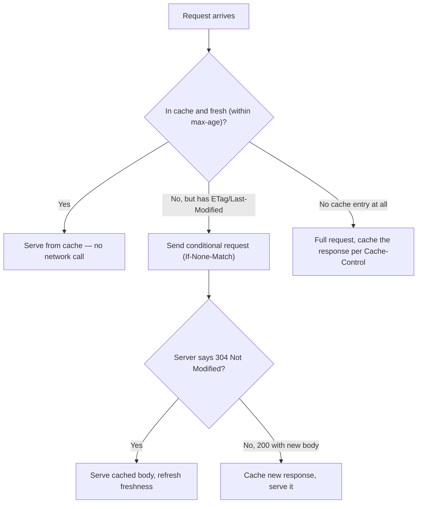

HTTP questions in interviews split into two flavours: "what changed between versions and why" and "which real-time protocol would you pick for this feature". Both reward knowing the trade-offs cold rather than reciting a version history.

## HTTP/1.1 vs HTTP/2 vs HTTP/3

| Property | HTTP/1.1 | HTTP/2 | HTTP/3 |
|---|---|---|---|
| Transport | TCP | TCP | QUIC (over UDP) |
| Multiplexing | No (one request in flight per connection without pipelining) | Yes, multiple streams per connection | Yes, independent streams |
| Header compression | None | HPACK | QPACK |
| Server push | No | Yes (rarely used, mostly deprecated in practice) | Yes (same caveat) |
| Head-of-line blocking | Yes, at the application level | Reduced at app level, but reintroduced at TCP level (one lost packet stalls all streams) | Eliminated — QUIC streams are independent even at the transport level |
| Connection setup | TCP handshake only | TCP + TLS handshake | QUIC combines transport + TLS 1.3 handshake, supports 0-RTT |

> [!KEY]
> HTTP/2 fixed head-of-line blocking *at the HTTP layer* by multiplexing streams over one TCP connection, but a single lost TCP packet still stalls every stream on that connection, because TCP itself only knows one ordered byte stream. HTTP/3 fixes this properly by moving multiplexing into QUIC, where each stream's loss is independent.

## Persistent connections and pipelining

HTTP/1.0 opened a new TCP connection per request — enormously wasteful given the handshake cost. HTTP/1.1 introduced **persistent connections** (`Connection: keep-alive` by default) so multiple requests could reuse one TCP connection sequentially. **Pipelining** tried to let a client send several requests without waiting for each response, but responses still had to come back in the same order they were requested, so one slow response blocked all the ones queued behind it — combined with poor server/proxy support, pipelining was never widely adopted, which is exactly the problem HTTP/2's multiplexing was designed to solve properly.

## Request and response anatomy

An HTTP message is a start line, headers, a blank line, and an optional body.

```text
GET /api/orders/42 HTTP/1.1
Host: api.example.com
Accept: application/json
Authorization: Bearer eyJhbGciOi...

HTTP/1.1 200 OK
Content-Type: application/json
Content-Length: 128
Cache-Control: private, max-age=60

{"id": 42, "status": "shipped"}
```

Status codes fall into families worth naming instantly: `2xx` success, `3xx` redirection, `4xx` client error (the caller did something wrong), `5xx` server error (the server failed to handle a valid request) — the distinction matters for retries: retrying a `4xx` blindly is almost always wrong, retrying a `5xx` (with backoff) is often reasonable.

One specific `4xx` is worth calling out on its own: `429 Too Many Requests`, returned by rate limiting that caps how often a client can call an endpoint — enforced per IP, per account, per endpoint, or globally, depending on what abuse pattern it's guarding against.

## HTTPS: encrypting HTTP

HTTPS layers security on top of HTTP, and it's worth being precise about what that security actually buys: **confidentiality** (nobody in the middle can read the traffic), **integrity** (nobody can tamper with it undetected), and **authentication** (the client is actually talking to who it thinks it's talking to).


That security is provided by **TLS (Transport Layer Security)**, the modern successor to **SSL (Secure Sockets Layer)** — a name that still lingers in casual usage even though SSL itself has been retired for years.


TLS mixes two kinds of cryptography to get there. **Asymmetric encryption** (RSA and similar) uses a public/private key pair — anyone can encrypt with the public key, but only the private key can decrypt — which is ideal for a handshake between two parties who have never met, but too slow for an entire session's worth of data. **Symmetric encryption** (AES, DES) uses one shared key for both directions and is far faster, so the handshake's real job is to use asymmetric crypto just long enough to safely agree on a symmetric session key, then switch to that key for the actual data transfer.


That handshake also has to prove the server is who it claims to be, which is where certificates come in. A **certificate authority (CA)** is a trusted third party that verifies a domain owner's identity and issues a certificate binding their public key to that identity; the browser trusts a short list of root CAs, and a chain of signatures links the server's certificate back up to one of them. This entire arrangement — keys, certificates, and the CAs that vouch for them — is called **public key infrastructure (PKI)**.


The signature itself is a **digital signature**: the CA hashes the certificate's contents and encrypts that hash with its own private key, and anyone can verify it by decrypting with the CA's public key and checking the hash matches — proving the certificate hasn't been altered and really was issued by that CA.


## CORS: cross-origin requests

Browsers enforce the **same-origin policy**: JavaScript running on one origin can't read responses from a different origin unless that origin explicitly opts in via **CORS (Cross-Origin Resource Sharing)** headers. A **simple request** — a plain GET/POST with ordinary headers — just needs the response to include `Access-Control-Allow-Origin` for the right origin. Anything riskier — a non-GET/POST/HEAD method, a custom header like an auth token, or a non-form content type — triggers a **preflight**: the browser sends an `OPTIONS` request asking what's allowed before sending the real one.

```text
Preflight request headers:  Access-Control-Request-Method, Access-Control-Request-Headers
Preflight response headers: Access-Control-Allow-Origin, Access-Control-Allow-Methods,
                             Access-Control-Allow-Headers, Access-Control-Max-Age
```

CORS is a browser-enforced rule, not a server-side security boundary — a server that never checks the `Origin` header itself is just as reachable by a non-browser client; CORS only stops a browser from letting a malicious page's own JavaScript read another origin's response on a victim's behalf.

## Caching headers and the caching decision flow

| Header | Purpose |
|---|---|
| `Cache-Control` | Directives: `max-age`, `no-cache` (revalidate before use), `no-store` (never cache), `private`/`public` |
| `ETag` | An opaque fingerprint of the resource; used for conditional requests (`If-None-Match`) |
| `Last-Modified` | A timestamp; used for conditional requests (`If-Modified-Since`) |
| `Vary` | Tells caches the response differs by request header (e.g. `Vary: Accept-Encoding`) — caching without respecting this serves wrong content to some clients |



> [!TIP]
> A `304 Not Modified` still costs a round trip but saves the response body — worth it for large payloads, wasted effort for tiny ones. This trade-off is worth naming out loud.

## Cookies and compression

Cookies are small key-value pairs the server asks the client to store and resend on every subsequent request to the same origin (`Set-Cookie` / `Cookie` headers); they're the classic mechanism for session identifiers, and their `Secure`, `HttpOnly`, and `SameSite` attributes are a recurring security-question topic. **Compression** (`Content-Encoding: gzip` or `br`) trades CPU for bandwidth — almost always a win for text-based payloads (JSON, HTML, CSS) at typical sizes, and usually skipped for already-compressed formats (images, video) where it wastes CPU for negligible size reduction.

Two browser-specific attacks exploit exactly that cookie-based trust relationship. **CSRF (cross-site request forgery)** tricks a logged-in user's browser into firing a request at another site using their existing session cookie, without their knowledge; the fix is the `SameSite` cookie attribute (blocking the cookie from being sent on cross-site requests) plus anti-CSRF tokens on state-changing requests. **XSS (cross-site scripting)** injects malicious script into a page that then runs with the victim's own session; the fix is input sanitisation plus the `HttpOnly` attribute, which stops injected JavaScript from ever reading the session cookie, even if the injection itself succeeds.

## WebSockets, long polling, and SSE

**WebSockets** start as a normal HTTP request that asks to be upgraded (`Connection: Upgrade`, `Upgrade: websocket`); once the server agrees (`101 Switching Protocols`), the TCP connection is repurposed for a full-duplex, message-framed protocol — either side can send at any time, with no request/response pairing required. This makes them the right fit for genuinely bidirectional, low-latency use cases.

| Approach | Direction | Latency | Server cost per client | Best for |
|---|---|---|---|---|
| Polling | Client-initiated, repeated | High (bound by poll interval) | Low, but wasteful at high frequency | Simple, infrequent updates |
| Long polling | Client-initiated, held open until data or timeout | Medium (near-immediate once data exists) | A held-open connection per client | Fallback when WebSockets aren't available |
| Server-Sent Events (SSE) | Server-to-client only, over plain HTTP | Low | A held-open connection per client | One-way live feeds (notifications, live scores) |
| WebSockets | Full-duplex | Lowest | A held-open connection per client | Chat, collaborative editing, gaming, trading |

> [!WARNING]
> SSE is plain HTTP text (`text/event-stream`) and reconnects automatically with a `Last-Event-ID` for resuming — genuinely simpler to operate than WebSockets when you only need server-to-client updates. Reaching for WebSockets when SSE would do adds unnecessary protocol complexity and server-side connection state for no benefit.

## gRPC over HTTP/2

gRPC uses HTTP/2 as its transport specifically to get multiplexed streams and header compression, layering Protocol Buffers (a compact binary serialization format) on top for the payload. It supports four call shapes: unary (one request, one response — the default RPC feel), server streaming (one request, a stream of responses — e.g. a live feed), client streaming (a stream of requests, one response — e.g. uploading chunks), and bidirectional streaming (both sides stream independently — e.g. a live chat channel). gRPC is a strong fit for internal service-to-service calls where both ends are known and a strict, versioned schema is welcome; it's a weaker fit for public browser-facing APIs, where HTTP/2's binary framing and gRPC's tooling requirements are more friction than plain JSON over REST.

## Other application-layer protocols

Not every application protocol is HTTP-shaped. **AMQP (Advanced Message Queuing Protocol)** is an open standard for message-oriented middleware — brokers like RabbitMQ implement it to move messages reliably between distributed services, which is why it shows up constantly in backend system design even though it never touches a browser.


A handful of others are worth recognising by name and port on sight, since interviewers assume this vocabulary is second nature:

| Protocol | Purpose | Default port |
|---|---|---|
| FTP | File transfer between client and server | 20 / 21 |
| SMTP | Sending email | 25 / 587 / 465 |
| POP3 | Downloads email from a server | 110 / 995 |
| IMAP | Accesses and synchronises email on a server | 143 / 993 |
| SSH | Secure remote login and command execution | 22 |
| Telnet | Remote login without encryption | 23 |
| SNMP | Network/device monitoring and management | 161 / 162 |
| NTP | Synchronises system clocks | 123 |
| RPC | Calls procedures/functions on a remote system | Varies |

## Choosing a protocol for a real-time feature

```csharp
// SSE endpoint in ASP.NET Core — one-way server push, plain HTTP, auto-reconnect on the client
app.MapGet("/notifications/stream", async (HttpContext ctx) => {
    ctx.Response.Headers.Add("Content-Type", "text/event-stream");
    while (!ctx.RequestAborted.IsCancellationRequested) {
        var evt = await notificationQueue.DequeueAsync(ctx.RequestAborted);
        await ctx.Response.WriteAsync($"data: {evt}\n\n");
        await ctx.Response.Body.FlushAsync();
    }
});
```

The decision usually reduces to three questions: does the client need to *send* data as often as it receives (if yes, WebSockets)? Is a normal HTTP/CDN/proxy stack acceptable, or does the feature need to survive behind restrictive corporate proxies that block WebSocket upgrades (if the latter, SSE or long polling degrade more gracefully)? And is update frequency low enough that simple polling is honestly good enough (a dashboard refreshing every 30 seconds rarely needs a persistent connection at all)?

## Cheat sheet

- HTTP/2 multiplexes streams over one TCP connection; HTTP/3 moves multiplexing into QUIC to fix TCP-level head-of-line blocking.
- Persistent connections (HTTP/1.1 default) reuse one TCP connection; pipelining never took off because of in-order response delivery.
- `Cache-Control: max-age` avoids the round trip entirely; `ETag`/`Last-Modified` enable a cheap `304` when a full round trip is unavoidable.
- `Vary` matters — caching a response without respecting it can serve the wrong content-encoding or locale to another client.
- WebSockets = full-duplex, lowest latency, most server-side connection state. SSE = one-way, simpler, auto-reconnecting.
- Long polling is a fallback, not a first choice, when WebSockets/SSE aren't viable.
- gRPC rides on HTTP/2 for multiplexing and supports unary, server-streaming, client-streaming, and bidirectional streaming.
- Retry `5xx` with backoff; don't blindly retry `4xx` — the request itself is the problem.
- Compression is a near-free win for text payloads, wasted effort for already-compressed binary formats.
- Pick the simplest protocol that satisfies the actual directionality and latency need — not the most impressive one.
- TLS uses asymmetric crypto (RSA) just long enough to agree a symmetric session key (AES), because symmetric is far faster for bulk data.
- A CA-signed certificate proves identity via a digital signature; PKI is the whole trust chain of keys, certificates, and CAs behind it.
- CORS is enforced by the browser, not the server — it stops malicious pages from reading cross-origin responses, nothing more.
- `SameSite` cookies blunt CSRF; `HttpOnly` cookies blunt XSS session theft — different attacks, different attributes.

## Common mistakes

| Mistake | Fix |
|---|---|
| Assuming HTTP/2 eliminated all head-of-line blocking | It removed it at the app layer; TCP-level HOL blocking remains — only HTTP/3/QUIC fixes that |
| Reaching for WebSockets for a one-way live feed | Use SSE — simpler, auto-reconnecting, works over plain HTTP |
| Ignoring `Vary` when caching | Can serve compressed content to a client that can't decode it, or the wrong locale |
| Retrying every failed request the same way | Retry `5xx`/timeouts with backoff; don't retry `4xx` without fixing the request |
| Treating gRPC as a drop-in replacement for public REST APIs | It's strongest for internal service-to-service calls with a shared schema |
| Forgetting long polling holds a connection/thread open per waiting client | Budget server resources accordingly, or prefer SSE/WebSockets at scale |
| Treating CORS as a server-side security control | It only constrains browser JavaScript; a non-browser client can call the API regardless of CORS headers |
| Relying on `Secure`/`HttpOnly` alone and skipping `SameSite` or CSRF tokens | Cookie flags stop cookie theft, not a forged cross-site request using a cookie that's still sent |

## Summary

HTTP's evolution is a steady removal of head-of-line blocking: HTTP/1.1 added persistent connections, HTTP/2 added multiplexed streams over one TCP connection, and HTTP/3 moved multiplexing into QUIC to fix the TCP-level blocking that HTTP/2 couldn't. HTTPS wraps that exchange in TLS, using asymmetric crypto just long enough to agree a symmetric session key and a CA-backed certificate chain to prove identity, while CORS, `SameSite`, and `HttpOnly` are the browser-side controls that stop a malicious page from abusing another origin's session. Caching headers (`Cache-Control`, `ETag`, `Vary`) form a decision tree that avoids network round trips when possible and cheapens them (via `304`) when not. For real-time features, match the protocol to the actual need: WebSockets for genuine bidirectional low-latency traffic, SSE for one-way server push, long polling as a fallback, and gRPC over HTTP/2 for internal streaming service calls — reaching for the most powerful option by default is a common and avoidable overengineering trap.

## Top Interview Questions

### Q1. What problem does HTTP/2 multiplexing solve, and why doesn't it fully fix head-of-line blocking?

HTTP/1.1 could only have one request in flight per TCP connection at a time (browsers worked around this by opening multiple parallel connections), so a slow response blocked everything queued behind it on that connection. HTTP/2 introduced multiplexed streams: many logical request/response exchanges share one TCP connection simultaneously, interleaved as frames, removing that application-level blocking. However, TCP itself only guarantees one ordered byte stream — if a single TCP packet is lost, every HTTP/2 stream sharing that connection stalls until it's retransmitted, because the transport layer has no concept of independent streams. That's TCP-level head-of-line blocking, and it's exactly what HTTP/3 (via QUIC) was designed to eliminate, by giving each stream independent loss recovery.

### Q2. When would you choose WebSockets over Server-Sent Events?

Choose WebSockets when the client needs to send data to the server as frequently and urgently as it receives data — genuinely bidirectional, low-latency use cases like chat, collaborative editing, multiplayer gaming, or trading platforms. SSE is a better fit when the data flow is fundamentally one-way, server-to-client, such as live notifications, a live score feed, or streaming log output — it runs over plain HTTP, so it works through standard proxies and CDNs without any protocol upgrade, and the browser's `EventSource` API automatically reconnects and resumes using `Last-Event-ID`. Using WebSockets for a one-way feed adds unnecessary complexity: a persistent bidirectional channel, custom reconnect/resume logic, and different infrastructure handling, for a feature that never actually needs the client-to-server direction.

### Q3. Explain the HTTP caching decision flow using Cache-Control, ETag, and Last-Modified.

When a cached response exists and is still within its `Cache-Control: max-age` window, the client serves it directly with no network call at all — the fastest path. Once the response is stale, if the original response included an `ETag` (an opaque content fingerprint) or `Last-Modified` timestamp, the client sends a conditional request (`If-None-Match` or `If-Modified-Since`); if the server's current version matches, it replies `304 Not Modified` with no body, letting the client reuse its cached copy and refresh its freshness window, saving bandwidth even though a round trip still happened. If the content changed, the server returns a normal `200` with the new body, which gets cached going forward. Without any freshness or validation info, every request goes to the origin in full.

### Q4. What does the `Vary` header do, and what happens if a caching layer ignores it?

`Vary` tells any cache (browser, CDN, reverse proxy) that the response content differs depending on the value of one or more request headers — commonly `Vary: Accept-Encoding` (compressed vs uncompressed) or `Vary: Accept-Language` (localized content). A cache that ignores `Vary` treats all requests to the same URL as interchangeable and may serve, for example, a gzip-compressed response to a client that didn't ask for compression (breaking the response entirely) or an English page to a client that requested French. This is a classic, hard-to-diagnose production bug: it works for the engineer testing locally (consistent headers) but breaks intermittently for a subset of real users depending on which cached variant they happen to hit.

### Q5. What is head-of-line blocking, and how does HTTP/3 solve it differently from HTTP/2?

Head-of-line blocking is when one held-up piece of data stalls delivery of unrelated data queued behind it. HTTP/2 solved it at the *application* layer by multiplexing independent streams over a single TCP connection, but TCP's guarantee of one strictly ordered byte stream means a single lost packet still blocks every multiplexed stream at the *transport* layer until retransmission completes. HTTP/3 solves this by discarding TCP entirely in favour of QUIC, which runs over UDP and implements multiplexed streams *inside* the transport protocol itself — each stream has independent sequencing and loss recovery, so a lost packet on one stream only stalls that stream, not the others sharing the connection.

### Q6. What are the four gRPC streaming modes, and when would you use each?

Unary is a single request and single response — the default, REST-like shape, appropriate for most simple RPCs. Server streaming is one request followed by a stream of responses from the server, appropriate for a live feed derived from a single query, like subscribing to price updates for one symbol. Client streaming is a stream of requests from the client resolved into a single response, appropriate for uploading data in chunks that only need one final acknowledgement, like a large file upload. Bidirectional streaming lets both sides send independently over the same call, appropriate for genuinely interactive exchanges like a live chat or a collaborative session where either party can push data at any time. All four ride on HTTP/2's multiplexed streams, which is what makes long-lived streaming calls practical without opening a new connection per exchange.

### Q7. Why would you choose long polling over WebSockets in some environments, even though it's less efficient?

Long polling is plain HTTP request/response — the client sends a request, the server holds it open until data is available or a timeout hits, then the client immediately re-requests. Because it's ordinary HTTP with no protocol upgrade, it passes through restrictive corporate proxies, older load balancers, and network middleboxes that block or don't understand the WebSocket upgrade handshake, whereas WebSockets can fail silently in exactly those environments. The trade-off is real: long polling holds a server-side connection (and often a thread or async context) open per waiting client and re-establishes a new HTTP request on every cycle, which is less efficient than a single persistent WebSocket connection. It's the right pragmatic fallback when you can't guarantee WebSocket support across your client base, not a first choice on unconstrained infrastructure.

### Q8. A public API endpoint is failing intermittently and your retry logic sometimes makes things worse. What would you check?

First, I'd check what status codes are actually failing — if retries are hitting `4xx` responses (bad request, unauthorized, not found), retrying identically will never succeed and just adds load; only `5xx` and network-level timeouts are reasonable to retry, and even then only with exponential backoff and a cap, since a naive tight retry loop against a struggling server amplifies the very overload causing the failures (a retry storm). Second, I'd check whether the calls are idempotent — retrying a non-idempotent `POST` that partially succeeded server-side can duplicate the effect, which argues for idempotency keys on any operation that gets retried. Finally, I'd check connection reuse: if each retry opens a brand-new HTTP connection instead of reusing a pooled one, the retries are also paying full handshake cost, worsening exactly the latency problem that triggered the retry.

### Q9. Why is compressing an already-compressed payload (like a JPEG or a pre-gzipped file) usually a waste?

General-purpose compression (gzip, Brotli) works by finding and eliminating statistical redundancy — repeated byte patterns — in the data. Formats like JPEG, PNG, and video codecs already remove most of that redundancy as part of their own encoding, so running gzip over an already-compressed file finds very little left to compress, often adding a few bytes of overhead while burning CPU cycles for a negligible or even negative size change. The correct approach is to compress at the layer where redundancy still exists — the original JSON/HTML/CSS text, or the image itself using an image-specific codec — and skip generic compression for payloads that are already in a dense binary format; most web servers are configured to do exactly this by content type.

### Q10. How would you design the real-time layer for a live collaborative document editor?

This needs genuine bidirectional, low-latency communication — every keystroke from any participant should reach the others as fast as possible, and participants also send data just as often as they receive it — so WebSockets is the right transport, not SSE or polling. I'd design the server to maintain a per-document channel that broadcasts operations (not full document snapshots, to keep messages small) to all connected clients, using an operational-transform or CRDT-based merge strategy to resolve concurrent edits without needing a central lock. For clients on networks that block WebSocket upgrades, I'd add a long-polling fallback so the feature degrades gracefully rather than failing outright, and I'd make sure reconnect logic can resynchronize a client's state (e.g. via a version/sequence number) after a dropped connection, since that's the scenario most likely to cause silent data divergence in production.

### Q11. Why does TLS bother with slow asymmetric encryption at all if it's just going to switch to a symmetric key anyway?

Symmetric encryption needs both parties to already share the same secret key, which is exactly the problem at the start of a connection between two parties who've never communicated before — there's no existing secure channel to exchange that key over. Asymmetric encryption solves that specific bootstrapping problem: the server's public key can be shared openly, and the client can use it to encrypt a proposed session key (or, in modern TLS, both sides use key-exchange math like Diffie-Hellman) such that only the server's private key can recover it, giving both sides a shared secret without ever transmitting it in the clear. Once that symmetric key exists, there's no more bootstrapping problem to solve, so TLS switches to symmetric encryption for the bulk of the session purely because it's orders of magnitude faster per byte — using asymmetric crypto for the whole session would work but would be needlessly slow.

### Q12. A frontend team says their API calls are being blocked by CORS, but the same API works fine from Postman. Why, and how would you fix it?

CORS is enforced entirely by the browser, not the server — Postman isn't a browser and doesn't apply the same-origin policy at all, so it sends the request and shows whatever the server returns regardless of any CORS headers. A real browser, however, checks whether the response includes an `Access-Control-Allow-Origin` header matching the calling page's origin (or a non-GET/custom-header request first sends a preflight `OPTIONS` and checks its response) before it will let the page's JavaScript read the response at all — if the server never sends those headers, the browser blocks it client-side even though the server processed the request successfully. The fix is server-side: add the appropriate `Access-Control-Allow-Origin` (and, for anything beyond a simple request, `Access-Control-Allow-Methods`/`-Headers`) so the browser's preflight check passes, rather than trying to work around it in frontend code, which can't bypass a browser-enforced policy.
