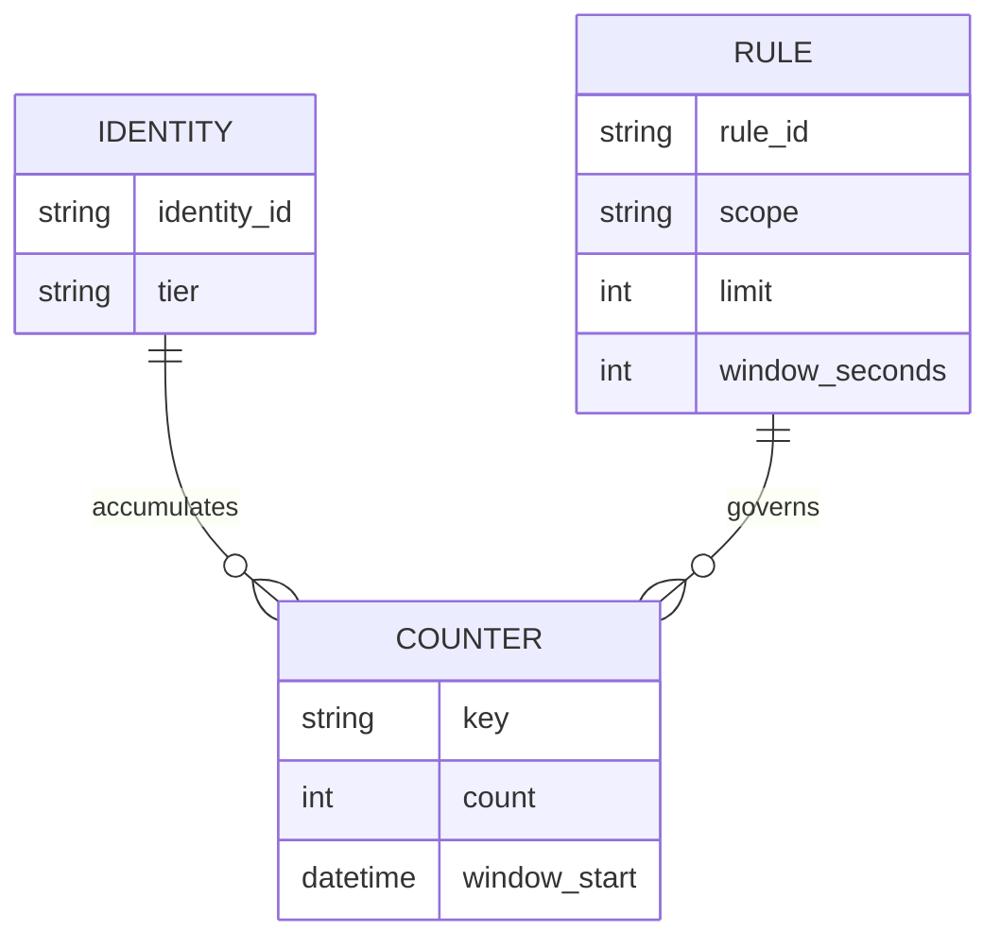
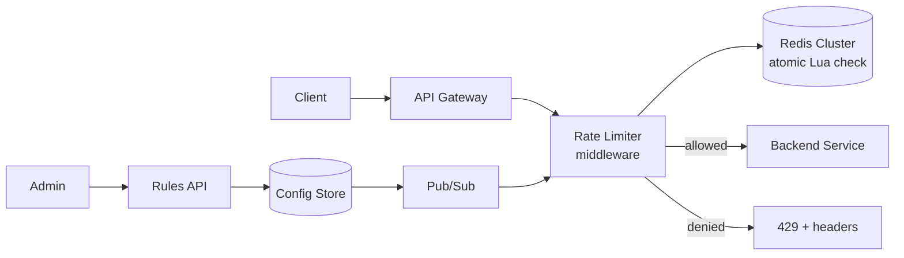
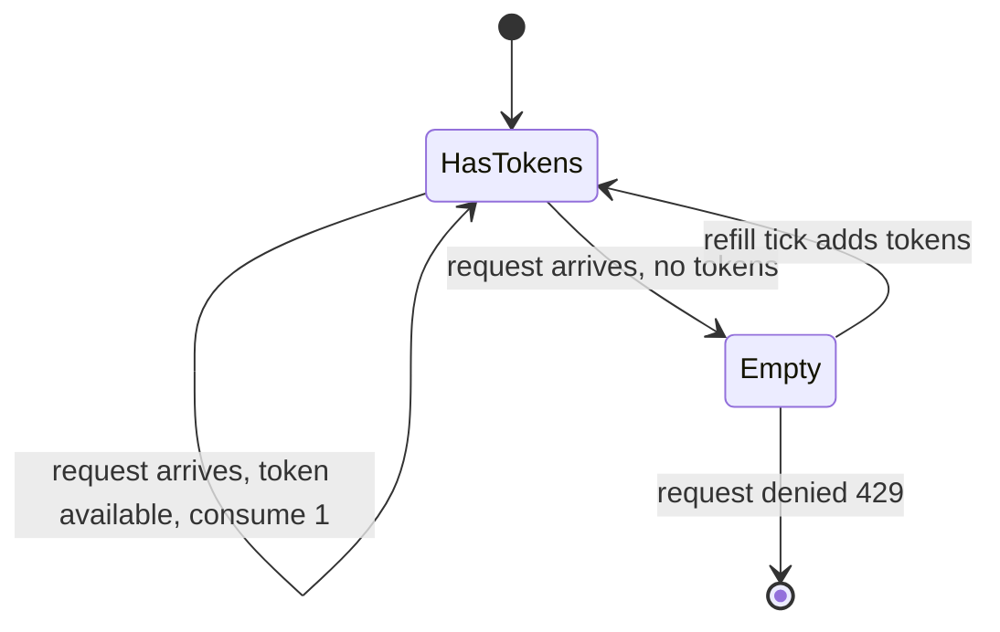

A rate limiter rejects requests once a client exceeds an allowed quota, protecting backends from abuse and overload. The interesting parts are algorithm choice, keeping counters correct across many nodes, and deciding what happens when the limiter itself fails.

## Requirements

### Functional

- Enforce limits per identity (user ID, API key, or IP) and optionally per endpoint.
- Support multiple limit tiers (e.g. free vs paid) and burst allowances.
- Return `429 Too Many Requests` with headers describing the limit, remaining quota, and reset time.
- Allow rules to be added or changed without redeploying the service (hot reload).

### Non-functional

- Add minimal latency to every request, target under 5ms p99 for the rate-limit check itself.
- Stay accurate under concurrent requests from the same identity across many gateway nodes.
- Remain highly available — a rate limiter outage should not be able to take down the whole platform.
- Scale horizontally with request volume, independent of backend service scaling.

### Out of scope

- Billing/metering and quota systems (this is throttling, not invoicing).
- DDoS mitigation at the network/WAF layer.
- A UI for managing rules (only the config propagation mechanism matters here).

## Scale estimation

| Metric | Assumption | Working | Result |
|---|---|---|---|
| Global request rate | Peak gateway traffic | given | 200,000 req/sec |
| Rate-limit checks needed | one per request | 200,000 req/sec | 200,000 ops/sec |
| Active rate-limited identities | concurrent users/keys | given | ~50M |
| Bytes per counter (key + count + TTL) | small fixed-size record | ~50 bytes | 50 bytes |
| Counter store memory | 50M × 50 bytes | 50,000,000 × 50 | ~2.5 GB |
| Redis ops per node | typical single-node ceiling | ~100K ops/sec/node | need ≥3 nodes for 200K ops/sec with headroom |
| Added latency budget | in-memory check + network hop | Redis round trip ~1ms + logic | under 5ms p99 |
| Config propagation | rule change to all gateway nodes | pub/sub push | seconds, not a redeploy |

> [!TIP]
> Note out loud that the counter dataset is small (a few GB) but the **operation rate** is what drives the architecture — this is a throughput problem, not a storage problem, which points straight at an in-memory store like Redis.

## Core entities and data model

| Entity | Key fields |
|---|---|
| `RateLimitRule` | `rule_id`, `scope` (user/ip/api_key), `resource_pattern`, `limit`, `window_seconds`, `algorithm` |
| `Counter` | `key` (identity+resource+window), `count`, `window_start`, `ttl` |
| `Identity` | `identity_id`, `tier` (free/paid), `api_key` |



## API design

```http
// Enforcement is not a client-facing API — it's a check invoked per request:
Check(identity, resource) -> { allowed: bool, remaining: int, resetAt: timestamp }

// Rule management (admin-facing, drives hot reload)
POST /rules
{ "scope": "api_key", "resource_pattern": "/orders/*", "limit": 100, "window_seconds": 60, "algorithm": "token_bucket" }

GET /rules/{rule_id}
PUT /rules/{rule_id}      // triggers hot reload push to all gateway nodes
DELETE /rules/{rule_id}

// Response headers on every limited request
X-RateLimit-Limit: 100
X-RateLimit-Remaining: 42
X-RateLimit-Reset: 1732550400
Retry-After: 17            // present only on 429
```

## High level architecture



**Request path:** (1) client calls the gateway, (2) the rate-limiter middleware resolves the identity and matching rule, (3) it runs an atomic increment-and-check against Redis, (4) if under the limit, the request proceeds to the backend and response headers report remaining quota, (5) if over the limit, the middleware short-circuits with a `429` before the backend ever sees the request.

**Config path:** (1) an admin changes a rule via the Rules API, (2) the new rule is written to a config store, (3) a pub/sub event notifies every gateway instance, (4) each instance updates its in-memory rule cache within seconds — no redeploy needed.

## Deep dive: choosing the algorithm

| Algorithm | How it works | Burst handling | Weakness |
|---|---|---|---|
| Fixed window counter | Increment a counter per fixed time bucket (e.g. per minute) | Allows a 2x burst at window boundaries | Boundary spike: 2× limit possible across two adjacent windows |
| Sliding window log | Store a timestamp per request, count requests in the trailing window | Fully accurate | Memory grows with request count, expensive at scale |
| Sliding window counter | Weighted average of current and previous fixed windows | Good approximation, smooths boundary spike | Slight inaccuracy, not exact |
| Token bucket | Bucket refills at a fixed rate, request consumes a token | Naturally supports bursts up to bucket size | Needs to track last-refill time per identity |
| Leaky bucket | Requests queue and drain at a constant rate | Smooths bursts into a steady rate | Adds queuing latency, not just accept/reject |



> [!KEY]
> Token bucket is the most common production default: it allows short bursts (good UX for legitimate clients), is cheap to compute (just a count and a last-refill timestamp), and avoids the fixed-window boundary problem. Sliding window counter is the pragmatic compromise when you want smoother enforcement without the memory cost of a full log.

## Deep dive: where the limiter lives

| Placement | Pros | Cons |
|---|---|---|
| API gateway (centralized) | One place to enforce, easy to change rules globally | Extra hop, gateway becomes a scaling and availability dependency for every request |
| Middleware in each service | No extra network hop, service-specific limits are easy | Rules and counters must be duplicated/shared across every service |
| Sidecar (service mesh) | Consistent enforcement without changing app code, per-pod scaling | Operational complexity of running a sidecar per instance |

A common answer: enforce coarse, identity-level limits at the gateway (protects the whole platform cheaply), and let individual services apply finer per-endpoint limits in their own middleware or sidecar where business logic needs it.

## Deep dive: distributed counters and atomicity

The hard part of a distributed rate limiter is that many gateway nodes check the same identity's counter concurrently — a naive `GET` then `SET` race lets two nodes both see 99/100 and both allow the 100th and 101st request. For a fixed-window counter, Redis solves this with an atomic increment-and-check in one round trip, typically a Lua script so the check-and-increment is a single atomic operation on the server:

```lua
-- KEYS[1] = counter key, ARGV[1] = limit, ARGV[2] = window seconds
local current = redis.call("INCR", KEYS[1])
if current == 1 then
    redis.call("EXPIRE", KEYS[1], ARGV[2])
end
if current > tonumber(ARGV[1]) then
    return 0  -- denied
end
return 1      -- allowed
```

For the token-bucket default described above, the script changes shape — store `tokens` and `last_refill_at` in a Redis hash, refill based on Redis server time, then decrement one token if available — but the requirement is identical: the read, refill, decrement, and write must all happen in one server-side operation. A client-side `GET`, compute, then `SET` race is wrong for both algorithms.

> [!WARNING]
> Clock skew between gateway nodes matters for time-window algorithms. If node A's clock is 2 seconds ahead, it may open a new window early and grant extra requests. Mitigate by letting Redis (a single source of truth) own the window boundary via `TTL`/`EXPIRE` rather than trusting each node's local clock, and by using NTP-synced hosts.

## Deep dive: hot reload, headers, and fail-open vs fail-closed

Rule changes propagate via pub/sub (Redis Pub/Sub, or a config service like etcd/Consul with watch support) so every gateway node updates its in-memory rule table within seconds, without a restart. Every response — allowed or denied — should include `X-RateLimit-Limit`, `X-RateLimit-Remaining`, and `X-RateLimit-Reset` so well-behaved clients can back off proactively; a `429` additionally includes `Retry-After`.

> [!DANGER]
> When the counter store (Redis) itself is unreachable, you must explicitly choose **fail-open** (allow all requests, protecting availability but exposing backends to abuse) or **fail-closed** (deny all requests, protecting backends but taking down the platform). Most production systems fail-open for customer-facing traffic and fail-closed only for a small set of expensive, abuse-prone endpoints — say this trade-off out loud, don't leave it implicit.

## Bottlenecks and scaling

- **Redis as a shared dependency** — shard by identity hash across a Redis cluster so no single node handles all traffic; keep the Lua script single-key so it stays atomic per shard.
- **Hot identities** — a single abusive or viral identity can concentrate traffic on one shard; local in-process pre-checks (approximate, refreshed periodically) can absorb obvious abuse before hitting Redis.
- **Gateway CPU** — rule matching (resource pattern lookup) should be a cached, precompiled structure (e.g. a trie or hashmap), not a linear scan per request.
- **Cross-region deployments** — either accept per-region limits (simpler, slightly generous globally) or pay for cross-region Redis replication latency for a single global counter.

## Failure scenarios

| Failure | Blast radius | Mitigation |
|---|---|---|
| Redis cluster unreachable | All rate-limit checks fail | Fail-open with a local, coarse fallback limiter; alert immediately |
| Config store/pub-sub down | Rule changes stop propagating | Gateways keep last-known rules; not a request-path outage |
| Clock skew across nodes | Slightly incorrect window boundaries | Let Redis TTL own window expiry, not local node clocks |
| One Redis shard hot (abusive identity) | Elevated latency for that shard's identities only | Per-identity sharding limits blast radius to one shard, not the cluster |

## Cheat sheet

- Token bucket is the default algorithm; sliding window counter if you need smoother enforcement without full-log memory cost.
- Make the check-and-increment atomic (Lua script or `INCR`+`EXPIRE`) — never read-then-write across two round trips.
- Decide fail-open vs fail-closed explicitly and per endpoint class, don't leave it as an accident of the failure mode.
- Always return `X-RateLimit-*` headers so clients can self-throttle.
- Hot-reload rules via pub/sub/config-watch, never require a redeploy for a limit change.
- Shard counters by identity so one hot key doesn't degrade the whole store.
- Enforce coarse limits at the gateway, finer per-endpoint limits closer to the service.

## Common mistakes

| Mistake | Fix |
|---|---|
| `GET` counter, compare, then `SET`/`INCR` in separate calls | Race condition under concurrency; use an atomic Lua script or `INCR` |
| Fixed window counter without acknowledging the boundary burst | Mention the 2× boundary spike or use sliding window counter |
| Trusting each gateway node's local clock for window boundaries | Let the shared store own time-based expiry |
| No documented fail-open/fail-closed decision | Explicitly choose per endpoint sensitivity and say so in the design |
| Baking rule values into service config requiring redeploy | Use a config store with pub/sub so rules hot-reload |

## Summary

A rate limiter is really two systems: an algorithm that decides "allow or deny" (token bucket is the pragmatic default), and a distributed counter store that must stay atomic and available under concurrent access from many nodes (Redis with a Lua script solves both). The remaining judgment calls are architectural — where enforcement lives, how rules propagate without a deploy, and what happens, explicitly, when the limiter itself fails.

## Top Interview Questions

### Q1. Compare token bucket, leaky bucket, and sliding window algorithms. Which would you pick and why?

Token bucket refills at a fixed rate and lets a request through if a token is available, naturally allowing short bursts up to the bucket size — good for real client behavior like a user opening several tabs at once. Leaky bucket instead queues requests and drains them at a constant rate, smoothing bursts into a steady stream but adding queuing latency rather than a clean accept/reject. Sliding window (log or counter) tracks requests in a trailing time window for higher accuracy than fixed windows. I'd default to token bucket for API rate limiting because it's cheap to compute, tolerates legitimate bursts, and avoids the fixed-window boundary problem, reserving leaky bucket for traffic-shaping scenarios where a steady output rate matters more than burst tolerance.

### Q2. What's wrong with a simple fixed-window counter, and how bad is it in practice?

A fixed window resets the counter at a clock boundary (e.g. the top of every minute). A client can send the full limit in the last second of one window and the full limit again in the first second of the next window, achieving 2× the intended limit within a 2-second span even though it never exceeds the limit within any single window. For a strict abuse-prevention limiter this is a real gap; for a soft "protect the backend from overload" limiter it's often an acceptable approximation. The fix, if it matters, is a sliding window counter that weights the previous window's count by how much of it overlaps the current view.

### Q3. How do you keep the counter correct when multiple gateway nodes check the same identity concurrently?

The check-and-increment must be atomic from Redis's perspective, not the application's. Doing a `GET`, comparing in application code, then calling `INCR` is a race: two nodes can both read 99 and both decide to allow, overshooting the limit. The fix is a single atomic operation — either `INCR` followed by an `EXPIRE` set only on first creation (both server-side, single round trip per check) or a Lua script that does the read-compare-increment as one atomic unit on the Redis server, so no interleaving between nodes is possible.

### Q4. Where should the rate limiter live — API gateway, service middleware, or a sidecar?

Centralizing at the API gateway gives one place to enforce coarse, identity-level limits and protects every downstream service without duplicating logic, at the cost of an extra network hop and making the gateway a hard dependency for every request. Middleware embedded in each service avoids the extra hop and lets each service define endpoint-specific limits, but requires either duplicating the counter store integration everywhere or standardizing a shared library. A sidecar (service mesh) gives consistent enforcement without touching application code, at the cost of running and operating an extra process per instance. A common production pattern is both: coarse limits at the gateway for platform protection, fine-grained limits in-service for business rules like "5 password reset requests per hour."

### Q5. What should happen if the Redis cluster backing the rate limiter goes down?

This has to be an explicit design decision, not an accident: fail-open (allow all requests through) preserves availability for legitimate traffic but temporarily removes abuse protection; fail-closed (deny all requests) protects backends completely but can take down the platform over a dependency that was only meant to be a safety net. Most systems fail-open for general customer traffic, since an availability outage caused by the rate limiter itself is usually worse than a brief window of unprotected traffic, and reserve fail-closed for a small number of especially expensive or abuse-prone endpoints (e.g. account creation, password reset).

### Q6. How does clock skew between nodes affect a distributed rate limiter, and how do you mitigate it?

Any algorithm with a time window boundary (fixed window, token bucket refill timing) depends on "now." If gateway node A's clock runs a couple of seconds ahead of node B's, A may believe a new window has started (and grant fresh quota) before B does, letting a client route requests to A to get extra allowance. The mitigation is to make the shared store — Redis — the single source of truth for window boundaries via its own `TTL`/`EXPIRE` mechanism rather than trusting each node's local wall clock, and to keep all hosts NTP-synced so skew stays in the low milliseconds regardless.

### Q7. How would you let rate-limit rules change (e.g. raise a customer's limit) without redeploying the service?

Store rules in a config service or database (not in application code or static config files), and have every gateway/service instance subscribe to changes via pub/sub or a watch API (Redis Pub/Sub, etcd watch, Consul). When an admin updates a rule via the Rules API, the change is persisted and a notification is broadcast; each instance updates its in-memory rule cache within seconds. This avoids a deploy cycle for what is often an urgent operational change (e.g. temporarily raising a limit for a customer during an incident).

### Q8. What headers should a rate-limited API return, and why do they matter?

`X-RateLimit-Limit` (the ceiling), `X-RateLimit-Remaining` (quota left in the current window), and `X-RateLimit-Reset` (when the window resets, usually a Unix timestamp) let well-behaved clients see how close they are to the limit and back off proactively instead of hammering the API until they get rejected. On an actual `429` response, `Retry-After` tells the client exactly how many seconds to wait before retrying, which is far better UX than blind exponential backoff and reduces wasted retry traffic industry-wide.

### Q9. How would you design rate limiting to survive a single Redis node failing, without losing accuracy?

Run Redis as a cluster with sharding by identity hash, so each shard owns a subset of counters; a single node failing only affects the identities mapped to it, not the whole system. Pair each shard with a replica for failover (accepting that a failover might briefly reset or duplicate a small number of counters, which is an acceptable trade for availability in a rate limiter — unlike, say, a payment ledger). Combine this with the fail-open policy at the application layer so that even a full cluster outage degrades gracefully rather than failing every request.

### Q10. A single API key is generating a disproportionate share of traffic and creating a hot shard. How do you handle it?

First, confirm the hashing scheme is spreading identities evenly — a hot shard from one identity, rather than skewed hashing, is expected behavior at scale, not a bug. Mitigations: apply a coarse, cheap local (in-process) pre-check on the gateway node before even reaching Redis, so obvious over-limit traffic is rejected without a network round trip; consider a stricter, lower "abuse tier" limit that kicks in automatically past a threshold; and ensure the per-identity blast radius stays contained to one shard rather than degrading the whole cluster, which sharding by identity already provides.

### Q11. How would you rate-limit unauthenticated traffic (no API key, no logged-in user) coming from a shared corporate NAT IP?

Per-IP limiting is the fallback but it risks over-throttling many legitimate users behind the same IP. A layered approach helps: a generous per-IP ceiling to catch obvious abuse (e.g. scraping, credential stuffing), plus finer-grained signals where available — session or device fingerprint, request pattern — to distinguish individual users behind the NAT. In practice, many production systems accept the imperfection here and set per-IP limits high enough to rarely affect real users, treating it as a blunt defense-in-depth layer rather than the primary control.
