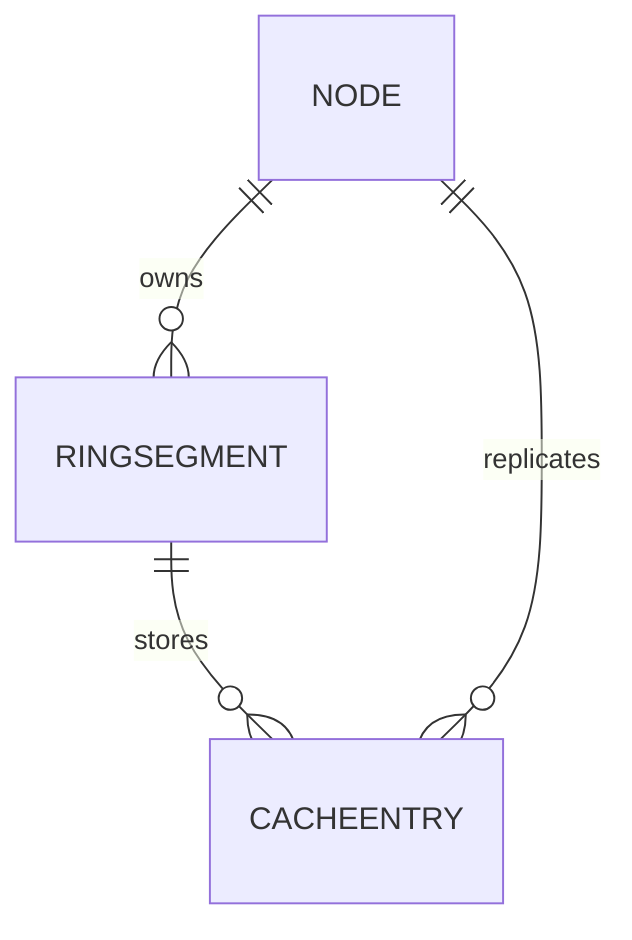
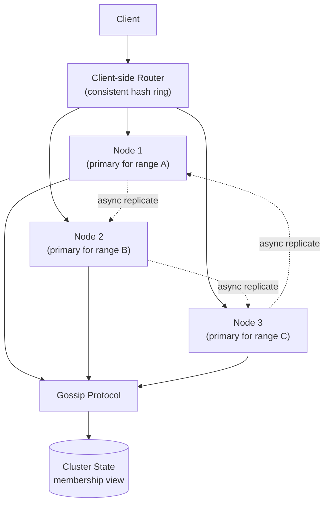
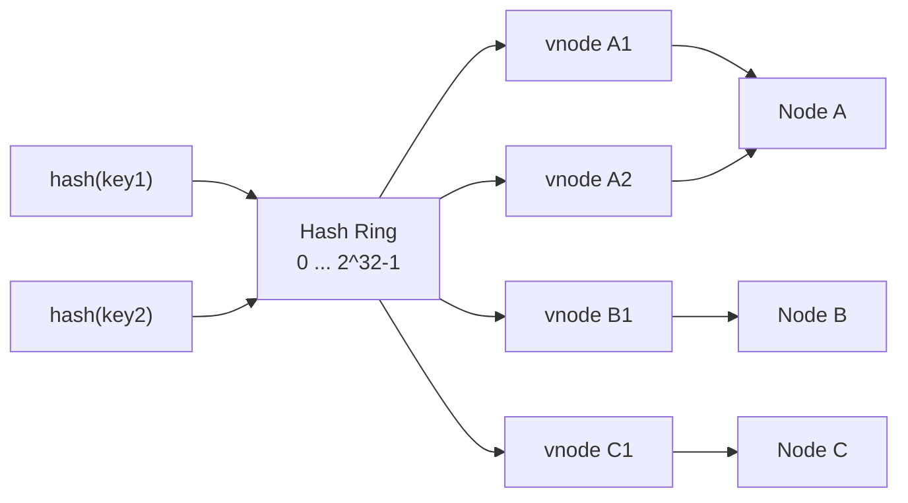
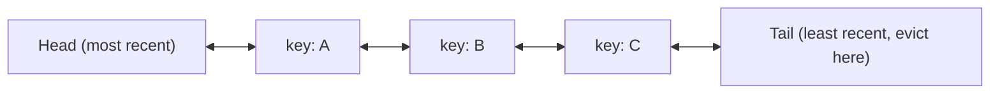

A distributed cache stores frequently-accessed key-value data in memory across many nodes, sitting in front of a slower database to absorb read traffic and cut latency. The interesting engineering is in the parts that make it *distributed* rather than just "Redis on one box" — how keys are routed to nodes, what happens when a node joins, leaves, or dies, and how eviction stays fast at millions of operations per second.

## Requirements

### Functional

- `GET key`, `SET key value [ttl]`, `DELETE key` with millisecond latency.
- Automatic eviction of least-recently-used entries when a node is at capacity.
- Data is distributed across many nodes; no single node holds the whole dataset.
- Nodes can be added or removed with minimal data movement and no downtime.
- Optional TTL-based expiration alongside capacity-based eviction.

### Non-functional

- p99 latency under ~1 ms for an in-memory hit.
- Horizontally scalable to terabytes of cached data across hundreds of nodes.
- Tolerates individual node failure without losing availability (some staleness or a small blip is acceptable; a full outage is not).
- Adding/removing a node should remap only a small fraction of keys, not the whole keyspace.
- Cache is best-effort — losing a node's data is not "data loss" in the durability sense, since the source of truth is the underlying database.

### Out of scope

- Being a system of record (this is a cache, not a database) — durability guarantees are intentionally weaker than the backing store's.
- Complex query capabilities beyond key-based access (no secondary indexes, no joins).
- The application-level cache-aside vs. write-through decision for every specific use case (touched on only for coherence).

> [!KEY]
> A distributed cache is defined by **how it shards and rebalances the keyspace, not by the fact that it stores key-value pairs in memory** — a single-node in-memory hash map is trivial; consistent hashing with virtual nodes, replication, and graceful membership changes are what actually make it a *distributed systems* problem.

## Scale estimation

| Metric | Estimate | Arithmetic |
|---|---|---|
| Total cached dataset | 10 TB | working set across all cached keys |
| Nodes in cluster | 200 | sized to fit dataset with headroom, e.g., 50 GB/node usable |
| Per-node capacity | ~64 GB RAM (50 GB usable after overhead) | typical cache-optimized instance |
| Operations/sec (cluster-wide) | 5 million ops/s | mixed GET/SET across all clients |
| Read:write ratio | ~20:1 | caches are typically read-dominated |
| Per-node QPS | ~25,000 ops/s | 5M ÷ 200 nodes, assuming even distribution |
| Replication factor | 2–3x | for availability on node failure |
| Effective storage with replication | ~20–30 TB raw | 10 TB × replication factor |
| Key remap on node add/remove (consistent hashing, no virtual nodes) | up to ~1/N of keyspace, but highly uneven | naive hashing remaps unevenly |
| Key remap with virtual nodes (e.g., 100–200 per physical node) | ~1/N of keyspace, evenly | this is the whole point of virtual nodes |

> [!TIP]
> Say the eviction budget out loud: *"At 25,000 ops/s per node with a p99 under a millisecond, eviction bookkeeping has to be O(1) per operation — anything that scans or sorts on access is disqualified immediately."*

## Core entities and data model

| Entity | Key fields |
|---|---|
| CacheEntry | key, value, ttl_expiry, size_bytes, lru_node_ref |
| Node | id, host, virtual_node_ids[], capacity, status (up/down/joining) |
| RingSegment | hash_range_start, hash_range_end, owning_node, replica_nodes[] |
| ClusterState | ring_version, member_list, last_gossip_at |



`CacheEntry` is not a durable row in a traditional sense — it lives entirely in a node's memory, indexed by a hash map for O(1) lookup and linked into a doubly linked list for O(1) LRU maintenance. `RingSegment` and `ClusterState` are the metadata that make routing and rebalancing possible.

## API design

```http
GET    /key/{k}          -> { value, ttlRemaining } | 404
PUT    /key/{k}          Body: { value, ttlSeconds }  -> 200 OK
DELETE /key/{k}          -> 200 OK
GET    /cluster/topology -> { ring: [...], nodes: [...] }   (internal/ops use)
```

In practice, clients talk to the cache via a lightweight binary protocol (like Redis's RESP) rather than HTTP for latency reasons, but the semantics are the same three operations. The important design detail is *how the client finds the right node*, covered below.

## High level architecture



Request flow:

1. A client wants to `GET`/`SET` a key; it (or a thin proxy layer) computes the key's position on the consistent hash ring and determines which node owns that range.
2. The request goes directly to that node — no central router or lookup service is in the hot path, which is what keeps latency at sub-millisecond levels.
3. On a hit, the node returns the value from its in-memory hash map immediately and touches the key's position in its LRU list.
4. On a `SET`, the primary node for that key's range writes it locally and asynchronously replicates it to the configured number of replica nodes for that range.
5. Every node participates in a gossip protocol, continuously exchanging lightweight membership/health information with a few random peers, converging the cluster's view of "who is up, who owns what" without a central coordinator.
6. When a node joins or leaves, the ring is updated (adding/removing that node's virtual nodes), and only the keys whose ranges shifted are migrated — the rest of the cluster is untouched.
7. If a client's cached view of the ring is stale (e.g., right after a membership change), it may briefly route to the wrong node, which detects the miss and can either redirect or return a "moved" response depending on the protocol design.

## Deep dive: consistent hashing with virtual nodes

Without consistent hashing, routing keys via `hash(key) % N` means adding or removing a single node changes the modulus and remaps almost every key — a catastrophic amount of cache invalidation on any topology change.



- **Consistent hashing**: place both nodes and keys on a hash ring (e.g., 0 to 2³²−1); a key belongs to the first node found walking clockwise from its hash position. Adding or removing one node only affects the keys between its neighbors on the ring — roughly `1/N` of the keyspace — instead of nearly all of it.
- **The uneven-load problem**: with only one point per physical node on the ring, load distribution is lumpy — some nodes end up owning much larger ring arcs than others purely by hash chance.
- **Virtual nodes**: each physical node is assigned many points on the ring (commonly 100–200), so its total owned range is the sum of many small, scattered arcs. This smooths load distribution close to even and means that when a node fails, its load is spread across many other nodes rather than dumped entirely onto one neighbor.

**The rebalancing math**: with `N` physical nodes and `V` virtual nodes each, adding one physical node (bringing the total to `N+1`) shifts approximately `1/(N+1)` of the total keyspace — and because virtual nodes scatter that node's share across the ring, the movement is drawn from many existing nodes roughly proportionally, not concentrated on one or two.

> [!TIP]
> Name the trade-off explicitly: *"More virtual nodes per physical node gives smoother load distribution and smaller, more evenly-spread rebalancing on membership change, at the cost of more ring metadata to maintain and propagate — 100 to 200 per node is a common sweet spot."*

## Deep dive: LRU eviction — the hashmap plus doubly linked list

Eviction has to be O(1) per access at these operation rates, which rules out anything that sorts or scans by recency.



- A **hash map** gives O(1) key lookup, mapping each key directly to its node in a **doubly linked list** that maintains recency order.
- On a `GET` or `SET` hit, the entry's node is unlinked from its current position and relinked at the head — O(1) because you already have a direct pointer to it via the hash map, no traversal needed.
- On eviction (capacity reached), the node at the tail is the least-recently-used entry — remove it in O(1) and free its slot.

```java
// Core operations are O(1): hashmap gives the node, list gives the order
public V get(K key) {
    Node<K, V> node = map.get(key);
    if (node == null) return null;
    list.moveToHead(node); // O(1): unlink + relink using existing pointers
    return node.value;
}

public void put(K key, V value) {
    Node<K, V> existing = map.get(key);
    if (existing != null) {
        existing.value = value;
        list.moveToHead(existing);
        return;
    }
    if (map.size() >= capacity) {
        Node<K, V> lru = list.removeTail(); // O(1): evict least recently used
        map.remove(lru.key);
    }
    Node<K, V> node = list.addToHead(key, value); // O(1)
    map.put(key, node);
}
```

**Approximate LRU at scale**: true LRU requires a lock (or careful lock-free design) around the linked-list pointer updates on *every* access, including reads — this becomes a serialization bottleneck at high concurrency. Redis's actual approach is **approximate LRU**: sample a small random set of keys (e.g., 5–10), evict the least-recently-used among just that sample, tracked via a lightweight access timestamp on each entry rather than a fully maintained global list. This trades perfect LRU ordering for much better concurrency, and in practice the sampled approximation evicts keys that are "recently unused enough" almost as well as true LRU.

| Approach | Accuracy | Concurrency cost | Used by |
|---|---|---|---|
| Exact LRU (hashmap + linked list) | Perfect recency order | Requires locking/synchronization on every access | Textbook implementation, single-threaded caches |
| Approximate LRU (random sampling) | Close approximation | No global lock needed; just a per-key timestamp | Redis at scale |
| Clock/second-chance | Approximate, cheap | Single bit per entry, no list maintenance | OS page caches |

## Deep dive: replication, hot keys, and client-side routing vs. proxy

- **Replication**: each key's range has a primary, replicated asynchronously to 2–3 total copies. Reads can be served from replicas to spread load, at the cost of possibly-stale reads; writes go to the primary. If the primary fails, a replica is promoted — the same failover pattern used in databases.
- **Hot key mitigation**: one very popular key (a viral post, a celebrity's profile) always maps to the same node regardless of virtual nodes, since consistent hashing is deterministic per key. Mitigate by explicitly replicating hot keys to extra nodes with client round-robin reads, or by caching the hottest keys locally at the client/edge to skip the distributed cache entirely.
- **Client-side routing vs. proxy**: clients computing the ring position themselves (Redis Cluster) skip a network hop but push ring/membership logic into every client. A proxy layer (Twemproxy) centralizes that complexity, at the cost of an extra hop and a new component that must itself scale and stay available.

| Approach | Latency | Complexity location | Failure mode |
|---|---|---|---|
| Client-side routing | Lowest (direct hop) | Every client needs ring/membership logic | A client with a stale ring view briefly misroutes |
| Proxy-based routing | +1 hop | Centralized in the proxy tier | Proxy becomes a new scaling/availability concern |

## Deep dive: cluster membership, gossip, and cache coherence with the database

- **Gossip protocol**: nodes periodically exchange membership/health state with a few random peers rather than a central coordinator; information propagates in O(log N) rounds and the cluster converges on a consistent view without a single point of failure for membership tracking.
- **Persistence options**: a cache can be purely in-memory (fastest, but a restart loses everything), or use periodic snapshotting (RDB-style) and/or an append-only log (AOF-style) for faster warm restarts — a durability-vs-speed trade-off, never a requirement, since the cache is never the system of record.
- **Cache coherence with the database**: cache-aside (app checks cache, falls back to DB on miss, populates cache) and write-through (writes go to cache and DB together, in lock-step, at the cost of write latency) are the two common patterns. Either way, a TTL bounds staleness even if an explicit invalidation is missed — distributed invalidation is itself a hard, best-effort problem.

> [!WARNING]
> Relying solely on explicit cache invalidation without a TTL safety net is a classic trap — a missed invalidation message (dropped network packet, a node that was briefly partitioned during the invalidation broadcast) means that key is wrong forever until it happens to be evicted or overwritten. Always set a TTL as a backstop.

## Bottlenecks and scaling

- **Hot keys** bypass sharding entirely since one key always maps to the same node(s) — solved via explicit hot-key replication/local caching, not by adding more nodes.
- **Rebalancing storms**: adding several nodes at once can trigger a large simultaneous data migration; stagger node additions and rate-limit migration traffic to avoid saturating network bandwidth.
- **Memory fragmentation**: long-running cache nodes with many small, varyingly-sized entries can suffer from allocator fragmentation; size-class allocation reduces this by grouping similarly-sized allocations together. Memcached exposes this as slab classes, while Redis relies on `jemalloc` size classes — similar motivation, different implementation details.
- **Gossip overhead at very large cluster sizes**: at hundreds to low thousands of nodes, gossip fan-out and convergence time need tuning (e.g., adjusting gossip interval and fan-out count) to avoid stale membership views lingering too long.

## Failure scenarios

| Failure | Blast radius | Mitigation |
|---|---|---|
| A single node dies mid-request | In-flight requests to that node fail; its keys are briefly unavailable | Client retries against a replica; gossip detects the failure and updates the ring within seconds |
| Network partition splits the cluster | Each side may believe it's the whole cluster | Prefer availability (serve from local view) since this is a cache, not a system of record; reconcile on partition heal |
| Hot key overwhelms its owning node | Latency spikes for just that key's traffic | Explicit hot-key replication across multiple nodes |
| Rebalancing after a node join causes a migration storm | Elevated latency cluster-wide during migration | Rate-limit migration traffic; stagger node additions |
| Cache and database go out of sync (missed invalidation) | Stale reads for the affected key | TTL as a backstop; write-through for consistency-sensitive data |

## Cheat sheet

- Consistent hashing bounds rebalancing to ~1/N of the keyspace on a topology change; virtual nodes (100–200/physical node) make that redistribution even, not lumpy.
- LRU eviction = hashmap (O(1) lookup) + doubly linked list (O(1) reorder/evict); at scale, use **approximate** LRU (random sampling) to avoid locking on every access.
- Replication factor of 2–3 for availability; async replication trades a small staleness window for write latency.
- Hot keys defeat sharding — they need explicit replication or local caching, not more shards.
- Client-side routing skips a hop but pushes ring logic to every client; a proxy centralizes complexity at the cost of a hop and a new component to scale.
- Gossip protocol converges cluster membership in O(log N) rounds without a central coordinator.
- Always back explicit cache invalidation with a TTL — invalidation messages can be lost.
- A cache is best-effort by design — prefer availability over consistency when a partition happens.

## Common mistakes

| Mistake | Fix |
|---|---|
| Using `hash(key) % N` for routing | Use consistent hashing so topology changes remap only ~1/N of keys |
| One point per node on the hash ring | Use 100–200 virtual nodes per physical node for even load |
| Maintaining exact LRU with a global lock at high concurrency | Use approximate LRU via random sampling, as Redis does |
| Assuming more shards fixes a hot key | Hot keys need explicit replication/local caching, not more shards |
| Relying only on explicit invalidation for cache coherence | Always set a TTL as a backstop |
| Treating a cache node failure as data loss | The cache is best-effort; the database remains the source of truth |

## Summary

A distributed cache is really a distributed-systems problem wearing a key-value interface: consistent hashing with virtual nodes bounds how much data moves on every topology change, an O(1) hashmap-plus-linked-list (or its approximate, lock-friendlier cousin) keeps eviction fast under massive concurrency, and gossip-based membership plus replication keep the cluster available through individual node failures. The subtler traps — hot keys that defeat sharding, invalidation messages that can be lost, and the client-routing-vs-proxy trade-off — are exactly what separates a "toy in-memory hash map" answer from a production-grade design.

## Top Interview Questions

### Q1. Why is consistent hashing preferred over simple modulo hashing (`hash(key) % N`) for routing keys to nodes?

With `hash(key) % N`, changing `N` — by adding or removing even one node — changes the result of that modulo operation for nearly every key, meaning almost the entire keyspace needs to be remapped and migrated, which is both extremely expensive and causes a massive, momentary spike in cache misses hitting the backing database. Consistent hashing places nodes and keys on a shared hash ring and assigns each key to the next node clockwise from its position; adding or removing a node only affects the keys in the ring range adjacent to that node, which is roughly `1/N` of the total keyspace, leaving the rest of the cluster's key ownership completely untouched. This is the property that makes horizontal scaling and node replacement practical operations rather than cluster-wide, disruptive events.

### Q2. What problem do virtual nodes solve, and how many would you use?

Even with consistent hashing, if each physical node has just one point on the ring, the size of the ring arc it owns is essentially random — some nodes get lucky and own a small arc (little load), others own a large one (heavy load), and there's no guarantee of even distribution, especially with a small number of nodes. Virtual nodes solve this by giving each physical node many points scattered around the ring (commonly 100–200), so its total ownership is the sum of many small, evenly-scattered arcs — this averages out to a much more even load distribution across physical nodes and also means that when a node fails, its load is spread thinly across many other nodes rather than dumped entirely onto whichever single neighbor happens to be next on the ring. The trade-off is more ring metadata to store and gossip about, which is a small cost relative to the load-balancing benefit at any meaningful cluster size.

### Q3. Walk through how you'd implement an O(1) LRU cache, and explain why both a hashmap and a linked list are needed.

A hashmap alone gives O(1) key lookup but no way to efficiently know which key was least recently used without scanning. A linked list alone can maintain recency order (move an accessed item to the head, evict from the tail) but finding a specific key's position in the list to move it would be O(n) without a lookup structure. Combining them: the hashmap maps each key directly to its node in a doubly linked list, so on any access you get O(1) node lookup via the hashmap, then O(1) unlink-and-relink to the head using the list pointers you already have — no traversal needed — and eviction is O(1) by simply removing whatever is at the tail. Both structures are needed because they solve complementary problems: fast lookup and fast reordering.

### Q4. Why does Redis use approximate LRU instead of exact LRU at scale?

Exact LRU requires updating the linked list's pointers on every single access, including reads, which means some form of synchronization (a lock, or careful lock-free bookkeeping) has to protect that shared list across concurrent operations — at very high throughput and concurrency, that synchronization becomes a serialization bottleneck that limits how many operations per second the cache can actually sustain. Redis instead samples a small random set of keys (configurable, often 5–10) on eviction and evicts whichever sampled key has the oldest access timestamp, using a lightweight per-key timestamp rather than a globally-maintained, lock-protected ordered structure. This sacrifices perfect recency ordering for a large concurrency win, and in practice the sampled approximation performs close to true LRU for real-world access patterns, which is a trade worth making at scale.

### Q5. How would you handle a single key becoming extremely hot (e.g., a viral post everyone is reading) in a consistently-hashed cache?

Consistent hashing (even with virtual nodes) always routes a given key to the same owning node(s), so no amount of sharding helps once traffic concentrates on one key — the fix has to target that key specifically. A common approach is to explicitly replicate that hot key to several additional nodes beyond its normal replica set and have clients round-robin their reads across all of those copies, spreading the load that would otherwise hit one node. Another complementary approach is a small local cache at the client or edge layer specifically for detected hot keys, so a large fraction of reads for that key never even reach the distributed cache tier. Detecting which keys are "hot" typically relies on lightweight access-frequency tracking (e.g., a count-min sketch) rather than exact counting, to keep the detection mechanism itself cheap.

### Q6. What happens if a cache node dies in the middle of a client's request, and how does the client recover?

The in-flight request to that node fails (timeout or connection error), and the client — aware of the cache's replication scheme — retries the same key against one of its replica nodes rather than treating the failure as fatal, since the cache is designed for exactly this kind of best-effort tolerance. Concurrently, the cluster's gossip protocol detects the node's absence (missed heartbeats/gossip rounds from its peers) and propagates an updated membership view across the cluster within a few gossip rounds, at which point the ring is updated to reflect the node's departure and, if configured, a replica for its owned ranges is promoted to primary. The client's local view of the ring may be briefly stale during this window, which is acceptable because the cache prioritizes availability — a transient miss or a retry against the wrong node briefly is a much smaller problem than the cache becoming unavailable.

### Q7. Compare client-side routing and proxy-based routing for a distributed cache. Which would you choose and why?

Client-side routing means every client computes the consistent-hash ring position for a key and talks directly to the node that owns it, which minimizes latency (no extra hop) but requires every client to embed ring-awareness logic and stay reasonably current on cluster membership changes, which adds complexity that's duplicated across every client application. Proxy-based routing puts a dedicated layer (like Twemproxy) between clients and the cache cluster that handles all routing and membership logic centrally, simplifying clients to "just talk to the proxy," but this adds a network hop to every request and introduces a new tier that itself needs to be highly available and horizontally scaled, or it becomes a bottleneck and single point of failure for the whole cache. For a latency-critical, high-throughput cache (which is the typical case), client-side routing is usually preferred despite the added client complexity, because sub-millisecond latency budgets don't have room for an extra hop; a proxy is more appealing when you have many heterogeneous client languages/teams and want to centralize cache logic rather than reimplement it everywhere.

### Q8. How would you keep the cache and the underlying database from drifting out of sync (cache coherence)?

The two standard patterns are cache-aside, where the application checks the cache first, falls back to the database on a miss, and populates the cache with the result (writes typically invalidate or update the relevant cache key directly), and write-through, where every write goes to the cache and database together as part of the same operation, keeping them continuously in lock-step at the cost of added write latency. Regardless of pattern, explicit invalidation messages can be lost — a network blip, a node that's briefly partitioned when the invalidation is broadcast — so a TTL should always be set as a backstop, bounding the maximum possible staleness even if an invalidation is missed, rather than relying purely on invalidation correctness. For data where staleness is especially costly (e.g., financial balances), write-through with a short TTL is a reasonable combination; for data that's expensive to compute but tolerant of brief staleness (e.g., a rendered page fragment), cache-aside with a longer TTL is usually sufficient.

### Q9. Why is a cache generally designed to prioritize availability over consistency during a network partition, unlike many databases?

A cache's entire purpose is to be a fast, best-effort accelerator in front of a system of record — the database — which means the cache losing a bit of consistency (serving a slightly stale value, or two partitioned halves of the cluster briefly disagreeing) is a far smaller problem than the cache becoming unavailable and forcing all traffic to fall through to the database, which could overwhelm it. Because the actual source of truth lives elsewhere and cached data is inherently expected to expire or go stale eventually via TTL, there's little value in sacrificing availability for strong consistency the way a primary database might need to for correctness-critical data. This is why caches typically favor an AP (available, partition-tolerant) stance in CAP terms, while the backing database they sit in front of may reasonably choose a CP (consistent, partition-tolerant) stance for its own guarantees.

### Q10. What is slab allocation and why does it matter for a cache holding millions of small, variably-sized entries?

A general-purpose memory allocator handling many small, arbitrarily-sized allocations and deallocations over a long-running process tends to fragment memory — freed blocks of odd sizes leave gaps that don't cleanly fit subsequent allocations, wasting memory and eventually causing higher miss rates as usable capacity shrinks even though total memory isn't full. Slab allocation addresses this by grouping memory into fixed-size classes (e.g., 64 bytes, 128 bytes, 256 bytes, growing by some factor) and allocating each entry into the smallest class that fits it; because all allocations within a class are the same size, freed slots can be reused immediately by any future allocation of that same class without fragmentation. The trade-off is some wasted space per entry (an entry needing 70 bytes placed in a 128-byte slab wastes 58 bytes), but this is a predictable, bounded cost compared to the unbounded, creeping fragmentation of a naive allocator, which is why both Memcached and Redis use slab-style allocation strategies.

### Q11. How would you extend this design to support multi-region caching for a globally distributed application?

The straightforward approach runs an independent cache cluster per region, each fronting a regionally-local (or regionally-replicated) copy of the backing database, so reads and writes for users in a given region stay low-latency within that region rather than crossing continents on every cache operation. Keeping the regional caches coherent with each other (as opposed to just with their own regional database) is the hard part — typically handled by relying on the underlying database's own cross-region replication to eventually propagate writes, while each region's cache independently uses its normal TTL/invalidation logic against its local database copy, accepting that a write in one region may take some time to be reflected in another region's cache. Trying to synchronously replicate cache invalidations across regions in real time reintroduces cross-region latency into the hot path, which defeats the purpose of regional caching in the first place — so most designs accept eventual consistency across regions and rely on TTLs to bound staleness, same as the single-region cache-coherence answer, just applied at a coarser geographic grain.

### Q12. A client reports it received a value for a key that should have just been deleted. How do you debug this in a replicated, distributed cache?

First check whether the delete and the read that returned stale data hit the same node — if the delete was sent to (or replicated to) a different node than the one the read hit, and replication is asynchronous, there's a window where a replica hasn't yet applied the delete; this is expected, bounded staleness rather than a bug, and the fix (if unacceptable for this use case) is to route reads for consistency-sensitive keys to the primary rather than replicas. If both requests genuinely hit the same node, check whether the client's ring view was stale at the time of either request — a recent membership change could mean the "delete" and the later "read" landed on different physical nodes despite the client believing it was targeting the same one, which points at a gossip-propagation-lag or client-ring-refresh-interval issue rather than a caching logic bug. Finally, confirm the delete didn't silently fail (e.g., swallowed timeout, fire-and-forget without checking the response) before assuming it's a replication or routing problem at all.
