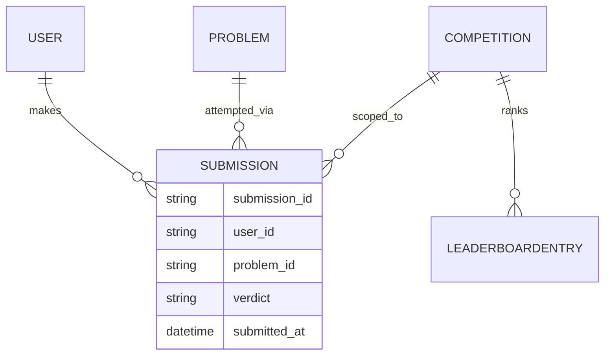
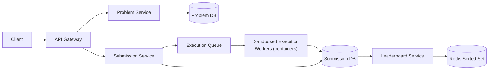

An online judge lets engineers browse coding problems, write and submit a solution in the language of their choice, get instant pass/fail feedback, and compete on a live leaderboard during timed contests. The defining challenge is running arbitrary, untrusted user code safely and quickly, at a volume that spikes hard the moment a popular contest starts.

## Requirements


### Functional

- Users can browse a paginated list of coding problems.
- Users can view a problem's statement and write a solution in their chosen language.
- Users can submit a solution and receive pass/fail feedback against test cases quickly.
- Users can view a live leaderboard during a coding competition.

### Non-functional

- User-submitted code must run in complete isolation — no access to the host, network, or other users' data.
- Submission feedback should feel close to instant (seconds, not minutes).
- The system must scale to competitions with 100,000 concurrent participants.
- Leaderboard reads must stay fast even as a competition's submission volume climbs.

### Out of scope

- Problem authoring/editorial tooling for content creators.
- Payment/subscription tiers.
- Discussion forums and solution-sharing features.

## Scale estimation

| Metric | Assumption | Working | Result |
|---|---|---|---|
| DAU | given | given | 5M |
| Problem views / user / day | 5 avg | 5M × 5 | 25M views/day |
| Submissions / user / day | 3 avg | 5M × 3 | 15M submissions/day |
| Read QPS (avg) | 25M / 86,400s | 25,000,000 / 86,400 | ~290/sec |
| Read QPS (peak) | 4× average | 290 × 4 | ~1,160/sec |
| Write QPS (avg, submissions) | 15M / 86,400s | 15,000,000 / 86,400 | ~175/sec |
| Write QPS (peak, contest burst) | 5× average | 175 × 5 | ~875/sec |
| Read : write ratio | 290 : 175 | — | ~1.7 : 1 |
| Peak concurrent contest participants | given | given | 100,000 |
| Submission storage/day | 15M × 5KB | 15,000,000 × 5KB | ~75GB/day |

> [!TIP]
> Unlike a feed or search system, reads and writes here are close to balanced (~1.7:1) — viewing a problem and submitting a solution happen at similar frequency for an active user. That's a hint that the system's real bottleneck isn't database read/write skew; it's the CPU-bound, isolated code-execution step sitting between "submit" and "feedback."

## Core entities and data model

| Entity | Key fields |
|---|---|
| `Problem` | `problem_id`, `title`, `statement`, `difficulty`, `test_cases` |
| `Submission` | `submission_id`, `user_id`, `problem_id`, `code`, `language`, `verdict`, `submitted_at` |
| `Competition` | `competition_id`, `name`, `start_time`, `end_time`, `problem_ids` |
| `LeaderboardEntry` | `competition_id`, `user_id`, `num_solved`, `last_solve_time` |




`Submission` stores the verdict as a first-class field rather than deriving it on read, since it's produced once by the execution pipeline and never changes afterward — every leaderboard and history query reads it directly instead of recomputing anything.

## API design

```http
GET /problems?page=1&limit=100 -> Partial<Problem>[]

GET /problems/:id?language={language} -> Problem

POST /problems/:id/submit -> Submission
{
  code: string,
  language: string
}
// userId is not passed in the request body — the user is authenticated
// and the userId is derived from their session.

GET /leaderboard/:competitionId?page=1&limit=100 -> Leaderboard
```

## High level architecture



1. A client requests a problem; the problem service returns its statement, constraints, and starter code for the requested language.
2. The client submits code; the submission service persists it with `verdict: pending` and enqueues an execution job rather than running it inline.
3. A pool of sandboxed execution workers pulls jobs from the queue, runs the code against the problem's test cases in an isolated container, and writes the resulting verdict back to the submission record.
4. The client polls (or subscribes) for the submission's verdict to update from `pending` to `passed`/`failed`.
5. During a competition, each accepted (`passed`) submission updates a Redis sorted set backing that competition's leaderboard, so leaderboard reads never touch the primary database directly.

### Users should be able to view a list of coding problems


### Users should be able to view a given problem and code a solution


### Users should be able to submit their solution and get instant feedback

Submissions run inside isolated Docker containers, one per submission, so untrusted code never touches the host or other users' data.


An alternative is running submissions as serverless functions (AWS Lambda, Azure Functions) — small, stateless functions invoked per submission. The tradeoff is the cold-start problem: a function that hasn't run recently pays a startup latency penalty that directly hurts the "instant feedback" requirement, which containers with a warm pool avoid.

### Users should be able to view a live leaderboard for competitions

A live leaderboard is fundamentally a ranking query over accepted submissions for a competition:

```sql
SELECT userId, COUNT(DISTINCT problemId) as numSolvedProblems, MIN(submittedAt) as lastSolveTime
FROM submissions
WHERE competitionId = :competitionId AND passed = true
GROUP BY userId
ORDER BY numSolvedProblems DESC, lastSolveTime ASC
```


## Deep dive: isolating and securing untrusted code execution

Running arbitrary user-submitted code is the platform's core security risk. Each execution container applies several restrictions at once: a **read-only file system** so code can't tamper with itself or other data, **limits on CPU and memory** so one submission can't starve others on the same host, **explicit timeouts** so an infinite loop doesn't hang a worker indefinitely, **limited network access** so submitted code can't exfiltrate data or attack other services, and **no system calls** beyond what's strictly needed to execute the program, closing off the most common sandbox-escape vector.

> [!DANGER]
> Any one of these controls missing is a real security hole, not a theoretical one — a missing network restriction alone turns "run untrusted code" into "give untrusted code a foothold on your network."

## Deep dive: making leaderboard reads efficient

Recomputing the ranking `SELECT` above against the full submissions table on every leaderboard view doesn't scale once a competition has meaningful submission volume. A cache refreshed by a periodic cron job is simple but adds staleness and refresh overhead. The better approach is a **Redis sorted set with periodic polling**: leaderboard standings are stored as a sorted set keyed by score (problems solved, tie-broken by solve time), updated incrementally whenever a submission's verdict flips to `passed`, and clients poll the sorted set — an O(log N) structure purpose-built for ranked reads — rather than the database.


## Deep dive: scaling to 100,000-user competitions

At contest start, submission volume spikes sharply as thousands of participants submit within the same minute. The execution pipeline handles this with **dynamic horizontal scaling backed by queues**: the execution queue absorbs the burst so submissions are never dropped or executed inline under load, and the worker pool autoscales based on queue depth, adding execution capacity precisely when contest traffic demands it and scaling back down afterward.


> [!KEY]
> The queue is what turns a submission burst into a temporarily longer "pending" window instead of a system failure — decoupling submission acceptance from submission execution is the single most important design choice for surviving a contest start.

## Deep dive: running test cases across many languages

Each problem's test cases are authored once, independent of language, and the execution pipeline serializes inputs and deserializes outputs per runtime — so a Python submission and a Java submission for the same problem run against identical logical test data, just marshaled into each language's native types before execution and compared back in a language-agnostic form afterward. This avoids duplicating test case authoring per supported language.

## Bottlenecks and scaling

- **Execution worker capacity** — the sandboxed execution step is CPU-bound and the true throughput bottleneck; autoscale aggressively on queue depth around contest start times.
- **Cold-start latency (if using serverless execution)** — keep a warm pool of pre-initialized containers/functions for popular languages to avoid the "instant feedback" requirement being violated by cold starts.
- **Leaderboard update contention** — many participants solving the same problem near-simultaneously all update the same sorted set; Redis sorted set operations are efficient for this, but monitor for hot-key contention on very large single-competition leaderboards.
- **Problem/test-case storage growth** — test case data can be large for some problems (e.g. large inputs for performance-testing); store test case payloads in object storage, referenced by ID, rather than inline in the problem record.

## Failure scenarios

| Failure | Blast radius | Mitigation |
|---|---|---|
| Execution worker pool down | Submissions stuck at `pending` | Queue durably buffers submissions; workers catch up on the backlog once restored, no submissions lost |
| Leaderboard cache (Redis) down | Live leaderboard unavailable or stale | Fall back to a direct (slower) database query for the ranking; competition submission/verdict flow is unaffected |
| Submission database write failure | A verdict fails to persist | Execution worker retries the write; client-visible "pending" state until it succeeds |
| A malicious submission attempts a sandbox escape | Contained to a single execution container | Read-only filesystem, resource limits, and no-network policy contain the blast radius to that one container, which is destroyed after execution regardless |

## Cheat sheet

- Never execute untrusted code inline on the request path — always through a queue and an isolated worker.
- Sandbox every execution: read-only filesystem, CPU/memory limits, timeouts, no network, no unnecessary syscalls.
- Serverless execution trades operational simplicity for cold-start latency — weigh that against the "instant feedback" requirement.
- Store the submission verdict once, at execution time; never recompute it on read.
- Back live leaderboards with a Redis sorted set, updated incrementally on each accepted submission, not a live aggregate query.
- Autoscale the execution worker pool on queue depth specifically around contest start times, when submission bursts are predictable.

## Common mistakes

| Mistake | Fix |
|---|---|
| Executing submitted code synchronously on the request thread | Enqueue it; run execution asynchronously in isolated workers, return a `pending` submission immediately |
| Running user code without resource limits or network restrictions | Apply CPU/memory limits, timeouts, no network, read-only filesystem to every execution container |
| Recomputing the leaderboard ranking query on every page view | Maintain a Redis sorted set updated incrementally as submissions are accepted |
| Provisioning a fixed execution worker pool sized for average load | Autoscale on queue depth so contest-start bursts don't overwhelm capacity |
| Authoring separate test cases per supported language | Author test cases once; serialize/deserialize per-language at execution time |

## Summary

An online judge's hardest problem isn't storage or reads — it's safely and quickly executing code you don't trust, at a volume that spikes the instant a contest opens. Isolating execution in resource-limited, network-restricted containers behind a durable queue is what makes untrusted-code execution both safe and resilient to bursts, and autoscaling that worker pool on queue depth is what survives 100,000 concurrent contest participants. On the read side, a Redis sorted set turns leaderboard ranking from an expensive aggregate query into an O(log N) structure built for exactly this access pattern.

## Final design


## Top Interview Questions

### Q1. Why should submission execution never happen synchronously on the request path?

Running arbitrary user code takes an unpredictable amount of time, and a request thread blocked on it ties up API capacity for as long as the slowest submission takes — worse, a malicious or buggy infinite-loop submission could hang that thread indefinitely. Enqueueing the submission and returning a `pending` status immediately decouples "accepting a submission" from "executing it," letting the execution worker pool scale independently and absorb bursts (like a contest start) without submissions being rejected or the API becoming unresponsive.

### Q2. What specific isolation controls does a code execution sandbox need, and why each one?

A read-only filesystem prevents submitted code from tampering with the execution environment or any other data. CPU and memory limits prevent one submission from starving others sharing the host. Explicit timeouts stop infinite loops or pathologically slow code from hanging a worker indefinitely. Restricted network access prevents submitted code from exfiltrating data or attacking other services. Blocking unnecessary system calls closes off the most common route for a sandbox escape. Each control addresses a distinct attack or failure mode; removing any one leaves a real gap, not a redundant safeguard.

### Q3. Containers vs. serverless functions for running submissions — what's the tradeoff?

Containers, run in a pre-warmed pool, give predictable low-latency execution because a worker is already initialized and ready when a job arrives. Serverless functions (Lambda, Azure Functions) are simpler to operate and scale automatically, but a function that hasn't been invoked recently pays a cold-start penalty — the time to initialize a fresh execution environment — which can directly violate an "instant feedback" requirement for whichever submissions land on a cold instance. The choice comes down to whether you can tolerate occasional cold-start latency spikes in exchange for simpler infrastructure, or whether you need the more consistent latency of a maintained warm pool.

### Q4. Why maintain a Redis sorted set for the leaderboard instead of querying the submissions table directly?

The leaderboard ranking query groups and orders across potentially millions of submission rows for a large competition — expensive to run on every page view, and the load only grows as more participants submit. A Redis sorted set keeps each participant's score (problems solved, tie-broken by solve time) as a native ranked structure, updated incrementally whenever a submission's verdict becomes `passed`. Reading the top N or a specific user's rank from a sorted set is O(log N), dramatically cheaper than re-aggregating the full submissions table on every request.

### Q5. How does the system stay responsive when a popular contest starts and thousands of submissions arrive within the same minute?

The execution queue absorbs the burst — submissions are accepted and durably queued immediately regardless of how fast they can be executed, so nothing is rejected or lost. The execution worker pool autoscales based on queue depth, adding capacity as the backlog grows and shedding it afterward. The user-visible effect of a burst is a temporarily longer `pending` window for feedback, not failed submissions or a degraded API.

### Q6. Why is the submission's verdict stored once, at execution time, rather than computed on each read?

The verdict (`passed`/`failed`) is the outcome of running the code against a fixed set of test cases — a single well-defined computation that doesn't change afterward. Storing it once means every subsequent read (submission history, leaderboard aggregation) is a cheap field lookup instead of re-running or re-deriving the result. It also makes the leaderboard query itself efficient, since it can filter directly on `passed = true` without invoking any execution logic.

### Q7. How does the platform support multiple programming languages without duplicating test case authoring per language?

Test cases are authored once per problem, independent of language, as logical input/output pairs. At execution time, the pipeline serializes the logical inputs into the submitted language's native types, runs the user's code, and deserializes the output back into a language-agnostic form for comparison against the expected result. This means adding support for a new language is a matter of writing a serialization/deserialization adapter, not re-authoring every problem's test data.

### Q8. What happens if the leaderboard cache goes down during an active competition — does the whole system fail?

No — the leaderboard cache failing degrades one read path, not the submission pipeline. Submissions continue to be accepted, queued, executed, and recorded with their verdicts in the submission database as normal. The leaderboard service falls back to running the (slower) direct aggregation query against that database until the cache recovers, so participants can still see standings, just with higher latency, rather than losing leaderboard functionality entirely.

### Q9. How would you prevent a single user from monopolizing execution capacity with a flood of submissions?

Rate-limit submissions per user at the API layer, independent of the execution queue's own capacity — this bounds how much of the shared execution resource pool any one user can consume regardless of contest traffic. This is a distinct concern from the per-submission CPU/memory/timeout limits enforced inside each sandbox: those bound a single execution's resource use, while a per-user rate limit bounds how many concurrent or per-minute submissions that user can push into the queue in the first place.

### Q10. Why store large test-case payloads in object storage rather than directly on the `Problem` record?

Some problems (particularly performance/stress-testing problems) can have test inputs large enough that embedding them directly in a relational row bloats that table and slows down ordinary problem-metadata reads that don't need the test data at all — like browsing the problem list. Storing test case payloads in object storage, referenced from the `Problem` record by an ID, keeps problem metadata reads lightweight and lets test data scale independently, fetched only by the execution workers that actually need it.
