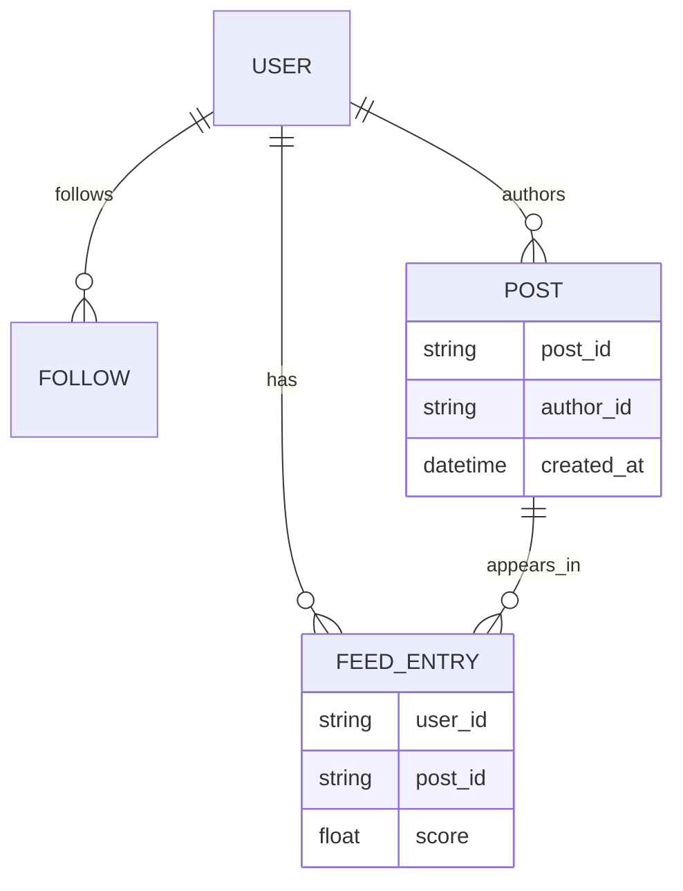
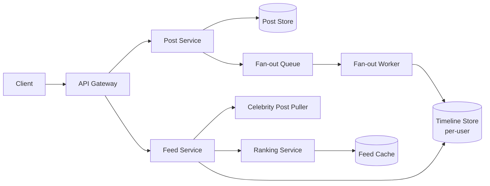
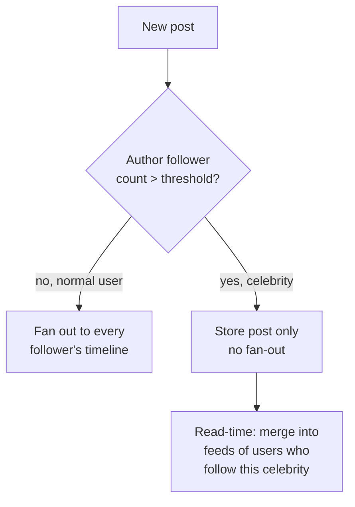

A news feed shows each user a ranked stream of posts from the people they follow. The core tension is that writing a post is cheap, but delivering it to millions of followers instantly is not — and the answer changes completely once one account can have tens of millions of followers.

## Requirements

The product surface here is deceptively simple to sketch on a whiteboard — post, follow, and a ranked feed:


### Functional

- Users can create posts (text, image, video) and follow/unfollow other users.
- Users can view a feed of posts from people they follow, ranked or chronological.
- The feed supports pagination as the user scrolls.
- New posts should appear in followers' feeds within a reasonable delay (seconds, not real-time-critical).

### Non-functional

- Feed reads should be fast, target under 200ms p99.
- Read-heavy: users check their feed far more often than they post.
- Eventual consistency is acceptable — a post appearing a few seconds late is fine; availability matters more than strict consistency.
- Must handle a small number of accounts with tens of millions of followers ("celebrities") without degrading the system for everyone else.

### Out of scope

- Direct messaging/chat.
- Stories/ephemeral content.
- Ads ranking and auction logic.

## Scale estimation

| Metric | Assumption | Working | Result |
|---|---|---|---|
| DAU | given | given | 500M |
| Posts per user per day | 0.5 avg | 500M × 0.5 | 250M posts/day |
| Write QPS (avg) | 250M / 86,400s | 250,000,000 / 86,400 | ~2,900 writes/sec |
| Write QPS (peak) | 3× average | 2,900 × 3 | ~8,700 writes/sec |
| Feed reads per DAU/day | ~10 checks/day | 500M × 10 | 5B reads/day |
| Read QPS (avg) | 5B / 86,400s | 5,000,000,000 / 86,400 | ~58,000 reads/sec |
| Read QPS (peak) | 3× average | 58,000 × 3 | ~175,000 reads/sec |
| Post storage | 500 bytes/post | 250M × 500B | 125GB/day (~45TB/year) |
| Precomputed timeline cache | 500M users × 800 entries × 20B | 500M × 800 × 20B | ~8TB |

> [!TIP]
> Flag the celebrity problem here, before the deep dive: "average follower count is a few hundred, but the *maximum* is tens of millions — the design has to handle both without one breaking the other." That single sentence sets up the hybrid fan-out answer.

## Core entities and data model

| Entity | Key fields |
|---|---|
| `User` | `user_id`, `username`, `follower_count` |
| `Follow` | `follower_id`, `followee_id`, `created_at` |
| `Post` | `post_id`, `author_id`, `content`, `media_url`, `created_at` |
| `FeedEntry` | `user_id` (owner of the feed), `post_id`, `score`, `inserted_at` |



## API design

Following is modeled as a simple directed edge, but at scale it's backed by a secondary index so "who does X follow" and "who follows X" are both cheap lookups — in a DynamoDB-style store this is a Global Secondary Index (GSI), automatically maintained so the reverse-lookup direction never needs a table scan:


```http
POST /posts
{ "content": "...", "media_url": "optional" }
-> 200 { "postId": "p_123" }

PUT /users/{id}/follow
-> 200 OK

DELETE /users/{id}/follow
-> 200 OK

GET /feed?pageSize=20&cursor={opaque_cursor}
-> 200 { "items": [Post, ...], "nextCursor": "..." }
```

## High level architecture



**Post creation flow:** (1) client submits a post, (2) post service persists it and stores media in object storage/CDN, (3) the post ID is pushed to a fan-out queue, (4) a worker pool reads the queue and writes the post ID into the precomputed timeline of each follower for authors under a follower-count threshold; authors above that threshold are stored only and merged into feeds at read time. Drawn end to end, that path looks like this:


**Feed read flow:** (1) client requests the feed with a cursor, (2) feed service reads the user's precomputed timeline entries, (3) it separately pulls recent posts from any celebrity accounts the user follows (not precomputed), (4) it merges both sets, ranks them, and returns a page plus an opaque cursor for the next page. The equivalent read-side sketch:


## Deep dive: fan-out on write vs read vs hybrid

The base mechanism is fan-out on write: on post creation, a worker precomputes each follower's feed entry and stores it immediately, so a later read is just a lookup.


| Strategy | Post creation cost | Feed read cost | Breaks down when |
|---|---|---|---|
| Fan-out on write (push) | O(followers) writes per post | O(1) — just read the precomputed timeline | Author has millions of followers |
| Fan-out on read (pull) | O(1) — just store the post | O(followees) — merge posts from everyone you follow, live | User follows thousands of accounts |
| Hybrid | O(followers) for normal accounts, O(1) for celebrities | O(1) precomputed + O(celebrities followed) live pull | Rare edge cases only |

**The math that justifies hybrid:** with 500M users averaging ~200 followers each posting 0.5 times/day, pure fan-out-on-write costs roughly `250M posts × 200 followers ≈ 50B fan-out writes/day`. Now add just 50,000 celebrity accounts (0.01% of users) averaging 5M followers each, posting once a day: `50,000 × 5,000,000 = 250B fan-out writes/day` — five times the volume of the *entire rest of the platform*, from a tiny fraction of accounts. Fanning out a single celebrity post also means one write burst of millions of operations at once, which no queue or timeline store absorbs gracefully.



> [!KEY]
> The hybrid model sets a follower-count threshold (e.g. 10,000): below it, fan-out-on-write keeps reads cheap for the vast majority of accounts; above it, fan-out-on-read avoids the write explosion. This bounds the worst case at the cost of a slightly more complex read path.

Scaling the "many followers" case follows a progression worth naming explicitly in an interview: querying the database live on every feed read is the naive approach and collapses under real traffic; dedicating a pool of async workers to precompute each follower's feed off a queue is a solid middle step, but still creates heavy overhead on that worker pool the moment a single post has to fan out to millions of timelines at once —


— which is exactly the overhead the hybrid model above sidesteps by never fanning out celebrity posts in the first place:


## Deep dive: feed ranking

| Signal | Example | Why it matters |
|---|---|---|
| Recency | time since posted | Freshness is the baseline expectation |
| Affinity | how often you interact with this author | Predicts relevance better than pure chronology |
| Engagement prediction | ML score for likelihood of like/comment | Drives session time, the usual product goal |
| Content type diversity | avoid 10 videos in a row from one author | Perceived feed quality |

A simple, explainable starting point is a weighted score: `score = w1·recency_decay + w2·affinity + w3·predicted_engagement`. Chronological order is the fallback used at low affinity signal (new users) or as an A/B control group.

## Deep dive: timeline storage and pagination

Each user's precomputed timeline is a sorted structure (e.g. a Redis sorted set keyed by user ID, scored by rank/timestamp), trimmed to the most recent ~800 entries — old enough that nobody scrolls that far, capping memory per user. Pagination uses a cursor encoding the last-seen `(score, post_id)` pair rather than an offset, because offset pagination breaks when new posts are inserted mid-scroll (items shift, causing duplicates or skips); cursor pagination is stable regardless of concurrent writes.

> [!WARNING]
> Feed entries store `post_id` and a score only, never the full post content. Otherwise, every fan-out write duplicates the post body across millions of timelines, and editing or deleting a post requires updating it everywhere. Post content lives once in the post store/cache; timelines are just pointers.

## Deep dive: caching and media

Two separate caches serve two purposes: a **feed cache** (per-user ranked post-ID lists, short TTL, invalidated on new activity) and a **post content cache** (post-ID to rendered content, shared across all users viewing that post, high hit rate since popular posts are read by many). Media (images/video) is uploaded to object storage and served through a CDN with pre-generated thumbnails; the feed only ever stores a media URL, never the bytes.

A single large post-content cache with one big keyspace sounds sufficient, but a viral post can turn its key into a hotspot that overwhelms the one cache node serving it. The fix is a **redundant post cache**: shard the keyspace and replicate each shard across multiple instances with an LRU eviction policy, so a hot post's reads spread across replicas instead of hammering one node:


Assembled together — post store, fan-out queue, timeline store, ranking, and the sharded post cache — the system looks like this:


## Bottlenecks and scaling

- **Fan-out queue backpressure** — partition the queue by author so one celebrity posting doesn't block fan-out for everyone else; workers scale horizontally per partition.
- **Timeline store hot keys** — a user who follows many active accounts gets frequent writes to their timeline; shard by user ID so this stays localized.
- **Ranking service latency** — precompute or cache ranking features (affinity scores) rather than recomputing from raw interaction history on every request.
- **Freshness vs cost** — precomputed timelines can lag by seconds; batch-refresh less-active users' feeds less frequently to save compute, refresh highly active users near-real-time.

## Failure scenarios

| Failure | Blast radius | Mitigation |
|---|---|---|
| Fan-out worker pool down | New posts stop appearing in precomputed timelines | Queue buffers messages; feed service temporarily falls back to a live pull merge for affected users |
| Timeline store shard down | Some users see stale/empty feeds | Replica promotion; degrade to chronological-only ranking if ranking data is also affected |
| Ranking service down | Feed quality drops | Fall back to reverse-chronological ordering — never block the feed entirely on ranking |
| Celebrity post puller down | Celebrity posts missing from feeds | Regular (precomputed) content still renders; celebrity posts backfill once the puller recovers |

## Cheat sheet

- Fan-out on write for normal accounts, fan-out on read for celebrities, merged at read time — this is the hybrid model.
- Do the math on total fan-out writes; a handful of celebrity accounts can dominate write volume.
- Timeline entries store pointers (post ID + score), never full content — content lives once, in its own cache.
- Cursor-based pagination, not offset — offsets break under concurrent inserts.
- Fall back to chronological ordering if ranking is unavailable; never block the feed on it.
- Trim precomputed timelines to a bounded size (~800 entries); nobody scrolls further.
- Treat freshness as tunable: refresh active users' feeds more often than idle ones.

## Common mistakes

| Mistake | Fix |
|---|---|
| Always fan out on write regardless of follower count | Celebrity accounts create a write storm; add a threshold and pull for large accounts |
| Storing full post content inside every follower's timeline entry | Store `post_id` + score only; keep content in one shared store |
| Offset-based pagination (`page=3&size=20`) | Use a cursor encoding the last seen score/ID |
| Making the feed read block on a live ranking model call | Cache/precompute ranking features; degrade to chronological on ranking failure |
| Treating the feed as strongly consistent | Design for eventual consistency; a post appearing a few seconds late is acceptable |

## Summary

A news feed is a fan-out and ranking problem more than a storage problem. Precompute timelines for the common case (fan-out on write) because it makes reads trivially cheap, but pull live for celebrity accounts because the write cost of fanning out to millions of followers on every post is prohibitive — the math on follower distribution is what makes this trade-off obvious rather than arbitrary. Layer ranking, cursor pagination, and separate content/timeline caches on top, and always have a chronological fallback.

## Top Interview Questions

### Q1. Explain fan-out on write vs fan-out on read, and when each is efficient.

Fan-out on write (push model) does the work at post time: when a user posts, the system writes that post's ID into the precomputed timeline of every follower, so reading a feed later is just a fast lookup — `O(1)` relative to follower count. Fan-out on read (pull model) does the work at read time: nothing happens at post time beyond storing the post, but reading a feed means querying and merging recent posts from every account the user follows, which is `O(followees)`. Push is efficient when accounts have a bounded, modest number of followers, since read latency stays low; pull is efficient when an account has an enormous follower count, since it avoids writing the post to millions of timelines that may never even be read again.

### Q2. What is the "celebrity problem" and how does it break a pure fan-out-on-write design?

A celebrity account can have tens of millions of followers. Under pure fan-out-on-write, a single post from that account triggers tens of millions of timeline writes, all at once — a write amplification spike that can overwhelm the fan-out queue and timeline store, and takes potentially minutes to fully propagate, versus milliseconds for a normal user's post. Worse, a handful of such accounts posting regularly can dominate total system write volume even though they're a tiny fraction of all users, as the math shows: 50,000 celebrity accounts averaging 5M followers can generate more daily fan-out writes than 500M regular users combined.

### Q3. How does the hybrid fan-out model work, and what threshold would you use to decide push vs pull?

Set a follower-count threshold (e.g. 10,000, tunable based on real write-volume data). Accounts below it use fan-out on write, keeping the common case's reads cheap. Accounts above it skip fan-out entirely — their posts are only stored, not pushed — and the feed service pulls their recent posts live at read time, merging them with the user's precomputed timeline. This bounds the worst-case write cost to a manageable "pull a handful of celebrity accounts' latest posts" operation on read, rather than a multi-million-write burst on post.

### Q4. Why use cursor-based pagination instead of offset-based (page number) pagination for a feed?

Offset pagination (`LIMIT 20 OFFSET 40`) assumes the underlying list is stable between requests. In a feed, new posts are constantly inserted at the top; if a user is on page 2 and ten new posts arrive, everything shifts down, causing the next "page 3" request to return duplicates of what they already saw, or skip items entirely. A cursor encodes a stable position — typically the last-seen `(score, post_id)` pair — so "give me items after this cursor" stays correct regardless of how many new items were inserted above it, since it doesn't depend on absolute position in the list.

### Q5. How would you design the feed ranking, and what do you do if the ranking service is slow or down?

Combine a few signals into a score: recency (freshness decays over time), affinity (how often the viewer interacts with that author), and a predicted-engagement score from a model trained on likes/comments/shares. This produces a ranked, not purely chronological, feed. Critically, ranking should never be a hard dependency for serving a feed at all — if the ranking service is slow or unavailable, fall back to reverse-chronological ordering of the same candidate posts. This keeps the product usable during a ranking outage instead of returning an error or a blank feed.

### Q6. Why should feed entries store only a post ID and score, not the full post content?

If every follower's timeline entry stored the full post body, a single post from an account with a million followers would duplicate that content a million times across storage — wasteful, and a nightmare to keep consistent if the post is edited or deleted (a million writes to fix one typo). Instead, timeline entries are lightweight pointers (`post_id`, `score`, `inserted_at`); the feed read path resolves those IDs against a single shared post-content store/cache. This keeps fan-out writes cheap and makes edits/deletes a single-location update.

### Q7. How do you keep the precomputed timeline store from growing unbounded per user?

Trim each user's precomputed timeline to a bounded size, e.g. the most recent 800–1,000 entries, evicting the oldest when the cap is exceeded. This is a safe trade because almost no user scrolls back further than that in a session; if they do, the read path can fall back to a slower, on-demand query against the durable post store rather than keeping unbounded history hot in the timeline cache.

### Q8. A user follows 3,000 accounts, several of which are celebrities. Walk through how their feed is generated.

The feed service starts with the user's precomputed timeline, which already contains posts from the (up to the threshold) regular accounts they follow, fanned out on write. Separately, it identifies which of the followed accounts are celebrities (above the fan-out threshold) and issues a live query to pull each of their most recent posts. It merges the precomputed entries and the freshly pulled celebrity posts into one candidate set, runs them through the ranking function, and returns the top page along with a cursor. The number of celebrities any one user follows is typically small, so this live-pull step stays cheap even though the celebrities themselves have huge follower counts.

### Q9. How would you handle a user unfollowing someone — does anything need to change in their existing timeline?

Nothing needs to happen immediately or synchronously; the timeline already contains post IDs from that author, and letting them age out naturally (via the bounded-size trim, or simply not fanning out that author's future posts) is acceptable given the eventual-consistency tolerance of a feed. If strict correctness is required (e.g. compliance reasons for blocking rather than unfollowing), a background job can scan and purge entries by author, but this is rarely necessary for a standard unfollow.

### Q10. How would you support "why am I seeing this post" transparency or a strictly chronological feed toggle, given the ranking pipeline?

Keep the candidate-generation step (precomputed timeline + celebrity pull) separate from the ranking step, and expose an option to skip ranking and sort candidates purely by timestamp. Because ranking is already a distinct, swappable stage in the pipeline rather than baked into candidate generation, adding a "most recent" mode is a matter of choosing a different sort function on the same candidate set — no change needed to fan-out or storage.

### Q11. How does the system handle a burst of posts around a major real-time event (e.g. a live sports final) where millions of users post and refresh simultaneously?

Both write and read volume spike together. On the write side, the fan-out queue should be partitioned (e.g. by author) so bursty posting doesn't create a single bottleneck, and worker pools auto-scale on queue depth. On the read side, the feed cache absorbs repeated refresh requests for users whose feed hasn't materially changed since their last read, and ranking can temporarily lean more heavily on recency for event-related content, which is cheaper to compute than full engagement prediction under load. Rate-limiting excessive client-side polling also helps contain the read spike.
