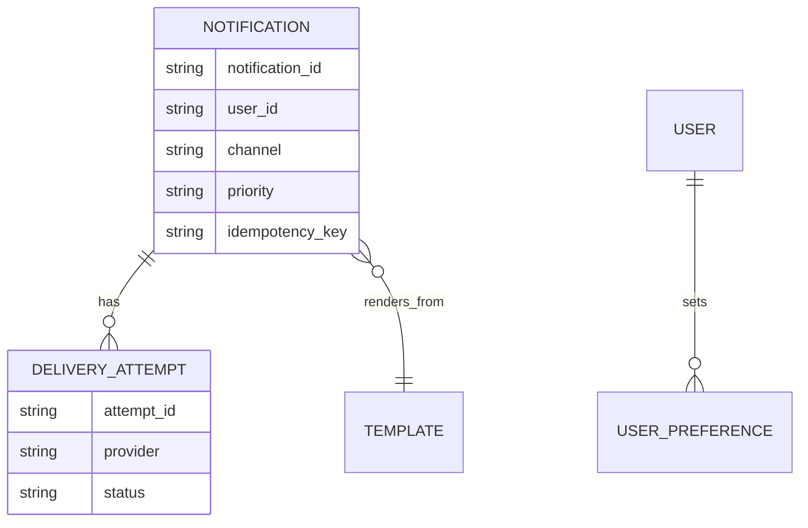
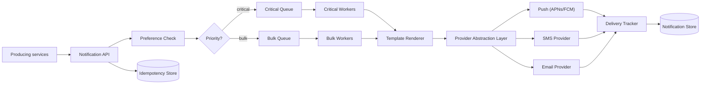
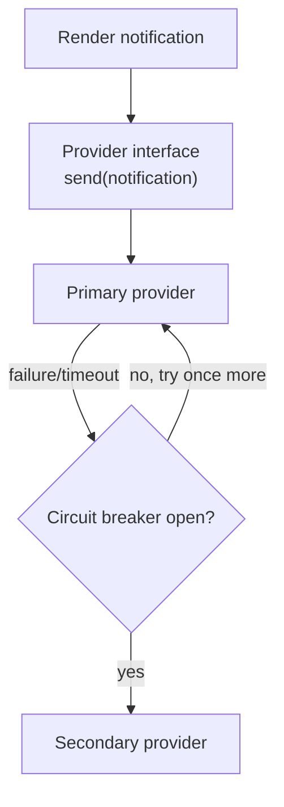

A notification system is the shared pipeline other services use to reach users through push, SMS, email, and in-app messages. The central challenge is that a single login code and a million-user marketing blast go through the same pipeline, and the blast must never be allowed to delay the code.

## Requirements

The requirements sketch is worth drawing before anything else, since the whole design hinges on keeping two very different traffic shapes apart:


### Functional

- Send notifications across push, SMS, email, and in-app channels through a common API.
- Support templates with variables and per-locale localization.
- Respect user channel preferences and quiet hours.
- Deduplicate notifications and support batching/digests for non-urgent content.
- Track delivery status per notification and retry on transient failures.

### Non-functional

- Critical, low-volume traffic (OTPs, security alerts) must never be delayed by bulk campaign traffic.
- At-least-once delivery with idempotency to avoid duplicate sends on retry.
- Durable: a notification accepted by the API must not be silently lost.
- Tolerate individual third-party provider outages without failing the whole channel.

### Out of scope

- Campaign authoring UI / marketing segmentation tools.
- Deep analytics/BI dashboards on engagement.
- In-app chat (a different, bidirectional real-time system).

## Scale estimation

| Metric | Assumption | Working | Result |
|---|---|---|---|
| Total notifications/day | mixed critical + bulk | given | 2B/day |
| Avg send QPS | 2B / 86,400s | 2,000,000,000 / 86,400 | ~23,000/sec |
| Peak QPS (campaign burst) | 5× average | 23,000 × 5 | ~115,000/sec |
| Critical/transactional share | ~5% of volume | 2B × 0.05 | 100M/day (~1,150/sec avg) |
| Bulk/marketing share | ~95% of volume | 2B × 0.95 | 1.9B/day |
| Storage per notification record | metadata + status | ~300 bytes | 300 bytes |
| Daily storage | 2B × 300B | 2,000,000,000 × 300 | ~600 GB/day |
| Retention (90 days, delivery tracking) | 600GB × 90 | 600GB × 90 | ~54 TB |
| SMS provider ceiling (typical) | rate-limited by provider | ~500/sec/account | needs queuing + backpressure |

> [!TIP]
> Lead with the isolation requirement: "critical traffic is under 2% of volume but has the tightest latency SLA — the design has to guarantee it never queues behind the other 98%." That framing is what separates this from "just a queue with workers."

## Core entities and data model

The relationships between a notification, its template, delivery attempts, and a user's preferences look like this:


| Entity | Key fields |
|---|---|
| `Notification` | `notification_id`, `user_id`, `channel`, `template_id`, `priority`, `idempotency_key`, `status` |
| `Template` | `template_id`, `locale`, `channel`, `body`, `variables` |
| `UserPreference` | `user_id`, `channel`, `opted_in`, `quiet_hours_start`, `quiet_hours_end` |
| `DeliveryAttempt` | `attempt_id`, `notification_id`, `provider`, `status`, `attempted_at` |



## API design

The producing-service-facing routes and the internal campaign/preference endpoints map onto one small surface:


```
POST /notifications
{
  "user_id": "u_1", "template_id": "otp_login", "channel": "sms",
  "priority": "critical", "idempotency_key": "otp_u1_1732550400",
  "variables": { "code": "482913" }
}
-> 202 { "notificationId": "n_1", "status": "queued" }

POST /campaigns
{ "template_id": "weekly_digest", "audience_segment_id": "seg_42", "channel": "email" }
-> 202 { "campaignId": "c_9", "estimated_recipients": 4200000 }

GET /notifications/{id}/status -> { "status": "delivered", "attempts": [...] }
PUT /users/{id}/preferences { "channel": "sms", "opted_in": false }
```

## High level architecture



**Send flow:** (1) a producing service calls the notification API with a template and an idempotency key, (2) the API checks the idempotency store to reject duplicates and checks user preferences/quiet hours, (3) the notification is routed to either the critical or bulk queue based on priority — **physically separate queues**, not just a priority field in one queue, (4) a worker renders the template for the user's locale and hands it to the provider abstraction layer, (5) the abstraction layer calls the appropriate provider, and the delivery tracker records the attempt and updates status from provider callbacks/webhooks. A notification is only flipped to `sent` after the provider's own ack confirms acceptance — not the moment it's dequeued — so a worker that crashes mid-send never leaves a false `sent` record behind. User preferences are deliberately re-fetched at this send-time step rather than resolved once when the notification was first queued, since a user can change their opt-in status or quiet hours in the (sometimes long) gap between a bulk campaign being enqueued and each individual notification actually reaching the front of the queue.

**Bulk campaign flow:** a campaign request is expanded ("fanned out") into one notification per recipient in the target segment, each going through the same single-notification pipeline above — reusing the same code path rather than a special-cased bulk sender.

Queue processing is also durable at the claim level: a worker pulls a notification off the queue with a visibility timeout, and the message only leaves the queue for good once that worker acks it; if the worker crashes or times out before acking, the message becomes claimable again for a different worker instead of being silently dropped. Opted-out users are tracked with an explicit suppression record, kept in its own table rather than folded into the general preference row, so a suppression check is a simple existence lookup rather than a scan across many preference fields. Put together end to end, the pipeline looks like this:


## Deep dive: provider abstraction and failover



Every channel is accessed through a common interface (`send(notification) -> attemptResult`) with one implementation per third-party provider. A circuit breaker per provider trips after a threshold of failures/timeouts and routes new traffic to a secondary provider for that channel (e.g. Twilio primary, a second SMS vendor as backup) rather than piling up retries against a provider that's already down.

> [!KEY]
> Provider abstraction is what makes multi-provider failover possible without touching business logic — the send path only ever calls the interface; swapping, adding, or failing over providers is a configuration change in the abstraction layer, not a code change in every caller.

## Deep dive: templating and localization

Templates are stored per `(template_id, locale, channel)` — the same logical notification ("your order shipped") renders differently per channel (a push notification is a short title/body pair, an email is full HTML, an SMS is plain text with a character limit) and per locale. At send time, the renderer resolves the user's locale (from their profile, falling back to a default), substitutes variables, and produces the channel-specific payload. Keeping template authoring separate from the send path lets non-engineers update copy without a deploy.

## Deep dive: preferences, quiet hours, and deduplication

| Check | What it does | Failure mode if skipped |
|---|---|---|
| Opt-out preference | Don't send on a channel the user disabled | Compliance/legal risk, user trust damage |
| Quiet hours | Delay non-critical sends until a user's local daytime | Users woken by low-priority notifications |
| Idempotency key | Same logical event never sent twice | Duplicate OTPs, duplicate marketing emails |

Deduplication uses a stable, deterministically-derived idempotency key (e.g. `otp_<user>_<window>` or `order_shipped_<order_id>`) checked against a fast store (Redis with a TTL) before a notification is queued — this catches retries from the calling service itself, not just retries inside the notification system.

> [!WARNING]
> Quiet hours should apply to bulk/marketing notifications but must not silently delay critical ones like a fraud alert or an OTP — encode quiet-hours eligibility per template/priority, not as a single global rule, or you'll either wake users unnecessarily or block something urgent.

## Deep dive: priority isolation, batching, and delivery tracking

Critical and bulk traffic use **separate queues and separate worker pools**, not just different priority values in one queue — a shared queue means a large campaign enqueue can still starve critical messages behind sheer volume, even with priority ordering, because a worker mid-batch on bulk items doesn't preempt. Batching/digests (e.g. "3 people liked your post" instead of 3 separate pushes) are applied only on the bulk path, computed by a windowing job that groups low-priority events for the same user over a short interval before rendering a single notification.

Delivery tracking consumes provider callbacks (webhooks for email/SMS bounce or push receipt) and updates `DeliveryAttempt` records; failed attempts are retried with exponential backoff and a capped attempt count, after which the notification is marked `failed` and surfaced for investigation rather than retried forever.

## Bottlenecks and scaling

- **Bulk campaign fan-out** — expanding a segment of millions of users into individual notifications should be a streaming/paginated job, not one giant in-memory list.
- **Provider rate limits** — SMS/email providers cap throughput per account; the dispatch workers must respect these limits (token bucket per provider) rather than overwhelming and getting throttled or banned.
- **Idempotency store hot keys** — shard by user ID; a single popular idempotency key store node shouldn't bottleneck all sends.
- **Critical queue must stay small** — alerting on critical queue depth is a first-class operational signal; any sustained backlog there is an incident, unlike the bulk queue where backlog is normal and expected.

## Failure scenarios

| Failure | Blast radius | Mitigation |
|---|---|---|
| One SMS provider down | SMS sends fail/delay | Circuit breaker fails over to secondary SMS provider |
| Bulk campaign backlog builds up | Bulk queue delay grows (acceptable) | Isolated from critical queue, which is unaffected; autoscale bulk workers |
| Idempotency store unavailable | Risk of duplicate sends | Fail open with a shorter local dedupe cache as a fallback, accept small duplicate risk over blocking all sends |
| Preference service unavailable | Can't verify opt-out/quiet hours | Fail safe by using last cached preference snapshot; never send on a channel with no known preference |

## Cheat sheet

- Physically separate queues for critical vs bulk traffic — priority fields in a shared queue are not enough isolation.
- Provider abstraction (`send()` interface) is what enables per-channel failover without touching call sites.
- Idempotency key checked before enqueue, not just before provider call, to catch upstream retries too.
- Quiet hours apply per template/priority, never globally — critical alerts bypass them.
- Batching/digests only apply to bulk/low-priority notifications, computed by a separate windowing job.
- Mark a notification `failed` after a capped retry count; don't retry forever.
- Track delivery status from provider webhooks/callbacks, not just from the initial send call succeeding.

## Common mistakes

| Mistake | Fix |
|---|---|
| One shared queue with a "priority" field for all traffic | Use physically separate queues/worker pools per priority tier |
| Applying quiet hours to every notification uniformly | Scope quiet-hours suppression to non-critical templates only |
| Treating "provider call returned 200" as "delivered" | Track true delivery via provider webhooks/callbacks, which report actual delivery/bounce |
| No idempotency key, relying on the caller to never retry | Producing services will retry; dedupe defensively inside the notification system |
| Retrying failed sends indefinitely | Cap retries with exponential backoff, then mark failed and alert |

## Summary

A notification system is a routing and isolation problem as much as a delivery problem: the same pipeline must serve a latency-sensitive OTP and a million-recipient campaign without one affecting the other. Physically separate queues by priority, abstract providers behind a common interface so failover doesn't touch business logic, and dedupe with idempotency keys checked early. Delivery tracking driven by provider callbacks — not just "the API call succeeded" — is what makes retries and status reporting trustworthy.

## Top Interview Questions

### Q1. How do you make sure a marketing campaign to 5 million users doesn't delay a login OTP?

Isolation at the queue and worker level, not just prioritization. Critical notifications (OTPs, security alerts) go into a physically separate queue with its own dedicated worker pool, sized to keep latency low even under load. Bulk campaign traffic is fanned out into a different queue with autoscaling workers sized for throughput, not latency. Even a well-implemented priority queue in a single system can suffer head-of-line blocking if a worker is mid-batch on bulk work, so true isolation — separate infrastructure, not just a priority tag — is the safer answer to give in an interview.

### Q2. Why use a provider abstraction layer instead of calling APNs/Twilio/SendGrid directly from the send path?

Direct calls tightly couple business logic to a specific vendor's API shape, making it hard to add a second provider for failover or to switch providers later without touching every caller. A common `send(notification) -> result` interface, with one implementation per provider, means failover, load distribution across providers, and provider swaps are all changes localized to the abstraction layer. It also makes each provider's circuit breaker and rate limiting a concern of the abstraction rather than duplicated logic scattered across the codebase.

### Q3. How would you deduplicate notifications, and where should that check happen?

Every logical notification event should carry (or be assigned) a deterministic idempotency key — e.g. derived from `event_type + user_id + relevant_id` for a system-generated event like "order shipped," so retries of the same event naturally produce the same key. The check happens before the notification is queued: look up the key in a fast store (Redis with a TTL matching how long duplicates are plausible), and if found, drop the new request. Checking this early — at the API layer — catches retries from the *calling* service, not just internal retries within the notification pipeline itself, which is the more common source of duplicates in practice.

### Q4. How do quiet hours interact with notification priority?

Quiet hours suppress or delay non-critical notifications during a user's local nighttime, but must never apply uniformly — a fraud alert or a security code should never be held back by quiet hours regardless of the time. The cleanest implementation ties quiet-hours eligibility to the template or priority tier itself (each template is tagged as "quiet-hours eligible" or "always send"), rather than a single global on/off switch, so the policy decision is explicit and auditable per notification type.

### Q5. A user requests digest/batched notifications instead of one push per event. How would you implement that?

Low-priority events destined for a given user are written to a short-lived buffer (e.g. keyed by `user_id` with a small time window, 15–60 minutes). A windowing job periodically flushes each user's buffer, and if more than one event accumulated, it renders a single combined notification ("3 people commented on your post") instead of sending each individually. This batching logic lives entirely on the bulk/low-priority path — critical notifications always bypass batching and send immediately, since batching trades latency for reduced notification volume, which is only acceptable when latency isn't the point.

### Q6. How do you track whether a notification was actually delivered, not just accepted by the provider's API?

A provider returning `200 OK` on the send call usually only means "accepted for delivery," not "delivered to the device/inbox." Real delivery status comes from the provider's asynchronous callbacks — push receipt confirmations, SMS delivery reports, email open/bounce webhooks. The delivery tracker subscribes to these callbacks and updates the `DeliveryAttempt` record's status accordingly (delivered, bounced, failed), which is what powers accurate status reporting and retry decisions — not the initial synchronous API response.

### Q7. What's your retry strategy when a provider call fails, and when do you stop retrying?

Exponential backoff (e.g. 1s, 5s, 30s, 5min) with jitter to avoid synchronized retry storms across many failed notifications at once, capped at a small number of attempts (e.g. 5). After exhausting retries, the notification is marked `failed` rather than retried indefinitely, and failed notifications are surfaced to an operational dashboard/alert rather than silently dropped. Retrying forever risks amplifying an outage (hammering an already-struggling provider) and hides real problems that need a human to investigate, like a misconfigured template or an invalid recipient address.

### Q8. How would you handle a scenario where the primary SMS provider is degraded but not fully down (elevated latency, intermittent failures)?

A circuit breaker per provider tracks recent failure/timeout rate; once it crosses a threshold, it "opens" and routes new SMS traffic to a secondary provider rather than continuing to send into a degraded one, and periodically allows a small fraction of traffic through to test recovery ("half-open" state) before fully reverting. This is preferable to a hard binary up/down health check because degraded-but-technically-responding providers are common in practice and a naive health check can miss them.

### Q9. How would a bulk campaign to millions of recipients be expanded into individual notifications without overloading the system?

The campaign request references an audience segment rather than an inline recipient list; a streaming/paginated fan-out job reads the segment in batches (e.g. a few thousand user IDs at a time) and enqueues one notification per recipient into the bulk queue, rather than loading millions of recipient IDs into memory at once. The bulk queue and its worker pool autoscale based on backlog depth, and provider rate limits are respected via a token bucket per provider so the fan-out doesn't get the account throttled or banned by the third party.

### Q10. What would you do differently for a transactional email (e.g. password reset) versus a marketing email, given they use the same pipeline?

Both go through the same core pipeline (API, preference check, template render, provider abstraction, delivery tracking), but differ in priority tier (transactional is critical-queue, marketing is bulk-queue), in preference handling (marketing respects opt-out and quiet hours; transactional typically cannot be opted out of, since it's tied to an action the user just took), and in retry urgency (a failed password reset email should retry fast and alert quickly, while a failed marketing email can retry more loosely or simply be dropped for that recipient). Making these differences explicit per-template rather than hardcoded in the send path keeps the system reusable rather than special-cased.

### Q11. How do you prevent notification spam to a single user across many different producing services that don't know about each other?

Since every send goes through the same central API, a per-user rate limit (independent of the per-provider rate limit) can be enforced centrally — e.g. "no more than N non-critical notifications per user per hour" — regardless of which upstream service triggered them. This requires the notification system to own that policy rather than trusting each producing service to self-limit, since they have no visibility into what other services are also notifying that same user.
