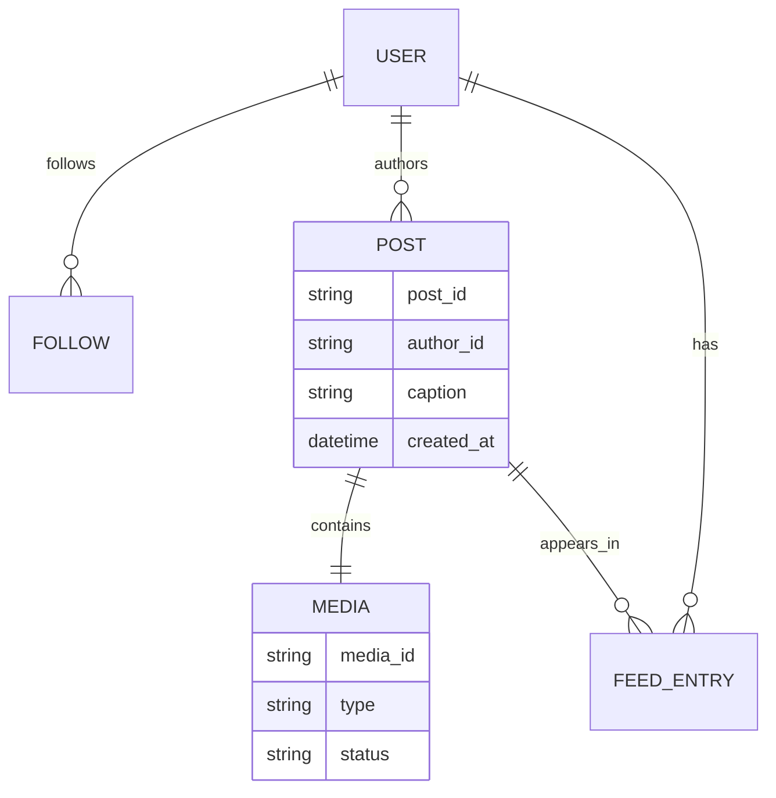
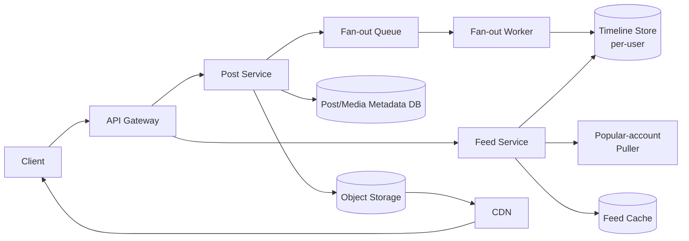

A photo sharing platform lets users post photos and videos with a caption, follow other users, and scroll a chronological feed of everyone they follow. The interesting problems are the same two that dominate every social product: fanning out new posts to millions of followers without melting the database, and moving very large media files in and out of the system fast enough that uploads and playback feel instant.

## Requirements


### Functional

- Users can create a post containing a photo or video plus a short caption.
- Users can follow and unfollow other users.
- Users can view a chronological feed of posts from the people they follow.
- Users can open a post and see its media render immediately.

### Non-functional

- Feed delivery must be low latency, under 500ms, even for a user who follows thousands of accounts.
- Media (photos up to 8MB, videos up to 4GB) must render instantly for the viewer regardless of network conditions.
- The system must scale to 500M daily active users.
- Availability over strict consistency — a post that appears in a follower's feed a few seconds late is acceptable.

### Out of scope

- Comments, likes, and direct messaging.
- Content moderation and recommendation/explore ranking.
- Stories or ephemeral content.

## Scale estimation

| Metric | Assumption | Working | Result |
|---|---|---|---|
| DAU | given | given | 500M |
| Posts created / user / day | 0.2 avg | 500M × 0.2 | 100M posts/day |
| Feed views / user / day | 15 scroll sessions | 500M × 15 | 7.5B feed reads/day |
| Write QPS (avg) | 100M / 86,400s | 100,000,000 / 86,400 | ~1,160 writes/sec |
| Write QPS (peak) | 5× average (evening spike) | 1,160 × 5 | ~5,800 writes/sec |
| Read QPS (avg) | 7.5B / 86,400s | 7,500,000,000 / 86,400 | ~87,000 reads/sec |
| Read QPS (peak) | 3× average | 87,000 × 3 | ~260,000 reads/sec |
| Read : write ratio | 87,000 : 1,160 | — | ~75 : 1 |
| Avg media size (blended photo/video) | 2MB/post assumption | given | 2MB |
| Daily upload storage | 100M × 2MB | 100,000,000 × 2MB | ~200TB/day (~73PB/year raw) |
| Peak upload bandwidth | 5,800 × 2MB | 5,800 × 2MB | ~11.6GB/s |

> [!TIP]
> The 75:1 read/write ratio is the whole story here — this is a read-heavy system, so every design decision (precomputed feeds, CDN-fronted media, caching) exists to keep that huge read volume cheap, even if it makes writes slightly more expensive.

## Core entities and data model

| Entity | Key fields |
|---|---|
| `User` | `user_id`, `username`, `follower_count` |
| `Follow` | `follower_id`, `followee_id`, `created_at` |
| `Post` | `post_id`, `author_id`, `caption`, `media_id`, `created_at` |
| `Media` | `media_id`, `type` (photo/video), `storage_url`, `thumbnail_url`, `status` (uploading/processing/ready) |
| `FeedEntry` | `user_id` (feed owner), `post_id`, `score`, `inserted_at` |



The `Post` and `Media` records are split apart deliberately: a post's caption and metadata are small and mutable quickly, while its media is large, immutable once uploaded, and lives in object storage rather than the primary database. The `FeedEntry` table follows the same convention used in every fan-out design: it stores a pointer (`post_id` + `score`), not the post body, so a single popular post never gets physically duplicated across millions of rows.

## API design

```
POST /posts -> postId
{
  "media": {photo or video bytes},
  "caption": "My cool photo!",
}

POST /follows
{
  "followedId": "123"
}

GET /feed?cursor={cursor}&limit={page_size} -> Post[]
```

Uploads are decoupled from post creation: `POST /posts` accepts the media as a multipart/chunked stream, returns a `postId` as soon as the upload is durably stored, and processing (thumbnailing, transcoding) happens asynchronously afterward. The feed endpoint uses opaque cursor pagination rather than page numbers, for the same reason any high-write feed does — the list is never stable between two requests.

## High level architecture



**Post creation walkthrough:**
1. The client uploads the photo/video to the post service, which streams it straight into object storage and writes a `Media` row with `status: processing`.
2. A background job generates thumbnails (photos) or transcodes renditions (videos), then flips `status` to `ready` and invalidates any cached "not ready" response.
3. The post service writes the `Post` row and pushes the `post_id` onto the fan-out queue.
4. A fan-out worker pool writes the `post_id` into every follower's precomputed timeline — but only for authors under a follower-count threshold (see the deep dive below).

**Feed read walkthrough:**
1. The client requests `/feed` with a cursor.
2. The feed service reads the caller's precomputed timeline entries from the timeline store.
3. In parallel, it pulls the latest posts from any followed accounts above the fan-out threshold.
4. It merges both result sets, orders them chronologically, and returns a page plus the next cursor. Media URLs in the response point at the CDN, never at origin storage.

### Users should be able to create posts featuring photos, videos, and a simple caption


### Users should be able to follow other users


### Users should be able to see a chronological feed of posts from the users they follow


> [!NOTE]
> PK = Primary Key, SK = Sort Key. A feed table keyed by `PK = user_id, SK = post_id` gives every user a naturally sorted, uniquely-addressable slice of the table — the composite `PK + SK` is what guarantees uniqueness without a separate index.

## Deep dive: delivering the feed in under 500ms

A pure fan-out-on-write design falls over the moment one account has millions of followers — a single post would trigger millions of timeline writes at once. The fix is the same hybrid model used by every large feed system: fan out on write for ordinary accounts, and fan out on read (pull) for popular accounts, querying both paths in parallel and merging the results.


| Strategy | Write cost | Read cost | Used for |
|---|---|---|---|
| Fan-out on write | O(followers) | O(1) | Accounts under the follower threshold |
| Fan-out on read | O(1) | O(followees pulled) | Accounts above the threshold ("popular") |

> [!KEY]
> Running the precomputed-timeline read and the popular-account pull **in parallel**, not sequentially, is what keeps p99 latency under 500ms — a user who follows a few popular accounts shouldn't pay for those pulls one at a time.

## Deep dive: rendering media instantly at large sizes

Photos up to 8MB and videos up to 4GB cannot simply be uploaded in one request and rendered on demand — a dropped connection on a 4GB upload would mean starting over, and serving unoptimized originals to every viewer would blow the bandwidth budget.


- **Chunked, resumable uploads**: the client splits media into chunks, uploads them independently, and the server (or object storage's multipart API) stitches them together — a failed chunk is retried without re-sending the whole file.
- **Asynchronous processing**: thumbnails for photos and multiple bitrate/resolution renditions for videos are generated after upload, off the request path.
- **CDN-fronted delivery**: every read serves from CDN edge nodes, never origin storage, so playback start time is dominated by network proximity rather than backend load.

## Deep dive: scaling to 500M DAU

Three techniques compound to keep the system fast at this scale: a precomputed feed avoids doing per-request fan-in work for the common case; CDNs absorb the read-heavy media traffic entirely outside the core services; chunked uploads keep large-file writes resilient; and the metadata database is indexed and sharded by `user_id` so both the timeline store and the post store scale horizontally without cross-shard queries on the hot path.

> [!WARNING]
> Don't let the feed cache or timeline store become the single database of record for posts. If a post is edited or deleted, the timeline entries are only pointers — the authoritative content lives in exactly one place, the post/media metadata store, so an edit is a single write rather than a fan-out of writes.

## Bottlenecks and scaling

- **Fan-out queue backpressure** — partition by author ID so one large account's fan-out job doesn't delay everyone else's; scale worker pools per partition.
- **Media processing latency** — transcoding is CPU-heavy; autoscale the worker pool on queue depth, and let the client poll or subscribe for `status: ready` rather than blocking the post-creation response on it.
- **Timeline store hot shards** — a user following many highly active accounts gets frequent timeline writes; shard by the feed owner's `user_id`, not by author, to keep that localized.
- **CDN cache misses on cold content** — pre-warm CDN edges for posts likely to go viral (based on early engagement velocity) rather than waiting for organic cache population.

## Failure scenarios

| Failure | Blast radius | Mitigation |
|---|---|---|
| Fan-out worker pool down | New posts stop appearing in precomputed feeds | Queue buffers messages; feed service falls back to a live pull merge until workers recover |
| Media processing pipeline down | New uploads stuck at `status: processing` | Post row is already durable; client shows "processing" state, retries render once status flips |
| Object storage region outage | Uploads/downloads fail for affected region | Multi-region storage with client failover to the nearest healthy region |
| CDN outage | Media falls back to origin storage, latency spikes | Origin storage must be able to absorb a fraction of read traffic without falling over; auto-failover to a secondary CDN |

## Cheat sheet

- Hybrid fan-out: push for normal accounts, pull for popular ones, queried in parallel — this is what bounds both write and read cost.
- Split `Post` (small, mutable metadata) from `Media` (large, immutable bytes) — they have completely different storage and caching needs.
- Feed entries are pointers (`post_id` + score), never full content, so edits and deletes stay single-location.
- Chunked/resumable uploads for large media; asynchronous transcoding off the request path.
- CDN in front of all media reads; origin storage should never see the bulk of read traffic.
- Cursor-based pagination for the feed, not offsets.

## Common mistakes

| Mistake | Fix |
|---|---|
| Fan out on write regardless of follower count | Add a threshold; pull live for popular accounts to avoid a write storm |
| Blocking post creation on thumbnail/transcode completion | Return as soon as the raw upload is durable; process media asynchronously |
| Serving media reads from origin storage | Front all media with a CDN; origin only serves cache misses |
| Storing full post content in every follower's feed entry | Store a pointer; keep content in one shared post/media store |
| Single large-file upload with no chunking | Chunk uploads client-side so a network blip doesn't restart a multi-GB transfer |

## Summary

A photo sharing platform is a fan-out problem wrapped around a large-media-file problem. The feed side needs the same hybrid push/pull model as any social feed to survive accounts with huge follower counts; the media side needs chunked uploads, asynchronous processing, and a CDN so 8MB photos and 4GB videos never sit on the critical request path. Keep post metadata and media bytes in separate stores, keep feed entries as pointers, and precompute everything you reasonably can — that combination is what gets a 500M-DAU platform under a 500ms feed budget.

## Final design


## Top Interview Questions

### Q1. Why split the `Post` and `Media` entities instead of storing everything on one row?

`Post` metadata (caption, author, timestamp) is small and needs to be queried and updated cheaply — for example, editing a caption. `Media` is large, immutable once uploaded, and belongs in object storage rather than a relational or document database built for small rows. Keeping them separate also means a feed read can fetch lightweight post metadata for many posts at once without touching multi-megabyte media blobs, and media processing (thumbnailing, transcoding) can run as an independent asynchronous pipeline that updates the `Media` row's status without touching the post at all.

### Q2. How does the hybrid fan-out model keep feed latency under 500ms even for popular accounts?

Ordinary accounts fan out on write: a post's ID is pushed into every follower's precomputed timeline at post time, so a feed read for those posts is just an indexed lookup. Accounts above a follower-count threshold skip that fan-out entirely and are instead pulled live at read time. The key detail is that the precomputed-timeline read and the popular-account pull happen in parallel, not one after another — so a user who follows both ordinary and popular accounts pays roughly the cost of the slower of the two paths, not the sum of both.

### Q3. Why are uploads chunked, and what happens if one chunk fails?

A single request carrying an 8MB photo is manageable, but a 4GB video sent as one request is fragile — any network interruption means restarting the entire transfer. Chunking splits the file into independently-uploadable pieces; if one chunk fails, only that chunk is retried, and the server (or the object store's multipart upload API) reassembles the chunks once all have arrived. This also allows resuming an interrupted upload from where it left off rather than from zero.

### Q4. Why shouldn't the post-creation API block until thumbnails and video transcodes are ready?

Transcoding a video into multiple renditions is CPU-intensive and can take from seconds to minutes depending on length and target quality. If post creation waited for that to finish, the API would have wildly unpredictable latency and users would stare at a spinner. Instead, the API returns as soon as the raw media is durably stored, marks the media `status: processing`, and a background pipeline flips it to `ready` once renditions exist — the client polls or subscribes for that transition and renders a placeholder in the meantime.

### Q5. What role does the CDN play, and what happens if it goes down?

The CDN serves the overwhelming majority of media reads from edge locations close to the viewer, so playback start time is dominated by network proximity rather than a round trip to origin storage. If the CDN fails, the design must fail over to a secondary CDN or fall back to serving directly from origin storage — origin needs enough headroom to absorb a fraction of that traffic without collapsing, since a full cutover of read traffic to origin would otherwise be catastrophic.

### Q6. Why does the feed entry store only a `post_id` and score rather than the full post?

If every follower's timeline row embedded the whole post (caption, media URL, metadata), a single popular post would be duplicated across potentially millions of rows. Editing or deleting that post would then require updating every one of those copies. Storing a pointer means the post exists in exactly one place — the post/media store — and every timeline entry just references it, so edits and deletes are single-location operations regardless of how many feeds the post appears in.

### Q7. How would you choose the follower-count threshold that decides push vs. pull?

Start from the write-amplification math: total daily fan-out writes are roughly `posts/day × avg followers`. Model what a small number of very-high-follower accounts contribute to that total, and pick a threshold where the accounts above it are rare enough that pulling their handful of recent posts live, per feed request, is cheap, while the accounts below it are common enough that push keeps their followers' reads O(1). In practice this is tuned empirically against real follower-count distribution and revisited as the platform's user base changes.

### Q8. How do you keep the precomputed timeline store from growing without bound?

Cap each user's timeline to a bounded number of recent entries (a few hundred to roughly a thousand), evicting the oldest once the cap is hit. Almost no user scrolls back further than that in a session, and if they do, the read path can fall back to a slower query against the durable post store instead of keeping unbounded history hot in the fast-path store.

### Q9. What happens to a follower's feed if the fan-out worker pool is temporarily down?

New posts from ordinary accounts won't get pushed into precomputed timelines while workers are down, but nothing is lost — the fan-out queue durably buffers the pending work, and the feed service can temporarily fall back to a live pull-and-merge for the affected accounts so their followers still see recent posts, just via the slower path, until the worker pool catches up on the backlog.

### Q10. How would you prevent a burst of uploads (e.g. everyone posting during a live event) from overwhelming media processing?

Decouple ingestion from processing with a queue: the post service accepts and durably stores the raw upload immediately, then enqueues a processing job rather than transcoding inline. The processing worker pool autoscales based on queue depth, so a burst produces a temporarily longer `processing` window for freshly uploaded media rather than failed uploads or timeouts — the user-visible effect is a slightly delayed "ready" state, not an error.

### Q11. Why is eventual consistency acceptable for the feed, and where would you draw the line?

A post appearing in a follower's feed a few seconds after it was created has essentially no product impact — nobody is watching in real time for that specific post to land. Drawing the line matters more for things this design doesn't cover, like a user's own post appearing in their own profile view; that path should read from a strongly consistent source (the post store directly) rather than relying on the same fan-out timeline, so the author never wonders whether their own post "went through."
