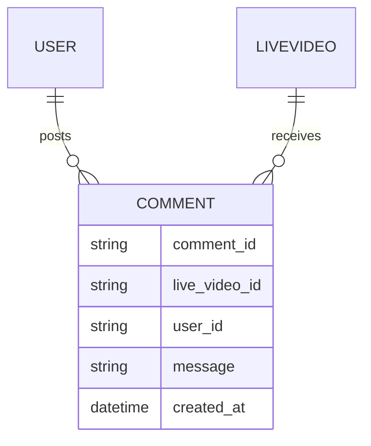
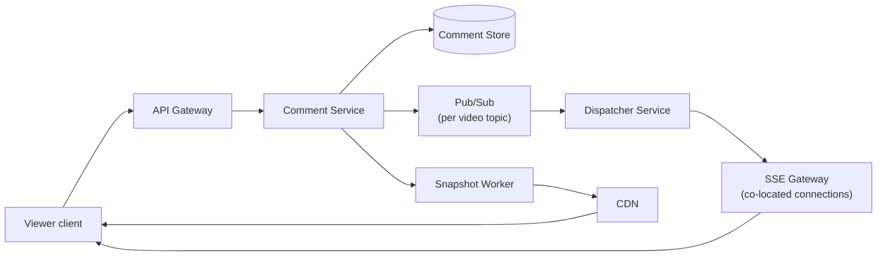

Live video comments let viewers post messages on a live stream and see a continuous, near-real-time scroll of everyone else's comments while watching. The problem looks like chat at first glance, but the read side is wildly asymmetric — one popular stream can have millions of viewers passively watching a handful of people type, so the design has to treat "fan-out to viewers" as the central problem, not comment storage.

## Requirements


### Functional

- Viewers can post comments on a live video feed.
- Viewers see new comments appear while they continue watching, without refreshing.
- Viewers who join mid-stream can see comments posted before they joined.

### Non-functional

- New comments should reach viewers within a couple of seconds, not milliseconds — this is not a trading system.
- The system must scale to a single live video with millions of concurrent viewers.
- A single popular stream can generate thousands of comments per second; delivery must not degrade for viewers as that rate climbs.
- Prefer availability and simplicity (HTTP-based delivery) over a heavier bidirectional protocol.

### Out of scope

- Comment moderation, spam filtering, and reactions/likes on comments.
- Video ingestion, transcoding, and playback itself.
- Direct messaging between viewers.

## Scale estimation

| Metric | Assumption | Working | Result |
|---|---|---|---|
| Platform daily viewers | given | given | 50M |
| Peak concurrent viewers on one "mega-stream" | given | given | 10M |
| Peak comment write rate on a mega-stream | given | given | 5,000 comments/sec |
| Naive per-viewer polling (every 5s) | 10M viewers / 5s | 10,000,000 / 5 | ~2,000,000 reads/sec |
| CDN-snapshot reads (1 refresh/sec, cached) | 1 origin compute/sec, rest served from CDN cache | 10M viewers hit CDN, ~1 origin req/sec | effectively O(1) origin load |
| Naive read : write ratio | 2,000,000 : 5,000 | 2,000,000 / 5,000 | ~400 : 1 |
| Platform-wide comment storage/day | 500M comments/day × 80 bytes | 500,000,000 × 80B | ~40GB/day |
| Snapshot payload size | ~50 latest comments × 100 bytes | 50 × 100B | ~5KB pushed to CDN per refresh |

> [!TIP]
> The naive-polling row is the whole argument for the design: at 10M concurrent viewers, even a lazy 5-second poll interval produces 2M reads/sec against the backend. Nothing about comment *storage* is hard here — the hard part is that a single popular event turns "fan-out to viewers" into a bigger problem than the comment write path itself.

## Core entities and data model

| Entity | Key fields |
|---|---|
| `User` | `user_id`, `username` |
| `LiveVideo` | `video_id`, `streamer_id`, `started_at`, `status` (live/ended) |
| `Comment` | `comment_id`, `live_video_id`, `user_id`, `message`, `created_at` |



Comments are append-only and partitioned by `live_video_id`, which is also the natural sharding and fan-out key — every read and every real-time subscription is scoped to a single live video, so there's never a need to query across videos.

## API design

```http
POST /comments/:liveVideoId
Header: JWT | SessionToken
{
    "message": "Cool video!"
}

GET /comments/:liveVideoId?cursor={last_comment_id}&pageSize=10&sort=desc
```

The same `GET` endpoint serves two purposes with one shape: a viewer joining mid-stream calls it once with no cursor to backfill recent history (cursor-based pagination, so results stay correct even as new comments keep arriving), and a viewer already watching polls it periodically with their last-seen comment ID as the cursor to pick up anything new.

## High level architecture



1. A viewer opens a live video and establishes a subscription — an SSE connection for normal-scale streams, or a CDN pull loop for mega-streams whose comment rate is too high for per-comment push.
2. A viewer posts a comment; the comment service writes it to the comment store and publishes it to that video's pub/sub topic.
3. The dispatcher service consumes the topic and pushes the new comment to every SSE gateway instance holding connections for that video.
4. In parallel, a snapshot worker periodically bundles the latest comments for high-traffic videos and pushes them to the CDN, so viewers on that tier pull from an edge cache instead of holding a direct connection to backend infrastructure.
5. A viewer who joins mid-stream calls the `GET` endpoint with no cursor to backfill recent comments, then switches to the live subscription for anything new.

### Viewers can post comments on a Live video feed


### Viewers can see new comments being posted while they are watching the live video

An early, simple version of this uses plain HTTP polling against the same `GET` endpoint on an interval, rather than any push mechanism.


## Deep dive: choosing the real-time delivery protocol

WebSockets look like the obvious choice for "push new data to a client," but they're full-duplex, which this problem doesn't need — comments only flow client-to-server on write and server-to-client on read, never both directions over the same persistent exchange. WebSockets also run over a different protocol handshake than plain HTTP, carry real connection-establishment overhead, and typically require infrastructure upgrades (load balancers, proxies) that a lot of existing HTTP-based stacks don't have out of the box.

Server-Sent Events (SSE) fit better: they're one-directional (server to client), run over ordinary HTTP, and are simple to implement and operate on infrastructure that already speaks HTTP.


## Deep dive: scaling to millions of concurrent viewers

A single video with millions of viewers means millions of open SSE connections that all need the same stream of new comments. The fix is **partitioned pub/sub with viewer co-location**: viewers watching the same video are routed, via a Layer 7 load balancer using consistent hashing on `video_id`, to the same pool of SSE gateway instances, so a new comment only has to be pushed to the specific gateway instances actually holding connections for that video.


A centralized **dispatcher service** coordinates this: multiple dispatcher instances run in parallel behind a load balancer, all consulting the same coordination data (Zookeeper or etcd) so they agree on which gateway instances own which video's connections, even as gateways scale up and down.


> [!KEY]
> Consistent hashing plus co-location is what turns "broadcast to millions of connections" into "broadcast to the handful of gateway instances that actually matter for this video" — without it, every comment would have to fan out to every gateway in the fleet regardless of who's watching what.

## Deep dive: the mega-stream problem

Even with co-location, a single mega-stream — millions of viewers, 5,000 comments/sec — pushes more update volume than any one viewer's client (or the SSE gateways serving them) can meaningfully render; nobody can read 5,000 lines a second scrolling past. Pushing every individual comment to every connection at that rate also risks overwhelming the gateway fan-out itself.

The fix is **CDN-based delivery with periodic snapshots**: every second, a snapshot worker takes the latest batch of comments and pushes it to the CDN as a small cacheable payload. Clients pull the snapshot from the CDN on a matching interval instead of holding a direct real-time subscription, so the comment scroll still feels smooth on screen, backend load stays flat regardless of viewer count (the CDN absorbs the read fan-out), and a viewer's own just-posted comment can still be optimistically rendered client-side so it feels instant even though it arrives in the next snapshot for everyone else.

> [!WARNING]
> Snapshot delivery trades strict per-comment ordering guarantees and sub-second latency for the ability to serve millions of viewers off a CDN cache. That trade-off is exactly right for a comment scroll nobody is reading character-by-character, but it would be wrong for anything requiring precise ordering or immediate delivery.

## Deep dive: handling disconnections without missing comments

Viewers on flaky connections (mobile networks, background tabs) will disconnect and reconnect constantly. SSE has a built-in mechanism for this: the `Last-Event-ID` header lets a reconnecting client tell the server exactly which event it last received. The client also stores its own last-seen comment ID locally; on reconnect, it calls the same `GET` endpoint with that ID as the cursor to fetch anything it missed while disconnected, then resumes the live subscription.

## Bottlenecks and scaling

- **Dispatcher coordination store** — Zookeeper/etcd sits on the critical path for gateway ownership; it must be highly available, since dispatcher instances can't agree on routing without it.
- **SSE gateway connection limits** — each instance can only hold so many open connections; scale gateway pools horizontally per video partition as viewer counts climb, not globally.
- **Snapshot worker cadence** — a 1-second snapshot interval balances freshness against CDN cache efficiency; tightening it too far erodes the CDN's ability to absorb read load.
- **Comment write hot-partitioning** — a single mega-stream's comments all land on the same partition key (`live_video_id`); make sure the comment store can handle a hot partition at 5,000 writes/sec without degrading other videos.

## Failure scenarios

| Failure | Blast radius | Mitigation |
|---|---|---|
| Dispatcher service down | New comments stop being routed to SSE gateways | Multiple dispatcher instances behind a load balancer; coordination store survives individual instance loss |
| SSE gateway instance down | Viewers connected to it lose their live stream | Client reconnects (with `Last-Event-ID`) and is rerouted to a healthy co-located instance |
| Snapshot worker down (mega-stream) | CDN serves a stale snapshot | CDN cache still serves the last good snapshot; viewers see a brief freeze, not an error, until the worker recovers |
| Comment store write failure | New comments rejected or delayed | Retry with backoff; comment service can buffer briefly before failing the write back to the client |

## Cheat sheet

- SSE over WebSockets: this is a one-directional push problem over plain HTTP, not a full-duplex one.
- Partitioned pub/sub with viewer co-location (consistent hashing on `video_id`) turns broadcast into "notify only the gateways with real connections."
- A centralized dispatcher, backed by Zookeeper/etcd, keeps multiple gateway instances in agreement on connection ownership.
- Above a comments-per-second threshold, switch from per-comment push to periodic CDN snapshots — nobody can read 5,000 comments/sec anyway.
- `Last-Event-ID` plus a client-stored last-seen comment ID makes reconnection lossless without extra server state.
- Cursor-based pagination for backfill, keyed by `last_comment_id`, not offsets.

## Common mistakes

| Mistake | Fix |
|---|---|
| Reaching for WebSockets by default for any "real-time" feature | Use SSE when the flow is server-to-client only; it's simpler and runs over existing HTTP infrastructure |
| Broadcasting every comment to every gateway instance regardless of viewership | Co-locate viewers per video via consistent hashing so fan-out targets only relevant gateways |
| Pushing every individual comment at mega-stream volume | Batch into periodic CDN snapshots once comment rate exceeds what a viewer can read anyway |
| Assuming reconnecting clients can just "start fresh" | Use `Last-Event-ID` plus a client-stored cursor so reconnection backfills exactly what was missed |
| Offset-based pagination for comment history | Use cursor pagination keyed by `last_comment_id`, stable under concurrent inserts |

## Summary

Live video comments are a fan-out problem disguised as a chat feature: writes are simple and low-volume, but reads can explode to millions of concurrent viewers on a single video. SSE over plain HTTP is the right transport for a one-directional stream, partitioned pub/sub with viewer co-location keeps fan-out proportional to actual viewership rather than total fleet size, and periodic CDN snapshots are the escape valve once a stream's comment rate outpaces what any viewer could read in real time anyway. `Last-Event-ID` plus a client-side cursor makes reconnection lossless without any extra server-side session state.

## Final design


## Top Interview Questions

### Q1. Why is Server-Sent Events preferred over WebSockets for this feature?

The data flow here is one-directional: comments stream from server to client, and a viewer's own comment submission is a completely separate, ordinary HTTP POST. WebSockets provide full-duplex communication, which is unnecessary overhead for this shape of problem — they require a distinct connection handshake, run over a different protocol than plain HTTP, and often need infrastructure (load balancers, proxies) upgraded to support them. SSE runs over standard HTTP, is simpler to implement and operate, and natively fits a server-push-only use case like a comment stream.

### Q2. How does the system scale to a single video with millions of concurrent viewers?

Through partitioned pub/sub with viewer co-location: a Layer 7 load balancer uses consistent hashing on the video ID to route all viewers of the same video toward the same pool of SSE gateway instances. When a new comment arrives, it only needs to be pushed to the specific gateway instances that actually hold connections for that video, not broadcast fleet-wide. A dispatcher service, backed by a coordination store like Zookeeper or etcd, keeps multiple dispatcher instances in agreement about which gateways own which video's connections as the fleet scales.

### Q3. What problem does the dispatcher service solve, and why run multiple instances of it?

The dispatcher is the component that knows which SSE gateway instances currently hold connections for which videos, and routes new comments accordingly. Running a single instance would make it a single point of failure and a scaling bottleneck. Running multiple instances behind a load balancer, all consulting the same coordination store (Zookeeper/etcd), lets dispatching scale horizontally while staying consistent — any dispatcher instance can route a given comment correctly because they all agree on the same routing state.

### Q4. A stream hits 5,000 comments/second with millions of viewers — what breaks, and how do you fix it?

At that rate, pushing every individual comment to every viewer's connection is both unnecessary (no human can read 5,000 lines/sec) and risky for gateway fan-out load. The fix is to stop pushing per-comment updates for high-traffic streams and instead have a snapshot worker bundle the latest comments once a second and push that small payload to a CDN. Viewers pull from the CDN edge on a matching cadence, so the comment scroll still animates smoothly, but backend load is flat regardless of how many millions are watching, since the CDN — not the origin — absorbs the read fan-out.

### Q5. How does a client avoid missing comments after a disconnect?

SSE supports the `Last-Event-ID` header specifically for this: on reconnect, the client includes the ID of the last comment it successfully received. The client also persists its own last-seen comment ID locally. On reconnect, it calls the standard `GET /comments/:liveVideoId?cursor=...` endpoint with that ID to backfill exactly the comments it missed while disconnected, then resumes its live subscription — no server-side per-client session state is required to make this work correctly.

### Q6. Why is cursor-based pagination used for comment history instead of page numbers?

New comments are constantly appended while a viewer is scrolling back through history, so an offset like `page=2` has no stable meaning — items shift underneath it, causing duplicates or skipped comments. A cursor built from `last_comment_id` anchors the query to a specific point in the append-only sequence: "give me comments after this ID" is correct regardless of how many new comments have arrived since, because it doesn't depend on absolute position.

### Q7. Why is polling acceptable as a fallback delivery mechanism, given the non-functional requirement of near-real-time delivery?

The requirement is that comments arrive within a couple of seconds, not milliseconds — this isn't a trading system. A short-interval poll against the same `GET` endpoint used for backfill is a legitimate, simple starting point that meets that bar for smaller streams, before the added complexity of SSE, pub/sub, and co-located gateways is justified. It's a reasonable design progression to describe in an interview: start simple, then explain precisely which scale threshold makes polling insufficient.

### Q8. Why not simply store the full comment payload in the CDN snapshot for every viewer permanently, rather than reverting to per-comment delivery for smaller streams?

CDN snapshots trade freshness and exact ordering for read scalability — appropriate once viewer count and comment velocity are high enough that no viewer could track individual comments anyway. For smaller streams, per-comment SSE push gives lower latency and simpler operational behavior (no snapshot cadence tuning) at a cost the system can easily afford, since fewer concurrent connections mean fan-out stays cheap. Using snapshots everywhere would add unnecessary latency and complexity for the common case; the design should apply the CDN snapshot approach only once scale demands it.

### Q9. How would you extend this design to support comment moderation without breaking real-time delivery?

Insert a moderation check between comment persistence and pub/sub publication: the comment service writes the comment with a `pending` status, runs it through an automated filter (and optionally a human queue for borderline cases), and only publishes it to the video's pub/sub topic — and includes it in future CDN snapshots — once approved. This keeps the real-time fan-out path unchanged; moderation just gates what enters that path, at the cost of a small delay between posting and visibility for comments that need review.

### Q10. What's the tradeoff of routing all viewers of a video to the same gateway pool via consistent hashing?

It concentrates a popular video's connections onto a bounded subset of the gateway fleet, which is exactly what makes fan-out cheap — a new comment only needs pushing to that subset. The tradeoff is that a single mega-stream can create a hot spot on its assigned gateway instances, since they now bear a disproportionate share of that video's viewer load. This is mitigated by allowing the coordination layer to assign more gateway capacity to a given video's hash range as its viewer count grows, rather than treating the mapping as fixed.
