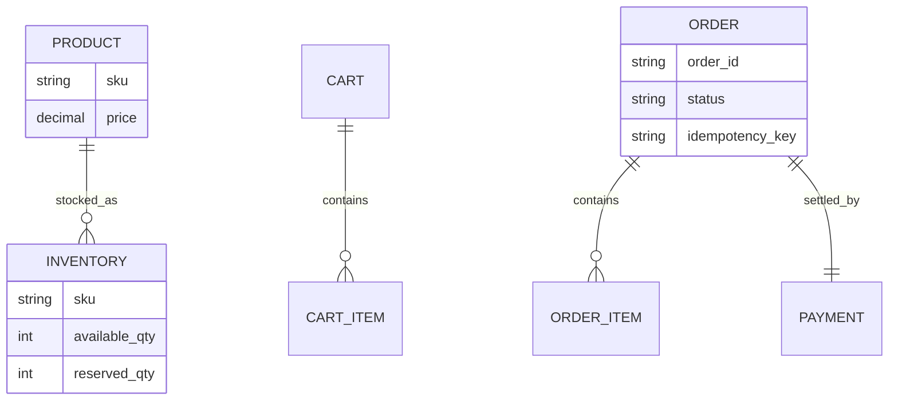
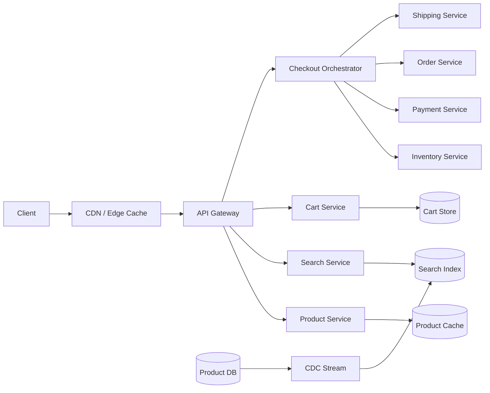
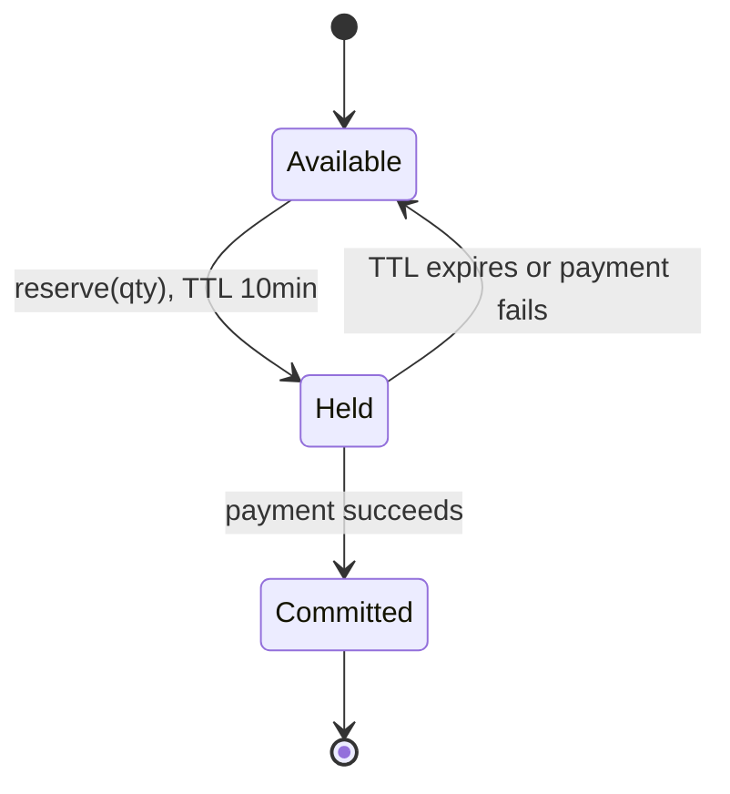
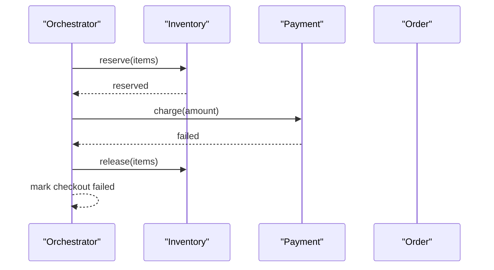

An e-commerce platform lets users browse a catalogue, hold items in a cart, and check out. The catalogue is a massive-read, tolerant-of-staleness problem; checkout is the opposite — low volume, but it must never oversell inventory or double-charge a customer.

## Requirements

### Functional

- Browse and search a product catalogue.
- Add/remove items in a cart, for both guests and logged-in users.
- Check out: reserve inventory, charge payment, create an order, hand off to shipping.
- Apply promotions/coupons and compute final pricing.
- View order status after purchase.

### Non-functional

- Product pages and search are extremely read-heavy; must be fast (under 100ms) even if slightly stale.
- Checkout must be strongly consistent for inventory and payment — no overselling, no double charges.
- Must survive flash-sale traffic spikes (an order-of-magnitude burst on a subset of SKUs).
- Search indexing can lag the source of truth by seconds; inventory availability cannot.

### Out of scope

- Recommendation/personalization engine.
- Full returns/refunds workflow (briefly touched, not designed in depth).
- Seller onboarding and marketplace multi-tenant concerns.

## Scale estimation

| Metric | Assumption | Working | Result |
|---|---|---|---|
| Product page views/day | 50M DAU × 20 views | 50,000,000 × 20 | 1B/day |
| Page view QPS (avg) | 1B / 86,400s | 1,000,000,000 / 86,400 | ~11,600/sec |
| Page view QPS (peak) | 3× average | 11,600 × 3 | ~35,000/sec |
| Search queries/day | given | given | 500M/day |
| Search QPS (avg) | 500M / 86,400s | 500,000,000 / 86,400 | ~5,800/sec |
| Orders/day | ~2% conversion of DAU visits | 2M/day | 2M/day |
| Checkout QPS (avg) | 2M / 86,400s | 2,000,000,000 / 86,400,000 | ~23/sec |
| Checkout QPS (flash sale peak) | 50× burst on hot SKUs | 23 × 50 | ~1,150/sec |
| Catalog storage | 100M SKUs × 2KB metadata | 100,000,000 × 2KB | ~200 GB |
| Order storage (5yr) | 2M/day × 1KB × 365 × 5 | 2M × 1KB × 1825 | ~3.65 TB |

> [!TIP]
> Name the asymmetry explicitly: "35,000 QPS of tolerant-of-staleness reads versus roughly 1,150 QPS of must-be-exactly-right writes at flash-sale peak." That framing is what justifies very different consistency models for catalog reads versus checkout.

## Core entities and data model

| Entity | Key fields |
|---|---|
| `Product` | `sku`, `title`, `price`, `attributes`, `category` |
| `Inventory` | `sku`, `warehouse_id`, `available_qty`, `reserved_qty` |
| `Cart` | `cart_id`, `user_id` (nullable for guest), `items[]` |
| `Order` | `order_id`, `user_id`, `items[]`, `status`, `total`, `idempotency_key` |
| `Payment` | `payment_id`, `order_id`, `status`, `amount` |



## API design

```
GET /products/{sku} -> Product + availability
GET /search?q={query}&page={n} -> Product[]

POST /cart/items { "sku": "abc", "qty": 2 } -> Cart
GET  /cart -> Cart

POST /checkout
Idempotency-Key: chk_9f3a...
{ "cartId": "c_1", "shippingAddress": {...}, "paymentMethodId": "pm_1" }
-> 201 { "orderId": "o_1", "status": "processing" }

GET /orders/{orderId} -> { "status": "confirmed" | "payment_failed" | "shipped" | ... }
```

## High level architecture



**Browse flow:** (1) client requests a product page, served from CDN/edge cache when possible, (2) on a miss, the product service reads a denormalized read model backed by cache, (3) search queries go to a dedicated search index (kept fresh via change-data-capture from the product database, not written to directly).

**Checkout flow:** (1) client submits checkout with an idempotency key, (2) the orchestrator reserves inventory for each item, (3) it charges payment, (4) on success it creates the order record and hands off to shipping, (5) each step's failure triggers a compensating action for the steps already completed (see the saga deep dive).

## Deep dive: inventory reservation and the oversell problem

Overselling happens when two checkouts both read "1 left in stock" and both proceed, because the check and the decrement weren't atomic. The fix is a conditional, atomic decrement at the database level, combined with a **hold-then-confirm** flow rather than an instant permanent decrement.



```
-- Atomic conditional decrement, not read-then-write
UPDATE inventory
SET available_qty = available_qty - 1, reserved_qty = reserved_qty + 1
WHERE sku = 'abc' AND available_qty > 0;
-- 0 rows affected => out of stock, fail the reservation
```

> [!KEY]
> The conditional `WHERE available_qty > 0` inside the `UPDATE` is what prevents overselling — it makes the check and the decrement a single atomic database operation, so two concurrent checkouts can never both succeed on the last unit. A separate `SELECT` then `UPDATE` is a classic race condition here.

A hold reserves stock for a short TTL (e.g. 10 minutes) while payment processes; if payment fails or the hold expires unconfirmed, a background job releases it back to `available_qty`.

## Deep dive: checkout as a distributed saga

Checkout spans multiple independently-owned services (inventory, payment, order, shipping) that cannot share a single database transaction. A saga coordinates this as a sequence of local transactions, each with a corresponding compensating action if a later step fails.



| Step | Compensating action if it must be undone |
|---|---|
| Inventory reserved | Release the hold back to available stock |
| Payment charged | Issue a refund/void |
| Order created | Cancel the order, notify the user |

Checkout must be idempotent end to end: the client sends an `Idempotency-Key` header, and the orchestrator stores it against the resulting `order_id` so a retried request (e.g. after a client timeout) returns the same order instead of double-charging or double-reserving.

> [!DANGER]
> Without an idempotency key, a client retry after a network timeout — where the first request actually succeeded server-side — creates a duplicate order and a second charge. This is one of the most common real-world checkout bugs; the fix must be enforced server-side (a unique constraint on the idempotency key), not just assumed on the client.

## Deep dive: cart storage and pricing

| Cart type | Storage | Trade-off |
|---|---|---|
| Guest cart | Session-based (cookie/session ID → Redis) | Fast, disposable, lost if the session expires |
| Logged-in user cart | Persisted (DB or Redis with longer TTL, tied to `user_id`) | Survives across devices/sessions |
| Merge on login | Guest cart items merged into the persisted cart | Needs a conflict rule (e.g. keep higher quantity, or union items) |

Pricing (including promotions/coupons) is computed at checkout time, not read from a stale cart snapshot — prices and active promotions can change between add-to-cart and checkout, so the final total is always recalculated against current catalog and promotion rules just before payment is charged.

## Deep dive: read models and consistency per subsystem

| Subsystem | Consistency model | Why |
|---|---|---|
| Product page reads | Eventually consistent, heavily cached | Staleness of a few seconds on description/price display is acceptable; volume is enormous |
| Search index | Eventually consistent, updated via CDC | Index rebuild lag of seconds is fine; strong consistency here would slow every write to the catalog |
| Inventory availability | Strongly consistent | Overselling is a real business and customer-trust cost |
| Payment/order creation | Strongly consistent, transactional | Money and order state must never be ambiguous |

This is the single most important trade-off decision in the whole design: **consistency requirements are not uniform across the system**, and treating everything as either "always strongly consistent" (too slow, doesn't scale reads) or "always eventually consistent" (unsafe for money/inventory) is the wrong answer either way.

## Bottlenecks and scaling

- **Hot SKU during a flash sale** — the inventory row for one SKU becomes a hotspot; mitigate with a queue-based serialization for that SKU's reservations, or partition the counter and reconcile.
- **Search index rebuild lag** — CDC pipeline must keep up with catalog write rate; a backlog means new/changed products don't appear in search promptly.
- **Cart store growth** — expire abandoned guest carts aggressively (TTL); persisted user carts are far fewer and smaller in aggregate.
- **Checkout orchestrator as a dependency** — make it horizontally scalable and stateless, persisting saga state externally so a crashed orchestrator instance doesn't strand an in-flight checkout.

## Failure scenarios

| Failure | Blast radius | Mitigation |
|---|---|---|
| Payment service down mid-checkout | Checkout stalls after inventory reserved | Hold TTL auto-releases inventory if payment doesn't complete in time |
| Inventory hold not confirmed (client abandons) | Stock appears unavailable temporarily | TTL expiry releases it back automatically, no manual cleanup needed |
| Search index lags behind catalog | New products briefly missing from search | Product page (direct lookup by SKU/URL) still works; only discovery is affected |
| Checkout retried after a timeout | Risk of duplicate order/charge | Idempotency key enforced with a unique constraint prevents duplication |

## Cheat sheet

- Prevent overselling with a conditional atomic decrement (`WHERE available_qty > 0`), never a separate check-then-write.
- Model reservation as hold (TTL) → confirm → release-on-timeout, not an instant permanent decrement.
- Checkout is a saga: each step needs a compensating action, and the whole flow needs a client-supplied idempotency key.
- Recompute price and promotions at checkout time, never trust a cached cart total.
- Different subsystems get different consistency models: eventually consistent for catalog/search reads, strongly consistent for inventory and payment.
- Guest carts are session-based and disposable; logged-in carts are persisted and merged on login.
- Search index is a read-optimized copy fed by CDC, never written to directly.

## Common mistakes

| Mistake | Fix |
|---|---|
| Checking stock with a `SELECT` then issuing a separate `UPDATE` | Use a single atomic conditional `UPDATE` to prevent the race |
| Decrementing inventory permanently the instant checkout starts | Use a time-boxed hold that releases automatically if payment doesn't complete |
| No idempotency key on the checkout endpoint | Require one, enforced with a DB unique constraint on the server |
| Treating the whole system as one consistency model | Choose per subsystem: strong for money/inventory, eventual for catalog/search |
| Writing directly to the search index from the checkout/catalog write path | Feed the index asynchronously via CDC/events, keep it a derived read model |

## Summary

An e-commerce platform is really two systems glued together: a massive, tolerant-of-staleness read path (catalog, search) and a small, must-be-exact write path (inventory, payment, orders). The oversell problem is solved with atomic conditional decrements and a hold/confirm/release lifecycle; checkout's cross-service nature is solved with a saga and an idempotency key. Getting the consistency model right *per subsystem*, rather than applying one blanket policy, is what makes the whole design coherent.

## Top Interview Questions

### Q1. How do you prevent two customers from both successfully buying the last unit of an item?

The reservation must be a single atomic, conditional database operation rather than a separate read-then-write: `UPDATE inventory SET available_qty = available_qty - 1 WHERE sku = ? AND available_qty > 0`, checking the affected row count to know whether the reservation succeeded. If you instead `SELECT` the quantity, check it in application code, and then `UPDATE`, two concurrent requests can both read "1 available" before either writes, and both proceed — a classic check-then-act race that causes overselling. The atomic conditional update makes the check and the decrement indivisible.

### Q2. Why use a hold/reserve step instead of decrementing inventory permanently as soon as checkout begins?

A checkout can fail after inventory is reserved — payment might decline, the user might abandon the flow — and a permanent decrement with no undo path either strands unsellable "phantom sold" stock or requires fragile manual reconciliation. A time-boxed hold (e.g. 10 minutes) reserves the stock, moves it from `available_qty` to `reserved_qty`, and either confirms (on payment success, permanently deducting it) or releases automatically via TTL expiry (on failure or abandonment) — giving you a clean, self-healing recovery path without needing to detect every possible failure mode explicitly.

### Q3. Walk through checkout as a saga. What happens if payment succeeds but order creation then fails?

Checkout touches inventory, payment, and order services, none of which share a database transaction, so it's coordinated as a saga: reserve inventory, charge payment, create the order, notify shipping — each a local transaction in its own service. If order creation fails after payment succeeded, the saga's compensating logic must run in reverse: refund/void the payment and release the inventory hold, since the customer was charged for an order that doesn't actually exist in the system. This compensating step is why every forward action in a saga needs a defined, tested undo path, not just a happy path.

### Q4. How do you prevent a duplicate order if a client retries a checkout request after a timeout?

The client includes an idempotency key (a unique, client-generated value per logical checkout attempt) in the request; the server persists this key against the resulting order with a unique constraint. If the same key arrives again — because the original request actually succeeded but the response was lost in transit, or the client just retried defensively — the server detects the existing order via the constraint and returns the same result instead of creating a second order or charging the customer twice. This must be enforced server-side; trusting the client not to retry, or trusting network reliability, is not sufficient.

### Q5. Why would you use different consistency models for the product catalog versus the inventory count?

Product catalog reads happen at enormous volume (tens of thousands of QPS) and tolerate staleness well — a product description or price showing a few seconds out of date rarely causes real harm, so heavy caching and eventual consistency via CDC-fed read models make sense. Inventory availability, by contrast, directly determines whether a sale is valid; stale reads there cause overselling, refunds, and customer trust damage, so it needs strong consistency (atomic conditional updates against a single source of truth) even though it serves far lower volume. Applying strong consistency everywhere would make catalog reads too slow to scale; applying eventual consistency to inventory would make overselling routine.

### Q6. How would you design the cart for both guest users and logged-in users, and what happens when a guest logs in mid-session?

Guest carts are tied to a session ID and stored in a fast, disposable store like Redis with a TTL, since there's no durable identity to persist against. Logged-in user carts are persisted against `user_id`, surviving across devices and sessions. On login, the guest cart's items are merged into the persisted cart using an explicit conflict rule — commonly "union the items, and for overlapping SKUs, keep the higher of the two quantities" — so the user doesn't lose items they added before authenticating.

### Q7. Why keep the search index separate from the primary product database instead of querying the database directly for search?

Full-text and faceted search (filtering by category, price range, attributes, relevance ranking) needs a data structure (inverted index) and query engine that relational/document databases aren't optimized for, and search query volume is very high and read-only. Keeping a dedicated search index (e.g. Elasticsearch) fed asynchronously via change-data-capture from the product database means search scales and is tuned independently, at the cost of the index lagging the source of truth by a small, generally acceptable window (seconds).

### Q8. How would you handle a flash sale where one specific SKU gets 1,000x its normal checkout volume in a few minutes?

That SKU's inventory row becomes a hotspot for the atomic conditional-update pattern, since every reservation attempt contends on the same row. Options include queue-based serialization specifically for that SKU (accept reservation requests into a queue and process them strictly in order, rather than letting thousands of transactions contend directly on the row) or partitioning the counter across multiple shards summing to total stock and reconciling periodically. The rest of the catalog is unaffected since other SKUs' inventory rows see normal traffic — the hotspot is localized to the specific contended row, not systemic.

### Q9. Should pricing/promotions be calculated when an item is added to the cart, or at checkout?

At checkout, recalculated from current catalog and promotion state — never trusted from a cached cart total computed earlier. Prices change, promotions expire or get modified, and a cart can sit for minutes or days before checkout; charging a stale price is both a business risk (undercharging) and a customer-trust risk (unexpected final charge different from what they saw). The cart itself can display an estimated total for UX purposes, but the authoritative total used to actually charge payment must be computed fresh at the moment of checkout.

### Q10. What happens to the order and inventory state if the checkout orchestrator process crashes mid-saga?

This is why saga state must be persisted externally (in a database or durable log), not held only in the orchestrator's memory — a crash mid-saga would otherwise strand the order in an inconsistent state (e.g. inventory reserved, payment not yet attempted) with no record of what to do next. On restart, a new orchestrator instance (or a recovery job) reads the persisted saga state and resumes from the last completed step, either continuing forward or running compensating actions, rather than starting over or leaving the transaction stuck.

### Q11. How would you extend this design to support order cancellations and returns?

A cancellation before shipment reverses the saga's compensating actions: release/refund the inventory hold if not yet confirmed as sold, and refund the payment. Once shipped, cancellation becomes a return flow instead — a separate process that creates a return record, awaits the physical item back (or not, depending on policy), and only then triggers the refund and restocks inventory. The key design point is that "cancel" and "return" are different state machines with different triggers (before vs after fulfillment), not the same code path with a flag.
