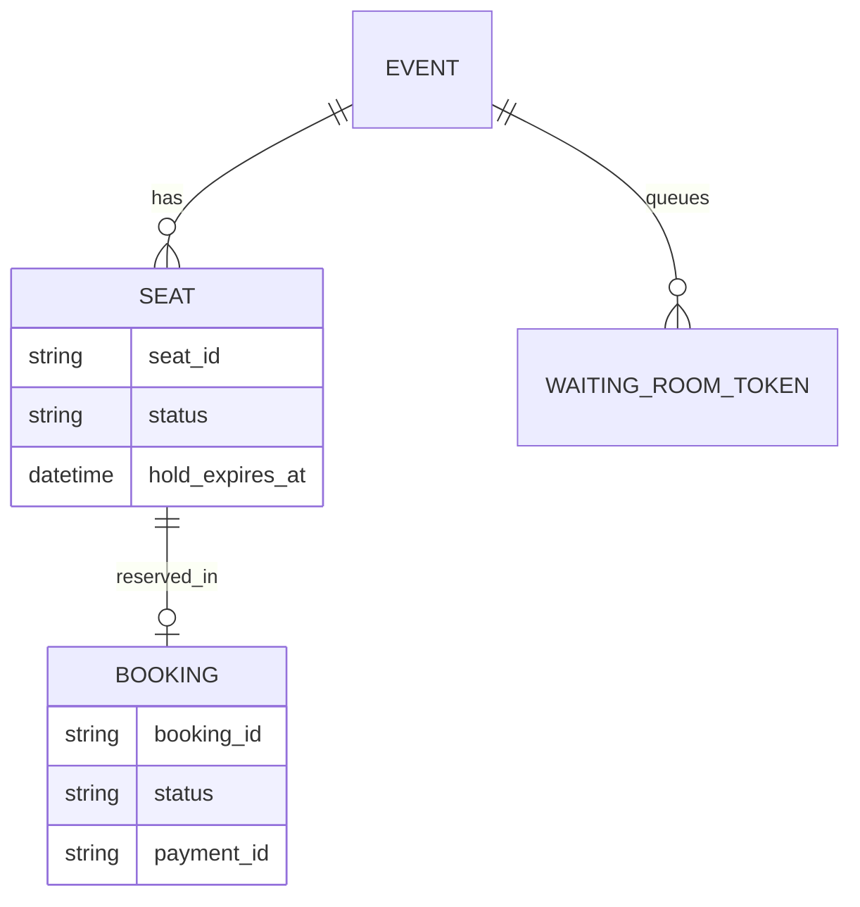
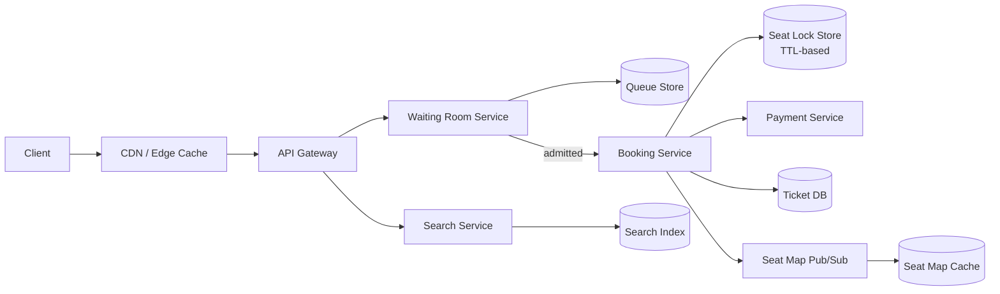
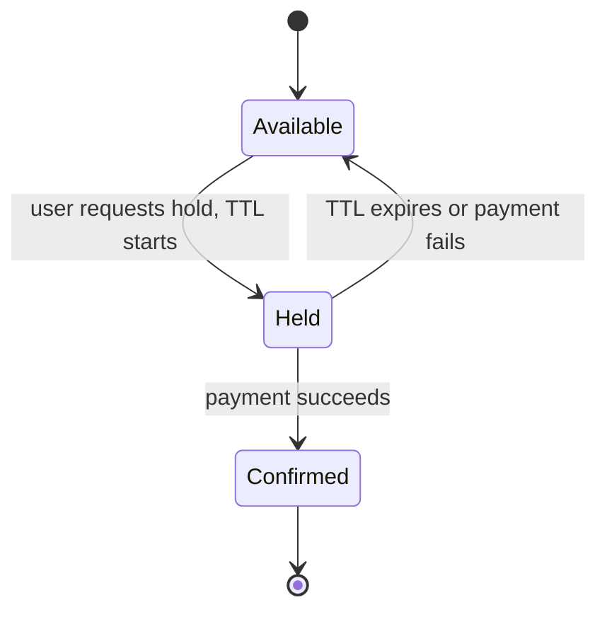
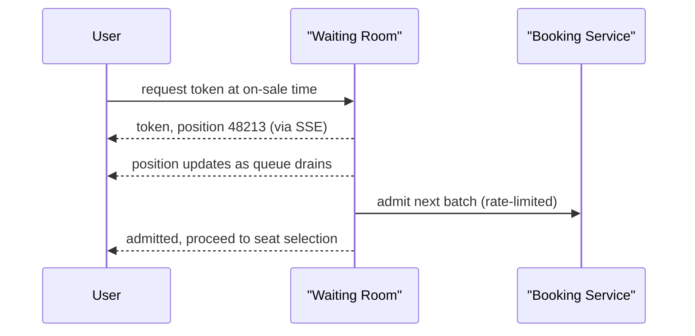

A ticket booking system lets users find an event, pick seats, and pay before someone else takes the same seat. The defining challenge is contention: at the moment a popular show goes on sale, far more people want a seat than there are seats, all within the same few seconds.

## Requirements

The core loop — browse, hold, pay, confirm — is worth sketching before diving into the contention problem it creates:


### Functional

- Browse and search events; view a seat map with real-time availability.
- Hold selected seats temporarily while the user completes payment.
- Confirm the booking once payment succeeds; release the hold if it doesn't.
- Prevent any seat from being sold to two different users.

### Non-functional

- Correctness is paramount: zero double-bookings, even under extreme concurrent load.
- Handle a massive burst of demand the instant a popular event goes on sale (a "thundering herd").
- Seat map views must reflect near-real-time availability so users don't pick a seat that's already gone.
- Browsing/search latency should stay low even while a flash sale is in progress elsewhere on the platform.

### Out of scope

- Dynamic/surge pricing algorithms.
- Venue and seller onboarding tooling.
- Secondary market/resale marketplace.

## Scale estimation

| Metric | Assumption | Working | Result |
|---|---|---|---|
| Seats in a popular venue | given | given | 50,000 |
| Concurrent buyers at on-sale moment | flash-sale demand | given | 10M within first 10 min |
| Naive booking attempt rate | 10M / 600s | 10,000,000 / 600 | ~16,700 req/sec |
| Success rate of those attempts | 50,000 seats / 10M buyers | 50,000 / 10,000,000 | ~0.5% |
| Platform-wide page views/day | general browsing | given | 200M/day |
| Browse QPS (avg) | 200M / 86,400s | 200,000,000 / 86,400 | ~2,300/sec |
| Browse QPS (during unrelated flash sale) | must stay unaffected | isolated by design | ~2,300/sec (unchanged) |
| Ticket storage/event | 50,000 seats × 200 bytes | 50,000 × 200B | ~10 MB/event |

> [!TIP]
> The number worth saying out loud: **99.5% of the 16,700 requests/second at on-sale time are guaranteed to fail** — they're competing for seats that don't exist. That reframes the problem from "how do we process bookings fast" to "how do we admit demand in a controlled order so the booking service only ever sees traffic proportional to actual supply."

## Core entities and data model

The four entities and their relationships:


| Entity | Key fields |
|---|---|
| `Event` | `event_id`, `venue_id`, `start_time` |
| `Seat` | `seat_id`, `event_id`, `status` (available/held/sold), `hold_expires_at`, `held_by_user_id` |
| `Booking` | `booking_id`, `user_id`, `seat_ids[]`, `status`, `payment_id` |
| `WaitingRoomToken` | `token`, `user_id`, `event_id`, `position`, `issued_at` |



## API design

```http
GET /events/{eventId} -> Event + Venue + seat map + availability
GET /events/search?keyword=&start=&end=&page= -> Event[]

GET /waiting-room/{eventId}/token -> { "token": "wr_1", "position": 48213 }
GET /waiting-room/{eventId}/status?token=wr_1 -> { "position": 12, "admitted": false }  // via SSE/WebSocket

POST /events/{eventId}/holds
{ "seatIds": ["A12", "A13"], "waitingRoomToken": "wr_1" }
-> 201 { "holdId": "h_1", "expiresAt": "2026-...T14:10:00Z" }

POST /bookings
{ "holdId": "h_1", "paymentDetails": {...} }
-> 201 { "bookingId": "b_1", "status": "confirmed" }
```

## High level architecture



**On-sale flow:** (1) users arriving before/at on-sale time are placed in a virtual waiting room and issued a token with a queue position, streamed to them over SSE/WebSocket, (2) the waiting room admits users in controlled batches sized to what the booking service can actually handle, (3) an admitted user selects seats and requests a hold, which atomically marks those seats `held` with a TTL and a `hold_id`, (4) the user completes payment within the hold's TTL, (5) on payment success the booking is confirmed with a conditional update that only succeeds for that same unexpired `hold_id`; on failure or TTL expiry, the hold releases and the seat map cache is updated via pub/sub so other users see it become available again.

Three simpler flows sit ahead of that contention path and are worth sketching on their own: viewing a single event's page and seat map —


— searching across events —


— and, once a user has actually chosen seats, the booking call itself:


## Deep dive: the hold/reserve/confirm state machine



A seat is never sold in one step. It moves through `available -> held -> confirmed`, with the hold carrying a short TTL (commonly 5–10 minutes) that gives the user enough time to complete payment without indefinitely blocking the seat from everyone else. This is the single mechanism that prevents double-booking: once a seat is `held`, no other hold request for that seat can succeed until the TTL expires or the hold is released.

> [!KEY]
> The TTL is what makes the system self-healing. Without it, a user who abandons checkout (closes the tab, payment page hangs) would permanently lock a seat with no automatic recovery path — the hold's expiry is what returns that seat to the pool without requiring any manual intervention.

The hold and confirm transitions must be enforced by the durable seat store, not just by an in-memory lock. The exact SQL varies by database, but the shape is a conditional update:

```sql
-- hold: succeeds only if every selected seat is still available
UPDATE seats
SET status = 'held', hold_id = :hold_id, held_by_user_id = :user_id, hold_expires_at = :expires_at
WHERE event_id = :event_id
  AND seat_id IN (:seat_ids)
  AND status = 'available';

-- confirm: succeeds only for the same unexpired hold
UPDATE seats
SET status = 'sold', booking_id = :booking_id
WHERE event_id = :event_id
  AND seat_id IN (:seat_ids)
  AND status = 'held'
  AND hold_id = :hold_id
  AND hold_expires_at > now();
```

The service checks that the affected-row count equals the number of requested seats; otherwise the hold or confirm fails. A row lock or serializable transaction around the selected seats gives the same guarantee in databases that prefer explicit locking.

## Deep dive: concurrency control strategy

| Approach | How it works | Best for | Weakness |
|---|---|---|---|
| Pessimistic locking | Acquire a row-level DB lock (or distributed lock) on the seat before anyone can even attempt to hold it | Moderate contention, straightforward correctness | Lock contention itself becomes a bottleneck under extreme concurrent demand on the same seats |
| Optimistic locking | Read seat state with a version number; update succeeds only if the version hasn't changed | Low-to-moderate contention, avoids holding locks | Under very high contention, most attempts fail and retry, wasting work |
| Queue-based serialization | All hold requests for a given event/seat go through a single ordered queue/actor, processed one at a time | Extreme contention on the same small set of seats (front-row, popular events) | Adds a small amount of latency per request since work is serialized |

> [!WARNING]
> A distributed lock implemented with Redis (`SET seat:A12 user_id NX PX 300000`) is a useful fast-path guard, but it must be backed by the conditional database transition above. Redis can expire early, be promoted from a slightly stale replica, or be lost during failover; the durable seat row is the final source of truth for whether a hold can become a sold booking.


For the single hottest seats during a flash sale, queue-based serialization (funnel all attempts for that exact seat through one ordered processor) avoids the wasted work of many optimistic-locking retries all failing against each other simultaneously.

## Deep dive: virtual waiting room and the thundering herd

A naive design lets all 10M interested users hit the booking service directly at on-sale time, creating ~16,700 requests/second where 99.5% are guaranteed to fail — wasted load that can degrade the service for the 0.5% who could actually succeed.



The waiting room holds users in an ordered, persistent-connection queue (SSE or WebSocket, backed by a Redis-based queue for position tracking) and admits them into the actual booking flow in batches sized to what the booking service and seat inventory can support — effectively converting an unbounded burst into a controlled, rate-limited stream. This protects both the booking service (bounded concurrent load) and gives users an honest, visible queue position instead of silently failing requests.


## Deep dive: seat map caching, real-time updates, and payment timeout

The seat map (which seats are available/held/sold) is read far more often than it changes, so it's cached — but must reflect holds and releases quickly, or users repeatedly pick seats that are already gone. A pub/sub layer publishes every seat state change (hold acquired, hold released, seat confirmed) to subscribers viewing that event's seat map, so connected clients see near-real-time updates rather than polling.

When a hold's TTL expires without a confirmed payment — the most common release trigger — a background sweep (or the TTL mechanism itself, if using Redis expiry with a keyspace-notification listener) marks the seat `available` again and publishes that change, so the very next queued or waiting-room-admitted user can pick it up almost immediately.

## Deep dive: search and browse scaling

The view and search paths are architecturally simpler than booking, but they still have to survive tens of millions of concurrent requests during a popular on-sale — the fix is the standard read-scaling trio of caching, load balancing, and horizontal scaling in front of the event-detail endpoint:


Keyword search over events (by name, date range, venue, performer) is a poor fit for a regular relational query at low latency once the catalog is large — a dedicated full-text search engine (Elasticsearch or similar) indexes events for fast, ranked keyword lookups instead:


The same popular queries (a trending artist's name, a city's upcoming events) repeat constantly, so caching the search engine's own results — plus pushing especially hot queries out to an edge cache — cuts both latency and load on the search cluster for exactly the traffic pattern that matters most:


## Bottlenecks and scaling

- **Seat lock store under peak contention** — partition by event ID so one hot event's lock traffic doesn't affect unrelated events on the platform.
- **Waiting room admission rate** — tune batch size to the booking service's real sustainable throughput, not to user impatience; admitting too fast defeats the purpose.
- **Seat map pub/sub fan-out** — a single popular event can have millions of subscribers watching its seat map; partition pub/sub channels per event and consider a slightly throttled broadcast rate rather than pushing every micro-update instantly.
- **Search/browse isolation** — keep the search/browse path on separate infrastructure from booking, so a flash sale for one event doesn't degrade browsing for the rest of the platform.

## Failure scenarios

| Failure | Blast radius | Mitigation |
|---|---|---|
| Seat lock store (Redis) down | No new holds can be acquired for any event | Fail closed on new holds (safer than risking double-booking); existing confirmed bookings unaffected since they're already durably stored |
| Payment service down mid-hold | User can't complete checkout | Hold TTL auto-releases the seat if payment doesn't complete in time; user can retry once payment recovers |
| Waiting room service down | Users can't queue for an upcoming on-sale | Booking service can apply a coarse fallback rate limit directly, degrading gracefully rather than accepting unbounded load |
| Seat map pub/sub down | Clients see stale availability | Clients fall back to polling at a lower frequency; the underlying conditional seat state remains the source of truth and still prevents double-booking even if the UI is stale |

## Cheat sheet

- Seats move through `available -> held -> confirmed`, with a TTL on the hold — this single mechanism prevents double-booking and self-heals on abandonment.
- Distributed lock with TTL (e.g. Redis `SET NX PX`) is pessimistic locking in practice, and the TTL doubles as the hold expiry.
- For the single hottest seats, queue-based serialization beats optimistic-locking retries that all fail against each other.
- A virtual waiting room converts an unbounded burst into a controlled, rate-limited admission stream — this is what protects the booking service, not faster locking.
- Seat map is cached and updated via pub/sub for near-real-time accuracy, but the durable seat row and its conditional state transitions remain the actual source of truth for correctness.
- Isolate browse/search infrastructure from booking infrastructure so a flash sale doesn't degrade the rest of the platform.
- Use a dedicated search engine (Elasticsearch or similar) for keyword search, with result caching for the small set of queries that dominate traffic.
- Fail closed (deny new holds) rather than fail open on the lock store — correctness beats availability here, unlike many other systems.

## Common mistakes

| Mistake | Fix |
|---|---|
| Allowing all interested users to hit the booking service directly at on-sale time | Use a virtual waiting room to admit users in a controlled, rate-limited stream |
| Marking a seat "sold" the instant it's selected, with no hold/TTL step | Use a hold state with a TTL so abandoned checkouts release the seat automatically |
| Using a separate check-then-lock (read seat status, then lock) instead of one atomic operation | Use a single atomic conditional lock acquisition (e.g. Redis `SET NX`) |
| Fail-open on the seat lock store during an outage | Fail closed — a lost lock check risks double-booking, which is worse than temporary unavailability |
| Polling the seat map aggressively from every client | Push updates via pub/sub/WebSocket instead of high-frequency polling |

## Summary

A ticket booking system's central problem is contention, not storage: preventing two people from getting the same seat while a huge, synchronized burst of demand arrives in a few seconds. The hold/reserve/confirm state machine with a TTL is what makes correctness and self-healing possible; a virtual waiting room is what makes the booking service's load survivable in the first place, by admitting demand at the rate supply can actually absorb rather than letting every interested user hit the system at once.

## Top Interview Questions

### Q1. How do you prevent two users from booking the same seat at the same time?

A seat moves through an explicit state machine — `available -> held -> confirmed` — and the transition into `held` must be a single atomic, conditional operation, not a separate check followed by a write. Implemented as a conditional database update (optionally fronted by Redis `SET seat:A12 user_id NX PX 300000` as a fast-path lock), only the first request can move the row from `available` to `held`, and confirmation later succeeds only for the same unexpired `hold_id`. This is the same category of fix as the atomic conditional decrement used to prevent overselling in inventory systems — the check and the state change must be indivisible.

### Q2. Why use a hold with a TTL instead of immediately marking a seat as sold when a user selects it?

Selecting a seat is not the same as paying for it — users abandon checkout, payment can fail, or a session can simply time out. If selection immediately marked the seat sold with no recovery path, abandoned selections would permanently lock inventory that never actually gets purchased. A time-boxed hold (5–10 minutes is typical) reserves the seat exclusively for that user during checkout, and automatically expires back to `available` if payment doesn't complete in time — making the system self-healing without needing to detect every possible abandonment scenario explicitly.

### Q3. Compare pessimistic locking, optimistic locking, and queue-based serialization for seat reservation. When would you use each?

Pessimistic locking acquires an exclusive lock (DB row lock or distributed lock) before any contention can occur, giving straightforward correctness at the cost of lock contention under extreme concurrent demand for the same seats. Optimistic locking instead checks a version number at write time and fails the update if it changed since read, avoiding held locks but wasting work when many concurrent attempts collide and most retries fail. Queue-based serialization funnels all requests for a specific hot resource (say, front-row seats at a sold-out show) through a single ordered processor, avoiding wasted contention entirely at the cost of processing requests one at a time. In practice: pessimistic locking (via a TTL-based distributed lock) is the default for most seats, with queue-based serialization reserved for the handful of seats experiencing genuinely extreme simultaneous demand.

### Q4. What is a virtual waiting room, and why is it necessary even if seat locking is perfectly correct?

Even a perfectly correct locking mechanism doesn't solve the problem of 10 million users hitting the booking service simultaneously for 50,000 seats — 99.5% of those requests are guaranteed to fail, but processing and rejecting them all still consumes real capacity (connections, CPU, lock-store traffic) that could destabilize the service for the users who could actually succeed. A virtual waiting room holds users in an ordered queue (via a persistent connection like SSE or WebSocket) and admits them into the actual booking flow in controlled batches sized to what the system can sustainably handle, converting an unbounded instantaneous burst into a bounded, rate-limited stream. It also gives users an honest visible queue position instead of a wall of failed retry attempts.

### Q5. How do you size the batch admission rate for the waiting room, and what happens if you get it wrong?

The batch size and admission rate should be tuned to the booking service's actual sustainable throughput — not to how impatient users are — since admitting too fast defeats the entire purpose of the waiting room and just recreates the thundering herd one step later, inside the booking flow instead of at the front door. If admitted too slowly, users wait longer than necessary and legitimate capacity goes underused; if admitted too fast, the booking service and seat lock store see the same contention spike the waiting room was meant to prevent. In practice this is tuned empirically against load tests and monitored live during the actual on-sale event, with the ability to throttle the admission rate dynamically if downstream latency starts climbing.

### Q6. What happens if the seat lock store (e.g. Redis) becomes unavailable during a high-demand on-sale event?

This should fail closed, not open: if the system can't verify whether a seat is currently held, allowing a new hold to proceed risks double-booking, which is a worse and harder-to-reverse outcome than temporary unavailability. New hold requests are rejected (with a clear "try again shortly" response) until the lock store recovers, while already-confirmed bookings — which are durably persisted in the ticket database, independent of the lock store — remain completely unaffected, since confirmation is the final state and no longer depends on the lock.

### Q7. How would you keep the seat map users see up to date without hammering the backend with polling from every connected client?

Rather than each client repeatedly polling for the current seat map, the booking service publishes every seat state change (hold acquired, hold released, seat confirmed) to a pub/sub channel scoped to that event; clients viewing the seat map subscribe (typically over a WebSocket or SSE connection) and receive pushed updates as they happen. This is both lower latency (near-real-time rather than poll-interval-delayed) and dramatically less load on the backend than thousands or millions of clients independently polling on a timer.

### Q8. A user's payment takes longer than the hold's TTL to process — say, a slow 3D Secure confirmation step. How do you handle this without either losing their seat or double-booking it?

There are two reasonable approaches, and naming the trade-off matters: either extend the TTL once, when payment processing has demonstrably started (e.g. the payment service has returned "pending, awaiting 3DS," not just silence), giving a bounded grace period rather than an indefinite one; or let the hold expire but check, before releasing the seat, whether a payment is genuinely still in flight for that hold ID, and only release if it is not. Either way, the seat must never be released while a payment attempt against it is still genuinely pending, and the extension must be bounded — an indefinitely extendable hold reintroduces the original abandoned-checkout problem.

### Q9. Why should the search/browse path be architecturally isolated from the booking path?

Search and browse (viewing events, seat availability previews, general catalog traffic) run at high, fairly steady volume across the whole platform, while booking traffic for a single popular event can spike enormously and briefly. If they share infrastructure, a flash sale for one event can degrade or exhaust resources (connections, CPU, cache capacity) needed for unrelated users simply browsing other events — an isolated, independently scaled search/browse tier (its own cache, its own service instances) ensures a booking surge for one event doesn't become an incident for the whole platform.

### Q10. How would you design this system to avoid a small group of bots/scalpers acquiring a disproportionate share of holds the instant an event goes on sale?

While full anti-bot/anti-scalping is out of scope for the core architecture, a few structural choices help: requiring waiting-room admission (with, e.g., a lightweight CAPTCHA or account-level rate limiting at token-issuance time) makes naive high-volume scripted requests harder to scale linearly; limiting the number of seats a single account/session can hold simultaneously bounds how much inventory one actor can lock up at once; and logging/alerting on anomalous hold-to-confirm ratios per account (many holds, few completed payments) surfaces likely bot behavior for a separate abuse-response system to act on, even though building that detection system in depth is a distinct problem from the booking architecture itself.

### Q11. How would this design change for a lower-contention scenario, like booking a routine flight seat months in advance, versus a flash-sale concert?

The state machine (hold -> confirm with a TTL) and atomic locking stay the same, since double-booking must be prevented regardless of contention level — but the extreme-scale mitigations become unnecessary overhead: a virtual waiting room and aggressive queue-based serialization for hot seats add complexity that isn't justified when demand never meaningfully exceeds supply at any single moment. In that lower-contention case, straightforward pessimistic or even optimistic locking on individual seats, without a waiting room in front of the booking service at all, is simpler and entirely sufficient — a good answer shows you match the mitigation to the actual level of contention rather than over-engineering every booking system identically.

### Q12. How would you make keyword search across events meet a low-latency requirement as the event catalog grows?

A relational database's `LIKE`/full-text extensions don't scale well to fast, ranked, multi-field search (name, venue, performer, date range) once the catalog is large, so a dedicated search engine like Elasticsearch is the standard answer — it maintains an inverted index built for exactly this access pattern and returns ranked results in milliseconds regardless of catalog size. On top of that, since a small set of queries (a trending artist, a city's "this weekend" listings) accounts for a disproportionate share of traffic, caching the search engine's own response for popular queries — and pushing the hottest of those out to an edge/CDN cache — avoids re-running the same expensive ranked query for every user searching the same thing, which is what actually keeps p99 latency low under real traffic rather than the indexing engine alone.
