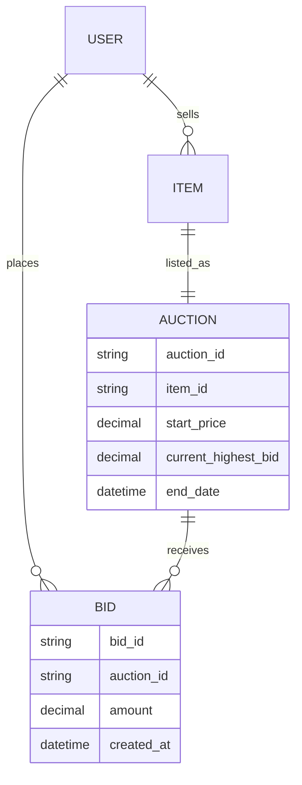
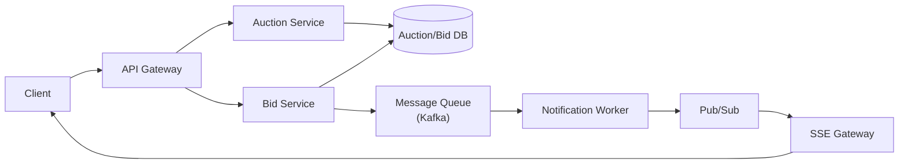

An auction system lets sellers list an item with a starting price and end date, and lets buyers bid against each other, with only strictly-higher bids accepted. The core tension is consistency versus scale: every bid must be checked against the current highest bid without a race condition, yet the system also has to broadcast that highest bid to every interested viewer in real time, across potentially millions of auctions running at once.

## Requirements


### Functional

- Sellers can post an item for auction with a starting price and end date.
- Buyers can bid on an item; a bid is only accepted if it is strictly higher than the current highest bid.
- Anyone can view an auction, including its current highest bid, in near real time.

### Non-functional

- Strong consistency on bid acceptance: two simultaneous bids must never both be accepted as "the highest."
- Fault tolerance and durability: an accepted bid must never be silently lost, even during partial failures.
- The current highest bid should update for viewers in real time, not on manual refresh.
- Scale to 10M concurrent auctions.

### Out of scope

- Payment processing and escrow once an auction closes.
- Seller/item verification and fraud detection.
- Search and discovery/browsing of active auctions.

## Scale estimation

| Metric | Assumption | Working | Result |
|---|---|---|---|
| Concurrent live auctions | given | given | 10M |
| Avg auction duration | assumption | given | 2 days |
| New auctions started/day | concurrency ÷ duration (Little's Law) | 10,000,000 / 2 | 5M auctions/day |
| Avg bids per auction | assumption | given | 15 |
| Total bids/day | 5M auctions × 15 bids | 5,000,000 × 15 | 75M bids/day |
| Write QPS (avg) | 75M / 86,400s | 75,000,000 / 86,400 | ~870 bids/sec |
| Write QPS (peak, closing-time sniping burst) | 10× average | 870 × 10 | ~8,700 bids/sec |
| Avg viewers per live auction | assumption | given | 5 |
| Naive polling reads (every 5s) | 10M auctions × 5 viewers / 5s | 50,000,000 / 5 | ~10,000,000 reads/sec |
| Read : write ratio (naive polling) | 10,000,000 : 870 | — | ~11,500 : 1 |
| Bid storage/day | 75M bids × 200 bytes | 75,000,000 × 200B | ~15GB/day |

> [!TIP]
> The naive-polling row is the whole argument for a push-based read path: at 10M concurrent auctions, even a modest handful of viewers per auction polling every few seconds produces millions of reads/sec that a database was never meant to absorb. That number is what justifies SSE over refresh-based polling later on.

## Core entities and data model

| Entity | Key fields |
|---|---|
| `Item` | `item_id`, `name`, `description`, `seller_id` |
| `Auction` | `auction_id`, `item_id`, `start_price`, `current_highest_bid`, `current_highest_bidder_id`, `start_date`, `end_date`, `status` |
| `Bid` | `bid_id`, `auction_id`, `bidder_id`, `amount`, `created_at` |




`Auction.current_highest_bid` is a deliberately denormalized field: rather than aggregating the `Bid` table on every read, the auction row caches the winning amount so a viewer's read is a single-row lookup. Every bid write has to update this cached value and insert the `Bid` row consistently, so bid acceptance is the correctness-critical transaction in the design.

## API design

```http
POST /auctions -> Auction & Item
{
    item: Item,
    startDate: Date,
    endDate: Date,
    startingPrice: number,
}

POST /auctions/:auctionId/bids -> Bid
{
    Bid
}

GET /auctions/:auctionId -> Auction & Item
```

`GET /auctions/:auctionId` is intentionally simple — it returns the full current state (item plus auction, including the current highest bid) rather than requiring a separate call, since that's the one thing every viewer of an auction page needs at once.

## High level architecture



1. A seller creates an auction; the auction service persists the `Item` and `Auction` rows and sets `status: active`.
2. A buyer submits a bid; the bid service validates it against the current highest bid under row locking or optimistic concurrency control, and only if it's strictly higher does it get accepted.
3. On acceptance, the bid service inserts the `Bid` row and updates the auction's cached `current_highest_bid` in the same database transaction, also writing an outbox event for downstream notification.
4. A notification worker reads the outbox/queue and publishes the new highest bid to a pub/sub topic for that auction; it never decides the winner itself.
5. Every viewer with an open SSE connection to that auction's topic receives the updated highest bid within moments, without needing to refresh or poll.

### Users should be able to post an item for auction with a starting price and end date


### Users should be able to bid on an item, where bids are accepted only if higher than the current highest bid


### Users should be able to view an auction, including the current highest bid

A first, simple version of this can rely on plain HTTP polling or manual refresh, before layering in real-time push.


## Deep dive: strong consistency for bids

Two bids arriving at nearly the same instant must not both be accepted as the new highest bid — this is the correctness-critical path of the whole system. Two concurrency-control strategies solve it:

**Pessimistic locking** takes a row-level lock on the auction before checking and updating the highest bid, serializing all bids for that auction through the lock. This guarantees correctness at the cost of throughput on any single, very actively-bid auction.


**Optimistic concurrency control (OCC)** instead reads the current highest bid and a version number, computes whether the new bid wins, and writes it back conditioned on the version being unchanged — retrying if another bid won the race in between. This avoids holding a lock but requires a retry loop under contention.


> [!KEY]
> OCC is generally the better default: most auctions aren't contended bid-by-bid at the microsecond level, so the retry path is rarely exercised, and it avoids holding a lock (and the associated blocking) for the common case. Pessimistic locking earns its keep specifically on the last seconds of a hot auction, where genuine simultaneous bids are likely.

The accepted-bid write must update the cached winner and insert the bid atomically:

```sql
-- optimistic form, inside one transaction
UPDATE auctions
SET current_highest_bid = :amount,
    current_highest_bidder_id = :bidder_id,
    version = version + 1
WHERE auction_id = :auction_id
  AND status = 'active'
  AND end_date > now()
  AND :amount > current_highest_bid
  AND version = :expected_version;

-- only if exactly one row was updated:
INSERT INTO bids (bid_id, auction_id, bidder_id, amount, created_at)
VALUES (:bid_id, :auction_id, :bidder_id, :amount, now());

INSERT INTO outbox_events (event_type, aggregate_id, payload)
VALUES ('bid.accepted', :auction_id, :payload);
```

If the update affects zero rows, the bid lost the race or was too low. This is the invariant-preserving step; Kafka/pub-sub only spreads the result to readers.

## Deep dive: fault tolerance and durability

A bid that a buyer believes was accepted must never silently disappear, even if the notification path or downstream consumer fails. The source-of-truth durability is the database transaction that updates the auction row, inserts the bid, and writes an outbox event. A queue such as Kafka then gives three downstream properties: durable delivery of the notification event, buffering for bursts (like the closing-seconds sniping spike), and ordering per auction. Kafka fits well here specifically because it offers high throughput, durability, and partitioning — events for a given `auction_id` can be routed to the same partition, preserving order for that auction without needing global ordering across all auctions.


## Deep dive: real-time highest-bid display

Once a bid is accepted, viewers need to see the new highest bid without refreshing. Server-Sent Events (SSE) are a good fit here for the same reason they suit any server-to-client-only stream: no full-duplex handshake overhead, and it runs over plain HTTP.


## Deep dive: scaling to 10M concurrent auctions

With 10M auctions live at once, and each one having its own stream of highest-bid updates, no single bid service instance can hold all the state or all the SSE connections. The fix is **pub/sub for coordination between bid services**: when one bid service instance processes a winning bid for an auction, it broadcasts that update to a pub/sub topic; whichever bid service (or SSE gateway) instance is actually holding the client connections interested in that auction picks it up from the topic and pushes it onward. This decouples "which instance processed the write" from "which instance owns the read-side connections," so both sides scale independently.


> [!WARNING]
> Don't let the SSE gateway or bid service instance that happens to process a bid also be responsible for pushing it to every viewer directly — at 10M concurrent auctions, that instance has no way to know which of potentially thousands of other instances hold the relevant connections. Pub/sub is what removes that coupling.

## Bottlenecks and scaling

- **Hot auctions near closing time** — a small fraction of auctions attract most of the last-minute bidding volume ("sniping"); the message queue partition for that auction absorbs the burst without blocking others.
- **OCC retry storms** — under very high contention on a single auction, OCC's read-check-write-retry loop can itself become the bottleneck; fall back to pessimistic locking specifically for auctions crossing a bid-rate threshold.
- **SSE connection fan-out** — as with any real-time comment/update stream, co-locate viewers of the same auction on the same gateway instances so pub/sub fan-out targets only relevant connections.
- **Cold auctions** — the vast majority of the 10M concurrent auctions have few or no bids at any given moment; don't provision real-time infrastructure uniformly — scale gateway/connection capacity to where viewers actually are.

## Failure scenarios

| Failure | Blast radius | Mitigation |
|---|---|---|
| Message queue partition down | Bids for auctions on that partition delayed | Kafka replication keeps the partition durable; bid service retries once the partition recovers |
| Notification worker down | Highest-bid updates stop propagating to viewers | Queue buffers events; SSE clients briefly see a stale highest bid, backfilled once the worker recovers |
| Bid service instance crash mid-write | A single in-flight bid may need retry | Client retries with an idempotency key; the DB transaction/outbox boundary ensures an accepted bid and its notification event commit together or not at all |
| Pub/sub outage | Real-time updates stop; viewers see stale highest bid | Fall back to client-side polling of `GET /auctions/:auctionId` until pub/sub recovers |

## Cheat sheet

- Cache the current highest bid on the auction row; don't aggregate the bid table on every read.
- Optimistic concurrency control by default; pessimistic locking for auctions with genuinely high bid contention near closing time.
- Commit every accepted bid with an atomic auction-row update, bid insert, and outbox event; Kafka then delivers the accepted-bid event to viewers without owning correctness.
- SSE for real-time highest-bid push; plain polling is an acceptable fallback and a reasonable starting point.
- Pub/sub decouples "which instance processed a bid" from "which instance holds the viewer's connection" — essential once you have far more auctions than any one instance can track.
- Partition the queue and connections by `auction_id` so one hot auction never blocks others.

## Common mistakes

| Mistake | Fix |
|---|---|
| Checking and updating the highest bid without any concurrency control | Use pessimistic locking or OCC; otherwise two simultaneous bids can both appear to win |
| Letting a notification worker update the highest bid asynchronously | The bid acceptance transaction must update `Auction.current_highest_bid`; the queue only publishes the already-accepted result |
| Always using pessimistic locking everywhere | Default to OCC; it avoids blocking for the vast majority of auctions that aren't heavily contended |
| Having the processing instance push updates directly to all viewers | Use pub/sub so any instance can process a bid and any instance can serve the relevant viewers |
| Provisioning real-time infrastructure uniformly across all 10M auctions | Most auctions have near-zero concurrent viewers; scale connection capacity to where the traffic actually is |

## Summary

An auction system's hard problem is protecting a single number — the current highest bid — under real concurrency, while still broadcasting that number to viewers in real time at massive scale. Optimistic concurrency control (with pessimistic locking as an escape valve for hot auctions) keeps bid acceptance correct; a transactional outbox plus durable queue makes accepted-bid notifications fault tolerant; and pub/sub decouples bid processing from viewer notification so both scale independently across 10M concurrent auctions. SSE, not polling, is what makes the highest bid feel live once that pipeline is in place.

## Top Interview Questions

### Q1. How do you prevent two simultaneous bids from both being accepted as the highest bid?

Use a concurrency-control strategy on the read-check-write sequence around the auction's current highest bid. Pessimistic locking takes a row lock on the auction before checking and updating, serializing all bids for that auction so only one can proceed at a time. Optimistic concurrency control instead reads the current highest bid with a version number, computes whether the incoming bid wins, and writes back conditioned on the version being unchanged, retrying if another bid won the race first. Either approach prevents the "lost update" race where two bids both read the old highest bid and both think they've won.

### Q2. When would you choose optimistic concurrency control over pessimistic locking for bids, and vice versa?

OCC is the better default because most auctions aren't contended bid-by-bid — the retry path is rarely triggered, and no lock is held for the common case, keeping throughput high. Pessimistic locking earns its keep specifically for auctions experiencing genuine high-frequency simultaneous bidding, such as the closing seconds of a popular auction ("sniping"), where OCC's retry loop could itself become a bottleneck under heavy contention. A practical design can start with OCC everywhere and switch specific hot auctions to pessimistic locking once bid rate crosses a threshold.

### Q3. Why route accepted bids through a message queue instead of just writing directly to the database and returning?

A queue like Kafka provides durable downstream delivery, a buffer against bursts, and per-key ordering, but it should not be the component that decides the winning bid. The bid is accepted only when the database transaction updates `Auction.current_highest_bid`, inserts the `Bid`, and writes an outbox event. Kafka then carries that accepted-bid event to notification workers and SSE gateways; if they fail, the event is retried from the queue rather than lost. Partitioning by `auction_id` preserves ordering of notifications within one auction without requiring a single global ordering across all auctions, which would be a scalability bottleneck.

### Q4. Why is SSE preferred over WebSockets for showing the live highest bid?

The data flow is one-directional — the server pushes highest-bid updates to viewers; a viewer's own bid submission is a separate, ordinary HTTP request. WebSockets provide full-duplex communication that isn't needed here, at the cost of a distinct connection handshake and, often, infrastructure that has to be upgraded to support it. SSE runs over plain HTTP, is simpler to implement, and is a natural fit for a server-push-only stream like a highest-bid update.

### Q5. How does the system scale to 10M concurrent auctions without a single instance tracking all of them?

Through pub/sub coordination between bid service instances: whichever instance processes a bid publishes the resulting highest-bid update to a topic for that auction, and whichever instance (or SSE gateway) actually holds the relevant viewers' connections consumes it from the topic and pushes it onward. This decouples bid processing from viewer notification, so neither side needs global knowledge of the other — each instance only needs to know about the auctions it's actively involved in at that moment.

### Q6. What happens if a viewer's real-time connection drops during an active auction?

The client should fall back to fetching the current state directly via `GET /auctions/:auctionId`, which returns the authoritative current highest bid, on reconnect — there's no risk of "missing" a bid the way there might be with a pure event stream, because the endpoint always reflects current state rather than a history of deltas. Once reconnected, the client resubscribes to the real-time stream for that auction to resume live updates.

### Q7. Why does the `Auction` entity cache `current_highest_bid` rather than computing it from the `Bid` table on every read?

Auction view requests vastly outnumber bid submissions (the read:write ratio here is on the order of thousands to one), so computing `MAX(amount)` over potentially thousands of bids on every page view would be wasteful and slow. Caching the winning amount directly on the auction row makes a read a single-row lookup. The tradeoff is that every accepted bid write must now also update this cached field consistently with inserting the bid record, which is exactly what the concurrency-control mechanism (locking or OCC) has to guarantee.

### Q8. How would you handle a burst of bids in the final seconds of a popular auction ("sniping")?

This is the scenario where buffering and adaptive concurrency control both matter: bid requests arrive faster than they can all win, so the service should shed clearly stale/too-low bids quickly, while the accepted-bid outbox/queue absorbs the notification burst without dropping updates. It's also the scenario where switching that specific auction from optimistic to pessimistic concurrency control pays off, since genuine simultaneous bids are likely enough that OCC's retry loop would otherwise thrash rather than making progress.

### Q9. Why is Kafka specifically well-suited to this use case compared to a simpler queue?

Kafka offers high throughput, durability (messages are persisted and replicated, not just held in memory), and partitioning. Partitioning by `auction_id` gives per-auction ordering guarantees — bids for one auction are processed in the order they arrived — without forcing a single global order across all 10M concurrent auctions, which would serialize unrelated work unnecessarily and become a bottleneck at that scale.

### Q10. How would you extend this design to support "buy it now" or automatic proxy bidding?

Both extend the bid service's acceptance logic rather than the surrounding architecture. "Buy it now" is a bid acceptance shortcut: a bid at or above a fixed price immediately closes the auction, which the bid service can implement as an additional check before or after the standard highest-bid comparison, then publish an "auction closed" event through the same message-queue-and-pub/sub path used for highest-bid updates. Proxy bidding (auto-incrementing up to a max) requires storing each bidder's max amount and having the bid service automatically issue a counter-bid on their behalf when outbid, still going through the same concurrency-controlled acceptance path so correctness guarantees are unchanged.
