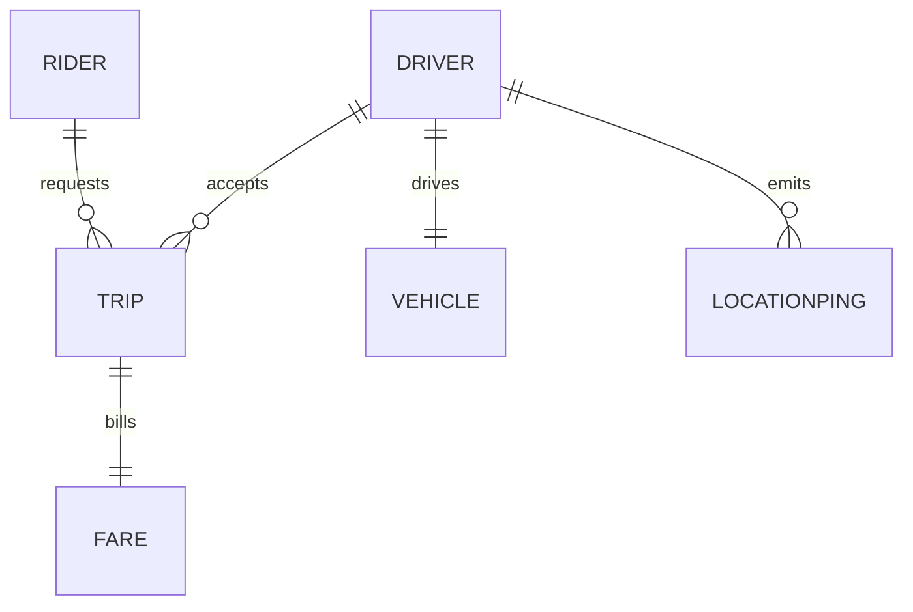
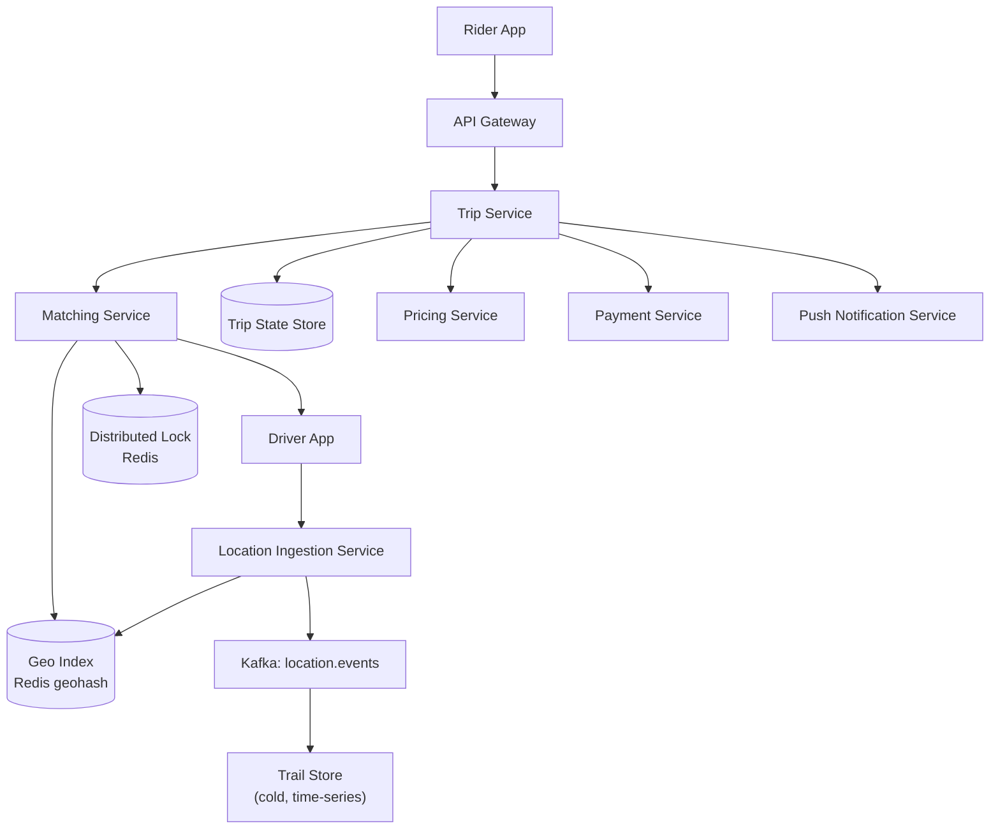
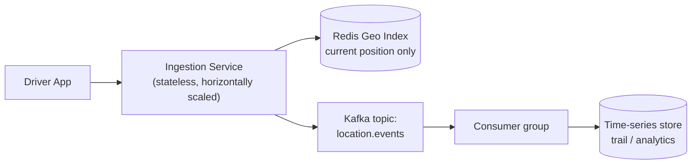
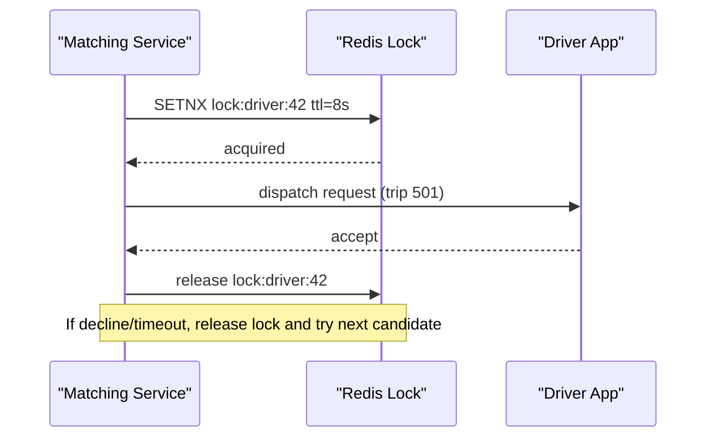
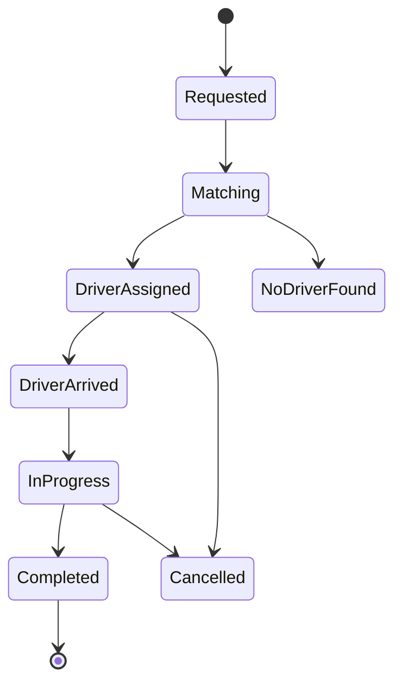

A ride-sharing service matches a rider who wants to go somewhere with a nearby available driver, tracks the trip live, and settles payment at the end. The hard parts are all about location at scale — ingesting a firehose of GPS pings, finding the nearest free driver in milliseconds, and making sure two riders never get matched to the same driver.

## Requirements

The product loop is simple to sketch even though the engineering underneath it isn't: estimate, request, match, ride:


### Functional

- Rider gets a fare estimate for a pickup and destination before booking.
- Rider requests a ride and is matched with one nearby, available driver.
- Driver receives the request and can accept or decline within a short window.
- Both parties see each other's live location during the trip.
- Fare is computed and charged automatically when the trip ends, including any surge multiplier.
- Both sides can view trip history.

### Non-functional

- Match latency: p99 under 5 seconds in a dense city.
- Location ingestion must scale to hundreds of thousands of writes/second.
- Strong consistency on the invariant "a driver has at most one active ride" — this cannot be eventually consistent.
- Location *display* can be eventually consistent — a driver marker lagging by a second is fine.
- Trip and payment records must be durable and auditable.

### Out of scope

- Driver onboarding, KYC, background checks.
- In-app chat, ratings, and review moderation.
- Multi-modal trip legs (walking + transit + car).
- Deep fraud/anti-abuse modeling (mentioned only where it touches matching).

> [!KEY]
> Everything in this design is downstream of one fact: driver location changes constantly and must be queried by proximity, not by key. That single requirement drives the choice of data structure, storage engine, and consistency model for half the system.

## Scale estimation

Assume a global platform operating in many cities simultaneously.

| Metric | Estimate | Arithmetic |
|---|---|---|
| Riders (DAU) | 20M | given |
| Drivers online at peak | 500,000 | ~5% of a 10M driver base active concurrently |
| Location ping interval | every 4 s | trade-off between freshness and load |
| Location write QPS | ~125,000/s | 500,000 drivers ÷ 4 s |
| Ride requests/day | 5,000,000 | given |
| Ride request QPS (avg / peak) | 58/s avg, ~580/s peak | 5M ÷ 86,400 s; ×10 for peak-hour surge |
| Read:write ratio (matching) | ~15:1 | each request scans ~15–20 candidate drivers via geo-query |
| Location data footprint | ~12.5 MB/s ingest | 125,000 writes/s × ~100 bytes/ping |
| Trip storage | ~5 GB/day | 5M trips × ~1 KB record |
| GPS trail (cold storage) | ~540 GB/day | 125,000/s ÷ 5 × 250B × 86,400s |

> [!TIP]
> Say the assumption out loud before the number: *"I'll assume 5% of registered drivers are online at any moment in a metro area — that's the number that drives everything downstream."* Interviewers care more about the reasoning chain than the exact digit.

## Core entities and data model

| Entity | Key fields |
|---|---|
| Rider | id, name, payment_method_id, home_market |
| Driver | id, name, vehicle_id, status (offline/available/en_route/on_trip), rating |
| Vehicle | id, driver_id, plate, category (economy/xl/premium) |
| Trip | id, rider_id, driver_id, pickup, dropoff, status, requested_at, started_at, completed_at, fare_id |
| Fare | id, trip_id, base, distance_cost, time_cost, surge_multiplier, total |
| LocationPing | driver_id, lat, lng, heading, speed, timestamp (hot path, not durably stored row-by-row) |



`LocationPing` is deliberately not modeled as a normal relational table — it lives in an in-memory geo-index (current position) and a time-series/cold-storage sink (historical trail), because its write rate and read pattern are nothing like the other entities.

## API design

```http
POST   /v1/fare-estimates          Body: { pickup, destination }              -> { fareEstimateId, priceRange, surgeMultiplier }
POST   /v1/trips                   Body: { fareEstimateId }                   -> { tripId, status: "matching" }
PATCH  /v1/trips/{id}               Body: { action: accept|decline }           -> { status }
POST   /v1/drivers/location         Body: { lat, lng, heading, speed }         -> 202 Accepted
GET    /v1/trips/{id}/tracking      (Server-Sent Events / WebSocket stream)    -> live lat/lng of counterparty
POST   /v1/trips/{id}/complete      Body: { finalLocation }                    -> { fare, receiptUrl }
```

`driverId` and `riderId` come from the auth session, never from the request body — a common review comment interviewers look for.

## High level architecture



Request flow for a ride:

1. Rider requests a fare estimate; the Pricing Service returns a price range plus current surge multiplier for the pickup zone.
2. Rider confirms; the Trip Service creates a `Trip` in `requested` state and asks the Matching Service to find a driver.
3. The Matching Service queries the geo index for the nearest available drivers around the pickup point, ranks candidates, and dispatches a request to the top one while acquiring a short-lived lock on that driver.
4. If the driver accepts, the trip moves to `driver_assigned`; if they decline or time out, the lock is released and the next candidate is tried.
5. Both apps open a tracking stream; the driver's location pings (already flowing into the geo index) are relayed to the rider, and vice versa for the driver's ETA to pickup.
6. Driver marks arrival, then trip start; the trip moves to `in_progress`.
7. On trip completion, the Trip Service finalizes distance/time, calls Pricing for the final fare (locking in any surge that applied at request time), and calls Payment to charge the rider and pay out the driver.
8. Trip and fare are persisted; both parties get a receipt/notification.

Sketched individually, the four moments a rider actually experiences look like this: getting the fare estimate,


requesting the ride,


being matched with a nearby driver,


and the driver accepting or declining the request:


## Deep dive: geospatial indexing — geohash vs quadtree vs S2

The core query is always "give me the k nearest available drivers to point P." Three structures compete for this job.

| Approach | How it works | Strength | Weakness |
|---|---|---|---|
| Geohash | Encode lat/lng into a base-32 string; nearby points share a prefix | Trivial to shard (prefix = shard key); native `GEOADD`/`GEOSEARCH` in Redis | Edge/boundary problem — two adjacent points can hash very differently near a grid edge; needs multi-cell lookups |
| Quadtree | Recursively subdivide a bounding box into 4 quadrants until each leaf has few points | Naturally adapts density — dense cities get small cells, rural areas large cells | Harder to shard cleanly; rebalancing on driver churn has overhead |
| Google S2 | Projects the sphere onto a cube, subdivides each face hierarchically into cells with a space-filling curve | True distance accuracy (accounts for Earth's curvature), consistent cell sizes at each level | More complex library/tooling; overkill below city scale |

> [!TIP]
> The senior answer names the trade-off, not just the winner: *"I'd use Redis geohash for the hot path because I get O(log n) proximity queries and free horizontal sharding by prefix, and I'd fall back to S2 only if we needed to reason precisely about cell boundaries across a whole continent."*

In practice: Redis `GEOADD`/`GEOSEARCH` (which uses geohash + a sorted set under the hood) covers city-scale matching well. To dodge the edge-cell problem, query the target cell plus its 8 neighbors and take the closest results by true haversine distance.


## Deep dive: high-throughput location ingestion

At 125,000 writes/second, writing straight to a durable relational store per ping would drown it. The pattern:



- The **current position** is a pure overwrite in Redis — no history, O(1) space per driver, and it directly backs the matching query.
- The **historical trail** (for ETA recompute, trip replay, fraud analysis) goes through Kafka so a slow downstream consumer never blocks the hot path, and is down-sampled before landing in cold storage.
- Adaptive ping interval: a driver sitting still or far from any pending request can ping every 15–20 s instead of 4 s, cutting load without hurting match quality where it matters — near an active demand cluster.

> [!WARNING]
> Do not put the location write and the matching read behind the same lock or transaction. They have wildly different volumes (125,000 writes/s vs. 580 reads/s) and coupling them turns a cheap overwrite into a queueing bottleneck.

## Deep dive: matching, dispatch, and driver contention

Two riders requesting a ride 200 m apart can both have the same driver as their #1 candidate. Without protection, both get "you've been matched" and one driver accepts twice.



- **Bad**: application-level in-memory locking — breaks the moment you run more than one Matching Service instance.
- **Good**: a DB row-level lock/status transition (`UPDATE drivers SET status='pending' WHERE id=? AND status='available'`) — works, but ties matching latency to database round trips.
- **Great**: a short-TTL distributed lock in Redis (`SET key value NX EX 8`) for dispatch, followed by a durable conditional status transition on accept (`UPDATE drivers SET status='on_trip' WHERE id=? AND status='pending' AND pending_trip_id=?`). The TTL bounds the damage if the Matching Service itself crashes mid-dispatch, while the database transition is the final source of truth for "one active trip per driver."


ETA is computed from the driver's current position and road-graph distance (via a routing engine or a pre-baked travel-time matrix per zone) rather than straight-line distance, and is re-estimated every few pings so the rider's countdown stays accurate.

Two related edges are worth naming rather than assuming away. First, a naive FIFO queue in front of matching doesn't survive a genuine demand spike — a queue with dynamic scaling (matching workers autoscale on backlog depth, not a fixed pool) is what keeps ride requests from being silently dropped when demand briefly outruns available drivers:


Second, a driver who fails to respond within the accept/decline window needs more than a bare retry: a hand-rolled delayed-message-after-timeout approach works but adds real coordination complexity to get right, so a managed durable-execution platform (Temporal, AWS Step Functions) is the stronger answer for production — it gives retries, timeouts, and state management as first-class primitives instead of code the matching service has to own itself.

## Deep dive: trip lifecycle, tracking, surge and payment



- **Surge pricing**: computed per geo-cell as `demand (open requests) / supply (available drivers)` over a rolling window; a multiplier is locked in at request time and again validated at completion so a trip that runs long doesn't silently re-price mid-ride.
- **Payment at trip end**: the final fare = base + distance × rate + time × rate × surge, charged via an idempotent call to the Payment Service keyed by `tripId` so a retried request never double-charges.
- **Real-time tracking**: a lightweight pub/sub channel per trip (WebSocket or SSE) fed by the same location stream used for matching, filtered to just the two relevant parties.

Put together — geo index, ingestion pipeline, matching, trip state, pricing, and payment — the assembled system looks like this:


## Bottlenecks and scaling

- **Hot geo-cells**: a stadium letting out floods one cell with both demand and supply spikes — mitigate with geo-sharding at a finer grain during known events and pre-positioning surge alerts.
- **Matching service as a single point of contention**: scale horizontally by partitioning geo-cells across instances so no two instances fight over the same driver's lock.
- **Database write amplification** for trip state — batch/queue non-critical state transitions (e.g., analytics events) away from the synchronous path.
- **Cross-region drivers**: shard the entire stack (geo index, matching, trip service) by metro area; a trip never needs to see drivers outside its own city.

## Failure scenarios

| Failure | Blast radius | Mitigation |
|---|---|---|
| Redis geo index node down | No new matches in affected shard | Replica promotion (Sentinel/Cluster); brief served-stale window is acceptable |
| Matching service crashes mid-dispatch | Driver stuck "locked" | Lock TTL auto-expires (e.g., 8 s), driver becomes available again |
| Driver app loses connectivity mid-trip | Tracking gap for rider | Last-known-position shown with a "signal lost" indicator; trip state unaffected |
| Payment service outage at trip end | Trip completes but fare unbilled | Trip marked `completed_pending_payment`; async retry queue with idempotency key |
| Kafka lag on location trail topic | Historical/ETA analytics stale | Does not affect live matching (which reads Redis directly); alert on consumer lag |

## Cheat sheet

- Current driver location = in-memory geo index (Redis geohash); historical trail = async, via Kafka, never on the hot path.
- Compare geohash vs quadtree vs S2 by sharding ease vs. accuracy — name the trade-off, don't just pick one.
- One driver, one active trip is a **strong consistency** invariant — use a short-TTL dispatch lock plus a durable conditional driver-status update, not app-memory or eventual consistency.
- Adaptive ping interval trades freshness for ingestion load.
- Surge is demand/supply per geo-cell over a rolling window, locked in at request time.
- Payment at trip end must be idempotent, keyed by `tripId`.
- Shard the whole stack by metro/geo region — a trip never crosses city boundaries.

## Common mistakes

| Mistake | Fix |
|---|---|
| Storing every GPS ping in a relational table synchronously | Use an in-memory geo index for current position, stream the rest through Kafka |
| Treating driver matching as eventually consistent | It must be strongly consistent — use a distributed lock with TTL |
| Ignoring the boundary problem in geohash queries | Query the target cell plus its 8 neighbors, then rank by true distance |
| Straight-line distance for ETA | Use road-graph distance or a precomputed travel-time matrix |
| Charging payment synchronously without idempotency key | Key the charge by `tripId` so retries can't double-charge |
| One global matching service instance | Partition by geo-cell so instances don't contend for the same drivers |

## Summary

A ride-sharing platform is a location-first system: the geospatial index and the ingestion pipeline that feeds it are the real engineering problem, not the CRUD around trips and payments. Get the geohash/quadtree/S2 trade-off right, keep the "one active trip per driver" invariant strongly consistent with a short-TTL dispatch lock plus durable status transition, decouple the hot location-write path from cold historical storage, and make the payment step idempotent. Everything else — surge pricing, tracking, trip state — is comparatively straightforward once those four pieces are solid.

## Top Interview Questions

### Q1. Why is Redis with geohashing preferred over a relational database with spatial indexes for driver location?

A relational database's spatial index (e.g., PostGIS with a quadtree/R-tree) supports proximity queries well but writes are disk-backed and transactional, which struggles at 100K+ writes/second. Redis holds the geo index entirely in memory, and `GEOADD`/`GEOSEARCH` are O(log n) sorted-set operations, so both the write (location ping) and the read (nearest-driver query) stay in the low milliseconds at that write rate. The trade-off is durability: Redis needs persistence (AOF/RDB) and replica failover (Sentinel/Cluster) because an in-memory store can lose data on a crash. Since a stale or briefly missing location is tolerable (eventual consistency) but a slow write is not, this trade favors Redis for the hot path.

### Q2. Walk through what happens if two riders' requests both pick the same nearest driver.

Both requests hit the Matching Service roughly concurrently, and both geo-queries return the same driver as the top candidate. Whichever request's dispatch attempt executes `SET lock:driver:42 NX EX 8` first wins the short-lived dispatch lock; the second attempt fails the `NX` check and immediately falls through to its next-ranked candidate instead of retrying the same driver. The winning request dispatches the ride request to the driver's app; on accept, the trip service performs a conditional durable transition to `on_trip` for that same `pending_trip_id`, and only that update makes the assignment final. This combination makes the "one driver, one active trip" invariant enforceable even with multiple Matching Service instances running concurrently.

### Q3. How would you compute and update surge pricing?

Divide the map into geo-cells (roughly matching the geohash precision used for matching). For each cell, maintain a rolling count of open ride requests (demand) and available drivers (supply) over a short window, e.g., 2–3 minutes. Surge multiplier is a function of the demand:supply ratio, often stepped (1.0x, 1.2x, 1.5x, 2x...) rather than continuous, to avoid riders seeing prices flicker. The multiplier is computed by a Pricing Service reading aggregated counters (often maintained in Redis or via a small stream-processing job) and is locked into the fare estimate at request time so a rider isn't surprised at trip end. A production system also caps surge to avoid regulatory/PR issues and smooths transitions to avoid cliff-edge pricing at cell boundaries.

### Q4. Why choose geohash over a quadtree, or vice versa, for this problem?

Geohash encodes a point as a string where shared prefixes mean spatial proximity, which makes sharding trivial — route by prefix, and Redis's built-in geo commands work out of the box. Its weakness is the boundary problem: two points a few meters apart across a cell edge can have very different hash prefixes, so you must query neighboring cells too. A quadtree adapts to density — dense downtown areas get many small cells, sparse suburbs get few large ones — giving more uniform query cost per cell regardless of driver density, but it's harder to shard and rebalance as drivers move between cells constantly. For a city-scale ride-sharing system where using an off-the-shelf in-memory store matters more than adaptive density, geohash (via Redis) is usually the pragmatic choice; a custom quadtree pays off if you need very fine control over cell sizing across wildly different regions.

### Q5. How do you keep location writes from overwhelming the system during a viral spike (e.g., a major event ending)?

First, the location ingestion path is already decoupled — it overwrites an in-memory key, so raw write volume doesn't hit a disk-backed database. Second, apply an adaptive ping interval: drivers far from any active demand cluster can safely ping less often (e.g., every 15–20 s) without affecting match quality, and you dynamically tighten the interval only for drivers near a hot zone. Third, the ingestion service itself is stateless and horizontally scaled behind a load balancer, so throughput scales with added instances. Finally, geo-shard the index itself — a citywide spike doesn't need every shard to handle the load if only a few geo-cells around the venue are hot.

### Q6. The rider sees the driver's location "jump" occasionally on the map. What could cause this and how do you fix it?

Likely causes: GPS noise/multipath in urban canyons, an increased ping interval kicking in and making updates coarser, or the tracking stream falling behind due to consumer lag. Fixes include client-side interpolation/smoothing between received points (draw a short animated tween instead of a hard jump), applying a simple filter (e.g., discard points implying an impossible speed) before publishing to the tracking channel, and ensuring the WebSocket/SSE tracking pipe reads from the same low-latency current-position store used by matching rather than the higher-latency trail store. It's also worth checking whether the ping interval adapted upward incorrectly while the driver was actually near an active trip.

### Q7. How would you make the "charge the rider at trip end" step safe against duplicate charges?

Generate a fare/charge request keyed by `tripId` (or a dedicated idempotency key created once when the trip transitions to `completed`) and pass that key to the Payment Service. The Payment Service persists a record of processed idempotency keys; if a retry arrives (due to a timeout, a client retry, or an at-least-once queue redelivery) with the same key, it returns the original result instead of charging again. The Trip Service itself should treat "charge" as a step it can safely retry to completion — the trip stays in `completed_pending_payment` until the Payment Service confirms success, at which point it's marked `completed_paid`. This gives at-least-once delivery with effectively-once billing.

### Q8. How do you calculate ETA, and why not just use straight-line distance?

Straight-line (haversine) distance ignores roads, one-way streets, traffic, and turns, so it systematically underestimates real travel time, especially in dense cities. Instead, ETA uses either a routing engine that computes shortest path over the road graph with live traffic weights, or — for speed at scale — a precomputed travel-time matrix between geo-cells that's refreshed periodically from historical and live traffic data. As the driver approaches, ETA is recomputed from their live position on every few pings rather than once at request time, so the countdown shown to the rider stays accurate as conditions change.

### Q9. What would you do differently if the matching service needed to guarantee finding a driver within 3 seconds even under 10x normal demand?

Pre-widen the candidate search radius adaptively based on current supply density instead of a fixed radius, so a sparse area doesn't waste time on a query returning zero results. Parallelize dispatch to the top-N ranked candidates simultaneously with a short accept window (e.g., first to accept wins, others are cancelled) rather than strictly sequential one-at-a-time dispatch, trading a slightly higher false-dispatch rate for much lower latency. Also pre-scale the Matching Service and ingestion tier ahead of predictable demand spikes (e.g., end of a major event) using calendar-based autoscaling rather than reactive autoscaling, since reactive scaling alone is often too slow for a sudden spike.

### Q10. How would you extend this design to support driver-side batching, i.e., a driver picking up a second rider along the route (like a pooled ride)?

Matching becomes a routing/optimization problem rather than a single nearest-neighbor lookup: instead of matching one rider to one idle driver, you match a new rider's request against the projected routes of drivers who already have a rider onboard, checking whether the added detour stays within an acceptable extra-time threshold. This requires the trip state machine to support multiple concurrent legs per trip (pickup A, pickup B, dropoff B, dropoff A) and the pricing model to split fare and reduce cost per rider. The distributed lock model changes too — instead of a binary "locked/available" driver status, you need a "capacity remaining" counter so a driver can be matched multiple times up to their seat limit, which raises the contention-handling bar because two simultaneous match attempts against the same driver must now check remaining capacity rather than a boolean.

### Q11. What's the risk of using the driver's Kafka-based trail data (rather than the Redis current-position index) to power live tracking, and why avoid it?

The trail topic is designed for downstream, latency-tolerant consumers (analytics, ETA model retraining, trip replay for support) and typically has consumer lag measured in seconds and down-sampling applied to reduce volume. Using it to power the live tracking UI would mean riders see a driver's position lagging by several seconds and potentially missing intermediate pings, which feels broken for a feature riders expect to be near-instant. The correct source is the same in-memory geo index used for matching, since it always reflects the most recent ping with sub-second staleness; the trail store is for anything that can tolerate being "eventually" accurate rather than "currently" accurate.

### Q12. How do you handle a driver who force-quits the app mid-trip?

The trip is not considered complete just because location pings stop; the Trip Service should treat a gap in pings (beyond a grace period, e.g., 30–60 s) as a signal to alert support and surface a "driver connection lost" state to the rider rather than silently failing. If the app reconnects, the driver's last known trip context is restored from the durable trip record (not from the ephemeral geo index) so the trip can resume tracking. If the gap persists past a longer threshold, the platform can offer the rider a way to end/cancel the trip through a support flow, and the fare is settled based on the last confirmed distance/time rather than being lost entirely, since the trip and fare records are written to durable storage independent of the live location stream.
