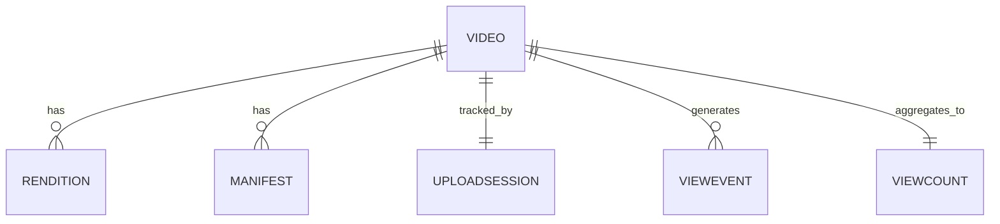
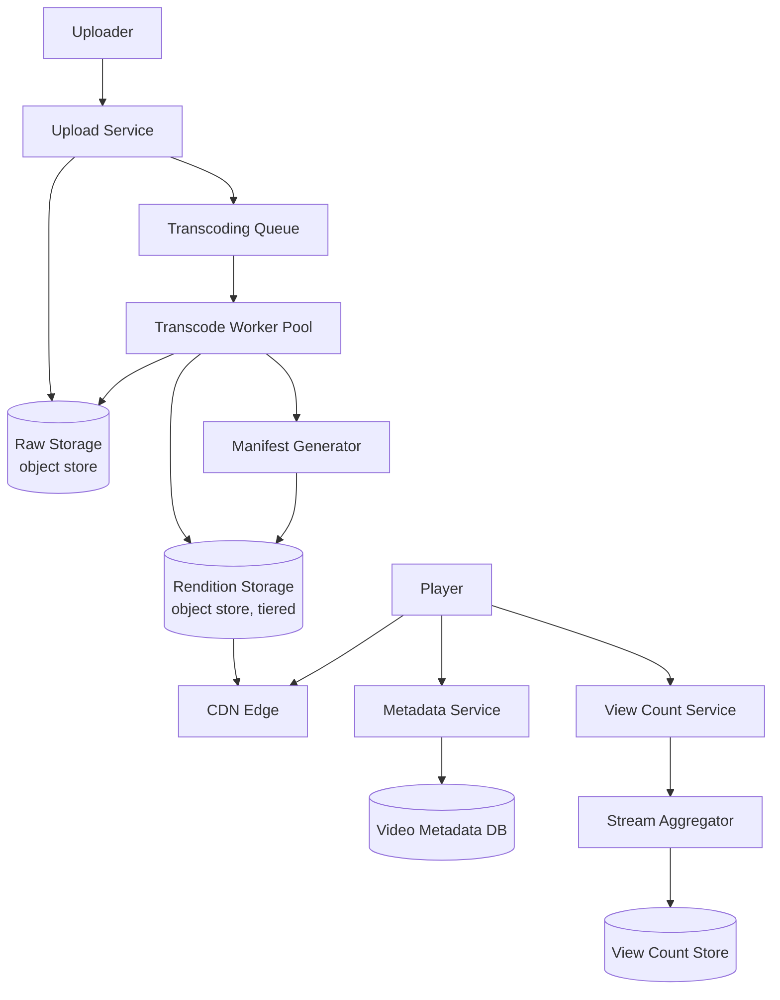
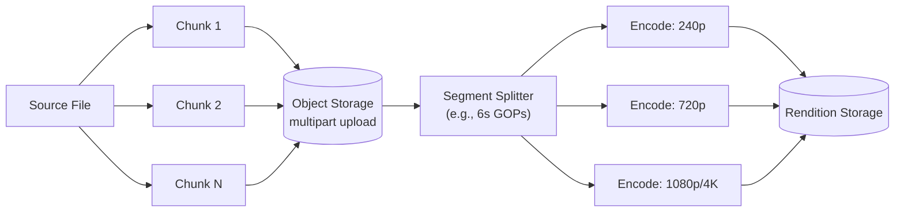
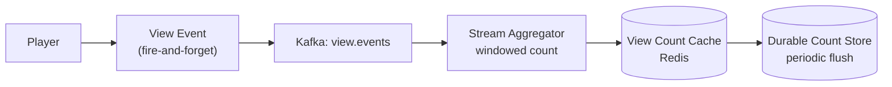

A video streaming platform lets users upload videos, processes them into a form that plays smoothly on any device and network, and serves them to a massive audience through a CDN. The interesting problems sit at two extremes — a slow, heavy write path (transcoding a large file) and a blisteringly fast, huge-fan-out read path (millions of concurrent viewers).

## Requirements

The functional shape — upload, process, watch, count — is simple enough to sketch as a single picture before the scale numbers make clear why each step is hard:


### Functional

- Users can upload a video with title/description metadata.
- The platform transcodes the video into multiple resolutions/bitrates.
- Users can play a video that adapts quality to their network in real time.
- View counts and basic engagement metrics are tracked.
- Users can browse a home feed with recommended videos (mentioned, not deep-dived).

### Non-functional

- Upload must support large files (multi-GB) and resume after network failure.
- Playback start latency under ~2 seconds; no visible rebuffering on typical connections.
- Storage is cost-sensitive at scale — petabytes of video, mostly rarely accessed after the first weeks.
- View count must be near-real-time but doesn't need to be exact to the second.
- High read availability — a playback outage is worse than a stale metadata field.

### Out of scope

- Content moderation pipeline (covered separately).
- Detailed recommendation ranking model.
- Monetization/ads insertion logic.
- Live streaming is discussed briefly for contrast, not designed in full.

> [!KEY]
> Almost every hard decision in this system comes down to **do the expensive work once, at upload time, so playback is cheap and fast for millions of viewers.** Transcoding, thumbnail generation, and manifest creation all happen before the first view, not on demand.

## Scale estimation

| Metric | Estimate | Arithmetic |
|---|---|---|
| DAU | 100M | given, YouTube-scale |
| Uploads/day | 500,000 | given |
| Avg upload size | 200 MB (raw) | assumption for a few minutes of HD source |
| Upload ingest bandwidth | ~1.16 GB/s avg | 500,000 × 200 MB ÷ 86,400 s |
| Views/day | 5 billion | given |
| View QPS (avg / peak) | ~58,000/s avg, ~230,000/s peak | 5B ÷ 86,400 s; ×4 for peak hours |
| Read:write ratio | ~10,000:1 | 5B views vs. 500K uploads |
| Transcoded storage per video | ~3–5x raw size | multiple resolutions (240p–4K) + audio tracks |
| Total storage growth/day | ~600 TB–1 PB | 500,000 × 200 MB raw × ~4x for renditions |
| CDN egress | dominant cost | most bytes never touch origin storage after first view |

> [!TIP]
> Say this out loud when asked about cost: *"Storage grows linearly and is cheap with tiering; egress bandwidth to serve billions of views is usually the larger bill, which is why cache hit ratio at the CDN is the single biggest cost lever."*

## Core entities and data model

The six entities and how they connect:


| Entity | Key fields |
|---|---|
| Video | id, owner_id, title, description, status (uploading/processing/ready/failed), duration, created_at |
| Rendition | video_id, resolution, bitrate, codec, storage_url, size_bytes |
| Manifest | video_id, type (HLS/DASH), manifest_url, updated_at |
| UploadSession | id, video_id, chunk_size, chunks_received, status (for resumable upload) |
| ViewEvent | video_id, user_id (nullable), watched_seconds, timestamp (raw, high volume) |
| ViewCount | video_id, count, updated_at (aggregated, read-optimized) |



`ViewEvent` is intentionally not queried directly for display — it's a write-heavy stream that feeds an aggregation pipeline producing `ViewCount`, much like the analytics pipeline pattern used elsewhere in this series.

## API design

```
POST   /v1/uploads/initiate         Body: { title, sizeBytes }        -> { uploadId, chunkUrls[] }
PUT    /v1/uploads/{id}/chunks/{n}  Body: <binary chunk>               -> 200 OK
POST   /v1/uploads/{id}/complete    ->  { videoId, status: "processing" }
GET    /v1/videos/{id}              ->  { metadata, status, manifestUrl }
GET    /v1/videos/{id}/manifest.m3u8  (served via CDN, not app servers)
POST   /v1/videos/{id}/views        Body: { watchedSeconds }          -> 202 Accepted (fire-and-forget)
GET    /v1/feed                     ->  [{ videoId, title, thumbnailUrl }]
```

Playback itself never calls the API servers per segment — the player fetches the manifest once, then pulls video segments directly from the CDN.

## High level architecture



Request flow:

1. Uploader initiates an upload; the Upload Service creates an `UploadSession` and returns pre-signed URLs for chunked, parallel upload directly to object storage (bypassing app servers for the bulk transfer).
2. As chunks arrive, they're written to raw storage; on completion, the Upload Service enqueues a transcoding job and marks the video `processing`.
3. A pool of transcode workers pulls the job, splits the source into segments, and encodes each segment in parallel into every target resolution/bitrate.
4. Once all renditions exist, the Manifest Generator writes an HLS/DASH manifest listing every available quality level, and the video flips to `ready`.
5. Renditions and manifests are pushed to origin storage and pre-warmed into the CDN for popular/expected-to-be-popular content.
6. A viewer opens the app; the Metadata Service returns the manifest URL, and the player fetches the manifest, then requests video segments straight from the nearest CDN edge.
7. The player continuously measures throughput and switches renditions (adaptive bitrate) as network conditions change, all without another app-server round trip.
8. Each playback session emits lightweight view/watch-time events, which are aggregated asynchronously rather than incrementing a counter synchronously per view.

## Deep dive: upload and the transcoding pipeline

A handful of terms recur through this whole pipeline and are worth having crisp definitions for: a **codec** (H.264, H.265) compresses and decompresses the actual video data; a **container** is the file format wrapping that compressed data plus audio and metadata; **bitrate** is bits transferred per second, driven by resolution and quality target; and a **manifest** is the file listing what streams/renditions exist for a video, which the player reads before requesting any segment.

Large files must upload reliably and process efficiently. What happens to a video immediately after upload — before it's ever watchable — looks like this:




- **Chunking**: the client splits the file client-side (e.g., 5–10 MB chunks) and uploads in parallel using the object store's multipart upload API; if a chunk fails, only that chunk is retried, not the whole file. The `UploadSession` tracks which chunk indices are confirmed so an interrupted upload resumes exactly where it left off.


- **Parallel workers, chunked by segment**: rather than transcoding a 2-hour video as one long serial job, the source is split into short segments (a few seconds, aligned to keyframes/GOP boundaries) that many workers encode in parallel, then reassemble. This turns transcoding time from roughly linear-in-duration into roughly constant, bounded by worker pool size.
- **Multiple bitrates**: each segment is encoded once per target rendition (e.g., 240p/500 kbps up to 4K/25 Mbps). This is the expensive, CPU-bound step, and it's exactly the "do it once at upload" work the whole design is built to front-load.

> [!WARNING]
> Segmenting at arbitrary byte offsets breaks video files, because frames depend on preceding frames (P/B-frames reference I-frames). Split only at keyframe boundaries, or the reassembled segments will glitch or fail to decode.

## Deep dive: adaptive bitrate streaming (HLS/DASH)

Rather than picking one quality and hoping the network holds up, the player continuously chooses the best available rendition. The processing step that makes this possible happens once, up front:


| Protocol | Segment format | Manifest | Notes |
|---|---|---|---|
| HLS | `.ts` / fMP4 segments | `.m3u8` playlist | Apple-originated, universally supported, slightly higher latency |
| DASH | fMP4 segments | `.mpd` manifest | Open standard, more flexible codec support, common outside Apple platforms |

A manifest lists every available rendition and the URLs of its segments:

```
#EXTM3U
#EXT-X-STREAM-INF:BANDWIDTH=800000,RESOLUTION=426x240
240p/index.m3u8
#EXT-X-STREAM-INF:BANDWIDTH=2800000,RESOLUTION=1280x720
720p/index.m3u8
#EXT-X-STREAM-INF:BANDWIDTH=5000000,RESOLUTION=1920x1080
1080p/index.m3u8
```

The player downloads a few seconds of video, measures achieved throughput, and picks the highest rendition it can sustain without stalling — stepping down quickly on a throughput drop and stepping up conservatively to avoid oscillation ("flapping") between qualities. End to end, from opening the app to an adapting playback session, the watch path looks like this:


## Deep dive: CDN distribution and storage tiering

- **Cache hit ratio** is the dominant cost and latency lever: a video watched a million times should be served from edge cache almost every time after the first fetch. A low cache hit ratio means repeated expensive trips back to origin storage, which is slower and pricier.
- **Pre-warming**: predictable hits (a creator with a large following, a scheduled premiere) can be pushed to edge caches proactively rather than waiting for organic cache misses.
- **Storage tiering**: most videos get almost all their views in the first days/weeks. Renditions can move from hot storage to cheaper, higher-latency cold storage after an access-frequency threshold, with a rehydration path if an old video suddenly goes viral again.

| Tier | Use | Cost | Latency |
|---|---|---|---|
| Hot (SSD-backed object storage) | New/trending videos | Highest | Lowest |
| Warm | Weeks-old, occasional views | Medium | Medium |
| Cold/archive | Old, rarely viewed | Lowest | Seconds (rehydration) |

## Deep dive: view counting at scale

Incrementing a row in a relational database on every one of 5 billion daily views would fall over immediately and is also a poor abstraction — views need to be deduplicated (a user re-watching the same session shouldn't count 1,000 times) and are inherently approximate at this scale.



- Events are appended to a stream rather than triggering a synchronous write.
- A stream aggregator counts events per video over short windows (e.g., 1 minute), applying dedup rules (e.g., count a view only once past a watched-seconds threshold, collapse repeated events from the same session).
- The rolling count updates a cache that the UI reads; the durable store is refreshed periodically, trading exactness for throughput — a view counter showing "1,204,331" that's a few seconds stale is completely acceptable.

> [!TIP]
> If asked "how would you make view counts exact," the honest senior answer is: *"You wouldn't — at this scale, exact real-time counts aren't worth the cost. You'd converge to the true count with periodic batch reconciliation and treat the live number as approximate."*

Resuming playback where a viewer left off is a much smaller-volume version of the same problem: rather than a durable write on every second of playback, the client periodically checkpoints its current position to a lightweight per-user-per-video store (cache-backed, with an infrequent durable flush), and the player reads that position back once at the start of a session — the same "async, approximate is fine" pattern as view counting, just keyed differently.

## Bottlenecks and scaling

- **Transcoding queue depth** during upload spikes — autoscale the worker pool on queue length, and prioritize shorter/likely-popular videos to keep perceived latency low.
- **Thundering herd on a just-uploaded viral video** before the CDN has a cache-warm copy — origin storage needs enough throughput headroom, or a request-coalescing layer in front of it.
- **Metadata database as a single bottleneck** for reads — cache video metadata aggressively since it changes rarely after `ready`.
- **Recommendations service load** — mentioned only briefly here, but it's typically a separate, independently scaled service reading from a feature store, not something bolted onto the metadata path.

Assembled end to end — upload, transcoding, storage tiers, CDN, and the view-count pipeline — the full system looks like this:


## Failure scenarios

| Failure | Blast radius | Mitigation |
|---|---|---|
| Transcode worker crashes mid-job | One video stuck in `processing` | Job is idempotent and retried from last completed segment; dead-letter after N retries |
| CDN edge node outage | Regional viewers fall back to next-nearest edge | Multi-edge/anycast routing; origin absorbs temporary extra load |
| Upload interrupted mid-transfer | Single upload session | Resumable chunked upload resumes from last confirmed chunk |
| View event stream backlog | View counts lag, playback unaffected | Playback never depends on view count path; alert on consumer lag |
| Origin storage regional outage | New transcodes blocked; existing CDN-cached content still plays | Cross-region replication of renditions; CDN continues serving cached copies |

## Cheat sheet

- Do expensive work once, at upload: transcode into every rendition before the first view.
- Split by keyframe-aligned segments to parallelize transcoding across workers.
- HLS/DASH manifests list renditions; the player — not the server — chooses quality per network conditions.
- CDN cache hit ratio is the biggest cost and latency lever; pre-warm for predictable spikes.
- Tier storage by access frequency — most views happen in the first days after upload.
- View counting is a streaming aggregation problem, not a per-view database increment.
- Live streaming trades the whole "transcode ahead of time" model for low-latency, near-real-time encoding, which is why its architecture differs.

## Common mistakes

| Mistake | Fix |
|---|---|
| Transcoding the whole file serially as one job | Split into keyframe-aligned segments, transcode in parallel |
| Incrementing a view counter synchronously in the request path | Emit an event, aggregate asynchronously, accept approximate counts |
| Serving video segments through app servers | Serve directly from CDN using pre-signed/public URLs after the manifest fetch |
| One-size-fits-all storage tier for all videos | Tier by access recency/frequency; rehydrate on demand |
| Assuming HLS/DASH choose the bitrate | The player chooses; the manifest only advertises what's available |
| Ignoring resumable upload for large files | Chunk client-side, track confirmed chunks, resume from there |

## Summary

A video platform's architecture is shaped by doing all expensive work — transcoding into multiple renditions, generating manifests, thumbnailing — once at upload time so that playback is a cheap, CDN-served read. Adaptive bitrate streaming pushes the quality decision to the client, storage tiering keeps petabyte-scale costs sane, and view counting is solved as a streaming aggregation problem rather than a synchronous counter. Live streaming inverts several of these assumptions because there's no "ahead of time" to exploit.

## Top Interview Questions

### Q1. Why is video split into segments before transcoding instead of transcoding the whole file as one job?

Transcoding is CPU-bound and roughly linear in video duration, so a two-hour video transcoded as a single serial job takes a long time and can't be parallelized. By splitting the source into short segments aligned to keyframe boundaries (so each segment can be decoded independently), many workers can transcode different segments concurrently, then the outputs are reassembled or referenced directly as manifest entries. This turns transcoding latency from "proportional to video length" into "proportional to length divided by worker pool size," which is essential for keeping upload-to-ready time reasonable regardless of source length. It also makes the pipeline resilient — if one segment's job fails, only that segment is retried, not the entire video.

### Q2. What is adaptive bitrate streaming and how does the player decide which quality to use?

Adaptive bitrate (ABR) streaming means the source video is encoded into multiple quality/bitrate renditions, and the client player continuously chooses which rendition to fetch next, switching in real time as network conditions change. The player downloads a manifest (HLS `.m3u8` or DASH `.mpd`) listing every rendition and its bitrate, then measures actual download throughput of recent segments to estimate available bandwidth, generally biasing toward a conservative estimate. It steps up to a higher quality only after sustained good throughput (to avoid oscillation) and steps down quickly on signs of an impending stall, prioritizing smooth playback over peak quality. This logic lives entirely client-side — the server just serves whichever segment is requested.

### Q3. How would you design the system to minimize cost while serving 5 billion views a day?

The two biggest levers are CDN cache hit ratio and storage tiering. Maximizing cache hit ratio means the vast majority of the 5 billion views are served from edge caches rather than origin storage, so investing in pre-warming predictable spikes (premieres, trending content) and choosing a CDN with strong edge coverage near your user base pays for itself quickly. Storage tiering moves renditions of old, rarely-watched videos to cheaper cold storage, since view volume for most videos drops sharply after the first weeks, while keeping a fast rehydration path in case an old video suddenly goes viral. Additionally, transcoding only the renditions actually likely to be requested (e.g., skip 4K for content uploaded at 480p) avoids wasted compute and storage.

### Q4. How do you make video upload reliable for a user on a flaky mobile connection uploading a 2 GB file?

Split the file into small chunks client-side (e.g., 5–10 MB) and upload them using the object store's multipart/resumable upload API, tracking which chunk indices have been acknowledged in an `UploadSession` record. If the connection drops, the client only needs to re-upload chunks that weren't confirmed, not the entire file, and it can resume even after the app is fully restarted by querying the session's progress. Chunks are uploaded in parallel where bandwidth allows, and the "complete" call is only made — triggering transcoding — once all chunks are confirmed present and their checksums validated, so a partial or corrupted upload never enters the processing pipeline.

### Q5. Why not increment a "views" counter in the database directly every time someone watches a video?

At the scale of billions of daily views, a synchronous database increment per view would create massive write contention on hot rows (popular videos), and would also require handling deduplication logic (bot views, repeated views in one session, partial views that shouldn't count) inline in the write path, adding latency to something that shouldn't be user-facing latency-sensitive at all. Instead, view events are fired asynchronously into a stream, and a separate aggregation layer counts them over short windows, applies dedup/validity rules, and updates a cache that the UI reads. This trades perfect real-time exactness for throughput and decoupling — the displayed count can lag by seconds and is periodically reconciled against a durable, more careful batch count.

### Q6. What's the difference between HLS and DASH, and does it matter which you pick?

Both are segmented-delivery adaptive streaming protocols: a manifest lists available renditions, and the client fetches short video segments (a few seconds each) for whichever rendition it currently wants. HLS originated at Apple and is required for native iOS/Safari playback and has broad support elsewhere via player libraries; DASH is a more open, codec-agnostic standard commonly used on Android/web outside Apple's ecosystem. In practice, most platforms generate both from the same source segments to maximize compatibility, since the actual encoding work (multiple bitrate renditions) is shared — only the manifest format and container differ. The choice matters less for architecture and more for client compatibility coverage.

### Q7. A newly uploaded video suddenly goes viral within minutes of being posted, before the CDN has cached it anywhere. What happens and how do you prevent an outage?

Every viewer's first segment request is a cache miss, so all of that traffic converges on origin storage simultaneously — a thundering herd. Mitigations include request coalescing at the CDN or origin layer (so concurrent identical requests for the same uncached segment share one origin fetch rather than each triggering a separate one), giving origin storage enough burst throughput headroom, and proactively pre-warming CDN edges for content that's showing early viral signals (rapid view velocity) rather than waiting for organic cache population. Detecting the spike from real-time view-event throughput and reacting within seconds is part of why the view-counting pipeline is useful beyond just showing a number to users.

### Q8. How does live streaming differ architecturally from on-demand video, and why?

On-demand video can afford to transcode every rendition fully before the first view because there's no urgency — the video sits and waits to be watched. Live streaming has no such luxury: video must be encoded and made available within a few seconds of being captured, so the pipeline works on very short segments (a couple of seconds each) continuously, rather than as a single completed-file job, and typically uses fewer renditions or lower-latency encoding presets to keep the pipeline fast. This pushes end-to-end latency down to a few seconds at best (versus effectively zero perceived latency for on-demand, since it was all pre-processed), and it means the "do the expensive work ahead of time" strategy from on-demand simply doesn't apply — the system must sustain continuous low-latency processing for the entire duration of the stream.

### Q9. How would you design the manifest generation step to support adding a new rendition (say, a higher-quality 4K version) to a video that's already published?

Manifest generation should be idempotent and additive: regenerate the manifest by listing all currently available renditions for that video rather than assuming a fixed, one-time-computed set, so adding a new rendition is just re-encoding the new bitrate and updating the manifest to include it. Existing players that already fetched an older manifest keep playing with what they have, and only players that re-fetch (e.g., on next segment boundary or new session) see the new option — this avoids needing to interrupt active playback sessions. The manifest and metadata service should treat "the set of renditions for a video" as a versioned, appendable list, not something baked in once at initial transcode.

### Q10. Why is storage tiering important, and how would you decide when to move a video's renditions to cold storage?

Because view volume for the overwhelming majority of videos drops off sharply after the first days to weeks, keeping every rendition of every video ever uploaded on expensive, low-latency hot storage indefinitely wastes money on data that's essentially never read. A practical policy tracks recent access frequency per video (e.g., views in the trailing 30 days) and, below a threshold, migrates renditions to cheaper cold/archive storage with a defined rehydration path — an access to a cold video triggers a background copy back to a warmer tier, accepting a few seconds to a minute of extra latency for that first request. The threshold and rehydration latency are tuned against the cost savings; the risk to manage is a video suddenly going viral again long after being archived, which is why rehydration needs to be fast and automatic rather than manual.

### Q11. How would you approach recommendations without going deep into the ranking model itself, from a systems perspective?

From a systems perspective, recommendations is a separate read-heavy service that consumes engagement signals (views, watch time, likes) — largely the same event stream feeding view counting — and serves a ranked list of video IDs per user, typically backed by a precomputed feature store and an offline-trained model refreshed periodically (hours to a day), with a lightweight online re-ranking layer for freshness. It should be decoupled from the core video-serving path entirely: a recommendations outage should degrade to a fallback (trending/popular list) rather than block video playback, and its data pipeline is a consumer of the same engagement-event stream used elsewhere, not a new independent ingestion path.

### Q12. If p99 playback start latency spikes from 2 seconds to 8 seconds for users in one region, how would you debug it?

Start by isolating which stage is slow: check whether the manifest fetch itself is slow (metadata service or CDN edge in that region), or whether the first video segment fetch is slow (CDN cache miss forcing an origin round trip, or an under-provisioned edge node in that region). Check CDN cache hit ratio specifically for that region/time window — a drop there points to either a cold cache (recent purge, new content, insufficient pre-warming) or a regional edge capacity issue. Also check whether DNS/anycast routing is sending that region's traffic to a farther-away or overloaded edge due to a recent infrastructure change. The fix is almost always either restoring/improving cache hit ratio in that region or correcting a routing misconfiguration, rather than anything in the transcoding pipeline, since playback start latency is dominated by the manifest-then-first-segment round trip.
