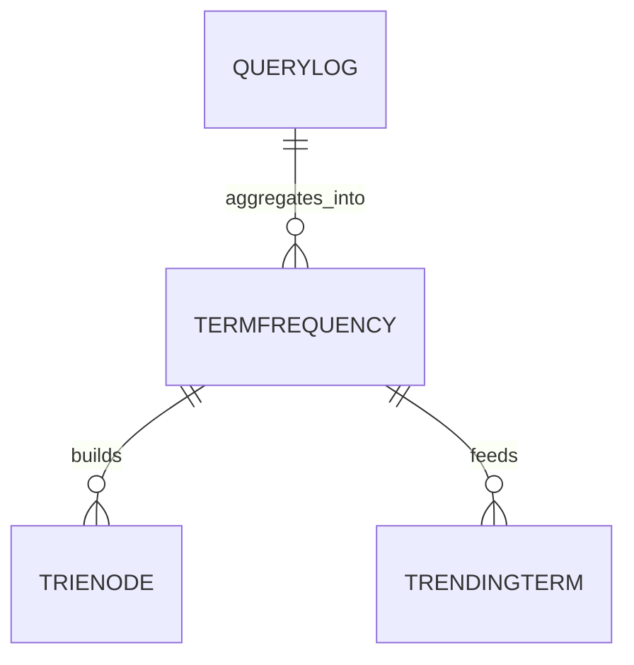
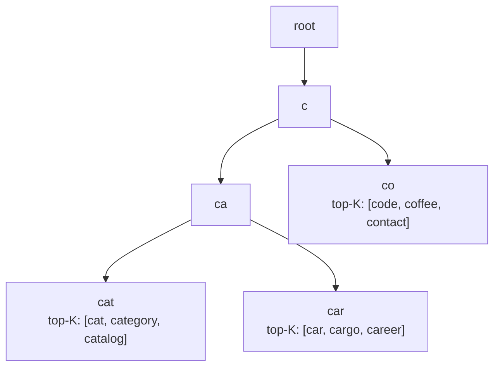
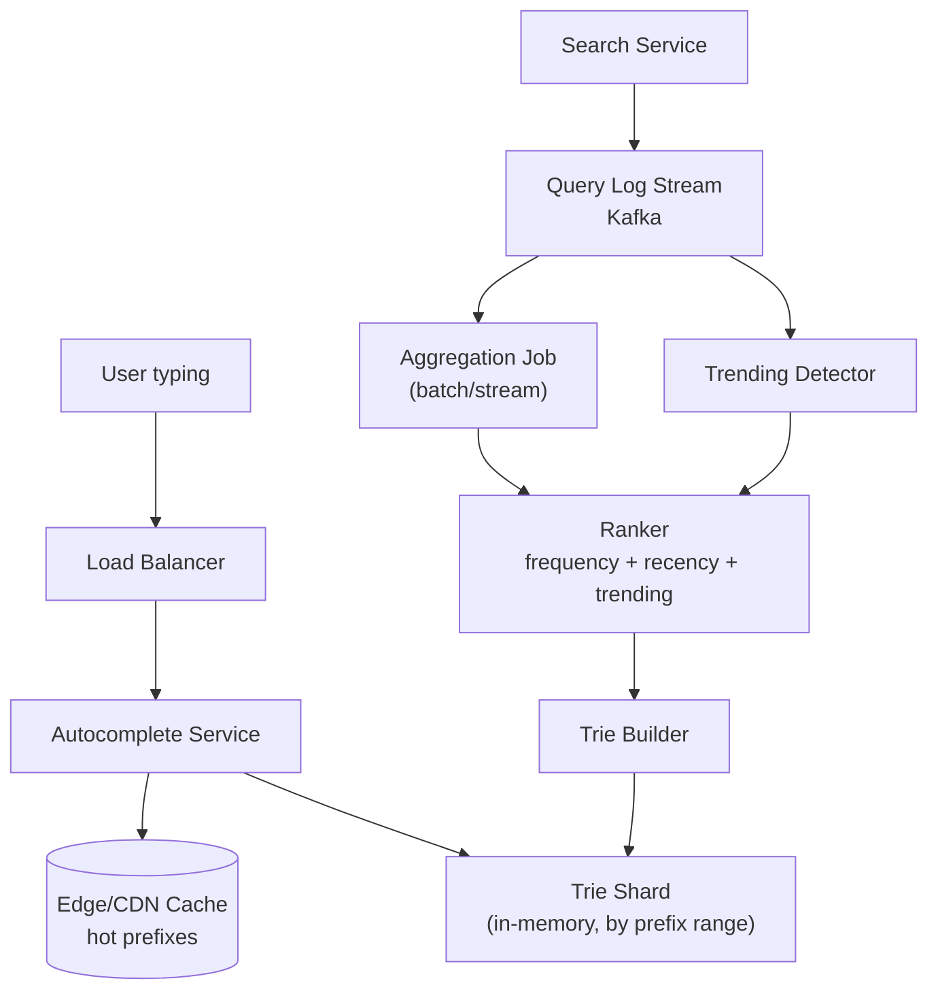

Search autocomplete suggests completions as a user types, and it has one unforgiving constraint that shapes the whole design — every keystroke is a query, and the response has to land in well under 100 ms or the feature feels broken. The system is a good showcase for offline-build-plus-online-serve architecture.

## Requirements

### Functional

- As a user types a prefix, return the top-K most likely completions.
- Suggestions should reflect real search popularity, not just alphabetical order.
- New trending terms should surface within minutes to hours, not days.
- Basic typo tolerance (one edit distance away) is nice to have.
- Personalization (recent searches, location) is a stretch goal.

### Non-functional

- p99 latency under 100 ms per keystroke, ideally under 50 ms.
- Extremely read-heavy: essentially every keystroke of every search is a read.
- Freshness can lag — a term trending in the last few minutes doesn't need to appear instantly.
- Highly available — a suggestion outage should degrade to "no suggestions," never to a slow or broken search box.

### Out of scope

- The full-text search/ranking engine behind the actual search results page.
- Query understanding/NLP beyond simple prefix and edit-distance matching.
- Ads or sponsored suggestions.

> [!KEY]
> Autocomplete is an **offline-heavy, online-light** system: almost all the real work — counting queries, ranking, building the data structure — happens in a batch/streaming pipeline well before any user types a key. The online path just does a fast lookup against something already computed.

## Scale estimation

| Metric | Estimate | Arithmetic |
|---|---|---|
| Searches/day | 1 billion | given, large consumer search engine |
| Avg query length | 20 characters | typed one at a time |
| Autocomplete requests/day | ~20 billion | 1B searches × ~20 keystrokes each (one request per keystroke, debounced) |
| Autocomplete QPS (avg / peak) | ~230,000/s avg, ~700,000/s peak | 20B ÷ 86,400 s; ×3 for peak |
| Unique terms tracked | ~50–100 million | distinct queries/phrases worth ranking |
| Trie size in memory | a few GB to tens of GB | depends on max phrase length and top-K cached per node |
| Read:write ratio | extremely read-heavy, ~10^6:1 | trie rebuilt periodically (writes), read on every keystroke |
| Query log volume | ~1 billion rows/day | one row per completed search, aggregated offline |

> [!TIP]
> If asked to justify skipping per-keystroke exact computation: *"At 700K QPS peak, any per-request computation heavier than an O(prefix length) trie walk is a non-starter — the ranking has to already be baked into the data structure before the request arrives."*

## Core entities and data model

| Entity | Key fields |
|---|---|
| TrieNode | children map, isTerminal, cached top-K completions (list of {term, score}) |
| QueryLog | query_text, user_id (optional), timestamp, result_clicked (raw, high-volume) |
| TermFrequency | term, count, last_updated (aggregated offline) |
| TrendingTerm | term, velocity_score, window — used for surfacing spikes |



The trie itself is not a relational structure — it's an in-memory tree where each node represents one character, and the path from root to any node spells out a prefix. The design trick that makes lookups O(1)-ish instead of O(children × depth) is storing a **precomputed top-K list directly on each node**, so a query for a prefix is just "walk to this node, return its cached list" — no ranking happens at request time.



## API design

```http
GET /v1/autocomplete?prefix={q}&limit=10
    -> { suggestions: [{ text, score }] }

// internal, not client-facing
POST /internal/trie/rebuild        -> triggers offline rebuild job
GET  /internal/trending?window=1h  -> [{ term, velocity }]
```

Client-side, requests are debounced (e.g., wait ~100–150 ms after the last keystroke, or only fire every 2–3 characters) to avoid sending a request for every single keystroke, which cuts real QPS well below the theoretical "one request per character" estimate.

## High level architecture



Request flow:

1. User types; the client debounces keystrokes and sends the current prefix to the Autocomplete Service.
2. The service checks an edge/CDN cache for very common prefixes (e.g., single letters, top 2-character prefixes get hit by almost everyone) before touching the backend at all.
3. On a cache miss, the request routes to the trie shard responsible for that prefix range.
4. The shard walks from the root to the node matching the prefix — O(prefix length) — and returns its precomputed top-K list directly, with no ranking computed on the fly.
5. Independently, every completed search is logged to a stream.
6. An aggregation job periodically (e.g., every few minutes to hourly) counts term frequencies, blends in recency/trending signals, and re-ranks.
7. A trie builder job rebuilds (or incrementally patches) the in-memory trie structure and its per-node top-K caches from the updated rankings.
8. The new trie version is pushed to serving shards, typically via a blue-green swap so serving never blocks on a rebuild.

## Deep dive: building and updating the trie offline

The trie is built as a batch job, not maintained by live per-keystroke writes.

- **Build**: read aggregated `TermFrequency` data, insert every distinct term/phrase into the trie character by character, and at every node along the way, maintain a small top-K list of the highest-scoring completions reachable from that node using a bounded min-heap.
- **Update cadence**: term frequency counts are aggregated in a streaming or micro-batch pipeline (e.g., every 5–10 minutes), but a full trie rebuild from scratch is comparatively expensive, so most systems rebuild on a longer cycle (hourly) and handle short-term freshness — like a genuinely new trending term — through a separate, smaller "hot terms" overlay that's checked first and merged with trie results.
- **Deployment**: build the new trie in the background, validate it, then atomically swap the pointer/version the serving layer reads — never mutate a live, in-use trie in place.

```java
// O(log K) per insert: bounded min-heap keeps only the K best completions at a node
void addCandidate(PriorityQueue<Completion> topK, Completion candidate, int k) {
    if (topK.size() < k) {
        topK.offer(candidate);
    } else if (candidate.score() > topK.peek().score()) {
        topK.poll();          // discard current worst of the top-K
        topK.offer(candidate); // new candidate takes its place
    }
    // else: candidate doesn't make the cut, discard in O(1)
}
```

> [!WARNING]
> Rebuilding the entire trie in place while serving live traffic risks returning partially-updated, inconsistent top-K lists mid-rebuild. Build a new version fully off to the side and swap atomically (double-buffering) instead.

## Deep dive: sharding the trie by prefix

A single trie holding tens of millions of terms with cached top-K lists at every node can be gigabytes to tens of gigabytes — too large for one instance to serve at 700K QPS peak with headroom, and a single point of failure besides.

| Sharding strategy | How | Trade-off |
|---|---|---|
| By first character(s) | Shard "a*" on node 1, "b*" on node 2, etc. | Simple, but uneven — "s" and "c" have far more English terms than "x" or "q" |
| By hash of prefix | Consistent hash the prefix to a shard | Even load, but a single user's keystroke sequence (`c` → `ca` → `cat`) may hit different shards each time |
| Hybrid: range-partition by observed volume | Group characters into ranges balanced by actual query volume, not alphabet position | Best balance; requires periodic rebalancing as language patterns shift |

> [!TIP]
> The senior answer names the tension directly: *"Sharding by first character is simple but skewed because query volume isn't uniform across letters; I'd range-partition based on measured traffic per prefix bucket and rebalance those ranges periodically, similar to how a key-value store rebalances hot shards."*

Each shard holds a self-contained subtree and serves it independently; the routing layer just needs a lookup table mapping prefix ranges to shard, refreshed whenever rebalancing occurs.

## Deep dive: latency budget and edge caching

At under 100 ms end-to-end, every millisecond is accounted for.

| Stage | Budget | Notes |
|---|---|---|
| Network round trip | ~20–40 ms | dominated by client-to-edge distance |
| Edge/CDN cache check | ~1–5 ms | serves the most common prefixes without hitting origin |
| Trie shard lookup | ~1–5 ms | O(prefix length) walk, all in memory |
| Serialization/response | ~5 ms | small payload, top-10 suggestions |
| **Total** | **well under 100 ms** | leaves headroom for jitter |

- **Edge caching**: single-character and common two-character prefixes ("a", "th", "co") are typed by almost everyone and change rarely, so caching them at the CDN edge (with a short TTL) absorbs a large fraction of total request volume before it ever reaches the trie shards.
- **In-memory only**: the trie must be fully in memory — a disk-backed lookup per keystroke would blow the latency budget immediately.
- **No synchronous ranking**: any request-time computation (scoring, sorting) is done ahead of time; the online path is purely "look up a precomputed answer."

## Deep dive: typo tolerance and comparing indexing strategies

Pure prefix matching fails the moment a user mistypes a letter. A lightweight approach: at query time, also generate a small set of edit-distance-1 variants of the typed prefix (insert/delete/substitute one character) and check those against the trie too, merging and re-ranking results. This is bounded work (a handful of variants, each still an O(prefix length) trie walk) so it fits the latency budget, unlike a full fuzzy-search over the whole corpus.

| Structure | Strength | Weakness | Best for |
|---|---|---|---|
| Trie with cached top-K | O(prefix length) lookup, ranking pre-baked | Rebuilding is relatively heavy; typo tolerance needs bolt-on logic | The hot path for this exact problem |
| N-gram index | Naturally tolerant of typos/partial matches (breaks terms into overlapping n-grams) | Higher per-query cost — must merge postings across n-grams and re-rank | Fuzzy/typo-heavy search, not simple prefix completion |
| Full search engine suggester (e.g., Elasticsearch completion suggester) | Batteries-included, handles fuzziness, weights, context out of the box | Higher latency and operational cost than a hand-built in-memory trie at extreme scale | Faster to ship, fine below hundreds of thousands of QPS |

> [!NOTE]
> A completion suggester built on a general search engine is a perfectly reasonable production answer at moderate scale — the custom in-memory trie is what you reach for once QPS and latency requirements outgrow what a general-purpose engine comfortably delivers.

## Bottlenecks and scaling

- **Hot single-character shards** (e.g., "s", "c") — rebalance shard boundaries by measured traffic, not alphabet position.
- **Rebuild cost as term count grows** — incremental/partial rebuilds of only the affected subtrees, rather than a full rebuild every cycle, once the corpus is large.
- **Fan-out for trending detection** — a naive "recompute trending across all terms every minute" job doesn't scale; use a streaming top-K/heavy-hitters algorithm (e.g., Count-Min Sketch plus a bounded heap) instead of exact counting.
- **Personalization** adds a per-user dimension on top of the global trie — typically solved by re-ranking the global top-K with a small personalization boost rather than building a separate trie per user.

## Failure scenarios

| Failure | Blast radius | Mitigation |
|---|---|---|
| A trie shard goes down | Suggestions for that prefix range disappear | Replicate each shard; route around a dead replica |
| Trie rebuild job fails | Suggestions go stale but keep serving the last good version | Never swap to a version until it passes validation; keep serving current version |
| Edge cache outage | More load hits origin shards directly | Origin shards sized with headroom for a cache-miss storm |
| Query log stream backlog | Trending/freshness lags | Doesn't affect current serving; alert on consumer lag |
| Autocomplete Service fully down | Search box shows no suggestions | Client degrades gracefully — user can still type and submit a full search |

## Cheat sheet

- Precompute top-K at every trie node — the online path is a pure lookup, never a request-time ranking.
- Trie build/update is an offline batch or micro-batch job; never mutate a live trie in place, swap versions atomically.
- Shard by measured query-volume ranges, not alphabet position — letter frequency in language is skewed.
- Debounce client-side to cut real QPS well below "one request per keystroke."
- Edge-cache the shortest, most common prefixes — they absorb a disproportionate share of traffic.
- Typo tolerance = generate bounded edit-distance-1 variants and merge, not a full fuzzy search.
- Trending terms need a streaming heavy-hitters approach, not exact recount over the whole corpus.

## Common mistakes

| Mistake | Fix |
|---|---|
| Ranking completions at request time | Precompute and cache top-K per trie node offline |
| Sharding alphabetically without checking real traffic skew | Range-partition by measured query volume |
| Sending a request on every keystroke | Debounce on the client |
| Mutating the live trie in place during a rebuild | Build off to the side, validate, then atomically swap |
| Treating typo tolerance as "just use a fuzzy search over everything" | Bound it to small edit-distance variants of the prefix |
| Assuming freshness must be real-time | Minutes-to-hours lag is usually acceptable; use a fast-path overlay for genuine spikes |

## Summary

Autocomplete is won or lost on the offline pipeline: aggregate query logs, rank terms, and bake that ranking directly into a trie whose nodes hand back a precomputed top-K list. The online path stays embarrassingly simple — a bounded-depth in-memory tree walk — which is exactly what a sub-100ms, extremely read-heavy workload demands. Sharding by real traffic distribution, edge-caching the shortest prefixes, and bolting on a bounded typo-tolerance and trending overlay round out a design that's mostly about pushing complexity out of the request path.

## Top Interview Questions

### Q1. Why cache the top-K completions at every trie node instead of computing rankings at query time?

At hundreds of thousands of queries per second with a sub-100ms budget, there's no room to score and sort candidate completions on every request — that work has to be done once, offline, and reused for every subsequent query with the same prefix. By storing a small precomputed list (say, top 10 by score) directly on each node during the build phase, a lookup becomes "walk to the node matching the prefix, return its cached list," which is O(prefix length) and entirely in-memory. The cost moves from the hot path (every keystroke, at massive QPS) to the build path (periodic, at a much lower and more predictable rate), which is exactly the right trade given the read:write ratio here is roughly a million to one.

### Q2. How would you keep the top-K list at a node updated efficiently as you build the trie, rather than re-sorting from scratch?

Maintain a bounded min-heap of size K at each node during the build/insert phase: when a new term with its score reaches a node on its path from root, compare it against the heap's current minimum — if the new score is higher, pop the minimum and push the new term, otherwise discard it. This keeps each node's top-K update at O(log K) rather than O(n log n) resorting, and since K is small (typically 5–10), the constant factor is tiny even across tens of millions of nodes during a full rebuild. The same structure supports incremental updates if you rebuild only affected subtrees rather than the whole trie.

### Q3. How do you handle a term suddenly trending (e.g., breaking news) if the trie only rebuilds hourly?

Run a separate, lightweight "hot terms" detector on the query log stream using an approximate heavy-hitters algorithm (e.g., Count-Min Sketch combined with a bounded top-K heap) over a short rolling window (a few minutes), which is far cheaper than recomputing exact global rankings that frequently. When serving a request, check this fast-path overlay for the given prefix in addition to the (comparatively stale) main trie's cached results, and merge the two result sets — giving trending terms a boost even though the full trie hasn't caught up yet. The main trie eventually incorporates the term properly on its next scheduled rebuild, at which point the overlay entry becomes redundant and ages out.

### Q4. Why not just shard the trie alphabetically by first letter?

Query volume is not evenly distributed across letters — in English, prefixes starting with "s," "c," or "a" are dramatically more common than "x," "q," or "z," so an alphabetic shard assignment creates severely hot shards and mostly idle ones, wasting capacity and creating latency hotspots under peak load. The better approach measures actual traffic per prefix bucket from the query logs and assigns prefix *ranges* (which may span multiple letters, or split a single busy letter like "s" into "sa–sm" and "sn–sz") to shards so each one handles roughly equal load. This needs periodic rebalancing since traffic patterns shift, similar to hot-shard rebalancing in a key-value store.

### Q5. Walk through what happens end-to-end when a user types "correct code speed run" one keystroke at a time.

Each keystroke event is debounced client-side, so not literally every character generates a network call — the client waits briefly or requires a minimum character increment before firing. When a request does go out for the current prefix (say "correct c"), it first checks the edge cache; for a longer, more specific prefix like this, it's very unlikely to be cached, so it routes to the trie shard responsible for that prefix range. The shard walks the trie from root to the node representing "correct c" — an O(prefix length) traversal — and returns that node's precomputed top-K list, merged with any trending-terms overlay match, and the client renders the dropdown. As the user keeps typing, each subsequent keystroke narrows the prefix further, generally requesting a strict subset of what a longer prefix's node already encodes, though the client typically still queries fresh rather than trying to filter client-side.

### Q6. How would you personalize suggestions (e.g., boosting a user's own recent searches) without building a separate trie per user?

Keep the global trie as the single shared source of ranked completions, and apply a lightweight, request-time re-ranking pass on top of the returned top-K (or a slightly larger candidate set, e.g., top-20) using a small per-user signal — such as a boost if the completion matches one of the user's recent searches, pulled from a fast per-user cache (e.g., Redis, keyed by user ID). This keeps the expensive, shared part of the system (the trie) untouched by personalization and confines the cost of personalization to a cheap, small, per-request adjustment, rather than the operationally infeasible alternative of maintaining millions of individual per-user tries.

### Q7. What's the difference between using a trie versus an n-gram index for autocomplete, and when would you pick each?

A trie is optimized for prefix matching — it directly encodes "what comes after this exact sequence of characters," giving O(prefix length) lookups, but it doesn't tolerate typos or out-of-order matches natively. An n-gram index breaks terms into overlapping character or word n-grams and can match partial or fuzzy input more naturally (useful for typo tolerance or mid-word matching), but querying it requires merging postings lists across multiple n-grams and re-ranking at query time, which is more expensive per request. For a pure "complete what the user is typing from the start" feature under a strict sub-100ms budget at huge QPS, a trie with cached top-K is the better fit; an n-gram approach earns its cost when typo tolerance or non-prefix matching is a first-class requirement rather than a bolt-on.

### Q8. How would you decide the right value of K (the number of cached suggestions per node), and what happens if K is too small or too large?

K is driven by how many suggestions the UI actually displays (commonly 5–10) plus a small buffer for post-filtering (e.g., removing duplicates or profanity after the fact) — there's no benefit to caching more than what will ever be shown or merged with an overlay. If K is too small, legitimate high-quality completions might not survive the trending/typo-tolerance merge step because the base list didn't include enough candidates to begin with; if K is too large, both memory footprint (multiplied across tens of millions of nodes) and marginal maintenance cost during inserts (heap operations) grow for no user-visible benefit. A reasonable practice is to cache slightly more than the display count (e.g., K=15 when displaying 10) to leave room for downstream filtering.

### Q9. The autocomplete service starts returning empty suggestions for common prefixes right after a deployment. How do you debug it?

First check whether the deployment includes a trie rebuild/swap — if the new trie version failed validation or the swap pointed serving nodes at an empty or partially-built structure, that would explain uniformly empty results, and the fix is to roll back to the last known-good trie version immediately, independent of investigating the root cause of the build failure. If the trie itself is fine, check whether the routing/sharding layer's prefix-to-shard mapping was updated as part of the deploy and is now sending requests to the wrong (or a newly-added, still-empty) shard. It's also worth checking whether the edge cache is serving a stale "empty" response cached from a brief bad window during the deploy, which a cache purge or shorter TTL for that period would resolve. This is a good moment to state the operational principle: never let a broken build reach production serving without a validation gate before the swap.

### Q10. How do you prevent the debounce/rate-limiting on the client from making the UI feel laggy while still protecting the backend from excessive requests?

Tune the debounce window to be shorter than typical human typing cadence but long enough to skip redundant intermediate keystrokes — commonly 100–150 ms, or firing only after 2+ new characters since the last request, both of which are imperceptible delays to a user but meaningfully cut request volume. Additionally, cancel in-flight requests that are superseded by a newer keystroke (so the UI never renders a stale response arriving late for an outdated prefix), and rely on the very fast backend lookup (single-digit milliseconds for the trie walk) so that even a fired request resolves well within the debounce window, keeping perceived latency low despite the request-shaping on the client.

### Q11. How would you extend this design to support autocomplete across multiple languages, some with no clear word-boundary characters (e.g., Chinese)?

Space-delimited prefix matching assumes a Latin-style tokenization that doesn't hold for languages without whitespace word boundaries, so the trie needs to be built per-language (or per-script) with language-appropriate tokenization/segmentation applied during the offline build — for CJK languages this typically means indexing by character n-grams or using a language-specific segmenter rather than assuming "prefix" means "first N Latin characters typed." The routing layer would detect or accept a language/locale hint and direct the query to the correctly-built trie for that language, since merging fundamentally different tokenization schemes into one shared structure produces poor results for at least one of the languages involved.

### Q12. If the trie needs to support phrases (multi-word queries) rather than just single words, what changes?

The trie's alphabet effectively expands to include the space character, and paths through the tree represent full phrases rather than stopping at word boundaries, which increases the tree's depth and total node count significantly since phrase-level combinations are far more numerous than single-word vocabulary. This raises memory pressure (mitigated by only inserting phrases above a minimum frequency threshold, pruning rare/noisy tails, and being more aggressive about which subtrees get top-K caching versus computed lazily) and makes sharding by prefix range even more important since the effective key space is much larger. It also changes typo tolerance: generating edit-distance variants of a full phrase prefix is more expensive than for a single word, so a practical implementation usually applies fuzzy matching only to the last (currently being typed) word of the phrase rather than the whole string.
