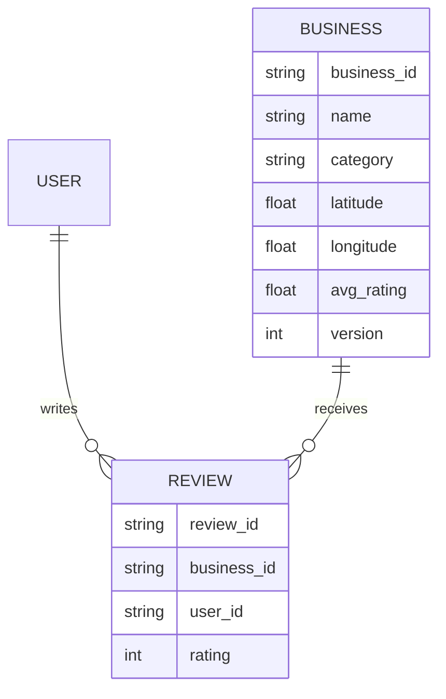
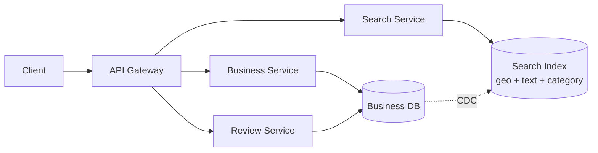

A proximity search platform lets users find local businesses by location, category, and free-text query, view a business's details and reviews, and leave a review of their own. Unlike most systems in this track, the data volume here is modest — the actual challenge is that a single search query mixes three fundamentally different kinds of filtering (geospatial, categorical, full-text) that a naive relational query handles very badly.

## Requirements


### Functional

- Users can search for businesses by location, free-text query, and category.
- Users can view a business's details, including its reviews and average rating.
- Users can leave a review (rating plus optional text) for a business.
- A user can leave at most one review per business.

### Non-functional

- Search queries combining location, text, and category must stay fast as the business/review corpus grows.
- A business's average rating shown in search results must be accurate and reasonably fresh, not stale.
- Read-heavy: searches and business views vastly outnumber review submissions.
- Support searching by informal location names (a city or neighborhood), not just raw coordinates.

### Out of scope

- Business claiming/verification workflows for owners.
- Photo uploads attached to reviews.
- Recommendation/personalized ranking of search results.

## Scale estimation

| Metric | Assumption | Working | Result |
|---|---|---|---|
| DAU | given | given | 30M |
| Searches / user / day | 3 avg | 30M × 3 | 90M searches/day |
| Business views / user / day | 5 avg | 30M × 5 | 150M views/day |
| Reviews / user / day | 0.02 avg (rare) | 30M × 0.02 | 600K reviews/day |
| Read QPS (avg) | (90M + 150M) / 86,400s | 240,000,000 / 86,400 | ~2,780/sec |
| Read QPS (peak) | 3× average | 2,780 × 3 | ~8,300/sec |
| Write QPS (avg) | 600K / 86,400s | 600,000 / 86,400 | ~7/sec |
| Write QPS (peak) | 5× average | 7 × 5 | ~35/sec |
| Read : write ratio | 2,780 : 7 | — | ~400 : 1 |
| Total businesses indexed | assumption | given | 50M |
| Review storage/day | 600K × 500 bytes | 600,000 × 500B | ~300MB/day |

> [!TIP]
> Write volume per business is tiny — a popular business might get a handful of reviews a day. That single observation is why a message queue in front of rating updates is overkill here: the load simply doesn't justify the added complexity, unlike a system processing thousands of writes per second on the same record.

## Core entities and data model

| Entity | Key fields |
|---|---|
| `User` | `user_id`, `name` |
| `Business` | `business_id`, `name`, `category`, `latitude`, `longitude`, `avg_rating`, `review_count`, `version` |
| `Review` | `review_id`, `business_id`, `user_id`, `rating`, `text`, `created_at` |



> [!NOTE]
> A database-level uniqueness constraint enforces one review per user per business: `ALTER TABLE reviews ADD CONSTRAINT unique_user_business UNIQUE (user_id, business_id);`. Whenever a data constraint like this exists, enforce it as close to the persistence layer as possible — a check only in application code is one refactor away from being bypassed, while a database constraint holds regardless of which code path writes the row.

## API design

```http
// Search for businesses
GET /businesses?query&location&category&page -> Business[]

// View business details
GET /businesses/:businessId -> Business

// View reviews for a business
GET /businesses/:businessId/reviews?page= -> Review[]

// Leave a review
POST /businesses/:businessId/reviews
{
  rating: number,
  text?: string
}
```

## High level architecture



1. A client issues a search with a location, free-text query, and/or category; the search service queries a dedicated index built for combined geo/text/category filtering, not the primary database directly.
2. Selecting a result calls the business service, which reads the business row (including its cached `avg_rating`) directly from the database — a single business lookup doesn't need the search index.
3. Submitting a review calls the review service, which inserts the row (rejected by the database's unique constraint if the user already reviewed this business) and updates the business's cached average rating in the same transaction.
4. The primary database's changes are streamed to the search index (via change-data-capture or a periodic sync job) so search results reflect new/updated businesses without every write touching the index synchronously.

### Users should be able to search for businesses


### Users should be able to view businesses


### Users should be able to leave reviews on businesses


## Deep dive: keeping the average rating fresh and correct

Computing `AVG(rating)` across every review on every search-result render is far too slow once a popular business has thousands of reviews. A periodic batch recompute (e.g. a nightly cron job) is simple but leaves the displayed rating stale for however long the interval is. The better approach is a **synchronous update with optimistic locking**: when a review is written, the same transaction updates the business's cached `avg_rating` and `review_count`, using the business row's `version` field to detect and retry if a concurrent review update raced with this one.


> [!KEY]
> A message queue in front of this update isn't needed — write throughput per business is low enough (a handful of reviews a day for most businesses) that synchronous updates with optimistic locking are simple, correct, and fast enough without the operational overhead of an async pipeline.

## Deep dive: efficient search over location, text, and category together

A naive query filtering on a bounding box of latitude/longitude plus a text `LIKE` clause is slow, because a B-tree index on raw latitude/longitude handles two-dimensional data poorly, and `LIKE '%text%'` can't use a standard index at all:

```sql
-- Slow: two-dimensional range scan plus an unindexable text pattern
SELECT *
FROM businesses
WHERE latitude > 10 AND latitude < 20
AND longitude > 10 AND longitude < 20
AND name LIKE '%coffee%';
```

**Elasticsearch** solves this with purpose-built index types for each dimension of the query at once: an inverted index for free text, a B-tree-style index for category, and a geospatial index for coordinates. The tradeoff is that it's a separate system from the primary database, requiring change-data-capture to keep it in sync.


**Postgres with extensions** is a lighter-weight alternative at this data scale: PostGIS adds proper geospatial indexing, and `pg_trgm` adds efficient full-text/trigram search, both inside the same database already holding the business data — no separate system, no sync pipeline. Given how modest the business/review corpus is here (tens of millions of rows, not billions), a dedicated search cluster is arguably overkill, and Postgres with extensions is the more pragmatic choice.


> [!TIP]
> Whichever engine, the geospatial index itself is typically a quadtree or R-tree — structures built for square/rectangular regions. A search still computes true circular distance (haversine) on the small candidate set the index narrows down to, rather than trying to index circles directly.

## Deep dive: searching by named locations (cities, neighborhoods)

A user searching "coffee in Downtown Seattle" isn't providing raw coordinates — they're naming a region. This requires a table of polygon location data (publicly available boundary datasets for cities/neighborhoods), against which a business's coordinates are matched at write time to tag it with the region(s) it belongs to. Both Elasticsearch and Postgres/PostGIS support polygon-based geo queries natively, so the search-serving side needs no new capability — only an additional write-time step that resolves and stores each business's named-region membership.

## Bottlenecks and scaling

- **Search index staleness** — if using CDC-based sync to Elasticsearch, a lag spike means new/updated businesses take longer to appear in search; monitor replication lag as a first-class metric.
- **Hot business rows** — a small number of very popular businesses get disproportionate read and review-write traffic; a cache in front of business detail reads absorbs most of that.
- **Rating update contention** — optimistic-locking retries increase under bursts of simultaneous reviews for the same business (rare, but possible after a media mention); a short backoff-and-retry loop handles this without needing a queue.
- **Data volume at this scale is not the bottleneck** — with tens of millions of businesses and a modest review rate, neither the primary database nor a search cluster needs aggressive sharding; horizontal scaling of the stateless services (search, business, review) is the more immediate lever.

## Failure scenarios

| Failure | Blast radius | Mitigation |
|---|---|---|
| Search index (Elasticsearch) down | Search queries fail or degrade | Fall back to a simpler direct-database query (e.g. bounding box only, no text ranking) until the index recovers |
| CDC/sync pipeline lag or failure | Search results miss recent business updates | Business detail pages still read the primary database directly and are unaffected; search catches up once sync resumes |
| Business database write failure | Review submission or rating update fails | Client-visible error with retry; the unique constraint and optimistic lock ensure a retried write can't double-count |
| Region/polygon lookup service down | New businesses can't be tagged with named-location membership | Business is still searchable by raw coordinates; named-location tagging backfills once the lookup service recovers |

## Cheat sheet

- Enforce "one review per user per business" as a database unique constraint, not application logic.
- Cache `avg_rating`/`review_count` on the business row; update it synchronously with optimistic locking on each review write.
- A message queue isn't needed for rating updates here — per-business write volume is too low to justify it.
- Use Elasticsearch (inverted index + geospatial index + category index) or Postgres with PostGIS/pg_trgm for combined geo+text+category search — pick based on actual data scale, not by default.
- Geospatial indexes (quadtree/R-tree) narrow candidates by a square region; compute true circular distance on that smaller candidate set.
- Named-location search (cities/neighborhoods) needs a polygon dataset and a write-time tagging step, not a new query-time capability.

## Common mistakes

| Mistake | Fix |
|---|---|
| Enforcing "one review per business" only in application code | Add a database unique constraint on `(user_id, business_id)` |
| Computing average rating live with `AVG()` on every read | Cache it on the business row, updated synchronously with optimistic locking on writes |
| Indexing latitude/longitude with a standard B-tree | Use a geospatial index (quadtree/R-tree) designed for two-dimensional range queries |
| Reaching for Elasticsearch by default regardless of data scale | At tens of millions of rows, Postgres with PostGIS/pg_trgm can be simpler and sufficient |
| Adding a message queue in front of every write "for scale" | Check actual per-entity write throughput first; low-volume writes don't need async buffering |

## Summary

Proximity search isn't a hard scale problem — it's a hard *query shape* problem: one search mixes geospatial, categorical, and full-text filtering that a plain relational index handles poorly. Elasticsearch or Postgres with PostGIS/pg_trgm both solve this by giving each dimension its own purpose-built index, and the right choice depends on actual data volume rather than reflexively picking the "big data" tool. Ratings stay both fast to read and correct under concurrent writes by caching the aggregate on the business row and updating it synchronously with optimistic locking — no message queue required at this write volume. A database-level uniqueness constraint, not application logic, is what should guarantee one review per user per business.

## Final design


## Top Interview Questions

### Q1. Why does a query filtering on latitude/longitude with a standard B-tree index perform poorly?

A B-tree index is built for one-dimensional ordered data — it can efficiently answer "give me rows where `x` is between A and B" for a single column. Latitude and longitude filtering is inherently two-dimensional: a bounding box query has to satisfy range conditions on both columns simultaneously, and a B-tree index on either column alone can't prune the search space along the other dimension, forcing the database to scan far more rows than necessary. A geospatial index (quadtree or R-tree) is built specifically to partition two-dimensional space, so it can prune on both dimensions at once.

### Q2. How would you decide between Elasticsearch and Postgres with extensions (PostGIS, pg_trgm) for this search?

The decision should be driven by actual data scale and operational appetite, not a default preference. Elasticsearch is purpose-built for combining an inverted text index, a geospatial index, and categorical filtering, and scales well to very large corpora — but it's a separate system requiring change-data-capture to stay in sync with the source of truth, adding operational complexity and potential staleness. Postgres with PostGIS (geospatial) and pg_trgm (fuzzy/full-text) extensions gets similar query capability inside the same database already holding the data, with no sync pipeline — a better fit when the corpus is in the tens of millions of rows rather than billions, where Elasticsearch's added complexity may not be justified.

### Q3. How do you keep a business's displayed average rating both fast to read and accurate?

Cache the aggregate — `avg_rating` and `review_count` — directly on the business row rather than computing `AVG()` over the reviews table on every read. When a new review is submitted, update that cached value in the same transaction as the review insert, using optimistic locking (a version check) on the business row to detect and retry if two reviews for the same business are being processed concurrently. This keeps reads to a single-row lookup while keeping the aggregate synchronously correct, without needing an asynchronous recompute pipeline.

### Q4. Why is a message queue not necessary for updating the average rating, when other systems in this space commonly use one?

A message queue earns its complexity when write throughput to the same entity is high enough that synchronous updates would create contention or become a bottleneck. Here, the vast majority of businesses receive at most a handful of reviews per day — nowhere near the write volume where a queue's buffering and backpressure benefits outweigh its operational cost. A synchronous update with optimistic locking is simpler, has lower latency, and is entirely sufficient at this write rate; introducing a queue would be solving a scaling problem the data doesn't actually have.

### Q5. Why enforce "one review per user per business" with a database constraint instead of an application-level check?

An application-level check ("query for an existing review, then insert if none found") is vulnerable to a race condition: two concurrent requests from the same user could both pass the check before either insert completes, resulting in two reviews. It's also fragile to future code changes — any new code path that writes a review has to remember to repeat the check. A database unique constraint on `(user_id, business_id)` makes the rule impossible to violate regardless of which code path attempts the insert, and it's enforced as close to the data as possible, which is the general principle for this kind of invariant.

### Q6. How would you support searching for "coffee shops in Downtown Seattle" rather than searching by raw coordinates?

This requires a dataset of named-region polygons (cities, neighborhoods — often available as public geographic boundary data) stored in a table. At write time, when a business is created or updated, its coordinates are checked against this polygon data to determine which named region(s) it falls within, and that membership is stored alongside the business. Both Elasticsearch and Postgres/PostGIS support polygon-based geospatial queries natively, so the search query itself doesn't need new capability — the work is in resolving and maintaining the region tagging at write time.

### Q7. Why does the design separate the search index from the primary business database rather than querying one store for everything?

The primary database is the source of truth and needs to support transactional writes (a review insert plus a rating update) with strong consistency. The search index is optimized for a completely different access pattern — fast combined geo/text/category filtering across potentially tens of millions of rows — which a general-purpose relational database (without extensions) doesn't do efficiently. Change-data-capture (or a periodic sync) propagates writes from the source of truth to the index asynchronously, decoupling write-path correctness from read-path search performance, at the cost of the index being slightly behind the database.

### Q8. What would you do if the search index (or CDC pipeline feeding it) went down?

Business detail pages and direct-by-ID lookups are unaffected, since they read the primary database directly rather than the index. Search itself should degrade rather than fail outright: fall back to a simpler query directly against the primary database — for example, a coordinate bounding box without ranked full-text relevance — so users can still find nearby businesses, just with reduced search quality, until the index or pipeline recovers and catches up on the backlog.

### Q9. Why is geospatial indexing (quadtree/R-tree) still combined with a true distance calculation rather than relying on the index alone?

Quadtrees and R-trees partition space into square or rectangular regions, which is efficient for narrowing millions of businesses down to a small candidate set near a given point, but "square-region membership" isn't the same as "within N miles," since actual distance is circular. The index's job is to cheaply produce that small candidate set; the actual haversine (great-circle) distance calculation is then applied only to those few candidates to filter and sort by true proximity, which is far cheaper than computing exact distance for every business up front.

### Q10. At what point would this design need to change if business/review volume grew from tens of millions to billions of rows?

The core query-shape problem (combined geo/text/category search) stays the same, but the "Postgres with extensions is sufficient" conclusion would likely flip — at that scale, a dedicated search cluster like Elasticsearch, sharded across many nodes, becomes the more defensible choice specifically because it's built to scale that kind of combined index horizontally. The primary business database would likely also need sharding (e.g. by geographic region, aligning shards with typical query locality) rather than remaining a single instance, and the CDC pipeline would need to handle proportionally higher write volume without falling behind.
