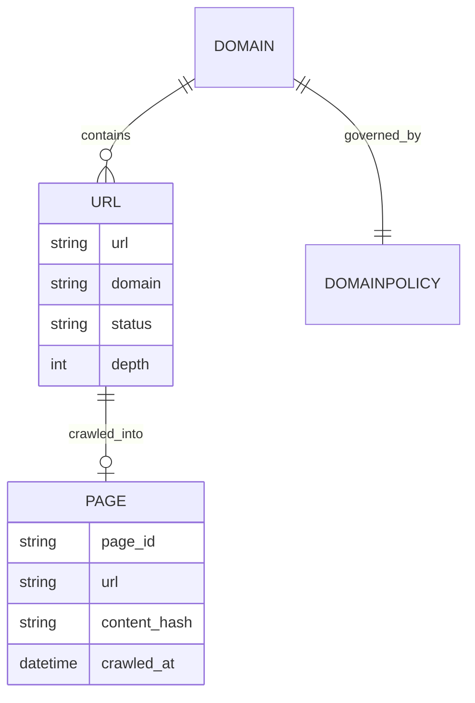
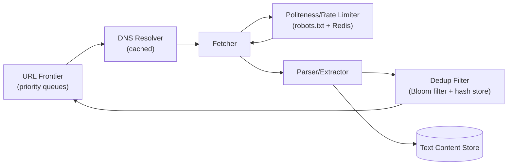

A web crawler is a program that automatically traverses the web — fetching pages, extracting their content and links, and following those links to discover more pages — to index content for search, gather research data, or monitor sites for changes. At the scale of billions of pages, the interesting problems stop being "how do I parse HTML" and become fault tolerance, politeness, and raw throughput engineering.

## Requirements


### Functional

- Given a set of seed URLs, the crawler fetches each page, extracts its text content, and discovers linked URLs to crawl next.
- Extracted text content is stored for downstream use (indexing, analysis).
- The crawler respects each site's `robots.txt` rules and crawl-delay directives.

### Non-functional

- Scale to crawling 10 billion pages within 5 days.
- Fault tolerant: a crashed worker must not lose in-flight progress or duplicate completed work.
- Polite: the crawler must not overwhelm any single site with request volume.
- Avoid redundant work: the same URL or the same content should not be processed twice.

### Out of scope

- Ranking/ordering search results built from crawled content.
- Rendering JavaScript-heavy single-page applications in full (beyond a noted extension).
- Natural-language processing of extracted text.

## Scale estimation

| Metric | Assumption | Working | Result |
|---|---|---|---|
| Target corpus | given | given | 10B pages |
| Target crawl duration | given | given | ≤5 days |
| Avg page size | given | given | 2MB |
| Network throughput budget (per machine class) | given | given | 200 Gbps |
| Theoretical fetch rate | 200Gbps ÷ 8 bits/byte ÷ 2MB/page | 200,000,000,000 / 8 / 2,000,000 | ~12,500 pages/sec |
| Effective fetch rate (30% real-world efficiency) | 12,500 × 0.30 | 12,500 × 0.30 | ~3,750 pages/sec |
| Single-machine crawl time | 10B pages ÷ 3,750 pages/sec | 10,000,000,000 / 3,750 | ~2,666,667s ≈ 30.9 days |
| Machines needed for 5-day target | 30.9 days ÷ 5-day target | 30.9 / 5 ≈ 6.2, round up | 8 machines (~3.9 days) |
| Dedup checks per page (URL-seen + content-hash) | 2 reads per 1 write | — | ~2 : 1 read : write |
| Extracted text storage | 10B pages × 5KB avg | 10,000,000,000 × 5KB | ~50TB text corpus |

> [!TIP]
> The "8 machines" figure is the single most quotable number in this design — it comes directly from dividing a realistic single-machine crawl time (30.9 days, after discounting theoretical throughput to 30% real-world efficiency) by the 5-day target. Always show that discount factor explicitly; a crawler never sustains its theoretical network throughput.

## Core entities and data model

| Entity | Key fields |
|---|---|
| `URL` | `url`, `domain`, `status` (pending/in-progress/crawled/failed), `depth`, `discovered_at` |
| `Page` | `page_id`, `url`, `content_hash`, `text_data`, `crawled_at` |
| `DomainPolicy` | `domain`, `robots_rules`, `crawl_delay`, `last_crawled_at` |



`URL.status` plus `depth` is what makes crawling resumable and bounded: status tracks progress so a crash doesn't cause duplicate or lost work, and depth caps how far a single domain's link graph is followed, which is the primary defense against crawler traps (see below).

## API design

```
POST /crawl/seed
{ "urls": ["https://example.com", ...] }
-> 202 { "accepted": 2 }

GET /crawl/status?url={url} -> { "status": "crawled"|"pending"|"failed", "lastAttempt": "..." }

GET /pages/{pageId} -> { "url": "...", "textData": "...", "crawledAt": "..." }
```

Seeding is asynchronous (`202 Accepted`) since the crawler doesn't fetch synchronously on the request — it just adds URLs to the frontier for eventual processing.

## System interface and data flow

**Input:** seed URLs to start crawling from. **Output:** text data extracted from web pages.

1. Take a seed URL from the frontier and resolve its domain to an IP via DNS.
2. Fetch the HTML from the external server using that IP.
3. Extract text data from the HTML.
4. Store the text data.
5. Extract any linked URLs from the page and add new, not-yet-seen ones to the frontier.
6. Repeat from step 1 until the frontier is exhausted or the crawl budget is reached.

## High level architecture




1. A worker pulls the next eligible URL from the frontier, respecting per-domain rate limits already recorded there.
2. It resolves the domain via a cached DNS lookup, then fetches the page over HTTP.
3. The parser stage extracts text content and outgoing links from the fetched HTML, running as a separate stage from fetching (see the fault-tolerance deep dive).
4. Extracted text is written to the content store; extracted links pass through a dedup filter (URL already seen? content already seen?) before any new, unique URLs are added back to the frontier.
5. The cycle repeats, driven by the frontier's priority ordering and each domain's politeness constraints, until the crawl budget or corpus target is met.

## Deep dive: fault tolerance and retry handling

Fetching and parsing are split into **separate stages** connected by a durable queue, rather than one monolithic "fetch-and-process" step — so a crash in the parser doesn't lose an already-fetched page, and a crash in the fetcher doesn't leave a partially-parsed page in an inconsistent state.


**When a fetch fails**, retries need exponential backoff so a persistently failing site isn't hammered repeatedly. Kafka doesn't support retry out of the box — a manual implementation is needed, typically a separate retry topic with a manually-tracked retry time. SQS has built-in support for this via **visibility timeout**, which can be increased on each retry to implement backoff without custom bookkeeping. Either way, messages that fail after exhausting retries go to a **dead letter queue** for manual inspection, rather than being silently dropped or retried forever.

**When a crawler worker itself goes down mid-processing**, the messaging system's own semantics protect progress: with Kafka, messages aren't removed from the log, and a crawler tracks its progress via consumer offset, so a crashed worker's un-committed offset means another worker resumes from the same point. With SQS, a message remains in the queue until explicitly deleted, and the visibility timeout hides an in-flight message from other workers only until that timeout elapses — if the original worker crashed before deleting it, another worker picks it up automatically.


> [!KEY]
> The unifying idea across both failure modes is: never delete or acknowledge work until it's durably completed. Whether that's Kafka offset commits or SQS message deletion, the crawler's resumability entirely depends on this discipline.

## Deep dive: politeness and respecting robots.txt

A crawler that ignores site owners' stated preferences risks getting blocked or, worse, degrading the target site's own availability. Each domain publishes rules like:

```
User-agent: *
Disallow: /private/
Crawl-delay: 10
```

These are fetched once per domain and stored (in the `DomainPolicy` entity) so every subsequent URL from that domain is checked against them before fetching. Beyond `robots.txt`, **rate limiting via a centralized store (Redis)** enforces the crawl-delay: each crawler instance checks Redis before fetching from a domain to see if the delay has elapsed. Because multiple crawler instances check this store concurrently, there's a risk of synchronized bursts right as a delay window opens — the fix is adding **jitter** to each crawler's request timing, so instances don't all fire the instant a rate limit resets.


## Deep dive: scaling to 10 billion pages in under 5 days

The throughput math above (12,500 theoretical pages/sec, discounted to 3,750 effective pages/sec, requiring 8 machines) covers the fetcher. The rest of the pipeline scales alongside it:

- **Parser** autoscales based on queue size — parsing is comparatively cheap and bursty, so a reactive autoscaler suffices where the fetcher needs pre-provisioned, budgeted capacity.
- **DNS** resolution is cached to avoid repeated lookups for the same domain, and multiple DNS providers are used in round robin to avoid a single provider becoming a bottleneck or single point of failure.
- **Efficiency**: a URL already crawled is skipped by checking its status in the database before fetching; content already seen (even at a different URL — mirrors, syndication) is caught by hashing the fetched content and checking that hash in an indexed store. A **Bloom filter** is a good fit for the "have we seen this before" check at this scale — a probabilistic structure that can definitively say "not seen" or "possibly seen" in constant space, with false positives as the acceptable tradeoff (a false positive just means occasionally, needlessly skipping a genuinely new page, which is a cheap price for the memory savings).
- **Crawler traps** — pages that generate effectively infinite new URLs (e.g. calendar pages, faceted search) are bounded by a max crawl depth per domain, preventing one misbehaving site from consuming an unbounded share of the crawl budget.

## Deep dive: dynamic pages, monitoring, and prioritization

A handful of additional concerns round out a production crawler: **dynamic pages** rendered client-side via JavaScript require a headless browser to render the page before extraction, rather than parsing raw fetched HTML that wouldn't contain the rendered content. **Monitoring** the crawler's own health (throughput, error rates, queue depth) uses standard infrastructure monitoring tooling (e.g. New Relic, Datadog) rather than anything crawler-specific. **Large files** are simply skipped past a size threshold, since they're rarely useful for text extraction and disproportionately consume fetch bandwidth. **Continual updates** are handled by a URL scheduler that re-pushes previously-crawled URLs back into the frontier on a recurring basis, so the corpus doesn't go stale. **Priority crawling** uses separate queues per priority tier, so, for example, frequently-updated or high-value domains can be scheduled ahead of a long tail of low-value pages.

## Bottlenecks and scaling

- **Fetcher throughput** is the primary bottleneck — it's bound by real network capacity, not compute, so scaling it means adding more machines with their own network budget, not just more CPU.
- **Rate-limit store contention (Redis)** — every fetch checks the domain's crawl-delay state; shard by domain so a large crawl doesn't serialize all workers through one Redis instance.
- **Dedup filter memory** — a Bloom filter sized for 10B+ URLs needs careful sizing to keep its false-positive rate acceptable; underestimating corpus size early degrades dedup accuracy later.
- **Crawler traps** left unbounded can silently consume a large share of total crawl capacity on a handful of misbehaving domains; a max-depth cap per domain is a cheap, necessary safeguard.

## Failure scenarios

| Failure | Blast radius | Mitigation |
|---|---|---|
| Fetch fails for a URL | That URL's crawl is delayed | Exponential backoff via SQS visibility timeout (or a manual Kafka retry topic); moved to a DLQ after repeated failures |
| A crawler worker crashes mid-fetch | In-flight URL's progress at risk | Message isn't deleted/committed until work completes; another worker picks it up (SQS visibility timeout expiry or Kafka offset semantics) |
| DNS provider outage | Fetches relying on that provider fail | Multiple DNS providers in round robin; failover to a healthy provider |
| Dedup store (Bloom filter/hash DB) unavailable | Risk of duplicate crawling or missed dedup | Fail safe by treating unknown as "possibly seen" and queuing for a slower verified check, rather than blindly re-crawling everything |

## Cheat sheet

- Separate the fetch and parse stages behind a durable queue — a crash in one must never corrupt or lose the other's progress.
- Never delete/commit a queue message until its work is durably complete; that single discipline gives you crash-resilient resumability.
- SQS's visibility timeout gives you retry backoff and in-flight protection for free; Kafka needs both built manually.
- Respect `robots.txt` and crawl-delay; add jitter to avoid synchronized bursts across crawler instances hitting the same domain.
- Bloom filters give cheap, constant-space "have we seen this" checks at billions-of-URLs scale, at the cost of rare false positives.
- Cap crawl depth per domain to bound crawler traps; don't rely on dedup alone to contain infinite-URL-generating pages.

## Common mistakes

| Mistake | Fix |
|---|---|
| Fetching and parsing as one inseparable step | Split into separate stages connected by a durable queue, so either can fail independently |
| Retrying failed fetches immediately, with no backoff | Use exponential backoff (SQS visibility timeout or a manual Kafka retry topic) |
| Ignoring `robots.txt` and crawl-delay | Fetch and cache each domain's policy; enforce rate limits before every fetch |
| Checking a centralized rate-limit store without jitter | Add jitter so multiple crawler instances don't burst simultaneously when a delay window resets |
| Treating dedup as "check every URL against a full table" | Use a Bloom filter for the fast, cheap first-pass check at billions-of-URLs scale |
| No cap on crawl depth per domain | Bound depth per domain to prevent crawler traps from consuming the whole crawl budget |

## Summary

A web crawler's difficulty scales with corpus size far more than with any individual page's complexity: at 10 billion pages, the real engineering is in throughput math (how many machines to hit a time budget), fault tolerance (never losing progress across fetch and parse stages, using queue semantics deliberately), politeness (respecting site-level rate limits with jitter to avoid herd effects), and efficient deduplication (Bloom filters at this scale, not table scans). Get those four right, and the actual "fetch, extract, follow links" loop is comparatively simple.

## Final design


## Top Interview Questions

### Q1. Walk through the math for how many machines are needed to crawl 10 billion pages in 5 days.

Starting from a 200 Gbps network throughput budget and a 2MB average page size, the theoretical fetch rate is `200,000,000,000 bits/sec ÷ 8 bits/byte ÷ 2,000,000 bytes/page ≈ 12,500 pages/sec`. Real-world overhead (connection setup, retries, slow servers) means only a fraction of that is sustained — assuming 30% efficiency gives `12,500 × 0.30 ≈ 3,750 pages/sec` effective. A single machine crawling at that rate needs `10,000,000,000 ÷ 3,750 ≈ 2,666,667 seconds ≈ 30.9 days` to cover the whole corpus. To hit a 5-day target, divide: `30.9 ÷ 5 ≈ 6.2`, rounded up to 8 machines for headroom, landing at roughly 3.9 days.

### Q2. Why split fetching and parsing into separate stages instead of doing both in one step?

If fetching and parsing were one atomic operation, a crash during parsing would force re-fetching a page that was already successfully downloaded — wasted network work, and on a slow or rate-limited domain, that retry itself burns through politeness budget. Separating them behind a durable queue means a successfully fetched page is durably recorded before parsing begins, so a parser crash only requires re-parsing already-local data, not re-fetching from the network. Each stage can also scale independently — parsing is cheap and CPU-bound, while fetching is network-bound and much more expensive to redo.

### Q3. How does SQS's visibility timeout help with both retry backoff and crash recovery?

Visibility timeout hides a message from other consumers for a set duration after it's received, under the assumption the receiving worker is processing it. For crash recovery, if that worker dies before deleting the message, the timeout eventually expires and another worker picks it up automatically — no explicit dead-worker detection needed. For retry backoff, the same mechanism can be reused: extending the visibility timeout on each retry effectively delays when the message becomes available again, implementing exponential backoff without a separate retry-tracking system, which is something Kafka requires building manually via a dedicated retry topic and stored retry timestamps.

### Q4. Why use a Bloom filter for deduplication instead of just querying a "seen URLs" database table?

At 10 billion+ URLs, a direct table lookup for every single discovered link, before deciding whether to enqueue it, adds significant read load and latency to the crawl loop. A Bloom filter answers "definitely not seen" or "possibly seen" in constant space and time, regardless of how many URLs have been recorded, at the cost of occasional false positives (saying "possibly seen" for something genuinely new). Since a false positive just means skipping one new page — cheap relative to the corpus size — the massive space and latency savings make it the right tool for the first-pass check, with a slower authoritative check reserved for genuinely ambiguous or high-value cases if needed.

### Q5. How do you prevent a "crawler trap" (like an infinite calendar page) from consuming the entire crawl budget?

Cap the crawl depth allowed per domain. A crawler trap typically works by generating a new, technically-unique URL on every page it serves (e.g. incrementing a calendar date indefinitely), so pure URL-dedup doesn't stop it — every generated URL genuinely hasn't been seen before. A depth limit bounds how many links deep the crawler will follow from a domain's seed regardless of how many new URLs it keeps generating, which is the only reliable defense since dedup alone can't distinguish a trap from legitimate, ever-growing content.

### Q6. How does the crawler enforce politeness without every instance hammering a rate-limited domain the instant its crawl-delay expires?

Each crawler instance checks a centralized rate-limiting store (Redis) before fetching from a domain, to confirm the crawl-delay from that domain's `robots.txt` has elapsed. With many crawler instances all checking the same store, they can become synchronized and all fire the moment the delay window opens, effectively producing a burst anyway. Adding random jitter to each instance's request timing spreads that burst out over a small window, so the domain sees a smoothed rate of requests rather than a synchronized spike, even though many instances are independently respecting the same crawl-delay value.

### Q7. How would you handle crawling a JavaScript-heavy single-page application?

A raw HTML fetch of such a page typically returns a near-empty shell, since the actual content is rendered client-side after JavaScript execution. Handling this requires routing those pages through a headless browser that actually executes the page's scripts and renders the DOM before the parser extracts text and links — a meaningfully more expensive operation per page than a plain HTTP fetch, so it's usually applied selectively (e.g. detected via a quick heuristic on the raw response) rather than for every page in the crawl.

### Q8. Why does the design use both URL-level deduplication and content-hash deduplication?

URL-level dedup ("have I already queued or crawled this exact URL") prevents redundant fetches of a URL already processed. Content-hash dedup ("have I already seen this exact content, regardless of URL") catches a different problem: mirrored or syndicated content reachable via multiple distinct URLs, which URL-dedup alone wouldn't catch since each URL looks unique. Running both means the crawler avoids re-fetching known URLs and avoids wastefully storing/processing duplicate content that merely lives at a different address.

### Q9. How do you keep a crawled corpus from going stale over time?

A URL scheduler periodically re-pushes previously-crawled URLs back into the frontier for re-crawling, rather than treating "crawled" as a permanent terminal state. The re-crawl frequency can be tuned per domain or content type — a news site's homepage might warrant re-crawling far more often than a static reference page — which naturally leads into a priority-queue design where different classes of URLs (fresh crawl vs. re-crawl, high-value vs. long-tail) are scheduled through separate queues with different priority weighting.

### Q10. What's the tradeoff of the 30% real-world efficiency discount applied to the theoretical fetch rate calculation?

The theoretical rate assumes network bandwidth is the only constraint, but real crawling involves connection setup overhead, slow or unresponsive servers, retries for transient failures, DNS resolution latency, and rate-limiting delays imposed by politeness rules — all of which reduce actual sustained throughput well below the raw bandwidth-divided-by-page-size figure. Using a conservative discount factor (here, 30%) when sizing infrastructure avoids under-provisioning based on an unrealistically optimistic number; the real value should ideally be measured empirically and revised as the crawl fleet's actual behavior is observed.
