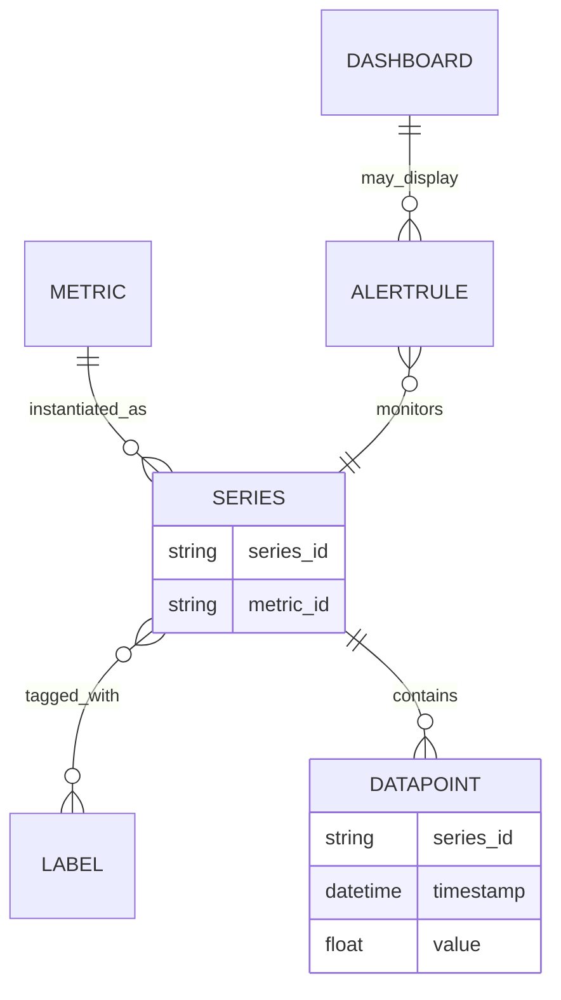
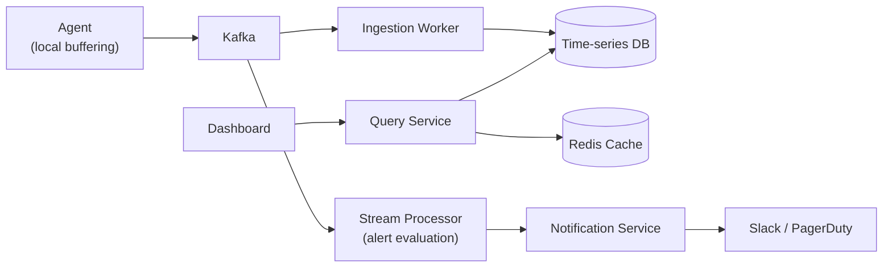

A metrics monitoring platform collects performance data (CPU, memory, throughput, latency) from servers and services, stores it as time-series data, visualizes it on dashboards, and triggers alerts when thresholds are breached — think Datadog, Prometheus/Grafana, or AWS CloudWatch. It's infrastructure engineers rely on to understand system health and respond to incidents, which makes its own reliability and latency non-negotiable: the monitoring system going down during an incident is the worst possible failure mode.

## Requirements


### Functional

- Services can ingest metrics (name, labels, value, timestamp) into the platform.
- Users can query and visualize metrics on dashboards over arbitrary time ranges.
- Users can define alert rules with thresholds against a metric query.
- Users receive notifications (Slack, PagerDuty, etc.) when an alert rule's condition is met.

### Non-functional

- Ingest millions of metric data points per second without becoming the bottleneck for the services being monitored.
- Dashboard queries over weeks of historical data must stay low latency.
- Alert latency — time from a threshold breach to a firing notification — should be under a minute.
- The monitoring system itself must remain highly available, including during the traffic spikes that accompany incidents.

### Out of scope

- Distributed tracing and log aggregation (related but distinct systems).
- Anomaly-detection/ML-based alerting (only threshold-based alerting is in scope).
- Long-term (multi-year) data archival and compliance retention policies.

## Scale estimation

| Metric | Assumption | Working | Result |
|---|---|---|---|
| Reporting hosts/services | given | given | 500K |
| Metrics emitted / host / sec | 10 avg | 500K × 10 | 5M metrics/sec (write QPS) |
| Active dashboard viewers | assumption | given | 50,000 |
| Dashboard refresh interval | assumption | given | 10s |
| Dashboard query QPS (avg) | 50,000 / 10s | 50,000 / 10 | ~5,000 queries/sec |
| Dashboard query QPS (peak) | 3× average | 5,000 × 3 | ~15,000 queries/sec |
| Read : write ratio | 15,000 : 5,000,000 | — | ~1 : 333 (write-heavy) |
| Raw ingestion bandwidth | 5M points/sec × ~100 bytes (batched) | 5,000,000 × 100B | ~500MB/sec |
| Raw storage/day (pre-compression) | 5M/sec × 16B/point × 86,400s | 5,000,000 × 16 × 86,400 | ~6.9TB/day |
| Retained storage/day (~5× TSDB compression) | 6.9TB ÷ 5 | 6.9TB / 5 | ~1.4TB/day |

> [!TIP]
> Notice the read:write ratio is inverted compared to almost every other system in this track — roughly 1 read for every 333 writes. A metrics platform is fundamentally write-heavy: dashboards are viewed by humans, but every host in the fleet is emitting data continuously. That single fact is why ingestion architecture (not query architecture) is the first thing to get right.

## Core entities and data model

| Entity | Key fields |
|---|---|
| `Label` | `key`, `value` (e.g. region, architecture, service name) |
| `Metric` | `metric_id`, `name`, `unit` (e.g. `cpu_usage`) |
| `Series` | `series_id`, `metric_id`, `labels[]` — a metric plus a specific label combination, over time |
| `AlertRule` | `rule_id`, `query`, `threshold`, `for_duration`, `notifications[]` |
| `Dashboard` | `dashboard_id`, `name`, `panels[]` (each backed by a query) |



A `Series` is the unit everything else is built on: it's the unique combination of a metric name and a specific set of label values (e.g. `cpu_usage{host="server-1", region="us-east"}`), and every data point, alert rule, and dashboard panel ultimately resolves to one or more series.

## API design

```
POST /metrics/ingest
{
  "metrics": [
    { "name": "cpu_usage", "labels": {"host": "server-1"}, "value": 0.75, "timestamp": 1640000000 },
    ...
  ]
}
// Protobuf is used in practice instead of JSON for ingestion, for efficiency at this volume.

GET /metrics/query?query=avg(cpu_usage{region="us-east"})&start=A&end=B&step=60
-> { "timestamps": [...], "values": [...] }

POST /alerts/rules
{
  "name": "High CPU Alert",
  "query": "avg(cpu_usage{region='us-east'}) > 0.9",
  "for": "5m",
  "notifications": ["slack:#oncall", "pagerduty:team-infra"]
}
```

## High level architecture



**Data flow overview:**


1. An agent running alongside each monitored service batches and locally buffers metric data points, then periodically posts them to the ingestion path.
2. Ingested metrics are published to Kafka, decoupling ingestion from storage so a slow or unavailable time-series database never blocks the services being monitored.
3. Ingestion workers consume from Kafka and write into a time-series database optimized for append-heavy, time-partitioned data.
4. Dashboard queries hit a query service, which serves from a cache when possible and falls back to the time-series database for cache misses or uncached time ranges.
5. In parallel, a stream processor consumes the same Kafka topic to evaluate alert rules in near real time, handing off to a notification service when a rule's condition is met.

### The platform can ingest metrics from services


Simply horizontally scaling a naive ingestion service that writes straight to the database doesn't hold up — it just pushes the same write load onto the database, which becomes the bottleneck. Routing ingestion through **Kafka** first absorbs bursts and decouples the services being monitored from the storage layer's write throughput.


The strongest version of this adds **agent-based collection with local buffering** — an agent (as in Datadog's model) runs alongside each monitored service, batching metrics locally before posting, which both reduces request volume and gives services resilience against short ingestion-path outages.


### Users can query and visualize metrics on dashboards

A general-purpose relational database isn't built for this write volume. A **time-series database** (InfluxDB, TimescaleDB, VictoriaMetrics) is purpose-built instead, typically backed by LSM trees: append-only writes, time-based partitioning, columnar compression, and built-in rollup/aggregation support.


### Users can define alert rules with thresholds

A simple starting point evaluates alert rules by polling the current metric state on an interval.


### Users receive notifications when alerts fire


## Deep dive: serving low-latency dashboard queries over weeks of data

Querying raw data points directly for a multi-week dashboard range is too slow — it means scanning and aggregating an enormous number of individual points on every load. **Precomputed rollups at multiple resolutions** (e.g. 1-minute, 1-hour, 1-day aggregates) fix the common case, though rollups aren't a fixed answer for every query shape — a pre-aggregated resolution that doesn't match what a particular query needs isn't helpful.


The strongest version adds a **caching layer with query splitting**: a Redis caching layer stores previously-computed query results, and a sliding-window approach means only the *missing* portion of a time range needs computing — a dashboard that was already viewed a minute ago just needs the newest minute added, not the whole range recomputed. Popular queries are precomputed proactively; recent data is queried from the time-series database directly, while older data is served from cache.


> [!KEY]
> The sliding-window reuse is what makes this efficient rather than just "add a cache" — recomputing an entire multi-week range on every refresh, even from a warm cache, still wastes work on data that hasn't changed since the last time the same dashboard was viewed.

## Deep dive: reducing alert latency below one minute

Simply increasing polling frequency helps but doesn't scale cleanly — polling more often means proportionally more query load for a benefit that plateaus. The stronger approach is **stream processing for real-time alert evaluation**: a stream processing framework (e.g. Flink) evaluates alert conditions directly against the incoming metrics stream as data arrives, rather than polling stored data after the fact. Because continuously evaluating potentially thousands of alert rules against a live stream is expensive, rules are processed in parallel, categorized so unrelated rules don't block each other.


## Deep dive: high availability during spikes and failures

A single instance of the ingestion or alerting path is a single point of failure — unacceptable for a system whose entire purpose is being reliable during incidents. The fix has two layers: **redundancy and durable buffers** across every stage (ingestion, Kafka, storage, alerting, notification), and **end-to-end resumable support** — the ingestion path relies on Kafka's own retry semantics, and the alerting path uses checkpointing against Kafka so a stream-processing restart resumes exactly where it left off rather than reprocessing or skipping data.

A subtler requirement: the monitoring system needs to **monitor itself**, either via a separate, independent instance of the same system or a third-party service — otherwise, the one moment the monitoring platform itself goes down is also the one moment nobody gets an alert about it.

## Deep dive: handling cardinality explosion

If labels include unbounded or high-cardinality values (like a unique request ID or a raw user ID as a label), the number of distinct series explodes, and aggregation queries across that metric become extremely expensive or outright infeasible. Two controls address this: a **policy database** defines which labels and label values are allowed for a given metric, rejecting or dropping disallowed ones at ingestion time, and a **cardinality tracker** (backed by Redis) maintains a running count of unique series per metric, so ingestion can be throttled or flagged before an unbounded label silently degrades the whole platform.


> [!WARNING]
> Cardinality explosion is one of the few failure modes in this design that isn't about traffic volume — a single misconfigured service emitting a metric with a unique ID as a label can generate more distinct series than the rest of the entire fleet combined. Catching it at ingestion time, not after storage has already ballooned, is what makes the policy database and cardinality tracker worth the added complexity.

## Bottlenecks and scaling

- **Kafka partitioning** — partition by metric or service so a burst from one source doesn't delay ingestion for everyone else sharing the topic.
- **Time-series database write amplification** — at 5M points/sec, the storage engine's compaction and compression strategy (LSM-tree based) directly determines whether ingestion keeps pace; monitor compaction lag as a leading indicator of trouble.
- **Rollup staleness** — precomputed rollups lag slightly behind raw ingestion; dashboards querying very recent data should read raw/recent data directly rather than waiting on a rollup that hasn't caught up yet.
- **Alert rule evaluation parallelism** — thousands of concurrently evaluated rules need to be partitioned/categorized so one expensive rule's evaluation doesn't delay a simple one sharing the same processing pipeline.

## Failure scenarios

| Failure | Blast radius | Mitigation |
|---|---|---|
| Kafka broker/partition down | Ingestion for affected metrics delayed | Kafka replication keeps other partitions serving; agents buffer locally until the ingestion path recovers |
| Time-series database instance down | Writes/reads for affected shard fail | Redundant storage nodes; ingestion workers retry from Kafka until the shard recovers, no data lost |
| Stream processor (alerting) crash | Alert evaluation paused | Checkpointing against Kafka lets the processor resume exactly where it left off, without missing or duplicating evaluations |
| Cardinality explosion from a misconfigured service | Storage and query performance degrade platform-wide | Policy database rejects disallowed labels at ingestion; cardinality tracker flags the offending metric before it impacts other tenants |

## Cheat sheet

- This is a write-heavy system (read:write inverted from most other designs) — get ingestion architecture right first.
- Route ingestion through Kafka before storage, and use agent-based local buffering to smooth bursts and add resilience.
- Use a time-series database (LSM-tree based, append-only, time-partitioned, columnar) — not a general relational database.
- Precomputed multi-resolution rollups plus a cache with sliding-window query splitting is what makes multi-week dashboard queries fast.
- Stream processing (not increased polling) is what gets alert latency reliably under a minute.
- A policy database plus a cardinality tracker are the specific defenses against cardinality explosion — a failure mode about label design, not traffic volume.
- The monitoring system must monitor itself; otherwise its own outage is invisible.

## Common mistakes

| Mistake | Fix |
|---|---|
| Writing ingested metrics directly to a general relational database | Use a purpose-built time-series database (LSM-tree based) designed for this write pattern |
| Scaling the ingestion service horizontally while it writes straight to storage | Insert Kafka between ingestion and storage to decouple write bursts from storage throughput |
| Querying raw data points for multi-week dashboard ranges | Precompute rollups at multiple resolutions; cache with sliding-window reuse of prior results |
| Reducing alert latency purely by polling more often | Move to stream processing that evaluates rules against the live ingestion stream |
| Allowing arbitrary label values without any cardinality controls | Enforce a policy database on allowed labels and track cardinality per metric |
| Assuming the monitoring platform doesn't need its own monitoring | Monitor it via an independent instance or third-party service |

## Summary

A metrics and monitoring platform is a write-heavy time-series problem wrapped around a latency-critical read and alerting layer. Kafka-buffered, agent-collected ingestion into a purpose-built time-series database handles the write side; precomputed rollups plus a sliding-window cache handle fast dashboard reads over long ranges; stream processing (not more frequent polling) is what gets alert latency under a minute; and redundancy plus end-to-end resumability across every stage is what keeps the system available during the exact incident spikes it exists to help engineers navigate. Cardinality controls are the platform's specific defense against a failure mode unique to this domain — a single poorly-labeled metric silently overwhelming the entire system.

## Final design


## Top Interview Questions

### Q1. Why is this system fundamentally write-heavy, unlike most other designs in this track?

Every host and service in the monitored fleet continuously emits metrics — potentially every second — regardless of whether anyone is looking at a dashboard at that moment. Dashboard views and alert evaluations are comparatively rare human- or rule-driven events layered on top of that constant stream. The estimation shows this concretely: roughly 5M writes/sec against only ~15,000 peak dashboard queries/sec, an inverted ratio compared to consumer-facing systems, which is why ingestion architecture — not query optimization — is the first-order design concern.

### Q2. Why route metric ingestion through Kafka instead of writing directly to the time-series database?

Writing directly couples the ingestion rate to the database's instantaneous write capacity — any burst (a large deployment, a cascading incident generating more metrics) directly threatens to overwhelm storage. Kafka absorbs bursts by durably buffering incoming metrics, letting ingestion workers consume and write to storage at a sustainable pace, decoupled from momentary spikes in emission rate. It also means a temporary storage outage doesn't cause data loss or block the services being monitored — metrics simply queue until ingestion workers catch up.

### Q3. Why use a time-series database instead of a general-purpose relational database for storage?

A relational database's general-purpose row storage and B-tree indexing aren't optimized for this workload: extremely high write volume, append-only data (metrics are never updated in place, only added), and queries that mostly aggregate over time ranges. A time-series database is built specifically for this — LSM-tree-based storage for fast appends, time-based partitioning so old data can be efficiently expired or tiered, columnar compression exploiting the repetitive nature of metric data, and built-in rollup/aggregation support. At 5M writes/sec, a general relational database simply isn't the right tool.

### Q4. How do precomputed rollups and caching work together to keep multi-week dashboard queries fast?

Precomputed rollups (1-minute, 1-hour, 1-day resolutions) mean a multi-week query doesn't have to aggregate raw per-second data points — it reads a much smaller number of pre-aggregated values at whatever resolution fits the requested time range and zoom level. Layered on top, a Redis cache stores previously computed query results, and a sliding-window approach means a dashboard being actively viewed only needs the newest slice of time computed on each refresh — the rest of the range is reused from what was already cached moments earlier, rather than being recomputed from scratch every time.

### Q5. Why does reducing alert latency require stream processing rather than just polling more frequently?

Polling checks metric state at discrete intervals, so latency is bounded below by the polling interval itself — halving the interval halves the latency but doubles the query load, a tradeoff that degrades badly as you push toward sub-minute latency across many rules. Stream processing evaluates alert conditions continuously as data arrives in the ingestion stream, so detection latency is driven by processing speed rather than an artificial polling cadence, and it scales by parallelizing rule evaluation across the stream rather than by issuing more frequent queries against stored data.

### Q6. What is cardinality explosion, and why is it dangerous in a metrics system specifically?

A series is defined by a metric name plus a specific combination of label values. If a label is allowed to take on effectively unbounded values — a unique request ID or raw user ID, for instance — the number of distinct series for that metric can explode combinatorially, since every unique label value combination creates a new series. This is dangerous because it's not proportional to traffic volume in the usual sense: a single misconfigured service can generate more unique series than the entire rest of the fleet, degrading storage, query, and aggregation performance for everyone sharing that infrastructure, not just the offending service.

### Q7. How do you prevent one misbehaving service from causing a cardinality explosion that affects the whole platform?

A policy database defines which labels and label values are permitted for a given metric, and ingestion rejects or drops values outside that policy before they're ever written to storage — catching the problem at the source rather than after storage has already ballooned. A cardinality tracker, typically backed by Redis, maintains a running count of unique series per metric in near real time, so ingestion can throttle or flag a metric whose series count is growing abnormally, well before it becomes a platform-wide performance problem.

### Q8. Why does the ingestion path use agent-based local buffering instead of having each service call the ingestion API directly?

An agent running alongside each monitored service can batch multiple metric data points into fewer, larger requests, reducing request overhead at the ingestion layer relative to sending every individual metric as its own call. It also gives resilience against short ingestion-path outages or network blips — the agent buffers locally and retries, rather than the monitored service itself needing to handle ingestion failures or losing data points during a brief disruption. This mirrors the design used by production systems like the Datadog agent.

### Q9. Why must the monitoring system monitor itself, and how would you implement that?

If the monitoring platform is the only thing watching for problems and it goes down, its own outage is invisible — the one moment engineers most need alerting is also the moment it's silently unavailable. This is addressed either by running a genuinely separate, independent instance of the monitoring system to watch the primary one, or by using a third-party monitoring service specifically for this purpose, so a failure in the primary system's infrastructure doesn't also take down the mechanism that would otherwise alert someone to that failure.

### Q10. How does the design ensure no data is lost or double-processed if the alert-evaluating stream processor crashes and restarts?

The stream processor checkpoints its progress against Kafka — periodically recording which offset in the stream it has successfully processed. On restart after a crash, it resumes from the last committed checkpoint rather than the beginning of the stream or an arbitrary point, so it neither skips data that arrived during the crash window nor reprocesses data it had already evaluated before crashing. This is the same durable-progress-tracking principle used on the ingestion side, applied to the alerting path.
