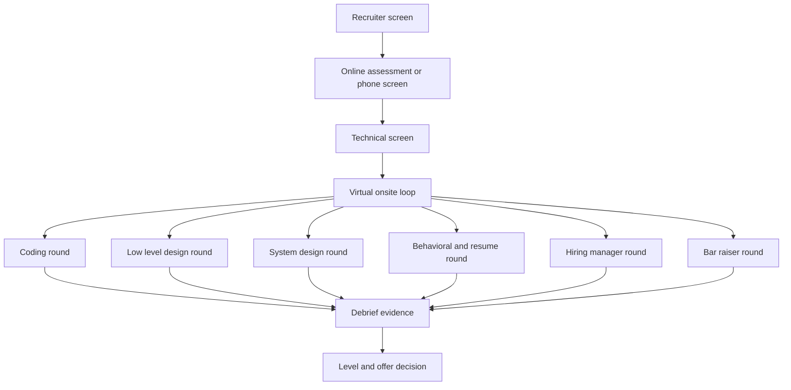

A senior interview loop is not one long exam. It is a set of calibrated rounds where each interviewer owns a narrow signal, writes evidence, and joins a debrief to decide level and hire strength. Treat every round as a scoring game with a clock, a rubric, and a predictable way candidates lose signal.

## Loop anatomy

Most loops begin with a recruiter screen, then a phone or video screen, then a virtual onsite set of four to six interviews. The order varies by company, but the evaluation pattern is stable: first prove you are worth scheduling, then prove problem solving, then prove design judgment, then prove leadership and role fit.



| Stage | Main decision | Candidate job | Evidence interviewer writes |
|---|---|---|---|
| Recruiter screen | Should the loop start | Explain role fit and logistics clearly | Communication, compensation range, availability, basic fit |
| Online assessment | Does minimum coding bar hold | Solve accurately under time pressure | Correctness, complexity, edge cases, code hygiene |
| Technical screen | Is onsite worth the cost | Show one strong technical signal live | Reasoning, collaboration, recovery after hints |
| Onsite loop | Hire, no hire, and level | Produce repeatable senior signals across rounds | Technical depth, ambiguity handling, ownership, values |
| Debrief | Calibrate risk | No direct action except prompt follow up | Consistent evidence, concern themes, leveling indicators |

> [!KEY]
> The loop rewards visible reasoning. A silent correct answer is weaker than a slightly messy answer where the interviewer can see assumptions, alternatives, and recovery.

## Screening rounds

Screening rounds reject for poor fit more often than they select for brilliance. Your goal is crisp signal: a thirty second pitch, numbers from your strongest projects, and a clean explanation of why this role matches your next step.

### Recruiter and hiring screen

| Round | Duration | What is scored | Rubric signal | Time budget inside round | Common way to lose |
|---|---:|---|---|---|---|
| Recruiter screen | 20 to 30 min | Fit, motivation, logistics, compensation range | Clear role match and no obvious process risk | 3 min pitch, 10 min background, 10 min role logistics, 5 min questions | Rambling through a resume history with no role connection |
| Hiring manager screen | 30 to 45 min | Team fit, level, ownership, communication | Can this person solve the team problem in the next six months | 5 min intro, 20 min project depth, 10 min leadership style, 10 min questions | Treating it like small talk and never showing judgment |
| Phone technical screen | 45 to 60 min | Minimum technical bar and collaboration | Can reason aloud through one hard topic | 5 min clarify, 30 min problem, 10 min test or trade-off, 5 min questions | Waiting for hints instead of driving the conversation |

The recruiter screen still deserves preparation. Know your availability, target location, work authorization, compensation constraints, and the one sentence reason you are interested. For a manager screen, prepare two project stories mapped to the job description: one technical impact story and one team leadership story.

## Coding and assessment rounds

Coding rounds usually evaluate the fastest-to-calibrate skill: can you solve a constrained problem with clean code while speaking. Online assessments score output first, but live rounds score collaboration equally.

| Round | Duration | What is scored | Rubric signal | Time budget inside round | Common way to lose |
|---|---:|---|---|---|---|
| Online assessment | 60 to 90 min | Correctness, complexity, completed test cases | Pattern recognition under pressure | 5 min scan all tasks, 35 min core problem, 20 min second task, 10 min hidden edge cases | Spending the whole session polishing the first solution |
| DSA coding | 45 to 60 min | Approach, implementation, testing, complexity | Turns constraints into the right data structure or algorithm | 5 min clarify, 5 min brute force and optimized plan, 25 min code, 10 min tests, 5 min complexity | Jumping to code before stating invariant and examples |
| Code review | 30 to 45 min | Bug finding, maintainability, mentoring tone | Finds correctness risk before style issues | 10 min read, 15 min high severity feedback, 10 min tests and refactor suggestions | Listing nits while missing a race or null crash |

A senior coding answer states the brute force cost, names the pattern, explains why the invariant holds, then codes. If stuck, simplify the problem: solve for sorted input, smaller constraints, or a single source before generalizing. Hints are not fatal if you use them well and continue independently.

```text
Round note template
Problem: restate input, output, and constraints
Approach: brute force cost, chosen pattern, invariant
Tests: empty, single item, duplicate, boundary, large case
Trade-off: time, space, readability, failure mode
Follow-up: production hardening or alternate approach
```

> [!TIP]
> Ask for confirmation as hypothesis validation. Say you are assuming a sorted input or monotonic predicate, then ask whether that interpretation matches the problem.

## Design and implementation rounds

Design rounds score the same trait from different distances. HLD asks whether you can shape a distributed system under load. LLD asks whether you can shape maintainable code. Machine coding asks whether the shape still works when compiled.

| Round | Duration | What is scored | Rubric signal | Time budget inside round | Common way to lose |
|---|---:|---|---|---|---|
| Low level design | 45 to 60 min | Entities, interfaces, patterns, extensibility | New feature becomes a new class or strategy | 5 min requirements, 10 min class sketch, 25 min code or methods, 10 min extension | Building one large manager class with every responsibility |
| Machine coding | 60 to 120 min | Working code, clean abstractions, demoability | Runnable MVP plus one clean extension seam | 10 min clarify, 50 to 80 min core build, 10 min demo, 10 min refactor or discuss | Over-engineering frameworks before the core path works |
| System design | 45 to 60 min | Requirements, scale, architecture, trade-offs | Drives from constraints to bottlenecks to mitigations | 5 min requirements, 5 min estimates, 10 min API and data, 25 min architecture, 10 min deep dive | Drawing boxes without stating scale or failure modes |
| Debugging round | 45 to 60 min | Systematic triage, evidence, root cause | Reproduce, hypothesize, isolate, fix, verify | 5 min read, 10 min hypotheses, 25 min investigation, 10 min fix and prevention | Randomly editing code without proving a hypothesis |

In HLD, write the non-functional requirements before boxes: QPS, latency, availability, durability, consistency, and abuse risk. In LLD, name the pattern only when it earns its place. In machine coding, keep a demo path alive even if the final abstraction is not perfect.

> [!WARNING]
> The most expensive design mistake is depth in the wrong place. If the interviewer wants fan-out consistency, a perfect API table will not rescue a missing discussion of delivery semantics.

## Leadership rounds

Behavioral, resume, manager, and bar raiser rounds are not soft rounds. They test whether your impact pattern is believable at the level being discussed. A senior candidate owns a component and explains trade-offs; a staff candidate explains cross-team consequences, long term maintainability, and how others adopted the decision.

| Round | Duration | What is scored | Rubric signal | Time budget inside round | Common way to lose |
|---|---:|---|---|---|---|
| Behavioral leadership | 45 to 60 min | Ownership, conflict, learning, collaboration | STAR stories with metrics and reflection | 5 min intro, 35 min four stories, 10 min follow-ups, 5 min questions | Telling team stories without your specific action |
| Resume deep dive | 45 to 60 min | Depth of claimed experience | Can defend architecture, numbers, and alternatives | 5 min project choice, 30 min deep dive, 10 min trade-offs, 5 min future changes | Not knowing a number or decision on your own resume |
| Hiring manager | 45 to 60 min | Role match, growth, operating style | Connects past work to team goals | 10 min mutual context, 25 min experience, 10 min expectations, 5 min questions | Asking generic questions that could fit any team |
| Bar raiser | 45 to 60 min | Values, judgment, exceptional signal | High bar evidence with second order thinking | 5 min frame, 30 min hard stories, 10 min curveball, 5 min questions | Giving safe examples that never show a difficult choice |

Prepare eight reusable stories: technical leadership, performance win, platform impact, reliability or security, mentoring, conflict, ambiguity, and failure. Each story should have a metric, a trade-off, a decision you owned, and a retrospective improvement.

## Senior signal inside the room

Interviewers cannot grade what they cannot observe. Make the invisible visible: assumptions, discarded alternatives, test choices, risk calls, and recovery steps. This does not mean narrating every keystroke. It means narrating decision points.

| Situation | Weak signal | Strong signal |
|---|---|---|
| You do not know a detail | Bluffing or freezing | State what you know, reason from first principles, flag verification |
| You get a hint | Apologizing repeatedly | Integrate it, restate the corrected invariant, continue |
| You are behind time | Silently rushing | Re-scope aloud and preserve a working core |
| You disagree | Argue from preference | Compare criteria, accept the interviewer constraint, move forward |
| The round ends early | Relax and stop | Ask targeted questions and summarize trade-offs you would explore |

A good end-of-round question depends on interviewer type. Ask engineers about technical debt and on-call patterns, managers about first six month outcomes, recruiters about timeline, and bar raisers about values that are visible in real decisions.


A practical way to prepare is to create one small scorecard per round before the loop starts. The scorecard should not be a script, because scripted answers break under follow-up. It should be a set of evidence you intend to produce.

| Round | Evidence to deliberately produce | Minimum acceptable proof |
|---|---|---|
| Coding | Pattern choice, invariant, tested edge cases | Code runs or is traced through with convincing tests |
| LLD or machine coding | Entity ownership, extension seam, demo path | Core behavior works and one follow-up has a clean change point |
| HLD | Requirements, scale estimate, bottleneck, failure mode | Architecture answers the non-functional requirement that matters most |
| Behavioral | Personal action, metric, conflict, reflection | Story fits under three minutes and survives one follow-up |
| Manager or bar raiser | Role fit, judgment, self-awareness | Example connects to team outcomes and long-term learning |

Use this scorecard during prep, not during the call. When a round starts, you should know which proof you need to create, so you can spend attention on the actual prompt.

## Cheat sheet

- Start every round by clarifying the scoring target, not by showing speed.
- Convert constraints into a plan before writing code or drawing architecture.
- Time-box the round out loud so the interviewer sees control.
- In coding, say brute force, optimized idea, invariant, implementation, tests, complexity.
- In HLD, move requirements to estimates, then API, data model, architecture, deep dive, trade-offs.
- In LLD, identify entities, interfaces, patterns, core methods, and extension seams.
- In leadership, use STAR with numbers, your actions, decision trade-offs, and learning.
- When stuck, reduce the problem, state hypotheses, and ask for targeted confirmation.
- End with questions tailored to the interviewer and team stage.

## Common mistakes

| Mistake | Fix |
|---|---|
| Treating all interviews as coding rounds | Prepare separate scorecards for coding, design, debugging, leadership, and manager fit |
| Talking through a resume chronologically | Lead with the role-relevant project and quantify impact early |
| Drawing architecture before requirements | Write functional and non-functional requirements first, then design against them |
| Over-polishing a small part of a round | Preserve time for tests, trade-offs, and interviewer questions |
| Asking vague questions at the end | Prepare questions by interviewer type and connect them to the role |
| Hiding uncertainty | Say what you know, reason from principles, and describe how you would verify |

## Summary

A senior loop is a structured evidence gathering process. Each round has a clock, a rubric, and a common failure mode, so preparation should be round specific. The winning pattern is to clarify, communicate decisions, produce the expected artifact, verify it, and show learning when conditions change. Strong candidates do not need perfect answers in every room; they need repeatable evidence that their judgment travels across coding, design, debugging, and leadership contexts.

## Top Interview Questions

### Q1. How should I introduce myself in the first three minutes of a recruiter or manager screen?

Use a compact pitch that connects your background to the role. Start with current scope, then one flagship project, then the reason this role is a logical next step. A strong version is: I am a backend engineer working on high scale services, recently led a latency reduction or platform migration, and I am looking for a role where distributed systems and product impact both matter. Avoid a chronological resume walk. Recruiters need fit and logistics; managers need relevance and trajectory. If you have metrics, include one or two, not ten. End by inviting the interviewer to steer toward the area they care about most.

### Q2. What is the right way to handle a technical question I do not know?

Do not bluff and do not freeze. Say you do not know the exact fact, then reason from what you do know. For example, if asked about a database isolation detail you have not memorized, explain the consistency issue, possible anomalies, and how you would verify the specific behavior. This preserves senior signal because interviewers care about problem solving under uncertainty. If the unknown is essential to the problem, ask for the missing constraint and continue with an explicit assumption. A confident but false answer is worse than a bounded answer with sound reasoning.

### Q3. How do I recover when I am stuck in a coding round?

First stop silent searching. Re-read the problem statement aloud and restate the input, output, and constraints. Then solve a smaller version: fewer elements, sorted input, one source, or no duplicates. Name the brute force and its cost because it gives a baseline. From there, ask what property would allow improvement: monotonicity, hashing, ordering, overlapping subproblems, or graph traversal. If you need help, ask for hypothesis validation rather than a generic hint. Once unstuck, summarize the corrected invariant before coding so the interviewer sees recovery rather than panic.

### Q4. What is the difference between senior and staff signal in a system design round?

A senior answer can produce a correct, scalable design for the stated requirements. A staff answer also explains why this design should be chosen over alternatives, what failure modes will dominate in production, how the system affects adjacent teams, and what operational burden it creates. Senior candidates usually cover components and trade-offs. Staff candidates cover decision criteria, migration path, ownership boundaries, cost, observability, and long-term evolution. The difference is not more boxes on the diagram; it is broader judgment and the ability to make an ambiguous decision durable for an organization.

### Q5. How much should I talk while coding or designing?

Talk at decision points, not every keystroke. You should say what you are clarifying, which approach you are choosing, why an invariant holds, what edge case you are testing, and what trade-off you are making. Silence longer than a minute creates no evaluable signal and can make a correct answer look accidental. On the other hand, constant narration slows implementation. A good rhythm is plan aloud, code quietly for a short burst, then summarize what changed and what you will verify next. This lets the interviewer follow the work without becoming your typist.

### Q6. What should I ask at the end of each round?

Ask questions that match the interviewer. Engineers can answer about technical debt, on-call pain, code review norms, and architecture decisions. Managers can answer about team goals, first six month expectations, hiring level, and how success is measured. Recruiters can answer about process, timeline, location, and compensation mechanics. Bar raisers can answer about values and what differentiates strong performers. Avoid questions whose answers are generic or easy to find in public material. A good question signals that you understand the role and are already thinking about how to contribute.

### Q7. How should I prepare for a bar raiser round?

Prepare stories that show difficult judgment, not just successful delivery. Bar raisers often test ownership, learning, values, and intellectual honesty with follow-ups that look for depth. For each story, know the context, your action, measurable result, conflict, trade-off, and what you would change now. Strong answers include second order effects: how a decision changed team habits, platform reliability, operating cost, or future architecture. If given a technical curveball, reason calmly from first principles. Bar raisers are often less interested in the specific domain than in whether your judgment raises the average quality of the team.

### Q8. How do I handle a round that is going badly with ten minutes left?

Acknowledge the clock and rescue the highest value signal. In coding, get a simple working solution and test it, even if it is not optimal. In design, summarize requirements, present a coherent architecture, and name the deepest unresolved risk. In debugging, state the strongest hypothesis, evidence collected, and next proof step. Do not spend the final minutes apologizing or restarting. Interviewers can still write positive evidence for prioritization, recovery, and communication if you re-scope deliberately. A controlled partial answer is often better than an ambitious answer that never reaches verification.

### Q9. Why is the debrief important if I am not in the room?

The debrief converts round notes into a hiring and leveling decision. Each interviewer brings evidence, not just a feeling. One weak round may be outweighed by strong repeated signals, but a pattern of the same concern usually becomes decisive. This is why consistency matters. If several interviewers write that you did not clarify requirements, the concern becomes larger than any single answer. Your job during the loop is to create clear evidence: assumptions, trade-offs, tests, leadership examples, and reflection. Follow-up thank you notes rarely change evidence, but professionalism and responsiveness can reduce process risk.

### Q10. How do I decide whether to ask for a hint?

Ask once you have shown a real attempt and can describe the exact uncertainty. Good hint requests are narrow: I am considering a sliding window but I need monotonicity, does this constraint imply it. Poor hint requests are broad: I am stuck, what should I do. A narrow request preserves signal because it shows the interviewer your mental model. After receiving a hint, repeat it in your own words, update the plan, and move quickly. Needing a hint is not an automatic failure; failing to use it independently often is.
