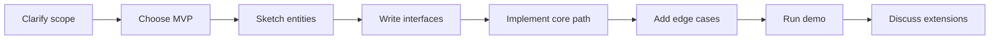
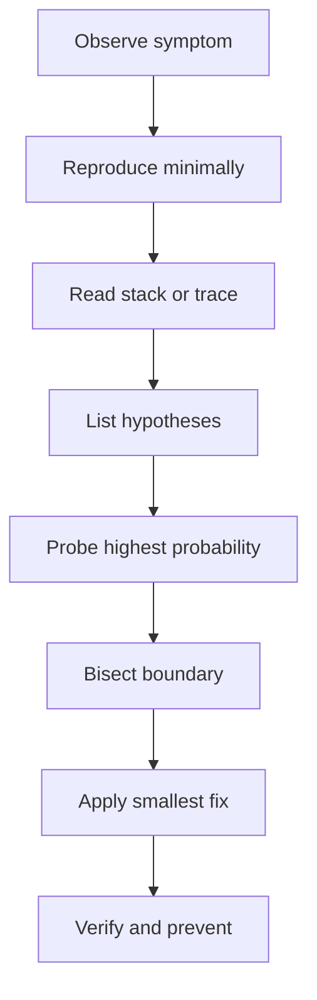

Machine coding and debugging rounds test whether your design instincts survive contact with a running program. You are not expected to build a production service, but you are expected to clarify scope, keep the core executable, and prove fixes with evidence rather than hope.

## Round shapes and scoring

A machine coding round asks you to build a small working system in 60 to 120 minutes: a parking lot, rate limiter, logger, cache, notification dispatcher, elevator scheduler, or board game engine. A debugging round gives you a broken repository, failing test, production trace, or performance symptom and watches how you isolate the fault.

| Round type | Typical duration | Artifact | Main scoring signal | Common failure |
|---|---:|---|---|---|
| Machine coding | 60 to 120 min | Runnable in-memory application or library | Working core with clean abstractions and a demo | Building abstractions before a core path works |
| LLD plus code | 45 to 75 min | Class model and key methods | SOLID design with enough implementation to prove it | Drawing classes but never showing behavior |
| Debugging repo | 45 to 60 min | Fix plus explanation | Reproduces, hypothesizes, proves, verifies | Random changes with no minimal reproduction |
| Live-site triage | 30 to 60 min | Investigation plan and mitigation | Correlates alert, deploy, dependency, and customer impact | Root causing before stabilizing the system |

| Dimension | Strong signal | Weak signal |
|---|---|---|
| Scope control | Names MVP and non-goals in the first ten minutes | Accepts every feature and runs out of time |
| Code structure | Entities, interfaces, and data structures match the domain | One service class owns state, rules, and I/O |
| Correctness | Core happy path and one error path are demoed | Only verbal claims of correctness |
| Extensibility | New policy becomes a new strategy, state, or repository | New requirement means editing many existing methods |
| Debugging | Smallest failing case proves the fix | Full test suite is rerun without understanding failure |

> [!KEY]
> The winning machine coding shape is class model, working core, demo, then one extensibility answer. Perfect architecture without execution is not a hire signal.

## Time boxes and build order

The biggest difference between a good and bad round is sequencing. The interviewer must see you make scope decisions before you write code. Spend the first few minutes confirming whether persistence, concurrency, authentication, UI, and external integrations are in scope. Most rounds accept in-memory storage unless explicitly stated otherwise.



| Phase | 60 minute round | 90 minute round | What to say out loud |
|---|---:|---:|---|
| Clarify | 5 min | 8 min | I will keep storage in memory unless persistence is required |
| Sketch | 5 min | 8 min | These are the entities and the rules they own |
| Core implementation | 30 min | 50 min | I am making the happy path run before adding optional features |
| Edge cases | 8 min | 10 min | I am testing empty, duplicate, capacity, and invalid transitions |
| Demo | 7 min | 8 min | This input proves the core behavior and this input proves rejection |
| Extensions | 5 min | 6 min | Persistence, concurrency, and metrics fit behind these seams |

The build order should be data structures first, then domain rules, then orchestration, then input and output. For a parking lot, implement `Spot.TryPark` before pricing. For a rate limiter, implement token refill before tier management. For a cache, implement `TryGet` and eviction before background cleanup. That order keeps the code demoable.

> [!WARNING]
> Stop refactoring when the next refactor will not change the demo or the extension story. A clean enough working program beats an elegant half program.

## Designing the smallest demoable core

Choose abstractions that explain the domain, not abstractions that show off. A good rule is one interface at a volatility boundary: eviction policy, payment calculator, notification sender, storage repository, or win rule. Inside a 60 minute round, avoid dependency injection containers, background workers, databases, HTTP servers, and async unless the prompt requires them.

| Prompt | Core data structure | First demo path | Natural extension seam |
|---|---|---|---|
| LRU cache with TTL | Dictionary plus linked list | Put three keys, read one, evict one | Eviction policy or clock provider |
| Rate limiter | Per-key bucket map | Allow burst then deny exhausted token | Limiter strategy or distributed store |
| Parking lot | Spots list plus plate index | Park, reject oversized vehicle, leave | Spot allocation or fee calculator |
| Logger | Sink list plus log level | Drop debug, write error to console | Sink strategy or async decorator |
| Board game | Grid plus win rule | Place marks and detect win | Rule strategy or player strategy |
| Elevator | Ordered stop sets | Add stops and move in scan order | Scheduler policy or multi-car controller |

A short, realistic sketch should have named operations, clear invariants, and at least one edge case. This cache is not production complete, but it demonstrates the correct shape: dictionary for lookup, linked list for recency, lazy expiry, and a small lock for correctness.

```csharp
public sealed class TtlCache<TKey, TValue> where TKey : notnull
{
    private record Entry(TKey Key, TValue Value, DateTime? Expiry);
    private readonly int _capacity;
    private readonly Dictionary<TKey, LinkedListNode<Entry>> _map = new();
    private readonly LinkedList<Entry> _lru = new();
    public TtlCache(int capacity)
    {
        if (capacity <= 0) throw new ArgumentOutOfRangeException(nameof(capacity));
        _capacity = capacity;
    }
    public void Put(TKey key, TValue value, TimeSpan? ttl = null)
    {
        if (_map.Remove(key, out var old)) _lru.Remove(old);
        if (_map.Count >= _capacity) RemoveTail();
        var expiry = ttl is null ? null : DateTime.UtcNow.Add(ttl.Value);
        var node = _lru.AddFirst(new Entry(key, value, expiry));
        _map[key] = node;
    }
    public bool TryGet(TKey key, out TValue? value)
    {
        if (!_map.TryGetValue(key, out var node)) { value = default; return false; }
        if (IsExpired(node.Value)) { _lru.Remove(node); _map.Remove(key); value = default; return false; }
        _lru.Remove(node); _lru.AddFirst(node);
        value = node.Value.Value; return true;
    }
    private void RemoveTail()
    {
        var node = _lru.Last; if (node is null) return;
        _lru.RemoveLast(); _map.Remove(node.Value.Key);
    }
    private static bool IsExpired(Entry e) => e.Expiry <= DateTime.UtcNow;
}
```

Narrate invariants while coding: a key exists in both `_map` and `_lru` or neither; the linked list head is most recently used; expired reads behave like misses; capacity eviction removes the tail. These are the checks the interviewer is silently running.

## Debugging workflow

Debugging rounds reward discipline. Start by reproducing the failure exactly, not by reading random files. A failing test, stack trace, log line, or latency graph is evidence. Once reproduced, form hypotheses and rank them by probability and blast radius.



| Step | What you do | Evidence to collect | Bad habit to avoid |
|---|---|---|---|
| Reproduce | Run the failing command or smallest input | Exact error, seed data, request, environment | Assuming you understand from the title |
| Read stack | Identify crash site and caller context | Top frame, parameters, recent code path | Fixing the caller before reading callee state |
| Hypothesize | Name three likely causes | Expected observation for each | Keeping theories vague |
| Bisect | Move the probe across boundaries | Last good layer and first bad layer | Logging everywhere at once |
| Fix | Make the smallest semantic change | Passing failing case plus nearby cases | Refactoring while the bug is active |
| Prevent | Add test, metric, or guardrail | Regression test or alert condition | Declaring victory after one manual run |

For live-site prompts, stabilize before root cause. If p99 latency jumps, ask whether a deploy happened, whether errors rose, which endpoint changed, and which dependency is slow. A rollback, traffic shift, feature flag, or cache TTL adjustment may be the right first move even before the final root cause is proven.

> [!TIP]
> Say the proof condition before probing. For example, if user ID is null at the service boundary, the controller mapping is guilty; if it becomes null inside the service, the enrichment step is guilty.

## Narration and demo discipline

Machine coding demos should be boring in the best way. Prepare a `Main` or test method that exercises the happy path, a rejection path, and an extension discussion. Do not wait until the last minute to run code for the first time. Compile early after the skeleton, then again after each major behavior.

| Moment | Say this kind of sentence | Why it scores |
|---|---|---|
| After clarify | I will treat persistence and auth as out of scope and leave interfaces for them | Shows scope control |
| Before coding | The domain rule belongs in the entity because callers should not duplicate it | Shows ownership of invariants |
| Mid-round | I am deferring billing until park and leave work end to end | Shows time management |
| Before demo | I will run one success, one failure, and one boundary case | Shows verification discipline |
| At the end | To distribute this, I would move state behind a repository or Redis script | Shows production awareness without overbuilding |

Testing can be lightweight. In a console round, a small sequence of calls with printed results is acceptable if it proves behavior. In a repository round, run the focused failing test first, then the related suite. If the suite is slow, state that you would run the full suite after the interview but will run the smallest relevant evidence now.


Choose consciously between single-file and multi-file structure. In many interviews, one file is fine if the code remains readable and the classes are small. Split files only when navigation helps the interviewer. A common layout is `Program` or demo at the bottom, domain entities near the top, and policies or interfaces next to the classes that use them. If the interviewer is watching a shared editor, reduce scrolling by keeping the main flow visible.

| Design pressure | Prefer this in the round | Explain later as production hardening |
|---|---|---|
| Time is tight | One project, simple in-memory store, direct method calls | Package boundaries, dependency injection, persistence |
| Prompt asks extensibility | One interface for the changing policy | Plugin registration, configuration, versioning |
| Prompt asks concurrency | Small lock or clear single-thread assumption | Lock striping, actors, distributed coordination |
| Prompt asks observability | Print or return useful state in demo | Metrics, tracing, structured logs, dashboards |

The debugging equivalent is to keep the investigation reversible. Add probes that can be removed, avoid speculative cleanup, and keep notes on what each observation proved. If you change three things at once, you may fix the symptom while losing the cause.


For prompts with many optional requirements, write a visible cut line. Everything above the line must run; everything below the line is an extension you can discuss if time remains. This is especially useful for billing in parking lots, multiple elevators, distributed rate limiting, persistence in caches, and async sinks in loggers. The interviewer sees that you understand the larger problem without letting optional work endanger the core.

A debugging cut line works the same way. First prove the failing behavior and the narrow fix. Only then discuss cleanup, larger refactors, test coverage expansion, and observability. This order mirrors real production work: mitigate and prove before you beautify.

## Cheat sheet

- Clarify persistence, concurrency, input format, and non-goals before coding.
- Build the smallest useful core first, then edge cases, then extensions.
- Put domain rules close to the entity that owns the state.
- Use one interface at a real volatility boundary, not everywhere.
- Run code early; a compiling skeleton is a safety net.
- Demo success, rejection, and boundary behavior before discussing polish.
- In debugging, reproduce, read the stack, hypothesize, bisect, fix, verify, prevent.
- Prefer the smallest evidence-producing probe over broad logging.
- Stop refactoring when the demo and extension story are already clear.
- Name production hardening separately from interview scope.

## Common mistakes

| Mistake | Fix |
|---|---|
| Starting with a framework, database, or API server | Start with the in-memory domain model and add adapters only if asked |
| Making every class depend on every other class | Keep orchestration separate from entities and policies |
| Ignoring thread safety when state is shared | Mention single-threaded assumption or add a small lock around shared structures |
| Refactoring during an active bug | Prove and fix the bug first, refactor only after tests pass |
| Demoing only the happy path | Add at least one failure or boundary case to the demo |
| Saying it works without running anything | Compile or run the smallest proof available |

## Summary

Machine coding is a scoped delivery exercise, and debugging is an evidence exercise. The best candidates keep a working core visible, choose abstractions at real change points, and narrate invariants rather than typing silently. Debugging rounds are won by reproduction, hypothesis, bisecting, and proof. In both formats, senior signal comes from preserving correctness under a clock while explaining what would change in production.

## Top Interview Questions

### Q1. What should I build first in a machine coding round?

Build the smallest end-to-end behavior that proves the domain rule. For a parking lot, that is creating spots, parking a fitting vehicle, rejecting a non-fitting or duplicate vehicle, and leaving. For a cache, it is put, get, miss, and capacity eviction. Avoid UI, persistence, logging frameworks, and elaborate configuration until the core path works. A working vertical slice gives you something to demo and protects you from time collapse. Once the slice works, add edge cases and then extension seams. Interviewers usually prefer a complete core with clear trade-offs over an ambitious architecture that never runs.

### Q2. How much abstraction is enough for a 90 minute build?

Use abstractions at boundaries that are likely to vary: policies, storage, clocks, external senders, scoring rules, and schedulers. Do not create interfaces for every simple entity just because interfaces look professional. A useful test is whether the follow-up requirement becomes a new implementation behind the interface. If yes, the abstraction earns its place. If not, it is ceremony. For example, `IEvictionPolicy` is useful in a cache because LRU, LFU, and TTL policy can vary. `IVehicle` in a basic parking lot may be unnecessary if a value object with size and plate captures the behavior.

### Q3. When should I stop refactoring during the round?

Stop when the code is understandable, the demo is reliable, and the extension story is credible. Refactoring should reduce risk, not satisfy aesthetics. If renaming a method clarifies the domain or extracting a policy enables a follow-up, do it. If it only makes the design more elegant while the demo is still thin, defer it. Say this out loud: I am leaving this duplication because the priority is to prove the error path. That statement shows judgment. Interviewers know the time is limited; they penalize uncontrolled perfectionism more than a small amount of visible technical debt.

### Q4. How do I make code demoable without writing a full test suite?

Create a small driver or focused test that shows the core behaviors. It should include one success path, one failure path, and one boundary case. Print clear outputs or use simple assertions if the environment supports them. For a rate limiter, call allow several times until denial, wait or advance a clock, then show recovery. For a board game, place a winning line and an invalid move. Explain that in production you would add unit tests around each policy and integration tests around adapters. The round needs enough evidence to prove behavior, not a complete CI pipeline.

### Q5. What is the proper first move in a debugging round?

Reproduce the failure exactly. Run the failing test, request, command, or minimal input and capture the error message. Then read the stack trace or log completely before editing code. The top stack frame often shows the crash site; caller frames explain why the invalid state arrived there. After reproduction, name three hypotheses and rank them. This avoids random search and gives the interviewer confidence in your process. If reproduction is impossible, state what evidence is missing and build the smallest substitute, such as a failing unit test around the suspected function.

### Q6. How do I bisect an unfamiliar codebase efficiently?

Find boundaries and move the probe across them. Common boundaries are controller to service, service to repository, parser to validator, cache to database, and caller to callee. For each hypothesis, define the observation that would prove or disprove it. If data is valid at the controller and invalid at the service output, the bug is inside the service. If it is already invalid at the controller, the mapping or request is suspect. Use breakpoints, logs, assertions, or focused tests sparingly. The goal is to narrow the search space, not to inspect every line.

### Q7. What should I say about thread safety in machine coding?

State the assumption first. Many interview rounds are single-threaded unless the prompt says concurrent access. If concurrency is in scope, identify shared mutable state and protect it. A simple lock around a dictionary plus linked list is often the clearest correct answer. For higher throughput, discuss `ConcurrentDictionary`, lock striping, reader writer locks, channels, or moving state to an external atomic store such as Redis. Do not add complex concurrency before the single-threaded behavior works. Senior signal is knowing where races exist and choosing the simplest correct protection for the expected load.

### Q8. How do I explain production hardening without overbuilding it?

Separate interview scope from production scope explicitly. Build the in-memory core, then say what would change for production: persistent storage, distributed coordination, authentication, rate limits, metrics, tracing, alerts, retries, idempotency, and configuration. Tie each hardening step to a specific risk. For example, an in-process rate limiter fails across multiple pods, so shared counters or sticky routing are required. A logging framework needs async sinks to avoid blocking callers. This shows production maturity while avoiding a common trap: spending the interview implementing infrastructure that was not required for the scoring signal.

### Q9. What are classic planted bugs in debugging interviews?

Common planted bugs include off-by-one loop bounds, missing null checks at boundaries, mutable dictionary keys, incorrect equality and hash code, swallowed exceptions, missing `await`, sync-over-async blocking, captured loop variables, race conditions on shared state, stale cache entries, time zone mistakes, and N plus one queries. The best response is not memorizing the list; it is recognizing symptom patterns. Intermittent failures suggest race or time dependency. Slow pages suggest N plus one, missing index, or blocking I/O. Lost exceptions suggest fire-and-forget tasks or empty catch blocks. Always prove the bug with a small failing case before fixing.

### Q10. How should I narrate a live-site incident scenario?

Start with impact and mitigation. Say you would confirm customer impact, severity, recent deploys, error rate, latency percentiles, and dependency health. If the service is currently unhealthy, propose rollback, traffic shift, feature flag disablement, cache warming, or throttling while investigation continues. Then move to root cause using correlation and logs. Finish with prevention: regression test, dashboard, alert threshold, runbook, or safer rollout. This order matters because production incident response prioritizes restoring service before perfect explanation. Interviewers look for calm triage, communication, and evidence-based mitigation under pressure.
