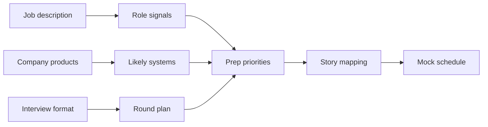

Company and role preparation turns generic interview skill into targeted signal. The goal is not to memorize corporate trivia; it is to predict what the loop will value, select the right stories, and tune technical practice toward the product and level being discussed.

## Research flow

Start with the job description, then read the company and product context, then map both to interview rounds. If you research in the opposite order, you collect interesting facts that do not change your preparation. The output should be a one page plan: likely rounds, top technical themes, story mapping, questions to ask, and gaps to drill.



| Research item | What to extract | Prep decision it changes |
|---|---|---|
| Job description | Required systems, languages, domain, level verbs | Which technical topics and project stories get priority |
| Product surface | User flows, data shape, scale hints, reliability needs | Likely system design prompts and deep dives |
| Engineering culture | Values, operating model, release style | Behavioral stories and questions to ask |
| Interview format | Round count, coding platform, design expectations | Time allocation and mock interview mix |
| Team mission | Current problems and stakeholders | How to position past impact and first ninety days |

> [!KEY]
> Good company prep produces decisions. If a note does not change a story, a design prompt, a question, or a study block, it is trivia.

## Reading the job description

A job description is a signal document. Ignore inflated adjective clusters and focus on verbs, nouns, and scope. Verbs reveal seniority expectations; nouns reveal technical surface area; repeated phrases reveal scoring priority.

| JD phrase | Real signal | Prep action |
|---|---|---|
| Own end to end services | Back-end ownership, operations, and reliability | Prepare on-call, observability, deployment, and incident stories |
| Design scalable systems | HLD will matter and trade-offs must be quantified | Mock two product-scale designs with estimates |
| Partner with product and design | Cross-functional communication is scored | Prepare influence and ambiguity stories |
| Mentor engineers | Level includes team leverage | Prepare coaching, code review, and design review examples |
| Strong data modeling | Database and consistency depth may appear | Review indexing, partitioning, schema evolution, and migration stories |
| Cloud native or Kubernetes | Platform and operations surface | Prepare deployment, resilience, and cost trade-offs |
| Startup pace | Ambiguity and pragmatic execution | Prepare examples of scoping, cutting, and shipping under uncertainty |

Read for level verbs. Junior descriptions say implement, fix, learn. Mid-level descriptions say build, maintain, collaborate. Senior descriptions say own, design, lead, mentor, operate. Staff descriptions say influence, set direction, align teams, define standards, and drive adoption. Your stories should use the same scope language only if you can defend the evidence.

> [!WARNING]
> Do not force every keyword onto your resume story. Interviewers notice keyword stuffing. Pick the three highest signal overlaps and go deep.

## Mapping product to likely design prompts

Product research helps predict design questions because interviewers often choose problems from the company domain or adjacent primitives. A payments company may ask ledgers, idempotency, fraud, or reconciliation. A collaboration product may ask realtime editing, notifications, permissions, and search. A gaming or media product may ask feeds, matchmaking, leaderboards, recommendations, or content moderation.

| Product clue | Likely HLD prompt | Likely LLD or machine coding prompt | Design trade-off to rehearse |
|---|---|---|---|
| High fan-out social product | News feed, notifications, activity stream | Subscription dispatcher or notification service | Fan-out on write versus fan-out on read |
| Marketplace or commerce | Payments, inventory, order workflow | Cart, coupon engine, rate limiter | Consistency, idempotency, and reconciliation |
| Developer platform | API gateway, CI system, permissions | RBAC model, job scheduler, log pipeline | Multi-tenant isolation and auditability |
| Enterprise SaaS | Document sharing, search, workflow | Access control, approval engine, file tree | Permissions, compliance, and migration safety |
| Consumer realtime app | Chat, presence, collaboration | Chat room, event bus, rate limiter | Latency, ordering, and offline behavior |
| Data heavy product | Analytics pipeline, metrics store | Aggregator, cache, deduplicator | Freshness versus cost and correctness |

This mapping is not for guessing the exact question. It gives you vocabulary and trade-offs. If the actual prompt is different, the same primitives still help: queues, caches, indexes, consistency, partition keys, retries, idempotency, access control, and observability.

## Company type and operating model

Company type changes the bar. Product companies often score product intuition and ownership. Enterprise and consulting environments often score stakeholder management, integration risk, and predictable delivery. Startups often score ambiguity, speed, and ability to cut scope without losing the core.

| Company type | What changes in the interview | What to emphasize | Risk if ignored |
|---|---|---|---|
| Large product company | Calibrated loops and level-specific rubrics | Scale, reliability, trade-offs, mentorship, ownership | Sounding like a feature implementer only |
| Enterprise SaaS | Customer commitments and compliance matter | Multi-tenant design, migration, audit, supportability | Ignoring permissions and operational controls |
| Consulting or services | Stakeholder clarity and delivery predictability | Requirement discovery, estimation, communication, documentation | Appearing technically strong but hard to place with clients |
| Startup | Ambiguity and speed are part of the job | Prioritization, product sense, pragmatic architecture | Over-engineering or demanding perfect requirements |
| Platform company | Internal customers and leverage are central | APIs, developer experience, adoption, backward compatibility | Treating internal tools as less rigorous products |

The same story can be angled differently. A migration story at a product company highlights availability and performance; at an enterprise company it highlights risk management and stakeholder communication; at a startup it highlights scope cuts and speed; at a platform company it highlights adoption and developer experience.

## Level and role bar

Level changes the expected answer even for the same prompt. A senior engineer should own ambiguous components, make trade-offs, and mentor. A staff engineer should shape direction across teams, set standards, and manage long-lived consequences. A tech lead manager or engineering manager blend requires people leadership evidence, not only technical choices.

| Target level | Technical bar | Leadership bar | Story evidence to prepare |
|---|---|---|---|
| Mid-level | Implements well-scoped systems with quality | Collaborates reliably within team | Feature delivery, debugging, code quality, learning |
| Senior | Owns services and designs under ambiguity | Mentors, leads projects, handles incidents | End-to-end project, trade-off decision, incident, mentoring |
| Staff | Influences architecture beyond one team | Aligns stakeholders and raises standards | Cross-team platform, migration strategy, standards adoption |
| Tech lead | Balances design, delivery, and review | Drives planning and unblocks engineers | Roadmap, design review, conflict, delivery risk |
| Engineering manager | Builds teams and execution systems | Hiring, coaching, performance, prioritization | People growth, planning, conflict, measurable team outcomes |

Use the level table to decide depth. For a senior role, know every important number in your projects. For a staff role, know why alternatives were rejected and how adoption happened. For a manager role, prepare how you make trade-offs through people and process, not just architecture.

> [!TIP]
> Translate company values into behaviors before matching stories. Ownership means a different thing in an incident, a roadmap conflict, and a mentoring conversation.

## Building the prep card

Your final artifact should be short enough to read before each round. It should include round format, likely technical themes, selected stories, questions, and gaps. Keep it factual and update it after recruiter calls.

```yaml
company_prep_card:
  role_signal: "Senior backend engineer for high scale product services"
  likely_rounds:
    - coding
    - system_design
    - low_level_design
    - behavioral
    - hiring_manager
  technical_themes:
    - distributed_systems
    - caching
    - database_partitioning
    - incident_response
  story_mapping:
    ownership: "service migration with measurable reliability impact"
    conflict: "architecture trade-off with product and platform constraints"
    mentoring: "design review process that improved junior engineer output"
  questions:
    engineer: "What reliability problem has been hardest to improve recently"
    manager: "What outcomes define success in the first six months"
  gaps_to_drill:
    - "mock one product-aligned system design"
    - "review role-specific database trade-offs"
```

| Prep artifact | Keep | Drop |
|---|---|---|
| Role summary | One sentence connecting your background to their need | Generic admiration of the company |
| Technical priority list | Three to five themes with drills | Every technology mentioned once |
| Story map | Four to six stories mapped to values and level | Ten stories with no evidence or metrics |
| Question bank | Three questions per interviewer type | Questions answered by public marketing copy |
| Risk list | Weak areas and mitigation plan | Anxiety notes that do not produce action |


After the prep card is written, rehearse it as a conversation. Spend five minutes explaining why the role fits your background, five minutes explaining the most likely product design problem, and five minutes answering why you want this team. If any answer depends on vague admiration, rewrite it into evidence. If any technical theme appears on the card but not in your practice calendar, schedule a drill or delete the theme.

| Final check | Good answer | Weak answer |
|---|---|---|
| Why this company | Connects product, role scope, and your prior impact | Says the company is exciting or innovative |
| Why this role | Names the team problem you want to solve | Repeats the job title |
| Why you | Maps two or three past outcomes to their needs | Lists technologies without outcomes |
| What to ask | Shows curiosity about real team constraints | Asks only generic culture questions |
| What to drill | Matches likely rounds and weak areas | Follows a generic study plan unchanged |

This last pass also protects against overfitting. You should be prepared for the company context, but your answers still need to work if the interviewer chooses a generic prompt. Anchor on transferable skills: requirements, trade-offs, operational risk, stakeholder alignment, and measurable impact.


Also prepare domain translations for your strongest projects. If your past work was in gaming but the company sells enterprise collaboration software, translate the experience into neutral engineering language: high fan-out events, identity, permissions, latency, cost, reliability, and migration risk. This helps interviewers see relevance without needing to know your previous domain. Avoid apologizing for domain differences; show the underlying system shape.

| Past experience | Translate to | Interview use |
|---|---|---|
| Game event pipeline | High volume event ingestion and processing | Analytics, notifications, experimentation, fraud signals |
| Internal developer tool | Platform product with internal customers | APIs, adoption, backward compatibility, support load |
| Service migration | Risk-managed production change | Reliability, rollout, observability, stakeholder alignment |
| Performance project | Bottleneck identification and measurable impact | System design deep dive and resume defense |

This translation step is often the difference between a good story and a role-aligned story. The facts stay true, but the framing matches what the interviewer is trying to assess.

Before the interview, reduce the card to three spoken priorities: the problem you believe the team is solving, the proof that you can help, and the question that will clarify success. If those three lines are strong, the rest of the research has done its job.

## Cheat sheet

- Read the job description for verbs, repeated nouns, and level scope.
- Convert product features into likely system design primitives and trade-offs.
- Match stories to behaviors behind company values, not to slogans.
- Adjust answers by company type: product, enterprise, consulting, startup, or platform.
- Prepare level-appropriate evidence: ownership for senior, cross-team adoption for staff.
- Build one prep card with likely rounds, themes, stories, questions, and gaps.
- Ask recruiter or scheduler for round format, duration, language, and tools.
- Rehearse the top two role-aligned stories out loud before the manager round.
- Use research to focus preparation, not to recite facts.

## Common mistakes

| Mistake | Fix |
|---|---|
| Memorizing company facts without applying them | Convert each signal into a story, question, or study block |
| Treating the JD as a checklist of keywords | Identify the three strongest role signals and prepare evidence |
| Preparing the same stories for every company | Re-angle stories toward product, enterprise, startup, or platform concerns |
| Ignoring level | Match senior, staff, lead, or manager expectations explicitly |
| Asking no format questions | Confirm duration, coding environment, round types, and expected language early |
| Copying company values into answers | Describe a concrete behavior that demonstrates the value |

## Summary

Company and role prep is targeted hypothesis building. Read the job description for true signal, map the product to design and implementation primitives, tune stories to the company operating model, and calibrate evidence to level. The best output is not a folder of research; it is a short prep card that changes how you spend practice time and how you answer in the room.

## Top Interview Questions

### Q1. How do I read a job description for real interview signal?

Read verbs, repeated nouns, and scope words. Verbs such as own, lead, design, influence, mentor, or operate indicate what the interviewer will expect you to prove. Repeated nouns such as distributed systems, data pipelines, payments, experimentation, or security indicate technical areas worth drilling. Scope words such as cross-functional, multi-team, platform, or customer-facing indicate leadership and ambiguity expectations. Ignore generic phrases like passionate or fast-paced unless they map to specific behaviors. Turn the JD into three priorities: technical topics to review, project stories to emphasize, and questions to ask about the team.

### Q2. How can product research help with system design preparation?

Product research reveals likely primitives, not exact questions. A collaboration product suggests realtime state, permissions, notifications, and conflict resolution. A marketplace suggests ordering, payments, inventory, fraud, and idempotency. A developer platform suggests APIs, rate limiting, multi-tenancy, audit logs, and backward compatibility. Pick two or three product-aligned system designs and practice the trade-offs. This lets you answer a different prompt with familiar building blocks. Do not overfit to one guessed question; prepare the underlying systems vocabulary so you can adapt quickly in the actual round.

### Q3. How should I match my stories to company values?

Translate each value into observable behavior first. Ownership might mean driving an incident to prevention, not just finishing assigned work. Customer obsession might mean choosing reliability over a flashy feature because customers needed trust. Frugality might mean reducing cloud cost without harming latency. Once translated, choose a story with context, decision, metric, and reflection. Do not repeat the value word as proof. Interviewers score evidence, not slogans. Prepare one primary story and one backup story for each important value so follow-ups do not trap you in a single rehearsed example.

### Q4. What changes between product companies and enterprise or consulting companies?

Product companies often emphasize user impact, scalability, reliability, and ownership of services over time. Enterprise and consulting environments add more weight to stakeholder management, requirements discovery, delivery predictability, integration risk, and compliance. The technical bar may be just as high, but the examples should highlight different risks. In an enterprise answer, mention permissions, auditability, migration windows, customer support, and documentation. In a product answer, mention product metrics, experimentation, performance, and operating cost. The same migration or platform story can work in both settings if angled toward the relevant business reality.

### Q5. What changes when interviewing with a startup?

Startup interviews often test ambiguity, prioritization, and practical judgment. You may get less formal process and broader questions. Emphasize examples where you scoped an MVP, made reversible decisions, cut non-essential work, and shipped while preserving future options. In design rounds, avoid heavy infrastructure unless scale requires it; explain what you would build now and what trigger would justify a more complex design later. In behavioral rounds, show comfort with unclear ownership and changing priorities. The risk is sounding dependent on mature processes or proposing architecture that a small team cannot operate.

### Q6. How does target level change my preparation?

For mid-level roles, prepare evidence that you implement reliably, test well, and learn quickly. For senior roles, prepare ownership stories with ambiguity, trade-offs, production incidents, mentoring, and measurable impact. For staff roles, prepare cross-team influence, platform adoption, standards, migrations, and long-term consequences. For manager roles, prepare coaching, hiring, planning, prioritization, conflict, and team health examples. The same technical project can be told at different levels, but the scope must be credible. Do not claim staff-level influence if the evidence is limited to a single component you implemented alone.

### Q7. What should I ask the recruiter before the loop?

Ask for the round types, duration, coding language or platform, whether design rounds are HLD or LLD, whether machine coding requires a runnable project, and what level the process is calibrating for. Also confirm timezone, interview format, expected video tools, and whether there will be a hiring manager or bar raiser round. These questions are not annoying; they help you prepare correctly. Avoid asking for exact questions or confidential rubric details. A recruiter may not know every answer, but even partial information lets you allocate practice time between coding, design, leadership, and domain review.

### Q8. How do I build a useful company prep card?

Keep it to one page. Include the role signal, likely rounds, top technical themes, product-aligned design prompts, story mapping, interviewer-specific questions, and risk areas to drill. Each line should change an action. For example, if the product is a realtime collaboration tool, schedule a mock on notifications or presence. If the level is staff, add a cross-team adoption story. If the company values ownership, choose an incident or migration story with a metric. Review the card before each round and update it after recruiter or interviewer signals.

### Q9. What if my background does not match every required technology?

Do not pretend full expertise. Separate transferable concepts from tool-specific gaps. If you know distributed systems but not their exact cloud stack, say you have solved similar problems with different tooling and explain the underlying trade-off. Then show a plan to ramp up: documentation, prototype, pairing, or migration from a known equivalent. Interviewers often accept missing syntax if the design judgment is strong. They do not accept hand-waving around core responsibilities. If the missing technology is central to the role, prepare the fundamentals and one concrete comparison before the interview.

### Q10. How do I avoid over-researching?

Set a research time box and require every note to become an action. A useful note maps to a design prompt, a story, a question, or a study block. If you have product facts but no changed preparation, stop reading and start practicing. For most roles, one to two hours of focused research is enough before deeper mocks. Spend the rest of the time rehearsing role-aligned stories, solving likely technical drills, and preparing questions. Research should sharpen performance, not become a comforting substitute for speaking, coding, or designing under a clock.
