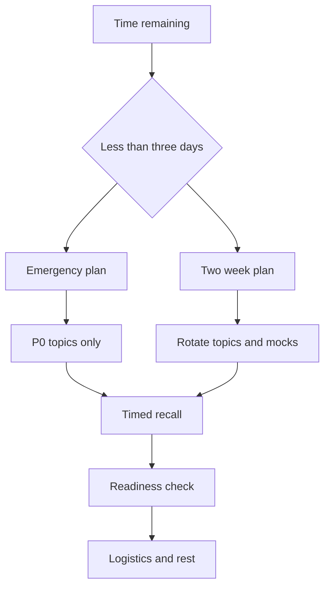

Late-stage revision is a prioritization problem, not a reading problem. With two days left, protect high-yield rounds and stop learning new theory; with two weeks left, rotate technical depth, mocks, recall, and logistics until weaknesses are visible and shrinking.

## Triage before planning

Start by identifying the loop you actually face. A senior backend loop usually weights system design, low level design or machine coding, language depth, debugging, behavioral stories, and one or two coding rounds. If time is short, cut breadth before cutting mock practice. Speaking and solving under a clock expose gaps that reading hides.



| Priority | Keep if time is scarce | Cut or reduce first | Why |
|---|---|---|---|
| P0 | System design framework, one deep HLD mock, LLD or machine coding, behavioral stories, resume deep dive | New niche topics outside the target role | These rounds often decide senior loops |
| P1 | DSA patterns, language internals, debugging drills, database and caching trade-offs | Random problem grinding | Useful if tied to expected rounds |
| P2 | Frontend details, rare OS trivia, obscure cloud limits, advanced AI theory | Anything not in the loop or job description | Low probability unless the role demands it |
| Logistics | Calendar, tools, internet, environment, questions to ask | Cosmetic note cleanup | Process failure can waste strong preparation |

> [!KEY]
> The final stretch is for recall and performance, not coverage. If you cannot explain it without notes, reading it again is not enough.

## Two day emergency calendar

The two day plan assumes you can study about eight focused hours per day. If you have less time, keep the same ordering and shorten blocks; do not skip the mock blocks. Each block must produce an artifact: a spoken answer, a sketch, a solved problem, a story, or a checklist.

| Day | Time | Focus | Output |
|---|---|---|---|
| Day 1 | 08:00 to 09:00 | System design framework and estimation | Write requirements, estimates, API, data, architecture, deep dive from memory |
| Day 1 | 09:00 to 11:00 | Three HLD case sketches | Draw three architectures in 20 minutes each and name the bottleneck |
| Day 1 | 11:00 to 12:00 | Language and platform gotchas | Recite async, memory, concurrency, dependency injection, and error handling pitfalls |
| Day 1 | 12:00 to 12:30 | Break | No screen and no new input |
| Day 1 | 12:30 to 14:00 | Databases, caching, and distributed patterns | Explain partition keys, indexes, cache invalidation, queues, and idempotency aloud |
| Day 1 | 14:00 to 15:00 | Behavioral stories | Rehearse ownership, conflict, failure, mentoring, and ambiguity at two minutes each |
| Day 1 | 15:00 to 16:00 | Resume deep dive | Defend metrics, architecture, alternatives, and what you would change |
| Day 1 | 16:00 to 17:00 | DSA pattern recall | Write templates for binary search, sliding window, BFS, DFS, topological sort, Dijkstra |
| Day 1 | 17:00 to 18:00 | Timed HLD self-mock | Record yourself and score against requirements, scale, trade-offs, and failure modes |

| Day | Time | Focus | Output |
|---|---|---|---|
| Day 2 | 08:00 to 09:00 | LLD framework and patterns | Sketch entities, interfaces, Strategy, State, Observer, Repository from memory |
| Day 2 | 09:00 to 10:30 | Machine coding drill | Build cache, rate limiter, or parking lot core and run a demo |
| Day 2 | 10:30 to 12:00 | Five DSA mediums or redo misses | Solve or re-solve only high-signal patterns and log mistakes |
| Day 2 | 12:00 to 12:30 | Break | Reset attention |
| Day 2 | 12:30 to 13:30 | Debugging or production triage | Walk through reproduce, stack, hypothesis, bisect, fix, prevent |
| Day 2 | 13:30 to 14:30 | Behavioral mock | Answer six questions on video and cut rambling |
| Day 2 | 14:30 to 15:30 | Second HLD or role-specific design | Practice the product-aligned system most likely for this company |
| Day 2 | 15:30 to 16:00 | Night-before checklist | Tools, questions, calendar, stories, sleep plan |

After 16:00 on the second day, stop heavy learning. Light review is fine, but a new hard topic can create fresh confusion without enough time for consolidation.

> [!WARNING]
> Grinding brand new problems the night before is usually negative value. Redo the problems, designs, and stories you already missed.

## Two week calendar

Two weeks gives enough time for spaced repetition and multiple mocks. The rhythm should alternate learning, active recall, and performance. Every third day should revisit material from earlier days without looking first.

| Day | Primary focus | Secondary focus | Required output |
|---|---|---|---|
| 1 | Loop plan and diagnostic | Job description and role mapping | Weakness list and mock schedule |
| 2 | System design framework | Estimation and API design | One complete design from memory |
| 3 | HLD case studies | Recall day 2 | Two sketches plus a trade-off table |
| 4 | Language internals | Debugging pitfalls | Ten gotchas explained aloud |
| 5 | Databases and caching | Recall days 2 to 4 | Partition and cache design drill |
| 6 | LLD and design patterns | Machine coding setup | Two class models and one runnable core |
| 7 | DSA pattern day | Behavioral story draft | Six templates written cold |
| 8 | Distributed systems | Messaging and idempotency | One event-driven design deep dive |
| 9 | Security and cloud basics | Recall day 5 | Threat model and auth explanation |
| 10 | Behavioral and resume | Hiring manager questions | Six polished stories with metrics |
| 11 | Machine coding | Debugging repo or scenario | Runnable demo and proof log |
| 12 | System design mock | Review weak areas | Recorded mock and scorecard |
| 13 | Full loop simulation | Coding plus behavioral | Timed practice under interview rhythm |
| 14 | Light recall and logistics | Sleep and setup | Checklist complete and no new topics |

Daily DSA should be small but consistent: one or two medium problems, favoring missed patterns over novelty. Daily behavioral should be spoken, not only written. Daily system design should include at least one explicit trade-off, not just architecture boxes.

## Spaced repetition and readiness

Spaced repetition works only if the first step is recall. Close the source, write or say what you remember, then compare. Re-reading before recall feels productive but hides weak memory.

| Item type | First review | Second review | Third review | Ready signal |
|---|---:|---:|---:|---|
| DSA pattern | Same day | Day 3 | Day 7 | Template and invariant written cold |
| HLD framework | Same day | Day 2 | Day 6 | Design flow spoken in order under five minutes |
| LLD pattern | Same day | Day 4 | Day 9 | Pattern chosen with a concrete extension reason |
| Behavioral story | Same day | Day 3 | Day 10 | Two minute answer with metric and reflection |
| Language gotcha | Same day | Day 5 | Day 12 | Definition, mechanism, and pitfall explained without notes |
| Resume project | Same day | Day 4 | Day 11 | Architecture, numbers, alternatives, and regrets defended |

```text
Daily review queue
1. Recall one framework without notes
2. Redo one missed problem or design decision
3. Say one story out loud in two minutes
4. Update the miss log with root cause
5. Schedule the next review date
```

A good readiness check is the two minute rule. If you can explain a topic clearly in two minutes, answer one follow-up, and name a trade-off or edge case, it is interview-ready. If you need to re-open notes for the first sentence, it needs active recall, not more highlighting.

## Night before and morning of

The night before is logistics, confidence, and light recall. Read compact cheatsheets, not full chapters. Rehearse the top stories and the first five minutes of the round. Confirm the environment: editor, compiler, whiteboard, audio, camera, charger, internet backup, calendar, and time zone.

| Time | Action | Stop condition |
|---|---|---|
| Night before, early evening | Review one page cheatsheets and top story metrics | You can say the framework and three stories without notes |
| Night before, late evening | Prepare tools and questions for interviewers | Calendar, editor, whiteboard, audio, camera, and backup internet checked |
| Night before, final hour | Light recall only | No new topics and no problem grinding |
| Morning, 60 min before | Eat, hydrate, dress, reset workspace | Body and environment are stable |
| Morning, 15 min before | Read your prep card and breathe | Join calmly with tools open |
| During breaks | Write concerns and reset | No post-round spiraling into new material |

> [!TIP]
> If anxiety pushes you to keep studying, switch to spoken recall. It reveals readiness without adding new noise.


When you revise after a mock, separate content gaps from performance gaps. A content gap means you did not know the idea. A performance gap means you knew it but could not retrieve, organize, or communicate it under time. The fixes are different: content gaps need focused study, while performance gaps need timed repetition.

| Gap type | Symptom | Best fix |
|---|---|---|
| Knowledge | Cannot define the concept or choose an approach | Read one focused source and make recall cards |
| Recognition | Knows the pattern after seeing the solution | Drill triggers and classify similar prompts |
| Communication | Correct idea but rambling or unclear | Record two minute answers and cut filler |
| Timing | Spends too long on setup or polish | Use phase budgets and stop conditions |
| Confidence | Changes answers after minor pushback | Practice defending assumptions and accepting constraints |

Use the final readiness decision honestly. If two or three P0 areas remain weak, do not add P2 breadth. Make those weak areas safer: prepare a baseline answer, one example, and one fallback phrase for uncertainty. This is not lowering the bar; it is reducing avoidable failure modes.


The schedule should remain flexible, but the replacement rule should be strict. Replace a block only with something of equal or higher interview value. A system design mock can replace a low-yield reading block; a random article should not replace a timed design. If work or life removes study time, keep the next recall block and shorten passive review. Recall is where the plan proves whether it is working.

| If you lose time | Keep | Shorten |
|---|---|---|
| Lose one hour | Current P0 recall block | Background reading |
| Lose half a day | One mock and story rehearsal | P1 breadth and optional drills |
| Lose a full day | System design, behavioral, logistics | New topics and low-probability areas |
| Feel exhausted | Sleep and light spoken recall | Late-night grinding |

Planning is not valuable because it predicts every hour perfectly. It is valuable because it gives you a default decision when stress would otherwise choose novelty, panic, or avoidance.

## Cheat sheet

- With two days left, study P0 only and keep mocks in the schedule.
- Cut low-probability topics before cutting behavioral stories or system design practice.
- Every study block needs an output: code, diagram, spoken answer, checklist, or miss log.
- Use spaced repetition as recall first, comparison second, correction third.
- Re-solve missed problems and designs; do not chase novelty near the interview.
- Run at least one timed system design and one behavioral mock in the final week.
- Use the two minute rule to decide readiness.
- Stop heavy learning the night before and protect sleep.
- Morning review should prime frameworks and confidence, not teach new material.

## Common mistakes

| Mistake | Fix |
|---|---|
| Trying to cover every topic equally | Prioritize by actual loop weight and role relevance |
| Reading for hours without recall | Close the notes and reconstruct the answer first |
| Skipping mocks because they feel uncomfortable | Treat discomfort as the point of the exercise |
| Solving only new DSA problems | Redo misses and capture the root cause |
| Learning new material the night before | Switch to cheatsheets, stories, tools, and sleep |
| Ignoring logistics | Test the exact editor, compiler, camera, audio, and whiteboard setup |

## Summary

A good revision plan is a calendar of evidence, not a wish list of chapters. The two day plan protects the rounds most likely to decide a senior loop, while the two week plan creates recall cycles, mocks, and targeted correction. Cut aggressively, rehearse aloud, log misses, and let the final night be light. Readiness means you can perform under a clock, not that you have recently looked at every page.

## Top Interview Questions

### Q1. What should I prioritize if I have only two days before a senior backend interview?

Prioritize the rounds most likely to decide the loop: system design, low level design or machine coding, behavioral and resume stories, language or platform gotchas, and a small set of DSA patterns. Do not attempt broad coverage. Run one timed system design mock, one machine coding or LLD drill, one behavioral mock, and one focused DSA recall session. Review databases, caching, distributed systems, and debugging through trade-offs rather than full chapters. The goal is to become fluent on high-probability signals and avoid preventable process failures, not to learn everything you missed in the previous months.

### Q2. What should I cut from revision when time is scarce?

Cut low-probability and low-transfer topics first. Examples include obscure platform limits, rare OS trivia, broad frontend theory for a backend role, advanced AI internals if the job does not mention it, and new hard problems from unfamiliar categories. Also cut beautifying notes, reorganizing folders, and passive rereading. Keep active recall, mocks, role-aligned stories, and fundamentals that transfer across rounds. If a topic is in the job description but weak for you, prepare a clear baseline explanation and one trade-off rather than attempting mastery overnight. Strategic partial readiness is better than scattered shallow coverage.

### Q3. How should spaced repetition work in the final two weeks?

Use recall-first intervals. Learn or review a topic, then revisit it the same day without notes, again around day three, around day seven, and near day fourteen. Each revisit should require production: write a template, explain a trade-off, redraw a design, or answer a follow-up. If you fail recall, log the miss and shorten the interval. Do not simply reread the page at each interval. Spaced repetition works because forgetting exposes the weak point. The final two weeks should feel like repeated retrieval under increasing pressure, not like a long reading queue.

### Q4. How do I know whether I am ready for a topic?

Use the two minute rule. You are ready when you can explain the concept in two minutes without notes, answer one natural follow-up, name a trade-off or failure mode, and connect it to a concrete example. For DSA, you should write the template and invariant cold. For system design, you should move from requirements to bottleneck without drifting. For behavioral, you should finish a story in about two minutes with metric and reflection. If the first sentence requires notes, the topic is not ready. It needs active recall and practice, not more highlighting.

### Q5. Is it better to solve new problems or redo old misses near the interview?

Redo old misses near the interview. A problem you failed twice is more valuable than ten you solved easily because it reveals a repeatable error: pattern recognition, invariant choice, implementation detail, or test discipline. New problems are useful earlier in preparation when building coverage. In the last days, they can create confusion and fragment confidence. Redo missed problems from memory, write the trigger that should have identified the pattern, and record the exact mistake. If you have spare time after misses, solve one or two fresh problems only from high-probability categories.

### Q6. How many mock interviews should I run in a two week plan?

Aim for at least three meaningful mocks: one system design, one behavioral or hiring manager, and one coding, LLD, or machine coding round matching the loop. If possible, add a second system design mock because senior roles often weight it heavily. A mock is meaningful only if timed, spoken aloud, and reviewed with a scorecard. Solo mocks count if you record yourself and critique structure, timing, and clarity. Do not stack mocks without correction. The value comes from feedback, targeted revision, and a second attempt where the weak area improves.

### Q7. What should I do the night before the interview?

Switch to light consolidation. Review compact cheatsheets, rehearse three to five stories aloud, confirm project metrics, prepare questions for each interviewer type, and test logistics. Avoid new hard material, late-night problem grinding, or major environment changes. Set up the exact editor, compiler, whiteboard, audio, camera, charger, and backup internet you will use. Confirm calendar timezone and join link. Sleep matters because interviews are live reasoning tasks. The night before should reduce uncertainty and prime recall, not maximize the number of pages touched.

### Q8. What should I do the morning of the interview?

Keep it short and calming. Eat, hydrate, prepare your workspace, silence distractions, and open the tools you need. Fifteen minutes before the round, review the round-specific playbook, your prep card, and two or three story metrics. Do not start a new problem or read a dense chapter. If nervous, do spoken recall: requirements to architecture, brute force to optimized, or one STAR story. Join early enough to handle audio issues. The goal is to enter with a clear process and stable energy, not with one more fact in short-term memory.

### Q9. How should I use a miss log during revision?

Record misses by root cause, not by shame. For each failed problem, design, or story, write the prompt, your mistake, the correct trigger, and the next review date. Categories might include missed invariant, wrong data structure, no scale estimate, weak trade-off, rambling story, or forgotten metric. Review the log daily in the final week and redo the highest frequency errors. This turns practice into targeted correction. Without a miss log, candidates often repeat the same failure while believing they are improving because they completed more practice items.

### Q10. What if my two week plan falls behind?

Re-plan by priority, not guilt. Keep the highest-weight rounds, scheduled mocks, and active recall cycles. Drop low-probability breadth, note cleanup, and optional deep dives. Compress related topics: databases plus caching, distributed systems plus messaging, behavioral plus resume. Preserve sleep and final logistics because fatigue can erase preparation. If a major weakness remains, prepare a safe baseline answer and a learning plan rather than hiding it. Falling behind is common; the senior move is to make an explicit cut, protect the strongest signals, and execute the remaining plan well.
