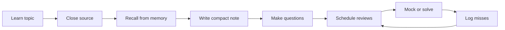

A durable study system makes future revision cheaper. The system should help you recall under pressure, find related ideas quickly, and measure whether practice is improving interview performance instead of merely increasing the number of pages read.

## Principles that make notes useful

Interview notes should be optimized for recall speed, not beauty. A polished page that you cannot reconstruct under a timer is less useful than a short, clear note that forces you to answer questions. Use one consistent structure across DSA, HLD, LLD, databases, operating systems, networking, languages, and behavioral stories so your brain does not spend energy decoding formats.



| Principle | Do | Avoid |
|---|---|---|
| Active recall | Close the source and write what you remember | Copying paragraphs while reading |
| Spaced repetition | Revisit on planned intervals with a question | Waiting until the night before |
| Pattern notes | Summarize reusable triggers and templates | One page per solved DSA problem |
| Diagram first HLD | Draw architecture, data, and bottlenecks | Five pages of prose before boxes |
| Code first LLD | Capture entities, interfaces, classes, and methods | Pattern names with no runnable behavior |
| Miss logging | Track root causes and repeat failures | Counting only completed problems |

> [!KEY]
> The test of a note is whether it helps you answer aloud in five minutes. If it cannot do that, it is storage, not revision.

## The three layer model

Use three layers for each important topic. The full note is detailed enough to relearn. The cheatsheet is one page and is meant for the week before the interview. Flashcards are small prompts for facts, traps, templates, and trade-offs. This prevents rereading long notes when the real need is retrieval practice.

| Layer | Purpose | Size | Example content |
|---|---|---:|---|
| Full note | Learn or relearn the topic | Several sections | Why it exists, mechanism, diagram, examples, trade-offs |
| Cheatsheet | Fast revision | One page | Triggers, formulas, pitfalls, decision table, common questions |
| Flashcards | Memory retrieval | One prompt each | Definitions, gotchas, comparison questions, template steps |
| Miss log | Targeted correction | One row per miss | Prompt, mistake, root cause, next review date |
| Cross reference | Find connected topics | Index entry | Owner page and related subjects |

A consistent note template keeps creation fast. It also makes your notes easier to scan during final revision.

```yaml
topic_note:
  tldr: "Two to five lines that define the idea"
  why: "The problem this concept solves"
  core_concepts:
    - "Key moving part"
    - "Invariant or trade-off"
  how_it_works: "Short explanation plus a diagram"
  example: "Small concrete case or code sketch"
  interview_questions:
    - "Common definition or trade-off question"
    - "Scenario or debugging follow-up"
  common_mistakes:
    - "Failure mode to avoid"
  quick_revision:
    - "Five to ten bullets worth memorizing"
  related:
    - "Linked concept or owner topic"
```

> [!TIP]
> Make the first version plain. Time spent choosing colors or perfecting formatting is usually stolen from recall, mocks, and missed-problem repair.

## Active recall workflow

The workflow is learn, close, recall, compress, question. While learning, capture only important concepts, examples, diagrams, and interview questions. Do not write detailed notes while the source is open. After the first pass, close the source and answer: what do I remember, what problem does this solve, how does it work, when would I use it, what goes wrong, and what would an interviewer ask?

| Step | Action | Output |
|---|---|---|
| Learn | Read, watch, or solve without heavy transcription | A few rough anchors |
| Close source | Remove the material from view | Honest memory check |
| Recall | Write or speak the topic from memory | Gaps become visible |
| Compress | Turn recall into a five minute summary | Revision-ready note |
| Question | Convert statements into prompts | Flashcards and mock questions |
| Review | Compare with source and correct | Updated note and miss log |

A good summary has definition, why, how, example, trade-offs, questions, mistakes, and related topics. For DSA, prefer pattern notes: trigger, invariant, template, problems, mistakes, and quick revision. For HLD, prefer diagram, requirements, APIs, data model, scaling, bottlenecks, and trade-offs. For LLD, prefer requirements, entities, relationships, interfaces, classes, patterns, concurrency, and code.

> [!WARNING]
> Rereading creates familiarity, not readiness. If you recognize the answer only when you see it, you have not learned it for an interview.

## Flashcards worth making

Not every sentence deserves a flashcard. Make cards for things you must retrieve quickly: definitions, comparisons, invariants, sequence steps, formulas, numeric limits, traps, and story metrics. Avoid cards with vague prompts like caching. Use prompts that force a useful answer.

| Weak card | Strong card | Why it is stronger |
|---|---|---|
| Process vs thread | Why are threads cheaper than processes, and what isolation is lost | Requires mechanism and trade-off |
| Caching | When choose cache-aside over write-through | Tests decision criteria |
| Binary search | Write half-open binary search on a monotone predicate | Forces template recall |
| CAP theorem | What does partition tolerance force you to choose during a network split | Prevents slogan answers |
| STAR story | What metric proves the migration mattered | Anchors evidence |
| Rate limiter | Token bucket versus fixed window under burst traffic | Tests production trade-off |

Spaced intervals do not need a complicated tool. Use day 0, day 1 or 2, day 4, day 7, and day 14 for high-yield cards. Shorten the interval when you fail. Lengthen it when recall is easy and complete. Numbers worth memorizing, such as latency ladder, availability nines, storage math, and personal resume metrics, should stay in flashcards because they are easy to forget under stress.

## Problem log and correction loop

A problem log is more useful than a solved count. Count tells you volume; the log tells you why mistakes repeat. Record only enough detail to drive the next review.

| Field | Example | Why it matters |
|---|---|---|
| Prompt | Longest substring without repeating characters | Identifies the problem family |
| Expected trigger | Variable sliding window with frequency map | Builds pattern recognition |
| Mistake | Updated answer before shrinking invalid window | Captures the failure mechanism |
| Root cause | Did not state invariant before coding | Points to process correction |
| Next action | Redo in two days and say invariant first | Creates a review plan |
| Status | Failed twice, high priority | Prevents easy wins from hiding hard gaps |

A failed problem is not just a wrong answer. It may be a recognition miss, a template gap, an implementation bug, a test discipline issue, or a communication problem. Tag the miss accordingly. A problem failed twice is worth more revision time than ten solved on the first try because it exposes a durable weakness.

For system design, log missing non-functional requirements, weak estimates, unclear APIs, data model errors, ignored failure modes, and shallow deep dives. For behavioral, log rambling, missing metric, unclear personal action, weak conflict, or no reflection. The same correction loop works across all tracks.

## Cross reference index and progress metrics

A cross-reference index prevents duplicated notes and helps related concepts reinforce each other. Each concept should have one owner note and many references. For example, idempotency may be owned by distributed systems but referenced by payments, messaging, APIs, retries, and incident response. This keeps the explanation consistent while making it easy to find.

| Index entry | Owner note | Related references | Review use |
|---|---|---|---|
| Idempotency | Distributed systems patterns | Payments, queues, retries, APIs | Ask one scenario question across contexts |
| Partition key | Databases | Cosmos DB, sharding, multi-tenancy | Practice data modeling prompts |
| Backpressure | Messaging | streaming, rate limiting, incidents | Explain failure prevention |
| Strategy pattern | LLD patterns | rate limiter, cache, notifications | Choose pattern in machine coding |
| STAR metrics | Behavioral stories | resume, manager round, bar raiser | Recall quantified impact quickly |

Progress metrics should measure capability, not vanity. Track topics you can explain in two minutes, DSA patterns written cold, system design mocks completed and scored, machine coding demos that run, behavioral stories under two minutes, and repeated misses closed. If a metric does not predict interview performance, drop it.

| Metric | Good target | Warning sign |
|---|---:|---|
| DSA pattern templates written cold | 15 to 25 core templates | High solved count but template hesitation |
| HLD mocks scored | 3 to 6 timed mocks | Many case studies read, none spoken |
| Machine coding demos | 3 to 5 runnable cores | Class diagrams only |
| Behavioral stories | 8 to 10 polished stories | Stories exceed four minutes or lack metrics |
| Miss closure rate | Most repeated misses resolved within a week | Same root cause appears three times |


Keep the system lightweight enough that it survives busy weeks. A durable system has a daily loop, a weekly review, and a final revision mode. The daily loop captures misses. The weekly review selects the next few drills. The final mode hides most notes and shows only cheatsheets, flashcards, stories, and the miss log.

| Cadence | Action | Output |
|---|---|---|
| Daily | Recall one topic, solve or redo one item, update miss log | Next review dates and one corrected weakness |
| Twice weekly | Run a timed design, coding, or behavioral drill | Scorecard and targeted fixes |
| Weekly | Review metrics and choose next priorities | Short plan based on evidence, not mood |
| Final week | Use cheatsheets, flashcards, mocks, and logistics | Confidence with less cognitive clutter |

Tool choice matters less than friction. A notebook, plain markdown folder, flashcard app, spreadsheet, or notes app can all work. Prefer the tool you will actually open during a tired evening. If maintaining the system takes more time than using it, simplify immediately.


A good system also defines deletion rules. Remove stale flashcards that are too easy, merge duplicate concept notes, and archive logs once the root cause has not appeared for several weeks. A study system can become heavy if it only accumulates. Pruning keeps the final review set small enough to trust.

| Item | Keep when | Delete or archive when |
|---|---|---|
| Flashcard | It tests a fact, trap, or trade-off you still miss | It has been effortless for several cycles |
| Full note | It owns a concept or diagram you reuse | It duplicates a clearer owner note |
| Miss log row | The root cause is still active | The same pattern has passed multiple timed drills |
| Cheatsheet bullet | It changes interview behavior | It is obvious or decorative |

The system should create confidence, not guilt. If opening your notes makes the workload feel infinite, the system is presenting too much. Final revision should show the next useful action, not every possible action.

Keep the system personal but auditable. At any point you should be able to say what you studied, what you missed, what changed, and what comes next. That trace is what turns scattered preparation into a deliberate improvement loop.

## Cheat sheet

- Optimize notes for five minute recall, not visual polish.
- Use one template: definition, why, how, example, trade-offs, questions, mistakes, related.
- Build three layers: full note, cheatsheet, flashcards.
- Close the source before writing the real summary.
- Turn statements into questions that require mechanisms and trade-offs.
- Track misses by root cause and next action.
- Keep one owner note per concept and cross-reference everywhere else.
- Measure progress by cold recall, timed mocks, runnable demos, and closed misses.
- Spend most time learning and practicing, less time note-taking.

## Common mistakes

| Mistake | Fix |
|---|---|
| Copying long notes while learning | Capture anchors, then recall and rewrite from memory |
| Making flashcards too broad | Ask specific mechanism, comparison, or scenario questions |
| Tracking only solved problem count | Track root causes, repeated misses, and next review dates |
| Creating duplicate notes for the same concept | Pick one owner note and cross-reference it |
| Waiting until final week to review | Schedule day 0, day 2, day 4, day 7, and day 14 recall |
| Beautifying notes instead of practicing | Time-box note cleanup and run mocks or drills |

## Summary

A study system that sticks is built around retrieval. Learn lightly, recall aggressively, compress into reusable structures, and schedule reviews before forgetting wins. Flashcards preserve small facts and traps, problem logs repair repeated failures, and cross-reference indexes keep the knowledge base coherent. The best system is the one that makes interview performance measurable and repeatable.

## Top Interview Questions

### Q1. Why is active recall better than rereading for interview preparation?

Active recall forces you to produce the answer without cues, which is exactly what interviews require. Rereading makes material feel familiar because the answer is visible, but it does not prove you can retrieve the structure under pressure. A good workflow is to read once, close the source, write or speak what you remember, then compare with the source and correct gaps. This exposes weak definitions, missing trade-offs, and false confidence early. In final revision, active recall also saves time because you spend effort only where memory fails instead of treating every page as equally weak.

### Q2. What should a good topic note contain?

A good topic note should answer definition, why it exists, how it works, a small example, important trade-offs, common mistakes, interview questions, quick revision bullets, and related topics. For system design, include a diagram, requirements, APIs, data model, bottlenecks, and failure modes. For DSA, include trigger, invariant, template, complexity, representative problems, and mistakes. For LLD, include entities, relationships, interfaces, patterns, concurrency, and code. The note should be short enough to revise quickly but complete enough to rebuild the answer. Consistency matters more than decorative formatting.

### Q3. What flashcards are worth making?

Make flashcards for information that must be retrieved quickly and exactly: definitions, comparison criteria, algorithm templates, invariants, formulas, latency or availability numbers, language gotchas, failure modes, and resume metrics. Avoid broad cards that invite vague answers. A card asking what is caching is weak; a card asking when cache-aside beats write-through forces a real decision. Scenario cards are especially valuable for senior interviews because they combine facts with judgment. If a card does not help answer a likely interview question or prevent a known miss, do not make it.

### Q4. How should I maintain a DSA problem log?

Record the problem, pattern trigger, intended invariant, mistake, root cause, next action, and review date. Keep the entry short. The goal is not to document the full solution; it is to prevent the same miss from recurring. Categorize mistakes as recognition, template, implementation, edge case, complexity, or communication. Review the log before solving new problems and redo the highest priority misses. If a problem failed twice, treat it as a strong signal about a weak pattern. This is more useful than celebrating a high solved count with no correction loop.

### Q5. How do I use a cross-reference index without duplicating notes?

Assign each concept one owner note where the full explanation lives. Other notes should reference the concept briefly and point back to the owner in your index. For example, idempotency can be owned by distributed systems and referenced from payments, retries, messaging, and APIs. This prevents four slightly different explanations from drifting. The index should include owner, related topics, and review prompts. During revision, use it to ask cross-context questions: how does idempotency affect payments, queues, and REST APIs. Cross-reference indexes are valuable because interviews rarely keep topics isolated.

### Q6. What progress metrics actually predict interview readiness?

Useful metrics measure performance under retrieval or timing. Track how many core DSA templates you can write cold, how many HLD mocks you completed and scored, how many machine coding cores run, how many behavioral stories fit within two minutes, how many repeated misses are closed, and which topics you can explain with follow-ups. Less useful metrics include pages read, notes created, videos watched, and raw hours studied. Those may correlate with effort but not readiness. If a metric does not change what you practice next, replace it with a more actionable one.

### Q7. How often should I review a topic?

Review high-yield topics on a simple spaced schedule: same day, two days later, four to seven days later, and again around two weeks. Adjust based on recall. If you fail a card, template, or explanation, shorten the interval and record the miss. If recall is easy and complete, lengthen it. Final week reviews should be shorter and more performance-oriented: say the answer, write the template, redraw the architecture, or run the demo. The exact interval matters less than the rule that every review starts with recall before looking at the note.

### Q8. How much time should I spend taking notes versus practicing?

A practical ratio is about seventy percent learning and problem solving, twenty percent revision, and ten percent note maintenance. Early in preparation, notes help create structure, but they should not become the main activity. If you spend more time organizing notes than solving, mocking, or recalling, the system is too heavy. Time-box note updates after each study block: capture the trigger, mistake, and key takeaway, then move on. The purpose of notes is to accelerate future performance. When note-taking delays performance practice, it is no longer serving the interview goal.

### Q9. How do I make behavioral stories part of the same study system?

Treat each story like a technical topic. Create a full version with context, actions, trade-offs, result, metric, and reflection. Create a cheatsheet version with prompt mappings and numbers. Create flashcards for metrics, conflict points, alternatives, and lessons learned. Log misses from mocks such as rambling, unclear personal ownership, missing metric, weak reflection, or no follow-up answer. Cross-reference stories to values, resume bullets, and interviewer types. This makes behavioral prep concrete. Senior behavioral rounds are scored on evidence and judgment, so stories deserve the same retrieval practice as algorithms and designs.

### Q10. What is the simplest system I can start using today?

Start with three files or sections: quick notes, flashcards, and a miss log. For each topic, write a five minute summary after closing the source. Convert the top facts and traps into flashcards. For every failed problem, mock, or story, add one miss log row with root cause and next review date. Review the flashcards and miss log on a simple day 0, day 2, day 7 rhythm. Add a cross-reference index later when duplication becomes painful. A simple system used consistently is better than a perfect knowledge base that takes too long to maintain.
