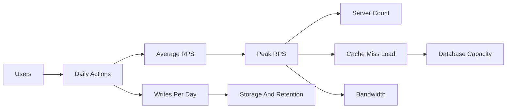

Use this as the last pass before an estimation or high-level design round. The goal is not exact vendor benchmarking; it is credible order-of-magnitude reasoning with enough numbers to defend server count, storage, bandwidth, and reliability choices.

## Latency Anchors

| Operation | Typical latency | Say in an interview |
|---|---:|---|
| L1 cache read | 0.5 ns | CPU local, effectively free compared with I/O |
| L2 cache read | 5 ns | Still inside the processor path |
| RAM read | 100 ns | About 200 times slower than L1 |
| SSD random read | 50 to 150 us | NVMe is usually under 0.2 ms |
| HDD seek plus read | 5 to 10 ms | Avoid random disk seeks on hot paths |
| Redis GET same region | 0.5 to 1 ms | Great for hot reads and counters |
| Indexed database read same region | 1 to 5 ms | Warm index, simple point lookup |
| Complex database query | 10 to 100 ms | Joins, fan-out, cold cache, cross partition |
| Internal HTTP call same region | 1 to 10 ms | Budget every hop in a chain |
| Cross-region round trip | 70 to 150 ms | Dominates user-visible paths |
| Queue produce to consume | 5 to 50 ms | Depends on batching and broker tier |
| DNS uncached lookup | 20 to 120 ms | Hide with caching and connection reuse |

> [!KEY]
> The mental ladder is memory in nanoseconds, SSD in microseconds, cache and indexed database in milliseconds, cross-region network around one hundred milliseconds.

Read these as p50-ish anchors, not contractual guarantees. For design interviews, state both the normal path and the tail target: for example, a feed read may aim for p50 under 50 ms and p99 under 250 ms by keeping the database off the hot path.

## Sizes And Throughput

| Unit | Exact or useful value | Recall shortcut |
|---|---:|---|
| 2^10 | 1,024 bytes | 1 KB |
| 2^20 | 1,048,576 bytes | 1 MB |
| 2^30 | 1,073,741,824 bytes | 1 GB |
| 2^40 | About 1.1 trillion bytes | 1 TB |
| 2^50 | About 1.1 quadrillion bytes | 1 PB |
| Seconds per day | 86,400 | Round to 100K for fast math |
| Bits per byte | 8 | 1 GB over 1 Gbps takes about 8 seconds |

| Payload | Ballpark size | Notes |
|---|---:|---|
| ASCII character | 1 byte | UTF-16 char in .NET is 2 bytes |
| GUID binary | 16 bytes | String form is usually 36 bytes |
| Small JSON object | 0.5 to 2 KB | Headers may add another 0.5 to 1 KB |
| Feed card with metadata | 1 to 3 KB | Before images and localization blobs |
| Thumbnail | 10 to 100 KB | Candidate for CDN |
| HD photo | 3 to 5 MB | Store in object storage, not database rows |
| 1 minute 720p video | 50 to 80 MB | Requires CDN and adaptive delivery |

| Component | Conservative throughput | Use when |
|---|---:|---|
| One simple app server | 10K to 50K RPS | CPU-light endpoint, keep DB/cache separate |
| One CPU core | 5K to 10K simple RPS | Only for very cheap requests |
| Redis single node | 100K to 1M ops/sec | Memory and network bound |
| SQL OLTP instance | 1K to 10K TPS | Depends heavily on indexes and transaction size |
| Document DB partition | Around 10K RU/s or equivalent | Partition key decides usable scale |
| Kafka broker | 100 to 500 MB/s writes | Batch and disk tuned |
| CDN edge | 1 to 10 Gbps | Best for static or cacheable payloads |

## Estimation Recipes

Start with users and behavior, then convert every assumption into a unit. Write the formula first so the interviewer can challenge inputs instead of your reasoning.

```text
Average RPS = DAU * requests_per_user_per_day / 86400
Peak RPS    = Average RPS * 2 to 3
Read bandwidth bytes_per_sec = Peak RPS * response_size_bytes
Storage per day = writes_per_sec * object_size_bytes * 86400
Server count = Peak RPS / safe_RPS_per_server * headroom_factor
```

| Question | Fast recipe | Example |
|---|---|---|
| DAU to peak RPS | DAU times daily actions divided by 86,400 then multiply by 3 | 10M DAU times 20 actions gives 2.3K avg and 7K peak |
| Rows to storage | rows times row size times replicas plus index overhead | 1B rows times 1 KB with 3 replicas is about 3 TB before indexes |
| Read to database load | peak RPS times cache miss rate | 50K RPS with 90 percent cache hit means 5K DB reads |
| Write capacity | writes per second times write cost | 2K writes at 5 units each means about 10K write units |
| Network egress | RPS times response bytes | 5K RPS times 40 KB is about 200 MB/s |
| Retention storage | daily storage times retention days | 100 GB/day for 90 days is 9 TB raw |

> [!TIP]
> Round aggressively, then add headroom. A clean 10K RPS estimate with a stated 3x peak factor sounds better than a fake precise 9,742 RPS number.

## Availability And SLO Budgets

Availability is a time budget. Once you say 99.99 percent, you have also said only about 52 minutes of annual downtime are allowed, including deployments, regional incidents, and operator mistakes.

| Availability | Downtime per year | Downtime per month | Design implication |
|---|---:|---:|---|
| 99 percent | 3.65 days | 7.3 hours | Single region may be acceptable |
| 99.9 percent | 8.7 hours | 43 minutes | Automated recovery and monitoring |
| 99.99 percent | 52 minutes | 4.3 minutes | Multi-zone, safe deploys, fast rollback |
| 99.999 percent | 5.2 minutes | 26 seconds | Multi-region and rigorous operations |

| Service type | Common target | Notes |
|---|---:|---|
| User-facing read API | p99 100 to 300 ms | Keep dependency chain short |
| Write API with validation | p99 300 to 800 ms | Durable writes cost more |
| Search query | p99 500 ms to 2 s | Relevance and fan-out are expensive |
| Async processing | seconds to minutes | Expose state and retries |
| Notification delivery | seconds | Depends on channel provider |
| Batch analytics | minutes to hours | Optimize cost and throughput |

> [!WARNING]
> SLOs compose poorly. Five dependencies that are each 99.9 percent available can make the full request path much worse unless fallbacks isolate failures.

## Back Of The Envelope Flow



Use the flow left to right and keep each conversion visible. A strong answer sounds like: average request volume is manageable, peak traffic drives app and cache sizing, miss rate drives database load, object size drives network and retention, and the SLO decides whether single region is acceptable.

### Worked mini estimate

| Step | Estimate |
|---|---|
| Product | News feed with 7M users, 30 percent daily active |
| Usage | 2.1M DAU times 20 reads per day |
| Average | 42M reads per day divided by 86,400 is about 486 RPS |
| Peak | 3x gives about 1,500 RPS, launch spikes may justify 5K RPS |
| Payload | 20 cards times 2 KB gives 40 KB response |
| Bandwidth | 5K times 40 KB is 200 MB/s peak egress |
| Cache | 90 percent hit means only 500 DB reads at 5K RPS |
| Writes | 250 writes/sec at 2 KB is about 43 GB/day |


## Capacity Guardrails

| Design question | Quick answer | What to verify later |
|---|---|---|
| Can one database handle this | Only if peak writes and hot reads fit with indexes | Real query plan and p99 under load |
| Should reads be cached | Yes when read ratio is high and staleness is tolerable | Hit rate, eviction rate, stampede behavior |
| Should media go through the app | No for large files or public assets | Signed URLs, CDN cache policy, virus scan path |
| Is a queue needed | Yes when work is slow, bursty, retryable, or fan-out heavy | Idempotency, lag, dead letter handling |
| Is sharding needed now | Only after a single partition or node is near limits | Key distribution and rebalancing plan |
| Is multi-region needed | Only when latency or availability requires it | Consistency and failover time |

| Ratio or constant | Useful range | Interview use |
|---|---:|---|
| Read to write ratio for feeds | 10:1 to 100:1 | Cache and denormalize reads |
| Cache hit target | 80 to 90 percent | Converts peak reads into DB misses |
| Safe DB connection pool per app instance | 10 to 50 | Prevents exhausting database connections |
| Headroom on app capacity | 30 to 50 percent | Survives deployments and traffic spikes |
| p99 to p95 rough multiplier | 1.5 to 2 times | Quick tail-latency planning |
| Index overhead on storage | 20 to 100 percent | Include in storage estimates |
| Replica factor | 2 to 3 copies | Availability and durability cost |
| Compression on logs or JSON | 2x to 5x | Reduces storage and network when CPU is available |

A crisp server-sizing line is: peak RPS divided by safe per-instance RPS, then multiplied by headroom and spread across zones. If a service must handle 60K peak RPS and one instance safely handles 15K, the raw answer is four instances. With 50 percent headroom and three zones, propose six to nine instances so a zone loss or rolling deployment does not saturate the fleet.

For storage, separate logical data from physical footprint. Logical data is rows times row size. Physical footprint adds indexes, replication, backups, compaction overhead, and sometimes multiple read models. For bandwidth, separate ingress from egress because response payloads are often much larger than request payloads and egress may be the cost driver.

| Estimate output | Round to | Say this if challenged |
|---|---:|---|
| 486 average RPS | 500 RPS | Exactness is below assumption error |
| 1,458 peak RPS | 1.5K RPS | Peak factor drives uncertainty |
| 43.2 GB per day | 45 GB per day | Retention and replicas dominate |
| 7.8 servers | 10 servers | Need deploy and failure headroom |
| 92 ms network | 100 ms | Cross-region dominates small optimizations |


Final calibration questions keep estimates honest: what assumption dominates cost, what limit fails first, and what metric would prove the estimate wrong. If two assumptions differ by an order of magnitude, do not hide the uncertainty; present a low, expected, and high case.

| Uncertainty | Low case | High case | Design response |
|---|---:|---:|---|
| Daily actions per user | 5 | 50 | Scale app tier by traffic class |
| Payload size | 5 KB | 500 KB | Add CDN, compression, pagination |
| Cache hit rate | 70 percent | 95 percent | Protect DB for miss storm |
| Retention | 7 days | 7 years | Tier cold data and archive |
| Regional traffic split | Even | One region hot | Geo routing and regional quotas |

## Cheat sheet

- 1 ms equals 1,000 us equals 1,000,000 ns.
- 86,400 seconds per day is the most important estimation constant.
- Peak traffic is commonly 2 to 3 times average, more for launches or live events.
- Cache targets are usually 80 to 90 percent hit rate before the database is comfortable.
- 1 MB/s sustained writes creates about 86 GB per day.
- 99.99 percent availability allows about 52 minutes of downtime per year.
- Keep hot reads in cache, large blobs in object storage, and static media behind a CDN.
- Always separate p50 latency, p99 latency, and availability.
- Say the accepted trade-off when rounding, such as headroom, cost, or stale reads.

## Common mistakes

| Mistake | Fix |
|---|---|
| Treating average RPS as capacity | Multiply by peak factor and add headroom |
| Forgetting response size in bandwidth | RPS alone is not network load |
| Storing images or videos in the relational row | Store metadata in DB and bytes in object storage |
| Ignoring cache miss rate | Database load is peak RPS times miss rate |
| Claiming four nines without multi-zone operations | Tie availability to deploys, health checks, and failover |
| Hiding assumptions | State DAU, actions per user, payload size, retention, replicas |
| Confusing GB and Gb | Convert bytes to bits for network links |
| Overfitting vendor numbers | Use order of magnitude, then validate in load tests |

## Summary

Capacity interviews reward transparent arithmetic more than perfect constants. Memorize the latency ladder, the powers of two, the seconds in a day, and the nines table. Then convert users into RPS, RPS into bandwidth and storage, cache hit rate into database load, and SLO into architecture requirements. The final answer should name the biggest risk in the estimate and the metric you would validate first.

## Top Interview Questions

### Q1. How do you estimate peak RPS from daily active users?

Start with behavior, not infrastructure. Estimate daily active users, multiply by average actions per active user per day, then divide by 86,400 seconds. That gives average RPS. Multiply by a peak factor, usually 2 to 3 for normal consumer traffic and higher for launches, sports events, ticket drops, or coordinated notifications. For example, 10M daily users doing 20 feed reads per day is 200M requests per day, or about 2,315 average RPS. With a 3x peak factor, design the hot path for about 7K RPS before adding headroom. State assumptions clearly so the interviewer can adjust DAU, behavior, or peak factor without breaking your method.

### Q2. How many servers are needed for 100K simple RPS?

Use conservative per-instance throughput and then add headroom. A well-tuned, CPU-light backend can often serve 10K to 50K simple RPS per modern instance if it avoids blocking I/O and does not hit the database on every request. For an interview answer, assume 20K safe RPS per instance, so 100K RPS needs five instances at full load. Add 30 to 50 percent headroom and zone redundancy, so propose eight to ten instances behind a load balancer. Then protect downstream systems with cache, connection pools, rate limits, and circuit breakers. The key is that app server count is rarely the hardest limit; database misses, fan-out, and tail latency usually dominate.

### Q3. How do you estimate storage for a write-heavy service?

Compute raw bytes first, then multiply for retention, replicas, and indexes. If the service writes 2,000 events per second and each event is 1 KB, daily raw storage is 2,000 times 1 KB times 86,400, which is about 173 GB per day. With 90 days of retention, that is about 15.5 TB raw. If there are three replicas and indexes add 30 percent, the physical footprint can exceed 60 TB. Mention compression if data is repetitive, partitioning by time or tenant, and lifecycle policies that move old data to cheaper storage. This answer shows you understand that storage estimates are mostly write rate, object size, retention, and replication.

### Q4. What latency budget would you give a user-facing read API?

Choose a target based on user perception and dependency count. A common target is p99 under 200 to 300 ms for a user-facing read API, with p50 much lower. Work backward from that budget: load balancer and gateway might take 5 to 20 ms, service logic another few milliseconds, cache 1 ms, database 1 to 10 ms for indexed reads, and network variance consumes the rest. If the request fans out to multiple services, call it out because p99 gets worse as dependencies compose. A senior answer separates p50 and p99, proposes caching or precomputation for the hot path, and moves slow work to an asynchronous pipeline.

### Q5. Why is cross-region traffic dangerous in a low-latency design?

Cross-region traffic adds tens to hundreds of milliseconds before the application does any useful work. A US to Europe round trip can be around 70 to 150 ms, which can consume the entire p99 budget for a read API. It also introduces partial failure, data consistency questions, and higher egress cost. Prefer serving reads from the nearest region using caches, replicas, or active-active deployment. For writes, decide whether strong consistency is worth the latency or whether session consistency, bounded staleness, or conflict resolution is acceptable. Say that cross-region calls are fine for asynchronous replication or control planes, but risky inside a synchronous user request path.

### Q6. How do availability nines change the architecture?

Availability nines convert directly into an operational downtime budget. At 99.9 percent, you have about 8.7 hours per year, so single-region with good monitoring may be acceptable for internal tools. At 99.99 percent, only about 52 minutes per year are allowed, which requires multi-zone deployment, automated health checks, rolling or blue-green deployments, rollback, backups, and tested failover. At 99.999 percent, regional failures and human operations must be designed around, not hoped away. Also mention dependency composition: a request path that requires every dependency to be healthy has lower availability than each individual service. Fallbacks, caching, queues, and graceful degradation protect the user-visible SLO.

### Q7. How do you translate cache hit rate into database load?

Database read load is peak read RPS multiplied by cache miss rate. If a service receives 50K peak reads per second and the cache hit rate is 90 percent, only 10 percent miss, so the database sees about 5K reads per second. If hit rate drops to 80 percent, database load doubles to 10K reads per second. This is why cache effectiveness, key design, TTLs, and stampede protection matter. A good answer also distinguishes cacheable reads from writes and strongly consistent reads. For critical data, use cache-aside or write-through carefully, add request coalescing for hot keys, and monitor hit rate, eviction rate, and database p99 together.

### Q8. What should you validate first after making an estimate?

Validate the bottleneck assumption that most changes the design. If the design depends on 90 percent cache hit rate, load test realistic key distributions and measure hit rate under skew. If bandwidth dominates, test payload size, compression, and CDN behavior. If database load dominates, benchmark indexed reads and writes using the planned partition key and realistic item sizes. If availability drives architecture, run failover and rollback drills. The best interview answer says the estimate is a starting point, then names the first production metric or experiment that would confirm it. That shows you can move from arithmetic to operational evidence instead of treating the whiteboard as truth.
