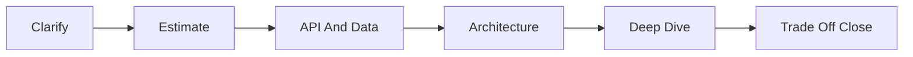
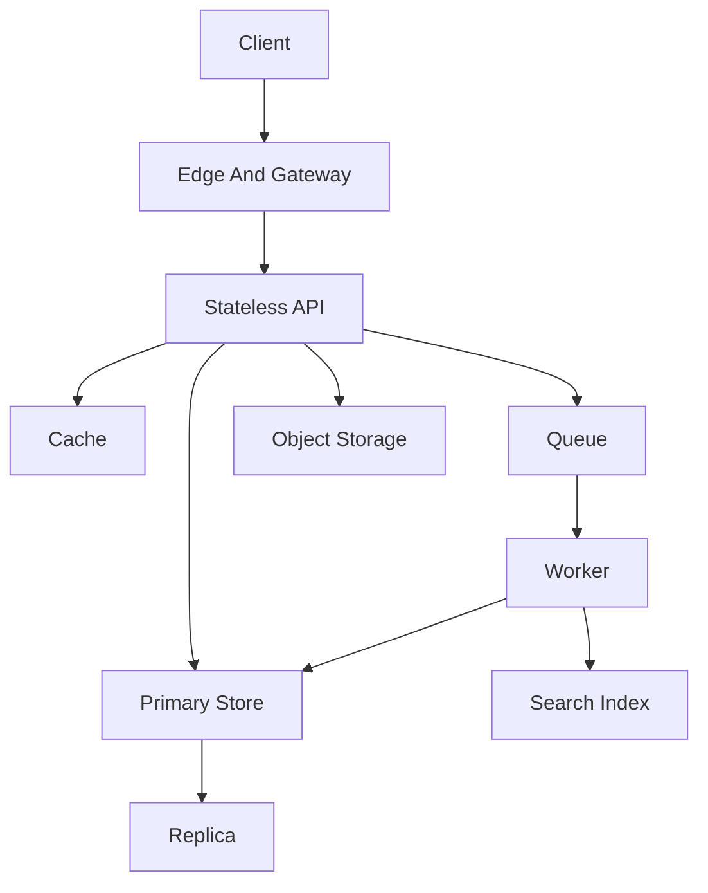

Use this as a compact script for the 45-minute high-level design round. It keeps the conversation structured, exposes the assumptions that change the architecture, and gives you trade-off language to say out loud.

## The 45 Minute Clock

| Minute | What to do | Concrete output |
|---:|---|---|
| 0 to 5 | Clarify requirements | Three core features, explicit non-goals, user types |
| 5 to 10 | Estimate scale | DAU, peak RPS, read/write ratio, storage, bandwidth |
| 10 to 15 | Define API and data | Key endpoints, entities, partition key, indexes |
| 15 to 30 | Draw architecture | Client to edge to services to data stores to async workers |
| 30 to 40 | Deep dive | Bottleneck, consistency choice, cache, queue, sharding, failure path |
| 40 to 45 | Close trade-offs | Recap decisions, risks, metrics, and next validation step |

> [!KEY]
> Own the clock. A structured imperfect design usually scores better than an elegant component diagram that never discusses scale, data, or failures.

## Questions That Change The Design

Ask questions that select architecture, not questions that merely sound thorough. If a requirement does not affect a component, consistency model, SLO, or cost, defer it.

| Ask | Why it changes the design | Example consequence |
|---|---|---|
| What are the top three user actions? | Defines the hot path | Feed read, post write, search, upload |
| What is the read/write ratio? | Selects cache, replicas, CQRS, async writes | 100:1 reads favors cache and denormalization |
| What are p99 latency targets? | Determines sync vs async and regional placement | 200 ms p99 forbids cross-region sync calls |
| What availability is required? | Determines zones, regions, deploy strategy | 99.99 percent needs automated rollback and failover |
| Can users see stale data? | Selects consistency model | Likes can be eventual, balances cannot |
| What must never be lost? | Defines durability and transaction boundaries | Payments require idempotency and audit trail |
| Are there hot keys or celebrities? | Drives partition and fan-out strategy | Hybrid feed fan-out avoids celebrity overload |
| Is data private or regulated? | Adds encryption, access controls, audit logs | PII changes storage and logging choices |
| What is out of scope? | Protects time | Admin tools, ML ranking, billing, moderation |

| Requirement | Primary lever | Secondary lever |
|---|---|---|
| Low-latency global reads | CDN or geo cache | Regional replicas |
| Strong financial correctness | SQL transaction | Idempotency and audit log |
| Burst writes | Queue | Backpressure and batch workers |
| Full-text search | Search index | Async indexer |
| Large media | Object storage | CDN and transcoding |
| Real-time updates | WebSocket or server-sent events | Presence and heartbeat |
| High-cardinality multi-tenant data | Partition by tenant or user | Shard map and quotas |

## Building Block Menu

| Building block | Reach for it when | Main cost or risk |
|---|---|---|
| Load balancer | Distribute traffic across stateless instances | Health checks must be correct |
| API gateway | Auth, routing, rate limits, request shaping | Can become a centralized choke point |
| CDN | Static or cacheable content near users | Invalidation and stale content |
| Redis cache | Hot reads, counters, locks with care | Stampedes and consistency gaps |
| SQL database | ACID, relational constraints, complex joins | Vertical limits and shard complexity |
| Document database | Flexible JSON, high scale, global distribution | Partition key and cross-partition query risk |
| Queue | Decouple slow or retryable work | At-least-once delivery and ordering |
| Stream log | Replayable events and high throughput | Operational complexity |
| Search index | Full-text, ranking, faceting | Eventual consistency with source of truth |
| Object storage | Images, videos, exports, backups | Metadata and lifecycle management |
| Read replica | Scale read-heavy relational workloads | Replication lag |
| Rate limiter | Protect dependencies and enforce fairness | User experience under throttling |

> [!TIP]
> Say both the reason and the cost. For example, a queue smooths bursts and enables retries, but it changes the user contract to eventual completion.

## Scaling Ladder

| Stage | Symptom | Move | What to say |
|---|---|---|---|
| 1 | Single instance limit | Add load balancer and stateless app replicas | Sessions move to shared store or tokens |
| 2 | Database read pressure | Add cache and read replicas | Monitor hit rate and replication lag |
| 3 | Slow expensive queries | Add indexes, materialized views, denormalized read model | Writes pay extra complexity |
| 4 | Write pressure | Partition or shard by high-cardinality key | Avoid hot partitions |
| 5 | Slow side effects | Move to queue and workers | Make operations idempotent |
| 6 | Global latency | Add CDN and regional read paths | Choose consistency explicitly |
| 7 | Org scale | Split services by ownership boundary | Avoid distributed monolith |

A standard design starts stateless at the compute layer and stateful behind explicit interfaces. Scale reads first with cache and replicas, then writes with partitioning and asynchronous processing. Do not shard before you have a partition key and query model.

## Consistency And Data Choices

| Scenario | Consistency choice | Why |
|---|---|---|
| Bank balance or inventory decrement | Strong | Double spend or oversell is unacceptable |
| User reads their own profile update | Session consistency | User should see their own write |
| News feed ranking | Eventual | Stale ordering is acceptable for scale |
| Search results | Eventual | Index lag is expected and measurable |
| Chat messages in one conversation | Strong or session per conversation | Ordering matters inside the partition |
| Leaderboard | Bounded staleness | Slight lag beats write amplification |
| Analytics dashboard | Eventual batch | Cost matters more than freshness |

| Pattern | Use when | Watch for |
|---|---|---|
| Cache aside | App controls cache fill on miss | Thundering herd and stale keys |
| Write through | Cache updated during write | Higher write latency |
| Outbox | DB write and event must stay consistent | Duplicate event delivery |
| Saga | Multi-service transaction needs compensation | Complex failure reasoning |
| CQRS | Read model differs from write model | Eventual consistency and duplicated logic |
| Idempotency key | Client may retry writes | Key retention and duplicate detection |

## Failure Mode Checklist

| Failure | Design response |
|---|---|
| Database unavailable | Circuit breaker, degraded reads, queue writes only if contract allows |
| Cache unavailable | Fail open to DB with rate limit, or fail closed for dependency protection |
| Queue consumer behind | Lag alert, scale workers, dead letter queue, backpressure |
| Duplicate message | Idempotent handler using request or event key |
| Hot partition | Better key, hash suffix, split celebrity path, cache hot item |
| Region isolated | Local reads, controlled write failover, conflict policy |
| Deployment regression | Health probes, canary, rollback, feature flag |
| Partial write | Transaction, outbox, saga compensation, reconciliation job |

> [!WARNING]
> Retries without idempotency turn transient failures into duplicate orders, duplicate notifications, or corrupted counters. Name the deduplication key.

## Deep Dive And Closing Scripts

Use the deep dive to prove you can reason beyond the happy path. Pick the riskiest component based on the requirements rather than explaining every box equally.

| If the interviewer probes | Deep dive on | Strong talking points |
|---|---|---|
| Latency | Cache, payload size, dependency chain | p99 budget, cache hit rate, timeout per hop |
| Correctness | Transactions, idempotency, consistency | source of truth, retry safety, reconciliation |
| Scale | Partitioning, sharding, hot keys | cardinality, skew, rebalancing, fan-out |
| Reliability | Failover and degradation | health checks, rollback, circuit breakers |
| Cost | Storage tiering and compute | caching, batching, retention, compression |
| Operations | Observability and runbooks | metrics, traces, alerts, ownership |
| Security | Auth and data protection | least privilege, audit logs, secrets, encryption |
| Evolution | Service boundaries and schema | backward compatibility, migrations, versioning |

| Design artifact | Minimum acceptable detail | Senior-level detail |
|---|---|---|
| API | Endpoint, method, request, response | Idempotency key, pagination, error contract |
| Data model | Core entities and indexes | Partition key, retention, ownership, migration path |
| Cache | Key and TTL | Invalidation, stampede protection, miss behavior |
| Queue | Topic or queue and consumer | Retry policy, ordering, DLQ, poison messages |
| Search | Source and indexer | Lag metric, rebuild plan, partial failure behavior |
| Deployment | Replicas and regions | Canary, rollback, feature flags, schema compatibility |
| Observability | Logs and dashboards | SLO burn, dependency saturation, trace correlation |

Closing script: I optimized the design for the stated constraint, accepted a known trade-off, and would validate it with a metric. Example: I chose a denormalized read model because feed reads dominate writes and p99 latency matters more than immediate global consistency. The trade-off is stale data for a short period, so I would track event lag, cache hit rate, read p99, and reconciliation errors.

| Decision | Trade-off sentence |
|---|---|
| Cache hot reads | Lower latency and database load, at the cost of staleness and invalidation complexity |
| Queue side effects | Better reliability and burst absorption, at the cost of eventual completion |
| Shard by user | Scales user-local queries, at the cost of cross-user aggregation complexity |
| Use SQL | Strong transactions and relational queries, at the cost of horizontal scale complexity |
| Use document store | Easy entity scale and flexible schema, at the cost of joins and cross-partition work |
| Multi-region active-active | Low regional latency and resilience, at the cost of conflict handling and operations |

Use a short validation plan when the design feels done. Validation turns a drawing into an engineering proposal.

| Risk | Validation metric | Load or production check |
|---|---|---|
| Cache is essential | Hit rate and origin RPS | Replay realistic key distribution |
| Partition key may skew | Top partition throughput | Generate hot tenant and celebrity cases |
| Queue hides failures | Age of oldest message | Kill consumer and verify alerts |
| Search may lag | Index delay percentile | Backfill and replay event stream |
| Deploy may break contract | Error rate by version | Canary with automatic rollback |
| Cross-region path too slow | Regional p99 latency | Synthetic probes from target geos |
| Cost grows too fast | Cost per million requests | Compare cache, storage, and egress |

If time remains, mention evolution. A good design has a first version that is safe and simple, plus a visible path to shard, regionalize, add read models, or split services later. That is stronger than designing the final global system on minute fifteen.

## Cheat sheet

- Start with three functional requirements and three nonfunctional requirements.
- Convert scale into peak RPS, storage per day, bandwidth, and read/write ratio.
- Draw left to right: client, edge, gateway, services, cache, data stores, queue, workers.
- Use Redis for hot reads, not as the system of record.
- Use queues for work that can finish after the request returns.
- Choose SQL for transactions and joins, document stores for entity scale and flexible schema.
- Every retryable write needs idempotency.
- Every cache needs a miss path, invalidation strategy, and stampede protection.
- Close with metrics: p99 latency, error rate, queue lag, cache hit rate, database CPU, saturation.

## Common mistakes

| Mistake | Fix |
|---|---|
| Jumping into components before requirements | Ask scale, SLO, consistency, durability, and privacy first |
| Drawing a giant diagram with no data model | Define entities, indexes, partition key, and ownership |
| Saying eventual consistency without user impact | Explain what stale means and how long it can last |
| Using a queue for synchronous answers | Return accepted state or keep the operation synchronous |
| Sharding by low-cardinality field | Use user, tenant, object, or hash with high cardinality |
| Forgetting operational metrics | Add logs, traces, alerts, dashboards, and runbooks |
| Ignoring backpressure | Add rate limits, bounded queues, and graceful degradation |
| Not closing the design | Summarize decisions, accepted trade-offs, and validation plan |

## Summary

System design interviews are structured decision-making under time pressure. Ask questions that change architecture, estimate with visible units, draw a standard backbone, then spend depth on the bottleneck and failure modes. The strongest close is a trade-off statement plus the first metric you would validate in production.

## Top Interview Questions

### Q1. What are the first questions you ask in a system design interview?

Start with questions that constrain the design. Ask for the three core features, the scale in daily active users or peak RPS, the read/write ratio, the p99 latency target, the availability target, and whether stale data is acceptable. Then ask about durability, privacy, and explicit non-goals. Avoid spending early time on cosmetic details like exact UI fields unless they change APIs or data shape. A strong opening sounds like: I want to design the hot path first, so I need to know who the users are, what actions dominate traffic, how fresh the data must be, and what failure the product can tolerate.

### Q2. How do you decide between SQL and a document database?

Choose SQL when the core requirement is relational integrity, multi-row transactions, complex joins, ad hoc querying, or mature reporting. Choose a document database when the access pattern is entity-centric, schema evolves frequently, horizontal partitioning is central, and global distribution is more important than joins. The deciding question is not fashionable technology; it is the query and transaction boundary. For example, payments, orders, and inventory often favor SQL because correctness across rows matters. User profiles, feed items, and event-like documents may fit a document store if each item can be partitioned cleanly. Mention the trade-off: document stores scale naturally when partitioned well, but cross-partition queries and transactions become expensive.

### Q3. When would you add a cache, and what can go wrong?

Add a cache when reads are frequent, data is reusable across requests, and the source of truth cannot meet latency or throughput goals alone. Typical targets are hot profiles, feed pages, configuration, authorization lookups, and counters. The risks are stale data, cache stampede, uneven hot keys, memory pressure, and a database surge if the cache fails. State the pattern: cache-aside is simple, write-through improves freshness at write latency cost, and TTL plus explicit invalidation handles most practical systems. A strong answer includes miss behavior, hit-rate monitoring, per-key locking or request coalescing for stampedes, and a fallback plan that protects the database with rate limits.

### Q4. How do you handle duplicate messages in an async design?

Assume duplicates will happen because most queues provide at-least-once delivery. Make the consumer idempotent by including a stable message or operation id and recording processed ids in the same database transaction as the side effect, or by making the write naturally idempotent using an upsert keyed by business identity. If a message sends an email, writes a payment, or changes inventory, the handler must check whether that effect already occurred. Also design retry policy, dead letter queue, and replay semantics. The interview point is that queues improve reliability and decoupling but move complexity into idempotency, ordering, visibility timeout, poison messages, and lag monitoring.

### Q5. How would you handle a hot partition or celebrity user?

First identify whether the heat is reads, writes, or fan-out. For hot reads, cache the object aggressively and use request coalescing so only one miss refills the cache. For hot writes, avoid partition keys with low cardinality or a single celebrity id; add a hash suffix, time bucket, or separate write path that spreads load. For feeds, use a hybrid model: fan out normal users on write, but fan out celebrity posts on read or through precomputed shards. Explain the trade-off: spreading writes makes reads more complex because data may need to be gathered from multiple buckets. Monitor partition utilization, throttling, p99 latency, and key distribution.

### Q6. What is the difference between fan-out on write and fan-out on read?

Fan-out on write pushes a new item into each follower's feed at write time. Reads are fast because the feed is precomputed, but celebrity writes can become enormous and storage is duplicated. Fan-out on read stores the item once and builds each feed when requested. Writes are cheap and celebrities are easy, but reads are slower and require ranking or merging. Most large systems use a hybrid: normal authors fan out on write, while celebrity or high-fanout authors are merged at read time or precomputed asynchronously. A senior answer names the product behavior, read/write ratio, freshness expectation, and worst-case fanout before choosing.

### Q7. How do you design for failure without overcomplicating the system?

Start with the failures that affect the user-visible SLO: dependency outage, slow database, duplicate message, bad deploy, and regional issue. For each, choose the simplest mitigation that matches product needs. Cache fallback may be enough for read-only data; payments need durable transactions and reconciliation. Use timeouts, retries with backoff, circuit breakers, bulkheads, and idempotency, but do not add multi-region active-active unless availability demands it. Make observability part of the design: logs with correlation ids, metrics for latency and saturation, traces for dependency calls, and alerts tied to SLO burn. The goal is graceful degradation and fast recovery, not theoretical perfection.

### Q8. How should you close a system design interview?

Close by summarizing the decisions and their trade-offs in one minute. State the core architecture, the scale it supports, the consistency choice, and the biggest accepted risk. For example: I chose cache-aside reads and asynchronous indexing because low read latency matters more than immediate search freshness. The accepted trade-off is possible stale search results for a few seconds. Then name production validation metrics such as p99 latency, cache hit rate, queue lag, database CPU, error rate, and regional failover time. Finally mention one future improvement if scale grows. This proves you understand the design as an evolving system rather than a static diagram.
