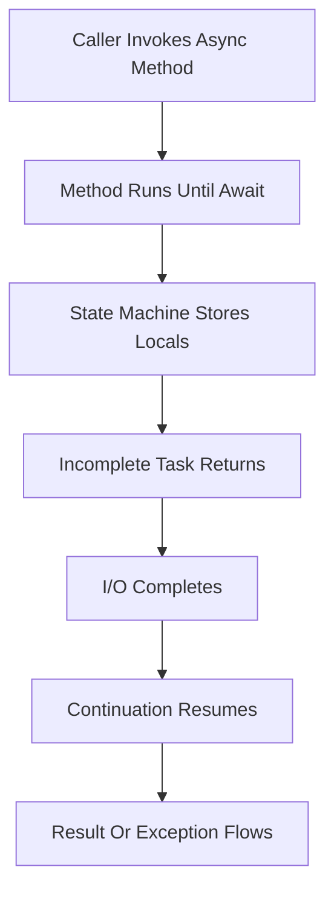

Use this sheet for rapid recall before a C# and .NET backend interview. It favors the facts that turn into follow-up questions: value semantics, allocations, async behavior, collection costs, GC pressure, and dependency injection lifetimes.

## Semantics And Equality

| Topic | Value type | Reference type | Interview trap |
|---|---|---|---|
| Examples | `int`, `bool`, `struct`, `DateTime` | `class`, `string`, `array`, `delegate` | `string` is a reference type with value equality |
| Storage | Inline in variable or containing object | Object on managed heap, variable holds reference | Stack versus heap is an implementation detail |
| Assignment | Copies the value | Copies the reference | Mutating through one reference affects same object |
| Nullability | Not nullable unless `Nullable<T>` | Nullable unless annotated otherwise | Nullable reference types are compile-time help |
| Inheritance | No class inheritance | Supports inheritance and polymorphism | Structs can implement interfaces |
| GC pressure | Usually low | Allocations tracked by GC | Boxing turns value into heap object |

| Equality member | Default behavior | Override when |
|---|---|---|
| `object.Equals` | Reference equality for classes, field-like for structs | Domain identity or value object semantics matter |
| `==` | Reference equality unless overloaded, value for primitives and string | Only when users expect operator equality |
| `GetHashCode` | Hash for equality buckets | Always with `Equals` |
| `IEquatable<T>` | Avoids boxing and is strongly typed | Value objects, dictionary keys, hot paths |
| `record class` | Compiler value equality by properties | Immutable DTOs and value objects |
| `record struct` | Value equality with struct allocation shape | Small immutable values |

```csharp
public sealed class UserKey : IEquatable<UserKey>
{
    public string Tenant { get; init; } = "";
    public string Id { get; init; } = "";
    public bool Equals(UserKey? other) => other is not null && Tenant == other.Tenant && Id == other.Id;
    public override bool Equals(object? obj) => Equals(obj as UserKey);
    public override int GetHashCode() => HashCode.Combine(Tenant, Id);
}
```

> [!KEY]
> If an object can be a dictionary key, its equality and hash code contract must be stable, consistent, and based on immutable data.

## Allocation And Memory Costs

| Concept | What to say | Gotcha |
|---|---|---|
| Boxing | Value type copied into an object box on heap | Happens with `object`, non-generic interfaces, some formatting |
| Unboxing | Runtime cast from object back to value type | Wrong type throws, nullable can surprise |
| `readonly struct` | Prevents mutation and communicates value semantics | Large structs still copy expensively |
| `Span<T>` | Stack-only view over contiguous memory | Cannot be stored in fields of heap objects |
| `Memory<T>` | Heap-safe memory wrapper for async APIs | Slightly heavier than span |
| `ArrayPool<T>` | Reuse large buffers | Must return arrays and clear if holding secrets |
| LOH | Large object heap for objects around 85 KB and larger | Collected with Gen 2 and can fragment |

| GC area | Typical contents | Practical action |
|---|---|---|
| Gen 0 | Short-lived allocations | Usually cheap, but high rate still hurts |
| Gen 1 | Survivors from Gen 0 | Buffer generation |
| Gen 2 | Long-lived objects, caches, singletons | Avoid unbounded growth |
| LOH | Large arrays and strings | Pool buffers, stream, chunk large payloads |
| Finalization queue | Objects with finalizers | Prefer `SafeHandle` and deterministic dispose |

> [!WARNING]
> The fastest allocation is the one avoided in a hot path. LINQ chains, closures, boxing, and repeated string concatenation can quietly dominate request cost.

## Async And Cancellation



| Pitfall | Symptom | Fix |
|---|---|---|
| `.Result` or `.Wait()` | Deadlock in classic contexts, thread starvation | Await all the way |
| `async void` | Exceptions not observed by caller | Use `async Task` except event handlers |
| Missing `await` | Lost exception or premature return | Return or await the task intentionally |
| Sequential awaits | Calls run one after another | Start tasks then `Task.WhenAll` |
| Ignored cancellation | Slow shutdown and wasted work | Accept and pass `CancellationToken` |
| `Task.Run` around I/O | Wastes thread pool threads | Await native async API |
| `ValueTask` overuse | Misuse by awaiting twice or boxing | Use only for hot paths with sync completion |
| `ConfigureAwait(false)` confusion | Library captures context unnecessarily | Use in reusable libraries, not required in ASP.NET Core |

```csharp
public async Task<Order> LoadOrderAsync(string id, CancellationToken ct)
{
    ct.ThrowIfCancellationRequested();
    var orderTask = orderStore.GetAsync(id, ct);
    var auditTask = auditStore.GetRecentAsync(id, ct);
    await Task.WhenAll(orderTask, auditTask).ConfigureAwait(false);
    return orderTask.Result with { RecentAudit = auditTask.Result };
}
```

ASP.NET Core has no classic request `SynchronizationContext`, so `ConfigureAwait(false)` is not needed for controllers. It is still reasonable in library code because the library should not assume a caller context.

## Collections And LINQ

| Collection | Lookup | Add | Remove | Allocation or usage note |
|---|---:|---:|---:|---|
| `T[]` | O(1) index | Fixed | Fixed | Best locality, fixed size |
| `List<T>` | O(1) index, O(n) search | O(1) amortized | O(n) middle | Resize copies backing array |
| `Dictionary<K,V>` | O(1) average | O(1) average | O(1) average | Worst case O(n), comparer matters |
| `HashSet<T>` | O(1) average | O(1) average | O(1) average | Membership and dedupe |
| `SortedDictionary<K,V>` | O(log n) | O(log n) | O(log n) | Tree-backed ordered keys |
| `SortedList<K,V>` | O(log n) search | O(n) | O(n) | Array-backed, memory efficient |
| `Queue<T>` | O(1) peek | O(1) amortized | O(1) dequeue | FIFO |
| `Stack<T>` | O(1) peek | O(1) amortized | O(1) pop | LIFO |
| `LinkedList<T>` | O(n) search | O(1) with node | O(1) with node | Useful with dictionary for LRU |
| `PriorityQueue<T,P>` | O(1) peek | O(log n) | O(log n) dequeue | Min-heap, no decrease-key |
| `ConcurrentDictionary<K,V>` | O(1) average | O(1) average | O(1) average | Thread-safe with higher constants |

| LINQ concept | Meaning | Trap |
|---|---|---|
| Deferred execution | Query runs when enumerated | Re-enumeration repeats work |
| `IEnumerable<T>` | In-memory iterator contract | Provider has already materialized data |
| `IQueryable<T>` | Expression tree translated by provider | `AsEnumerable` pulls work client-side |
| `ToList` | Materializes now | Good once, bad inside loops |
| `Select` closure | Captures outer variables | Captures can allocate and mutate unexpectedly |

```csharp
var activeUsers = db.Users
    .Where(u => u.IsActive)
    .Select(u => new { u.Id, u.Email });

var page = await activeUsers
    .OrderBy(u => u.Id)
    .Take(100)
    .ToListAsync(ct);
```

## Resource Lifetime And DI

| DI lifetime | Instance scope | Use for | Do not do |
|---|---|---|---|
| Singleton | One instance for app lifetime | Stateless services, caches, config readers | Capture scoped services or request data |
| Scoped | One per request scope | `DbContext`, unit of work, request services | Use from background thread without a scope |
| Transient | New per resolution | Lightweight stateless helpers | Allocate heavy objects repeatedly |

| Resource | Correct pattern | Interview note |
|---|---|---|
| File stream | `using` or `await using` | Dispose releases OS handle deterministically |
| Database context | Scoped DI | Not thread-safe, not singleton |
| HTTP clients | `IHttpClientFactory` or singleton client | Per-request disposal can exhaust sockets |
| Timers and subscriptions | Dispose on shutdown | Leaks keep objects alive |
| Async streams | `await foreach` with token | Propagate cancellation |
| Background service | Create scopes per unit of work | Never store request scoped dependency globally |

> [!TIP]
> Lifetime bugs often pass tests and fail under load. The classic smell is a singleton holding a scoped `DbContext`, user context, or mutable request cache.


## Concurrency Exceptions And Modern Csharp

| Primitive | Use when | Avoid when |
|---|---|---|
| `lock` | Short synchronous critical section | Awaiting inside the section |
| `SemaphoreSlim` | Limit async concurrency | Protecting cross-process state |
| `Interlocked` | Atomic counters and swaps | Compound invariants across fields |
| `ConcurrentDictionary` | Shared map with independent key operations | Multi-key transaction is needed |
| `Channel<T>` | Producer consumer pipeline | Simple request response call |
| `ReaderWriterLockSlim` | Many readers and rare writes | Async code or high write contention |
| `Mutex` | Cross-process mutual exclusion | Normal in-process service logic |
| Immutable snapshot | Read-heavy shared state | Very large data with frequent full copies |

Thread safety is about shared mutable state. A method using only local variables is naturally safe for concurrent calls; a singleton with mutable fields is not automatically safe because dependency injection created one instance. Prefer immutability, per-request scoped state, or concurrent structures before manual locking. If a lock is required, keep the critical section small and never block on async work inside it.

| Exception practice | Good answer | Trap |
|---|---|---|
| Rethrow | Use bare `throw` inside catch | `throw ex` resets stack trace |
| Expected failures | Model as result or validation error | Exceptions for normal control flow |
| Logging | Log once at boundary with context | Logging and rethrowing at every layer |
| Cancellation | Let `OperationCanceledException` flow when token cancels | Treating cancellation as an error incident |
| Cleanup | Use `finally`, `using`, or `await using` | Relying on finalizers for normal cleanup |
| Filters | Use `catch` filters for precise handling | Catching `Exception` and swallowing |

Modern C# features are safest when they reduce accidental mutation. `record` is useful for DTOs and value objects; `init` properties make construction flexible while keeping later state stable; pattern matching makes type and shape checks concise; nullable reference types catch missing null handling at compile time. Do not oversell syntax as architecture. Explain the runtime behavior when it matters: records are still classes unless declared as record structs, and `with` creates a copy with selected changes.

| Feature | High-yield use | Interview caveat |
|---|---|---|
| `record` | Value equality DTO | Shallow immutability unless fields are immutable |
| `init` | Set during construction only | Collections inside can still mutate |
| Nullable reference types | Compiler warnings for null flow | Not runtime enforcement |
| Pattern matching | Clear type and property checks | Keep complex patterns readable |
| `await using` | Async disposal | Resource must implement `IAsyncDisposable` |
| `required` members | Object initialization contract | Still validate domain rules |
| `Span<T>` | Zero-copy parsing and slicing | Ref struct cannot cross async boundaries |


For performance questions, separate algorithmic cost from runtime overhead. An O(n) algorithm can still be slow if it allocates per element, boxes values, performs virtual calls in a tight loop, repeatedly enumerates LINQ, or creates large temporary strings. Conversely, simple loops over arrays are fast because they have locality and predictable branches.

| Hot path smell | Why it hurts | Better shape |
|---|---|---|
| LINQ chain per request item | Iterators, delegates, possible multiple enumeration | Single explicit loop |
| `object` parameters for value types | Boxing and type checks | Generic method or overload |
| New large byte array per call | LOH pressure and Gen 2 collections | Pool, stream, or reuse buffer |
| Per-item async call in loop | Sequential latency and state machines | Batch or start tasks then await all |
| Reflection on every request | Metadata lookup and allocations | Cache delegates or generated accessors |
| Exceptions for validation | Stack capture and control-flow noise | Return result or validation error |
| Shared mutable singleton state | Races and stale data | Immutable state or scoped service |

A strong debugging answer follows the same sequence each time: reproduce, measure allocation rate and latency, inspect traces for blocking or fan-out, reduce the hot path, and add a regression guard. Name the tool category rather than a specific product if needed: profiler, allocation view, trace, dump, benchmark, or load test.


Use this final triage table when a C# answer becomes too broad.

| Symptom | First suspect | First check |
|---|---|---|
| High CPU | Algorithm, JSON, regex, locks | Profile samples and hot methods |
| High memory | Allocation rate, caches, large buffers | Allocation profile and heap dump |
| Thread starvation | Blocking waits or sync over async | Thread pool counters and traces |
| Slow database calls | LINQ translation or missing index | Generated SQL and query plan |
| Socket exhaustion | Client lifetime misuse | Connection counts and `IHttpClientFactory` use |

The interview pattern is rule, consequence, safer default. State the rule briefly, connect it to a production failure mode, then name the pattern that prevents it.

## Cheat sheet

- Value types copy values; reference types copy references.
- Boxing allocates and is common when value types flow through `object` or non-generic APIs.
- Override `Equals` and `GetHashCode` together, and keep key fields immutable.
- Await all the way and pass `CancellationToken` through every async boundary.
- `ConfigureAwait(false)` is library hygiene, not a required ASP.NET Core controller rule.
- `PriorityQueue<TElement,TPriority>` is a min-heap.
- LINQ is often deferred; materialize once when repeated enumeration would be expensive.
- Gen 2 and LOH pressure are more dangerous than cheap Gen 0 churn.
- `IDisposable` is for deterministic cleanup of unmanaged resources and wrappers.
- DI singleton must not capture scoped services.

## Common mistakes

| Mistake | Fix |
|---|---|
| Using mutable objects as dictionary keys | Make keys immutable or records with stable equality |
| Calling `.Result` in request code | Make the call chain async and await |
| Concatenating strings in loops | Use `StringBuilder`, `string.Create`, or buffered output |
| Assuming LINQ query already executed | Remember execution happens on enumeration |
| Returning pooled array without clearing sensitive data | Clear before returning if it held secrets |
| Disposing `HttpClient` per request | Use `IHttpClientFactory` |
| Forgetting recursion or iterator allocations | Include stack and enumerator costs in complexity |
| Capturing scoped service in singleton | Inject `IServiceScopeFactory` and create a scope |

## Summary

C# interview answers should connect language rules to production consequences. Value semantics, equality, boxing, async state machines, collection complexity, GC generations, and DI lifetimes all affect correctness and latency. The best answers name the rule, the failure mode, and the safer pattern in one breath.

## Top Interview Questions

### Q1. What is boxing and why does it matter?

Boxing converts a value type into an object reference by allocating a box on the managed heap and copying the value into it. It matters because it adds allocation, garbage collection pressure, and sometimes virtual dispatch or unboxing costs. Common sources are assigning a struct to `object`, using non-generic collections, formatting, or calling interface methods on value types in some contexts. One boxed integer is not a crisis, but boxing inside a hot loop or serialization path can dominate latency. The usual fix is to use generics, strongly typed APIs, `IEquatable<T>` for equality, and avoid `object` in performance-sensitive code. Also mention that unboxing requires the exact underlying type.

### Q2. How do you implement equality correctly for a custom key type?

Define what identity means, keep the participating fields immutable, override `Equals(object?)`, override `GetHashCode`, and preferably implement `IEquatable<T>`. Equal objects must always produce the same hash code during their lifetime, or dictionaries and hash sets will lose track of entries. If you overload `==`, keep it consistent with `Equals`. For value-object style data, a `record` can be the simplest option because it generates value equality based on primary data. For entities, equality may be based on stable identity rather than every mutable property. In an interview, call out null handling, type checks, hash combination, and the danger of mutating key fields after insertion.

### Q3. Why can `.Result` or `.Wait()` on a task be dangerous?

They block a thread while waiting for asynchronous work to finish. In classic synchronization-context environments, this can deadlock when the continuation needs to resume on the blocked context. In ASP.NET Core the classic deadlock is less common, but blocking still wastes thread-pool threads and can cause thread starvation under load. It also wraps exceptions differently and mixes sync and async control flow. The safe default is async all the way: return `Task`, use `await`, and propagate cancellation. If parallel I/O is needed, start tasks first and await `Task.WhenAll`. Blocking may be acceptable only at carefully controlled process boundaries, not inside request handlers.

### Q4. When should you use `ConfigureAwait(false)`?

Use `ConfigureAwait(false)` in reusable library code when the continuation does not need the caller's synchronization context. It avoids context capture and prevents classic deadlock patterns in UI or old ASP.NET callers. In ASP.NET Core request code there is no request synchronization context to capture, so it is usually unnecessary and can add noise. The interview answer should avoid absolutism: it is not a performance magic switch, and it does not make code run on a different thread by itself. The key question is whether the continuation requires a specific context. Library code should not assume it does; UI code often does when updating controls.

### Q5. How do you choose between `List`, `Dictionary`, `HashSet`, and `SortedDictionary`?

Choose by operation, not habit. Use `List<T>` for ordered indexed storage and append-heavy sequences, knowing that search and middle removal are O(n). Use `Dictionary<K,V>` for key-to-value lookup with expected O(1) operations and stable key equality. Use `HashSet<T>` for membership and deduplication. Use `SortedDictionary<K,V>` or `SortedSet<T>` when you need ordered traversal or maintained sorted order with O(log n) updates; .NET's built-in types do not expose every tree operation, so predecessor or lower-bound queries may need a custom structure. If you need top K, choose a heap. In a strong answer, mention memory overhead, comparer costs, worst-case hash collisions, and that converting a list to a set once can turn repeated O(n) scans into expected O(1) checks.

### Q6. What is the Large Object Heap and how do you reduce its impact?

The Large Object Heap stores large managed objects, commonly arrays around 85 KB or larger. It is collected with Gen 2, so collections are less frequent but more expensive, and fragmentation can become a problem when large buffers are repeatedly allocated and discarded. This matters in services that process big JSON payloads, files, images, or byte arrays. Mitigations include streaming instead of buffering whole payloads, chunking, using `ArrayPool<T>` or `MemoryPool<T>`, reusing buffers carefully, and avoiding accidental large strings. If pooled buffers may contain sensitive data, clear before returning them. The key is to reduce repeated large allocations and observe Gen 2 pauses and allocation rate.

### Q7. What is deferred execution in LINQ and when is it a problem?

Deferred execution means a LINQ query such as `Where` or `Select` is not executed when declared. It runs when enumerated, for example by `foreach`, `ToList`, `Count`, or serialization. This enables composition, especially with `IQueryable<T>` where the provider can translate the expression into SQL. It becomes a problem when you enumerate the same query repeatedly, close over a variable that later changes, or accidentally call `AsEnumerable` and move filtering from the database into memory. The fix is to know the provider boundary, materialize once when needed, and avoid complex LINQ chains in hot loops where explicit loops are clearer and allocate less.

### Q8. Why is injecting a scoped service into a singleton a bug?

A singleton lives for the entire application lifetime, while a scoped service usually lives for one request or explicit scope. If a singleton captures a scoped dependency such as `DbContext`, it can reuse the same instance across requests, causing thread-safety bugs, stale state, disposed-object errors, or data leakage between users. The fix is to redesign ownership so the singleton receives data per call, make the dependent service scoped too, or inject `IServiceScopeFactory` and create a scope inside background work. A strong answer names the lifetime mismatch and the production symptom. Dependency injection validation can catch some cases, but factories and manual captures can still hide the problem.
