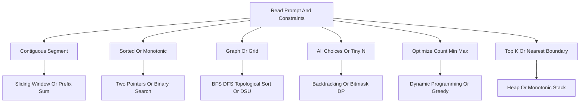

Use this as a recognition sheet, not a textbook. In a coding round, the fastest path is to read constraints, name the pattern, state the invariant, code the template, and test edge cases aloud.

## Recognition Table

| Problem statement signal | Reach for | Invariant or reason | Typical cost |
|---|---|---|---|
| Sorted array, pair, palindrome, two ends | Two pointers | Sorted order justifies moving one side | O(n) |
| Contiguous subarray or substring with at most K | Sliding window | Each index enters and leaves once | O(n) |
| Exact subarray sum with negatives | Prefix sum plus hash map | Count previous prefixes | O(n) |
| Sorted input or first true boundary | Binary search | Predicate is monotonic | O(log n) |
| Minimize maximum or maximize minimum | Binary search on answer | Feasibility flips once | O(check log range) |
| Kth, top K, merge K, stream best | Heap | Keep only next or best candidates | O(n log k) |
| Next greater, span, nearest boundary | Monotonic stack | Stack stores unresolved indices | O(n) |
| Sliding window maximum | Monotonic deque | Front is best live candidate | O(n) |
| Grid reachability, islands, components | BFS or DFS | Visit each node once | O(V + E) |
| Unweighted shortest path | BFS | Level order equals hop count | O(V + E) |
| Non-negative weighted shortest path | Dijkstra | Pop current smallest distance | O((V + E) log V) |
| Prerequisites, build order, directed cycle | Topological sort | Zero indegree means ready | O(V + E) |
| Connectivity, groups, redundant edge | Union-Find | Roots represent components | Almost O(1) op |
| All subsets, permutations, combinations | Backtracking | Choose, recurse, undo | Exponential |
| Count ways, min cost, max value | Dynamic programming | State captures reusable subproblem | states times transition |
| Prefix words or autocomplete | Trie | Path from root is a prefix | O(length) |
| Intervals and meetings | Sort plus greedy or heap | Order exposes overlap | O(n log n) |
| Values map to indices from 1 to n | Cyclic sort or index marking | Position encodes membership | O(n) |
| Cycle or middle of linked list | Fast and slow pointers | Fast laps slow or hits null | O(n) |

> [!KEY]
> Read constraints before coding. They usually reveal the intended complexity row, which reveals the viable pattern family.

## Complexity Budget

| Constraint | Target complexity | Common techniques |
|---|---|---|
| n up to 10 or 12 | O(n!) or heavy pruning | Permutations, exhaustive search |
| n up to 20 or 25 | O(2^n) to O(n squared times 2^n) | Subsets, bitmask DP, meet in the middle |
| n up to 100 | O(n cubed) or O(n fourth) | Dense DP, Floyd-Warshall variants |
| n up to 1,000 | O(n squared) | Pair DP, LCS, edit distance |
| n up to 100,000 | O(n log n) or O(n) | Sort, heap, hash map, BFS, segment tree |
| n up to 10,000,000 | O(n) | Single pass, counting, prefix, sliding window |
| value up to 1,000,000,000 | O(log value) or O(sqrt value) | Binary search answer, number theory |
| value up to 10^18 | O(log value) | Fast power, binary search with `long` |

| C# cost to remember | Complexity | Pitfall |
|---|---:|---|
| `List<T>.Add` | O(1) amortized | Resize copies occasionally |
| `List<T>.RemoveAt(0)` | O(n) | Use queue or head index |
| `Dictionary` lookup | O(1) average | Bad hash or mutable key breaks assumptions |
| `HashSet.Contains` | O(1) average | Converting to set inside loop is wasteful |
| `PriorityQueue` dequeue | O(log n) | It is a min-heap |
| `Array.Sort` | O(n log n) | Comparator subtraction can overflow |
| DFS recursion stack | O(depth) | Deep chains can overflow in C# |
| Monotonic stack pass | O(n) | Each item is pushed and popped once |

## Csharp Template Cues

This is a night-before trigger table, not a template library. Before writing code, say the invariant, guard the boundary cases, and choose the one skeleton shape that matches the prompt.

| Pattern | C# shape to recall | Say before coding | Boundary to test |
|---|---|---|---|
| Two pointers | `int l = 0, r = n - 1; while (l < r)` | Sorted order tells me which side can move | Empty, one item, duplicate pair |
| Sliding window | `for right`, update counts, `while invalid` shrink left | Each index enters and leaves at most once | `k = 0`, duplicate chars, all valid |
| Prefix hash | `prefix += x; answer += count[prefix - target]` | Previous prefixes encode subarray sums | Negatives, zero target, repeated prefix |
| Binary search | `while (lo < hi)` with first-true predicate | Feasibility must flip once | All false, all true, boundary at ends |
| BFS | `Queue<T>`, mark visited when enqueued | Level order gives minimum hops | Disconnected graph, start equals target |
| DFS | Recursive or explicit stack plus visited | Explore component or path completely | Deep chain in C# may need iterative stack |
| Topological sort | Indegree array plus zero-indegree queue | Output count proves acyclic graph | Cycle, isolated node, duplicate edge |
| Union-Find | Parent array, path compression, size or rank | Roots represent connected components | Already connected, self edge |
| Backtracking | Choose, recurse, undo | Path is the partial candidate | Duplicate pruning, output copy cost |
| DP | State sentence, base cases, transition order | State contains all information needed | Off-by-one base row, impossible state |
| Heap | `PriorityQueue<TElement,TPriority>` | Min-heap keeps only next or best candidates | `k = 0`, `k = n`, priority ties |
| Monotonic stack | Stack of indices, pop while invariant breaks | Stack stores unresolved candidates | Equal values, answer by index |

> [!TIP]
> In C#, use `long` for sums, products, binary-search bounds, and reversed heap priorities. Overflow bugs are easier to prevent than debug on a whiteboard.

## Pattern Pitfalls

| Pattern | Classic pitfall | Fix |
|---|---|---|
| Two pointers | Moving both pointers after a non-match | Move the side justified by the invariant |
| Sliding window | Using it when negatives break monotonicity | Switch to prefix sums for exact sums with negatives |
| Binary search | Infinite loop or overflow midpoint | Use first-true template and safe midpoint |
| BFS | Marking visited when dequeued | Mark when enqueued to avoid duplicates |
| DFS | Claiming O(1) space | Include recursion stack O(depth) |
| Topological sort | Forgetting cycle detection | Check `order.Count == n` |
| Union-Find | Unioning non-roots | Find roots before attaching |
| Backtracking | Forgetting undo or duplicate pruning | Sort when needed and remove the last choice |
| DP | State missing information | Define state in one sentence before transition |
| Heap | Sorting all n for top K | Keep heap of size K when K is small |
| Monotonic stack | Storing values when duplicates matter | Store indices, compare values through indices |

## Interview Playbook

| Step | Sentence to say |
|---|---|
| Restate | Let me restate the input, output, and constraints |
| Clarify | Can values be negative, duplicated, empty, or huge |
| Brute force | The naive approach is this and costs that |
| Bottleneck | The repeated scan or duplicate state is the expensive part |
| Pattern | The prompt has this signal, so I will use this pattern |
| Invariant | At every iteration this condition remains true |
| Code | I will guard base cases first, then the main loop |
| Test | I will dry-run normal, boundary, and adversarial cases |
| Complexity | Time is this, extra space is this including stack or output |

> [!WARNING]
> Do not memorize templates without the invariant. Interviewers change one condition, such as negatives or duplicate output, to see whether the pattern still applies.

## Combination Patterns And Edge Cases

Many medium and hard problems combine two simple patterns. Name both pieces and which one owns correctness.

| Combination cue | Pattern pair | Example reasoning |
|---|---|---|
| Minimum feasible capacity with ordered items | Binary search on answer plus greedy check | Search capacity, greedily count partitions |
| Top K frequent | Hash map plus heap | Count first, keep best K |
| Sliding window maximum | Sliding window plus monotonic deque | Window expires front, deque preserves max |
| Shortest path with keys or visited subset | BFS plus bitmask state | State is position and mask, not just position |
| K way merge | Heap plus linked list or array pointers | Heap stores next candidate per source |
| Intervals requiring rooms | Sort plus heap | Sort by start, heap active end times |
| Word search with dictionary | Trie plus backtracking | Trie prunes impossible prefixes |
| Accounts merge | Hash map plus Union-Find | Map email to id, union shared accounts |
| Dynamic programming with sorted jobs | Sort plus binary search plus DP | Find previous compatible job quickly |
| Median stream | Two heaps | Balance lower and upper halves |

| Edge case family | Ask or test | Why it matters |
|---|---|---|
| Empty and singleton | What should return | Prevents index and null bugs |
| Duplicates | Are duplicate answers allowed | Affects sorting, backtracking, hash maps |
| Negative numbers | Can values be negative | Breaks sliding window sums and greedy assumptions |
| Large values | Can sums overflow int | Use `long` before addition or multiplication |
| `k` boundaries | k equals 0, 1, n, or greater than n | Many heap and window bugs live here |
| Disconnected graph | Are all nodes reachable | BFS from one source may miss components |
| Self loops and parallel edges | Can graph contain them | Topo and DSU cycle logic changes |
| Output ordering | Is any order accepted | Avoid unnecessary sorting or preserve original order |
| Mutability | May I sort or modify input | Sorting can destroy index answers |
| Recursion depth | Can n be 100K | Use iterative DFS in C# |

When stuck, reduce the problem to the brute-force state: index, remaining target, previous value, visited set, component id, or current window. Then ask what can be cached, ordered, skipped, bounded, or streamed. Caching repeated states points to DP or memoization. Ordering points to sorting, heap, binary search, or two pointers. Skipping candidates points to greedy, pruning, monotonic structures, or prefix sums. Bounded memory with streaming points to heap, reservoir sampling, rolling hash, or approximate counting.

| Senior follow-up | Response shape |
|---|---|
| Input does not fit memory | Stream, chunk, external sort, or keep bounded heap |
| Many repeated queries | Precompute prefix, index, trie, sparse table, or memo |
| Online data | Maintain heap, two heaps, rolling window, or incremental aggregate |
| Concurrent callers | Avoid shared mutation or use immutable snapshots and locks |
| Distributed data | Partition, compute local summaries, merge results, handle skew |
| Adversarial data | Prefer worst-case-safe bounds, overflow checks, and iterative traversal |

Use these complexity phrases when closing a solution. They sound simple, but they prevent most grading ambiguity.

| Situation | Phrase |
|---|---|
| Hash map solution | Expected O(n) time and O(n) space, assuming good hashing |
| Sorting solution | O(n log n) time plus output space, sorting mutates input unless copied |
| DFS on tree | O(n) time and O(h) stack, where h is height |
| BFS on graph | O(V plus E) time and O(V) visited and queue space |
| Backtracking output | Output size is the lower bound, so exponential time is unavoidable |
| DP table | O(states times transitions) time and O(states) space before compression |
| Heap top K | O(n log k) time and O(k) space, better than sorting when k is small |
| Binary search answer | O(log range times check cost), predicate must be monotonic |

Before saying done, run one tiny trace by hand. Track pointer positions, queue contents, stack invariant, DP row, or heap contents. This catches off-by-one errors faster than staring at code.

## Cheat sheet

- Sorted pair means two pointers; sorted boundary means binary search.
- Contiguous with monotonic validity means sliding window; exact sums with negatives mean prefix hash.
- Unweighted shortest path means BFS; weighted non-negative means Dijkstra.
- Prerequisites mean topological sort; undirected connectivity means DFS or Union-Find.
- All combinations, subsets, permutations, or tiny n means backtracking or bitmask.
- Count ways, min cost, or max value with repeated states means DP.
- Next greater or nearest boundary means monotonic stack.
- Top K means heap unless K is close to n and sorting is simpler.
- Always state whether complexity is average, amortized, worst case, or output-sensitive.
- In C#, `PriorityQueue` is a min-heap and recursion depth is real stack space.

## Common mistakes

| Mistake | Fix |
|---|---|
| Coding before reading constraints | Use constraints to select target complexity first |
| Saying nested loops are always O(n squared) | Count actual trips, especially two pointers and harmonic loops |
| Ignoring output size | Returning all subsets costs at least O(n times 2^n) |
| Forgetting graph edges in complexity | Say O(V + E), not just O(n) |
| Using a mutable key in dictionary or set | Use immutable values with stable equality |
| Sorting when original indices matter | Store value plus original index before sorting |
| Using recursion on 100K depth in C# | Switch to iterative stack or queue |
| Testing only the happy path | Dry-run empty, single, duplicate, negative, and boundary cases |

## Summary

Pattern recognition is a shortcut only when backed by constraints and invariants. Read the input limits, map the wording to a family, state the brute-force bottleneck, and use the template that preserves the invariant. The final answer should include edge cases, exact time and space, and any C# runtime cost such as stack depth, allocation, or integer overflow.

## Top Interview Questions

### Q1. How do you choose a pattern from a new problem statement?

Start with constraints and output shape. If n is up to 100,000, avoid quadratic ideas and look for hash maps, sorting, heaps, two pointers, sliding windows, or graph traversal. Then identify wording signals: contiguous suggests sliding window or prefix sums; sorted or monotonic suggests binary search or two pointers; prerequisites suggest topological sort; all combinations suggest backtracking; repeated min or count states suggest DP. Explain the brute-force bottleneck before naming the pattern. A strong answer sounds like: the exact sum with negatives breaks a sliding-window invariant, so I will use prefix sums and count previous prefixes in a hash map.

### Q2. When does sliding window fail, and what replaces it?

Sliding window needs a monotonic validity condition as the left pointer moves. It works for at most K distinct characters or sums with all non-negative numbers because shrinking the window predictably reduces or preserves the constraint. It fails for exact sums with negative numbers because adding or removing an element can move the sum in either direction, so the window cannot decide how to shrink safely. The usual replacement is prefix sum plus a hash map that records previous prefix counts. For each current prefix, look for `prefix - target`. That handles negatives in O(n) expected time and O(n) space. In interviews, explicitly state why the monotonic assumption is broken.

### Q3. How do you avoid binary search boundary bugs?

Decide whether you are finding the first true, last true, first greater or equal, or exact match before coding. Use a half-open or closed interval consistently, and prefer a tested first-true template for monotonic predicates: while `lo < hi`, compute `mid = lo + (hi - lo) / 2`, then move `hi = mid` if feasible, otherwise `lo = mid + 1`. Define the predicate in words and prove it flips once. Use `long` for bounds or feasibility math when sums or products can overflow. After coding, test the smallest values, all false, all true, and a boundary at each end.

### Q4. When do you choose BFS over DFS?

Choose BFS when the answer depends on the fewest edges, levels, or nearest state in an unweighted graph. Level order in a tree, shortest path in a grid, rotting oranges, and word ladder are BFS-style problems. Choose DFS when you need to explore components, all paths, subtree properties, or backtracking search. Both are O(V + E) on a graph if implemented with visited tracking, but their space differs by frontier versus depth. In C#, recursive DFS can overflow on a deep chain, so iterative DFS is safer for large inputs. A senior answer names whether visited is marked on enqueue or entry to avoid duplicate work.

### Q5. What is the core idea behind topological sort?

Topological sort orders directed acyclic graph nodes so every prerequisite appears before the dependent node. Kahn's algorithm counts incoming edges, enqueues all zero-indegree nodes, repeatedly removes one, and decreases indegrees of its neighbors. If the output count is less than the number of nodes, a cycle exists and no valid order is possible. Use it for course schedule, build systems, dependency deployment, and alien dictionary style ordering. Complexity is O(V + E) time and O(V) extra space. The critical interview detail is that topological sort applies only to directed graphs and requires explicit cycle detection.

### Q6. How do you recognize a dynamic programming problem?

Look for optimization or counting over repeated choices: count ways, minimum cost, maximum value, feasibility, or longest sequence. Then test for overlapping subproblems and optimal substructure, meaning a larger answer can be built from smaller answers that repeat. Define the state in one sentence, list the choices or transition, set base cases, choose memoization or tabulation, and identify the evaluation order. The hardest part is not writing the array; it is choosing enough state to make the transition correct without including irrelevant data. State complexity as number of states times work per state, plus stored space.

### Q7. Why is Union-Find almost constant time?

Union-Find maintains connected components using parent pointers. Path compression flattens the tree during `Find`, and union by rank or size attaches the smaller tree under the larger one. Together they make each operation amortized O(alpha(n)), where alpha is the inverse Ackermann function and is less than five for practical input sizes. Use it for dynamic connectivity, undirected cycle detection, accounts merge, provinces, and Kruskal's minimum spanning tree. It is not a general graph traversal replacement when you need paths, ordering, shortest distances, or directed-cycle reasoning. In code, always find roots before unioning and update parent arrays only at roots.

### Q8. How do you discuss complexity for backtracking?

Backtracking complexity is usually output-sensitive and exponential. State the branching factor and depth: subsets branch two ways for n elements, so there are 2^n leaves and often O(n times 2^n) output cost if each result is copied. Permutations have n choices, then n minus one, giving O(n!) leaves and O(n times n!) if copying each permutation. Pruning can dramatically improve real performance but usually does not change the worst-case bound unless the pruning rule proves a smaller search space. Space is recursion depth plus any used sets or output. Always include the cost of returning all answers because output size is a lower bound.
