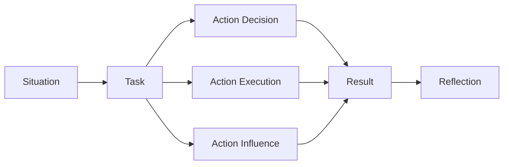

Use this as a final behavioural and leadership round sheet. The goal is to sound specific, measurable, reflective, and senior: what changed because of your decisions, how you handled trade-offs, and what you learned.

## STAR Ratio And Timing

| Segment | Time in two minute answer | Content | Anti-pattern |
|---|---:|---|---|
| Situation | 15 to 25 seconds | Context, scale, constraint, why it mattered | Long project history |
| Task | 10 to 15 seconds | Your ownership and success criteria | Vague team responsibility |
| Action | 70 to 90 seconds | Decisions, trade-offs, influence, execution | Listing everything the team did |
| Result | 25 to 40 seconds | Metrics, business outcome, learning | Ending with it worked |
| Reflection | 10 to 20 seconds | What changed in your approach | No learning or ownership |



> [!KEY]
> Spend most of the answer on actions you personally drove. Interviewers are hiring you, not the project timeline.

Use the two-minute answer as the default. If the interviewer asks for depth, expand the action section into decision log, stakeholder alignment, technical trade-off, and incident or launch details.

## Impact Quantification

Use numbers even when the exact metric is imperfect. A quantified estimate with honest scope beats a vague claim.

```text
Impact = baseline problem + change you drove + measured delta + business or user effect
```

| Impact type | Metric examples | Strong wording |
|---|---|---|
| Scale | users, RPS, storage, services, teams | Served 5K peak RPS for 7M users |
| Reliability | SLO, incidents, error rate, MTTR | Improved p99 from 600 ms to 150 ms |
| Delivery | weeks saved, release count, blocked teams | Unblocked 40 services in two weeks |
| Cost | cloud spend, compute units, license spend | Reduced gateway load by 80 percent |
| Quality | defect rate, test coverage, rollback count | Cut production regressions after adding gate |
| Adoption | teams onboarded, active users, workflows | Adopted by six teams across twelve products |
| Revenue | conversion, retention, bookings | Enabled launch tied to five million dollars |
| Security | secret removal, CVEs, audit findings | Eliminated shared keys across critical paths |

| Weak phrase | Stronger phrase |
|---|---|
| We built a tool | I designed the workflow and led rollout to three teams |
| It was faster | p99 latency dropped from 600 ms to 150 ms under load |
| I helped with migration | I owned plan, risk register, validation, and rollback |
| The project was complex | Five partner teams had conflicting launch constraints |
| We fixed production | I led triage, isolated the root cause, mitigated, and changed the deploy gate |

> [!TIP]
> If you lack an exact metric, use bounded language: approximately, about, order of magnitude, or based on dashboard data from the rollout week.

## Story To Competency Matrix

Prepare six to eight stories that can be remixed. Each story needs a technical decision, a people dimension, a measurable result, and a reflection.

| Competency | Primary story shape | Backup story shape | Must include |
|---|---|---|---|
| Technical depth | Latency, partitioning, reliability, migration | Hard debugging or performance win | Root cause and trade-off |
| Leadership | Led multi-engineer project | Drove ambiguous work without authority | Alignment mechanism |
| Influence | Platform adoption across teams | Security or quality policy rollout | Stakeholder objections |
| Execution | Tight deadline or launch | Incident recovery | Prioritization and scope cut |
| Ownership | Found and fixed a gap outside role | Operational improvement | Why you stepped in |
| Conflict | Disagreement on architecture or priority | Product versus engineering tension | Listening and decision process |
| Failure | Incident, missed estimate, bad assumption | Feedback that changed behavior | Specific learning and prevention |
| Mentorship | Grew engineer or improved team practice | Interviewing or onboarding | How others became more effective |
| Customer focus | User pain or revenue impact | Internal developer productivity | Outcome beyond code |
| Ambiguity | Vague problem turned into plan | New technology with unknowns | How you reduced uncertainty |

| Question family | Story slot to prepare | One-line aim |
|---|---|---|
| Tell me about yourself | Signature impact story | Scope, level, and motivation |
| Biggest challenge | Technical depth story | Show structured problem solving |
| Conflict | Architecture disagreement | Show collaboration without passivity |
| Failure | Incident or missed call | Show ownership and changed behavior |
| Ambiguity | New product or unclear requirements | Show framing and decision making |
| Influence | Cross-team adoption | Show leadership beyond authority |
| Deadline | Launch or security push | Show prioritization and risk management |
| Mentorship | Growing another engineer | Show leverage through people |

## Trade Off Vocabulary

Senior behavioural answers often turn into trade-off discussions. Use crisp pairs and say what mattered more in that context.

| Trade-off | What interviewer wants to hear | Example sentence |
|---|---|---|
| Consistency versus availability | Correctness boundary and stale-data tolerance | I kept checkout strongly consistent but let search lag by seconds |
| Latency versus cost | User path versus batch or cache expense | I cached hot reads because p99 mattered more than extra memory |
| Build versus buy | Differentiation, time, operating cost | We bought commodity auth and built the domain workflow |
| Coupling versus duplication | Change isolation versus single source | I duplicated a read model to avoid coupling the write service |
| Speed versus safety | Risk-based rollout | We shipped behind a flag with canary and rollback |
| Simplicity versus flexibility | Present need versus future options | I chose the simple schema and left an extension point |
| Centralization versus team autonomy | Consistency versus local speed | Platform owned policy, teams owned integration |
| Short-term patch versus long-term fix | Incident mitigation versus root cause | We mitigated in one hour and scheduled the migration after RCA |

> [!WARNING]
> Do not present every decision as obviously correct. Senior signal comes from naming what you gave up and how you monitored the risk.

## Failure Story Shape

A failure story must not be a disguised success story. Pick a real miss, keep blame on systems and decisions, and prove behavior changed.

| Step | Content | Good signal |
|---|---|---|
| Context | What was at stake | Honest but not dramatic |
| Your role | What you owned | No hiding behind the team |
| The miss | Bad assumption, late risk, incident, poor communication | Specific and factual |
| Immediate response | Mitigation, communication, customer protection | Calm ownership |
| Root cause | Technical and process cause | More than human error |
| Change | Guardrail, test, review, dashboard, rollout policy | Prevents recurrence |
| Reflection | What you now do differently | Personal growth |

| Avoid | Say instead |
|---|---|
| The team failed to communicate | I did not create a clear owner for the dependency |
| It was not my fault | I owned the recovery because my design depended on it |
| I learned to work harder | I now add a risk review and rollback plan before launch |
| Nothing like that happened again | We tracked the new signal for the next three releases |

## Questions To Ask Back

Ask questions that reveal expectations, team health, and success criteria. Tailor them to the interviewer.

| Interviewer | Strong question | What it reveals |
|---|---|---|
| Engineer peer | What technical debt slows the team most often | Daily engineering reality |
| Tech lead | What trade-off is the team actively debating | Decision culture |
| Manager | What outcomes define success in the first 90 days | Role expectations |
| Product partner | Which user problem is most urgent right now | Customer focus |
| Bar raiser | What differentiates excellent performers at this level | Level calibration |
| Recruiter | How is level decided across the loop | Process clarity |
| Future report | How are priorities changed mid-quarter | Planning health |
| Cross-functional partner | Where does engineering collaboration usually break down | Influence surface |


## Answer Calibration

A behavioural answer should match the level being assessed. Too much implementation detail can hide leadership; too much leadership language without concrete action sounds inflated.

| Level signal | What to emphasize | What not to overdo |
|---|---|---|
| Mid level | Reliable execution and clear ownership | Org-wide claims without evidence |
| Senior | Ambiguity, trade-offs, mentoring, production judgment | Only personal coding tasks |
| Staff | Cross-team alignment, platform leverage, second-order effects | Acting like direct authority was required |
| Tech lead | Sequencing work through others while staying technical | Pure project management language |
| Manager-facing loop | Outcomes, communication, risk, team health | Deep code detail unless asked |
| Peer-facing loop | Technical judgment and collaboration | Abstract leadership phrases |

| Story ingredient | Minimum | Stronger version |
|---|---|---|
| Context | Project name and goal | Constraint, scale, and why it mattered |
| Your role | I worked on it | I owned the decision, plan, rollout, or recovery |
| Action | I implemented a feature | I compared options, chose one, aligned people, and executed |
| Result | It shipped | Metric changed, user impact, and adoption persisted |
| Reflection | I learned a lot | I changed a process, checklist, or habit |
| Follow-up | I can explain more | I can discuss alternatives and what I would revisit |

Keep a one-line index for every prepared story so retrieval is fast under pressure.

| Story slot | One-line memory hook | Useful for |
|---|---|---|
| Signature scale | Large system, measurable user or traffic impact | Intro, biggest project, leadership |
| Performance win | Clear before and after metric | Technical depth, ownership |
| Incident or failure | Miss, mitigation, RCA, durable change | Failure, pressure, reliability |
| Cross-team adoption | Influenced teams outside reporting line | Influence, platform thinking |
| Security or quality push | Risk reduced under constraints | Judgment, speed versus safety |
| Mentorship | Someone else became more effective | Leadership, culture |
| Ambiguous product | Vague goal turned into plan | Ambiguity, product sense |
| Conflict | Disagreement resolved with data and empathy | Collaboration, maturity |

A useful final sentence template is: the measurable result was X, the trade-off we accepted was Y, and the behavior I changed afterward was Z. That ending gives the interviewer impact, judgment, and growth without needing another prompt.


Calibrate tone as well as content. Confident does not mean absolute, and reflective does not mean apologetic.

| If asked | Avoid | Prefer |
|---|---|---|
| Why did you choose that | It was obvious | The binding constraint was latency, so I accepted extra memory |
| What would you change | Nothing | I would add earlier validation for the riskiest assumption |
| What did others do | I did everything | I owned the decision and delegated implementation slices |
| How did you know it worked | People liked it | We tracked adoption, p99, error rate, and support tickets |
| What was hard | Everything | The hardest constraint was aligning launch timing with reliability |

If you finish early, stop. Do not keep adding details until the story becomes confusing. Let the interviewer choose the follow-up path.

## Cheat sheet

- Use STAR with roughly 20 percent setup, 60 percent action, 20 percent result and reflection.
- Say I for your decisions and we for team execution after your role is clear.
- Quantify with baseline, delta, scope, and user or business effect.
- Prepare six to eight reusable stories mapped to multiple competencies.
- Every senior story should include a trade-off, a metric, and a reflection.
- Failure stories need real ownership, not blame or humblebragging.
- Conflict stories should show listening, alignment, and a decision mechanism.
- Ask back questions about success criteria, trade-offs, team health, and technical debt.
- Close answers by naming what changed in your future behavior.

## Common mistakes

| Mistake | Fix |
|---|---|
| Spending two minutes on background | Lead with the constraint and your role |
| Saying we throughout the answer | Clarify your specific decision and contribution |
| Giving no numbers | Use scale, percentage, latency, cost, users, teams, or time |
| Choosing a fake weakness | Pick a real non-fatal weakness and mitigation system |
| Blaming another team in conflict | Explain incentives, listening, and resolution |
| Turning failure into perfection | Admit the miss and show durable change |
| Using one story for every question | Prepare a matrix with backups |
| Asking no questions back | Prepare role-specific questions before the loop |

## Summary

Behavioural interviews evaluate judgment under ambiguity, not just friendliness. Use STAR tightly, quantify impact, and map stories to competencies before the loop. The strongest answers state a decision, the trade-off accepted, the measurable outcome, and the lesson that changed how you operate.

## Top Interview Questions

### Q1. How do you answer tell me about yourself for a senior engineering role?

Give a concise career narrative anchored in scope, technical depth, and motivation for the role. A strong structure is present role, signature impact, leadership style, and why this opportunity fits. For example, describe the kinds of systems you build, the scale or reliability constraints you have owned, and how you influence teams beyond your own code. Keep it under two minutes and avoid reciting your resume chronologically. Include one concrete metric so the interviewer immediately understands level. End with a forward-looking sentence about the problems you want to solve next. The answer should make the interviewer eager to dig into one or two stories.

### Q2. How should you answer a conflict with a teammate or stakeholder?

Choose a real disagreement about architecture, priority, quality, or scope. Explain both sides fairly before defending your own view, because interviewers listen for collaboration and judgment. Use STAR: the constraint, your responsibility, the disagreement, how you gathered data or clarified goals, the decision mechanism, and the result. Avoid making the other person look unreasonable. Strong signals include listening, reframing the problem around shared goals, running an experiment, escalating appropriately, and committing once a decision was made. Close with what you learned about communication or decision records. The goal is not proving you won; it is showing mature influence under tension.

### Q3. How do you discuss a failure without hurting your candidacy?

Pick a failure that is real but not disqualifying for the target role. Own your part directly: a missed risk, weak communication, incomplete testing, or an architectural assumption that did not hold. Then emphasize response and learning: how you mitigated impact, communicated, found root cause, and changed the system so it was less likely to recur. Avoid blaming others or saying the lesson was simply to work harder. A strong failure answer includes a durable mechanism such as a deployment gate, design review checklist, dashboard, alert, runbook, or stakeholder update cadence. The interviewer should leave thinking you are safer now because you converted a miss into operating maturity.

### Q4. How do you quantify impact when metrics are incomplete?

Use the best honest proxy and label it clearly. You can quantify scale with users, services, requests per second, latency percentiles, number of teams, dollars influenced, hours saved, incident count, or rollout time. If you lack a perfect metric, state a bounded estimate such as about 30 percent based on dashboard data, or reduced review time from days to same-day for the pilot team. Pair the number with business or user effect. Do not invent precision. A credible answer says what was measured, what was estimated, and what metric you would add next time. This shows both impact orientation and integrity.

### Q5. What makes a trade-off answer sound senior?

A senior trade-off answer names the context, the binding constraint, the options considered, the decision, the cost accepted, and the validation metric. For example: we chose eventual consistency for search because freshness within seconds was acceptable and read latency mattered more than synchronous indexing. The trade-off was stale results during propagation, so we monitored indexing lag and exposed processing state. Avoid saying one option was simply better. Strong answers acknowledge second-order effects, operational burden, and how the decision might change at a different scale. Reflection matters too: say what signal would cause you to revisit the choice.

### Q6. How do you answer a question about ambiguity?

Show how you created structure. Start with the vague goal, then explain how you identified stakeholders, wrote assumptions, defined success metrics, split unknowns into experiments, and created a phased plan. A good ambiguity story includes decisions made with incomplete information and how you made them reversible where possible. Mention communication cadence and risk tracking because ambiguity often fails socially before it fails technically. The result should include not only delivery but also clarity created for others. Avoid pretending you knew the answer immediately. The senior signal is reducing uncertainty systematically while still moving forward.

### Q7. How do you show influence without authority?

Pick a story where teams or stakeholders did not report to you but changed direction because of your work. Explain the shared pain, the incentives each group had, and how you built credibility through data, prototypes, design docs, office hours, migration support, or early adopters. Show that you reduced adoption cost rather than merely persuading people. Metrics might include teams onboarded, incidents reduced, cycle time improved, or services migrated. Avoid saying you convinced everyone by being right. Influence without authority is usually about making the right path easier, aligning with local goals, and giving people confidence that the change will not leave them unsupported.

### Q8. What questions should you ask at the end of a behavioural interview?

Ask questions that help you evaluate expectations and give one more signal of senior judgment. For a manager, ask what outcomes would make the hire successful in the first 90 days and what risks could prevent that. For a tech lead, ask which technical trade-off the team is debating right now. For a peer, ask what slows delivery or causes on-call pain. For a bar raiser, ask what separates good from excellent performers at the level. Avoid questions answered by the job description. Good questions show you care about impact, team health, technical quality, and whether the role matches how you do your best work.
